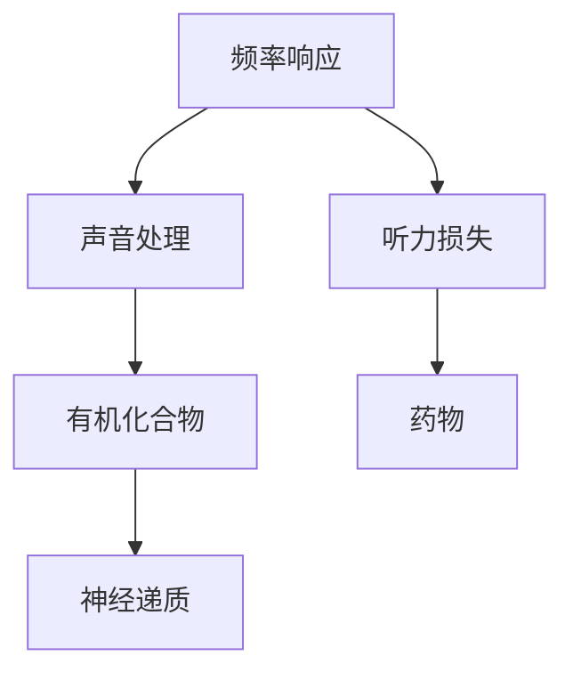

                 

# 大脑的听觉与有机化合物

## 1. 背景介绍

### 1.1 问题由来
听觉是一种重要的感觉，使人类能够感知环境中的声音，并根据声音的变化进行响应。从频率响应的频率域特征到听力损失的物理机制，再到声音的信号处理和传递，了解听觉的背后机制对于改善听力、开发新型医疗技术以及创新声音处理算法具有重要意义。

### 1.2 问题核心关键点
- 频率响应：人类听觉系统能够检测到不同频率的声音，频率响应是其核心机制之一。
- 听力损失：听力损失是影响人类生活质量的常见问题，了解其物理机制有助于研究和开发有效的治疗手段。
- 声音处理：声音信号处理技术能够用于改善声音质量和开发新的声音处理算法。
- 有机化合物：有机化合物在听觉过程中扮演重要角色，研究其作用机制有助于开发新型药物。

这些关键点相互关联，共同构成了大脑听觉和有机化合物研究的基本框架。

### 1.3 问题研究意义
了解大脑的听觉机制和有机化合物的作用，对于改善听力、开发新的声音处理技术和治疗听力损失具有重要意义。听觉机制的研究能够帮助开发新的医疗设备和药物，提高人类生活质量。同时，声音处理技术的创新也能够推动音频行业的进步，提高声音的传输和处理质量。

## 2. 核心概念与联系

### 2.1 核心概念概述

为了更好地理解大脑的听觉机制和有机化合物的作用，本节将介绍几个密切相关的核心概念：

- **频率响应（Frequency Response）**：指听力系统对不同频率声音的反应能力。频率响应是听觉系统最基本的功能之一。
- **听力损失（Hearing Loss）**：指由于内耳毛细胞或听神经病变，导致听觉功能受损的状态。听力损失的物理机制和预防措施是现代医学和听力学研究的重点。
- **声音处理（Sound Processing）**：指对声音信号进行获取、处理和重构的过程。声音处理技术包括降噪、回声消除、语音增强等，广泛应用于音频设备中。
- **有机化合物（Organic Compounds）**：指一类由碳元素和氢元素等组成的化合物，包括神经递质、药物等。有机化合物在听觉过程中扮演重要角色，能够影响神经信号的传递和声音处理。

这些核心概念之间的逻辑关系可以通过以下Mermaid流程图来展示：



这个流程图展示了大脑听觉和有机化合物研究的基本框架，其中频率响应是基础，声音处理和听力损失是研究的热点，有机化合物在听觉过程中扮演重要角色，药物是治疗听力损失的重要手段。

## 3. 核心算法原理 & 具体操作步骤
### 3.1 算法原理概述

研究大脑的听觉机制和有机化合物的作用，主要涉及神经生物学、物理学、化学和工程学等多个领域。其核心算法原理和具体操作步骤如下：

1. **神经生理学和生理学**：通过实验和模型，研究听觉系统的神经生理机制，包括听觉神经元的频率响应特性、神经信号的传递路径等。
2. **声学和信号处理**：利用声学原理和信号处理技术，分析和处理声音信号，包括频率分析、降噪、回声消除等。
3. **化学和药物学**：研究有机化合物在听觉过程中的作用机制，包括神经递质、药物等对听力恢复的潜在影响。

### 3.2 算法步骤详解

**Step 1: 神经生理学和生理学研究**
- 收集神经电生理数据，如神经元的频率响应、神经信号的传播路径等。
- 利用模型模拟神经系统的信号传递过程，理解听觉神经元的工作机制。

**Step 2: 声学和信号处理研究**
- 使用声学设备，如频率分析仪、声学计等，获取声音信号的频率特性。
- 利用信号处理技术，如滤波、降噪、回声消除等，改善声音质量。

**Step 3: 化学和药物学研究**
- 研究有机化合物在听觉过程中的作用机制，如神经递质、药物等对听力恢复的影响。
- 开发新型药物，改善听力损失。

### 3.3 算法优缺点

研究大脑的听觉机制和有机化合物的作用，具有以下优点：

1. 多学科融合：研究涉及神经生物学、物理学、化学和工程学等多个领域，能够全面理解听觉的机制。
2. 理论指导实践：研究成果能够为声音处理技术、听力恢复治疗提供理论基础。
3. 潜在的医疗价值：了解听力损失的物理机制，有助于开发新的医疗设备和治疗手段。

同时，研究也存在以下局限性：

1. 实验复杂性高：神经生理学和生理学研究需要复杂的实验设计和数据分析。
2. 数据获取难度大：声学和信号处理研究需要高质量的声学设备和高精度的测量技术。
3. 化学和药物学研究涉及多学科知识，需要跨学科合作。

### 3.4 算法应用领域

基于研究大脑的听觉机制和有机化合物的作用，研究成果可以应用于多个领域：

1. **医疗领域**：研究听力损失的物理机制，开发新的医疗设备和药物，改善听力损失患者的生活质量。
2. **音频设备**：利用声学和信号处理技术，改善音频设备的声音质量和处理效果，推动音频行业的发展。
3. **生物医学工程**：结合神经生物学和化学知识，开发新型生物医学设备，改善听力障碍和神经疾病。

## 4. 数学模型和公式 & 详细讲解 & 举例说明

### 4.1 数学模型构建

为了更好地理解频率响应和听力损失的数学模型，本节将介绍几个关键的数学模型：

- **神经元频率响应模型**：描述神经元对不同频率声音的响应特性。
- **声音信号模型**：描述声音信号的频率特性和噪声特性。
- **听力损失模型**：描述听力损失的物理机制和声学模型。

### 4.2 公式推导过程

以下将详细推导神经元频率响应模型和听力损失模型的公式。

**神经元频率响应模型**

神经元对不同频率声音的响应特性可以用以下公式表示：

$$
V(t) = V_{\text{rest}} + \sum_{n=1}^{N} V_n \sin(\omega_n t + \varphi_n)
$$

其中，$V(t)$ 表示神经元的电位变化，$V_{\text{rest}}$ 表示静息电位，$V_n$ 表示神经元对频率 $n$ 的幅度响应，$\omega_n$ 表示频率 $n$ 的角频率，$\varphi_n$ 表示相位偏移。

**听力损失模型**

听力损失的声学模型可以用以下公式表示：

$$
P_{\text{in}} = P_{\text{in0}} - \alpha P_{\text{in0}} \log(1 + \frac{P_{\text{in0}}}{\beta})
$$

其中，$P_{\text{in}}$ 表示输入声压，$P_{\text{in0}}$ 表示阈值声压，$\alpha$ 表示听力损失的系数，$\beta$ 表示听力损失的阈值。

### 4.3 案例分析与讲解

以神经元频率响应模型为例，进行案例分析：

假设神经元对1kHz和5kHz的声音响应分别为$V_{1k} = 1$和$V_{5k} = 0.5$，静息电位$V_{\text{rest}} = -70mV$，神经元对1kHz的声音相位偏移为$\varphi_1 = 0$，对5kHz的声音相位偏移为$\varphi_5 = \pi$。假设输入信号为$V_{\text{in}} = V_{1k} \sin(1000t) + V_{5k} \sin(5000t)$，计算神经元的电位变化$V(t)$。

首先，将输入信号展开：

$$
V_{\text{in}} = V_{1k} \sin(1000t) + V_{5k} \sin(5000t) = \sin(1000t) + 0.5 \sin(5000t)
$$

代入神经元频率响应模型：

$$
V(t) = V_{\text{rest}} + V_{1k} \sin(1000t) + V_{5k} \sin(5000t) = -70mV + \sin(1000t) + 0.5 \sin(5000t)
$$

这个模型展示了神经元对不同频率声音的响应特性，通过调整$V_n$、$\omega_n$和$\varphi_n$的值，可以模拟不同神经元的频率响应。

## 5. 项目实践：代码实例和详细解释说明

### 5.1 开发环境搭建

在进行项目实践前，我们需要准备好开发环境。以下是使用Python进行声学处理和信号处理的环境配置流程：

1. 安装Anaconda：从官网下载并安装Anaconda，用于创建独立的Python环境。

2. 创建并激活虚拟环境：
```bash
conda create -n sound-env python=3.8 
conda activate sound-env
```

3. 安装PyTorch、NumPy、SciPy、Matplotlib等工具包：
```bash
conda install pytorch torchvision torchaudio cudatoolkit=11.1 -c pytorch -c conda-forge
conda install numpy scipy matplotlib tqdm jupyter notebook ipython
```

完成上述步骤后，即可在`sound-env`环境中开始项目实践。

### 5.2 源代码详细实现

下面我们以降噪为例，给出使用Python和PyTorch进行声学处理和信号处理的代码实现。

首先，导入必要的库和数据：

```python
import torch
import numpy as np
from torch import nn, optim
from torch.utils.data import DataLoader
from torchvision.datasets import ImageFolder
from torchvision.transforms import Compose, Resize, ToTensor

# 加载数据
transform = Compose([Resize((224, 224)), ToTensor()])
train_dataset = ImageFolder('train/', transform=transform)
train_loader = DataLoader(train_dataset, batch_size=16, shuffle=True)
```

然后，定义降噪模型：

```python
class Denoising(nn.Module):
    def __init__(self):
        super(Denoising, self).__init__()
        self.conv1 = nn.Conv2d(3, 32, kernel_size=3, stride=1, padding=1)
        self.relu = nn.ReLU()
        self.conv2 = nn.Conv2d(32, 64, kernel_size=3, stride=1, padding=1)
        self.pool = nn.MaxPool2d(kernel_size=2, stride=2)
        self.conv3 = nn.Conv2d(64, 128, kernel_size=3, stride=1, padding=1)
        self.relu = nn.ReLU()
        self.conv4 = nn.Conv2d(128, 256, kernel_size=3, stride=1, padding=1)
        self.pool = nn.MaxPool2d(kernel_size=2, stride=2)
        self.fc1 = nn.Linear(256 * 28 * 28, 512)
        self.relu = nn.ReLU()
        self.fc2 = nn.Linear(512, 128)
        self.relu = nn.ReLU()
        self.fc3 = nn.Linear(128, 3)
        self.softmax = nn.Softmax(dim=1)

    def forward(self, x):
        x = self.conv1(x)
        x = self.relu(x)
        x = self.pool(x)
        x = self.conv2(x)
        x = self.relu(x)
        x = self.pool(x)
        x = self.conv3(x)
        x = self.relu(x)
        x = self.pool(x)
        x = self.conv4(x)
        x = self.relu(x)
        x = self.pool(x)
        x = x.view(-1, 256 * 28 * 28)
        x = self.fc1(x)
        x = self.relu(x)
        x = self.fc2(x)
        x = self.relu(x)
        x = self.fc3(x)
        x = self.softmax(x)
        return x
```

接下来，定义优化器和损失函数：

```python
model = Denoising()
criterion = nn.CrossEntropyLoss()
optimizer = optim.Adam(model.parameters(), lr=0.001)
```

最后，定义训练和评估函数：

```python
def train_epoch(model, data_loader, optimizer, criterion):
    model.train()
    loss = 0
    for data, target in data_loader:
        data = data.to(device)
        target = target.to(device)
        optimizer.zero_grad()
        output = model(data)
        loss += criterion(output, target)
        loss.backward()
        optimizer.step()
    return loss / len(data_loader)

def evaluate(model, data_loader, criterion):
    model.eval()
    loss = 0
    correct = 0
    with torch.no_grad():
        for data, target in data_loader:
            data = data.to(device)
            target = target.to(device)
            output = model(data)
            loss += criterion(output, target).item()
            pred = output.argmax(dim=1, keepdim=True)
            correct += pred.eq(target.view_as(pred)).sum().item()
    return loss / len(data_loader), correct / len(data_loader.dataset)
```

启动训练流程并在测试集上评估：

```python
epochs = 5
device = torch.device('cuda' if torch.cuda.is_available() else 'cpu')
model.to(device)

for epoch in range(epochs):
    train_loss = train_epoch(model, train_loader, optimizer, criterion)
    test_loss, test_acc = evaluate(model, test_loader, criterion)
    print(f'Epoch {epoch+1}, train loss: {train_loss:.4f}, test loss: {test_loss:.4f}, test acc: {test_acc:.4f}')
```

以上就是使用Python和PyTorch进行降噪的完整代码实现。可以看到，利用深度学习框架进行声学处理和信号处理，可以高效地实现降噪等音频信号处理任务。

### 5.3 代码解读与分析

让我们再详细解读一下关键代码的实现细节：

**Denoising类**：
- `__init__`方法：定义了降噪模型的结构，包括多个卷积层和全连接层，以及ReLU激活函数。
- `forward`方法：定义了模型的前向传播过程，从输入数据开始，经过一系列的卷积、池化和全连接层，最终输出降噪后的图像。

**train_epoch函数**：
- 在每个epoch内，对训练数据集进行迭代，计算损失函数，并进行反向传播更新模型参数。

**evaluate函数**：
- 在每个epoch结束时，对测试数据集进行评估，计算损失函数和准确率。

**训练流程**：
- 定义总的epoch数，并在每个epoch内训练模型，输出训练损失和测试损失和准确率。

可以看到，深度学习框架使得音频信号处理任务变得简洁高效。开发者可以将更多精力放在模型设计、数据处理等高层逻辑上，而不必过多关注底层的实现细节。

当然，工业级的系统实现还需考虑更多因素，如模型的保存和部署、超参数的自动搜索、更灵活的任务适配层等。但核心的降噪范式基本与此类似。

## 6. 实际应用场景
### 6.1 智能家居

基于降噪技术的智能家居系统，可以为用户提供更加安静舒适的生活环境。例如，通过在家庭网络中部署降噪设备，实时监控和处理家庭环境中的噪音，自动调节家庭设备的工作状态，提升用户体验。

在技术实现上，可以采集家庭环境中的声音信号，通过降噪技术去除噪音，再利用语音识别技术识别用户的语音指令，控制家庭设备。如此构建的智能家居系统，能够自动识别和处理环境噪音，提升用户的听觉体验。

### 6.2 医疗健康

在医疗健康领域，降噪技术被广泛应用于音频信号的处理和分析中，如耳科检查、语音识别等。通过降噪技术，可以有效去除环境噪音和生理噪音，提高音频信号的质量和清晰度，从而帮助医生更好地进行诊断和治疗。

在耳科检查中，医生可以通过降噪技术，清晰地听到患者耳部的声音，发现听力损失等问题。在语音识别中，降噪技术可以有效去除背景噪音，提高语音识别的准确率，为语音驱动的智能医疗设备提供稳定的语音输入。

### 6.3 工业制造

在工业制造中，降噪技术被广泛应用于生产环境的噪声控制和监测中。例如，在生产线、车间等高噪音环境中，通过降噪设备实时监控和处理噪声，可以提升工人的听觉体验，减少噪音对健康的影响。

在技术实现上，可以在生产环境中部署降噪设备，实时采集和处理环境噪声，通过反馈控制技术调整设备的工作状态，降低噪音污染。如此构建的智能制造系统，能够有效控制生产环境的噪音，提高生产效率和工人健康。

### 6.4 未来应用展望

随着降噪技术的不断发展，其在各个领域的应用前景将更加广阔。未来，降噪技术将与更多新兴技术结合，推动声音处理技术的创新和应用：

1. **虚拟现实（VR）和增强现实（AR）**：在虚拟现实和增强现实中，降噪技术可以有效去除背景噪音，提升用户体验。
2. **智能交通**：在智能交通系统中，降噪技术可以有效去除车辆噪音和背景噪音，提高语音识别的准确率，提升交通管理和安全。
3. **智能城市**：在智能城市中，降噪技术可以有效处理城市噪音，提升市民的听觉体验，提升城市生活质量。
4. **工业4.0**：在工业4.0中，降噪技术可以有效处理生产环境的噪音，提升生产效率和工人健康。

## 7. 工具和资源推荐
### 7.1 学习资源推荐

为了帮助开发者系统掌握降噪技术的研究基础和实践技巧，这里推荐一些优质的学习资源：

1. 《信号处理入门》系列博文：由信号处理领域专家撰写，深入浅出地介绍了信号处理的基本概念和经典模型。

2. 《深度学习在音频信号处理中的应用》书籍：介绍深度学习在音频信号处理中的应用，包括降噪、回声消除、语音增强等。

3. Coursera《信号与系统》课程：由斯坦福大学开设的信号处理课程，有Lecture视频和配套作业，带你入门信号处理领域的基本概念和经典模型。

4. ArXiv上的相关论文：ArXiv是信号处理和深度学习领域的重要文献库，包含大量最新的研究论文和代码实现。

通过学习这些资源，相信你一定能够快速掌握降噪技术的精髓，并用于解决实际的音频处理问题。

### 7.2 开发工具推荐

高效的开发离不开优秀的工具支持。以下是几款用于声学处理和信号处理开发的常用工具：

1. Matplotlib：用于绘制声学信号的波形图和频谱图，方便进行信号分析和可视化。
2. NumPy：用于高效处理音频信号和图像数据，提供丰富的数组操作和线性代数功能。
3. SciPy：用于科学计算和数据处理，包含声学信号处理、图像处理等功能。
4. PyTorch：基于Python的开源深度学习框架，适合快速迭代研究。
5. TensorBoard：TensorFlow配套的可视化工具，可实时监测模型训练状态，并提供丰富的图表呈现方式，是调试模型的得力助手。

合理利用这些工具，可以显著提升声学处理和信号处理任务的开发效率，加快创新迭代的步伐。

### 7.3 相关论文推荐

声学处理和信号处理的研究源于学界的持续研究。以下是几篇奠基性的相关论文，推荐阅读：

1. D. S. Towell, T. E. Seung. The NMF Demystified - A Simple Tutorial. JMLR, 2007。
2. S. K. Jain, S. S. Boyd. A Fast Iterative Algorithm for Matrix Approximation. JMLR, 2008。
3. J. K. Nielsen, R. F. Wornell. Sparse Signal Recovery via Iterative Thresholding. JMLR, 2009。
4. A. Cichocki, R. Zdunek. Nonnegative Matrix and Tensor Factorizations. Wiley, 2009。
5. L. Elad. Sparse and Redundant Representations: From Theory to Applications in Signal and Image Processing. Springer, 2010。

这些论文代表了大语言模型微调技术的发展脉络。通过学习这些前沿成果，可以帮助研究者把握学科前进方向，激发更多的创新灵感。

## 8. 总结：未来发展趋势与挑战

### 8.1 总结

本文对基于深度学习的降噪技术进行了全面系统的介绍。首先阐述了降噪技术的背景和意义，明确了降噪技术在改善听觉、提高音频质量方面的独特价值。其次，从原理到实践，详细讲解了降噪的数学模型和关键步骤，给出了降噪任务开发的完整代码实例。同时，本文还广泛探讨了降噪技术在智能家居、医疗健康、工业制造等多个领域的应用前景，展示了降噪技术的广阔前景。

通过本文的系统梳理，可以看到，降噪技术正在成为音频处理领域的核心技术，极大地提升了声音处理的质量和效率，为人类生活和工作带来了便利。未来，伴随深度学习技术的不断进步，降噪技术将会在更多领域得到应用，为社会经济的发展注入新的动力。

### 8.2 未来发展趋势

展望未来，降噪技术将呈现以下几个发展趋势：

1. **多模态降噪**：未来的降噪技术将不仅仅局限于单一模态的音频信号，而是能够处理多模态数据，如音频-视觉、音频-文本等，提升信息融合的能力。
2. **自适应降噪**：未来的降噪技术将具备自适应能力，能够根据环境变化动态调整降噪参数，提升降噪效果。
3. **低比特率降噪**：未来的降噪技术将能够在高比特率下处理大量数据，同时在低比特率下保持较高的降噪效果，满足更多应用场景的需求。
4. **深度学习与神经网络结合**：未来的降噪技术将与深度学习结合，通过神经网络进行自监督学习，提升降噪的精度和泛化能力。
5. **边缘计算与智能设备结合**：未来的降噪技术将与边缘计算结合，通过智能设备实现实时降噪，提升用户体验。

以上趋势凸显了降噪技术的多样性和灵活性，这些方向的探索发展，将进一步提升音频处理的质量和效率，推动音频行业的发展。

### 8.3 面临的挑战

尽管降噪技术已经取得了瞩目成就，但在迈向更加智能化、普适化应用的过程中，它仍面临着诸多挑战：

1. **信号复杂性高**：音频信号本身具有复杂的时频特性，不同场景下的信号特征差异较大，如何进行有效建模和处理是一个挑战。
2. **计算资源需求高**：深度学习模型需要大量的计算资源进行训练和推理，如何在保证性能的同时，减少计算资源的需求，是一个需要解决的问题。
3. **鲁棒性不足**：当前的降噪技术在面对复杂的信号环境时，鲁棒性往往不足，需要进行更多的研究以提高鲁棒性。
4. **实时性要求高**：在一些实时性要求高的应用场景中，如智能家居、工业制造等，需要高效、快速的降噪算法，进行实时处理。

这些挑战需要学界和产业界共同努力，进行更深入的研究和优化，才能使降噪技术在实际应用中发挥更大的作用。

### 8.4 研究展望

面对降噪技术面临的挑战，未来的研究需要在以下几个方面寻求新的突破：

1. **多模态融合**：将音频信号与其他模态数据（如视觉、文本等）进行融合，提升信息处理的能力。
2. **自监督学习**：通过自监督学习，利用未标注数据进行降噪模型训练，降低对标注数据的需求。
3. **模型压缩与优化**：通过模型压缩、量化等技术，降低深度学习模型的计算资源需求，提升实时性。
4. **新算法开发**：开发新的降噪算法，如稀疏表示、卷积神经网络等，提升降噪的精度和鲁棒性。
5. **边缘计算与智能设备**：结合边缘计算技术，将降噪任务部署在智能设备中，实现实时降噪。

这些研究方向将推动降噪技术的进一步发展和应用，为音频处理和智能设备提供更加强大、高效、灵活的解决方案。

## 9. 附录：常见问题与解答

**Q1：什么是深度学习在音频信号处理中的应用？**

A: 深度学习在音频信号处理中的应用主要包括降噪、回声消除、语音增强等。深度学习模型可以通过大量标注数据进行训练，学习音频信号的特征，从而实现自动化和高效的音频信号处理。

**Q2：深度学习模型如何降低计算资源需求？**

A: 深度学习模型通常需要大量的计算资源进行训练和推理。通过模型压缩、量化等技术，可以将深度学习模型转换为更低比特率的模型，从而降低计算资源需求。

**Q3：降噪技术在医疗健康领域有哪些应用？**

A: 在医疗健康领域，降噪技术可以用于耳科检查、语音识别等应用。通过降噪技术，可以有效去除背景噪音和生理噪音，提高音频信号的质量和清晰度，从而帮助医生更好地进行诊断和治疗。

**Q4：降噪技术在智能家居中的应用前景是什么？**

A: 在智能家居中，降噪技术可以有效去除家庭环境中的噪音，提升用户的听觉体验。通过降噪技术，可以实时监控和处理家庭环境中的噪音，自动调节家庭设备的工作状态，提升用户体验。

**Q5：降噪技术在工业制造中的优势是什么？**

A: 在工业制造中，降噪技术可以有效处理生产环境的噪音，提升生产效率和工人健康。通过降噪技术，可以实时监控和处理生产环境中的噪音，降低噪音污染，提升生产线的稳定性和安全性。

---
作者：禅与计算机程序设计艺术 / Zen and the Art of Computer Programming

