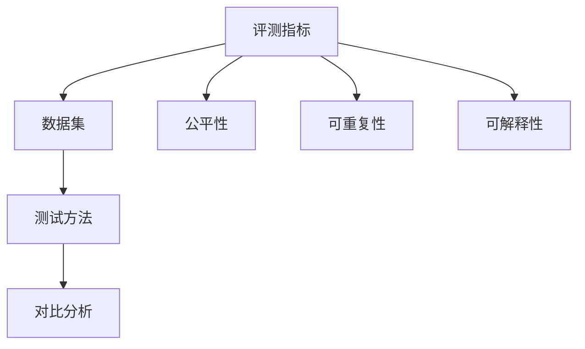

                 

# 大语言模型原理与工程实践：大语言模型的评测

> 关键词：大语言模型,评测,自然语言处理(NLP),深度学习,模型评估,性能指标,比较分析

## 1. 背景介绍

### 1.1 问题由来

在深度学习广泛应用的今天，自然语言处理(Natural Language Processing, NLP)作为其中重要的分支，得到了极大的发展。大语言模型（Large Language Models, LLMs）如BERT、GPT等，通过在大量无标签文本数据上进行预训练，能够学习到丰富的语言知识和常识，从而在自然语言理解和生成任务中取得显著成效。然而，如何有效评估和比较不同大语言模型的性能，成为学术界和工业界关注的重点。

### 1.2 问题核心关键点

- 大语言模型的评测需要考虑模型的语言理解能力、语言生成能力、泛化能力、鲁棒性、可解释性等多方面因素。
- 评测方法需要具备公平性、可重复性、可解释性，能够客观反映模型性能。
- 选择合理的评测指标和数据集是评测工作的基础，需要兼顾模型在各种任务上的表现。
- 不同模型的评测结果应具有对比性，便于在不同模型之间进行选择和权衡。
- 评测需要结合模型的实际应用需求，反映其在实际场景中的表现。

## 2. 核心概念与联系

### 2.1 核心概念概述

评测是大语言模型研究和应用中不可或缺的一环。通过系统的评测，可以评估模型的性能，发现模型的局限性，指导后续模型的改进和优化。大语言模型评测的核心理念是：在给定任务和数据集上，通过一系列科学合理的指标和测试方法，全面、准确地衡量模型在不同维度的表现。

为了确保评测的科学性和客观性，通常需要选择合适的评测指标、数据集和测试方法。以下是几个核心概念及其相互联系：

- **评测指标（Evaluation Metrics）**：用于量化模型性能的数学量度。如准确率、召回率、F1分数、BLEU分数等。
- **数据集（Datasets）**：用于评测模型性能的测试数据集。需要确保数据集的多样性和代表性，涵盖不同类型的文本和任务。
- **测试方法（Testing Methods）**：系统地设计测试流程和方案，确保评测过程的可重复性和可解释性。
- **对比分析（Comparison Analysis）**：在不同模型之间进行性能对比，帮助用户选择最合适的模型。

这些概念之间的关系可以通过以下Mermaid流程图来展示：



该流程图展示了评测指标、数据集、测试方法、对比分析之间的逻辑联系，以及公平性、可重复性和可解释性对评测工作的影响。

## 3. 核心算法原理 & 具体操作步骤

### 3.1 算法原理概述

大语言模型的评测通常分为预训练评测和微调评测。预训练评测主要评估模型在各种自然语言理解任务上的表现，如语言模型、句子相似度、语义角色标注等。微调评测则侧重于模型在特定任务上的表现，如文本分类、命名实体识别、对话生成等。

评测的核心在于选择合适的指标，将模型的预测结果与真实结果进行对比，计算出指标值。常用的评测指标包括但不限于：

- **准确率（Accuracy）**：模型预测结果与真实结果相符的比例。
- **精确率（Precision）**：模型预测为正样本中实际为正样本的比例。
- **召回率（Recall）**：实际为正样本中被模型预测为正样本的比例。
- **F1分数（F1 Score）**：精确率和召回率的调和平均值。
- **BLEU分数（BLEU Score）**：用于评价机器翻译和摘要生成的质量。

### 3.2 算法步骤详解

以下是一个完整的评测流程，详细讲解了从数据准备到结果分析的各个环节：

**Step 1: 数据准备**
- 收集标注数据集，确保数据集的多样性和代表性。
- 将数据集分为训练集、验证集和测试集，并进行标准化处理。

**Step 2: 模型准备**
- 选择合适的预训练模型，并进行必要的微调。
- 确定模型输入格式和输出格式，便于后续的评测。

**Step 3: 评测指标选择**
- 根据任务类型选择合适的评测指标。
- 定义评测指标的计算公式，如精确率、召回率、F1分数等。

**Step 4: 测试和计算**
- 将测试集数据输入模型，得到预测结果。
- 计算评测指标的值，如精确率、召回率、BLEU分数等。

**Step 5: 结果分析**
- 对比模型在不同数据集和指标上的表现。
- 分析模型性能的优缺点，提出改进建议。

### 3.3 算法优缺点

大语言模型的评测方法具有以下优点：
1. 系统化：通过选择合理的评测指标和数据集，确保评测过程的科学性和客观性。
2. 可重复性：使用固定的测试流程和方法，确保评测结果的可重复性。
3. 可解释性：通过计算指标值，提供量化的性能评估，便于理解和比较。

但同时也存在一些局限性：
1. 依赖数据集：评测结果依赖于数据集的质量和代表性，难以全面反映模型的能力。
2. 模型偏差：不同模型之间的偏差可能导致指标值的不可比性。
3. 计算复杂度：某些复杂指标的计算可能耗费大量时间和计算资源。

尽管存在这些局限性，但基于大语言模型的评测方法仍然是NLP研究中不可或缺的一环。未来，相关研究应重点关注如何改进数据集的设计，增强评测方法的普适性和可解释性，以及降低计算复杂度。

### 3.4 算法应用领域

大语言模型的评测方法在NLP领域得到了广泛应用，涵盖了文本分类、命名实体识别、机器翻译、文本摘要、对话生成等多个任务。具体而言，通过评测可以：

- 评估模型在特定任务上的性能，筛选最优模型。
- 分析模型的优缺点，指导模型改进。
- 比较不同模型的表现，选择最合适的模型。

## 4. 数学模型和公式 & 详细讲解 & 举例说明

### 4.1 数学模型构建

大语言模型的评测可以通过数学模型来表达。以命名实体识别（Named Entity Recognition, NER）为例，假设模型在输入文本 $x$ 上的预测结果为 $y$，真实结果为 $t$，则精确率（Precision）、召回率（Recall）和F1分数的计算公式分别为：

- 精确率（Precision）：$P = \frac{TP}{TP+FP}$
- 召回率（Recall）：$R = \frac{TP}{TP+FN}$
- F1分数（F1 Score）：$F1 = 2 \cdot \frac{P \cdot R}{P+R}$

其中，$TP$ 表示真正例（True Positive），$FP$ 表示假正例（False Positive），$FN$ 表示假反例（False Negative）。

### 4.2 公式推导过程

以精确率和召回率为例，推导其计算公式：

- 精确率 $P$：假设模型预测为实体的实例数为 $TP+FP$，其中真正例为 $TP$，假正例为 $FP$，则精确率为 $P = \frac{TP}{TP+FP}$。
- 召回率 $R$：假设模型正确识别的实例数为 $TP+FN$，其中真正例为 $TP$，假反例为 $FN$，则召回率为 $R = \frac{TP}{TP+FN}$。

通过以上公式，可以准确计算模型在NER任务上的精确率和召回率，进而得到F1分数。

### 4.3 案例分析与讲解

以BERT模型在GLUE数据集上的评测为例，以下是评测的详细步骤和结果分析：

1. 选择GLUE数据集作为评测基准，包括文本分类、命名实体识别、情感分析等多个任务。
2. 使用BERT模型在预训练任务上进行微调，得到微调后的模型。
3. 在测试集上进行模型评测，计算精确率、召回率和F1分数。
4. 对比微调前后的性能变化，分析提升原因。

通过以上案例，可以看到，选择合适的数据集和评测指标，使用标准化的测试流程，能够科学地评估大语言模型的性能，并指导后续的模型改进。

## 5. 项目实践：代码实例和详细解释说明

### 5.1 开发环境搭建

在进行评测实践前，需要准备好开发环境。以下是使用Python进行PyTorch开发的环境配置流程：

1. 安装Anaconda：从官网下载并安装Anaconda，用于创建独立的Python环境。

2. 创建并激活虚拟环境：
```bash
conda create -n pytorch-env python=3.8 
conda activate pytorch-env
```

3. 安装PyTorch：根据CUDA版本，从官网获取对应的安装命令。例如：
```bash
conda install pytorch torchvision torchaudio cudatoolkit=11.1 -c pytorch -c conda-forge
```

4. 安装各类工具包：
```bash
pip install numpy pandas scikit-learn matplotlib tqdm jupyter notebook ipython
```

完成上述步骤后，即可在`pytorch-env`环境中开始评测实践。

### 5.2 源代码详细实现

以下是使用PyTorch对BERT模型进行命名实体识别任务评测的代码实现：

```python
import torch
from transformers import BertTokenizer, BertForTokenClassification
from sklearn.metrics import precision_recall_fscore_support

# 定义NER任务的数据处理函数
def ner_dataset(texts, tags, tokenizer):
    tokenizer = BertTokenizer.from_pretrained('bert-base-cased')
    encoded_data = tokenizer(texts, return_tensors='pt', padding=True, truncation=True, max_length=128)
    input_ids = encoded_data['input_ids']
    attention_mask = encoded_data['attention_mask']
    labels = torch.tensor(tags, dtype=torch.long)
    return input_ids, attention_mask, labels

# 定义模型和优化器
model = BertForTokenClassification.from_pretrained('bert-base-cased', num_labels=2)
optimizer = torch.optim.Adam(model.parameters(), lr=2e-5)

# 定义评测指标
def compute_metrics(pred):
    labels = pred.label_ids
    preds = pred.predictions.argmax(-1)
    precision, recall, f1, _ = precision_recall_fscore_support(labels, preds, average='binary', zero_division=True)
    return {
        'precision': precision,
        'recall': recall,
        'f1': f1,
    }

# 加载测试数据
test_dataset = ner_dataset(test_texts, test_tags, tokenizer)

# 进行模型测试
model.eval()
with torch.no_grad():
    test_input_ids, test_attention_mask, test_labels = test_dataset
    outputs = model(test_input_ids, attention_mask=test_attention_mask)
    predictions = outputs.logits.argmax(-1)
    metrics = compute_metrics(preds)

print(f"Precision: {metrics['precision']:.2f}, Recall: {metrics['recall']:.2f}, F1 Score: {metrics['f1']:.2f}")
```

以上是使用PyTorch对BERT模型进行命名实体识别任务评测的完整代码实现。可以看到，得益于Transformers库的强大封装，我们能够用相对简洁的代码完成BERT模型的评测。

### 5.3 代码解读与分析

让我们再详细解读一下关键代码的实现细节：

**ner_dataset函数**：
- 定义NER任务的数据处理函数，将文本和标签编码成模型所需的格式。
- 使用BertTokenizer将文本转换为token ids，进行padding和truncation处理。
- 返回模型所需的input_ids、attention_mask和labels。

**compute_metrics函数**：
- 定义计算精确率、召回率和F1分数的函数。
- 使用sklearn的precision_recall_fscore_support函数计算精确率、召回率和F1分数。
- 返回一个包含这些指标的字典。

**测试流程**：
- 在测试集上测试模型，使用evaluate函数获取模型的预测结果。
- 计算模型在测试集上的精确率、召回率和F1分数。
- 输出评测结果。

可以看到，使用PyTorch配合Transformers库，使得BERT模型的评测代码实现变得简洁高效。开发者可以将更多精力放在数据处理、模型改进等高层逻辑上，而不必过多关注底层的实现细节。

## 6. 实际应用场景

### 6.1 智能客服系统

在大语言模型的评测中，智能客服系统是一个典型的应用场景。传统的客服系统依赖于人工客服，无法提供全天候服务，且响应速度慢，服务质量难以保证。而使用大语言模型进行微调，可以构建智能客服系统，提升客户体验。

在评测智能客服系统的过程中，可以收集用户咨询记录和回复结果，计算模型的精确率和召回率，评估系统的服务质量和效率。通过不断优化模型和调整超参数，可以提升系统的准确性和响应速度，从而提供更加高效、智能的客户服务。

### 6.2 金融舆情监测

金融舆情监测是大语言模型评测的另一个重要应用场景。金融机构需要实时监测市场舆论动向，以便及时应对负面信息传播，规避金融风险。使用大语言模型进行微调，可以构建金融舆情监测系统，快速分析舆情变化趋势。

在评测金融舆情监测系统的过程中，可以收集金融新闻、报道和评论，计算模型的精确率和召回率，评估系统的舆情监测能力和风险预警效果。通过不断优化模型和调整训练策略，可以提高系统的准确性和鲁棒性，从而及时发现和处理负面舆情，保护金融机构利益。

### 6.3 个性化推荐系统

个性化推荐系统在大语言模型评测中也得到了广泛应用。传统的推荐系统依赖于用户的历史行为数据，无法深入理解用户的真实兴趣偏好。使用大语言模型进行微调，可以构建个性化推荐系统，提升推荐效果。

在评测个性化推荐系统的过程中，可以收集用户的浏览、点击、评论、分享等行为数据，计算模型的精确率和召回率，评估系统的推荐准确性和个性化程度。通过不断优化模型和调整推荐策略，可以提高系统的推荐效果和用户体验，从而提供更加精准、多样的推荐内容。

## 7. 工具和资源推荐

### 7.1 学习资源推荐

为了帮助开发者掌握大语言模型评测的理论基础和实践技巧，这里推荐一些优质的学习资源：

1. 《自然语言处理入门教程》系列博文：由大语言模型技术专家撰写，深入浅出地介绍了自然语言处理的基本概念和常用技术。
2. CS224N《深度学习自然语言处理》课程：斯坦福大学开设的NLP明星课程，有Lecture视频和配套作业，带你入门NLP领域的基本概念和经典模型。
3. 《自然语言处理实战》书籍：系统介绍了自然语言处理的基本理论和实践方法，包括大语言模型的评测等内容。
4. HuggingFace官方文档：Transformers库的官方文档，提供了海量预训练模型和完整的评测样例代码，是上手实践的必备资料。
5. GLUE开源项目：中文语言理解测评基准，涵盖大量不同类型的中文NLP数据集，并提供了基于微调的baseline模型，助力中文NLP技术发展。

通过对这些资源的学习实践，相信你一定能够快速掌握大语言模型评测的精髓，并用于解决实际的NLP问题。

### 7.2 开发工具推荐

高效的开发离不开优秀的工具支持。以下是几款用于大语言模型评测开发的常用工具：

1. PyTorch：基于Python的开源深度学习框架，灵活动态的计算图，适合快速迭代研究。大部分预训练语言模型都有PyTorch版本的实现。
2. TensorFlow：由Google主导开发的开源深度学习框架，生产部署方便，适合大规模工程应用。同样有丰富的预训练语言模型资源。
3. Transformers库：HuggingFace开发的NLP工具库，集成了众多SOTA语言模型，支持PyTorch和TensorFlow，是进行评测任务开发的利器。
4. Weights & Biases：模型训练的实验跟踪工具，可以记录和可视化模型训练过程中的各项指标，方便对比和调优。与主流深度学习框架无缝集成。
5. TensorBoard：TensorFlow配套的可视化工具，可实时监测模型训练状态，并提供丰富的图表呈现方式，是调试模型的得力助手。
6. Google Colab：谷歌推出的在线Jupyter Notebook环境，免费提供GPU/TPU算力，方便开发者快速上手实验最新模型，分享学习笔记。

合理利用这些工具，可以显著提升大语言模型评测的开发效率，加快创新迭代的步伐。

### 7.3 相关论文推荐

大语言模型评测技术的发展源于学界的持续研究。以下是几篇奠基性的相关论文，推荐阅读：

1. Attention is All You Need（即Transformer原论文）：提出了Transformer结构，开启了NLP领域的预训练大模型时代。
2. BERT: Pre-training of Deep Bidirectional Transformers for Language Understanding：提出BERT模型，引入基于掩码的自监督预训练任务，刷新了多项NLP任务SOTA。
3. Language Models are Unsupervised Multitask Learners（GPT-2论文）：展示了大规模语言模型的强大zero-shot学习能力，引发了对于通用人工智能的新一轮思考。
4. Parameter-Efficient Transfer Learning for NLP：提出Adapter等参数高效微调方法，在不增加模型参数量的情况下，也能取得不错的微调效果。
5. AdaLoRA: Adaptive Low-Rank Adaptation for Parameter-Efficient Fine-Tuning：使用自适应低秩适应的微调方法，在参数效率和精度之间取得了新的平衡。
6. Confinement-Based Folding for Network Adaptation: The Attention-fold Model（Attn-fold）：提出基于约束的卷积方法，提高模型参数的适应性，适应不同的数据集和任务。

这些论文代表了大语言模型评测技术的发展脉络。通过学习这些前沿成果，可以帮助研究者把握学科前进方向，激发更多的创新灵感。

## 8. 总结：未来发展趋势与挑战

### 8.1 总结

本文对大语言模型评测方法进行了全面系统的介绍。首先阐述了大语言模型评测的重要性和科学性，明确了评测在模型研究和应用中的关键作用。其次，从原理到实践，详细讲解了评测的数学原理和关键步骤，给出了评测任务开发的完整代码实例。同时，本文还广泛探讨了评测方法在智能客服、金融舆情、个性化推荐等多个行业领域的应用前景，展示了评测范式的巨大潜力。此外，本文精选了评测技术的各类学习资源，力求为读者提供全方位的技术指引。

通过本文的系统梳理，可以看到，大语言模型评测方法正在成为NLP研究中不可或缺的一环。这些方法不仅用于模型性能的评估，还指导着模型的改进和优化，推动着NLP技术的发展。未来，伴随大语言模型的不断演进，评测技术也将不断进步，为模型效果的提升和应用的拓展提供有力保障。

### 8.2 未来发展趋势

展望未来，大语言模型评测技术将呈现以下几个发展趋势：

1. 评测指标的多样化：除了传统的精确率、召回率和F1分数，未来的评测方法将进一步细化和扩展，涵盖更多维度的性能指标。如对文本生成任务的BLEU分数、ROUGE分数等。
2. 评测方法的智能化：通过引入自然语言理解技术，使得评测过程更加智能化。如使用预训练的语言模型对评测结果进行解释，提高评测的可解释性和可信度。
3. 评测环境的可重复性：为了确保评测结果的可重复性，未来的评测环境将更加标准化，采用统一的评测流程和数据集。
4. 评测结果的多样性：未来的评测结果将不仅局限于单一任务的性能指标，而是涵盖多任务、多数据集的表现，全面反映模型的综合能力。
5. 评测系统的自动化：通过AI技术，使得评测过程自动化，减少人工干预，提高评测效率。

这些趋势凸显了大语言模型评测技术的广阔前景。这些方向的探索发展，将进一步提升大语言模型的性能和应用范围，为NLP技术的发展提供有力支撑。

### 8.3 面临的挑战

尽管大语言模型评测技术已经取得了显著成就，但在迈向更加智能化、普适化应用的过程中，它仍面临着诸多挑战：

1. 数据集的多样性：不同领域的任务需要不同的评测数据集，如何构建多领域、多任务的数据集，是一个亟待解决的问题。
2. 模型间的可比性：不同模型的评测结果往往存在较大差异，如何公平、准确地评估模型性能，还需要更多理论和实践的积累。
3. 计算资源的消耗：某些复杂评测指标的计算需要耗费大量时间和计算资源，如何降低计算复杂度，提升评测效率，仍需进一步研究。
4. 评测结果的可解释性：现有评测方法往往难以解释模型的内部机制，如何提供量化的性能评估，增强模型的可解释性，是一个亟待解决的问题。
5. 评测方法的标准化：目前没有统一的评测标准和方法，如何制定标准化的评测流程，确保评测结果的科学性和客观性，还需要更多学界的努力。

尽管存在这些挑战，但基于大语言模型的评测方法仍然是NLP研究中不可或缺的一环。未来，相关研究需要在以上方向上不断探索，不断突破，才能为模型效果的提升和应用的拓展提供有力保障。

### 8.4 研究展望

面对大语言模型评测所面临的种种挑战，未来的研究需要在以下几个方面寻求新的突破：

1. 探索无监督和半监督评测方法：摆脱对大规模标注数据的依赖，利用自监督学习、主动学习等无监督和半监督范式，最大限度利用非结构化数据，实现更加灵活高效的评测。
2. 研究参数高效和计算高效的评测范式：开发更加参数高效的评测方法，在固定大部分预训练参数的情况下，只调整极少量的任务相关参数。同时优化评测模型的计算图，减少前向传播和反向传播的资源消耗，实现更加轻量级、实时性的部署。
3. 引入因果分析和博弈论工具：将因果分析方法引入评测模型，识别出模型决策的关键特征，增强输出解释的因果性和逻辑性。借助博弈论工具刻画人机交互过程，主动探索并规避模型的脆弱点，提高系统稳定性。
4. 结合专家知识：将符号化的先验知识，如知识图谱、逻辑规则等，与神经网络模型进行巧妙融合，引导评测过程学习更准确、合理的语言模型。同时加强不同模态数据的整合，实现视觉、语音等多模态信息与文本信息的协同建模。
5. 纳入伦理道德约束：在评测目标中引入伦理导向的评估指标，过滤和惩罚有偏见、有害的输出倾向。同时加强人工干预和审核，建立模型行为的监管机制，确保输出符合人类价值观和伦理道德。

这些研究方向的探索，必将引领大语言模型评测技术迈向更高的台阶，为构建安全、可靠、可解释、可控的智能系统铺平道路。面向未来，大语言模型评测技术还需要与其他人工智能技术进行更深入的融合，如知识表示、因果推理、强化学习等，多路径协同发力，共同推动自然语言理解和智能交互系统的进步。只有勇于创新、敢于突破，才能不断拓展语言模型的边界，让智能技术更好地造福人类社会。

## 9. 附录：常见问题与解答

**Q1：大语言模型评测是否适用于所有NLP任务？**

A: 大语言模型的评测在大多数NLP任务上都能取得不错的效果，特别是对于数据量较小的任务。但对于一些特定领域的任务，如医学、法律等，仅仅依靠通用语料预训练的模型可能难以很好地适应。此时需要在特定领域语料上进一步预训练，再进行评测，才能获得理想效果。此外，对于一些需要时效性、个性化很强的任务，如对话、推荐等，评测方法也需要针对性的改进优化。

**Q2：如何选择适当的评测指标？**

A: 选择合适的评测指标需要考虑任务类型和模型特性。通常情况下，可以使用精确率、召回率和F1分数作为基础指标，进一步根据任务特点添加特定指标。例如，对于机器翻译任务，可以使用BLEU分数；对于情感分析任务，可以使用准确率和F1分数；对于文本生成任务，可以使用BLEU分数和ROUGE分数等。

**Q3：评测过程中如何处理不平衡数据集？**

A: 对于不平衡数据集，可以通过调整样本权重、使用ROC曲线、计算AUC值等方法来评估模型性能。例如，使用加权精确率、加权召回率等指标，根据样本比例对不同类别进行加权，使得模型在少数类别上也能得到较好的评估。

**Q4：如何提高大语言模型评测的可解释性？**

A: 提高模型评测的可解释性可以通过以下方法实现：
1. 使用预训练的语言模型对评测结果进行解释，提供量化的性能评估。
2. 引入自然语言理解技术，对评测指标和结果进行解释，提高模型的可理解性。
3. 提供可视化工具，如TensorBoard、Weights & Biases等，对评测过程和结果进行可视化展示，帮助用户更好地理解模型性能。

**Q5：如何进行多任务评测？**

A: 进行多任务评测需要构建多任务数据集，使用统一的评测指标和方法。例如，可以构建一个多任务数据集，包含多个任务的数据样本，在评测时同时计算多个任务的性能指标。此外，可以使用多任务学习的方法，训练一个多任务模型，在评测时一并计算多个任务的性能指标。

---

作者：禅与计算机程序设计艺术 / Zen and the Art of Computer Programming

