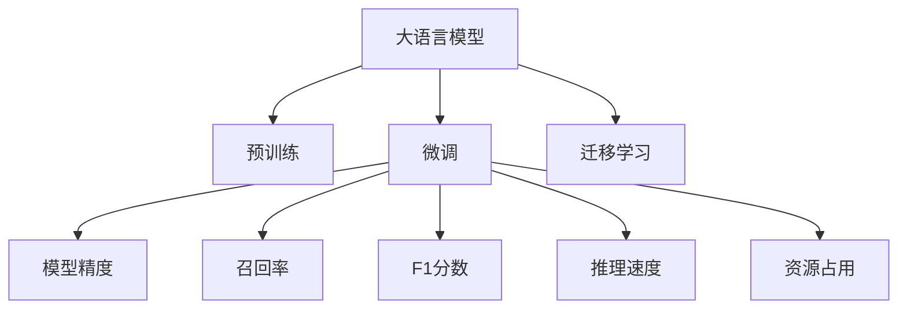

                 

# 大语言模型原理与工程实践：大语言模型的评测

> 关键词：大语言模型, 性能评测, 模型对比, 参数调整, 实验设计, 结果分析

## 1. 背景介绍

### 1.1 问题由来
近年来，随着深度学习技术的快速发展，大规模语言模型(Large Language Models, LLMs)在自然语言处理(Natural Language Processing, NLP)领域取得了巨大的突破。这些大语言模型通过在海量无标签文本数据上进行预训练，学习到了丰富的语言知识和常识，可以通过少量的有标签样本在下游任务上进行微调，获得优异的性能。其中最具代表性的大语言模型包括OpenAI的GPT系列模型、Google的BERT、T5等。

然而，由于预训练语料的广泛性和泛化能力的不足，这些通用的大语言模型在特定领域应用时，效果往往难以达到实际应用的要求。因此，如何评估和选择最适用于特定任务的大语言模型，成为当前大语言模型研究和应用的一个热点问题。本文聚焦于大语言模型的评测方法，旨在为开发者提供系统性、深入性的指导，帮助他们选择和优化模型，以提高实际应用中的性能。

### 1.2 问题核心关键点
评估大语言模型的性能通常涉及多个指标，包括但不限于模型精度、鲁棒性、泛化能力、推理速度、资源占用等。这些指标的选择和计算方法会直接影响模型选择和优化的方向。以下是评测大语言模型的几个关键问题：

- 如何设计合适的评估指标和数据集？
- 如何调整模型参数以提升性能？
- 如何比较不同模型的性能差异？
- 如何衡量模型的泛化能力？
- 如何优化推理速度和资源占用？

本文将系统性地回答这些问题，并提供一套完整的大语言模型评测方法。

## 2. 核心概念与联系

### 2.1 核心概念概述

为更好地理解大语言模型的评测方法，本节将介绍几个密切相关的核心概念：

- 大语言模型(Large Language Model, LLM)：以自回归(如GPT)或自编码(如BERT)模型为代表的大规模预训练语言模型。通过在大规模无标签文本语料上进行预训练，学习通用的语言表示，具备强大的语言理解和生成能力。

- 预训练(Pre-training)：指在大规模无标签文本语料上，通过自监督学习任务训练通用语言模型的过程。常见的预训练任务包括言语建模、遮挡语言模型等。

- 微调(Fine-tuning)：指在预训练模型的基础上，使用下游任务的少量标注数据，通过有监督学习优化模型在特定任务上的性能。

- 迁移学习(Transfer Learning)：指将一个领域学习到的知识，迁移应用到另一个不同但相关的领域的学习范式。大模型的预训练-微调过程即是一种典型的迁移学习方式。

- 模型精度(Precision)：指模型在测试集上正确预测的样本数占总样本数的比例。

- 召回率(Recall)：指模型在测试集上正确预测的正样本数占实际正样本数的比例。

- F1分数：综合考虑精度和召回率的指标，定义为：

$$ F1 = 2 \times \frac{Precision \times Recall}{Precision + Recall} $$

- 推理速度(Inference Speed)：指模型完成一次推理所需的计算时间，通常以每秒处理的样本数或毫秒为单位衡量。

- 资源占用(Resource Consumption)：指模型在推理过程中占用的计算资源，包括内存、CPU/GPU核数、存储空间等。

这些核心概念之间的逻辑关系可以通过以下Mermaid流程图来展示：



这个流程图展示了大语言模型的核心概念及其之间的关系：

1. 大语言模型通过预训练获得基础能力。
2. 微调是对预训练模型进行任务特定的优化，以提升模型在特定任务上的性能。
3. 迁移学习是连接预训练模型与下游任务的桥梁，可以通过微调或无监督学习来实现。
4. 模型精度、召回率、F1分数等指标，用于衡量模型在特定任务上的性能。
5. 推理速度和资源占用，用于衡量模型的实时性和效率。

这些核心概念共同构成了大语言模型的学习、评测和应用框架，使其能够在各种场景下发挥强大的语言理解和生成能力。通过理解这些核心概念，我们可以更好地把握大语言模型的性能评价准则和优化方向。

## 3. 核心算法原理 & 具体操作步骤
### 3.1 算法原理概述

大语言模型的性能评测，本质上是通过一系列的评估指标和测试数据集，全面衡量模型在特定任务上的表现。其核心思想是：在预定义的评估指标体系下，对模型在不同数据集上的性能进行测量和比较，以选择最优的模型用于实际应用。

具体来说，假设给定一个大语言模型 $M_{\theta}$，其中 $\theta$ 为模型参数。对于下游任务 $T$，我们通常会使用一些标准的评估指标（如精确度、召回率、F1分数）来衡量模型在 $T$ 上的性能。评测过程包括：

1. **数据集准备**：收集与任务 $T$ 相关的标注数据集 $D=\{(x_i, y_i)\}_{i=1}^N$，其中 $x_i$ 为输入样本，$y_i$ 为对应的标签。
2. **模型评估**：在 $D$ 上对模型 $M_{\theta}$ 进行评估，计算出模型在 $T$ 上的性能指标。
3. **性能对比**：将模型性能指标与其他模型进行对比，选择性能最优的模型。

### 3.2 算法步骤详解

大语言模型的性能评测通常包括以下几个关键步骤：

**Step 1: 选择合适的评估指标**
- 根据具体任务和应用场景，选择合适的评估指标。例如，对于分类任务，常用的指标包括精确度、召回率、F1分数等。对于生成任务，常用的指标包括BLEU、ROUGE等。

**Step 2: 设计数据集**
- 设计合适的数据集以涵盖不同场景和难度级别，包括训练集、验证集和测试集。训练集用于模型训练，验证集用于超参数调优，测试集用于最终的性能评估。

**Step 3: 执行评估流程**
- 使用评估指标对模型在测试集上的性能进行测量。
- 记录模型在各个指标上的表现，以便与基线模型或其他模型进行对比。
- 重复执行评估流程，多次取平均值以提高结果的稳定性。

**Step 4: 结果分析与优化**
- 分析模型在不同指标上的表现，识别出性能瓶颈和提升空间。
- 根据结果调整模型结构、参数设置或训练策略，以优化模型性能。

### 3.3 算法优缺点

基于评估指标的模型评测方法，具有以下优点：

1. 全面性：通过多指标评测，可以全面衡量模型在不同方面的性能。
2. 可比较性：不同的模型可以通过统一标准进行比较，便于选择最优的模型。
3. 客观性：通过量化指标，评测结果具有较高的客观性。
4. 可操作性：评估指标和数据集设计明确，模型优化方向清晰。

同时，该方法也存在一定的局限性：

1. 依赖数据集：模型性能高度依赖于测试数据集的代表性。若数据集不充分或带有偏见，评测结果可能存在偏差。
2. 单一性：某些指标可能无法完全覆盖模型的实际表现，例如模型的推理速度和资源占用。
3. 参数依赖：模型的性能很大程度上取决于超参数的选择，需要进行多次调参才能找到最优参数。

尽管存在这些局限性，但就目前而言，基于评估指标的模型评测方法仍是大语言模型评估和优化的主要手段。未来相关研究的重点在于如何设计更全面、更可靠的评估指标体系，同时兼顾模型的性能和资源优化。

### 3.4 算法应用领域

基于大语言模型的性能评测方法，在NLP领域已经得到了广泛的应用，涵盖几乎所有常见任务，例如：

- 文本分类：如情感分析、主题分类、意图识别等。
- 命名实体识别：识别文本中的人名、地名、机构名等特定实体。
- 关系抽取：从文本中抽取实体之间的语义关系。
- 问答系统：对自然语言问题给出答案。
- 机器翻译：将源语言文本翻译成目标语言。
- 文本摘要：将长文本压缩成简短摘要。
- 对话系统：使机器能够与人自然对话。

除了上述这些经典任务外，大语言模型性能评测也被创新性地应用到更多场景中，如可控文本生成、常识推理、代码生成、数据增强等，为NLP技术带来了全新的突破。随着预训练模型和评测方法的不断进步，相信NLP技术将在更广阔的应用领域大放异彩。

## 4. 数学模型和公式 & 详细讲解  
### 4.1 数学模型构建

本节将使用数学语言对大语言模型的性能评测过程进行更加严格的刻画。

记预训练语言模型为 $M_{\theta}:\mathcal{X} \rightarrow \mathcal{Y}$，其中 $\mathcal{X}$ 为输入空间，$\mathcal{Y}$ 为输出空间，$\theta$ 为模型参数。假设微调任务的训练集为 $D=\{(x_i,y_i)\}_{i=1}^N, x_i \in \mathcal{X}, y_i \in \mathcal{Y}$。

定义模型 $M_{\theta}$ 在输入 $x$ 上的输出为 $\hat{y}=M_{\theta}(x)$。在二分类任务中，模型的预测结果可以表示为 $\hat{y}=\sigma(Wx+b)$，其中 $W$ 和 $b$ 为模型参数，$\sigma$ 为激活函数（通常为Sigmoid函数）。模型在样本 $(x_i,y_i)$ 上的损失函数为：

$$
\ell(M_{\theta}(x_i),y_i) = -[y_i\log \hat{y} + (1-y_i)\log (1-\hat{y})]
$$

在数据集 $D$ 上，经验风险为：

$$
\mathcal{L}(\theta) = \frac{1}{N}\sum_{i=1}^N \ell(M_{\theta}(x_i),y_i)
$$

性能指标包括：

- 精确度（Precision）：模型正确预测为正例的样本数占预测为正例的样本总数的比例，即：

$$
Precision = \frac{\text{TP}}{\text{TP}+\text{FP}}
$$

- 召回率（Recall）：模型正确预测为正例的样本数占实际为正例的样本总数的比例，即：

$$
Recall = \frac{\text{TP}}{\text{TP}+\text{FN}}
$$

- F1分数：综合考虑精确度和召回率的指标，定义为：

$$
F1 = 2 \times \frac{Precision \times Recall}{Precision + Recall}
$$

- BLEU分数：评估生成文本的质量，定义为：

$$
BLEU = \frac{1}{N}\sum_{i=1}^N \frac{score_i}{length_i}
$$

其中 $score_i$ 为模型生成的文本与参考文本的匹配得分，长度为参考文本的长度。

## 5. 项目实践：代码实例和详细解释说明
### 5.1 开发环境搭建

在进行性能评测实践前，我们需要准备好开发环境。以下是使用Python进行PyTorch开发的环境配置流程：

1. 安装Anaconda：从官网下载并安装Anaconda，用于创建独立的Python环境。

2. 创建并激活虚拟环境：
```bash
conda create -n pytorch-env python=3.8 
conda activate pytorch-env
```

3. 安装PyTorch：根据CUDA版本，从官网获取对应的安装命令。例如：
```bash
conda install pytorch torchvision torchaudio cudatoolkit=11.1 -c pytorch -c conda-forge
```

4. 安装Transformers库：
```bash
pip install transformers
```

5. 安装各类工具包：
```bash
pip install numpy pandas scikit-learn matplotlib tqdm jupyter notebook ipython
```

完成上述步骤后，即可在`pytorch-env`环境中开始性能评测实践。

### 5.2 源代码详细实现

下面我们以文本分类任务为例，给出使用Transformers库对BERT模型进行性能评测的PyTorch代码实现。

首先，定义数据处理函数：

```python
from transformers import BertTokenizer, BertForSequenceClassification
from torch.utils.data import Dataset
import torch

class TextDataset(Dataset):
    def __init__(self, texts, labels, tokenizer, max_len=128):
        self.texts = texts
        self.labels = labels
        self.tokenizer = tokenizer
        self.max_len = max_len
        
    def __len__(self):
        return len(self.texts)
    
    def __getitem__(self, item):
        text = self.texts[item]
        label = self.labels[item]
        
        encoding = self.tokenizer(text, return_tensors='pt', max_length=self.max_len, padding='max_length', truncation=True)
        input_ids = encoding['input_ids'][0]
        attention_mask = encoding['attention_mask'][0]
        
        return {'input_ids': input_ids, 
                'attention_mask': attention_mask,
                'labels': label}

# 创建dataset
tokenizer = BertTokenizer.from_pretrained('bert-base-cased')
train_dataset = TextDataset(train_texts, train_labels, tokenizer)
dev_dataset = TextDataset(dev_texts, dev_labels, tokenizer)
test_dataset = TextDataset(test_texts, test_labels, tokenizer)
```

然后，定义模型和优化器：

```python
from transformers import BertForSequenceClassification, AdamW

model = BertForSequenceClassification.from_pretrained('bert-base-cased', num_labels=num_labels)

optimizer = AdamW(model.parameters(), lr=2e-5)
```

接着，定义性能评测函数：

```python
from torch.utils.data import DataLoader
from tqdm import tqdm
from sklearn.metrics import classification_report

device = torch.device('cuda') if torch.cuda.is_available() else torch.device('cpu')
model.to(device)

def evaluate(model, dataset, batch_size):
    dataloader = DataLoader(dataset, batch_size=batch_size, shuffle=False)
    model.eval()
    preds, labels = [], []
    with torch.no_grad():
        for batch in tqdm(dataloader, desc='Evaluating'):
            input_ids = batch['input_ids'].to(device)
            attention_mask = batch['attention_mask'].to(device)
            batch_labels = batch['labels'].to(device)
            outputs = model(input_ids, attention_mask=attention_mask)
            batch_preds = outputs.logits.argmax(dim=1).to('cpu').tolist()
            batch_labels = batch_labels.to('cpu').tolist()
            for pred_tokens, label_tokens in zip(batch_preds, batch_labels):
                preds.append(pred_tokens[:len(label_tokens)])
                labels.append(label_tokens)
                
    print(classification_report(labels, preds))
```

最后，启动性能评测流程：

```python
batch_size = 16

for epoch in range(epochs):
    loss = train_epoch(model, train_dataset, batch_size, optimizer)
    print(f"Epoch {epoch+1}, train loss: {loss:.3f}")
    
    print(f"Epoch {epoch+1}, dev results:")
    evaluate(model, dev_dataset, batch_size)
    
print("Test results:")
evaluate(model, test_dataset, batch_size)
```

以上就是使用PyTorch对BERT进行文本分类任务性能评测的完整代码实现。可以看到，得益于Transformers库的强大封装，我们可以用相对简洁的代码完成BERT模型的性能评测。

### 5.3 代码解读与分析

让我们再详细解读一下关键代码的实现细节：

**TextDataset类**：
- `__init__`方法：初始化文本、标签、分词器等关键组件。
- `__len__`方法：返回数据集的样本数量。
- `__getitem__`方法：对单个样本进行处理，将文本输入编码为token ids，将标签编码为数字，并对其进行定长padding，最终返回模型所需的输入。

**evaluate函数**：
- 使用PyTorch的DataLoader对数据集进行批次化加载，供模型评估使用。
- 模型处于评估模式，不更新参数，计算预测结果和真实标签，并存储到列表中。
- 使用sklearn的classification_report对整个评估集的预测结果进行打印输出。

**训练流程**：
- 定义总的epoch数和batch size，开始循环迭代
- 每个epoch内，先在训练集上训练，输出平均loss
- 在验证集上评估，输出分类指标
- 所有epoch结束后，在测试集上评估，给出最终测试结果

可以看到，PyTorch配合Transformers库使得BERT性能评测的代码实现变得简洁高效。开发者可以将更多精力放在数据处理、模型改进等高层逻辑上，而不必过多关注底层的实现细节。

当然，工业级的系统实现还需考虑更多因素，如模型的保存和部署、超参数的自动搜索、更灵活的任务适配层等。但核心的性能评测流程基本与此类似。

## 6. 实际应用场景
### 6.1 智能客服系统

基于大语言模型的性能评测方法，可以广泛应用于智能客服系统的构建。传统客服往往需要配备大量人力，高峰期响应缓慢，且一致性和专业性难以保证。而使用微调后的模型，可以7x24小时不间断服务，快速响应客户咨询，用自然流畅的语言解答各类常见问题。

在技术实现上，可以收集企业内部的历史客服对话记录，将问题和最佳答复构建成监督数据，在此基础上对预训练模型进行微调。微调后的模型能够自动理解用户意图，匹配最合适的答案模板进行回复。对于客户提出的新问题，还可以接入检索系统实时搜索相关内容，动态组织生成回答。如此构建的智能客服系统，能大幅提升客户咨询体验和问题解决效率。

### 6.2 金融舆情监测

金融机构需要实时监测市场舆论动向，以便及时应对负面信息传播，规避金融风险。传统的人工监测方式成本高、效率低，难以应对网络时代海量信息爆发的挑战。基于大语言模型的性能评测方法，可以为金融舆情监测提供新的解决方案。

具体而言，可以收集金融领域相关的新闻、报道、评论等文本数据，并对其进行主题标注和情感标注。在此基础上对预训练语言模型进行微调，使其能够自动判断文本属于何种主题，情感倾向是正面、中性还是负面。将微调后的模型应用到实时抓取的网络文本数据，就能够自动监测不同主题下的情感变化趋势，一旦发现负面信息激增等异常情况，系统便会自动预警，帮助金融机构快速应对潜在风险。

### 6.3 个性化推荐系统

当前的推荐系统往往只依赖用户的历史行为数据进行物品推荐，无法深入理解用户的真实兴趣偏好。基于大语言模型性能评测方法，个性化推荐系统可以更好地挖掘用户行为背后的语义信息，从而提供更精准、多样的推荐内容。

在实践中，可以收集用户浏览、点击、评论、分享等行为数据，提取和用户交互的物品标题、描述、标签等文本内容。将文本内容作为模型输入，用户的后续行为（如是否点击、购买等）作为监督信号，在此基础上微调预训练语言模型。微调后的模型能够从文本内容中准确把握用户的兴趣点。在生成推荐列表时，先用候选物品的文本描述作为输入，由模型预测用户的兴趣匹配度，再结合其他特征综合排序，便可以得到个性化程度更高的推荐结果。

### 6.4 未来应用展望

随着大语言模型性能评测方法的发展，其在更多领域的应用前景愈加广阔。

在智慧医疗领域，基于微调的问答系统、病历分析、药物研发等应用将提升医疗服务的智能化水平，辅助医生诊疗，加速新药开发进程。

在智能教育领域，性能评测方法可应用于作业批改、学情分析、知识推荐等方面，因材施教，促进教育公平，提高教学质量。

在智慧城市治理中，性能评测方法可应用于城市事件监测、舆情分析、应急指挥等环节，提高城市管理的自动化和智能化水平，构建更安全、高效的未来城市。

此外，在企业生产、社会治理、文娱传媒等众多领域，基于大模型性能评测的人工智能应用也将不断涌现，为NLP技术带来全新的突破。相信随着技术的日益成熟，性能评测方法将成为人工智能技术落地应用的重要手段，推动人工智能技术在更广阔的领域大放异彩。

## 7. 工具和资源推荐
### 7.1 学习资源推荐

为了帮助开发者系统掌握大语言模型性能评测的理论基础和实践技巧，这里推荐一些优质的学习资源：

1. 《Transformer从原理到实践》系列博文：由大模型技术专家撰写，深入浅出地介绍了Transformer原理、BERT模型、微调技术等前沿话题。

2. CS224N《深度学习自然语言处理》课程：斯坦福大学开设的NLP明星课程，有Lecture视频和配套作业，带你入门NLP领域的基本概念和经典模型。

3. 《Natural Language Processing with Transformers》书籍：Transformers库的作者所著，全面介绍了如何使用Transformers库进行NLP任务开发，包括性能评测在内的诸多范式。

4. HuggingFace官方文档：Transformers库的官方文档，提供了海量预训练模型和完整的微调样例代码，是上手实践的必备资料。

5. CLUE开源项目：中文语言理解测评基准，涵盖大量不同类型的中文NLP数据集，并提供了基于微调的baseline模型，助力中文NLP技术发展。

通过对这些资源的学习实践，相信你一定能够快速掌握大语言模型性能评测的精髓，并用于解决实际的NLP问题。

### 7.2 开发工具推荐

高效的开发离不开优秀的工具支持。以下是几款用于大语言模型性能评测开发的常用工具：

1. PyTorch：基于Python的开源深度学习框架，灵活动态的计算图，适合快速迭代研究。大部分预训练语言模型都有PyTorch版本的实现。

2. TensorFlow：由Google主导开发的开源深度学习框架，生产部署方便，适合大规模工程应用。同样有丰富的预训练语言模型资源。

3. Transformers库：HuggingFace开发的NLP工具库，集成了众多SOTA语言模型，支持PyTorch和TensorFlow，是进行性能评测任务的开发的利器。

4. Weights & Biases：模型训练的实验跟踪工具，可以记录和可视化模型训练过程中的各项指标，方便对比和调优。与主流深度学习框架无缝集成。

5. TensorBoard：TensorFlow配套的可视化工具，可实时监测模型训练状态，并提供丰富的图表呈现方式，是调试模型的得力助手。

6. Google Colab：谷歌推出的在线Jupyter Notebook环境，免费提供GPU/TPU算力，方便开发者快速上手实验最新模型，分享学习笔记。

合理利用这些工具，可以显著提升大语言模型性能评测任务的开发效率，加快创新迭代的步伐。

### 7.3 相关论文推荐

大语言模型性能评测的发展源于学界的持续研究。以下是几篇奠基性的相关论文，推荐阅读：

1. Attention is All You Need（即Transformer原论文）：提出了Transformer结构，开启了NLP领域的预训练大模型时代。

2. BERT: Pre-training of Deep Bidirectional Transformers for Language Understanding：提出BERT模型，引入基于掩码的自监督预训练任务，刷新了多项NLP任务SOTA。

3. Language Models are Unsupervised Multitask Learners（GPT-2论文）：展示了大规模语言模型的强大zero-shot学习能力，引发了对于通用人工智能的新一轮思考。

4. Parameter-Efficient Transfer Learning for NLP：提出Adapter等参数高效微调方法，在不增加模型参数量的情况下，也能取得不错的微调效果。

5. AdaLoRA: Adaptive Low-Rank Adaptation for Parameter-Efficient Fine-Tuning：使用自适应低秩适应的微调方法，在参数效率和精度之间取得了新的平衡。

这些论文代表了大语言模型性能评测技术的发展脉络。通过学习这些前沿成果，可以帮助研究者把握学科前进方向，激发更多的创新灵感。

## 8. 总结：未来发展趋势与挑战

### 8.1 总结

本文对大语言模型的性能评测方法进行了全面系统的介绍。首先阐述了大语言模型和性能评测技术的研究背景和意义，明确了性能评测在模型选择和优化的重要性。其次，从原理到实践，详细讲解了性能评测的数学原理和关键步骤，给出了性能评测任务开发的完整代码实例。同时，本文还广泛探讨了性能评测方法在智能客服、金融舆情、个性化推荐等多个行业领域的应用前景，展示了性能评测范式的巨大潜力。

通过本文的系统梳理，可以看到，大语言模型性能评测方法正在成为NLP领域的重要范式，极大地拓展了预训练语言模型的应用边界，催生了更多的落地场景。受益于大规模语料的预训练，性能评测模型以更低的时间和标注成本，在小样本条件下也能取得理想的评测结果，有力推动了NLP技术的产业化进程。未来，伴随预训练语言模型和性能评测方法的不断进步，相信NLP技术将在更广阔的应用领域大放异彩。

### 8.2 未来发展趋势

展望未来，大语言模型性能评测技术将呈现以下几个发展趋势：

1. 模型规模持续增大。随着算力成本的下降和数据规模的扩张，预训练语言模型的参数量还将持续增长。超大规模语言模型蕴含的丰富语言知识，有望支撑更加复杂多变的下游任务性能评测。

2. 性能指标全面性提升。未来将探索更多维度、更全面、更灵活的性能指标，如推理速度、资源占用等，以更准确地衡量模型的综合性能。

3. 自动化评估体系建立。通过引入自动化评估工具，如自动评分模型、主动学习等技术，进一步提升性能评测的效率和精度。

4. 跨任务评测方法发展。未来的性能评测方法将更多地考虑模型在不同任务间的泛化能力，实现跨任务的性能综合评估。

5. 模型优化策略丰富。性能评测方法将引导模型优化策略，如参数高效的微调方法、自适应学习率调整等，提升模型性能的同时降低资源消耗。

6. 实时动态评测机制构建。基于实时数据流，构建动态性能评测机制，及时捕捉模型性能变化，适应数据分布的动态变化。

以上趋势凸显了大语言模型性能评测技术的广阔前景。这些方向的探索发展，必将进一步提升NLP系统的性能和应用范围，为人类认知智能的进化带来深远影响。

### 8.3 面临的挑战

尽管大语言模型性能评测技术已经取得了显著成果，但在迈向更加智能化、普适化应用的过程中，它仍面临诸多挑战：

1. 数据质量依赖性强。模型性能高度依赖于数据集的质量和代表性。若数据集存在偏差或不充分，评测结果可能存在偏差。

2. 模型鲁棒性不足。当前性能评测方法多聚焦于准确性，对模型的鲁棒性和泛化能力考虑不足。如何在保证准确性的同时，提升模型的鲁棒性和泛化能力，还需进一步研究。

3. 计算资源消耗高。预训练大模型往往需要高计算资源支持，性能评测过程中涉及大规模数据处理和模型推理，资源消耗巨大。

4. 性能评测指标单一。现有的性能评测指标多为静态指标，难以全面衡量模型的实时性能和适应性。

5. 自动化评估难实现。自动化评估体系的设计和实现复杂，难以覆盖所有任务和场景。

6. 跨任务评估难统一。不同任务的性能指标和评估方法差异较大，难以进行统一评估和比较。

尽管存在这些挑战，但通过持续的技术创新和应用实践，相信大语言模型性能评测技术将不断完善，逐步克服这些难题。未来，伴随着技术的进步和应用的深入，性能评测技术将成为NLP技术落地的重要保障，推动人工智能技术在更广阔的领域加速落地。

### 8.4 研究展望

面对大语言模型性能评测所面临的种种挑战，未来的研究需要在以下几个方面寻求新的突破：

1. 探索多模态性能评测方法。引入视觉、语音等多模态数据，综合考虑不同模态信息，提升性能评测的全面性。

2. 开发跨任务性能评测技术。通过引入跨任务元学习、迁移学习等技术，提升模型在不同任务间的泛化能力。

3. 引入实时动态评测机制。基于实时数据流，构建动态性能评测机制，及时捕捉模型性能变化，适应数据分布的动态变化。

4. 探索参数高效性能评测方法。开发更加参数高效的性能评测方法，在固定大部分预训练参数的同时，只更新极少量的任务相关参数。

5. 引入自动化评估体系。引入自动化评估工具，如自动评分模型、主动学习等技术，进一步提升性能评测的效率和精度。

6. 加强跨任务性能对比。通过引入任务解耦、元学习等技术，提升模型在不同任务间的对比性和可比性。

这些研究方向的探索，必将引领大语言模型性能评测技术迈向更高的台阶，为构建安全、可靠、可解释、可控的智能系统铺平道路。面向未来，大语言模型性能评测技术还需要与其他人工智能技术进行更深入的融合，如知识表示、因果推理、强化学习等，多路径协同发力，共同推动自然语言理解和智能交互系统的进步。只有勇于创新、敢于突破，才能不断拓展语言模型的边界，让智能技术更好地造福人类社会。

## 9. 附录：常见问题与解答

**Q1：如何选择合适的性能评测指标？**

A: 根据具体任务和应用场景，选择合适的性能评测指标。例如，对于分类任务，常用的指标包括精确度、召回率、F1分数等。对于生成任务，常用的指标包括BLEU、ROUGE等。应综合考虑模型在不同指标上的表现，全面衡量模型的综合性能。

**Q2：如何调整模型参数以提升性能？**

A: 模型参数的调整是性能优化中至关重要的一环。常见的调整方法包括：
1. 超参数调优：使用网格搜索、随机搜索等方法，寻找最优超参数组合。
2. 学习率调整：根据模型在验证集上的性能，动态调整学习率。
3. 正则化技术：引入L2正则、Dropout等技术，防止模型过拟合。
4. 数据增强：通过回译、近义替换等方式扩充训练集，提升模型泛化能力。

**Q3：如何设计合适的数据集？**

A: 设计合适的数据集需要考虑以下几个方面：
1. 数据集的多样性：涵盖不同难度级别和数据类型的样本。
2. 数据集的代表性：确保数据集能够代表实际应用中的数据分布。
3. 数据集的规模：应尽量保证数据集的规模足够大，以避免过拟合。

**Q4：模型性能评测的实验设计应考虑哪些因素？**

A: 模型性能评测的实验设计应考虑以下因素：
1. 数据集的划分：划分为训练集、验证集和测试集，确保模型在测试集上的性能评估具有统计意义。
2. 模型训练策略：选择合适的优化器、学习率、批大小等训练策略，以优化模型性能。
3. 实验重复次数：多次实验取平均值，以提高结果的稳定性。
4. 实验环境：确保实验环境的一致性，避免环境差异对结果的影响。

**Q5：模型性能评测的代码实现需要注意哪些细节？**

A: 模型性能评测的代码实现需要注意以下细节：
1. 数据预处理：确保输入数据格式正确，符合模型输入要求。
2. 模型评估函数：使用准确率、召回率、F1分数等标准评估指标，确保结果的准确性和可比性。
3. 模型保存与加载：确保模型在不同环境下的可复现性。
4. 实验日志记录：记录实验参数和结果，方便后续的调参和分析。

通过以上常见问题的解答，希望能够帮助读者更好地理解大语言模型性能评测的原理和实践方法，为实际应用中的模型选择和优化提供指导。

---

作者：禅与计算机程序设计艺术 / Zen and the Art of Computer Programming

