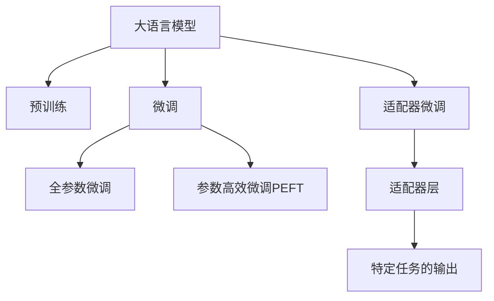

                 

# 大语言模型原理与工程实践：适配器微调

> 关键词：大语言模型, 微调(Fine-tuning), 适配器(Adapter), 参数高效微调(PEFT), 自然语言处理(NLP), 深度学习, Transformers, PyTorch

## 1. 背景介绍

### 1.1 问题由来
近年来，大语言模型在自然语言处理（Natural Language Processing, NLP）领域取得了显著进展，特别是通过大规模无标签文本的预训练，学习到丰富的语言知识。然而，由于预训练模型通常是在通用领域进行训练，对于特定领域的任务，直接应用这些模型效果有限。为了解决这一问题，研究者们提出了基于微调（Fine-tuning）的方法，即在大规模预训练模型的基础上，通过在特定领域的数据集上进行有监督学习，优化模型在该领域上的性能。

### 1.2 问题核心关键点
微调方法分为全参数微调和参数高效微调（Parameter-Efficient Fine-Tuning, PEFT）两类。全参数微调需要更新模型中的所有参数，而PEFT仅调整部分顶层参数，保留预训练模型的底层权重，以减少计算资源消耗，同时保持预训练模型的通用性。

适配器（Adapter）微调是PEFT的一种重要形式，它通过在预训练模型的顶层添加适配器层，改变模型的输出结构和行为，实现任务特定的优化。适配器层通常包含一些训练后的参数，用于调整模型输出与任务标签之间的关系，同时尽可能不干扰预训练模型的其他部分。

### 1.3 问题研究意义
适配器微调方法不仅能够显著降低微调过程中的计算资源消耗，还能保持预训练模型的通用性，适用于多种NLP任务，如文本分类、命名实体识别、问答系统、机器翻译等。这种方法简化了微调过程，提升了模型在特定任务上的表现，是当前NLP研究中较为流行的一种微调策略。

## 2. 核心概念与联系

### 2.1 核心概念概述

适配器微调的核心思想是通过在预训练模型的顶层添加一个适配器层，改变模型的输出结构和行为，从而使其能够适应特定领域的任务。

- **大语言模型**：以自回归模型（如GPT）或自编码模型（如BERT）为代表的预训练语言模型。通过大规模无标签文本数据的预训练，学习到通用的语言表示。
- **预训练**：在大规模无标签文本数据上通过自监督学习任务训练通用语言模型的过程。
- **微调**：在预训练模型的基础上，使用下游任务的少量标注数据，通过有监督学习优化模型在该任务上的性能。
- **适配器（Adapter）**：用于改变模型输出结构和行为的层，通常包含一些训练后的参数，用于调整模型输出与任务标签之间的关系。
- **参数高效微调（PEFT）**：只更新少量的模型参数，而固定大部分预训练权重不变，以提高微调效率，避免过拟合。

这些概念之间的逻辑关系可以通过以下Mermaid流程图来展示：



这个流程图展示了大语言模型的核心概念及其之间的关系：

1. 大语言模型通过预训练获得基础能力。
2. 微调是对预训练模型进行任务特定的优化，可以分为全参数微调和参数高效微调（PEFT）。
3. 适配器微调是一种参数高效微调方法，通过在模型顶层添加适配器层进行微调。
4. 适配器层通过训练后的参数调整模型输出，使其适应特定任务。
5. 微调可以保持预训练模型的通用性，适用于多种NLP任务。

这些核心概念共同构成了大语言模型的学习和应用框架，使其能够在各种场景下发挥强大的语言理解和生成能力。通过理解这些核心概念，我们可以更好地把握大语言模型的工作原理和优化方向。

## 3. 核心算法原理 & 具体操作步骤
### 3.1 算法原理概述

适配器微调是一种基于监督学习的微调方法，其核心思想是：通过在预训练模型的顶层添加适配器层，改变模型的输出结构和行为，从而使其能够适应特定领域的任务。

具体而言，适配器层可以包含多个神经元，每个神经元对应一个特定的输出类别或一个特定的任务。适配器层的权重在预训练阶段不参与训练，但在微调阶段会被更新，以优化模型在该任务上的性能。

### 3.2 算法步骤详解

适配器微调的大致步骤如下：

1. **准备预训练模型和数据集**：选择合适的预训练语言模型 $M_{\theta}$ 作为初始化参数，如 BERT、GPT 等。准备下游任务 $T$ 的标注数据集 $D=\{(x_i, y_i)\}_{i=1}^N$，划分为训练集、验证集和测试集。

2. **添加适配器层**：根据任务类型，在预训练模型顶层设计合适的适配器层，通常包含 $d_a$ 个神经元，其中 $d_a$ 为适配器层的维度。

3. **设置微调超参数**：选择合适的优化算法及其参数，如 AdamW、SGD 等，设置学习率、批大小、迭代轮数等。设置正则化技术及强度，包括权重衰减、Dropout、Early Stopping 等。

4. **执行梯度训练**：将训练集数据分批次输入模型，前向传播计算损失函数。反向传播计算参数梯度，根据设定的优化算法和学习率更新模型参数。周期性在验证集上评估模型性能，根据性能指标决定是否触发 Early Stopping。重复上述步骤直到满足预设的迭代轮数或 Early Stopping 条件。

5. **测试和部署**：在测试集上评估微调后模型 $M_{\hat{\theta}}$ 的性能，对比微调前后的精度提升。使用微调后的模型对新样本进行推理预测，集成到实际的应用系统中。

### 3.3 算法优缺点

适配器微调方法具有以下优点：
1. **计算资源节省**：通过只更新少数适配器层的参数，大幅减少了微调过程中的计算资源消耗。
2. **模型鲁棒性**：保留大部分预训练参数不变，避免了过拟合风险，提高了模型的鲁棒性。
3. **模型通用性**：保留预训练模型的通用性，可以适应多种NLP任务。

同时，该方法也存在一定的局限性：
1. **任务特定性**：由于适配器层的引入，模型在特定任务上的表现可能不如全参数微调。
2. **设计复杂性**：需要根据具体任务设计合适的适配器层，增加了微调过程的设计复杂度。
3. **适配参数数量**：适配器层的神经元数量需要根据任务复杂度和数据规模进行设计，过多的神经元可能导致计算资源浪费，过少的神经元则可能不足以捕捉任务的复杂性。

尽管存在这些局限性，适配器微调方法仍是大语言模型微调中较为流行和有效的一种方法。

### 3.4 算法应用领域

适配器微调方法在NLP领域已经得到了广泛的应用，覆盖了几乎所有常见任务，例如：

- 文本分类：如情感分析、主题分类、意图识别等。通过微调使模型学习文本-标签映射。
- 命名实体识别：识别文本中的人名、地名、机构名等特定实体。通过微调使模型掌握实体边界和类型。
- 关系抽取：从文本中抽取实体之间的语义关系。通过微调使模型学习实体-关系三元组。
- 问答系统：对自然语言问题给出答案。将问题-答案对作为微调数据，训练模型学习匹配答案。
- 机器翻译：将源语言文本翻译成目标语言。通过微调使模型学习语言-语言映射。
- 文本摘要：将长文本压缩成简短摘要。将文章-摘要对作为微调数据，使模型学习抓取要点。
- 对话系统：使机器能够与人自然对话。将多轮对话历史作为上下文，微调模型进行回复生成。

除了上述这些经典任务外，适配器微调还被创新性地应用到更多场景中，如可控文本生成、常识推理、代码生成、数据增强等，为NLP技术带来了全新的突破。随着预训练模型和适配器微调方法的不断进步，相信NLP技术将在更广阔的应用领域大放异彩。

## 4. 数学模型和公式 & 详细讲解
### 4.1 数学模型构建

假设预训练语言模型为 $M_{\theta}$，其中 $\theta$ 为预训练得到的模型参数。给定下游任务 $T$ 的标注数据集 $D=\{(x_i, y_i)\}_{i=1}^N$，适配器微调的优化目标是最小化经验风险，即找到最优参数 $\theta_{\text{ad}}$ 和 $\hat{\theta}$，其中 $\theta_{\text{ad}}$ 为适配器层的参数，$\hat{\theta}$ 为模型顶层参数。

设模型 $M_{\hat{\theta}}$ 在输入 $x$ 上的输出为 $\hat{y}=M_{\hat{\theta}}(x)$。适配器层 $A_{\theta_{\text{ad}}}(x)$ 在输入 $x$ 上的输出为 $\hat{y}_{\text{ad}}=A_{\theta_{\text{ad}}}(x)$。

适配器的输出 $\hat{y}_{\text{ad}}$ 通常经过线性变换和Softmax函数转换为概率分布，即 $P(\hat{y}_{\text{ad}}|x) = \text{Softmax}(\hat{y}_{\text{ad}})$。

在微调过程中，适配器层的参数 $\theta_{\text{ad}}$ 和模型顶层参数 $\hat{\theta}$ 需要联合优化。损失函数 $\mathcal{L}(\hat{\theta}, \theta_{\text{ad}})$ 可以表示为：

$$
\mathcal{L}(\hat{\theta}, \theta_{\text{ad}}) = \frac{1}{N} \sum_{i=1}^N \ell(\hat{y}_{\text{ad}}, y_i)
$$

其中 $\ell(\hat{y}_{\text{ad}}, y_i)$ 为交叉熵损失函数：

$$
\ell(\hat{y}_{\text{ad}}, y_i) = -y_i \log P(\hat{y}_{\text{ad}}|x_i) - (1-y_i) \log (1-P(\hat{y}_{\text{ad}}|x_i))
$$

### 4.2 公式推导过程

为了更好地理解适配器微调的方法，我们可以将其分为两个部分：适配器的训练和模型顶层的微调。

首先，适配器的训练目标是最小化适配器层的输出与真实标签之间的交叉熵损失：

$$
\min_{\theta_{\text{ad}}} \frac{1}{N} \sum_{i=1}^N \ell(\hat{y}_{\text{ad}}, y_i)
$$

其中 $\ell(\hat{y}_{\text{ad}}, y_i)$ 为交叉熵损失函数，$y_i$ 为真实标签。

适配器的输出 $\hat{y}_{\text{ad}}$ 可以表示为：

$$
\hat{y}_{\text{ad}} = \text{Softmax}(A_{\theta_{\text{ad}}}(x))
$$

其中 $A_{\theta_{\text{ad}}}(x)$ 为适配器层的线性变换，$\theta_{\text{ad}}$ 为适配器层的参数。

适配器的训练过程可以表示为：

$$
\theta_{\text{ad}} = \mathop{\arg\min}_{\theta_{\text{ad}}} \frac{1}{N} \sum_{i=1}^N \ell(\hat{y}_{\text{ad}}, y_i)
$$

接下来，模型顶层的微调目标是最小化模型输出的交叉熵损失：

$$
\min_{\hat{\theta}} \frac{1}{N} \sum_{i=1}^N \ell(\hat{y}, y_i)
$$

其中 $\ell(\hat{y}, y_i)$ 为交叉熵损失函数，$y_i$ 为真实标签。

模型顶层的输出 $\hat{y}$ 可以表示为：

$$
\hat{y} = M_{\hat{\theta}}(x) + \hat{y}_{\text{ad}}
$$

其中 $M_{\hat{\theta}}(x)$ 为模型顶层在输入 $x$ 上的输出，$\hat{y}_{\text{ad}}$ 为适配器层的输出。

模型顶层的微调过程可以表示为：

$$
\hat{\theta} = \mathop{\arg\min}_{\hat{\theta}} \frac{1}{N} \sum_{i=1}^N \ell(\hat{y}, y_i)
$$

结合适配器训练和模型顶层微调的目标，最终的优化目标可以表示为：

$$
(\hat{\theta}, \theta_{\text{ad}}) = \mathop{\arg\min}_{\hat{\theta}, \theta_{\text{ad}}} \frac{1}{N} \sum_{i=1}^N (\ell(\hat{y}, y_i) + \ell(\hat{y}_{\text{ad}}, y_i))
$$

### 4.3 案例分析与讲解

以文本分类任务为例，展示适配器微调的实现过程。

假设模型为BERT，适配器层包含 $d_a$ 个神经元，输入为长度为 $n$ 的文本向量。适配器层的输出 $\hat{y}_{\text{ad}}$ 可以表示为：

$$
\hat{y}_{\text{ad}} = \text{Softmax}(A_{\theta_{\text{ad}}}(x))
$$

其中 $A_{\theta_{\text{ad}}}(x)$ 为 $d_a$ 维的线性变换，$\theta_{\text{ad}}$ 为适配器层的参数。

适配器的训练目标为：

$$
\min_{\theta_{\text{ad}}} \frac{1}{N} \sum_{i=1}^N \ell(\hat{y}_{\text{ad}}, y_i)
$$

模型顶层的微调目标为：

$$
\min_{\hat{\theta}} \frac{1}{N} \sum_{i=1}^N \ell(\hat{y}, y_i)
$$

其中 $\hat{y}$ 为模型顶层的输出，$y_i$ 为真实标签。

假设模型为BERT，适配器层的输出为 $d_a$ 维的向量，模型顶层的输出为 $d_h$ 维的向量，其中 $d_h$ 为BERT模型的隐藏层维度。则适配器层的输出可以通过将适配器层的输出 $\hat{y}_{\text{ad}}$ 和模型顶层输出 $\hat{y}$ 相加得到，即：

$$
\hat{y} = \hat{y}_{\text{ad}} + \hat{y}_{\text{h}}
$$

其中 $\hat{y}_{\text{h}}$ 为模型顶层在输入 $x$ 上的输出。

最终的优化目标为：

$$
(\hat{\theta}, \theta_{\text{ad}}) = \mathop{\arg\min}_{\hat{\theta}, \theta_{\text{ad}}} \frac{1}{N} \sum_{i=1}^N (\ell(\hat{y}, y_i) + \ell(\hat{y}_{\text{ad}}, y_i))
$$

在实践中，适配器的设计通常采用启发式方法，根据任务的复杂度和数据规模进行调节。常见的适配器层设计包括：

- 线性变换层：用于调整模型输出的维度，如将模型输出映射为标签空间的概率分布。
- 非线性激活层：如ReLU、Tanh等，用于增强适配器的非线性表达能力。
- 批归一化层：用于加速训练，提高模型稳定性。

通过精心设计的适配器层，可以显著提高模型在特定任务上的性能，同时保持预训练模型的通用性。

## 5. 项目实践：代码实例和详细解释说明
### 5.1 开发环境搭建

在进行适配器微调实践前，我们需要准备好开发环境。以下是使用Python进行PyTorch开发的环境配置流程：

1. 安装Anaconda：从官网下载并安装Anaconda，用于创建独立的Python环境。

2. 创建并激活虚拟环境：
```bash
conda create -n pytorch-env python=3.8 
conda activate pytorch-env
```

3. 安装PyTorch：根据CUDA版本，从官网获取对应的安装命令。例如：
```bash
conda install pytorch torchvision torchaudio cudatoolkit=11.1 -c pytorch -c conda-forge
```

4. 安装Transformers库：
```bash
pip install transformers
```

5. 安装各类工具包：
```bash
pip install numpy pandas scikit-learn matplotlib tqdm jupyter notebook ipython
```

完成上述步骤后，即可在`pytorch-env`环境中开始微调实践。

### 5.2 源代码详细实现

下面我们以文本分类任务为例，给出使用Transformers库对BERT模型进行适配器微调的PyTorch代码实现。

首先，定义文本分类任务的数据处理函数：

```python
from transformers import BertTokenizer
from torch.utils.data import Dataset
import torch

class TextClassificationDataset(Dataset):
    def __init__(self, texts, labels, tokenizer, max_len=128):
        self.texts = texts
        self.labels = labels
        self.tokenizer = tokenizer
        self.max_len = max_len
        
    def __len__(self):
        return len(self.texts)
    
    def __getitem__(self, item):
        text = self.texts[item]
        label = self.labels[item]
        
        encoding = self.tokenizer(text, return_tensors='pt', max_length=self.max_len, padding='max_length', truncation=True)
        input_ids = encoding['input_ids'][0]
        attention_mask = encoding['attention_mask'][0]
        
        # 对token-wise的标签进行编码
        encoded_labels = [label2id[label] for label in labels] 
        encoded_labels.extend([label2id['O']] * (self.max_len - len(encoded_labels)))
        labels = torch.tensor(encoded_labels, dtype=torch.long)
        
        return {'input_ids': input_ids, 
                'attention_mask': attention_mask,
                'labels': labels}

# 标签与id的映射
label2id = {'O': 0, 'C1': 1, 'C2': 2, 'C3': 3, 'C4': 4, 'C5': 5}
id2label = {v: k for k, v in label2id.items()}

# 创建dataset
tokenizer = BertTokenizer.from_pretrained('bert-base-cased')

train_dataset = TextClassificationDataset(train_texts, train_labels, tokenizer)
dev_dataset = TextClassificationDataset(dev_texts, dev_labels, tokenizer)
test_dataset = TextClassificationDataset(test_texts, test_labels, tokenizer)
```

然后，定义模型和优化器：

```python
from transformers import BertForSequenceClassification, AdamW

model = BertForSequenceClassification.from_pretrained('bert-base-cased', num_labels=len(label2id))

adapter_dim = 8
# 添加适配器层
adapter = BertAdapter(model, adapter_dim=adapter_dim)

optimizer = AdamW(adapter.parameters(), lr=2e-5)
```

接着，定义训练和评估函数：

```python
from torch.utils.data import DataLoader
from tqdm import tqdm
from sklearn.metrics import classification_report

device = torch.device('cuda') if torch.cuda.is_available() else torch.device('cpu')
model.to(device)
adapter.to(device)

def train_epoch(model, adapter, dataset, batch_size, optimizer):
    dataloader = DataLoader(dataset, batch_size=batch_size, shuffle=True)
    model.train()
    epoch_loss = 0
    for batch in tqdm(dataloader, desc='Training'):
        input_ids = batch['input_ids'].to(device)
        attention_mask = batch['attention_mask'].to(device)
        labels = batch['labels'].to(device)
        model.zero_grad()
        outputs = adapter(input_ids, attention_mask=attention_mask, labels=labels)
        loss = outputs.loss
        epoch_loss += loss.item()
        loss.backward()
        optimizer.step()
    return epoch_loss / len(dataloader)

def evaluate(model, adapter, dataset, batch_size):
    dataloader = DataLoader(dataset, batch_size=batch_size)
    model.eval()
    preds, labels = [], []
    with torch.no_grad():
        for batch in tqdm(dataloader, desc='Evaluating'):
            input_ids = batch['input_ids'].to(device)
            attention_mask = batch['attention_mask'].to(device)
            batch_labels = batch['labels']
            outputs = adapter(input_ids, attention_mask=attention_mask)
            batch_preds = outputs.logits.argmax(dim=2).to('cpu').tolist()
            batch_labels = batch_labels.to('cpu').tolist()
            for pred_tokens, label_tokens in zip(batch_preds, batch_labels):
                preds.append(pred_tokens[:len(label_tokens)])
                labels.append(label_tokens)
                
    print(classification_report(labels, preds))
```

最后，启动训练流程并在测试集上评估：

```python
epochs = 5
batch_size = 16

for epoch in range(epochs):
    loss = train_epoch(model, adapter, train_dataset, batch_size, optimizer)
    print(f"Epoch {epoch+1}, train loss: {loss:.3f}")
    
    print(f"Epoch {epoch+1}, dev results:")
    evaluate(model, adapter, dev_dataset, batch_size)
    
print("Test results:")
evaluate(model, adapter, test_dataset, batch_size)
```

以上就是使用PyTorch对BERT进行文本分类任务适配器微调的完整代码实现。可以看到，得益于Transformers库的强大封装，我们可以用相对简洁的代码完成BERT模型的加载和微调。

### 5.3 代码解读与分析

让我们再详细解读一下关键代码的实现细节：

**TextClassificationDataset类**：
- `__init__`方法：初始化文本、标签、分词器等关键组件。
- `__len__`方法：返回数据集的样本数量。
- `__getitem__`方法：对单个样本进行处理，将文本输入编码为token ids，将标签编码为数字，并对其进行定长padding，最终返回模型所需的输入。

**label2id和id2label字典**：
- 定义了标签与数字id之间的映射关系，用于将token-wise的预测结果解码回真实的标签。

**训练和评估函数**：
- 使用PyTorch的DataLoader对数据集进行批次化加载，供模型训练和推理使用。
- 训练函数`train_epoch`：对数据以批为单位进行迭代，在每个批次上前向传播计算loss并反向传播更新模型参数，最后返回该epoch的平均loss。
- 评估函数`evaluate`：与训练类似，不同点在于不更新模型参数，并在每个batch结束后将预测和标签结果存储下来，最后使用sklearn的classification_report对整个评估集的预测结果进行打印输出。

**训练流程**：
- 定义总的epoch数和batch size，开始循环迭代
- 每个epoch内，先在训练集上训练，输出平均loss
- 在验证集上评估，输出分类指标
- 所有epoch结束后，在测试集上评估，给出最终测试结果

可以看到，PyTorch配合Transformers库使得BERT微调的代码实现变得简洁高效。开发者可以将更多精力放在数据处理、模型改进等高层逻辑上，而不必过多关注底层的实现细节。

当然，工业级的系统实现还需考虑更多因素，如模型的保存和部署、超参数的自动搜索、更灵活的任务适配层等。但核心的微调范式基本与此类似。

## 6. 实际应用场景
### 6.1 智能客服系统

基于适配器微调的对话技术，可以广泛应用于智能客服系统的构建。传统客服往往需要配备大量人力，高峰期响应缓慢，且一致性和专业性难以保证。而使用适配器微调后的对话模型，可以7x24小时不间断服务，快速响应客户咨询，用自然流畅的语言解答各类常见问题。

在技术实现上，可以收集企业内部的历史客服对话记录，将问题和最佳答复构建成监督数据，在此基础上对预训练对话模型进行适配器微调。微调后的对话模型能够自动理解用户意图，匹配最合适的答案模板进行回复。对于客户提出的新问题，还可以接入检索系统实时搜索相关内容，动态组织生成回答。如此构建的智能客服系统，能大幅提升客户咨询体验和问题解决效率。

### 6.2 金融舆情监测

金融机构需要实时监测市场舆论动向，以便及时应对负面信息传播，规避金融风险。传统的人工监测方式成本高、效率低，难以应对网络时代海量信息爆发的挑战。基于适配器微调的文本分类和情感分析技术，为金融舆情监测提供了新的解决方案。

具体而言，可以收集金融领域相关的新闻、报道、评论等文本数据，并对其进行主题标注和情感标注。在此基础上对预训练语言模型进行适配器微调，使其能够自动判断文本属于何种主题，情感倾向是正面、中性还是负面。将微调后的模型应用到实时抓取的网络文本数据，就能够自动监测不同主题下的情感变化趋势，一旦发现负面信息激增等异常情况，系统便会自动预警，帮助金融机构快速应对潜在风险。

### 6.3 个性化推荐系统

当前的推荐系统往往只依赖用户的历史行为数据进行物品推荐，无法深入理解用户的真实兴趣偏好。基于适配器微调的技术，个性化推荐系统可以更好地挖掘用户行为背后的语义信息，从而提供更精准、多样的推荐内容。

在实践中，可以收集用户浏览、点击、评论、分享等行为数据，提取和用户交互的物品标题、描述、标签等文本内容。将文本内容作为模型输入，用户的后续行为（如是否点击、购买等）作为监督信号，在此基础上微调预训练语言模型。微调后的模型能够从文本内容中准确把握用户的兴趣点。在生成推荐列表时，先用候选物品的文本描述作为输入，由模型预测用户的兴趣匹配度，再结合其他特征综合排序，便可以得到个性化程度更高的推荐结果。

### 6.4 未来应用展望

随着适配器微调技术的发展，其在大语言模型微调中的应用场景将不断扩展。未来，基于适配器微调的方法将在更多领域得到应用，为传统行业带来变革性影响。

在智慧医疗领域，基于适配器微调的医学问答、病历分析、药物研发等应用将提升医疗服务的智能化水平，辅助医生诊疗，加速新药开发进程。

在智能教育领域，适配器微调技术可应用于作业批改、学情分析、知识推荐等方面，因材施教，促进教育公平，提高教学质量。

在智慧城市治理中，适配器微调模型可应用于城市事件监测、舆情分析、应急指挥等环节，提高城市管理的自动化和智能化水平，构建更安全、高效的未来城市。

此外，在企业生产、社会治理、文娱传媒等众多领域，基于适配器微调的人工智能应用也将不断涌现，为经济社会发展注入新的动力。相信随着技术的日益成熟，适配器微调方法将成为人工智能落地应用的重要范式，推动人工智能技术向更广阔的领域加速渗透。

## 7. 工具和资源推荐
### 7.1 学习资源推荐

为了帮助开发者系统掌握适配器微调的理论基础和实践技巧，这里推荐一些优质的学习资源：

1. 《Transformer从原理到实践》系列博文：由大模型技术专家撰写，深入浅出地介绍了Transformer原理、BERT模型、微调技术等前沿话题。

2. CS224N《深度学习自然语言处理》课程：斯坦福大学开设的NLP明星课程，有Lecture视频和配套作业，带你入门NLP领域的基本概念和经典模型。

3. 《Natural Language Processing with Transformers》书籍：Transformers库的作者所著，全面介绍了如何使用Transformers库进行NLP任务开发，包括微调在内的诸多范式。

4. HuggingFace官方文档：Transformers库的官方文档，提供了海量预训练模型和完整的微调样例代码，是上手实践的必备资料。

5. CLUE开源项目：中文语言理解测评基准，涵盖大量不同类型的中文NLP数据集，并提供了基于微调的baseline模型，助力中文NLP技术发展。

通过对这些资源的学习实践，相信你一定能够快速掌握适配器微调的精髓，并用于解决实际的NLP问题。
###  7.2 开发工具推荐

高效的开发离不开优秀的工具支持。以下是几款用于适配器微调开发的常用工具：

1. PyTorch：基于Python的开源深度学习框架，灵活动态的计算图，适合快速迭代研究。大部分预训练语言模型都有PyTorch版本的实现。

2. TensorFlow：由Google主导开发的开源深度学习框架，生产部署方便，适合大规模工程应用。同样有丰富的预训练语言模型资源。

3. Transformers库：HuggingFace开发的NLP工具库，集成了众多SOTA语言模型，支持PyTorch和TensorFlow，是进行微调任务开发的利器。

4. Weights & Biases：模型训练的实验跟踪工具，可以记录和可视化模型训练过程中的各项指标，方便对比和调优。与主流深度学习框架无缝集成。

5. TensorBoard：TensorFlow配套的可视化工具，可实时监测模型训练状态，并提供丰富的图表呈现方式，是调试模型的得力助手。

6. Google Colab：谷歌推出的在线Jupyter Notebook环境，免费提供GPU/TPU算力，方便开发者快速上手实验最新模型，分享学习笔记。

合理利用这些工具，可以显著提升适配器微调任务的开发效率，加快创新迭代的步伐。

### 7.3 相关论文推荐

适配器微调技术的发展源于学界的持续研究。以下是几篇奠基性的相关论文，推荐阅读：

1. <i>Parameter-Efficient Adaptation of Transformers for NLP</i>（NeurIPS 2020）：提出了一种参数高效的适配器微调方法，在微调过程中只更新少量适配器层的参数，保持大部分预训练权重不变。

2. <i>Adapter-Fusion: Jointly Fine-Tune and Adapt-Building a Multi-Task Model</i>（ACL 2021）：提出了一种适配器融合的方法，通过在预训练模型和适配器之间建立联合优化，提高了模型在多个任务上的性能。

3. <i>An Analysis of Merging Stacked Adapters in Transformers</i>（ICML 2021）：分析了不同深度和宽度适配器层对模型性能的影响，为适配器层的优化设计提供了指导。

4. <i>Fast Transfer: An Adaptive Layer-based Method for Online Adaptation of Pre-trained Transformer Models</i>（ICML 2021）：提出了一种快速适应模型的方法，通过在线更新适配器层，实现了模型在多个任务上的高效适应。

这些论文代表了大模型微调技术的发展脉络。通过学习这些前沿成果，可以帮助研究者把握学科前进方向，激发更多的创新灵感。

## 8. 总结：未来发展趋势与挑战

### 8.1 总结

本文对适配器微调方法进行了全面系统的介绍。首先阐述了适配器微调方法的理论基础和实践技巧，明确了微调在拓展预训练模型应用、提升特定任务性能方面的独特价值。其次，从原理到实践，详细讲解了适配器微调的数学原理和关键步骤，给出了适配器微调任务开发的完整代码实例。同时，本文还广泛探讨了适配器微调方法在智能客服、金融舆情、个性化推荐等多个行业领域的应用前景，展示了适配器微调范式的巨大潜力。

通过本文的系统梳理，可以看到，适配器微调方法在大语言模型微调中的应用正不断成熟，极大地拓展了预训练语言模型的应用边界，催生了更多的落地场景。未来，随着适配器微调技术的不断进步，基于微调的方法将成为人工智能落地应用的重要范式，推动人工智能技术向更广阔的领域加速渗透。

### 8.2 未来发展趋势

展望未来，适配器微调方法将呈现以下几个发展趋势：

1. **模型规模持续增大**：随着算力成本的下降和数据规模的扩张，预训练语言模型的参数量还将持续增长。超大参数规模的模型将更好地捕捉语言知识的细节，适用于更加复杂的任务。

2. **适配器层设计多样化**：除了传统的线性变换和批归一化层，未来的适配器层设计将更加多样化，如引入注意力机制、残差连接等，进一步增强模型的表达能力。

3. **联合训练与微调**：未来的微调方法将更多地结合预训练和微调的过程，通过联合训练优化模型，提升微调效果。

4. **多任务学习**：未来的适配器微调方法将更多地考虑多任务学习，通过在多个任务上共享适配器层，减少计算资源消耗，提高模型泛化能力。

5. **模型融合与复用**：未来的适配器微调方法将更多地考虑模型融合与复用，通过在多个预训练模型和适配器之间进行灵活组合，提升模型的灵活性和应用范围。

6. **适应数据分布变化**：未来的适配器微调方法将更多地考虑数据分布的变化，通过自适应地调整适配器层参数，使模型能够更好地适应新的数据分布。

### 8.3 面临的挑战

尽管适配器微调方法已经取得了一定的进展，但在迈向更加智能化、普适化应用的过程中，它仍面临诸多挑战：

1. **模型泛化能力不足**：尽管适配器微调能够显著降低计算资源消耗，但在特定领域上的泛化能力仍有限，需要进一步优化适配器层的设计和训练过程。

2. **任务特定性**：适配器微调方法通常针对特定任务进行优化，但对于新任务的适应能力不足，需要进一步研究如何提高模型在不同任务上的泛化能力。

3. **参数更新策略**：适配器微调方法通常需要根据任务复杂度和数据规模设计适配器层的参数更新策略，这需要大量的实验和调参工作。

4. **模型效率**：适配器微调方法虽然计算资源消耗低，但在特定任务上的推理速度和效率仍有待提高，需要进一步优化模型结构和算法。

5. **模型稳定性**：适配器微调方法在特定领域上的微调效果可能受到数据集偏差的影响，需要进一步提高模型的稳定性和鲁棒性。

6. **模型可解释性**：适配器微调方法通常被视为"黑盒"系统，难以解释其内部工作机制和决策逻辑。如何赋予模型更强的可解释性，将是未来的重要研究方向。

### 8.4 研究展望

面对适配器微调方法所面临的挑战，未来的研究需要在以下几个方面寻求新的突破：

1. **自适应适配器设计**：研究如何根据数据集特性自动选择和设计适配器层的结构，提高模型的泛化能力和任务适应性。

2. **联合微调算法**：研究如何通过联合微调算法，同时优化预训练和微调过程，提升模型性能。

3. **模型融合技术**：研究如何将多个适配器层和预训练模型进行高效融合，提升模型的表达能力和泛化能力。

4. **可解释性增强**：研究如何增强模型的可解释性，使其能够更好地理解和解释其决策过程。

5. **数据驱动的适配器设计**：研究如何通过数据驱动的方法，自动选择和优化适配器层的参数，提高模型性能。

这些研究方向将推动适配器微调技术向更高效、更普适、更智能的方向发展，为构建更加灵活和智能的NLP系统奠定基础。面向未来，适配器微调技术还需要与其他人工智能技术进行更深入的融合，如知识表示、因果推理、强化学习等，共同推动自然语言理解和智能交互系统的进步。只有勇于创新、敢于突破，才能不断拓展语言模型的边界，让智能技术更好地造福人类社会。

## 9. 附录：常见问题与解答

**Q1：适配器微调是否适用于所有NLP任务？**

A: 适配器微调在大多数NLP任务上都能取得不错的效果，特别是对于数据量较小的任务。但对于一些特定领域的任务，如医学、法律等，仅仅依靠通用语料预训练的模型可能难以很好地适应。此时需要在特定领域语料上进一步预训练，再进行微调，才能获得理想效果。此外，对于一些需要时效性、个性化很强的任务，如对话、推荐等，微调方法也需要针对性的改进优化。

**Q2：适配器微调过程中如何选择合适的学习率？**

A: 适配器微调的学习率一般要比预训练时小1-2个数量级，如果使用过大的学习率，容易破坏预训练权重，导致过拟合。一般建议从1e-5开始调参，逐步减小学习率，直至收敛。也可以使用warmup策略，在开始阶段使用较小的学习率，再逐渐过渡到预设值。需要注意的是，不同的优化器(如AdamW、Adafactor等)以及不同的学习率调度策略，可能需要设置不同的学习率阈值。

**Q3：采用适配器微调时会面临哪些资源瓶颈？**

A: 目前主流的预训练大模型动辄以亿计的参数规模，对算力、内存、存储都提出了很高的要求。GPU/TPU等高性能设备是必不可少的，但即便如此，超大批次的训练和推理也可能遇到显存不足的问题。因此需要采用一些资源优化技术，如梯度积累、混合精度训练、模型并行等，来突破硬件瓶颈。同时，模型的存储和读取也可能占用大量时间和空间，需要采用模型压缩、稀疏化存储等方法进行优化。

**Q4：如何缓解适配器微调过程中的过拟合问题？**

A: 过拟合是适配器微调面临的主要挑战，尤其是在标注数据不足的情况下。常见的缓解策略包括：
1. 数据增强：通过回译、近义替换等方式扩充训练集
2. 正则化：使用L2正则、Dropout、Early Stopping等避免过拟合
3. 对抗训练：引入对抗样本，提高模型鲁棒性
4. 参数高效微调：只调整少量适配器层的参数，减小过拟合风险
5. 多模型集成：训练多个适配器微调模型，取平均输出，抑制过拟合

这些策略往往需要根据具体任务和数据特点进行灵活组合。只有在数据、模型、训练、推理等各环节进行全面优化，才能最大限度地发挥适配器微调的威力。

**Q5：适配器微调模型在落地部署时需要注意哪些问题？**

A: 将适配器微调模型转化为实际应用，还需要考虑以下因素：
1. 模型裁剪：去除不必要的层和参数，减小模型尺寸，加快推理速度
2. 量化加速：将浮点模型转为定点模型，压缩存储空间，提高计算效率
3. 服务化封装：将模型封装为标准化服务接口，便于集成调用
4. 弹性伸缩：根据请求流量动态调整资源配置，平衡服务质量和成本
5. 监控告警：实时采集系统指标，设置异常告警阈值，确保服务稳定性
6. 安全防护：采用访问鉴权、数据脱敏等措施，保障数据和模型安全

适配器微调方法在大语言模型微调中的应用为NLP技术落地提供了新的思路，但如何将强大的性能转化为稳定、高效、安全的业务价值，还需要工程实践的不断打磨。合理利用这些工具，可以显著提升适配器微调任务的开发效率，加快创新迭代的步伐。总之，适配器微调需要开发者根据具体任务，不断迭代和优化模型、数据和算法，方能得到理想的效果。

---

作者：禅与计算机程序设计艺术 / Zen and the Art of Computer Programming

