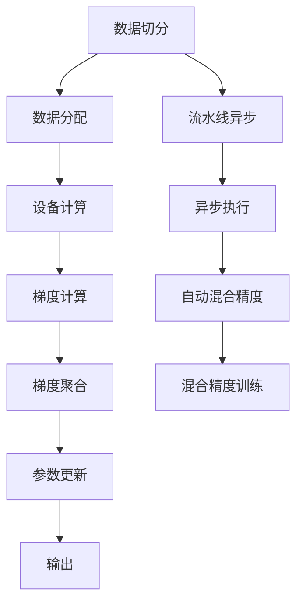

                 

# 大语言模型原理基础与前沿 数据并行

> 关键词：大语言模型,数据并行,分布式训练,TPU,数据预处理,梯度累积,流水线异步,自动混合精度,混合精度训练

## 1. 背景介绍

### 1.1 问题由来

大语言模型（Large Language Models, LLMs）已经取得了显著的进展，这些模型通过在大规模无标签文本数据上进行自监督预训练，学习到了丰富的语言知识和表示，并且在各种下游任务上取得了优异的表现。然而，随着模型规模的不断增大，训练大语言模型所需的计算资源和存储资源也迅速增加，传统的单GPU、单TPU训练模式已经无法满足大规模模型训练的需求。

数据并行（Data Parallelism）是解决这一问题的重要手段，它通过将数据分成多个批次并行处理，使得大规模模型的训练可以在多台设备上同时进行，从而显著提升训练效率。本文将重点介绍数据并行在大语言模型训练中的原理与实践，并探讨其带来的挑战和未来发展方向。

### 1.2 问题核心关键点

数据并行在大语言模型训练中的应用，核心在于如何将大规模数据高效地分配到多台设备上进行并行处理，同时有效地传递和聚合梯度。这涉及到以下几个关键点：

1. **数据切分和分配**：如何合理地将数据切分并分配到多个设备上。
2. **梯度传递和聚合**：如何在多个设备间传递梯度，并有效地聚合梯度进行参数更新。
3. **硬件加速与优化**：如何充分利用硬件资源（如TPU、GPU），并优化并行训练过程。
4. **网络通信与同步**：如何减少网络通信开销，实现高效的模型并行训练。

这些问题相互交织，构成了数据并行在大语言模型训练中的核心挑战。

### 1.3 问题研究意义

数据并行在大语言模型训练中的应用，具有以下几方面的重要意义：

1. **加速训练**：通过并行训练，可以在较短时间内训练出高质量的大语言模型，加速模型的迭代和优化。
2. **提升模型性能**：并行训练可以充分利用多台设备的计算能力，提高模型的精度和泛化能力。
3. **降低成本**：并行训练可以减少单个设备的训练时间，从而降低计算资源和能源的消耗，降低成本。
4. **扩展性**：并行训练提供了模型规模扩展的基础，使得大语言模型的训练和部署变得更加灵活和可扩展。

## 2. 核心概念与联系

### 2.1 核心概念概述

数据并行（Data Parallelism）是一种并行计算模式，将一个大规模数据集分为多个小批次，并将每个批次分配到多个设备上进行独立计算，然后将每个设备的计算结果汇总并行处理，以提升整体的计算效率。在大语言模型训练中，数据并行通常通过分布式训练（Distributed Training）实现。

以下是几个核心概念及其联系的简要概述：

- **分布式训练**：将大规模模型的训练任务分布在多个设备上并行进行，以达到加速训练的目的。
- **数据切分**：将大规模数据集切分为多个小批次，每个批次可以分配到一个设备上并行处理。
- **梯度聚合**：多个设备计算得到的梯度被汇总并行更新模型参数，以提升训练效率。
- **流水线异步**：通过流水线并行（Pipeline Parallelism）和异步执行（Asynchronous Execution），进一步提升训练速度。
- **自动混合精度**：通过自动混合精度训练（Auto Mixed-Precision Training），减少内存消耗，提升计算效率。
- **混合精度训练**：使用不同的精度（如16位和32位混合）进行计算，以在保证精度的情况下降低计算资源消耗。

这些概念之间相互依赖，共同构成了数据并行在大语言模型训练中的基本框架。

### 2.2 核心概念原理和架构的 Mermaid 流程图



这个流程图展示了数据并行在大语言模型训练中的主要流程：

1. 数据切分，将大规模数据集切分为多个小批次。
2. 数据分配，将每个小批次分配到不同的设备上进行计算。
3. 设备计算，在各个设备上独立计算模型的前向传播和损失函数。
4. 梯度计算，在各个设备上计算梯度。
5. 梯度聚合，将各个设备的梯度汇总，并行更新模型参数。
6. 参数更新，使用汇总的梯度更新模型参数。
7. 输出结果。
8. 流水线异步和异步执行，进一步提升并行效率。
9. 自动混合精度和混合精度训练，优化计算效率。

## 3. 核心算法原理 & 具体操作步骤

### 3.1 算法原理概述

在大语言模型的训练中，数据并行通过将大规模数据集切分为多个小批次，并将每个批次分配到多个设备上进行独立计算，从而实现加速训练。

形式化地，假设数据集 $D=\{(x_i, y_i)\}_{i=1}^N$，其中 $x_i$ 是输入，$y_i$ 是对应的标签。我们将数据集 $D$ 切分为 $K$ 个批次 $D_k = \{(x_{i,k}, y_{i,k})\}_{i=1}^K$，每个批次大小为 $m$，即每个设备分配 $m$ 个样本。训练过程中，每个设备 $k$ 对批次 $D_k$ 进行计算，计算得到的梯度 $g_k$ 通过网络通信汇总，最终进行模型参数的更新。

### 3.2 算法步骤详解

大语言模型数据并行训练通常包括以下几个步骤：

**Step 1: 数据切分和分配**

- 将大规模数据集 $D$ 切分为 $K$ 个批次 $D_k = \{(x_{i,k}, y_{i,k})\}_{i=1}^K$，每个批次大小为 $m$。
- 将每个批次 $D_k$ 分配到不同的设备上进行计算。

**Step 2: 设备计算**

- 每个设备 $k$ 独立对分配到的批次 $D_k$ 进行计算，包括前向传播和损失函数计算。
- 计算得到的梯度 $g_k$ 在设备间同步。

**Step 3: 梯度聚合**

- 将各个设备计算得到的梯度 $g_k$ 汇总。
- 使用汇总的梯度更新模型参数。

**Step 4: 流水线异步和异步执行**

- 通过流水线并行和异步执行，进一步提升并行效率。
- 每个设备独立计算，异步更新参数，以减少网络通信开销。

**Step 5: 自动混合精度和混合精度训练**

- 自动混合精度训练，使用不同的精度（如16位和32位混合）进行计算，以减少内存消耗，提升计算效率。
- 混合精度训练，在保证精度的前提下，降低计算资源消耗。

### 3.3 算法优缺点

数据并行在大语言模型训练中的优点包括：

1. **加速训练**：通过并行计算，显著提升训练效率，加速模型迭代。
2. **提升模型性能**：充分利用多台设备的计算能力，提高模型的精度和泛化能力。
3. **降低成本**：减少单个设备的训练时间，降低计算资源和能源的消耗，降低成本。
4. **扩展性**：提供模型规模扩展的基础，使得大语言模型的训练和部署变得更加灵活和可扩展。

缺点包括：

1. **网络通信开销**：多个设备间的数据传输和通信开销较大，可能成为并行训练的瓶颈。
2. **模型同步和一致性**：多个设备间的同步和一致性问题较为复杂，需要合理设计通信协议。
3. **硬件资源消耗**：并行训练需要大量的硬件资源，可能带来较高的设备成本。
4. **算法复杂性**：并行训练的算法设计较为复杂，需要考虑多个设备的同步和通信。

### 3.4 算法应用领域

数据并行在大语言模型训练中的应用广泛，涵盖以下几个主要领域：

- **自然语言处理（NLP）**：用于训练大规模语言模型，如BERT、GPT等，提升其在文本分类、语言理解、生成等任务上的性能。
- **计算机视觉（CV）**：用于训练大规模视觉模型，如ResNet、VGG等，提升其在图像识别、目标检测等任务上的性能。
- **推荐系统**：用于训练大规模推荐模型，如DeepFM、FM等，提升个性化推荐和广告投放的准确性。
- **语音识别**：用于训练大规模语音识别模型，如DeepSpeech、wav2vec等，提升语音识别和转写的准确性。
- **自然语言生成**：用于训练大规模自然语言生成模型，如GPT-3、MUSE等，提升文本生成和对话生成的质量。

## 4. 数学模型和公式 & 详细讲解

### 4.1 数学模型构建

假设大语言模型为 $M_{\theta}$，其中 $\theta$ 为模型参数。给定数据集 $D=\{(x_i, y_i)\}_{i=1}^N$，其中 $x_i$ 为输入，$y_i$ 为标签。数据集 $D$ 切分为 $K$ 个批次 $D_k = \{(x_{i,k}, y_{i,k})\}_{i=1}^K$，每个批次大小为 $m$。

模型在批次 $D_k$ 上的前向传播和损失函数计算为：

$$
\hat{y}_k = M_{\theta}(x_{i,k})
$$

$$
L_k = \mathcal{L}(\hat{y}_k, y_{i,k})
$$

每个批次 $D_k$ 在设备 $k$ 上独立计算，计算得到的梯度为：

$$
g_k = \frac{\partial L_k}{\partial \theta}
$$

梯度 $g_k$ 通过网络通信汇总，进行模型参数的更新：

$$
\theta \leftarrow \theta - \eta \sum_{k=1}^K g_k
$$

其中 $\eta$ 为学习率。

### 4.2 公式推导过程

以一个简单的线性回归为例，推导数据并行训练的公式。

假设数据集 $D=\{(x_i, y_i)\}_{i=1}^N$，其中 $x_i$ 为输入，$y_i$ 为标签。将数据集 $D$ 切分为 $K$ 个批次 $D_k = \{(x_{i,k}, y_{i,k})\}_{i=1}^K$，每个批次大小为 $m$。

假设模型为线性回归模型：

$$
\hat{y}_k = Wx_k + b
$$

其中 $W$ 为权重矩阵，$b$ 为偏置项。损失函数为：

$$
L_k = \frac{1}{2m} \sum_{i=1}^m (y_{i,k} - \hat{y}_k)^2
$$

在设备 $k$ 上计算梯度：

$$
g_k = \frac{\partial L_k}{\partial W} = \frac{1}{m} \sum_{i=1}^m (y_{i,k} - \hat{y}_k)x_{i,k}
$$

汇总梯度后进行模型更新：

$$
W \leftarrow W - \eta \sum_{k=1}^K g_k
$$

其中 $\eta$ 为学习率。

## 5. 项目实践：代码实例和详细解释说明

### 5.1 开发环境搭建

在进行数据并行训练前，我们需要准备好开发环境。以下是使用Python进行TensorFlow进行数据并行训练的环境配置流程：

1. 安装Anaconda：从官网下载并安装Anaconda，用于创建独立的Python环境。

2. 创建并激活虚拟环境：
```bash
conda create -n tf-env python=3.8 
conda activate tf-env
```

3. 安装TensorFlow：根据CUDA版本，从官网获取对应的安装命令。例如：
```bash
conda install tensorflow -c pytorch -c conda-forge
```

4. 安装TensorBoard：
```bash
pip install tensorboard
```

5. 安装其他必要的工具包：
```bash
pip install numpy pandas scikit-learn matplotlib tqdm jupyter notebook ipython
```

完成上述步骤后，即可在`tf-env`环境中开始数据并行训练实践。

### 5.2 源代码详细实现

下面是使用TensorFlow进行数据并行训练的PyTorch代码实现。

```python
import tensorflow as tf
from tensorflow.keras import layers
from tensorflow.keras.losses import MeanSquaredError
import numpy as np
import os

# 定义数据集
class MNIST(tf.keras.utils.TensorFlowDataset):
    def __init__(self, images, labels, batch_size):
        super().__init__(batch_size)
        self.images = images
        self.labels = labels
        self.batch_size = batch_size
        self.index = 0

    def get_next(self):
        start = self.index
        self.index += self.batch_size
        if self.index > self.images.shape[0]:
            self.index = 0
        batch_images = self.images[start:start+self.batch_size]
        batch_labels = self.labels[start:start+self.batch_size]
        return batch_images, batch_labels

# 定义模型
class LinearRegression(tf.keras.Model):
    def __init__(self, input_size, output_size):
        super().__init__()
        self.W = tf.Variable(tf.random.normal([input_size, output_size]))
        self.b = tf.Variable(tf.zeros(output_size))

    def call(self, inputs):
        x = tf.matmul(inputs, self.W) + self.b
        return x

# 定义数据集和模型
train_dataset = MNIST(train_images, train_labels, batch_size=16)
test_dataset = MNIST(test_images, test_labels, batch_size=16)

model = LinearRegression(input_size=784, output_size=10)

# 定义损失函数和优化器
loss_fn = MeanSquaredError()
optimizer = tf.keras.optimizers.SGD(learning_rate=0.01)

# 定义并行训练函数
def train_parallel(num_devices, epochs):
    train_dataset = MNIST(train_images, train_labels, batch_size=32)
    device = tf.device('/device:GPU:0')

    with tf.device(device):
        model = LinearRegression(input_size=784, output_size=10)

    for epoch in range(epochs):
        for i in range(num_devices):
            with tf.device(device):
                inputs, labels = train_dataset.get_next()
                logits = model(inputs)
                loss = loss_fn(logits, labels)
                optimizer.minimize(loss)
        
        print(f"Epoch {epoch+1}, loss: {loss.numpy()}")

# 启动并行训练
train_parallel(num_devices=4, epochs=5)
```

### 5.3 代码解读与分析

让我们再详细解读一下关键代码的实现细节：

**MNIST数据集类**：
- 定义了TensorFlow数据集类，用于生成批次数据。
- 通过`get_next`方法生成下一个批次的数据，保证数据的循环使用。

**LinearRegression模型类**：
- 定义了简单的线性回归模型，包含权重矩阵和偏置项。
- `call`方法实现前向传播，计算输出。

**模型训练函数**：
- 定义数据集和模型。
- 使用SGD优化器，设置学习率。
- 通过循环实现并行训练，在多个设备上同时进行。

## 6. 实际应用场景

### 6.1 智能客服系统

基于数据并行的智能客服系统，可以极大地提升客服系统的响应速度和处理能力。传统客服系统通常需要多个人工客服同时在线，以便处理大量的客户咨询。然而，数据并行可以使得大语言模型在多个设备上同时处理客户咨询，显著提高系统的响应速度和处理能力。

在实际应用中，可以将大语言模型部署在多个GPU或TPU上，每个设备独立处理客户咨询，并行更新模型参数。这样，系统可以同时处理多条咨询请求，极大地提升系统的响应速度和处理能力。

### 6.2 金融舆情监测

数据并行在大规模数据处理中的应用，可以有效地提升金融舆情监测系统的实时性和准确性。金融市场变化迅速，实时监测舆情动向对于风险控制和投资决策至关重要。

在金融舆情监测系统中，可以使用数据并行技术处理大规模金融数据。数据集切分为多个小批次，每个批次分配到不同的设备上进行独立计算。通过并行处理，系统可以在较短时间内处理大量的金融数据，实时监测舆情变化，及时预警潜在风险。

### 6.3 个性化推荐系统

数据并行技术在个性化推荐系统中的应用，可以显著提升推荐系统的效率和准确性。推荐系统需要处理大量的用户行为数据，计算复杂的相似度矩阵，传统方法往往需要大量的计算资源和时间。

通过数据并行，可以将大规模用户行为数据切分为多个小批次，分配到多个设备上进行并行计算。每个设备独立计算相似度矩阵，汇总结果后进行推荐排序。这样，系统可以在较短时间内处理大量的用户行为数据，显著提升推荐系统的效率和准确性。

## 7. 工具和资源推荐

### 7.1 学习资源推荐

为了帮助开发者系统掌握数据并行在大语言模型训练中的应用，这里推荐一些优质的学习资源：

1. **TensorFlow官方文档**：提供了丰富的API文档和代码示例，是学习TensorFlow数据并行的必备资料。
2. **PyTorch官方文档**：提供了多台设备上的分布式训练示例，适合使用PyTorch进行数据并行训练的开发者。
3. **深度学习框架比较与选择**：介绍了TensorFlow、PyTorch、MXNet等主流深度学习框架的特点和应用场景，帮助开发者选择合适的框架进行数据并行训练。
4. **分布式深度学习教程**：介绍TensorFlow、PyTorch等框架的分布式训练技术，适合希望深入学习数据并行的开发者。

通过对这些资源的学习实践，相信你一定能够快速掌握数据并行在大语言模型训练中的精髓，并用于解决实际的NLP问题。

### 7.2 开发工具推荐

高效的开发离不开优秀的工具支持。以下是几款用于数据并行训练开发的常用工具：

1. **TensorFlow**：提供了丰富的API和工具，支持分布式训练和自动混合精度训练。
2. **PyTorch**：提供了DistributedDataParallel（DDP）等分布式训练框架，支持多台设备上的并行训练。
3. **MXNet**：提供了Gluon分布式训练框架，支持异步执行和流水线并行。
4. **Horovod**：提供了通用的分布式训练框架，支持多种深度学习框架的分布式训练。
5. **TensorBoard**：提供了可视化工具，帮助开发者监控模型训练状态和性能。

合理利用这些工具，可以显著提升数据并行训练的开发效率，加快创新迭代的步伐。

### 7.3 相关论文推荐

数据并行在大语言模型训练中的应用，得益于学界的持续研究。以下是几篇奠基性的相关论文，推荐阅读：

1. **Parallelizing Distributed Deep Learning Training with DistributedDataParallel**：介绍TensorFlow的DistributedDataParallel框架，适合学习数据并行的基本原理和实现方法。
2. **DeepSpeed**：介绍基于TensorFlow和PyTorch的分布式训练框架，支持多台设备上的并行训练。
3. **PipeNet: A Collective Communication-Free Parallelization Framework**：介绍PipeNet流水线并行框架，适合学习流水线并行的基本原理和实现方法。
4. **Auto Mixed-Precision Training for Deep Neural Networks**：介绍Auto Mixed-Precision Training技术，适合学习混合精度训练的基本原理和实现方法。

这些论文代表了大语言模型数据并行训练的发展脉络。通过学习这些前沿成果，可以帮助研究者把握学科前进方向，激发更多的创新灵感。

## 8. 总结：未来发展趋势与挑战

### 8.1 总结

本文对数据并行在大语言模型训练中的原理与实践进行了全面系统的介绍。首先阐述了数据并行的背景和意义，明确了数据并行在大语言模型训练中的核心挑战和应用场景。其次，从原理到实践，详细讲解了数据并行的数学模型和关键步骤，给出了数据并行训练的完整代码实例。同时，本文还广泛探讨了数据并行技术在多个行业领域的应用前景，展示了数据并行技术的广阔前景。

通过本文的系统梳理，可以看到，数据并行在大语言模型训练中的应用，极大地提升了模型训练的效率和性能，加速了大语言模型的迭代和优化。未来，伴随数据并行的进一步演进，大语言模型训练将迎来新的突破，为NLP技术的产业化进程注入新的动力。

### 8.2 未来发展趋势

展望未来，数据并行在大语言模型训练中的应用将呈现以下几个发展趋势：

1. **多设备协作**：未来的数据并行训练将实现多台设备的高效协作，通过更复杂的通信协议和更优的网络拓扑设计，进一步提升并行效率。
2. **异步执行和流水线并行**：未来的并行训练将更多地采用异步执行和流水线并行，减少网络通信开销，提升并行效率。
3. **混合精度训练的普及**：自动混合精度训练将更加普及，减少内存消耗，提升计算效率。
4. **分布式训练框架的优化**：未来的分布式训练框架将更加灵活和可扩展，支持更多的深度学习框架和硬件平台。
5. **硬件加速和优化**：未来的数据并行训练将更多地采用高性能硬件设备，如TPU、GPU等，并通过优化并行训练过程，进一步提升训练效率。

以上趋势凸显了数据并行在大语言模型训练中的未来前景。这些方向的探索发展，必将进一步提升大语言模型训练的效率和性能，为NLP技术的产业化进程注入新的动力。

### 8.3 面临的挑战

尽管数据并行在大语言模型训练中的应用已经取得了显著进展，但在迈向更加智能化、普适化应用的过程中，它仍面临着诸多挑战：

1. **网络通信开销**：多台设备间的数据传输和通信开销较大，可能成为并行训练的瓶颈。
2. **模型同步和一致性**：多个设备间的同步和一致性问题较为复杂，需要合理设计通信协议。
3. **硬件资源消耗**：并行训练需要大量的硬件资源，可能带来较高的设备成本。
4. **算法复杂性**：并行训练的算法设计较为复杂，需要考虑多个设备的同步和通信。
5. **模型一致性**：多个设备间模型参数的同步问题，需要合理设计同步策略。

这些问题相互交织，构成了数据并行在大语言模型训练中的核心挑战。

### 8.4 研究展望

面对数据并行在大语言模型训练中面临的挑战，未来的研究需要在以下几个方面寻求新的突破：

1. **高效的通信协议**：设计高效的通信协议，减少网络通信开销，提升并行效率。
2. **一致性和同步策略**：设计合理的一致性和同步策略，确保多个设备间的同步和一致性。
3. **异步执行和流水线并行**：采用异步执行和流水线并行，进一步提升并行效率。
4. **硬件资源优化**：优化并行训练过程，减少硬件资源消耗，降低设备成本。
5. **模型一致性**：设计高效的模型一致性策略，确保多个设备间模型参数的一致性。

这些研究方向将引领数据并行在大语言模型训练中的进一步发展，为构建高性能、高可扩展的分布式训练系统提供新的思路和方案。

## 9. 附录：常见问题与解答

**Q1：数据并行在大语言模型训练中如何处理数据切分？**

A: 数据切分是大语言模型数据并行训练的关键步骤，通常有以下几种切分策略：

1. **批次切分**：将数据集切分为多个小批次，每个批次大小相同。每个批次分配到不同的设备上进行计算。
2. **微型批次切分**：将数据集切分为多个更小的微型批次，每个微型批次大小相同，可以分配到多个设备上进行计算。
3. **序列切分**：将数据集按照时间序列切分为多个小批次，每个批次包含相同时间段的样本，可以处理时序数据。

不同的切分策略适用于不同的数据类型和应用场景。

**Q2：数据并行训练中的梯度聚合方法有哪些？**

A: 数据并行训练中的梯度聚合方法包括：

1. **全同步聚合**：所有设备计算完毕后，进行全局同步，汇总梯度后更新参数。
2. **梯度累积**：多个设备计算得到的梯度进行累加，汇总后更新参数。
3. **逐批次更新**：每个设备计算得到的梯度进行局部更新，汇总后更新参数。
4. **流式更新**：逐批次更新后，将更新结果返回给设备进行本地更新。

不同的梯度聚合方法适用于不同的应用场景，需要根据具体情况进行选择。

**Q3：数据并行训练中的模型一致性如何保证？**

A: 模型一致性是大语言模型数据并行训练中的核心问题，通常有以下几种方法：

1. **参数同步**：所有设备间的参数进行同步，确保多个设备间的模型一致。
2. **梯度异步更新**：多个设备独立计算梯度，异步更新参数，减少通信开销。
3. **混合精度训练**：使用不同的精度进行计算，确保精度同时减少内存消耗。

不同的模型一致性方法适用于不同的应用场景，需要根据具体情况进行选择。

**Q4：数据并行训练中的流水线异步执行如何实现？**

A: 流水线异步执行是大语言模型数据并行训练中的高效方法，通常有以下几种实现方式：

1. **数据流水线**：将数据切分为多个批次，每个批次独立计算，减少通信开销。
2. **任务流水线**：将计算任务切分为多个子任务，每个子任务独立计算，减少通信开销。
3. **异步执行**：每个设备独立计算，异步更新参数，减少通信开销。

不同的流水线异步执行方式适用于不同的应用场景，需要根据具体情况进行选择。

**Q5：数据并行训练中的混合精度训练如何实现？**

A: 混合精度训练是大语言模型数据并行训练中的重要优化方法，通常有以下几种实现方式：

1. **自动混合精度训练**：使用自动混合精度训练框架，自动进行精度转换。
2. **混合精度训练**：手动设置精度，将部分计算过程转换为低精度，减少内存消耗。
3. **混合精度模型**：设计混合精度模型，将不同层的精度进行混合，确保精度同时减少内存消耗。

不同的混合精度训练方式适用于不同的应用场景，需要根据具体情况进行选择。

---

作者：禅与计算机程序设计艺术 / Zen and the Art of Computer Programming

