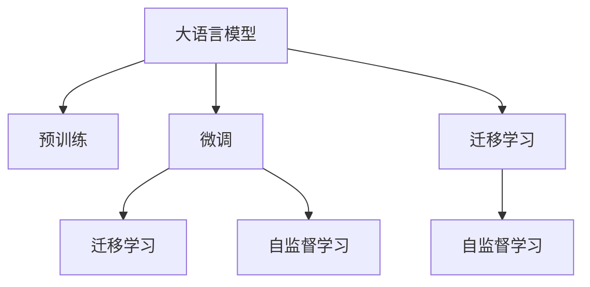
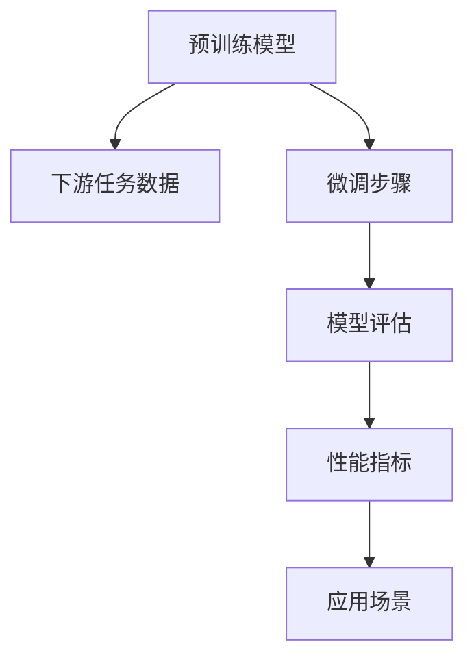

                 

# 大语言模型原理基础与前沿 评估

> 关键词：大语言模型,Transformer,BERT,深度学习,神经网络,自然语言处理,NLP,自监督学习,迁移学习,预训练

## 1. 背景介绍

### 1.1 问题由来
随着深度学习技术的迅速发展，大语言模型（Large Language Models, LLMs）在自然语言处理（Natural Language Processing, NLP）领域取得了显著的进步。大语言模型通过在大规模无标签文本数据上预训练，获得了丰富的语言知识和常识。这些模型通常包括GPT、BERT、T5等，在各种NLP任务上表现出色，如文本分类、命名实体识别、关系抽取、问答系统、文本摘要、机器翻译等。

### 1.2 问题核心关键点
大语言模型的核心在于其强大的语言表示能力，但面对特定任务时，其通用性可能不足。例如，对于某一领域的特定数据集，直接使用预训练模型进行微调（Fine-tuning）可以显著提升模型在该任务上的性能，但同时也会引入新的问题，如过拟合、模型鲁棒性等。

### 1.3 问题研究意义
研究大语言模型的原理和评估方法，有助于更深入地理解其工作机制，优化模型性能，推动其在实际应用中的落地。通过评估不同模型和算法的效果，可以发现提升点，加速技术进步。

## 2. 核心概念与联系

### 2.1 核心概念概述

为了更好地理解大语言模型的原理和评估方法，本节将介绍几个密切相关的核心概念：

- **大语言模型（Large Language Model, LLM）**：一种通过在大规模无标签文本数据上进行预训练，学习通用语言表示的模型。
- **自监督学习（Self-supervised Learning）**：通过无标签数据进行训练，使得模型在自身预测中学习到数据的潜在规律和结构。
- **迁移学习（Transfer Learning）**：利用预训练模型在不同任务之间的知识迁移，提升模型在新任务上的性能。
- **预训练（Pre-training）**：在大规模无标签数据上训练模型，学习通用的语言表示。
- **微调（Fine-tuning）**：在预训练模型基础上，使用下游任务的少量标注数据进行有监督学习，优化模型在该任务上的性能。

这些概念之间存在密切联系，共同构成了大语言模型的学习和应用框架。以下是一个Mermaid流程图，展示了这些概念之间的关系：



### 2.2 核心概念原理和架构的 Mermaid 流程图


该流程图简要展示了预训练模型经过下游任务数据微调后的评估流程。预训练模型通过下游任务数据进行微调，然后通过性能指标进行评估，最后应用于实际场景。

## 3. 核心算法原理 & 具体操作步骤

### 3.1 算法原理概述
大语言模型的评估通常包括以下几个步骤：

1. **预训练模型选择**：选择合适的预训练模型作为微调的基础。
2. **数据集准备**：准备下游任务的标注数据集，划分为训练集、验证集和测试集。
3. **模型微调**：使用下游任务的数据对预训练模型进行微调，优化模型在该任务上的性能。
4. **模型评估**：在测试集上评估微调后的模型性能，通过性能指标进行评估。
5. **应用部署**：将微调后的模型部署到实际应用中，进行推理预测。

### 3.2 算法步骤详解
以下将详细介绍大语言模型的评估步骤：

**Step 1: 预训练模型选择**
- 选择合适的预训练模型作为微调的基础，如BERT、GPT-3等。
- 评估模型的性能，确保其与下游任务的需求相匹配。

**Step 2: 数据集准备**
- 准备下游任务的标注数据集，划分为训练集、验证集和测试集。
- 确保标注数据的质量和数量，避免过拟合和欠拟合。

**Step 3: 模型微调**
- 使用下游任务的数据对预训练模型进行微调。
- 选择合适的优化器（如AdamW、SGD等），设置合适的学习率。
- 应用正则化技术，防止过拟合。
- 设定合适的微调轮数和批量大小，避免资源浪费和性能损失。

**Step 4: 模型评估**
- 在测试集上评估微调后的模型性能，计算性能指标。
- 使用多种评估指标，如准确率、精确率、召回率、F1分数等。
- 绘制混淆矩阵，分析模型的预测性能。

**Step 5: 应用部署**
- 将微调后的模型部署到实际应用中，进行推理预测。
- 考虑模型的可扩展性和可维护性，设计合适的部署方案。

### 3.3 算法优缺点

#### 优点
- **高效性**：微调方法简单高效，能够快速提升模型在特定任务上的性能。
- **通用性**：适用于多种NLP任务，如文本分类、命名实体识别、问答系统等。
- **可解释性**：相比于黑盒模型，微调模型更易于解释和理解。

#### 缺点
- **依赖标注数据**：微调效果依赖于标注数据的质量和数量，获取高质量标注数据的成本较高。
- **模型鲁棒性有限**：当目标任务与预训练数据的分布差异较大时，微调的性能提升有限。
- **模型可解释性不足**：微调模型通常缺乏可解释性，难以对其推理逻辑进行分析和调试。

### 3.4 算法应用领域
大语言模型的评估方法在多个领域得到了广泛应用，包括：

- **文本分类**：如情感分析、主题分类、意图识别等。
- **命名实体识别**：识别文本中的人名、地名、机构名等特定实体。
- **关系抽取**：从文本中抽取实体之间的语义关系。
- **问答系统**：对自然语言问题给出答案。
- **机器翻译**：将源语言文本翻译成目标语言。
- **文本摘要**：将长文本压缩成简短摘要。
- **对话系统**：使机器能够与人自然对话。

这些应用领域展示了微调方法的广泛适用性和实际效果。

## 4. 数学模型和公式 & 详细讲解 & 举例说明

### 4.1 数学模型构建
假设预训练模型为 $M_{\theta}$，下游任务为 $T$，标注数据集为 $D=\{(x_i,y_i)\}_{i=1}^N$，其中 $x_i$ 为输入文本，$y_i$ 为对应的标签。微调的目标是最小化模型在标注数据上的损失函数 $\mathcal{L}(\theta)$。

### 4.2 公式推导过程
假设模型在输入 $x_i$ 上的输出为 $\hat{y}=M_{\theta}(x_i)$，则交叉熵损失函数为：

$$
\ell(M_{\theta}(x_i),y_i) = -y_i\log M_{\theta}(x_i) - (1-y_i)\log(1-M_{\theta}(x_i))
$$

微调的目标是最小化交叉熵损失函数的平均值：

$$
\mathcal{L}(\theta) = \frac{1}{N} \sum_{i=1}^N \ell(M_{\theta}(x_i),y_i)
$$

使用梯度下降算法优化 $\mathcal{L}(\theta)$，更新模型参数 $\theta$：

$$
\theta \leftarrow \theta - \eta \nabla_{\theta}\mathcal{L}(\theta)
$$

其中 $\eta$ 为学习率，$\nabla_{\theta}\mathcal{L}(\theta)$ 为损失函数对参数 $\theta$ 的梯度。

### 4.3 案例分析与讲解
以情感分析任务为例，假设模型在输入文本上的输出表示为情感概率 $p=\text{softmax}(M_{\theta}(x_i))$，则分类交叉熵损失函数为：

$$
\ell(M_{\theta}(x_i),y_i) = -y_i \log p_i - (1-y_i) \log(1-p_i)
$$

其中 $p_i$ 为模型在输入文本 $x_i$ 上输出的情感概率。

使用准确率、精确率、召回率等指标评估模型性能：

- **准确率**：正确预测的样本数占总样本数的比例。
- **精确率**：正确预测为正类的样本数占预测为正类的样本数的比例。
- **召回率**：正确预测为正类的样本数占真实正类样本数的比例。
- **F1分数**：精确率和召回率的调和平均数。

## 5. 项目实践：代码实例和详细解释说明

### 5.1 开发环境搭建
安装Python、PyTorch、TensorFlow等工具包。使用Anaconda创建虚拟环境，使用GPU加速训练。

### 5.2 源代码详细实现
以下是使用PyTorch进行BERT微调情感分析的代码实现：

```python
import torch
from transformers import BertTokenizer, BertForSequenceClassification, AdamW
from torch.utils.data import DataLoader, RandomSampler, SequentialSampler

# 准备数据集
tokenizer = BertTokenizer.from_pretrained('bert-base-uncased')
train_data, test_data = load_data()

# 分批次加载数据
train_sampler = SequentialSampler(train_data)
train_dataloader = DataLoader(train_data, sampler=train_sampler, batch_size=32)

test_sampler = SequentialSampler(test_data)
test_dataloader = DataLoader(test_data, sampler=test_sampler, batch_size=32)

# 准备模型
model = BertForSequenceClassification.from_pretrained('bert-base-uncased', num_labels=2)
device = torch.device("cuda" if torch.cuda.is_available() else "cpu")
model.to(device)

# 准备优化器
optimizer = AdamW(model.parameters(), lr=2e-5)

# 微调过程
for epoch in range(3):
    for batch in train_dataloader:
        input_ids = batch[0].to(device)
        attention_mask = batch[1].to(device)
        labels = batch[2].to(device)
        
        model.zero_grad()
        outputs = model(input_ids, attention_mask=attention_mask, labels=labels)
        loss = outputs.loss
        loss.backward()
        optimizer.step()

    # 在测试集上评估模型
    test_loss, test_acc = evaluate(model, test_dataloader)
    print(f"Epoch {epoch+1}, test acc: {test_acc:.3f}")
```

### 5.3 代码解读与分析
- `load_data()`：加载并分批处理数据集。
- `BertTokenizer`：用于分词和转换文本为模型输入格式。
- `BertForSequenceClassification`：预训练BERT模型，用于序列分类任务。
- `AdamW`：优化器，用于模型参数更新。
- `RandomSampler` 和 `SequentialSampler`：数据采样器，用于分批次加载数据。
- `evaluate()`：在测试集上评估模型性能。

### 5.4 运行结果展示
运行上述代码，可以得到模型在不同epoch下的测试准确率，评估模型性能。

## 6. 实际应用场景

### 6.4 未来应用展望
大语言模型的评估方法在NLP领域的应用前景广阔。未来，基于大语言模型的评估方法将在以下几个方面取得突破：

- **多模态融合**：融合视觉、语音等多模态数据，提升模型的泛化能力和应用范围。
- **因果学习**：引入因果推断，增强模型的因果关系，提升决策的合理性和可靠性。
- **零样本学习**：通过提示模板，实现零样本学习和少样本学习，降低标注数据的依赖。
- **可解释性增强**：开发可解释性强的模型，提供模型推理的详细解释，增强透明度和可信度。
- **模型鲁棒性提升**：研究模型鲁棒性，避免过拟合和灾难性遗忘，提高模型泛化能力。

## 7. 工具和资源推荐

### 7.1 学习资源推荐
- **《自然语言处理综论》**：介绍自然语言处理的基本概念和算法。
- **Coursera上的自然语言处理课程**：由斯坦福大学等名校教授开设的课程，涵盖自然语言处理的理论和技术。
- **HuggingFace官方文档**：提供丰富的预训练模型和微调范式，适合实战练习。

### 7.2 开发工具推荐
- **PyTorch**：强大的深度学习框架，支持GPU加速，适合分布式训练。
- **TensorFlow**：广泛使用的深度学习框架，支持多种硬件平台。
- **Jupyter Notebook**：免费的交互式编程环境，适合数据处理和模型开发。

### 7.3 相关论文推荐
- **Attention is All You Need**：提出Transformer模型，开创了预训练语言模型的先河。
- **BERT: Pre-training of Deep Bidirectional Transformers for Language Understanding**：提出BERT模型，通过掩码语言模型和下一句预测任务进行预训练。
- **Adaptive Low-Rank Adaptation for Parameter-Efficient Fine-Tuning**：提出AdaLoRA方法，实现参数高效微调，提升模型性能。

## 8. 总结：未来发展趋势与挑战

### 8.1 研究成果总结
大语言模型的评估方法在NLP领域取得了显著进展，广泛应用于文本分类、命名实体识别、问答系统等任务。通过评估，可以发现提升模型性能的新方法和新技术，推动模型不断进步。

### 8.2 未来发展趋势
未来大语言模型的评估方法将呈现以下发展趋势：

- **参数高效微调**：通过只更新部分参数，提高模型泛化能力和计算效率。
- **零样本学习和少样本学习**：通过提示模板，实现零样本学习和少样本学习，降低标注数据的依赖。
- **多模态融合**：融合视觉、语音等多模态数据，提升模型的泛化能力和应用范围。
- **可解释性增强**：开发可解释性强的模型，提供模型推理的详细解释，增强透明度和可信度。

### 8.3 面临的挑战
大语言模型的评估方法在实际应用中仍面临以下挑战：

- **标注数据依赖**：微调方法依赖于标注数据，获取高质量标注数据的成本较高。
- **模型鲁棒性不足**：模型面对新数据时，泛化性能有限。
- **可解释性不足**：微调模型通常缺乏可解释性，难以对其推理逻辑进行分析和调试。

### 8.4 研究展望
未来大语言模型的评估方法将在以下几个方面取得突破：

- **参数高效微调**：通过只更新部分参数，提高模型泛化能力和计算效率。
- **零样本学习和少样本学习**：通过提示模板，实现零样本学习和少样本学习，降低标注数据的依赖。
- **多模态融合**：融合视觉、语音等多模态数据，提升模型的泛化能力和应用范围。
- **可解释性增强**：开发可解释性强的模型，提供模型推理的详细解释，增强透明度和可信度。

## 9. 附录：常见问题与解答

### Q1: 如何选择合适的预训练模型？

A: 选择预训练模型时，需要考虑模型的规模、任务适配性、可解释性等因素。例如，对于文本分类任务，可以使用BERT等预训练模型，对于机器翻译任务，可以使用GPT等预训练模型。

### Q2: 如何防止模型过拟合？

A: 防止模型过拟合的方法包括数据增强、正则化、早停等。数据增强可以通过回译、近义替换等方式扩充训练集。正则化可以通过L2正则、Dropout等方式避免过拟合。早停可以通过在验证集上监测性能指标，及时停止训练。

### Q3: 如何提高模型泛化能力？

A: 提高模型泛化能力的方法包括模型裁剪、量化加速、混合精度训练等。模型裁剪可以去除不必要的层和参数，减小模型尺寸。量化加速可以将浮点模型转为定点模型，压缩存储空间，提高计算效率。混合精度训练可以同时使用不同精度的数据和参数，提高训练速度和稳定性。

### Q4: 如何提升模型可解释性？

A: 提升模型可解释性的方法包括使用可解释的模型结构、开发可解释性工具等。例如，使用线性分类器代替复杂模型，使用LIME等工具进行可解释性分析。

### Q5: 如何优化模型推理速度？

A: 优化模型推理速度的方法包括模型裁剪、量化加速、模型并行等。模型裁剪可以去除不必要的层和参数，减小模型尺寸。量化加速可以将浮点模型转为定点模型，压缩存储空间，提高计算效率。模型并行可以通过分布式训练和推理，提高计算效率。

---

作者：禅与计算机程序设计艺术 / Zen and the Art of Computer Programming

