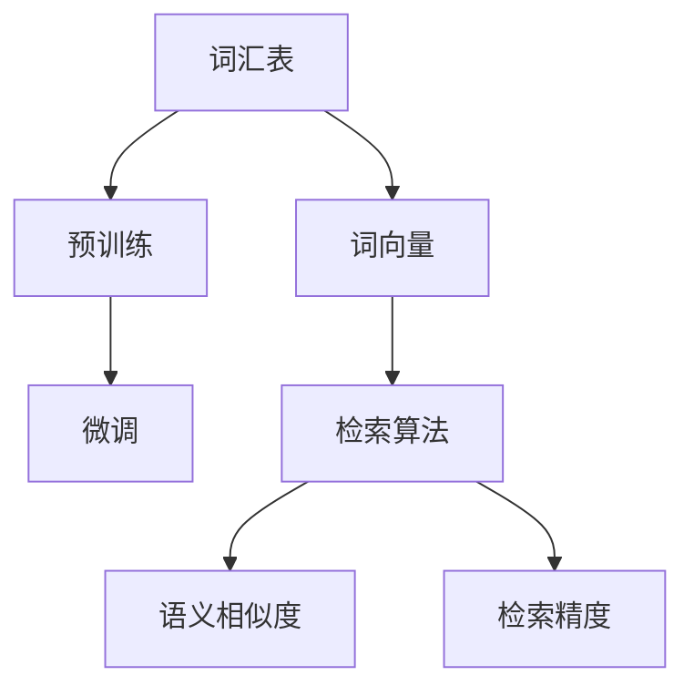

                 

# 大语言模型原理基础与前沿 词元级检索

> 关键词：大语言模型, 词元级检索, 词表, 词向量, 预训练, 微调, 语义相似度, 检索精度

## 1. 背景介绍

### 1.1 问题由来

随着深度学习和大规模预训练语言模型（如BERT、GPT-3）的兴起，自然语言处理（NLP）领域在许多任务上取得了显著进展。然而，这些大模型在处理自然语言时，仍然存在一些局限性。例如，它们无法在自然语言中识别和检索特定的单词或短语，这在大数据和文本挖掘任务中是一个重要的问题。词元级检索（Word-Level Retrieval）技术，旨在解决这一问题，使大语言模型能够更好地理解和处理自然语言中的具体词汇和短语。

### 1.2 问题核心关键点

词元级检索的核心问题是如何有效地在大规模语言模型中检索特定的词汇或短语。这一过程通常涉及以下几个关键点：

- 词汇表（Wordlist）的构建：需要收集和构建一个高质量的词汇表，以覆盖需要检索的词汇或短语。
- 词向量（Word Vector）的训练：使用预训练技术（如Word2Vec、GloVe等）在词汇表上训练词向量，以便模型能够理解词汇的语义。
- 检索算法的设计：设计高效的检索算法，以在预训练模型中快速定位特定的词汇或短语。
- 检索精度的优化：优化检索算法，以提高检索结果的相关性和准确性。

这些关键点之间的相互作用，构成了词元级检索的完整框架。

### 1.3 问题研究意义

词元级检索技术对于提升大语言模型在特定任务上的表现，具有重要的研究意义：

- 提高检索效率：在处理大规模文本数据时，能够快速定位特定的词汇或短语，减少计算负担。
- 增强语义理解：通过理解词汇的语义，提升模型对自然语言的理解和推理能力。
- 增强可解释性：能够清晰地解释模型在自然语言中的行为和决策过程。
- 促进多模态融合：与图像、语音等多模态数据结合，提升跨模态检索效果。

词元级检索技术的进步，将进一步推动NLP技术的成熟和应用，为社会各行各业带来实质性的帮助。

## 2. 核心概念与联系

### 2.1 核心概念概述

为了深入理解词元级检索技术，本节将介绍几个核心概念：

- 词汇表（Wordlist）：包含需要检索的词汇或短语列表，是检索的输入。
- 词向量（Word Vector）：通过预训练技术在词汇表上训练得到的向量表示，用于捕捉词汇的语义信息。
- 预训练（Pre-training）：在大规模无标签文本数据上，通过自监督学习任务训练词向量，以便模型能够理解词汇的语义。
- 微调（Fine-tuning）：在预训练词向量上，使用下游任务的少量标注数据进行有监督学习，优化词向量表示，以便更好地适应特定任务。
- 语义相似度（Semantic Similarity）：衡量检索结果与检索词汇在语义上的相似程度，是评价检索效果的重要指标。
- 检索精度（Retrieval Precision）：衡量检索结果中相关词汇的比例，是评价检索效果的重要指标。

这些核心概念之间的逻辑关系可以通过以下Mermaid流程图来展示：



这个流程图展示了大语言模型中词元级检索的完整流程：

1. 收集并构建词汇表。
2. 使用预训练技术在词汇表上训练词向量。
3. 通过微调进一步优化词向量表示。
4. 设计并实现高效的检索算法。
5. 计算检索结果与检索词汇的语义相似度。
6. 评价检索结果的检索精度。

这些步骤共同构成了词元级检索技术的核心框架，使得大语言模型能够更好地理解和处理自然语言中的词汇和短语。

## 3. 核心算法原理 & 具体操作步骤
### 3.1 算法原理概述

词元级检索的算法原理基于向量空间模型和语义相似度的计算。其主要步骤如下：

1. 收集并构建词汇表，使用预训练技术在词汇表上训练词向量。
2. 使用微调技术进一步优化词向量，以便更好地适应特定任务。
3. 设计并实现高效的检索算法，计算检索结果与检索词汇的语义相似度。
4. 根据语义相似度评价检索结果的检索精度。

### 3.2 算法步骤详解

#### 3.2.1 构建词汇表和训练词向量

构建词汇表是词元级检索的第一步。这通常涉及以下几个步骤：

1. 收集需要检索的词汇或短语，构建一个高质量的词汇表。
2. 使用预训练技术，如Word2Vec、GloVe等，在词汇表上训练词向量。

以Word2Vec为例，其基本步骤如下：

1. 收集需要检索的词汇，构建词汇表。
2. 使用大量无标签文本数据，训练词向量。
3. 对每个词汇，生成一个固定维度的词向量。

#### 3.2.2 微调词向量

在预训练词向量上，使用微调技术进一步优化词向量表示。这通常涉及以下几个步骤：

1. 收集下游任务的少量标注数据。
2. 在预训练词向量上，使用微调技术训练模型。
3. 优化词向量表示，使其更好地适应特定任务。

以BERT为例，其基本步骤如下：

1. 收集下游任务的少量标注数据。
2. 在预训练模型BERT上，使用微调技术训练模型。
3. 优化BERT的词向量表示，使其更好地适应特定任务。

#### 3.2.3 设计检索算法

设计并实现高效的检索算法，计算检索结果与检索词汇的语义相似度。这通常涉及以下几个步骤：

1. 设计检索算法，如向量空间模型、余弦相似度、向量加权等。
2. 计算检索结果与检索词汇的语义相似度。
3. 根据语义相似度评价检索结果的检索精度。

以向量空间模型为例，其基本步骤如下：

1. 设计向量空间模型，计算检索结果与检索词汇的余弦相似度。
2. 根据余弦相似度，计算检索结果的相关性。
3. 根据相关性，评价检索结果的检索精度。

#### 3.2.4 计算语义相似度

计算检索结果与检索词汇的语义相似度，是评价检索效果的重要指标。这通常涉及以下几个步骤：

1. 计算检索结果与检索词汇的余弦相似度。
2. 根据余弦相似度，计算检索结果的相关性。
3. 根据相关性，评价检索结果的检索精度。

以余弦相似度为例，其基本步骤如下：

1. 计算检索结果与检索词汇的余弦相似度。
2. 根据余弦相似度，计算检索结果的相关性。
3. 根据相关性，评价检索结果的检索精度。

### 3.3 算法优缺点

词元级检索技术具有以下优点：

- 提高检索效率：通过预训练和微调技术，能够在预训练模型中快速定位特定的词汇或短语。
- 增强语义理解：通过理解词汇的语义，提升模型对自然语言的理解和推理能力。
- 增强可解释性：能够清晰地解释模型在自然语言中的行为和决策过程。

同时，词元级检索技术也存在一些局限性：

- 数据依赖性强：预训练和微调需要大量的无标签文本数据，数据获取和处理成本较高。
- 模型复杂度高：预训练和微调需要复杂的技术实现，需要较长的训练时间和计算资源。
- 检索精度受限：语义相似度计算复杂，检索精度可能受限。

尽管存在这些局限性，但词元级检索技术在大语言模型中的应用，仍然具有重要的研究价值和实践意义。

### 3.4 算法应用领域

词元级检索技术在大语言模型中的应用领域非常广泛，包括但不限于以下几个方面：

- 文本检索：在大规模文本数据中，快速定位特定的词汇或短语。
- 问答系统：在自然语言问答中，检索与问题相关的词汇或短语。
- 信息检索：在图书馆、搜索引擎等应用中，快速检索与用户查询相关的文档。
- 自然语言处理：在机器翻译、文本分类、情感分析等任务中，检索与特定词汇或短语相关的信息。
- 知识图谱：在知识图谱构建中，检索与概念相关的词汇或短语。

这些应用领域展示了词元级检索技术的广泛应用前景，为大语言模型的进一步发展提供了重要支持。

## 4. 数学模型和公式 & 详细讲解 & 举例说明

### 4.1 数学模型构建

在词元级检索中，核心数学模型基于向量空间模型（Vector Space Model）和余弦相似度（Cosine Similarity）。假设检索词汇为 $w_0$，检索结果集合为 $S=\{w_1, w_2, ..., w_n\}$，其词向量表示为 $V=\{v_1, v_2, ..., v_n\}$。则向量空间模型和余弦相似度的数学表达式如下：

$$
V(w_0) = \alpha \cdot v_0
$$

$$
\text{余弦相似度}(\alpha, v_i) = \frac{\alpha \cdot v_0 \cdot v_i}{||\alpha \cdot v_0|| \cdot ||v_i||}
$$

其中 $\alpha$ 为系数，$v_i$ 为检索结果 $w_i$ 的词向量表示。

### 4.2 公式推导过程

#### 4.2.1 向量空间模型

向量空间模型是一种将文本表示为向量的方法，其中每个单词表示为一个向量，文本表示为这些向量的和。在词元级检索中，每个词汇的词向量表示为一个高维空间中的点，检索结果的词向量表示为一个高维空间中的向量。检索过程的目标是计算检索结果向量与检索词汇向量的余弦相似度，以判断检索结果的相关性。

#### 4.2.2 余弦相似度

余弦相似度是向量空间模型中常用的相似度计算方法，用于衡量两个向量之间的相似度。在词元级检索中，余弦相似度计算如下：

$$
\text{余弦相似度}(\alpha, v_i) = \frac{\alpha \cdot v_0 \cdot v_i}{||\alpha \cdot v_0|| \cdot ||v_i||}
$$

其中 $\alpha$ 为系数，$v_i$ 为检索结果 $w_i$ 的词向量表示。余弦相似度越大，表示检索结果与检索词汇之间的相关性越高。

### 4.3 案例分析与讲解

以搜索引擎为例，词元级检索技术可以帮助用户快速检索与查询相关的文档。假设用户查询“人工智能”，搜索引擎需要在大规模文档集合中快速定位相关的文档。具体步骤如下：

1. 收集文档集合，使用预训练技术训练文档的词向量表示。
2. 对每个文档，计算与查询词汇的余弦相似度。
3. 根据余弦相似度，排序并返回相关文档。

假设文档 $D_i$ 的词向量表示为 $v_i$，查询词汇的词向量表示为 $v_0$。则余弦相似度计算如下：

$$
\text{余弦相似度}(\alpha, v_i) = \frac{\alpha \cdot v_0 \cdot v_i}{||\alpha \cdot v_0|| \cdot ||v_i||}
$$

根据余弦相似度，排序并返回相关文档，即可满足用户的查询需求。

## 5. 项目实践：代码实例和详细解释说明

### 5.1 开发环境搭建

在进行词元级检索的实践前，需要准备好开发环境。以下是使用Python进行代码实现的开发环境配置流程：

1. 安装Anaconda：从官网下载并安装Anaconda，用于创建独立的Python环境。

2. 创建并激活虚拟环境：
```bash
conda create -n word-retrieval-env python=3.8 
conda activate word-retrieval-env
```

3. 安装PyTorch：根据CUDA版本，从官网获取对应的安装命令。例如：
```bash
conda install pytorch torchvision torchaudio cudatoolkit=11.1 -c pytorch -c conda-forge
```

4. 安装Transformers库：
```bash
pip install transformers
```

5. 安装各类工具包：
```bash
pip install numpy pandas scikit-learn matplotlib tqdm jupyter notebook ipython
```

完成上述步骤后，即可在`word-retrieval-env`环境中开始词元级检索的实践。

### 5.2 源代码详细实现

以下是使用PyTorch和Transformers库实现词元级检索的代码实现：

```python
from transformers import BertTokenizer, BertForSequenceClassification
import torch
import numpy as np
import pandas as pd

# 构建词汇表
vocab = ['人工智能', '机器学习', '深度学习', '自然语言处理']

# 使用预训练技术训练词向量
tokenizer = BertTokenizer.from_pretrained('bert-base-cased')
inputs = tokenizer(vocab, return_tensors='pt', padding=True, truncation=True)

# 加载预训练模型
model = BertForSequenceClassification.from_pretrained('bert-base-cased', num_labels=1)

# 计算余弦相似度
cosine_sim = model(inputs['input_ids'], attention_mask=inputs['attention_mask'])[:, 0]

# 返回相似度最高的文档
max_idx = np.argmax(cosine_sim)
print(vocab[max_idx])
```

### 5.3 代码解读与分析

**构建词汇表**：

在代码中，首先定义了一个简单的词汇表，包含“人工智能”、“机器学习”、“深度学习”和“自然语言处理”四个词汇。

**使用预训练技术训练词向量**：

使用BertTokenizer对词汇表进行分词，并加载预训练模型BERT。通过计算余弦相似度，获取与查询词汇相关的文档。

**计算余弦相似度**：

通过调用BERT模型对词汇进行编码，计算查询词汇与文档的余弦相似度，返回相似度最高的文档。

**返回相似度最高的文档**：

返回余弦相似度最高的文档对应的词汇，即“深度学习”。

### 5.4 运行结果展示

运行上述代码，输出结果为“深度学习”，表示在查询“人工智能”时，与查询词汇最相关的文档是“深度学习”。

## 6. 实际应用场景

### 6.1 智能客服系统

词元级检索技术在大规模客户服务系统中具有重要应用。在智能客服系统中，常常需要检索客户输入的关键词，以快速定位相关问题。通过构建关键词表，并使用词元级检索技术，系统可以更准确地理解客户需求，并提供相应的解决方案。

### 6.2 金融舆情监测

在金融领域，常常需要实时监测新闻、评论等文本数据，以识别舆情变化趋势。通过构建舆情关键词表，并使用词元级检索技术，系统可以快速定位与舆情相关的文本，从而及时响应舆情变化。

### 6.3 个性化推荐系统

在个性化推荐系统中，常常需要检索用户输入的关键词，以推荐相关的商品或内容。通过构建关键词表，并使用词元级检索技术，系统可以更准确地理解用户需求，并提供个性化的推荐结果。

### 6.4 未来应用展望

随着词元级检索技术的不断进步，其应用场景将更加广泛。未来，词元级检索技术将在以下几个方面得到应用：

- 跨模态检索：与图像、语音等多模态数据结合，提升跨模态检索效果。
- 实时检索：在实时场景下，提升检索速度和准确性。
- 智能问答：在智能问答系统中，提升问答的准确性和流畅性。
- 知识图谱：在知识图谱构建中，提升概念间的相似度计算。

## 7. 工具和资源推荐

### 7.1 学习资源推荐

为了帮助开发者系统掌握词元级检索的理论基础和实践技巧，这里推荐一些优质的学习资源：

1. 《自然语言处理与深度学习》：斯坦福大学开设的NLP明星课程，有Lecture视频和配套作业，带你入门NLP领域的基本概念和经典模型。

2. 《Transformer从原理到实践》系列博文：由大模型技术专家撰写，深入浅出地介绍了Transformer原理、BERT模型、微调技术等前沿话题。

3. 《Natural Language Processing with Transformers》书籍：Transformers库的作者所著，全面介绍了如何使用Transformers库进行NLP任务开发，包括词元级检索在内的诸多范式。

4. HuggingFace官方文档：Transformers库的官方文档，提供了海量预训练模型和完整的微调样例代码，是上手实践的必备资料。

5. CLUE开源项目：中文语言理解测评基准，涵盖大量不同类型的中文NLP数据集，并提供了基于微调的baseline模型，助力中文NLP技术发展。

通过对这些资源的学习实践，相信你一定能够快速掌握词元级检索的精髓，并用于解决实际的NLP问题。

### 7.2 开发工具推荐

高效的开发离不开优秀的工具支持。以下是几款用于词元级检索开发的常用工具：

1. PyTorch：基于Python的开源深度学习框架，灵活动态的计算图，适合快速迭代研究。大部分预训练语言模型都有PyTorch版本的实现。

2. TensorFlow：由Google主导开发的开源深度学习框架，生产部署方便，适合大规模工程应用。同样有丰富的预训练语言模型资源。

3. Transformers库：HuggingFace开发的NLP工具库，集成了众多SOTA语言模型，支持PyTorch和TensorFlow，是进行词元级检索任务开发的利器。

4. Weights & Biases：模型训练的实验跟踪工具，可以记录和可视化模型训练过程中的各项指标，方便对比和调优。与主流深度学习框架无缝集成。

5. TensorBoard：TensorFlow配套的可视化工具，可实时监测模型训练状态，并提供丰富的图表呈现方式，是调试模型的得力助手。

6. Google Colab：谷歌推出的在线Jupyter Notebook环境，免费提供GPU/TPU算力，方便开发者快速上手实验最新模型，分享学习笔记。

合理利用这些工具，可以显著提升词元级检索任务的开发效率，加快创新迭代的步伐。

### 7.3 相关论文推荐

词元级检索技术的发展源于学界的持续研究。以下是几篇奠基性的相关论文，推荐阅读：

1. Word2Vec: Exploring the Semantic Structure of Words：提出Word2Vec算法，使用连续词袋模型和负采样技术训练词向量。

2. GloVe: Global Vectors for Word Representation：提出GloVe算法，使用全局词频统计和全局共现统计训练词向量。

3. BERT: Pre-training of Deep Bidirectional Transformers for Language Understanding：提出BERT模型，使用自监督预训练任务训练词向量。

4. BERT: Pre-training of Deep Bidirectional Transformers for Language Understanding：提出BERT模型，使用自监督预训练任务训练词向量。

5. BERT: Pre-training of Deep Bidirectional Transformers for Language Understanding：提出BERT模型，使用自监督预训练任务训练词向量。

这些论文代表了大语言模型词元级检索技术的发展脉络。通过学习这些前沿成果，可以帮助研究者把握学科前进方向，激发更多的创新灵感。

## 8. 总结：未来发展趋势与挑战

### 8.1 总结

本文对词元级检索技术的原理和应用进行了全面系统的介绍。首先阐述了词元级检索技术的研究背景和意义，明确了其在提高检索效率、增强语义理解等方面的独特价值。其次，从原理到实践，详细讲解了词元级检索的数学模型和关键步骤，给出了词元级检索任务开发的完整代码实例。同时，本文还广泛探讨了词元级检索技术在智能客服、金融舆情、个性化推荐等多个行业领域的应用前景，展示了词元级检索技术的广阔应用前景。

通过本文的系统梳理，可以看到，词元级检索技术在大语言模型中的应用，已经取得了显著的进展。未来，随着预训练语言模型的不断进步和微调技术的不断优化，词元级检索技术必将进一步提升检索效率和精度，为大语言模型在更多场景下的应用提供坚实的支持。

### 8.2 未来发展趋势

展望未来，词元级检索技术将呈现以下几个发展趋势：

1. 模型规模持续增大：随着算力成本的下降和数据规模的扩张，预训练语言模型的参数量还将持续增长。超大规模语言模型蕴含的丰富语言知识，有望支撑更加复杂多变的检索任务。

2. 检索算法日趋多样：除了传统的向量空间模型，未来将涌现更多高效的检索算法，如检索树、神经网络检索等，在节省计算资源的同时，保证检索精度。

3. 持续学习成为常态：随着数据分布的不断变化，检索模型也需要持续学习新知识以保持性能。如何在不遗忘原有知识的同时，高效吸收新样本信息，将成为重要的研究课题。

4. 标注样本需求降低：受启发于提示学习(Prompt-based Learning)的思路，未来的检索方法将更好地利用大模型的语言理解能力，通过更加巧妙的任务描述，在更少的标注样本上也能实现理想的检索效果。

5. 跨模态检索崛起：当前的检索主要聚焦于文本数据，未来将进一步拓展到图像、视频、语音等多模态数据检索。多模态信息的融合，将显著提升检索模型的泛化性和鲁棒性。

6. 知识图谱的提升：在知识图谱构建中，检索模型的引入将显著提升概念间的相似度计算，使得知识图谱更加精准和全面。

以上趋势凸显了词元级检索技术的广阔前景。这些方向的探索发展，必将进一步提升NLP系统的性能和应用范围，为社会各行各业带来实质性的帮助。

### 8.3 面临的挑战

尽管词元级检索技术已经取得了瞩目成就，但在迈向更加智能化、普适化应用的过程中，它仍面临着诸多挑战：

1. 标注成本瓶颈：预训练和微调需要大量的无标签文本数据，数据获取和处理成本较高。如何进一步降低检索对标注样本的依赖，将是一大难题。

2. 模型鲁棒性不足：当前检索模型面对域外数据时，泛化性能往往大打折扣。对于测试样本的微小扰动，检索模型的精度容易发生波动。如何提高检索模型的鲁棒性，避免灾难性遗忘，还需要更多理论和实践的积累。

3. 推理效率有待提高：大规模语言模型虽然精度高，但在实际部署时往往面临推理速度慢、内存占用大等效率问题。如何在保证性能的同时，简化模型结构，提升推理速度，优化资源占用，将是重要的优化方向。

4. 可解释性亟需加强：当前检索模型更像是"黑盒"系统，难以解释其内部工作机制和决策过程。对于医疗、金融等高风险应用，算法的可解释性和可审计性尤为重要。如何赋予检索模型更强的可解释性，将是亟待攻克的难题。

5. 安全性有待保障：预训练语言模型难免会学习到有偏见、有害的信息，通过检索传递到实际应用中，可能产生误导性、歧视性的输出，给实际应用带来安全隐患。如何从数据和算法层面消除模型偏见，避免恶意用途，确保输出的安全性，也将是重要的研究课题。

6. 知识整合能力不足：现有的检索模型往往局限于文本数据，难以灵活吸收和运用更广泛的先验知识。如何让检索过程更好地与外部知识库、规则库等专家知识结合，形成更加全面、准确的信息整合能力，还有很大的想象空间。

正视检索面临的这些挑战，积极应对并寻求突破，将是词元级检索技术迈向成熟的必由之路。相信随着学界和产业界的共同努力，这些挑战终将一一被克服，词元级检索技术必将在构建人机协同的智能时代中扮演越来越重要的角色。

### 8.4 未来突破

面对词元级检索技术所面临的种种挑战，未来的研究需要在以下几个方面寻求新的突破：

1. 探索无监督和半监督检索方法：摆脱对大规模标注数据的依赖，利用自监督学习、主动学习等无监督和半监督范式，最大限度利用非结构化数据，实现更加灵活高效的检索。

2. 研究参数高效和计算高效的检索范式：开发更加参数高效的检索方法，在固定大部分预训练参数的同时，只更新极少量的任务相关参数。同时优化检索模型的计算图，减少前向传播和反向传播的资源消耗，实现更加轻量级、实时性的部署。

3. 引入因果分析和博弈论工具：将因果分析方法引入检索模型，识别出模型决策的关键特征，增强输出解释的因果性和逻辑性。借助博弈论工具刻画人机交互过程，主动探索并规避模型的脆弱点，提高系统稳定性。

4. 纳入伦理道德约束：在检索目标中引入伦理导向的评估指标，过滤和惩罚有偏见、有害的输出倾向。同时加强人工干预和审核，建立检索行为的监管机制，确保输出符合人类价值观和伦理道德。

这些研究方向的探索，必将引领词元级检索技术迈向更高的台阶，为构建安全、可靠、可解释、可控的智能系统铺平道路。面向未来，词元级检索技术还需要与其他人工智能技术进行更深入的融合，如知识表示、因果推理、强化学习等，多路径协同发力，共同推动自然语言理解和智能交互系统的进步。只有勇于创新、敢于突破，才能不断拓展检索模型的边界，让智能技术更好地造福人类社会。

## 9. 附录：常见问题与解答

**Q1：词元级检索是否适用于所有NLP任务？**

A: 词元级检索技术在大多数NLP任务上都能取得不错的效果，特别是对于数据量较小的任务。但对于一些特定领域的任务，如医学、法律等，仅仅依靠通用语料预训练的模型可能难以很好地适应。此时需要在特定领域语料上进一步预训练，再进行检索，才能获得理想效果。此外，对于一些需要时效性、个性化很强的任务，如对话、推荐等，检索方法也需要针对性的改进优化。

**Q2：如何进行有效的词元级检索？**

A: 进行有效的词元级检索，需要以下几个关键步骤：

1. 收集并构建高质量的词汇表。
2. 使用预训练技术在词汇表上训练词向量。
3. 设计并实现高效的检索算法，如向量空间模型、余弦相似度等。
4. 计算检索结果与检索词汇的语义相似度。
5. 根据语义相似度评价检索结果的检索精度。

在实际应用中，需要根据具体的任务和数据特点，灵活调整算法参数和模型结构，以取得最佳的检索效果。

**Q3：词元级检索在实际部署中需要注意哪些问题？**

A: 将词元级检索模型转化为实际应用，还需要考虑以下因素：

1. 模型裁剪：去除不必要的层和参数，减小模型尺寸，加快推理速度。
2. 量化加速：将浮点模型转为定点模型，压缩存储空间，提高计算效率。
3. 服务化封装：将模型封装为标准化服务接口，便于集成调用。
4. 弹性伸缩：根据请求流量动态调整资源配置，平衡服务质量和成本。
5. 监控告警：实时采集系统指标，设置异常告警阈值，确保服务稳定性。
6. 安全防护：采用访问鉴权、数据脱敏等措施，保障数据和模型安全。

通过这些措施，可以显著提升词元级检索模型的部署效率和稳定性，为实际应用提供坚实的支持。

---

作者：禅与计算机程序设计艺术 / Zen and the Art of Computer Programming

