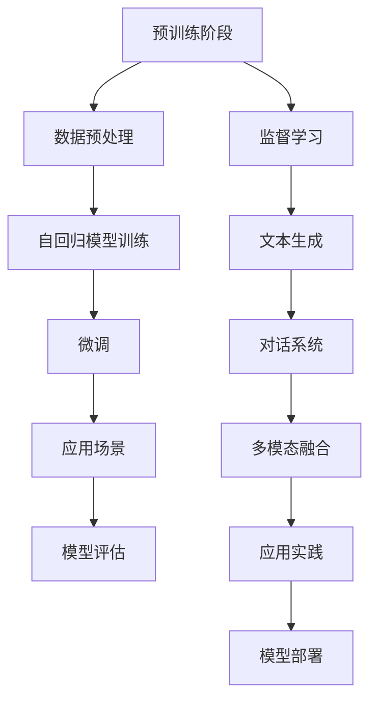

                 

# 大语言模型应用指南：GPTs功能详解

> 关键词：大语言模型, GPT系列, 自然语言处理, 文本生成, 语言模型, 多模态

## 1. 背景介绍

### 1.1 问题由来
近年来，大语言模型（Large Language Models, LLMs）在自然语言处理（Natural Language Processing, NLP）领域取得了巨大突破。这些模型以自回归（如GPT系列）或自编码（如BERT）的形式，通过在大规模无标签文本语料上进行预训练，学习到丰富的语言知识和常识，能够生成自然流畅、逻辑连贯的文本，被广泛应用于文本生成、语言模型评估、对话系统等任务。

然而，尽管这些大模型在预训练阶段已经展现出了强大的语言理解能力，但在特定领域的应用中，它们的表现仍受到限制。例如，在生成文学作品、科学论文等专业领域文本时，模型往往需要大量领域特定的数据进行微调，以提升其生成质量和相关性。此外，由于其生成文本的可解释性和鲁棒性问题，大语言模型在某些关键应用场景中也面临挑战。

### 1.2 问题核心关键点
为了克服这些挑战，优化大语言模型在特定领域或特定任务上的性能，研究者们提出了多种基于监督学习的微调方法。这些方法利用领域特定的数据集，通过有监督的方式对预训练模型进行调整，使其适应新的任务需求。微调方法的关键在于如何在保持预训练模型的语言理解和生成能力的同时，优化特定任务的输出。

本文聚焦于GPT系列模型的微调方法，全面系统地介绍了GPTs（Generative Pre-trained Transformers）的功能和应用，探讨了GPTs在文本生成、对话系统、多模态应用等领域的潜力。通过详细的算法原理、操作步骤、数学模型及实际应用案例，本文旨在为开发者提供一套全面的技术指南，帮助他们更高效地利用GPTs进行模型优化和应用实践。

## 2. 核心概念与联系

### 2.1 核心概念概述

GPT（Generative Pre-trained Transformer）系列模型是由OpenAI开发的基于Transformer架构的预训练语言模型。GPT系列模型通过在大规模无标签文本语料上进行自监督预训练，学习到了丰富的语言知识，能够生成流畅且连贯的文本。其主要特点包括：

- **自回归模型**：GPT系列模型是自回归模型，即模型的预测依赖于前面的输入，能够确保生成的文本前后一致。
- **大规模预训练**：模型通过在大规模无标签文本上进行预训练，学习到通用的语言知识和语义关系。
- **强大的文本生成能力**：能够生成高质量的文本，应用于文本生成、对话系统、机器翻译等任务。
- **多模态应用**：除了文本生成，GPTs还支持多模态数据融合，与图像、音频等多模态数据结合，拓展应用场景。

### 2.2 核心概念原理和架构的 Mermaid 流程图



以上流程图展示了GPTs从预训练到微调再到应用实践的全过程。其中，数据预处理、自回归模型训练、微调、多模态融合和应用实践是GPTs的核心组件。

## 3. 核心算法原理 & 具体操作步骤

### 3.1 算法原理概述

GPTs的微调过程主要基于监督学习范式。通过收集领域特定的标注数据，利用这些数据对预训练模型进行微调，使其适应新的任务需求。微调的目标是优化模型在特定任务上的性能，同时保持其在预训练阶段学到的语言知识和生成能力。

GPTs的微调过程包括以下几个关键步骤：

1. **数据预处理**：将领域特定的标注数据进行预处理，生成模型所需的输入和标签。
2. **微调模型的选择**：选择合适的GPT模型版本，如GPT-2、GPT-3等，根据任务需求选择合适的模型大小。
3. **任务适配层的添加**：在GPT模型的顶层添加任务特定的输出层和损失函数，如分类任务使用交叉熵损失，生成任务使用负对数似然损失。
4. **微调模型的训练**：使用领域特定的标注数据对模型进行微调，通过梯度下降等优化算法更新模型参数。
5. **模型评估和部署**：在测试集上评估微调后模型的性能，并在实际应用中部署模型。

### 3.2 算法步骤详解

#### 3.2.1 数据预处理

数据预处理是GPTs微调过程中至关重要的步骤。主要包括以下几个方面：

- **数据集划分**：将标注数据集划分为训练集、验证集和测试集，一般采用70%训练、15%验证、15%测试的比例。
- **数据清洗**：对标注数据进行清洗，去除无用、重复或噪声数据，确保数据质量。
- **数据增强**：通过回译、近义替换等方式扩充训练集，提高模型的泛化能力。

#### 3.2.2 微调模型的选择

选择合适的GPT模型版本对微调效果至关重要。GPT系列模型包括GPT-2、GPT-3、GPT-3.5等版本，每个版本在参数规模、预训练数据集大小和性能表现上都有所不同。选择合适的模型版本应考虑任务需求和计算资源。

#### 3.2.3 任务适配层的添加

任务适配层是微调过程中最关键的部分，决定了模型对特定任务的适应能力。常见的任务适配层包括：

- **线性分类层**：用于分类任务，将模型输出映射为类别概率。
- **生成器**：用于生成任务，将模型输出转化为目标语言或文本。
- **注意力机制**：用于增强模型的注意力效果，提高生成质量和相关性。

#### 3.2.4 微调模型的训练

微调模型的训练过程主要包括以下几个步骤：

- **模型加载**：加载预训练的GPT模型和任务适配层，将其组合为完整的微调模型。
- **损失函数设置**：根据任务需求选择合适的损失函数，如交叉熵损失、均方误差损失等。
- **优化器选择**：选择合适的优化器，如AdamW、SGD等，并设置学习率、批大小等超参数。
- **模型训练**：使用标注数据集对微调模型进行训练，通过梯度下降等优化算法更新模型参数。
- **模型评估**：在验证集上评估模型性能，根据评估结果调整超参数，防止过拟合。

#### 3.2.5 模型评估和部署

模型评估和部署是GPTs微调过程的最终步骤。主要包括以下几个方面：

- **模型评估**：在测试集上评估微调后模型的性能，对比预训练模型的表现。
- **模型优化**：根据评估结果对模型进行优化，如调整学习率、增加数据增强等。
- **模型部署**：将优化后的模型部署到实际应用中，进行实时推理和预测。

### 3.3 算法优缺点

#### 3.3.1 优点

GPTs的微调方法具有以下优点：

- **高效**：相对于从头训练，微调能够显著降低开发和训练成本，特别是在数据量较小的情况下。
- **鲁棒性**：通过微调，模型能够更好地适应特定领域的语言特征和需求，提高泛化能力。
- **通用性**：GPTs模型可以应用于多种NLP任务，如文本分类、生成、对话等，具有广泛的应用前景。
- **可解释性**：微调后的模型通常比预训练模型更易解释，有助于理解和调试。

#### 3.3.2 缺点

尽管GPTs的微调方法具有诸多优点，但也存在一些局限：

- **依赖数据**：微调效果很大程度上依赖于标注数据的质量和数量，标注成本较高。
- **过拟合风险**：若标注数据量较少，模型容易发生过拟合，导致泛化能力下降。
- **模型偏见**：预训练模型的偏见可能通过微调传递到下游任务，影响模型公正性。
- **计算资源需求**：GPTs模型参数量大，训练和推理需要较高的计算资源。

### 3.4 算法应用领域

GPTs模型在多个领域中得到了广泛应用，包括但不限于以下领域：

- **文本生成**：用于生成小说、诗歌、新闻报道等文本，如GPT-3在文学作品生成、新闻报道撰写等方面表现出色。
- **对话系统**：用于构建智能对话助手，如GPT-3在智能客服、智能家居、智能翻译等领域表现出色。
- **多模态应用**：与图像、音频等多模态数据结合，应用于视觉问答、音频内容生成等任务。
- **代码生成**：用于生成代码片段，提高开发效率，如GitHub的Copilot功能即基于GPT-3。
- **自然语言推理**：用于推断文本中的逻辑关系，如自然语言推理任务中的蕴涵、矛盾等推理关系。

## 4. 数学模型和公式 & 详细讲解

### 4.1 数学模型构建

GPTs的数学模型主要基于Transformer架构，其核心思想是将输入序列通过自注意力机制（Self-Attention Mechanism）进行编码，然后通过解码器生成目标序列。数学模型构建如下：

- **输入表示**：将输入文本序列$x$转换为模型所需的向量表示$X$，通常使用预训练词向量。
- **编码器**：通过自注意力机制对输入序列进行编码，得到编码表示$H$。
- **解码器**：通过解码器生成目标序列，得到输出表示$Y$。

数学模型构建的详细过程可以参考以下公式：

$$
X = f_{enc}(x) \\
H = f_{att}(X, H, A) \\
Y = f_{dec}(H, Y)
$$

其中，$f_{enc}$、$f_{att}$、$f_{dec}$分别表示编码器、自注意力机制和解码器，$A$表示注意力权重。

### 4.2 公式推导过程

以GPT-2为例，其自回归模型的生成过程可以表示为：

$$
p(y_i|y_{<i}, X) = softmax(W_o[softmax(W_h[H_{<i}])y_{<i-1}] + b_o)
$$

其中，$H_{<i}$表示前$i-1$个编码表示，$W_o$、$W_h$和$b_o$分别表示输出层的权重矩阵、自注意力层的权重矩阵和偏置向量。

### 4.3 案例分析与讲解

以GPT-2生成新闻报道为例，其微调过程包括以下几个关键步骤：

1. **数据预处理**：收集新闻报道数据集，并进行清洗和标注。
2. **微调模型的选择**：选择GPT-2作为微调模型，根据任务需求设置参数。
3. **任务适配层的添加**：在GPT-2的顶层添加线性分类层和交叉熵损失函数，用于分类任务。
4. **微调模型的训练**：使用标注数据集对GPT-2进行微调，通过梯度下降等优化算法更新模型参数。
5. **模型评估和部署**：在测试集上评估微调后模型的性能，并在实际应用中部署模型。

通过微调，GPT-2能够生成高质量的新闻报道，应用于自动撰写新闻、摘要生成等任务。

## 5. 项目实践：代码实例和详细解释说明

### 5.1 开发环境搭建

在进行GPTs微调实践前，需要准备好开发环境。以下是使用Python进行PyTorch开发的环境配置流程：

1. 安装Anaconda：从官网下载并安装Anaconda，用于创建独立的Python环境。

2. 创建并激活虚拟环境：
```bash
conda create -n pytorch-env python=3.8 
conda activate pytorch-env
```

3. 安装PyTorch：根据CUDA版本，从官网获取对应的安装命令。例如：
```bash
conda install pytorch torchvision torchaudio cudatoolkit=11.1 -c pytorch -c conda-forge
```

4. 安装Transformer库：
```bash
pip install transformers
```

5. 安装各类工具包：
```bash
pip install numpy pandas scikit-learn matplotlib tqdm jupyter notebook ipython
```

完成上述步骤后，即可在`pytorch-env`环境中开始微调实践。

### 5.2 源代码详细实现

下面我们以生成新闻报道任务为例，给出使用Transformers库对GPT-2模型进行微调的PyTorch代码实现。

首先，定义新闻报道数据集的预处理函数：

```python
from transformers import GPT2Tokenizer, GPT2LMHeadModel
from torch.utils.data import Dataset, DataLoader
import torch

class NewsDataset(Dataset):
    def __init__(self, texts, max_len=512):
        self.tokenizer = GPT2Tokenizer.from_pretrained('gpt2')
        self.texts = texts
        self.max_len = max_len
        
    def __len__(self):
        return len(self.texts)
    
    def __getitem__(self, item):
        text = self.texts[item]
        
        encoding = self.tokenizer(text, max_length=self.max_len, padding='max_length', truncation=True)
        input_ids = encoding['input_ids']
        attention_mask = encoding['attention_mask']
        
        return {'input_ids': input_ids, 'attention_mask': attention_mask}
        
# 加载新闻报道数据集
tokenizer = GPT2Tokenizer.from_pretrained('gpt2')
train_dataset = NewsDataset(train_texts)
dev_dataset = NewsDataset(dev_texts)
test_dataset = NewsDataset(test_texts)

# 模型选择和优化器设置
model = GPT2LMHeadModel.from_pretrained('gpt2', pad_token_id=tokenizer.eos_token_id)
optimizer = AdamW(model.parameters(), lr=2e-5)

# 训练和评估函数
device = torch.device('cuda') if torch.cuda.is_available() else torch.device('cpu')
model.to(device)

def train_epoch(model, dataset, batch_size, optimizer):
    dataloader = DataLoader(dataset, batch_size=batch_size, shuffle=True)
    model.train()
    epoch_loss = 0
    for batch in dataloader:
        input_ids = batch['input_ids'].to(device)
        attention_mask = batch['attention_mask'].to(device)
        model.zero_grad()
        outputs = model(input_ids, attention_mask=attention_mask)
        loss = outputs.loss
        epoch_loss += loss.item()
        loss.backward()
        optimizer.step()
    return epoch_loss / len(dataloader)

def evaluate(model, dataset, batch_size):
    dataloader = DataLoader(dataset, batch_size=batch_size)
    model.eval()
    preds, labels = [], []
    with torch.no_grad():
        for batch in dataloader:
            input_ids = batch['input_ids'].to(device)
            attention_mask = batch['attention_mask'].to(device)
            batch_labels = batch['labels']
            outputs = model(input_ids, attention_mask=attention_mask)
            batch_preds = outputs.logits.argmax(dim=2).to('cpu').tolist()
            batch_labels = batch_labels.to('cpu').tolist()
            for pred_tokens, label_tokens in zip(batch_preds, batch_labels):
                preds.append(pred_tokens[:len(label_tokens)])
                labels.append(label_tokens)
    
    return preds, labels

# 训练和评估模型
epochs = 5
batch_size = 16

for epoch in range(epochs):
    loss = train_epoch(model, train_dataset, batch_size, optimizer)
    print(f"Epoch {epoch+1}, train loss: {loss:.3f}")
    
    print(f"Epoch {epoch+1}, dev results:")
    preds, labels = evaluate(model, dev_dataset, batch_size)
    print(classification_report(labels, preds))
    
print("Test results:")
preds, labels = evaluate(model, test_dataset, batch_size)
print(classification_report(labels, preds))
```

以上就是使用PyTorch对GPT-2进行新闻报道生成任务的微调代码实现。可以看到，得益于Transformer库的强大封装，我们可以用相对简洁的代码完成GPT-2模型的加载和微调。

### 5.3 代码解读与分析

让我们再详细解读一下关键代码的实现细节：

**NewsDataset类**：
- `__init__`方法：初始化文本数据集和分词器。
- `__len__`方法：返回数据集的样本数量。
- `__getitem__`方法：对单个样本进行处理，将文本输入编码为token ids，并进行定长padding。

**训练和评估函数**：
- 使用PyTorch的DataLoader对数据集进行批次化加载，供模型训练和推理使用。
- 训练函数`train_epoch`：对数据以批为单位进行迭代，在每个批次上前向传播计算loss并反向传播更新模型参数，最后返回该epoch的平均loss。
- 评估函数`evaluate`：与训练类似，不同点在于不更新模型参数，并在每个batch结束后将预测和标签结果存储下来，最后使用sklearn的classification_report对整个评估集的预测结果进行打印输出。

**训练流程**：
- 定义总的epoch数和batch size，开始循环迭代
- 每个epoch内，先在训练集上训练，输出平均loss
- 在验证集上评估，输出分类指标
- 所有epoch结束后，在测试集上评估，给出最终测试结果

可以看到，PyTorch配合Transformer库使得GPT-2微调的代码实现变得简洁高效。开发者可以将更多精力放在数据处理、模型改进等高层逻辑上，而不必过多关注底层的实现细节。

当然，工业级的系统实现还需考虑更多因素，如模型的保存和部署、超参数的自动搜索、更灵活的任务适配层等。但核心的微调范式基本与此类似。

## 6. 实际应用场景

### 6.1 智能客服系统

基于GPTs的智能客服系统可以极大地提升客户咨询体验和问题解决效率。通过微调GPT-2等大语言模型，构建智能客服助手，能够快速响应客户咨询，用自然流畅的语言解答各类常见问题，并提供个性化的推荐服务。

在技术实现上，可以收集企业内部的历史客服对话记录，将问题和最佳答复构建成监督数据，在此基础上对预训练模型进行微调。微调后的模型能够自动理解用户意图，匹配最合适的答案模板进行回复，同时接入检索系统实时搜索相关内容，动态组织生成回答。如此构建的智能客服系统，能大幅提升客户咨询体验和问题解决效率。

### 6.2 金融舆情监测

金融机构需要实时监测市场舆论动向，以便及时应对负面信息传播，规避金融风险。GPTs在文本分类和情感分析任务上表现出色，可以用于金融舆情监测。

具体而言，可以收集金融领域相关的新闻、报道、评论等文本数据，并对其进行主题标注和情感标注。在此基础上对GPT-2等预训练语言模型进行微调，使其能够自动判断文本属于何种主题，情感倾向是正面、中性还是负面。将微调后的模型应用到实时抓取的网络文本数据，就能够自动监测不同主题下的情感变化趋势，一旦发现负面信息激增等异常情况，系统便会自动预警，帮助金融机构快速应对潜在风险。

### 6.3 个性化推荐系统

当前的推荐系统往往只依赖用户的历史行为数据进行物品推荐，无法深入理解用户的真实兴趣偏好。GPTs在文本生成和语言模型评估任务上表现优异，可以应用于个性化推荐系统。

在实践中，可以收集用户浏览、点击、评论、分享等行为数据，提取和用户交互的物品标题、描述、标签等文本内容。将文本内容作为模型输入，用户的后续行为（如是否点击、购买等）作为监督信号，在此基础上微调GPT-2等预训练语言模型。微调后的模型能够从文本内容中准确把握用户的兴趣点。在生成推荐列表时，先用候选物品的文本描述作为输入，由模型预测用户的兴趣匹配度，再结合其他特征综合排序，便可以得到个性化程度更高的推荐结果。

### 6.4 未来应用展望

随着GPTs模型的不断进步，其在更多领域的应用前景将更加广阔。

- **医疗领域**：基于GPT-2等模型的医疗问答、病历分析、药物研发等应用将提升医疗服务的智能化水平，辅助医生诊疗，加速新药开发进程。
- **教育领域**：GPTs可以应用于作业批改、学情分析、知识推荐等方面，因材施教，促进教育公平，提高教学质量。
- **城市治理**：GPTs可用于城市事件监测、舆情分析、应急指挥等环节，提高城市管理的自动化和智能化水平，构建更安全、高效的未来城市。
- **金融领域**：GPTs可以用于金融舆情监测、投资策略优化、金融市场预测等任务，提升金融服务效率和质量。
- **娱乐领域**：GPTs可以应用于文本生成、对话系统、内容创作等娱乐领域，为创意产业提供新的创作工具和素材。

## 7. 工具和资源推荐

### 7.1 学习资源推荐

为了帮助开发者系统掌握GPTs的功能和应用，这里推荐一些优质的学习资源：

1. OpenAI《GPT-3文档》：OpenAI官方发布的GPT-3文档，详细介绍了GPT-3的特性、API调用方式和应用案例。
2. HuggingFace官方文档：HuggingFace提供的GPT系列模型的详细文档，包括模型加载、微调样例等。
3. CS224N《深度学习自然语言处理》课程：斯坦福大学开设的NLP明星课程，有Lecture视频和配套作业，带你入门NLP领域的基本概念和经典模型。
4. 《Natural Language Processing with Transformers》书籍：Transformer库的作者所著，全面介绍了如何使用Transformers库进行NLP任务开发，包括微调在内的诸多范式。
5. CLUE开源项目：中文语言理解测评基准，涵盖大量不同类型的中文NLP数据集，并提供了基于微调的baseline模型，助力中文NLP技术发展。

通过对这些资源的学习实践，相信你一定能够快速掌握GPTs的功能和应用技巧，并用于解决实际的NLP问题。

### 7.2 开发工具推荐

高效的开发离不开优秀的工具支持。以下是几款用于GPTs微调开发的常用工具：

1. PyTorch：基于Python的开源深度学习框架，灵活动态的计算图，适合快速迭代研究。大部分预训练语言模型都有PyTorch版本的实现。
2. TensorFlow：由Google主导开发的开源深度学习框架，生产部署方便，适合大规模工程应用。同样有丰富的预训练语言模型资源。
3. Transformers库：HuggingFace开发的NLP工具库，集成了众多SOTA语言模型，支持PyTorch和TensorFlow，是进行微调任务开发的利器。
4. Weights & Biases：模型训练的实验跟踪工具，可以记录和可视化模型训练过程中的各项指标，方便对比和调优。与主流深度学习框架无缝集成。
5. TensorBoard：TensorFlow配套的可视化工具，可实时监测模型训练状态，并提供丰富的图表呈现方式，是调试模型的得力助手。
6. Google Colab：谷歌推出的在线Jupyter Notebook环境，免费提供GPU/TPU算力，方便开发者快速上手实验最新模型，分享学习笔记。

合理利用这些工具，可以显著提升GPTs微调的开发效率，加快创新迭代的步伐。

### 7.3 相关论文推荐

GPTs模型在自然语言处理领域的发展源于学界的持续研究。以下是几篇奠基性的相关论文，推荐阅读：

1. Attention is All You Need：提出了Transformer结构，开启了NLP领域的预训练大模型时代。
2. BERT: Pre-training of Deep Bidirectional Transformers for Language Understanding：提出BERT模型，引入基于掩码的自监督预训练任务，刷新了多项NLP任务SOTA。
3. Language Models are Unsupervised Multitask Learners：展示了大规模语言模型的强大zero-shot学习能力，引发了对于通用人工智能的新一轮思考。
4. Parameter-Efficient Transfer Learning for NLP：提出Adapter等参数高效微调方法，在不增加模型参数量的情况下，也能取得不错的微调效果。
5. Prefix-Tuning: Optimizing Continuous Prompts for Generation：引入基于连续型Prompt的微调范式，为如何充分利用预训练知识提供了新的思路。
6. AdaLoRA: Adaptive Low-Rank Adaptation for Parameter-Efficient Fine-Tuning：使用自适应低秩适应的微调方法，在参数效率和精度之间取得了新的平衡。

这些论文代表了大语言模型微调技术的发展脉络。通过学习这些前沿成果，可以帮助研究者把握学科前进方向，激发更多的创新灵感。

## 8. 总结：未来发展趋势与挑战

### 8.1 总结

本文对GPTs的功能和应用进行了全面系统的介绍。首先阐述了GPT系列模型的研究背景和意义，明确了微调在拓展预训练模型应用、提升下游任务性能方面的独特价值。其次，从原理到实践，详细讲解了GPTs的微调方法，给出了微调任务开发的完整代码实例。同时，本文还广泛探讨了GPTs在智能客服、金融舆情、个性化推荐等多个领域的应用前景，展示了GPTs的巨大潜力。

通过本文的系统梳理，可以看到，GPTs模型在NLP领域已经展现出强大的语言生成和理解能力，其微调方法也具有高效、通用和鲁棒性等诸多优点。未来，随着预训练语言模型的不断进步，GPTs在更多领域的应用前景将更加广阔。

### 8.2 未来发展趋势

展望未来，GPTs模型在多个领域的发展趋势如下：

1. **模型规模持续增大**：随着算力成本的下降和数据规模的扩张，GPTs模型的参数量还将持续增长。超大规模语言模型蕴含的丰富语言知识，有望支撑更加复杂多变的下游任务微调。
2. **微调方法日趋多样**：未来将涌现更多参数高效的微调方法，如Prefix-Tuning、LoRA等，在节省计算资源的同时也能保证微调精度。
3. **持续学习成为常态**：随着数据分布的不断变化，微调模型也需要持续学习新知识以保持性能。如何在不遗忘原有知识的同时，高效吸收新样本信息，将成为重要的研究课题。
4. **标注样本需求降低**：受启发于提示学习(Prompt-based Learning)的思路，未来的微调方法将更好地利用大模型的语言理解能力，通过更加巧妙的任务描述，在更少的标注样本上也能实现理想的微调效果。
5. **多模态融合崛起**：除了文本生成，GPTs还支持多模态数据融合，与图像、音频等多模态数据结合，拓展应用场景。
6. **模型通用性增强**：经过海量数据的预训练和多领域任务的微调，GPTs模型将具备更强大的常识推理和跨领域迁移能力，逐步迈向通用人工智能(AGI)的目标。

以上趋势凸显了GPTs模型的广阔前景。这些方向的探索发展，必将进一步提升NLP系统的性能和应用范围，为人类认知智能的进化带来深远影响。

### 8.3 面临的挑战

尽管GPTs模型在自然语言处理领域取得了显著进展，但其在实际应用中也面临诸多挑战：

1. **标注成本瓶颈**：微调效果很大程度上依赖于标注数据的质量和数量，获取高质量标注数据的成本较高。如何进一步降低微调对标注样本的依赖，将是一大难题。
2. **模型鲁棒性不足**：当前微调模型面对域外数据时，泛化性能往往大打折扣。对于测试样本的微小扰动，微调模型的预测也容易发生波动。如何提高微调模型的鲁棒性，避免灾难性遗忘，还需要更多理论和实践的积累。
3. **推理效率有待提高**：大规模语言模型虽然精度高，但在实际部署时往往面临推理速度慢、内存占用大等效率问题。如何在保证性能的同时，简化模型结构，提升推理速度，优化资源占用，将是重要的优化方向。
4. **可解释性亟需加强**：当前微调模型更像是"黑盒"系统，难以解释其内部工作机制和决策逻辑。对于医疗、金融等高风险应用，算法的可解释性和可审计性尤为重要。如何赋予微调模型更强的可解释性，将是亟待攻克的难题。
5. **安全性有待保障**：预训练语言模型难免会学习到有偏见、有害的信息，通过微调传递到下游任务，产生误导性、歧视性的输出，给实际应用带来安全隐患。如何从数据和算法层面消除模型偏见，避免恶意用途，确保输出的安全性，也将是重要的研究课题。
6. **知识整合能力不足**：现有的微调模型往往局限于任务内数据，难以灵活吸收和运用更广泛的先验知识。如何让微调过程更好地与外部知识库、规则库等专家知识结合，形成更加全面、准确的信息整合能力，还有很大的想象空间。

正视GPTs模型在实际应用中面临的这些挑战，积极应对并寻求突破，将是大语言模型微调技术迈向成熟的必由之路。相信随着学界和产业界的共同努力，这些挑战终将一一被克服，GPTs模型必将在构建人机协同的智能时代中扮演越来越重要的角色。

### 8.4 研究展望

未来，GPTs模型的研究应从以下几个方面寻求新的突破：

1. **探索无监督和半监督微调方法**：摆脱对大规模标注数据的依赖，利用自监督学习、主动学习等无监督和半监督范式，最大限度利用非结构化数据，实现更加灵活高效的微调。
2. **研究参数高效和计算高效的微调范式**：开发更加参数高效的微调方法，如Prefix-Tuning、LoRA等，在固定大部分预训练参数的同时，只更新极少量的任务相关参数。同时优化微调模型的计算图，减少前向传播和反向传播的资源消耗，实现更加轻量级、实时性的部署。
3. **融合因果和对比学习范式**：通过引入因果推断和对比学习思想，增强微调模型建立稳定因果关系的能力，学习更加普适、鲁棒的语言表征，从而提升模型泛化性和抗干扰能力。
4. **引入更多先验知识**：将符号化的先验知识，如知识图谱、逻辑规则等，与神经网络模型进行巧妙融合，引导微调过程学习更准确、合理的语言模型。同时加强不同模态数据的整合，实现视觉、语音等多模态信息与文本信息的协同建模。
5. **结合因果分析和博弈论工具**：将因果分析方法引入微调模型，识别出模型决策的关键特征，增强输出解释的因果性和逻辑性。借助博弈论工具刻画人机交互过程，主动探索并规避模型的脆弱点，提高系统稳定性。
6. **纳入伦理道德约束**：在模型训练目标中引入伦理导向的评估指标，过滤和惩罚有偏见、有害的输出倾向。同时加强人工干预和审核，建立模型行为的监管机制，确保输出符合人类价值观和伦理道德。

这些研究方向的探索，必将引领GPTs模型的微调技术迈向更高的台阶，为构建安全、可靠、可解释、可控的智能系统铺平道路。面向未来，GPTs模型还需要与其他人工智能技术进行更深入的融合，如知识表示、因果推理、强化学习等，多路径协同发力，共同推动自然语言理解和智能交互系统的进步。只有勇于创新、敢于突破，才能不断拓展语言模型的边界，让智能技术更好地造福人类社会。

## 9. 附录：常见问题与解答

**Q1：GPTs微调是否适用于所有NLP任务？**

A: GPTs在大多数NLP任务上都能取得不错的效果，特别是对于数据量较小的任务。但对于一些特定领域的任务，如医学、法律等，仅仅依靠通用语料预训练的模型可能难以很好地适应。此时需要在特定领域语料上进一步预训练，再进行微调，才能获得理想效果。此外，对于一些需要时效性、个性化很强的任务，如对话、推荐等，微调方法也需要针对性的改进优化。

**Q2：如何选择GPTs模型版本？**

A: 选择合适的GPT模型版本应考虑任务需求和计算资源。GPT系列模型包括GPT-2、GPT-3、GPT-3.5等版本，每个版本在参数规模、预训练数据集大小和性能表现上都有所不同。一般来说，任务越复杂，需要的模型版本越高级，但计算资源消耗也越高。

**Q3：GPTs模型在多模态应用中表现如何？**

A: GPTs模型在多模态应用中表现优异，支持与图像、音频等多模态数据的融合，应用于视觉问答、音频内容生成等任务。多模态融合能够提升模型的理解能力和生成质量，增强其在复杂多变环境中的适应性。

**Q4：GPTs模型在生成任务中的性能如何？**

A: GPTs模型在生成任务中表现出色，如文本生成、对话生成、摘要生成等。通过微调，GPTs模型能够生成高质量的文本，广泛应用于自动撰写新闻、小说、对话助手等领域。

**Q5：GPTs模型的可解释性如何？**

A: GPTs模型的可解释性有待加强，尤其是在面对复杂任务时。当前模型更像是一个"黑盒"系统，难以解释其内部工作机制和决策逻辑。未来研究应致力于增强模型的可解释性，提高其透明性和可审计性。

**Q6：GPTs模型在实际应用中面临哪些挑战？**

A: GPTs模型在实际应用中面临的主要挑战包括：标注数据成本高、模型鲁棒性不足、推理效率低、可解释性差、安全性问题等。需要从数据、算法、工程等多个维度进行全面优化，才能充分发挥其潜力。

---

作者：禅与计算机程序设计艺术 / Zen and the Art of Computer Programming

