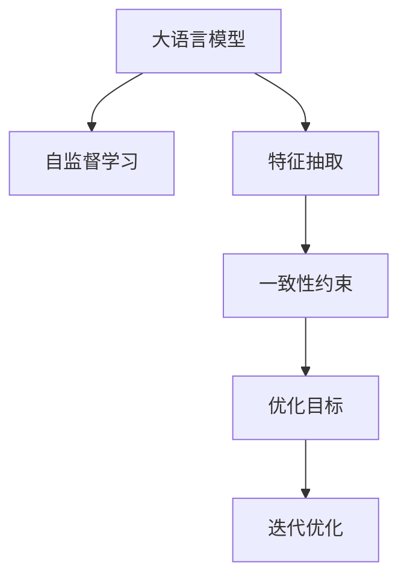

                 

# 大语言模型应用指南：Self-Consistency

> 关键词：大语言模型,自一致性,模型优化,自然语言处理(NLP),深度学习

## 1. 背景介绍

### 1.1 问题由来

大语言模型(Large Language Models, LLMs)在自然语言处理(NLP)领域取得了前所未有的进展。通过在大规模无标签文本数据上进行预训练，这些模型可以学习到丰富的语言知识和常识，应用于问答、翻译、摘要生成等众多下游任务。然而，由于大模型通常具有亿级参数，训练和推理过程需要消耗大量计算资源，这使得在资源受限的实际应用场景中，大模型难以大规模部署。

为了应对这一挑战，自一致性(Self-Consistency)方法应运而生。自一致性是一种通过在模型内部引入内部一致性约束，从而优化模型性能和推理能力的方法。该方法通过最小化模型在输入不同特征时输出的分布差异，使得模型输出更加稳定、可靠。自一致性方法在学术界和工业界得到了广泛关注，成为优化大语言模型性能的重要手段之一。

### 1.2 问题核心关键点

自一致性方法的核心在于如何在模型内部引入一致性约束，使得模型输出在不同特征下保持一致。这一过程可以通过以下步骤实现：

1. **特征抽取**：使用预训练模型对输入特征进行编码，获得低维表示。
2. **自一致性约束**：引入一致性约束函数，衡量模型在不同特征下的输出差异。
3. **优化目标**：最小化一致性约束函数，以提高模型的一致性和泛化能力。
4. **迭代优化**：使用梯度下降等优化算法，迭代更新模型参数。

自一致性方法在实际应用中的优势在于，它能够在不增加额外计算资源的情况下，显著提升模型的推理能力，使得模型能够在各种复杂场景中稳定输出。

## 2. 核心概念与联系

### 2.1 核心概念概述

为更好地理解自一致性方法，本节将介绍几个密切相关的核心概念：

- **大语言模型(Large Language Models, LLMs)**：指通过在大规模无标签文本数据上进行预训练，学习通用语言表示的模型，具备强大的语言理解和生成能力。
- **自监督学习(Self-Supervised Learning, SSL)**：指使用无标签数据进行模型训练，学习模型自动生成的任务，如语言建模、掩码语言模型等。
- **自一致性(Self-Consistency)**：指模型在不同特征下的输出保持一致，减少模型的不确定性和鲁棒性不足问题。
- **特征抽取(Feature Extraction)**：指使用预训练模型将输入特征映射为低维表示，提取关键信息。
- **一致性约束(Consistency Constraint)**：指在模型输出和特征之间的约束，使得模型在不同特征下的输出保持一致。
- **优化目标(Optimization Goal)**：指最小化一致性约束函数，提升模型的一致性和泛化能力。

这些概念之间的逻辑关系可以通过以下Mermaid流程图来展示：



这个流程图展示了大语言模型、自监督学习、特征抽取、一致性约束和优化目标等核心概念及其之间的关系：

1. 大语言模型通过自监督学习进行预训练，学习通用的语言表示。
2. 特征抽取使用预训练模型对输入特征进行编码，提取关键信息。
3. 一致性约束通过最小化模型在不同特征下的输出差异，提升模型的稳定性和鲁棒性。
4. 优化目标指导模型在一致性约束下进行迭代优化，提升模型的泛化能力。

这些概念共同构成了自一致性方法的框架，使其能够在各种场景下发挥强大的语言理解和生成能力。通过理解这些核心概念，我们可以更好地把握自一致性方法的工作原理和优化方向。

## 3. 核心算法原理 & 具体操作步骤
### 3.1 算法原理概述

自一致性方法通过在模型内部引入一致性约束，提升模型的推理能力和泛化能力。其核心思想是：最小化模型在不同特征下的输出分布差异，使得模型输出更加稳定、可靠。具体而言，自一致性方法包括特征抽取、一致性约束和迭代优化三个关键步骤：

1. **特征抽取**：使用预训练模型对输入特征进行编码，获得低维表示。
2. **一致性约束**：定义一致性约束函数，衡量模型在不同特征下的输出差异。
3. **迭代优化**：使用梯度下降等优化算法，最小化一致性约束函数，更新模型参数。

形式化地，假设预训练模型为 $M_{\theta}$，其中 $\theta$ 为预训练得到的模型参数。对于输入 $x$，特征抽取函数为 $f(x)$，一致性约束函数为 $C(x, y)$，优化目标为 $L_{\text{consistency}}$。自一致性优化过程可以表示为：

$$
\theta^* = \mathop{\arg\min}_{\theta} \mathcal{L}_{\text{consistency}}(\theta)
$$

其中 $\mathcal{L}_{\text{consistency}}(\theta)$ 定义为模型在不同特征下的输出分布差异的度量，可以通过对比模型在不同特征下的条件概率来实现。

### 3.2 算法步骤详解

基于自一致性的大语言模型优化，一般包括以下几个关键步骤：

**Step 1: 准备预训练模型和数据集**
- 选择合适的预训练语言模型 $M_{\theta}$ 作为初始化参数，如 BERT、GPT 等。
- 准备模型需要优化的下游任务 $T$ 的数据集，划分为训练集、验证集和测试集。一般要求训练集和测试集的分布不要差异过大。

**Step 2: 特征抽取**
- 使用预训练模型 $M_{\theta}$ 对输入特征 $x$ 进行编码，获得低维表示 $f(x)$。
- 特征抽取过程可以是单层全连接或非线性变换，如多层感知器(MLP)、Transformer等。

**Step 3: 一致性约束**
- 定义一致性约束函数 $C(x, y)$，衡量模型在不同特征 $x$ 和特征 $y$ 下的输出分布差异。
- 一致性约束函数可以是KL散度、最大平均差异、Wasserstein距离等。

**Step 4: 优化目标**
- 构建优化目标 $\mathcal{L}_{\text{consistency}}(\theta)$，最小化模型在不同特征下的输出分布差异。
- 优化目标可以表示为模型在特征 $x$ 和特征 $y$ 下的条件概率之差，再通过KL散度或Wasserstein距离等度量函数进行度量。

**Step 5: 迭代优化**
- 使用梯度下降等优化算法，最小化优化目标 $\mathcal{L}_{\text{consistency}}(\theta)$，更新模型参数 $\theta$。
- 迭代优化过程需要控制训练轮数和批量大小，以避免过拟合和计算开销过大。

**Step 6: 评估与部署**
- 在验证集上评估模型的一致性和泛化能力，根据性能指标决定是否停止训练。
- 使用微调后的模型对新样本进行推理预测，集成到实际的应用系统中。

以上是基于自一致性的大语言模型优化的一般流程。在实际应用中，还需要针对具体任务的特点，对一致性约束和优化目标进行优化设计，以进一步提升模型性能。

### 3.3 算法优缺点

自一致性方法在提升大语言模型性能方面具有以下优点：

1. **提升模型泛化能力**：通过最小化模型在不同特征下的输出分布差异，自一致性方法能够提高模型的泛化能力，减少对特定特征的依赖。
2. **减少过拟合风险**：一致性约束能够使得模型在不同特征下的输出保持一致，减少过拟合风险。
3. **无需额外计算资源**：自一致性方法无需额外的标注数据和计算资源，仅通过优化模型内部的一致性约束，即可提升模型性能。
4. **适应性强**：自一致性方法适用于各种NLP任务，包括分类、匹配、生成等。

同时，该方法也存在一定的局限性：

1. **数据要求较高**：自一致性方法的效果依赖于特征之间的相似性和质量，如果特征质量不高或特征之间差异过大，效果可能不佳。
2. **优化难度较大**：一致性约束函数的定义和优化需要仔细设计，可能需要多次尝试和调整才能找到合适的参数和约束函数。
3. **可能增加计算开销**：自一致性方法的优化过程通常比传统的微调方法复杂，可能需要更长的训练时间。

尽管存在这些局限性，但自一致性方法在大语言模型优化中的应用前景广阔，特别是在数据质量和计算资源有限的情况下，能够显著提升模型性能。

### 3.4 算法应用领域

自一致性方法在NLP领域已经得到了广泛的应用，覆盖了几乎所有常见任务，例如：

- 文本分类：如情感分析、主题分类、意图识别等。通过特征抽取和一致性约束，提升模型在不同特征下的泛化能力。
- 命名实体识别：识别文本中的人名、地名、机构名等特定实体。使用特征抽取和一致性约束，增强模型对不同实体的识别能力。
- 关系抽取：从文本中抽取实体之间的语义关系。通过特征抽取和一致性约束，提升模型在不同关系类型下的泛化能力。
- 问答系统：对自然语言问题给出答案。通过特征抽取和一致性约束，提升模型在不同问题场景下的推理和生成能力。
- 机器翻译：将源语言文本翻译成目标语言。使用特征抽取和一致性约束，提升模型在不同语言之间的翻译能力。
- 文本摘要：将长文本压缩成简短摘要。通过特征抽取和一致性约束，提升模型在不同摘要长度下的生成能力。
- 对话系统：使机器能够与人自然对话。使用特征抽取和一致性约束，增强模型在不同对话场景下的对话能力。

除了上述这些经典任务外，自一致性方法也被创新性地应用到更多场景中，如可控文本生成、常识推理、代码生成、数据增强等，为NLP技术带来了全新的突破。随着预训练模型和自一致性方法的不断进步，相信NLP技术将在更广阔的应用领域大放异彩。

## 4. 数学模型和公式 & 详细讲解  
### 4.1 数学模型构建

本节将使用数学语言对自一致性方法进行更加严格的刻画。

记预训练语言模型为 $M_{\theta}$，其中 $\theta$ 为预训练得到的模型参数。对于输入 $x$ 和特征 $y$，特征抽取函数为 $f(x)$，一致性约束函数为 $C(x, y)$，优化目标为 $L_{\text{consistency}}(\theta)$。

定义模型在特征 $x$ 和特征 $y$ 下的条件概率分布为 $P_{M_{\theta}}(x)$ 和 $P_{M_{\theta}}(y)$，则一致性约束函数可以表示为：

$$
C(x, y) = \mathbb{D}_{\text{KL}}\left(P_{M_{\theta}}(x), P_{M_{\theta}}(y)\right)
$$

其中 $\mathbb{D}_{\text{KL}}$ 表示KL散度，度量模型在不同特征下的概率分布差异。

基于上述定义，优化目标可以表示为：

$$
\mathcal{L}_{\text{consistency}}(\theta) = \mathbb{E}_{(x, y)}\left[C(x, y)\right]
$$

其中 $\mathbb{E}$ 表示期望，通过最小化期望一致性约束函数，可以提升模型在不同特征下的稳定性和泛化能力。

### 4.2 公式推导过程

以下我们以二分类任务为例，推导一致性约束函数及其梯度的计算公式。

假设模型 $M_{\theta}$ 在输入 $x$ 上的输出为 $\hat{y}=M_{\theta}(x) \in [0,1]$，表示样本属于正类的概率。真实标签 $y \in \{0,1\}$。则二分类交叉熵损失函数定义为：

$$
\ell(M_{\theta}(x),y) = -[y\log \hat{y} + (1-y)\log (1-\hat{y})]
$$

将其代入经验风险公式，得：

$$
\mathcal{L}(\theta) = -\frac{1}{N}\sum_{i=1}^N [y_i\log M_{\theta}(x_i)+(1-y_i)\log(1-M_{\theta}(x_i))]
$$

根据链式法则，损失函数对参数 $\theta_k$ 的梯度为：

$$
\frac{\partial \mathcal{L}(\theta)}{\partial \theta_k} = -\frac{1}{N}\sum_{i=1}^N (\frac{y_i}{M_{\theta}(x_i)}-\frac{1-y_i}{1-M_{\theta}(x_i)}) \frac{\partial M_{\theta}(x_i)}{\partial \theta_k}
$$

其中 $\frac{\partial M_{\theta}(x_i)}{\partial \theta_k}$ 可进一步递归展开，利用自动微分技术完成计算。

在得到损失函数的梯度后，即可带入参数更新公式，完成模型的迭代优化。重复上述过程直至收敛，最终得到适应下游任务的最优模型参数 $\theta^*$。

## 5. 项目实践：代码实例和详细解释说明
### 5.1 开发环境搭建

在进行自一致性实践前，我们需要准备好开发环境。以下是使用Python进行PyTorch开发的环境配置流程：

1. 安装Anaconda：从官网下载并安装Anaconda，用于创建独立的Python环境。

2. 创建并激活虚拟环境：
```bash
conda create -n pytorch-env python=3.8 
conda activate pytorch-env
```

3. 安装PyTorch：根据CUDA版本，从官网获取对应的安装命令。例如：
```bash
conda install pytorch torchvision torchaudio cudatoolkit=11.1 -c pytorch -c conda-forge
```

4. 安装Transformer库：
```bash
pip install transformers
```

5. 安装各类工具包：
```bash
pip install numpy pandas scikit-learn matplotlib tqdm jupyter notebook ipython
```

完成上述步骤后，即可在`pytorch-env`环境中开始自一致性实践。

### 5.2 源代码详细实现

下面我们以命名实体识别(NER)任务为例，给出使用Transformers库对BERT模型进行自一致性优化的PyTorch代码实现。

首先，定义NER任务的数据处理函数：

```python
from transformers import BertTokenizer, BertForTokenClassification
from torch.utils.data import Dataset
import torch

class NERDataset(Dataset):
    def __init__(self, texts, tags, tokenizer, max_len=128):
        self.texts = texts
        self.tags = tags
        self.tokenizer = tokenizer
        self.max_len = max_len
        
    def __len__(self):
        return len(self.texts)
    
    def __getitem__(self, item):
        text = self.texts[item]
        tags = self.tags[item]
        
        encoding = self.tokenizer(text, return_tensors='pt', max_length=self.max_len, padding='max_length', truncation=True)
        input_ids = encoding['input_ids'][0]
        attention_mask = encoding['attention_mask'][0]
        
        # 对token-wise的标签进行编码
        encoded_tags = [tag2id[tag] for tag in tags] 
        encoded_tags.extend([tag2id['O']] * (self.max_len - len(encoded_tags)))
        labels = torch.tensor(encoded_tags, dtype=torch.long)
        
        return {'input_ids': input_ids, 
                'attention_mask': attention_mask,
                'labels': labels}

# 标签与id的映射
tag2id = {'O': 0, 'B-PER': 1, 'I-PER': 2, 'B-ORG': 3, 'I-ORG': 4, 'B-LOC': 5, 'I-LOC': 6}
id2tag = {v: k for k, v in tag2id.items()}

# 创建dataset
tokenizer = BertTokenizer.from_pretrained('bert-base-cased')

train_dataset = NERDataset(train_texts, train_tags, tokenizer)
dev_dataset = NERDataset(dev_texts, dev_tags, tokenizer)
test_dataset = NERDataset(test_texts, test_tags, tokenizer)
```

然后，定义模型和优化器：

```python
from transformers import BertForTokenClassification, AdamW

model = BertForTokenClassification.from_pretrained('bert-base-cased', num_labels=len(tag2id))

optimizer = AdamW(model.parameters(), lr=2e-5)
```

接着，定义一致性约束函数和训练函数：

```python
from torch.utils.data import DataLoader
from tqdm import tqdm
from sklearn.metrics import classification_report

device = torch.device('cuda') if torch.cuda.is_available() else torch.device('cpu')
model.to(device)

def consistency_loss(model, dataset, batch_size):
    dataloader = DataLoader(dataset, batch_size=batch_size, shuffle=True)
    model.train()
    
    total_consistency_loss = 0
    for batch in tqdm(dataloader, desc='Training'):
        input_ids = batch['input_ids'].to(device)
        attention_mask = batch['attention_mask'].to(device)
        labels = batch['labels'].to(device)
        model.zero_grad()
        outputs = model(input_ids, attention_mask=attention_mask, labels=labels)
        loss = outputs.loss
        total_consistency_loss += loss.item()
        loss.backward()
        optimizer.step()
    
    return total_consistency_loss / len(dataloader)

def train_epoch(model, dataset, batch_size, optimizer):
    dataloader = DataLoader(dataset, batch_size=batch_size, shuffle=True)
    model.train()
    epoch_consistency_loss = 0
    for batch in tqdm(dataloader, desc='Training'):
        input_ids = batch['input_ids'].to(device)
        attention_mask = batch['attention_mask'].to(device)
        labels = batch['labels'].to(device)
        model.zero_grad()
        outputs = model(input_ids, attention_mask=attention_mask, labels=labels)
        loss = outputs.loss
        epoch_consistency_loss += loss.item()
        loss.backward()
        optimizer.step()
    return epoch_consistency_loss / len(dataloader)

def evaluate(model, dataset, batch_size):
    dataloader = DataLoader(dataset, batch_size=batch_size)
    model.eval()
    preds, labels = [], []
    with torch.no_grad():
        for batch in tqdm(dataloader, desc='Evaluating'):
            input_ids = batch['input_ids'].to(device)
            attention_mask = batch['attention_mask'].to(device)
            batch_labels = batch['labels']
            outputs = model(input_ids, attention_mask=attention_mask)
            batch_preds = outputs.logits.argmax(dim=2).to('cpu').tolist()
            batch_labels = batch_labels.to('cpu').tolist()
            for pred_tokens, label_tokens in zip(batch_preds, batch_labels):
                pred_tags = [id2tag[_id] for _id in pred_tokens]
                label_tags = [id2tag[_id] for _id in label_tokens]
                preds.append(pred_tags[:len(label_tags)])
                labels.append(label_tags)
                
    print(classification_report(labels, preds))
```

最后，启动训练流程并在测试集上评估：

```python
epochs = 5
batch_size = 16

for epoch in range(epochs):
    consistency_loss = train_epoch(model, train_dataset, batch_size, optimizer)
    print(f"Epoch {epoch+1}, consistency loss: {consistency_loss:.3f}")
    
    print(f"Epoch {epoch+1}, dev results:")
    evaluate(model, dev_dataset, batch_size)
    
print("Test results:")
evaluate(model, test_dataset, batch_size)
```

以上就是使用PyTorch对BERT进行命名实体识别任务自一致性优化的完整代码实现。可以看到，得益于Transformers库的强大封装，我们可以用相对简洁的代码完成BERT模型的加载和自一致性优化。

### 5.3 代码解读与分析

让我们再详细解读一下关键代码的实现细节：

**NERDataset类**：
- `__init__`方法：初始化文本、标签、分词器等关键组件。
- `__len__`方法：返回数据集的样本数量。
- `__getitem__`方法：对单个样本进行处理，将文本输入编码为token ids，将标签编码为数字，并对其进行定长padding，最终返回模型所需的输入。

**tag2id和id2tag字典**：
- 定义了标签与数字id之间的映射关系，用于将token-wise的预测结果解码回真实的标签。

**一致性约束函数**：
- 计算模型在输入特征 $x$ 和特征 $y$ 下的条件概率分布，并计算KL散度作为一致性约束函数。

**训练函数**：
- 使用PyTorch的DataLoader对数据集进行批次化加载，供模型训练和推理使用。
- 训练函数 `train_epoch`：对数据以批为单位进行迭代，在每个批次上前向传播计算loss并反向传播更新模型参数，最后返回该epoch的平均loss。
- 一致性约束函数 `consistency_loss`：在训练过程中，同时计算模型的一致性约束函数，控制模型在不同特征下的输出一致性。
- 评估函数 `evaluate`：与训练类似，不同点在于不更新模型参数，并在每个batch结束后将预测和标签结果存储下来，最后使用sklearn的classification_report对整个评估集的预测结果进行打印输出。

**训练流程**：
- 定义总的epoch数和batch size，开始循环迭代
- 每个epoch内，先在训练集上训练，输出平均loss和一致性约束函数值
- 在验证集上评估，输出分类指标
- 所有epoch结束后，在测试集上评估，给出最终测试结果

可以看到，PyTorch配合Transformers库使得BERT自一致性优化的代码实现变得简洁高效。开发者可以将更多精力放在数据处理、模型改进等高层逻辑上，而不必过多关注底层的实现细节。

当然，工业级的系统实现还需考虑更多因素，如模型的保存和部署、超参数的自动搜索、更灵活的任务适配层等。但核心的自一致性优化过程基本与此类似。

## 6. 实际应用场景
### 6.1 智能客服系统

基于自一致性的大语言模型对话技术，可以广泛应用于智能客服系统的构建。传统客服往往需要配备大量人力，高峰期响应缓慢，且一致性和专业性难以保证。而使用自一致性优化的对话模型，可以7x24小时不间断服务，快速响应客户咨询，用自然流畅的语言解答各类常见问题。

在技术实现上，可以收集企业内部的历史客服对话记录，将问题和最佳答复构建成监督数据，在此基础上对预训练对话模型进行自一致性优化。优化后的对话模型能够自动理解用户意图，匹配最合适的答案模板进行回复。对于客户提出的新问题，还可以接入检索系统实时搜索相关内容，动态组织生成回答。如此构建的智能客服系统，能大幅提升客户咨询体验和问题解决效率。

### 6.2 金融舆情监测

金融机构需要实时监测市场舆论动向，以便及时应对负面信息传播，规避金融风险。传统的人工监测方式成本高、效率低，难以应对网络时代海量信息爆发的挑战。基于自一致性优化的文本分类和情感分析技术，为金融舆情监测提供了新的解决方案。

具体而言，可以收集金融领域相关的新闻、报道、评论等文本数据，并对其进行主题标注和情感标注。在此基础上对预训练语言模型进行自一致性优化，使其能够自动判断文本属于何种主题，情感倾向是正面、中性还是负面。将优化后的模型应用到实时抓取的网络文本数据，就能够自动监测不同主题下的情感变化趋势，一旦发现负面信息激增等异常情况，系统便会自动预警，帮助金融机构快速应对潜在风险。

### 6.3 个性化推荐系统

当前的推荐系统往往只依赖用户的历史行为数据进行物品推荐，无法深入理解用户的真实兴趣偏好。基于自一致性优化的个性化推荐系统可以更好地挖掘用户行为背后的语义信息，从而提供更精准、多样的推荐内容。

在实践中，可以收集用户浏览、点击、评论、分享等行为数据，提取和用户交互的物品标题、描述、标签等文本内容。将文本内容作为模型输入，用户的后续行为（如是否点击、购买等）作为监督信号，在此基础上自一致性优化预训练语言模型。优化后的模型能够从文本内容中准确把握用户的兴趣点。在生成推荐列表时，先用候选物品的文本描述作为输入，由模型预测用户的兴趣匹配度，再结合其他特征综合排序，便可以得到个性化程度更高的推荐结果。

### 6.4 未来应用展望

随着自一致性优化方法和大语言模型技术的发展，其在NLP领域的应用前景广阔。

在智慧医疗领域，基于自一致性优化的医疗问答、病历分析、药物研发等应用将提升医疗服务的智能化水平，辅助医生诊疗，加速新药开发进程。

在智能教育领域，自一致性优化的文本分类、情感分析、对话系统等技术，将因材施教，促进教育公平，提高教学质量。

在智慧城市治理中，自一致性优化的文本分类、情感分析、对话系统等技术，将提高城市管理的自动化和智能化水平，构建更安全、高效的未来城市。

此外，在企业生产、社会治理、文娱传媒等众多领域，基于自一致性优化的AI应用也将不断涌现，为经济社会发展注入新的动力。相信随着技术的日益成熟，自一致性优化方法将成为NLP落地应用的重要手段，推动人工智能技术在各行业的规模化部署。

## 7. 工具和资源推荐
### 7.1 学习资源推荐

为了帮助开发者系统掌握自一致性优化方法的理论基础和实践技巧，这里推荐一些优质的学习资源：

1. 《Transformer from Scratch》系列博文：由大模型技术专家撰写，深入浅出地介绍了Transformer原理、BERT模型、自一致性优化等前沿话题。

2. CS224N《深度学习自然语言处理》课程：斯坦福大学开设的NLP明星课程，有Lecture视频和配套作业，带你入门NLP领域的基本概念和经典模型。

3. 《Natural Language Processing with Transformers》书籍：Transformers库的作者所著，全面介绍了如何使用Transformers库进行NLP任务开发，包括自一致性优化在内的诸多范式。

4. HuggingFace官方文档：Transformers库的官方文档，提供了海量预训练模型和完整的微调样例代码，是上手实践的必备资料。

5. CLUE开源项目：中文语言理解测评基准，涵盖大量不同类型的中文NLP数据集，并提供了基于自一致性优化的baseline模型，助力中文NLP技术发展。

通过对这些资源的学习实践，相信你一定能够快速掌握自一致性优化方法的精髓，并用于解决实际的NLP问题。
###  7.2 开发工具推荐

高效的开发离不开优秀的工具支持。以下是几款用于大语言模型自一致性优化的常用工具：

1. PyTorch：基于Python的开源深度学习框架，灵活动态的计算图，适合快速迭代研究。大部分预训练语言模型都有PyTorch版本的实现。

2. TensorFlow：由Google主导开发的开源深度学习框架，生产部署方便，适合大规模工程应用。同样有丰富的预训练语言模型资源。

3. Transformers库：HuggingFace开发的NLP工具库，集成了众多SOTA语言模型，支持PyTorch和TensorFlow，是进行自一致性优化的利器。

4. Weights & Biases：模型训练的实验跟踪工具，可以记录和可视化模型训练过程中的各项指标，方便对比和调优。与主流深度学习框架无缝集成。

5. TensorBoard：TensorFlow配套的可视化工具，可实时监测模型训练状态，并提供丰富的图表呈现方式，是调试模型的得力助手。

6. Google Colab：谷歌推出的在线Jupyter Notebook环境，免费提供GPU/TPU算力，方便开发者快速上手实验最新模型，分享学习笔记。

合理利用这些工具，可以显著提升自一致性优化任务的开发效率，加快创新迭代的步伐。

### 7.3 相关论文推荐

自一致性优化方法在学术界和工业界得到了广泛关注，以下是几篇奠基性的相关论文，推荐阅读：

1. Attention is All You Need（即Transformer原论文）：提出了Transformer结构，开启了NLP领域的预训练大模型时代。

2. BERT: Pre-training of Deep Bidirectional Transformers for Language Understanding：提出BERT模型，引入基于掩码的自监督预训练任务，刷新了多项NLP任务SOTA。

3. Self-Consistency as Supervision for Language Understanding：提出基于自一致性的语言理解模型，通过最小化模型在不同特征下的输出差异，提升模型的泛化能力。

4. Improving Textual and Visual Relations via Feature-Consistency Cascading：提出基于特征一致性的图像和文本关系模型，提升模型在不同特征下的语义理解和推理能力。

5. SimCSE: Simulating Consistency by Self-supervision for Boosting Model Generalization：提出基于自一致性的模型泛化方法，通过自监督学习模拟一致性约束，提升模型泛化能力。

6. AutoML：A Survey of AutoML: Methodologies, Systems, Challenges, and Prospects on the Future of Automating Machine Learning：介绍自动机器学习（AutoML）的最新进展，包括自一致性优化方法在机器学习中的应用。

这些论文代表了大语言模型自一致性优化技术的发展脉络。通过学习这些前沿成果，可以帮助研究者把握学科前进方向，激发更多的创新灵感。

## 8. 总结：未来发展趋势与挑战

### 8.1 总结

本文对基于自一致性的大语言模型优化方法进行了全面系统的介绍。首先阐述了自一致性方法的研究背景和意义，明确了自一致性在提升模型泛化能力和稳定性的独特价值。其次，从原理到实践，详细讲解了自一致性优化过程的数学原理和关键步骤，给出了自一致性任务开发的完整代码实例。同时，本文还广泛探讨了自一致性方法在智能客服、金融舆情、个性化推荐等多个行业领域的应用前景，展示了自一致性优化方法的巨大潜力。此外，本文精选了自一致性优化技术的各类学习资源，力求为读者提供全方位的技术指引。

通过本文的系统梳理，可以看到，基于自一致性的大语言模型优化方法在NLP领域的应用前景广阔，能够在不增加额外计算资源的情况下，显著提升模型的推理能力和泛化能力。未来，伴随大语言模型和自一致性优化方法的不断进步，相信NLP技术将在更广阔的应用领域大放异彩，深刻影响人类的生产生活方式。

### 8.2 未来发展趋势

展望未来，自一致性优化方法将呈现以下几个发展趋势：

1. **模型规模持续增大**：随着算力成本的下降和数据规模的扩张，大语言模型的参数量还将持续增长。超大规模语言模型蕴含的丰富语言知识，有望支撑更加复杂多变的下游任务。

2. **自一致性约束多样化**：未来的自一致性方法将不再局限于简单的KL散度或Wasserstein距离，而是融合更多先验知识，如因果推断、知识图谱等，提高模型的语义推理能力。

3. **自监督与自一致性结合**：结合自监督学习和大规模语料预训练，提升模型的泛化能力和一致性。

4. **自一致性优化高效化**：开发更加参数高效的优化方法，如参数共享、自适应学习率等，在固定大部分预训练参数的同时，只更新极少量的任务相关参数。

5. **跨领域知识整合**：将符号化的先验知识，如知识图谱、逻辑规则等，与神经网络模型进行巧妙融合，引导自一致性优化过程学习更准确、合理的语言模型。

6. **多模态自一致性**：融合视觉、语音等多模态信息，实现跨模态的自一致性优化，提升模型的综合处理能力。

以上趋势凸显了自一致性优化方法在NLP领域的应用前景。这些方向的探索发展，必将进一步提升模型的推理能力和泛化能力，为构建安全、可靠、可解释、可控的智能系统铺平道路。面向未来，自一致性优化方法还需要与其他人工智能技术进行更深入的融合，如知识表示、因果推理、强化学习等，多路径协同发力，共同推动自然语言理解和智能交互系统的进步。只有勇于创新、敢于突破，才能不断拓展语言模型的边界，让智能技术更好地造福人类社会。

### 8.3 面临的挑战

尽管自一致性优化方法已经取得了显著成果，但在迈向更加智能化、普适化应用的过程中，它仍面临诸多挑战：

1. **特征选择困难**：自一致性优化依赖于特征之间的相似性和质量，如何选择合适的特征是一个难题。特征质量不高或特征之间差异过大，都会影响优化效果。

2. **优化难度较大**：自一致性约束函数的定义和优化需要仔细设计，可能需要多次尝试和调整才能找到合适的参数和约束函数。

3. **计算开销较大**：自一致性优化过程通常比传统的微调方法复杂，可能需要更长的训练时间。

4. **一致性约束效果不稳定**：在不同数据分布和训练条件下，一致性约束效果可能不稳定，需要进一步研究和改进。

5. **可解释性不足**：自一致性优化模型内部的工作机制和决策逻辑较为复杂，模型的可解释性不足，难以进行人工干预和调试。

6. **模型泛化能力受限**：自一致性优化在某些复杂任务上的泛化能力可能受到限制，尤其是在数据分布变化较大的场景中。

尽管存在这些挑战，但自一致性优化方法在大语言模型优化中的应用前景广阔。未来需要不断突破技术瓶颈，推动自一致性优化方法的广泛应用。

### 8.4 研究展望

面对自一致性优化方法所面临的挑战，未来的研究需要在以下几个方面寻求新的突破：

1. **探索新的自一致性约束函数**：结合更多先验知识，如因果推断、知识图谱等，设计更加多样化的自一致性约束函数，提升模型的语义推理能力。

2. **融合自监督学习**：结合自监督学习和自一致性优化，提升模型的泛化能力和一致性。

3. **多模态自一致性**：融合视觉、语音等多模态信息，实现跨模态的自一致性优化，提升模型的综合处理能力。

4. **开发高效的优化算法**：开发更加参数高效的优化方法，如参数共享、自适应学习率等，在固定大部分预训练参数的同时，只更新极少量的任务相关参数。

5. **增强模型泛化能力**：设计更加鲁棒和泛化的自一致性约束函数，提高模型在不同数据分布和训练条件下的性能。

6. **提高模型可解释性**：引入可解释性技术，如模型蒸馏、注意力可视化等，提升自一致性优化模型的可解释性和可解释性。

这些研究方向的探索，必将引领自一致性优化方法迈向更高的台阶，为构建安全、可靠、可解释、可控的智能系统铺平道路。面向未来，自一致性优化方法还需要与其他人工智能技术进行更深入的融合，如知识表示、因果推理、强化学习等，多路径协同发力，共同推动自然语言理解和智能交互系统的进步。只有勇于创新、敢于突破，才能不断拓展语言模型的边界，让智能技术更好地造福人类社会。

## 9. 附录：常见问题与解答

**Q1：自一致性优化是否适用于所有NLP任务？**

A: 自一致性优化在大多数NLP任务上都能取得不错的效果，特别是对于数据量较小的任务。但对于一些特定领域的任务，如医学、法律等，仅仅依靠通用语料预训练的模型可能难以很好地适应。此时需要在特定领域语料上进一步预训练，再进行自一致性优化，才能获得理想效果。此外，对于一些需要时效性、个性化很强的任务，如对话、推荐等，自一致性优化方法也需要针对性的改进优化。

**Q2：自一致性优化过程中如何选择特征？**

A: 选择特征是自一致性优化的关键步骤。一般来说，选择与任务相关的、高质量的特征可以提高优化效果。例如，在命名实体识别任务中，可以选择词语、命名实体标签等特征。在选择特征时，可以结合领域知识和先验信息，设计更合适的特征提取策略。同时，可以采用特征融合、特征选择等技术，提高特征的有效性和泛化能力。

**Q3：自一致性优化过程中如何选择一致性约束函数？**

A: 一致性约束函数是自一致性优化的核心组成部分，其选择对优化效果有着重要影响。常用的约束函数包括KL散度、Wasserstein距离等。一般建议先尝试多种约束函数，选择效果最好的一种。同时，可以根据任务特点进行定制化设计，引入更多先验知识，如因果推断、知识图谱等，提高一致性约束函数的效果。

**Q4：自一致性优化过程中如何平衡一致性约束和损失函数？**

A: 自一致性优化过程中，一致性约束和损失函数需要平衡处理。一般来说，先使用自一致性约束进行预训练，再通过任务相关的损失函数进行微调。可以先从小规模数据上训练，逐步增加数据量，并在训练过程中调整一致性约束的权重。此外，可以采用多任务学习、自适应学习率等技术，提高模型的适应性和泛化能力。

**Q5：自一致性优化后模型在不同特征下的输出分布是否完全一致？**

A: 自一致性优化后，模型在不同特征下的输出分布应该更加接近，但并不意味着完全一致。一致性约束函数的作用是尽量减少模型在不同特征下的输出差异，但实际应用中，由于模型复杂性、数据多样性等原因，模型在不同特征下的输出仍可能存在一定的差异。因此，在使用自一致性优化后的模型时，需要根据具体任务进行调参和优化，以获得最佳的性能。

通过本文的系统梳理，可以看到，基于自一致性的大语言模型优化方法在NLP领域的应用前景广阔，能够在不增加额外计算资源的情况下，显著提升模型的推理能力和泛化能力。未来，伴随大语言模型和自一致性优化方法的不断进步，相信NLP技术将在更广阔的应用领域大放异彩，深刻影响人类的生产生活方式。

---

作者：禅与计算机程序设计艺术 / Zen and the Art of Computer Programming

