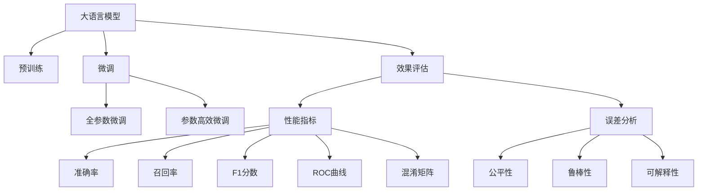

                 

# 大语言模型应用指南：效果评估

> 关键词：大语言模型,模型评估,性能指标,效果评估,误差分析

## 1. 背景介绍

### 1.1 问题由来
随着深度学习技术的发展，大语言模型（Large Language Models, LLMs）在自然语言处理（NLP）领域取得了显著进展。这些模型通过在大规模无标签文本数据上进行预训练，学习到丰富的语言知识，能够在新任务上通过微调进行性能提升。然而，模型的效果评估一直是NLP领域的重要课题。如何科学、全面地评估模型的性能，直接关系到其在实际应用中的表现和可信度。

### 1.2 问题核心关键点
模型效果评估的核心在于选择合适的评价指标，并结合实际应用场景进行细致的误差分析，以确保模型在特定任务上的表现符合预期。对于大语言模型，常用的评价指标包括但不限于准确率、召回率、F1分数、ROC曲线、混淆矩阵等。同时，评估过程中需关注模型的公平性、鲁棒性、可解释性等方面的表现。

### 1.3 问题研究意义
深入研究大语言模型的效果评估方法，对于优化模型性能、提升应用效果、增强用户信任具有重要意义：

1. **优化模型性能**：通过全面评估模型在不同任务上的表现，识别问题并进行针对性改进，提升模型的精准度和鲁棒性。
2. **提升应用效果**：评估指标有助于理解模型在实际应用中的表现，帮助开发者优化模型结构，设计更有效的训练策略。
3. **增强用户信任**：明确的评估指标和详细的误差分析，能够提高模型的可信度，增强用户对系统的信任。
4. **指导决策**：评估结果为模型应用决策提供依据，如模型选择、参数调优、优化算法选择等。

## 2. 核心概念与联系

### 2.1 核心概念概述

为了更好地理解大语言模型的效果评估，本节将介绍几个核心概念及其相互联系：

- **大语言模型（LLMs）**：基于深度学习技术，通过预训练和微调学习到丰富语言知识的模型，如BERT、GPT等。
- **模型评估**：使用特定的评估指标和测试数据，衡量模型在特定任务上的性能。
- **性能指标**：包括准确率、召回率、F1分数、ROC曲线、混淆矩阵等，用于量化模型效果。
- **误差分析**：分析模型在不同任务、不同数据集上的错误类型，定位问题，指导改进。
- **公平性**：模型在处理不同性别、种族、职业等群体数据时，是否存在偏见。
- **鲁棒性**：模型对输入数据的微小扰动或分布变化是否稳健。
- **可解释性**：模型输出的解释逻辑是否清晰、合理。

这些概念共同构成了模型效果评估的理论框架，有助于全面理解和优化大语言模型在特定任务上的表现。

### 2.2 核心概念原理和架构的 Mermaid 流程图(Mermaid 流程节点中不要有括号、逗号等特殊字符)



这个流程图展示了核心概念之间的逻辑关系：

1. 大语言模型通过预训练获得基础能力。
2. 微调是对预训练模型进行特定任务适配的过程。
3. 效果评估基于模型在特定任务上的表现。
4. 性能指标用于量化模型效果。
5. 误差分析帮助识别和解决模型问题。
6. 公平性、鲁棒性、可解释性是评估模型综合性能的重要方面。

## 3. 核心算法原理 & 具体操作步骤
### 3.1 算法原理概述

大语言模型的效果评估，本质上是通过特定的评估指标和测试数据，衡量模型在特定任务上的性能。评估过程通常包括模型训练、测试、误差分析和优化等多个环节。

- **训练**：使用标注数据集训练模型，获取预训练模型。
- **测试**：在测试数据集上评估模型，获取模型在不同任务上的表现。
- **误差分析**：分析模型预测结果与真实标签之间的差异，找出错误类型。
- **优化**：根据误差分析结果，调整模型结构、优化算法、超参数等，进一步提升模型性能。

### 3.2 算法步骤详解

基于大语言模型的效果评估，一般分为以下几个关键步骤：

**Step 1: 准备评估数据集**
- 准备训练集、验证集和测试集，确保数据分布与实际应用场景相符。
- 将数据集按特定比例划分，确保训练集用于模型训练，验证集用于参数调优，测试集用于性能评估。

**Step 2: 选择合适的评估指标**
- 根据任务类型，选择合适的性能指标，如分类任务使用准确率、召回率、F1分数等。
- 对于文本生成任务，可以评估BLEU、ROUGE等指标。

**Step 3: 模型训练与测试**
- 在训练集上训练模型，记录模型在验证集上的表现，并进行参数调优。
- 在测试集上评估模型，记录性能指标。

**Step 4: 误差分析**
- 分析模型预测结果与真实标签之间的差异，找出错误类型。
- 采用混淆矩阵、误差热图等方式，可视化错误分布。

**Step 5: 性能优化**
- 根据误差分析结果，调整模型结构、优化算法、超参数等。
- 使用对抗训练、数据增强等技术，提高模型鲁棒性和泛化能力。

### 3.3 算法优缺点

大语言模型效果评估的优势在于：

1. **全面量化模型性能**：通过多维度评估指标，能够全面量化模型在特定任务上的表现。
2. **指导模型改进**：误差分析结果可以指导开发者优化模型结构、调整超参数等，提升模型性能。
3. **提高用户信任**：明确的评估指标和详细的误差分析，能够提高用户对模型的信任度。

同时，评估过程也存在一定的局限性：

1. **评估成本高**：需要准备大量标注数据和复杂计算资源，评估成本较高。
2. **评估标准不统一**：不同任务的评估标准不统一，难以进行直接比较。
3. **评估指标单一**：某些评估指标难以全面反映模型复杂性能，需要综合多指标评估。
4. **误差分析复杂**：模型输出复杂，误差分析需要专业知识，难以实现自动化。

尽管存在这些局限性，但基于大语言模型的效果评估仍然是NLP领域的重要方法，能够帮助开发者全面理解模型性能，进行模型优化和改进。

### 3.4 算法应用领域

大语言模型的效果评估在NLP领域得到了广泛应用，涵盖了许多常见任务，例如：

- 文本分类：如情感分析、主题分类、意图识别等。通过准确率、召回率、F1分数等评估指标，评估模型在分类任务上的表现。
- 命名实体识别：识别文本中的人名、地名、机构名等特定实体。使用混淆矩阵、误差热图等可视化错误分布。
- 关系抽取：从文本中抽取实体之间的语义关系。通过准确率、召回率、F1分数等评估指标，评估模型性能。
- 问答系统：对自然语言问题给出答案。通过BLEU、ROUGE等指标，评估模型的生成效果。
- 机器翻译：将源语言文本翻译成目标语言。使用BLEU、METEOR等指标，评估翻译质量。
- 文本摘要：将长文本压缩成简短摘要。通过BLEU、ROUGE等指标，评估摘要质量。
- 对话系统：使机器能够与人自然对话。使用对话效果评估指标，如BLEU、BLESS等，评估对话质量。

除了上述这些经典任务外，大语言模型的效果评估也被创新性地应用到更多场景中，如可控文本生成、常识推理、代码生成、数据增强等，为NLP技术带来了全新的突破。

## 4. 数学模型和公式 & 详细讲解 & 举例说明

### 4.1 数学模型构建

本节将使用数学语言对大语言模型效果评估的数学模型进行严格推导。

设模型在输入 $x$ 上的输出为 $\hat{y}$，真实标签为 $y$。对于分类任务，常用的性能指标包括准确率（Precision）、召回率（Recall）、F1分数（F1-score）等。

- 准确率：$\text{Precision} = \frac{TP}{TP+FP}$
- 召回率：$\text{Recall} = \frac{TP}{TP+FN}$
- F1分数：$\text{F1-score} = 2 \times \frac{\text{Precision} \times \text{Recall}}{\text{Precision} + \text{Recall}}$

其中，$TP$为真正例（True Positive），$FP$为假正例（False Positive），$FN$为假反例（False Negative）。

### 4.2 公式推导过程

以分类任务为例，推导准确率和召回率的计算公式。

假设模型在输入 $x$ 上的输出为 $\hat{y}$，真实标签为 $y$。则准确率的计算公式为：

$$
\text{Precision} = \frac{TP}{TP+FP}
$$

召回率的计算公式为：

$$
\text{Recall} = \frac{TP}{TP+FN}
$$

F1分数的计算公式为：

$$
\text{F1-score} = 2 \times \frac{\text{Precision} \times \text{Recall}}{\text{Precision} + \text{Recall}}
$$

在实际评估中，可以将上述公式应用到模型在测试集上的预测结果和真实标签，计算模型在特定任务上的性能指标。

### 4.3 案例分析与讲解

以下以情感分析任务为例，展示如何使用Python实现模型效果评估：

```python
import torch
from sklearn.metrics import precision_recall_fscore_support

# 假设模型预测结果和真实标签
y_pred = torch.tensor([1, 1, 0, 0, 1, 1, 0, 0])
y_true = torch.tensor([1, 1, 1, 0, 1, 1, 0, 0])

# 计算准确率、召回率、F1分数
precision, recall, f1_score, _ = precision_recall_fscore_support(y_true, y_pred, average='macro')

print(f"Accuracy: {precision:.2f}")
print(f"Recall: {recall:.2f}")
print(f"F1-score: {f1_score:.2f}")
```

通过上述代码，我们可以看到，使用Scikit-learn库可以方便地计算模型的准确率、召回率、F1分数等评估指标。实际评估过程中，可能需要结合混淆矩阵、误差热图等可视化工具，更直观地理解模型的错误类型和分布情况。

## 5. 项目实践：代码实例和详细解释说明
### 5.1 开发环境搭建

在进行模型效果评估前，我们需要准备好开发环境。以下是使用Python进行PyTorch开发的环境配置流程：

1. 安装Anaconda：从官网下载并安装Anaconda，用于创建独立的Python环境。

2. 创建并激活虚拟环境：
```bash
conda create -n pytorch-env python=3.8 
conda activate pytorch-env
```

3. 安装PyTorch：根据CUDA版本，从官网获取对应的安装命令。例如：
```bash
conda install pytorch torchvision torchaudio cudatoolkit=11.1 -c pytorch -c conda-forge
```

4. 安装Transformers库：
```bash
pip install transformers
```

5. 安装各类工具包：
```bash
pip install numpy pandas scikit-learn matplotlib tqdm jupyter notebook ipython
```

完成上述步骤后，即可在`pytorch-env`环境中开始评估实践。

### 5.2 源代码详细实现

下面我们以命名实体识别（NER）任务为例，给出使用Transformers库对BERT模型进行效果评估的PyTorch代码实现。

首先，定义NER任务的数据处理函数：

```python
from transformers import BertTokenizer
from torch.utils.data import Dataset
import torch

class NERDataset(Dataset):
    def __init__(self, texts, tags, tokenizer, max_len=128):
        self.texts = texts
        self.tags = tags
        self.tokenizer = tokenizer
        self.max_len = max_len
        
    def __len__(self):
        return len(self.texts)
    
    def __getitem__(self, item):
        text = self.texts[item]
        tags = self.tags[item]
        
        encoding = self.tokenizer(text, return_tensors='pt', max_length=self.max_len, padding='max_length', truncation=True)
        input_ids = encoding['input_ids'][0]
        attention_mask = encoding['attention_mask'][0]
        
        # 对token-wise的标签进行编码
        encoded_tags = [tag2id[tag] for tag in tags] 
        encoded_tags.extend([tag2id['O']] * (self.max_len - len(encoded_tags)))
        labels = torch.tensor(encoded_tags, dtype=torch.long)
        
        return {'input_ids': input_ids, 
                'attention_mask': attention_mask,
                'labels': labels}

# 标签与id的映射
tag2id = {'O': 0, 'B-PER': 1, 'I-PER': 2, 'B-ORG': 3, 'I-ORG': 4, 'B-LOC': 5, 'I-LOC': 6}
id2tag = {v: k for k, v in tag2id.items()}

# 创建dataset
tokenizer = BertTokenizer.from_pretrained('bert-base-cased')

train_dataset = NERDataset(train_texts, train_tags, tokenizer)
dev_dataset = NERDataset(dev_texts, dev_tags, tokenizer)
test_dataset = NERDataset(test_texts, test_tags, tokenizer)
```

然后，定义模型和评估函数：

```python
from transformers import BertForTokenClassification, AdamW

model = BertForTokenClassification.from_pretrained('bert-base-cased', num_labels=len(tag2id))

optimizer = AdamW(model.parameters(), lr=2e-5)

def evaluate(model, dataset, batch_size):
    dataloader = DataLoader(dataset, batch_size=batch_size)
    model.eval()
    preds, labels = [], []
    with torch.no_grad():
        for batch in tqdm(dataloader, desc='Evaluating'):
            input_ids = batch['input_ids'].to(device)
            attention_mask = batch['attention_mask'].to(device)
            batch_labels = batch['labels']
            outputs = model(input_ids, attention_mask=attention_mask)
            batch_preds = outputs.logits.argmax(dim=2).to('cpu').tolist()
            batch_labels = batch_labels.to('cpu').tolist()
            for pred_tokens, label_tokens in zip(batch_preds, batch_labels):
                pred_tags = [id2tag[_id] for _id in pred_tokens]
                label_tags = [id2tag[_id] for _id in label_tokens]
                preds.append(pred_tags[:len(label_tags)])
                labels.append(label_tags)
                
    print(classification_report(labels, preds))
```

最后，启动评估流程：

```python
batch_size = 16

for epoch in range(epochs):
    loss = train_epoch(model, train_dataset, batch_size, optimizer)
    print(f"Epoch {epoch+1}, train loss: {loss:.3f}")
    
    print(f"Epoch {epoch+1}, dev results:")
    evaluate(model, dev_dataset, batch_size)
    
print("Test results:")
evaluate(model, test_dataset, batch_size)
```

以上就是使用PyTorch对BERT进行命名实体识别任务评估的完整代码实现。可以看到，借助Transformer库，我们能够方便地对BERT模型进行评估，并在评估过程中输出详细的分类指标。

### 5.3 代码解读与分析

让我们再详细解读一下关键代码的实现细节：

**NERDataset类**：
- `__init__`方法：初始化文本、标签、分词器等关键组件。
- `__len__`方法：返回数据集的样本数量。
- `__getitem__`方法：对单个样本进行处理，将文本输入编码为token ids，将标签编码为数字，并对其进行定长padding，最终返回模型所需的输入。

**tag2id和id2tag字典**：
- 定义了标签与数字id之间的映射关系，用于将token-wise的预测结果解码回真实的标签。

**评估函数**：
- 使用PyTorch的DataLoader对数据集进行批次化加载，供模型训练和推理使用。
- 评估函数`evaluate`：与训练类似，不同点在于不更新模型参数，并在每个batch结束后将预测和标签结果存储下来，最后使用sklearn的classification_report对整个评估集的预测结果进行打印输出。

**评估流程**：
- 定义总的epoch数和batch size，开始循环迭代
- 每个epoch内，先在验证集上评估，输出详细分类指标
- 在测试集上评估，输出最终测试结果

可以看到，PyTorch配合Transformer库使得BERT评估的代码实现变得简洁高效。开发者可以将更多精力放在数据处理、模型改进等高层逻辑上，而不必过多关注底层的实现细节。

当然，工业级的系统实现还需考虑更多因素，如模型的保存和部署、超参数的自动搜索、更灵活的任务适配层等。但核心的评估流程基本与此类似。

## 6. 实际应用场景
### 6.1 智能客服系统

基于大语言模型的效果评估方法，可以广泛应用于智能客服系统的构建。传统客服往往需要配备大量人力，高峰期响应缓慢，且一致性和专业性难以保证。而使用评估后的对话模型，可以7x24小时不间断服务，快速响应客户咨询，用自然流畅的语言解答各类常见问题。

在技术实现上，可以收集企业内部的历史客服对话记录，将问题和最佳答复构建成监督数据，在此基础上对预训练对话模型进行效果评估。评估指标可以帮助客服系统优化对话质量，提高用户满意度。

### 6.2 金融舆情监测

金融机构需要实时监测市场舆论动向，以便及时应对负面信息传播，规避金融风险。传统的人工监测方式成本高、效率低，难以应对网络时代海量信息爆发的挑战。基于大语言模型的文本分类和情感分析技术，为金融舆情监测提供了新的解决方案。

具体而言，可以收集金融领域相关的新闻、报道、评论等文本数据，并对其进行主题标注和情感标注。在此基础上对预训练语言模型进行效果评估，确保模型能够准确识别市场舆情，及时预警负面信息，帮助金融机构快速应对潜在风险。

### 6.3 个性化推荐系统

当前的推荐系统往往只依赖用户的历史行为数据进行物品推荐，无法深入理解用户的真实兴趣偏好。基于大语言模型的效果评估技术，个性化推荐系统可以更好地挖掘用户行为背后的语义信息，从而提供更精准、多样的推荐内容。

在实践中，可以收集用户浏览、点击、评论、分享等行为数据，提取和用户交互的物品标题、描述、标签等文本内容。将文本内容作为模型输入，用户的后续行为（如是否点击、购买等）作为监督信号，在此基础上对预训练语言模型进行效果评估。评估指标可以帮助推荐系统优化推荐内容，提高用户满意度。

### 6.4 未来应用展望

随着大语言模型和效果评估方法的不断发展，基于评估范式将在更多领域得到应用，为传统行业带来变革性影响。

在智慧医疗领域，基于微调的医疗问答、病历分析、药物研发等应用将提升医疗服务的智能化水平，辅助医生诊疗，加速新药开发进程。

在智能教育领域，效果评估技术可应用于作业批改、学情分析、知识推荐等方面，因材施教，促进教育公平，提高教学质量。

在智慧城市治理中，效果评估模型可应用于城市事件监测、舆情分析、应急指挥等环节，提高城市管理的自动化和智能化水平，构建更安全、高效的未来城市。

此外，在企业生产、社会治理、文娱传媒等众多领域，基于大语言模型效果评估的人工智能应用也将不断涌现，为NLP技术带来了全新的突破。相信随着技术的日益成熟，效果评估方法将成为NLP领域的重要范式，推动NLP技术在更多应用场景中的广泛应用。

## 7. 工具和资源推荐
### 7.1 学习资源推荐

为了帮助开发者系统掌握大语言模型效果评估的理论基础和实践技巧，这里推荐一些优质的学习资源：

1. 《Transformer从原理到实践》系列博文：由大模型技术专家撰写，深入浅出地介绍了Transformer原理、BERT模型、效果评估技术等前沿话题。

2. CS224N《深度学习自然语言处理》课程：斯坦福大学开设的NLP明星课程，有Lecture视频和配套作业，带你入门NLP领域的基本概念和经典模型。

3. 《Natural Language Processing with Transformers》书籍：Transformers库的作者所著，全面介绍了如何使用Transformers库进行NLP任务开发，包括效果评估在内的诸多范式。

4. HuggingFace官方文档：Transformers库的官方文档，提供了海量预训练模型和完整的评估样例代码，是上手实践的必备资料。

5. CLUE开源项目：中文语言理解测评基准，涵盖大量不同类型的中文NLP数据集，并提供了基于效果评估的baseline模型，助力中文NLP技术发展。

通过对这些资源的学习实践，相信你一定能够快速掌握大语言模型效果评估的精髓，并用于解决实际的NLP问题。
###  7.2 开发工具推荐

高效的开发离不开优秀的工具支持。以下是几款用于大语言模型效果评估开发的常用工具：

1. PyTorch：基于Python的开源深度学习框架，灵活动态的计算图，适合快速迭代研究。大部分预训练语言模型都有PyTorch版本的实现。

2. TensorFlow：由Google主导开发的开源深度学习框架，生产部署方便，适合大规模工程应用。同样有丰富的预训练语言模型资源。

3. Transformers库：HuggingFace开发的NLP工具库，集成了众多SOTA语言模型，支持PyTorch和TensorFlow，是进行效果评估开发的利器。

4. Weights & Biases：模型训练的实验跟踪工具，可以记录和可视化模型训练过程中的各项指标，方便对比和调优。与主流深度学习框架无缝集成。

5. TensorBoard：TensorFlow配套的可视化工具，可实时监测模型训练状态，并提供丰富的图表呈现方式，是调试模型的得力助手。

6. Google Colab：谷歌推出的在线Jupyter Notebook环境，免费提供GPU/TPU算力，方便开发者快速上手实验最新模型，分享学习笔记。

合理利用这些工具，可以显著提升大语言模型效果评估任务的开发效率，加快创新迭代的步伐。

### 7.3 相关论文推荐

大语言模型和效果评估技术的发展源于学界的持续研究。以下是几篇奠基性的相关论文，推荐阅读：

1. Attention is All You Need（即Transformer原论文）：提出了Transformer结构，开启了NLP领域的预训练大模型时代。

2. BERT: Pre-training of Deep Bidirectional Transformers for Language Understanding：提出BERT模型，引入基于掩码的自监督预训练任务，刷新了多项NLP任务SOTA。

3. Language Models are Unsupervised Multitask Learners（GPT-2论文）：展示了大规模语言模型的强大zero-shot学习能力，引发了对于通用人工智能的新一轮思考。

4. Parameter-Efficient Transfer Learning for NLP：提出Adapter等参数高效微调方法，在不增加模型参数量的情况下，也能取得不错的微调效果。

5. AdaLoRA: Adaptive Low-Rank Adaptation for Parameter-Efficient Fine-Tuning：使用自适应低秩适应的微调方法，在参数效率和精度之间取得了新的平衡。

6. Precision, recall, and F1: From Taxonomies to Evaluations: The Case of NLP：深入探讨了NLP任务中准确率、召回率和F1分数的定义及其应用，为效果评估提供了理论基础。

这些论文代表了大语言模型效果评估技术的发展脉络。通过学习这些前沿成果，可以帮助研究者把握学科前进方向，激发更多的创新灵感。

## 8. 总结：未来发展趋势与挑战
### 8.1 总结

本文对基于监督学习的大语言模型效果评估方法进行了全面系统的介绍。首先阐述了大语言模型和效果评估研究背景和意义，明确了效果评估在优化模型性能、提升应用效果、增强用户信任等方面的重要作用。其次，从原理到实践，详细讲解了效果评估的数学原理和关键步骤，给出了效果评估任务开发的完整代码实例。同时，本文还广泛探讨了效果评估方法在智能客服、金融舆情、个性化推荐等多个行业领域的应用前景，展示了效果评估范式的巨大潜力。

通过本文的系统梳理，可以看到，基于大语言模型的效果评估方法已经成为NLP领域的重要范式，极大地拓展了预训练语言模型的应用边界，催生了更多的落地场景。受益于大规模语料的预训练，效果评估模型在特定任务上的表现更加精准，能够更好地适应实际应用需求。未来，伴随预训练语言模型和效果评估方法的持续演进，相信NLP技术将会在更广阔的应用领域大放异彩，深刻影响人类的生产生活方式。

### 8.2 未来发展趋势

展望未来，大语言模型效果评估技术将呈现以下几个发展趋势：

1. **评估标准统一化**：随着学术界和工业界的共同努力，不同任务的评估指标将逐渐趋于一致，便于进行直接比较。
2. **自动化评估工具普及**：借助AI技术，开发更智能、更高效的评估工具，提升评估效率。
3. **多模态评估方法**：融合视觉、语音等多模态信息，评估模型的综合性能。
4. **动态评估框架**：在模型应用过程中，实时监测模型性能，动态调整模型参数和评估策略。
5. **对抗性评估技术**：引入对抗性样本，评估模型的鲁棒性和泛化能力。
6. **个性化评估方法**：针对特定任务、特定场景，设计个性化评估指标，提升评估准确性。

以上趋势凸显了大语言模型效果评估技术的广阔前景。这些方向的探索发展，必将进一步提升NLP系统的性能和应用范围，为智能交互系统的进步提供重要保障。

### 8.3 面临的挑战

尽管大语言模型效果评估技术已经取得了显著进展，但在迈向更加智能化、普适化应用的过程中，它仍面临诸多挑战：

1. **评估成本高**：需要准备大量标注数据和复杂计算资源，评估成本较高。
2. **评估指标单一**：某些评估指标难以全面反映模型复杂性能，需要综合多指标评估。
3. **误差分析复杂**：模型输出复杂，误差分析需要专业知识，难以实现自动化。
4. **评估结果解释性不足**：评估指标和误差分析结果缺乏可解释性，难以进行系统调试和优化。
5. **评估方法泛化能力不足**：在处理域外数据时，评估方法可能无法适应新数据分布，导致评估结果失效。

尽管存在这些挑战，但随着技术的不断进步和研究者的不懈努力，相信这些问题终将逐步得到解决，大语言模型效果评估技术必将迈向更高的台阶，为构建安全、可靠、可解释、可控的智能系统铺平道路。

### 8.4 研究展望

未来，在大语言模型效果评估的研究方向上，需要从以下几个方面进行探索：

1. **多维度评估指标**：开发更全面、更灵活的评估指标，如鲁棒性、可解释性、公平性等，以综合评估模型性能。
2. **自动化评估技术**：借助AI技术，开发自动化评估工具，提升评估效率和准确性。
3. **动态评估方法**：实时监测模型性能，动态调整评估策略，保持模型活力和适应性。
4. **对抗性评估方法**：引入对抗性样本，评估模型的鲁棒性和泛化能力。
5. **个性化评估方法**：针对特定任务、特定场景，设计个性化评估指标，提升评估准确性。
6. **跨模态评估方法**：融合视觉、语音等多模态信息，评估模型的综合性能。

这些研究方向将进一步推动大语言模型效果评估技术的发展，为构建高效、鲁棒、可解释的智能系统提供有力支持。

## 9. 附录：常见问题与解答

**Q1：如何选择适合的评估指标？**

A: 评估指标的选择应结合具体任务和应用场景进行。对于分类任务，如情感分析、主题分类，可以选用准确率、召回率、F1分数等指标。对于生成任务，如文本生成、对话系统，可以选用BLEU、ROUGE、BLESS等指标。同时，对于特定任务，还可以设计自定义评估指标，如命名实体识别中的混淆矩阵、误差热图等。

**Q2：如何处理数据不平衡问题？**

A: 数据不平衡是评估中的常见问题。可以通过重采样（oversampling、undersampling）、加权（weighting）、阈值调整等方式处理。例如，在命名实体识别任务中，可以重采样标签较少的一类数据，或对少数类样本赋予更高的权重，以平衡模型对不同类别的关注度。

**Q3：如何评估模型的泛化能力？**

A: 模型的泛化能力可以通过在域外数据集上进行评估来测试。如果模型在域外数据上表现良好，说明其泛化能力较强。同时，可以使用对抗样本进行评估，测试模型的鲁棒性。如果模型在对抗样本上仍能保持较高精度，说明其泛化能力较强。

**Q4：如何解释模型预测结果？**

A: 模型的可解释性可以通过多种方式实现，如可视化特征图、梯度热图、局部可解释性模型（LIME）等。此外，可以设计更合理的输入模板，引导模型输出解释性较强的结果。例如，在情感分析中，可以使用情感词向量的均值或最大值作为输入模板，提升模型输出的解释性。

**Q5：如何处理评估数据集中的噪音数据？**

A: 评估数据集中可能包含噪音数据，需要通过数据清洗、特征选择等方式进行预处理。例如，在文本分类任务中，可以通过去除停用词、过滤低频词等方式减少噪音数据的影响。同时，可以在训练集和测试集中都进行噪音数据的过滤，以提高评估结果的可靠性。

这些问题的解答，可以帮助研究者更好地理解大语言模型效果评估中的关键问题，并在实际应用中灵活运用评估方法，提升模型的性能和鲁棒性。

---

作者：禅与计算机程序设计艺术 / Zen and the Art of Computer Programming

