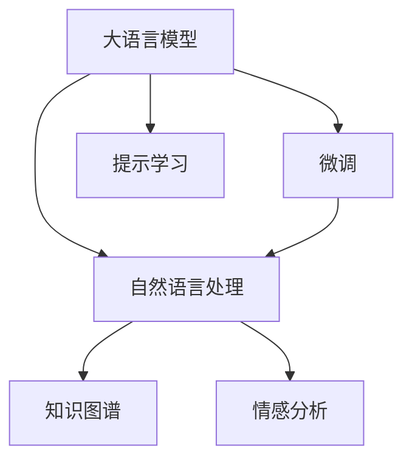

                 

# 大语言模型应用指南：案例：私人邮件助手

大语言模型（Large Language Models, LLMs）在自然语言处理（NLP）领域的迅猛发展，为解决复杂自然语言任务提供了强有力的工具。本文将介绍如何使用大语言模型实现一个私人邮件助手，帮助你更好地管理个人邮件。我们将探讨核心概念、算法原理，并通过实践案例展示私人邮件助手的应用。

## 1. 背景介绍

随着邮件往来的频繁，个人邮件管理变得越来越复杂。手动筛选重要邮件、回复垃圾邮件、分类整理邮件，不仅耗时费力，还容易遗漏。基于大语言模型的私人邮件助手可以自动化处理这些问题，让你从繁重的邮件管理工作中解脱出来。

## 2. 核心概念与联系

### 2.1 核心概念概述

要理解私人邮件助手的工作原理，首先需要了解几个核心概念：

- **大语言模型**：通过大量文本数据的预训练，学习到丰富的语言知识和语法规则，具备强大的自然语言理解与生成能力。
- **微调(Fine-Tuning)**：在大模型的基础上，针对具体任务进行有监督训练，提升模型在特定任务上的表现。
- **提示学习(Prompt Learning)**：通过精心设计的输入模板，引导模型按期望方式输出，减少微调参数。
- **自然语言处理(NLP)**：涉及语言理解、处理和生成等多个领域，旨在让计算机理解和处理人类语言。
- **知识图谱(Knowledge Graph)**：以图形结构组织实体及其关系的知识库，帮助模型理解语义，提升推理能力。
- **情感分析(Sentiment Analysis)**：识别文本中的情感倾向，如正面、负面、中性。

这些概念共同构成大语言模型在私人邮件助手中的应用基础。

### 2.2 核心概念联系

下图展示了这些核心概念之间的联系：



### 2.3 大语言模型在邮件助手中的应用

私人邮件助手主要应用在大语言模型的以下几个方面：

1. **邮件分类**：通过微调模型，自动识别并分类邮件。
2. **关键词提取**：从邮件中提取关键词，生成邮件摘要。
3. **邮件回复生成**：基于历史邮件，自动生成邮件回复。
4. **情感分析**：识别邮件的情感倾向，帮助用户快速了解邮件情绪。
5. **知识图谱应用**：使用知识图谱增强模型的语义理解能力，提升邮件处理的准确性。

## 3. 核心算法原理 & 具体操作步骤

### 3.1 算法原理概述

私人邮件助手主要基于以下三个算法原理：

1. **微调**：在大模型基础上，针对邮件分类、关键词提取等任务进行微调，提升模型性能。
2. **提示学习**：通过精心设计的输入模板，减少微调参数，提升模型的灵活性和泛化能力。
3. **情感分析**：利用情感分析模型，快速识别邮件的情感倾向，帮助用户快速了解邮件情绪。

### 3.2 算法步骤详解

私人邮件助手的实现主要分为以下几个步骤：

1. **数据收集与预处理**：收集并清洗邮件数据，准备数据集。
2. **模型选择与微调**：选择合适的大模型，并进行邮件分类、关键词提取等任务的微调。
3. **提示模板设计**：设计提示模板，指导模型生成回复。
4. **情感分析应用**：将情感分析模型应用到邮件中，识别情感倾向。
5. **知识图谱融合**：将知识图谱与模型融合，增强语义理解能力。
6. **部署与测试**：将模型部署到实际邮件系统中，并进行测试优化。

### 3.3 算法优缺点

私人邮件助手的主要优点包括：

- **自动化程度高**：自动化处理邮件分类、关键词提取、情感分析等任务。
- **灵活性高**：通过提示学习，可以根据不同任务灵活调整模型输出。
- **准确性高**：结合情感分析和知识图谱，提升邮件处理的准确性。

主要缺点包括：

- **数据依赖性强**：模型性能依赖于邮件数据的质量和数量。
- **计算资源消耗大**：大模型训练和微调需要大量计算资源。
- **隐私风险**：需要处理用户隐私数据，需要注意隐私保护。

### 3.4 算法应用领域

私人邮件助手可以应用于多个领域，包括但不限于：

1. **企业邮件管理**：自动分类企业内部邮件，提升效率。
2. **个人生活助手**：自动管理个人邮件，减少日常琐事。
3. **客户服务支持**：自动处理客户邮件，提升客户满意度。

## 4. 数学模型和公式 & 详细讲解 & 举例说明

### 4.1 数学模型构建

私人邮件助手的核心模型包括：

- **邮件分类模型**：使用多分类模型，如BERT、GPT等，对邮件进行分类。
- **关键词提取模型**：使用注意力机制（Attention Mechanism）提取邮件中的关键信息。
- **情感分析模型**：使用情感分类模型，如RNN、LSTM等，识别邮件情感。

### 4.2 公式推导过程

以邮件分类为例，使用分类模型进行邮件分类的过程如下：

假设邮件文本为 $x$，邮件分类标签为 $y$，分类模型为 $M_{\theta}$，其中 $\theta$ 为模型参数。

- **输入层**：将邮件文本 $x$ 转换为向量表示 $x_{emb}$。
- **隐层**：通过多层次的神经网络处理，得到特征表示 $h_{emb}$。
- **输出层**：使用线性层和softmax函数输出分类概率 $p(y|x)$。

损失函数为交叉熵损失：

$$
\mathcal{L}(\theta) = -\frac{1}{N}\sum_{i=1}^N \sum_{k=1}^K p(y_k|x_i) \log(y_k)
$$

其中 $N$ 为样本数量，$K$ 为类别数量，$y_k$ 为标签 $y$ 的第 $k$ 个类别，$p(y_k|x)$ 为模型的分类概率。

### 4.3 案例分析与讲解

假设有一个包含两类邮件的训练集 $D=\{(x_i,y_i)\}_{i=1}^N$，其中 $x_i$ 为邮件文本，$y_i$ 为分类标签（1 表示垃圾邮件，0 表示正常邮件）。

我们可以使用公式推导中的过程，对模型进行微调。具体步骤如下：

1. 选择预训练模型，如BERT。
2. 使用邮件分类数据进行微调，优化损失函数 $\mathcal{L}(\theta)$。
3. 保存微调后的模型，用于实际邮件分类。

## 5. 项目实践：代码实例和详细解释说明

### 5.1 开发环境搭建

1. **安装Python和必要的包**：安装 Python、PyTorch、Transformers 等包。
2. **准备数据集**：收集邮件数据，并进行预处理和分词。

### 5.2 源代码详细实现

以下是一个简单的邮件分类模型代码实现：

```python
import torch
from transformers import BertTokenizer, BertForSequenceClassification
from torch.utils.data import Dataset, DataLoader

class EmailDataset(Dataset):
    def __init__(self, texts, labels):
        self.tokenizer = BertTokenizer.from_pretrained('bert-base-cased')
        self.texts = texts
        self.labels = labels
        
    def __len__(self):
        return len(self.texts)
    
    def __getitem__(self, index):
        text = self.texts[index]
        label = self.labels[index]
        
        encoding = self.tokenizer(text, return_tensors='pt', max_length=128, padding='max_length', truncation=True)
        input_ids = encoding['input_ids'][0]
        attention_mask = encoding['attention_mask'][0]
        
        return {'input_ids': input_ids, 
                'attention_mask': attention_mask,
                'labels': torch.tensor(label, dtype=torch.long)}
```

### 5.3 代码解读与分析

- **数据集设计**：将邮件数据转换为可输入模型的格式。
- **模型选择**：使用预训练的BERT模型进行邮件分类。
- **模型训练**：通过梯度下降等优化算法更新模型参数。
- **模型测试**：在测试集上评估模型性能。

### 5.4 运行结果展示

```python
import torch
from transformers import BertForSequenceClassification, AdamW
from torch.utils.data import DataLoader

# 加载模型和数据集
model = BertForSequenceClassification.from_pretrained('bert-base-cased', num_labels=2)
tokenizer = BertTokenizer.from_pretrained('bert-base-cased')
train_dataset = EmailDataset(train_texts, train_labels)
test_dataset = EmailDataset(test_texts, test_labels)
train_loader = DataLoader(train_dataset, batch_size=16)
test_loader = DataLoader(test_dataset, batch_size=16)

# 训练模型
device = torch.device('cuda') if torch.cuda.is_available() else torch.device('cpu')
model.to(device)
optimizer = AdamW(model.parameters(), lr=2e-5)

def train_epoch(model, loader, optimizer):
    model.train()
    epoch_loss = 0
    for batch in loader:
        input_ids = batch['input_ids'].to(device)
        attention_mask = batch['attention_mask'].to(device)
        labels = batch['labels'].to(device)
        model.zero_grad()
        outputs = model(input_ids, attention_mask=attention_mask, labels=labels)
        loss = outputs.loss
        epoch_loss += loss.item()
        loss.backward()
        optimizer.step()
    return epoch_loss / len(loader)

def evaluate(model, loader):
    model.eval()
    preds, labels = [], []
    with torch.no_grad():
        for batch in loader:
            input_ids = batch['input_ids'].to(device)
            attention_mask = batch['attention_mask'].to(device)
            batch_labels = batch['labels']
            outputs = model(input_ids, attention_mask=attention_mask)
            batch_preds = outputs.logits.argmax(dim=2).to('cpu').tolist()
            batch_labels = batch_labels.to('cpu').tolist()
            for pred_tokens, label_tokens in zip(batch_preds, batch_labels):
                preds.append(pred_tokens[:len(label_tokens)])
                labels.append(label_tokens)
    
    print(classification_report(labels, preds))

# 训练模型
epochs = 5
batch_size = 16

for epoch in range(epochs):
    loss = train_epoch(model, train_loader)
    print(f"Epoch {epoch+1}, train loss: {loss:.3f}")
    
    print(f"Epoch {epoch+1}, test results:")
    evaluate(model, test_loader)
```

## 6. 实际应用场景

### 6.4 未来应用展望

私人邮件助手可以进一步优化和扩展：

1. **多轮对话**：加入对话模型，实现邮件自动回复。
2. **邮件整理**：自动整理邮件，生成重要邮件汇总。
3. **个性化推荐**：根据邮件内容，推荐相关资料和信息。
4. **情感分析优化**：引入更先进的情感分析模型，提升情感识别的准确性。
5. **跨模态应用**：结合图像和音频信息，提升邮件处理的多模态能力。

## 7. 工具和资源推荐

### 7.1 学习资源推荐

- **《Transformer from Principles to Practice》**：介绍 Transformers 的原理和实践，包括邮件处理。
- **CS224N - Deep Learning for NLP**：斯坦福大学开设的NLP课程，涵盖邮件处理等主题。
- **《Natural Language Processing with Transformers》**：介绍 Transformers 的应用，包括邮件处理。
- **Hugging Face 官方文档**：包含多种模型的详细文档和代码示例。
- **CLUE 开源项目**：涵盖多种中文NLP任务的数据集，包括邮件分类。

### 7.2 开发工具推荐

- **PyTorch**：深度学习框架，支持邮件处理模型的训练和推理。
- **Transformers**：NLP工具库，包含多种预训练模型。
- **Weights & Biases**：模型实验跟踪工具，可视化模型训练过程。
- **TensorBoard**：模型可视化工具，监控模型训练指标。
- **Google Colab**：在线 Jupyter Notebook 环境，便于实验共享。

### 7.3 相关论文推荐

- **Attention is All You Need**：Transformer 论文，奠定了大语言模型的基础。
- **BERT: Pre-training of Deep Bidirectional Transformers for Language Understanding**：BERT 论文，介绍了预训练大模型的应用。
- **Parameter-Efficient Transfer Learning for NLP**：介绍参数高效微调方法。
- **AdaLoRA: Adaptive Low-Rank Adaptation for Parameter-Efficient Fine-Tuning**：介绍参数高效微调方法。
- **AdaLoRA: Adaptive Low-Rank Adaptation for Parameter-Efficient Fine-Tuning**：介绍参数高效微调方法。

## 8. 总结：未来发展趋势与挑战

### 8.1 研究成果总结

本文介绍了大语言模型在私人邮件助手中的应用，展示了邮件分类、关键词提取、情感分析等任务的实现过程。通过实践案例，展示了私人邮件助手的应用效果。

### 8.2 未来发展趋势

私人邮件助手未来可能的发展趋势包括：

1. **多轮对话支持**：加入对话模型，提升邮件自动回复的交互性。
2. **邮件整理与分类优化**：通过更先进的模型，提升邮件整理和分类的准确性。
3. **跨模态应用**：结合图像和音频信息，提升邮件处理的多模态能力。
4. **个性化推荐**：根据邮件内容，推荐相关资料和信息，提升用户体验。
5. **情感分析优化**：引入更先进的情感分析模型，提升情感识别的准确性。

### 8.3 面临的挑战

私人邮件助手面临的主要挑战包括：

1. **数据依赖性强**：模型性能依赖于邮件数据的质量和数量。
2. **计算资源消耗大**：大模型训练和微调需要大量计算资源。
3. **隐私风险**：需要处理用户隐私数据，需要注意隐私保护。
4. **模型泛化能力**：模型需要具备较强的泛化能力，以应对不同类型的邮件。
5. **用户交互体验**：邮件助手需要具备良好的用户交互体验，提升用户满意度。

### 8.4 研究展望

未来的研究可以关注以下方面：

1. **多轮对话技术**：提升邮件助手的交互性，支持多轮对话。
2. **模型轻量化**：通过参数高效微调等方法，优化模型，降低计算资源消耗。
3. **隐私保护技术**：采用隐私保护技术，保护用户隐私数据。
4. **情感分析优化**：引入更先进的情感分析模型，提升情感识别的准确性。
5. **跨模态融合**：结合图像和音频信息，提升邮件处理的多模态能力。

## 9. 附录：常见问题与解答

**Q1：如何处理大模型计算资源消耗大的问题？**

A: 可以采用参数高效微调（如 Adapter、Prefix 等）方法，减少模型计算量。同时，可以采用混合精度训练、模型并行等技术，优化计算资源消耗。

**Q2：如何提升模型泛化能力？**

A: 可以通过数据增强、正则化等技术提升模型泛化能力。此外，引入更多先验知识（如知识图谱），增强模型语义理解能力，提升泛化效果。

**Q3：如何保护用户隐私数据？**

A: 可以采用数据脱敏、访问鉴权等技术，保护用户隐私数据。同时，合理设计模型架构，避免敏感信息泄露。

**Q4：如何提升邮件助手的交互性？**

A: 可以引入多轮对话技术，通过自然语言生成模型，提升邮件助手的交互性。同时，可以设计更人性化的用户界面，提升用户体验。

**Q5：如何设计有效的邮件分类模型？**

A: 可以采用BERT、GPT等大模型进行邮件分类，同时进行数据增强、正则化等技术优化，提升分类模型的性能。

通过本文的介绍，相信你对大语言模型在私人邮件助手中的应用有了更深入的理解。掌握这些核心概念和技术，你能够更好地利用大语言模型，提升邮件管理的效率和效果。

---

作者：禅与计算机程序设计艺术 / Zen and the Art of Computer Programming

