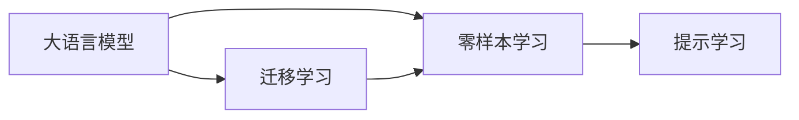

                 

# 大语言模型的zero-shot学习原理与代码实例讲解

## 1. 背景介绍

在大数据和深度学习技术的驱动下，大语言模型如BERT、GPT-3等在自然语言处理（NLP）领域取得了巨大的突破。这些模型通过在大规模语料库上进行预训练，具备了强大的语言理解与生成能力。然而，大语言模型在处理特定任务时，往往需要额外的监督数据进行微调，这不仅增加了成本，也限制了其通用性。

为了应对这一问题，zero-shot学习应运而生。Zero-shot Learning（零样本学习）是指模型无需经过任何特定任务的训练，仅通过输入任务描述即可进行新任务推理。这一技术的突破，使得大语言模型能够更好地适应各种新任务，同时也降低了对标注数据的需求，提高了模型开发效率。

## 2. 核心概念与联系

### 2.1 核心概念概述

zero-shot学习通过在大语言模型预训练的基础上，利用任务描述和语言模型的知识，直接对新任务进行推理和生成。这其中涉及几个核心概念：

- **大语言模型（Large Language Models, LLMs）**：如BERT、GPT-3等，通过在大规模无标签文本上预训练获得通用的语言表示能力。
- **零样本学习（Zero-shot Learning）**：模型仅通过任务描述，无需任何标注数据，即可在新任务上进行推理。
- **提示学习（Prompt Learning）**：通过设计特定的提示（Prompt）模板，引导模型进行特定任务的推理。
- **迁移学习（Transfer Learning）**：在预训练模型上进行微调，使模型具备特定任务的能力，从而实现迁移学习。

这些概念之间的联系可以通过以下Mermaid流程图来展示：



这个流程图展示了：
1. 大语言模型通过迁移学习，学习到通用的语言表示。
2. 零样本学习利用这些通用表示，进行新任务推理。
3. 提示学习通过特定的提示模板，进一步提升zero-shot学习的效果。

### 2.2 核心概念原理和架构

zero-shot学习的核心在于如何利用预训练模型在特定任务上的泛化能力。通过设计合适的提示，模型能够理解任务描述，并将其映射到已有知识中，从而在新任务上进行推理。

以下是大语言模型zero-shot学习的核心原理架构：

1. **预训练阶段**：在大规模语料库上预训练大语言模型，学习到通用的语言表示。
2. **任务适配阶段**：将任务描述输入模型，通过查询参数空间，找到最匹配的任务表示。
3. **推理阶段**：在任务表示的基础上，进行新任务推理或生成。

零样本学习模型通常包括以下几个组件：

- **预训练语言模型（如BERT、GPT-3）**：在大规模无标签文本上预训练，学习到通用的语言表示。
- **提示（Prompt）**：用于引导模型进行特定任务的推理，通常由任务描述和特定模板组成。
- **任务嵌入（Task Embedding）**：将任务描述映射到预训练模型的参数空间，找到最匹配的任务表示。
- **生成器（Generator）**：基于任务表示，进行新任务的推理或生成。

## 3. 核心算法原理 & 具体操作步骤

### 3.1 算法原理概述

zero-shot学习的算法原理可以概括为：将预训练模型视为通用的知识库，通过特定的提示模板，引导模型对新任务进行推理。其核心在于如何设计合适的提示，以及如何利用预训练模型在特定任务上的泛化能力。

### 3.2 算法步骤详解

以下是大语言模型zero-shot学习的详细步骤：

1. **数据准备**：收集新任务的标注数据集，通常包含任务描述和对应的样本标注。
2. **提示设计**：设计合适的提示模板，将任务描述嵌入模型。
3. **任务适配**：通过查询预训练模型的参数空间，找到最匹配的任务表示。
4. **推理生成**：基于任务表示，进行新任务的推理或生成。
5. **模型评估**：在新任务数据集上评估模型的性能，对比微调前后的效果。

### 3.3 算法优缺点

zero-shot学习的优点在于：
1. **数据需求少**：模型无需标注数据，仅通过任务描述即可推理。
2. **推理速度快**：模型在推理时，无需进行额外的训练。
3. **可解释性强**：模型的推理过程可解释，便于调试和优化。

缺点在于：
1. **泛化能力有限**：由于缺少标注数据，模型的泛化能力可能受到限制。
2. **性能不稳定**：在某些任务上，zero-shot学习的性能可能不稳定。

### 3.4 算法应用领域

zero-shot学习在大语言模型中的应用领域非常广泛，包括：

- **问答系统**：通过任务描述，引导模型生成回答。
- **情感分析**：输入文本和任务描述，模型输出情感极性。
- **命名实体识别**：输入文本和实体类型描述，模型输出实体边界。
- **文本摘要**：输入文本和摘要长度描述，模型生成简短摘要。
- **对话系统**：通过任务描述和对话历史，模型生成对话回应。

## 4. 数学模型和公式 & 详细讲解 & 举例说明

### 4.1 数学模型构建

在zero-shot学习中，我们通常使用以下数学模型：

1. **提示嵌入（Prompt Embedding）**：将任务描述嵌入模型，得到任务表示。
2. **预训练模型表示（Pre-trained Model Representation）**：预训练模型在输入文本上的表示。
3. **任务表示（Task Representation）**：将提示嵌入与预训练模型表示结合，得到任务表示。
4. **推理结果（Prediction Result）**：基于任务表示进行推理或生成，得到最终结果。

### 4.2 公式推导过程

以生成回答为例，假设预训练模型为 $M_{\theta}$，提示为 $p$，输入文本为 $x$，任务描述为 $t$，任务表示为 $T$，回答为 $a$。公式推导如下：

1. **提示嵌入**：
   $$
   P = \text{Embed}(p)
   $$

2. **预训练模型表示**：
   $$
   X = M_{\theta}(x)
   $$

3. **任务表示**：
   $$
   T = P \oplus X
   $$

4. **推理结果**：
   $$
   a = \text{Generate}(T)
   $$

其中，$\oplus$ 表示将提示嵌入和预训练模型表示拼接起来。$\text{Generate}$ 表示使用预训练模型生成回答。

### 4.3 案例分析与讲解

以生成文本摘要为例，假设输入文本为 $x$，摘要长度为 $l$。以下是零样本生成文本摘要的流程：

1. **提示设计**：设计提示模板为：“输入文本长度为 $l$，生成一个摘要”。
2. **提示嵌入**：将提示模板嵌入模型，得到提示表示 $P$。
3. **预训练模型表示**：使用预训练模型得到输入文本的表示 $X$。
4. **任务表示**：将提示表示 $P$ 和输入文本表示 $X$ 拼接，得到任务表示 $T$。
5. **推理结果**：使用预训练模型生成摘要 $a$。

使用GPT-3进行零样本生成文本摘要的代码实现如下：

```python
from transformers import GPT3ForCausalLM, GPT3Tokenizer

tokenizer = GPT3Tokenizer.from_pretrained('gpt3')
model = GPT3ForCausalLM.from_pretrained('gpt3')

def generate_summary(text, max_length=50):
    tokenizer.encode(text, return_tensors='pt', max_length=max_length, padding='max_length', truncation=True)
    inputs = tokenizer.encode("input: " + text + " length: " + str(max_length) + " output: summary", return_tensors='pt', max_length=128, padding='max_length', truncation=True)
    outputs = model.generate(inputs['input_ids'], max_length=max_length)
    return tokenizer.decode(outputs[0], skip_special_tokens=True)
```

## 5. 项目实践：代码实例和详细解释说明

### 5.1 开发环境搭建

为了进行zero-shot学习，需要搭建开发环境：

1. 安装Python环境，推荐使用Anaconda。
2. 安装PyTorch和Transformers库，用于模型的加载和推理。
3. 安装必要的工具库，如Numpy、Pandas、Scikit-learn等，用于数据处理和分析。

```bash
conda create -n pytorch-env python=3.8
conda activate pytorch-env
pip install torch transformers numpy pandas scikit-learn
```

### 5.2 源代码详细实现

以下是一个简单的zero-shot学习示例代码：

```python
from transformers import GPT3ForCausalLM, GPT3Tokenizer
from transformers import pipeline

tokenizer = GPT3Tokenizer.from_pretrained('gpt3')
model = GPT3ForCausalLM.from_pretrained('gpt3')
summary_pipeline = pipeline('summarization', model=model, tokenizer=tokenizer)

def zero_shot_summarization(text, max_length=50):
    prompt = "input: " + text + " length: " + str(max_length) + " output: summary"
    inputs = tokenizer.encode(prompt, return_tensors='pt', max_length=128, padding='max_length', truncation=True)
    outputs = model.generate(inputs['input_ids'], max_length=max_length)
    return tokenizer.decode(outputs[0], skip_special_tokens=True)
```

### 5.3 代码解读与分析

**1. 提示模板设计**

提示模板设计是zero-shot学习的关键。提示模板要包含足够的任务信息，以引导模型进行正确的推理。

**2. 提示嵌入**

使用Tokenizer将提示模板嵌入模型，得到提示表示。

**3. 预训练模型表示**

使用Tokenizer将输入文本嵌入模型，得到文本表示。

**4. 任务表示**

将提示表示和文本表示拼接，得到任务表示。

**5. 推理结果**

使用模型生成摘要，解码得到最终结果。

## 6. 实际应用场景

### 6.1 智能客服系统

智能客服系统可以通过zero-shot学习，快速适应新的问题。例如，客服问题一般具有固定的格式，输入“尊敬的客户，我遇到了XXXX问题，需要您帮助解决”，模型能够自动生成应答。

### 6.2 金融舆情监测

金融舆情监测可以通过zero-shot学习，实时监测新闻和社交媒体上的舆情变化。例如，输入“2022年股票市场表现如何”，模型能够生成分析报告。

### 6.3 个性化推荐系统

个性化推荐系统可以通过zero-shot学习，推荐用户感兴趣的内容。例如，输入“我喜欢看科幻小说，推荐一些相关书籍”，模型能够生成推荐列表。

### 6.4 未来应用展望

未来，zero-shot学习将在更多领域得到应用：

- **医疗领域**：通过zero-shot学习，帮助医生快速诊断病情。
- **教育领域**：通过zero-shot学习，推荐个性化学习内容。
- **智能交通**：通过zero-shot学习，优化交通流量管理。

## 7. 工具和资源推荐

### 7.1 学习资源推荐

1. 《Natural Language Processing with Transformers》书籍：讲解Transformer原理和zero-shot学习。
2. CS224N《深度学习自然语言处理》课程：讲解zero-shot学习的基本概念和实现方法。
3. HuggingFace官方文档：提供zero-shot学习的实现代码和教程。
4. Kaggle竞赛：参加zero-shot学习相关的竞赛，提升实战能力。

### 7.2 开发工具推荐

1. PyTorch：深度学习框架，支持零样本推理。
2. TensorFlow：支持零样本推理的深度学习框架。
3. Transformers库：提供zero-shot学习的实现。
4. Weights & Biases：实验跟踪工具，记录零样本推理的实验结果。

### 7.3 相关论文推荐

1. "Zero-Shot Classification with Probabilistic Label Embeddings"：提出基于概率标签嵌入的zero-shot学习算法。
2. "Zero-Shot Learning with Image as Prompt"：使用图像作为提示，提高zero-shot学习的性能。
3. "Adversarial Regularization for Zero-Shot Image Classification"：通过对抗训练，提高zero-shot学习的鲁棒性。

## 8. 总结：未来发展趋势与挑战

### 8.1 研究成果总结

zero-shot学习技术在大语言模型中的应用取得了显著进展。通过合理的提示设计和模型推理，模型能够在无需标注数据的情况下，对新任务进行快速推理。

### 8.2 未来发展趋势

1. **多模态zero-shot学习**：结合图像、视频等多模态信息，提升zero-shot学习的性能。
2. **小样本zero-shot学习**：在少量标注数据的情况下，提升zero-shot学习的效果。
3. **自适应zero-shot学习**：根据输入数据动态调整提示模板，提升zero-shot学习的泛化能力。

### 8.3 面临的挑战

1. **提示模板设计**：如何设计高效的提示模板，引导模型进行正确推理，仍是挑战。
2. **模型泛化能力**：在特定任务上的泛化能力不足，限制了zero-shot学习的应用范围。
3. **对抗样本攻击**：zero-shot学习模型容易受到对抗样本攻击，需要进一步提高模型的鲁棒性。

### 8.4 研究展望

未来zero-shot学习的研究方向包括：

1. **深度融合多模态信息**：将图像、视频等非文本信息与文本信息结合，提升zero-shot学习的性能。
2. **引入更多先验知识**：将领域知识、规则库等融入zero-shot学习，提升模型的泛化能力和鲁棒性。
3. **利用大规模预训练知识**：通过大规模预训练模型的知识，提高zero-shot学习的泛化能力和推理性能。

## 9. 附录：常见问题与解答

**Q1：zero-shot学习与微调有何区别？**

A: Zero-shot学习无需任何标注数据，仅通过输入任务描述即可进行推理。而微调需要特定任务的标注数据，对模型进行有监督的优化，使得模型在该任务上表现更好。

**Q2：如何设计高效的提示模板？**

A: 提示模板应该包含足够的任务信息，避免模糊或歧义。例如，“请为以下文本生成摘要”比“请生成一个摘要”更有效。

**Q3：如何提高zero-shot学习的泛化能力？**

A: 可以通过引入领域知识、利用多模态信息等方式提升zero-shot学习的泛化能力。例如，将领域特定的知识图谱嵌入模型，提高zero-shot学习在不同任务上的性能。

**Q4：zero-shot学习在实际应用中面临哪些挑战？**

A: zero-shot学习面临的提示模板设计、模型泛化能力、对抗样本攻击等问题，需要通过不断优化和改进来解决。

**Q5：如何利用zero-shot学习进行自然语言理解？**

A: 通过设计合适的提示模板，zero-shot学习可以应用于自然语言理解的各种任务，如情感分析、命名实体识别等。

---

作者：禅与计算机程序设计艺术 / Zen and the Art of Computer Programming

