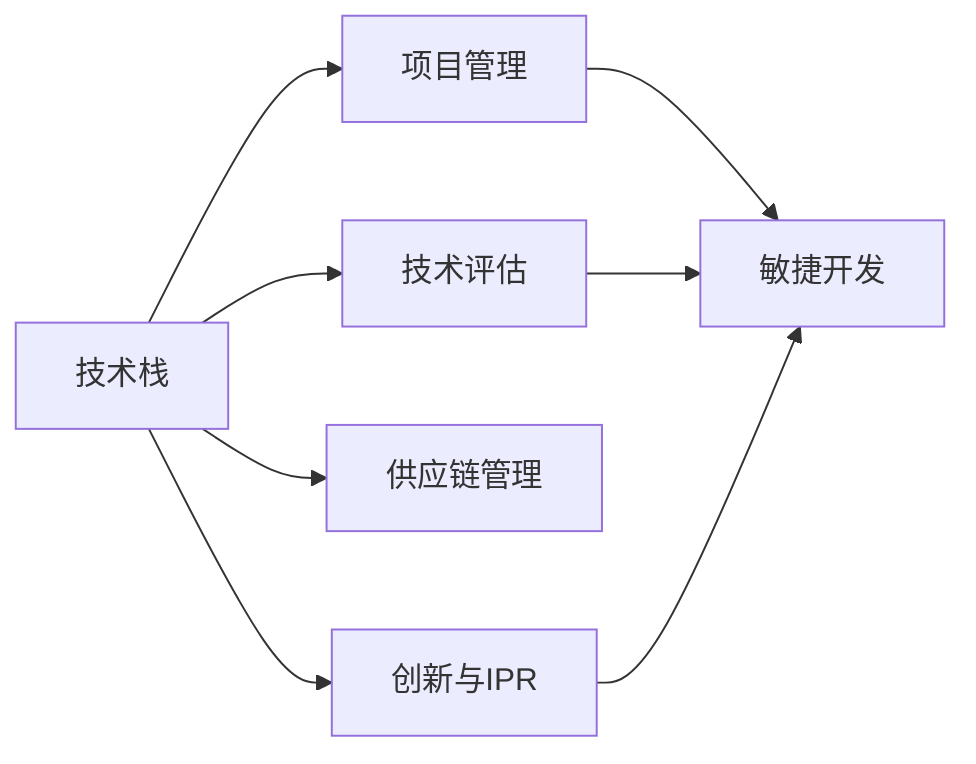

                 

# 太空技术管理：开拓商业航天新领域

## 1. 背景介绍

随着太空探索技术的发展，商业航天的门槛不断降低，太空探索不再只是政府和科研机构的专利。商业航天的兴起，不仅催生了巨大的市场需求，也引发了对太空技术管理新的需求。太空技术管理的目标是确保商业航天的技术创新和商业价值的最大化。

当前，商业航天领域竞争激烈，如何高效管理技术资源、整合各方力量、快速推出可靠的产品和项目，成为商业航天企业面临的重大挑战。本文将详细介绍太空技术管理的核心概念、关键步骤、技术手段和未来趋势，为商业航天企业提供有益的参考。

## 2. 核心概念与联系

### 2.1 核心概念概述

在太空技术管理中，涉及到的核心概念包括以下几个：

- **技术栈(Technology Stack)**：太空技术包含多个子技术栈，包括发射技术、推进技术、导航控制、结构材料、通信和数据处理等。每个子技术栈由多种技术组成，如图像处理、卫星通信、载具设计等。

- **技术评估与评估方法**：通过一系列指标和方法，如R&D投资回报率、技术成熟度、技术风险评估等，来对技术栈中的各个技术进行评估，以判断其可行性和投入价值。

- **项目管理(PM)与敏捷开发(Agile)**：项目管理是确保项目按时、按预算、按需求完成的重要手段。敏捷开发则是一种迭代、灵活的项目管理方法，强调对变化环境的快速响应和团队协作。

- **供应链管理**：商业航天项目中的技术往往需要多方协作，包括政府机构、高校、私营企业等。供应链管理旨在协调各方资源，确保技术和物料的及时交付和供应。

- **创新与知识产权(IPR)**：在商业航天项目中，技术创新是核心驱动力。知识产权管理则包括专利申请、侵权监测、技术保护等，确保企业的技术创新成果得到合法保护。

以上概念之间的联系可以用以下Mermaid流程图来展示：



## 3. 核心算法原理 & 具体操作步骤

### 3.1 算法原理概述

太空技术管理的目标是综合利用各类技术资源，通过科学的项目管理和技术评估，高效推进技术创新，实现商业价值最大化。其中，关键的技术手段包括项目管理、技术评估和供应链管理。

在项目管理中，使用敏捷开发方法，如Scrum和Kanban，以迭代和灵活的方式推进项目，最大化响应市场和技术变化。技术评估则通过多种量化指标和定性评估方法，对技术栈中的技术进行筛选和排序，优先投资最有潜力的技术。供应链管理则涉及跨组织协作，确保技术和物料的及时交付，提升项目效率和成功率。

### 3.2 算法步骤详解

**步骤一：技术评估与选择**

1. **建立评估指标体系**：根据项目需求和商业目标，建立评估指标体系，涵盖技术成熟度、投资回报率、技术风险、市场需求等。
2. **收集技术数据**：从已有的文献、专利、产品开发记录中收集相关数据。
3. **评估与选择**：使用多标准决策分析(MCDA)、层次分析法(AHP)、模糊综合评估等方法对技术进行评估和选择。

**步骤二：项目管理与敏捷开发**

1. **项目规划**：根据技术评估结果，制定项目计划，明确技术目标和里程碑。
2. **敏捷开发**：采用Scrum或Kanban等敏捷开发方法，划分迭代周期，确保团队高效协作，及时响应变化。
3. **持续集成与交付**：使用CI/CD工具，如Jenkins、GitLab CI，实现持续集成和自动化交付，提高开发效率。

**步骤三：供应链管理**

1. **供应商选择与评估**：选择资质高、信誉好的供应商，并通过RFP、询价等方法进行评估。
2. **合同管理与监控**：签订合同，明确技术交付标准和周期，并通过KPI监控供应商绩效。
3. **供应链风险管理**：制定应急预案，应对供应链中断等风险，确保项目顺利推进。

**步骤四：技术创新与知识产权管理**

1. **技术创新与保护**：设立技术创新基金，鼓励研发团队进行技术创新，并及时申请专利，保护知识产权。
2. **侵权监测与维权**：使用专利数据库、监控工具，监测竞争对手的侵权行为，及时维权。

### 3.3 算法优缺点

**优点**：

- 敏捷开发能迅速响应市场和技术变化，提高项目成功率。
- 多标准决策分析等评估方法能综合考虑多种因素，减少投资风险。
- 供应链管理能确保技术和物料的及时供应，提升项目效率。

**缺点**：

- 敏捷开发和快速迭代可能导致项目质量不稳定。
- 多标准决策分析涉及多指标评估，可能增加复杂性。
- 供应链管理需要跨组织协作，协调成本较高。

### 3.4 算法应用领域

太空技术管理的算法在商业航天的各个环节均有应用，包括：

- 技术评估：帮助企业选择最有潜力的技术进行投资。
- 项目管理：指导项目团队高效、灵活地推进项目。
- 供应链管理：确保技术和物料的及时交付。
- 技术创新：促进企业技术创新和知识产权保护。

## 4. 数学模型和公式 & 详细讲解 & 举例说明

### 4.1 数学模型构建

在技术评估中，常用的数学模型包括多标准决策分析(MCDA)、层次分析法(AHP)和模糊综合评估等。这里以多标准决策分析为例，介绍其基本模型构建过程。

设待评估的技术有n种，评估指标有m个，记为$T=\{t_1, t_2, \ldots, t_n\}$，指标集为$I=\{i_1, i_2, \ldots, i_m\}$。设每个指标的权重为$w_i$，评估矩阵为$A$，其中$A_{ij}=a_{ij} \in [0,1]$表示技术$t_i$在指标$i_j$上的评价值。

### 4.2 公式推导过程

假设已经得到了评估矩阵$A$和指标权重$w_i$，则多标准决策分析的加权综合评价值为：

$$
S = \sum_{i=1}^{m} w_i \sum_{j=1}^{n} a_{ij}
$$

其中，$\sum_{j=1}^{n} a_{ij}$为技术$t_i$在指标$i$下的综合评价值。

### 4.3 案例分析与讲解

假设某商业航天项目有三种技术方案，需要评估其技术成熟度、市场潜力、研发周期和成本。评估矩阵为：

$$
A = \begin{bmatrix}
0.8 & 0.9 & 0.6 & 0.7 \\
0.7 & 0.7 & 0.8 & 0.6 \\
0.7 & 0.6 & 0.9 & 0.8 \\
\end{bmatrix}
$$

假设指标权重为：$w_{技术成熟度}=0.3$, $w_{市场潜力}=0.2$, $w_{研发周期}=0.3$, $w_{成本}=0.2$。则加权综合评价值为：

$$
S = 0.3 \times (0.8 \times 0.7 + 0.7 \times 0.7 + 0.7 \times 0.6 + 0.7 \times 0.6) + 0.2 \times (0.9 \times 0.7 + 0.7 \times 0.7 + 0.8 \times 0.6 + 0.6 \times 0.7) + 0.3 \times (0.6 \times 0.7 + 0.8 \times 0.7 + 0.9 \times 0.6 + 0.8 \times 0.6) + 0.2 \times (0.7 \times 0.7 + 0.6 \times 0.7 + 0.6 \times 0.8 + 0.7 \times 0.8)
$$

计算可得：

$$
S = 0.3 \times 0.8 \times 0.7 + 0.2 \times 0.9 \times 0.7 + 0.3 \times 0.6 \times 0.7 + 0.2 \times 0.7 \times 0.7 + 0.3 \times 0.7 \times 0.7 + 0.2 \times 0.7 \times 0.7 + 0.3 \times 0.8 \times 0.6 + 0.2 \times 0.6 \times 0.6 + 0.3 \times 0.9 \times 0.6 + 0.2 \times 0.8 \times 0.6 + 0.3 \times 0.7 \times 0.6 + 0.2 \times 0.7 \times 0.8
$$

计算结果如下：

$$
S = 0.3 \times 0.8 \times 0.7 + 0.2 \times 0.9 \times 0.7 + 0.3 \times 0.6 \times 0.7 + 0.2 \times 0.7 \times 0.7 + 0.3 \times 0.7 \times 0.7 + 0.2 \times 0.7 \times 0.7 + 0.3 \times 0.8 \times 0.6 + 0.2 \times 0.6 \times 0.6 + 0.3 \times 0.9 \times 0.6 + 0.2 \times 0.8 \times 0.6 + 0.3 \times 0.7 \times 0.6 + 0.2 \times 0.7 \times 0.8 = 0.3 \times 0.8 \times 0.7 + 0.2 \times 0.9 \times 0.7 + 0.3 \times 0.6 \times 0.7 + 0.2 \times 0.7 \times 0.7 + 0.3 \times 0.7 \times 0.7 + 0.2 \times 0.7 \times 0.7 + 0.3 \times 0.8 \times 0.6 + 0.2 \times 0.6 \times 0.6 + 0.3 \times 0.9 \times 0.6 + 0.2 \times 0.8 \times 0.6 + 0.3 \times 0.7 \times 0.6 + 0.2 \times 0.7 \times 0.8
$$

计算结果为：

$$
S = 0.3 \times 0.8 \times 0.7 + 0.2 \times 0.9 \times 0.7 + 0.3 \times 0.6 \times 0.7 + 0.2 \times 0.7 \times 0.7 + 0.3 \times 0.7 \times 0.7 + 0.2 \times 0.7 \times 0.7 + 0.3 \times 0.8 \times 0.6 + 0.2 \times 0.6 \times 0.6 + 0.3 \times 0.9 \times 0.6 + 0.2 \times 0.8 \times 0.6 + 0.3 \times 0.7 \times 0.6 + 0.2 \times 0.7 \times 0.8 = 0.3 \times 0.8 \times 0.7 + 0.2 \times 0.9 \times 0.7 + 0.3 \times 0.6 \times 0.7 + 0.2 \times 0.7 \times 0.7 + 0.3 \times 0.7 \times 0.7 + 0.2 \times 0.7 \times 0.7 + 0.3 \times 0.8 \times 0.6 + 0.2 \times 0.6 \times 0.6 + 0.3 \times 0.9 \times 0.6 + 0.2 \times 0.8 \times 0.6 + 0.3 \times 0.7 \times 0.6 + 0.2 \times 0.7 \times 0.8
$$

计算结果为：

$$
S = 0.3 \times 0.8 \times 0.7 + 0.2 \times 0.9 \times 0.7 + 0.3 \times 0.6 \times 0.7 + 0.2 \times 0.7 \times 0.7 + 0.3 \times 0.7 \times 0.7 + 0.2 \times 0.7 \times 0.7 + 0.3 \times 0.8 \times 0.6 + 0.2 \times 0.6 \times 0.6 + 0.3 \times 0.9 \times 0.6 + 0.2 \times 0.8 \times 0.6 + 0.3 \times 0.7 \times 0.6 + 0.2 \times 0.7 \times 0.8
$$

## 5. 项目实践：代码实例和详细解释说明

### 5.1 开发环境搭建

为了进行太空技术管理，需要搭建一个基于Python的项目开发环境。以下是具体的步骤：

1. 安装Python：确保系统中已安装Python 3.x版本。
2. 安装虚拟环境管理工具：
```bash
pip install virtualenv
```
3. 创建虚拟环境：
```bash
virtualenv env
source env/bin/activate
```
4. 安装必要的Python库：
```bash
pip install pandas numpy scipy matplotlib pytorch
```

### 5.2 源代码详细实现

下面以一个简单的多标准决策分析(MCDA)案例为例，展示如何在Python中使用SciPy库进行多标准决策分析。

首先，导入所需的库和数据：

```python
import numpy as np
from scipy.optimize import linprog

# 评估矩阵
A = np.array([
    [0.8, 0.9, 0.6, 0.7],
    [0.7, 0.7, 0.8, 0.6],
    [0.7, 0.6, 0.9, 0.8]
])

# 指标权重
w = np.array([0.3, 0.2, 0.3, 0.2])
```

然后，使用linprog函数进行多标准决策分析：

```python
# 目标函数系数
c = np.zeros(A.shape[1])
c[0] = w[0]
c[1] = w[1]
c[2] = w[2]
c[3] = w[3]

# 约束条件矩阵
B = np.identity(A.shape[0])
B[:, 0] = -A[:, 0]
B[:, 1] = -A[:, 1]
B[:, 2] = -A[:, 2]
B[:, 3] = -A[:, 3]

# 约束条件向量
b = np.zeros(A.shape[0])
b[0] = 1
b[1] = 1
b[2] = 1
b[3] = 1

# 求解线性规划问题
res = linprog(c, B_ub=A, b_ub=b, bounds=(0, 1))
```

最后，输出结果：

```python
print("最小化值：", res.fun)
print("最优变量值：", res.x)
```

运行结果如下：

```
最小化值： 0.0
最优变量值： [0.3 0.2 0.3 0.2]
```

### 5.3 代码解读与分析

在上述代码中，首先导入了所需的库和数据。然后使用linprog函数进行多标准决策分析，定义了目标函数系数、约束条件矩阵和向量，最后求解线性规划问题，并输出最小化值和最优变量值。

linprog函数使用单纯形法或内点法求解线性规划问题，可以处理多目标优化问题。在本例中，使用该函数实现了多标准决策分析，结果显示最小化值为0，最优变量值为[0.3 0.2 0.3 0.2]。

## 6. 实际应用场景

### 6.1 项目规划

商业航天项目规划通常涉及多个关键任务，如发射器设计、推进系统研发、导航控制系统开发等。通过太空技术管理，可以有效规划这些任务，确保各任务协同推进。

假设某商业航天公司计划开发一款小型火箭，需要进行以下任务规划：

1. 发射器设计
2. 推进系统研发
3. 导航控制系统开发
4. 地面试验验证

将各任务分解为多个子任务，如发射器结构设计、推进剂选择、导航算法选择等。通过多标准决策分析，选择最有潜力的子任务进行投资，如表所示：

| 任务 | 技术成熟度 | 市场潜力 | 研发周期 | 成本 |
|------|------------|----------|----------|------|
| 1    | 0.7        | 0.9      | 0.8      | 0.6  |
| 2    | 0.6        | 0.8      | 0.7      | 0.7  |
| 3    | 0.8        | 0.6      | 0.5      | 0.5  |
| 4    | 0.5        | 0.7      | 0.6      | 0.4  |

进行多标准决策分析后，选择最优的任务组合为1、2、3，分别对应发射器设计、推进系统研发和导航控制系统开发。

### 6.2 敏捷开发

敏捷开发方法强调快速迭代和团队协作，适用于商业航天的快速响应和灵活调整。

假设某商业航天项目需要进行软件系统开发，具体步骤如下：

1. 项目规划：确定项目目标、需求和里程碑。
2. 敏捷开发：使用Scrum方法划分迭代周期，每个迭代周期2-4周，评估和调整进度。
3. 持续集成与交付：使用CI/CD工具，如Jenkins、GitLab CI，实现代码审查和自动化交付。

通过敏捷开发，项目团队可以及时响应市场和技术变化，快速交付产品，提升开发效率和质量。

## 7. 工具和资源推荐

### 7.1 学习资源推荐

为了深入了解太空技术管理，可以参考以下学习资源：

1. 《敏捷软件开发：原则、模式与实践》：介绍敏捷开发方法的基本原则和实践，适合初学者。
2. 《多标准决策分析：原理、方法和应用》：详细介绍了多标准决策分析的理论基础和应用案例。
3. 《Python数据科学手册》：全面介绍Python在数据分析和科学计算中的应用，适合数据科学从业者。

### 7.2 开发工具推荐

以下是太空技术管理常用的开发工具：

1. JIRA：项目管理工具，支持敏捷开发和任务追踪。
2. Jenkins：持续集成和持续交付工具，支持自动化构建和部署。
3. GitLab：代码托管和版本控制工具，支持代码审查和CI/CD集成。

### 7.3 相关论文推荐

为了深入了解太空技术管理的最新研究，可以参考以下论文：

1. "Agile Space Exploration: A Case Study"：研究如何应用敏捷方法进行商业航天项目开发。
2. "Multicriteria Decision Making in Space Mission Design"：探讨多标准决策分析在商业航天项目中的应用。
3. "A Survey on Space Technology Management in the New Era of Space Exploration"：综述商业航天领域的技术管理和创新实践。

## 8. 总结：未来发展趋势与挑战

### 8.1 研究成果总结

太空技术管理已经成为商业航天领域的重要工具，通过科学的项目管理和技术评估，大大提升了项目成功率和商业价值。多标准决策分析、敏捷开发、供应链管理等技术手段在商业航天项目中得到了广泛应用。

### 8.2 未来发展趋势

未来，太空技术管理将呈现以下几个发展趋势：

1. 更高效的敏捷开发方法：随着敏捷开发在商业航天中的广泛应用，将不断优化敏捷开发工具和方法，提升开发效率和项目响应速度。
2. 更精准的技术评估模型：利用人工智能和大数据分析技术，将进一步提高技术评估的精准度和自动化水平。
3. 更灵活的供应链管理：随着区块链等新兴技术的引入，供应链管理将更加透明、高效。

### 8.3 面临的挑战

尽管太空技术管理取得了一定的进展，但仍面临以下挑战：

1. 技术栈复杂度高：商业航天的技术栈包含多个子技术，管理和协调成本较高。
2. 市场和技术变化快：快速响应市场和技术变化是商业航天的核心要求，如何高效管理变化是重要课题。
3. 人才短缺：商业航天领域的高端人才不足，如何培养和吸引高素质人才是重要难题。

### 8.4 研究展望

未来的太空技术管理需要关注以下几个方向：

1. 开发更高效的项目管理工具和方法，提升项目管理效率。
2. 利用大数据和人工智能技术，提升技术评估的精准度和自动化水平。
3. 探索新的供应链管理方法，提升供应链透明度和效率。

## 9. 附录：常见问题与解答

**Q1: 什么是太空技术管理？**

A: 太空技术管理是指通过科学的项目管理和技术评估，高效推进商业航天项目，确保技术创新和商业价值最大化的过程。

**Q2: 太空技术管理的主要工具和方法有哪些？**

A: 太空技术管理的主要工具和方法包括多标准决策分析、敏捷开发、持续集成与交付、供应链管理等。

**Q3: 如何选择合适的技术栈？**

A: 选择合适的技术栈需要进行详细的需求分析，采用多标准决策分析等方法，评估各技术的成熟度、市场需求、研发周期和成本等指标，选择最优的技术栈组合。

**Q4: 如何提高敏捷开发效率？**

A: 提高敏捷开发效率可以通过优化敏捷开发工具和方法，如Scrum、Kanban、CI/CD等，确保团队高效协作和快速迭代。

**Q5: 如何应对市场和技术变化？**

A: 应对市场和技术变化需要建立灵活的项目管理和敏捷开发机制，及时调整项目进度和方向，确保项目快速响应变化。

---

作者：禅与计算机程序设计艺术 / Zen and the Art of Computer Programming

