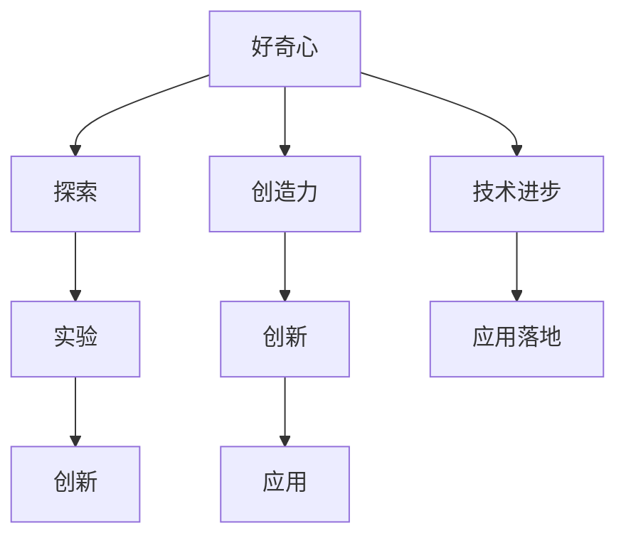

                 

# 好奇心与创造力：探索的双翼

> 关键词：好奇心,创造力,人工智能,探索,算法,软件开发,技术创新

## 1. 背景介绍

### 1.1 问题由来

在数字化时代，技术的进步迅猛发展，特别是人工智能(AI)技术，已经成为推动社会进步和经济增长的重要引擎。然而，技术的快速发展也带来了一系列问题和挑战，如技术伦理、隐私保护、公平性等，这些问题需要技术工作者不断地探索和创新来应对。在这其中，好奇心与创造力扮演着至关重要的角色。好奇心驱动我们不断探索未知领域，创造力则是我们在探索过程中解决问题、提出新想法的动力。

### 1.2 问题核心关键点

好奇心与创造力是大数据和人工智能领域内两个重要且密切相关的主题。好奇心推动我们不断探索数据和算法的新边界，而创造力则引导我们在探索过程中不断提出创新的解决方案。这两个概念的紧密结合，推动了人工智能技术的不断进步和创新，也推动了技术在各行各业中的广泛应用。

## 2. 核心概念与联系

### 2.1 核心概念概述

为更好地理解好奇心与创造力在人工智能探索过程中的作用，本节将介绍几个核心概念：

- 好奇心（Curiosity）：是指对未知和复杂问题的强烈兴趣和探索欲望。在技术探索中，好奇心驱使我们不断探索新方法、新算法、新模型，推动技术前沿的突破。
- 创造力（Creativity）：是指在探索过程中，基于已有知识和新发现，提出新颖、独特且实用的解决方案。在技术创新中，创造力使得我们能够突破传统束缚，找到更优的解决方案。
- 探索（Exploration）：是指在未知领域进行调查和实验的过程。探索是好奇心与创造力在技术领域中实现转化的重要环节。
- 实验（Experimentation）：是指在探索过程中进行实验验证的过程。实验是创造力在探索过程中实现创新的关键步骤。
- 创新（Innovation）：是指基于探索和实验，实现技术突破和应用创新的过程。创新是将好奇心与创造力转化为实际应用的重要手段。

这些核心概念之间的逻辑关系可以通过以下Mermaid流程图来展示：



这个流程图展示了好奇心与创造力在技术探索和应用中的作用：

1. 好奇心驱使我们进行探索，在未知领域进行调查和实验。
2. 实验过程中，创造力发挥作用，提出新的解决方案。
3. 创新则将探索和实验中的新发现转化为实际应用，推动技术进步。
4. 技术进步和创新推动应用落地，从而影响社会和经济。

## 3. 核心算法原理 & 具体操作步骤
### 3.1 算法原理概述

好奇心与创造力的驱动，可以应用于技术探索和创新的各个环节。具体而言，通过好奇心驱动探索，通过创造力实现实验和创新，最终将创新成果转化为实际应用。

在AI技术中，好奇心和创造力的驱动，主要体现在以下几个方面：

- 数据探索：通过探索和分析新数据，发现潜在的问题和机会。
- 算法创新：通过创新和优化算法，提升模型性能和效率。
- 模型实验：通过实验和验证，找到最优的模型配置和参数。
- 应用创新：通过应用新模型和新算法，解决实际问题。

### 3.2 算法步骤详解

基于好奇心与创造力的技术探索和创新，一般包括以下几个关键步骤：

**Step 1: 确定探索目标**
- 明确探索的目标和方向，如解决特定问题、提升模型性能等。
- 进行市场调研和技术分析，确定探索的具体领域和问题。

**Step 2: 数据收集与预处理**
- 收集相关领域的数据，进行清洗、标注和预处理。
- 使用探索性数据分析，初步发现数据中的模式和异常。

**Step 3: 算法设计**
- 基于已有知识，设计新的算法或改进现有算法。
- 使用符号化推理、机器学习、深度学习等技术手段，设计算法。

**Step 4: 模型实验**
- 使用收集的数据进行模型训练和验证。
- 使用交叉验证、对比实验等方法，评估模型性能。

**Step 5: 模型优化**
- 基于实验结果，优化模型参数和结构。
- 引入正则化、Dropout等技术手段，防止过拟合。

**Step 6: 应用验证**
- 将优化后的模型应用于实际场景，进行验证。
- 收集反馈，进一步优化模型。

**Step 7: 技术推广**
- 将优化后的模型进行部署和推广，形成实际应用。
- 持续收集新数据，进行模型迭代和优化。

以上是好奇心与创造力驱动的技术探索和创新的典型流程。在实际应用中，还需要根据具体情况进行优化设计，如引入新的技术手段、改进数据收集方法等，以进一步提升探索和创新的效率和效果。

### 3.3 算法优缺点

基于好奇心与创造力的技术探索和创新方法，具有以下优点：

1. 灵活性高。探索和创新不受固定框架的限制，可以根据实际需求进行灵活设计。
2. 创新性强。好奇心和创造力的驱动，可以激发新的想法和方法，实现技术突破。
3. 应用广泛。适用于各类AI技术领域，如自然语言处理(NLP)、计算机视觉(CV)、语音识别(SR)等。
4. 可扩展性良好。探索和创新可以不断迭代和优化，推动技术不断发展。

同时，该方法也存在一定的局限性：

1. 依赖高质量数据。数据的质量和多样性对探索和创新的效果有较大影响。
2. 需要经验积累。好奇心和创造力的驱动需要丰富的经验和技术积累，难以一蹴而就。
3. 不确定性较高。探索和创新过程中存在一定的风险，结果可能与预期不符。
4. 资源消耗大。探索和创新过程中需要大量的计算资源和时间，成本较高。

尽管存在这些局限性，但就目前而言，基于好奇心与创造力的探索和创新方法仍是最广泛采用的技术范式。未来相关研究的重点在于如何进一步降低资源消耗，提高探索和创新的效率，同时兼顾可解释性和伦理安全性等因素。

### 3.4 算法应用领域

基于好奇心与创造力的技术探索和创新方法，在人工智能领域已经得到了广泛的应用，覆盖了几乎所有常见的技术领域，例如：

- 自然语言处理（NLP）：如情感分析、机器翻译、问答系统等。通过探索和创新，不断提升NLP模型的准确性和通用性。
- 计算机视觉（CV）：如图像识别、目标检测、视频分析等。通过探索和创新，不断提升CV模型的准确性和鲁棒性。
- 语音识别（SR）：如语音转文本、语音合成等。通过探索和创新，不断提升SR系统的准确性和自然度。
- 机器人学（Robotics）：如移动机器人、协作机器人等。通过探索和创新，提升机器人系统的感知和决策能力。
- 医疗技术（Healthcare）：如医学影像分析、智能诊断等。通过探索和创新，提升医疗系统的准确性和效率。
- 金融科技（FinTech）：如信用评估、风险控制等。通过探索和创新，提升金融系统的安全性和可靠性。

除了上述这些经典领域外，探索和创新技术还在更多场景中得到应用，如智慧城市、智能家居、自动驾驶等，为各行各业带来新的发展机遇。随着好奇心与创造力的持续激发，相信探索和创新技术将在更广阔的应用领域大放异彩。

## 4. 数学模型和公式 & 详细讲解 & 举例说明

### 4.1 数学模型构建

在探索和创新过程中，数学模型扮演着至关重要的角色。探索和创新中的很多问题都可以转化为数学问题，通过建立数学模型进行求解。以下以机器学习中的支持向量机(SVM)为例，介绍探索和创新中的数学模型构建过程。

### 4.2 公式推导过程

假设给定训练集 $D=\{(x_i, y_i)\}_{i=1}^N$，其中 $x_i \in \mathbb{R}^d$ 为输入样本，$y_i \in \{-1, 1\}$ 为输出标签。支持向量机通过寻找一个最优超平面 $w^Tx+b=0$ 将数据分为两类，公式如下：

$$
w^Tx+b=0
$$

其中 $w \in \mathbb{R}^d$ 为超平面的法向量，$b$ 为超平面在y轴上的截距。超平面将数据分为两类，使得两类之间的间隔最大化。

支持向量机的优化目标为：

$$
\mathop{\min}_{w,b} \frac{1}{2}\|w\|^2
$$

同时满足分类正确性约束：

$$
y_i(w^Tx_i+b) \geq 1 \quad \forall i
$$

将上述优化目标和约束条件转化为拉格朗日对偶问题，引入拉格朗日乘子 $\alpha$，可得：

$$
\mathop{\max}_{\alpha} \sum_{i=1}^N \alpha_i - \frac{1}{2}\sum_{i,j=1}^N \alpha_i \alpha_j y_i y_j (w_i \cdot w_j)
$$

$$
\mathop{\min}_{w,b} \frac{1}{2}\|w\|^2 + \sum_{i=1}^N \alpha_i(1-y_i(w^Tx_i+b))
$$

其中 $w_i$ 为输入样本 $x_i$ 的特征向量。

通过求解上述对偶问题，可以求得最优的 $w$ 和 $b$，从而得到支持向量机模型。

### 4.3 案例分析与讲解

在SVM的探索和创新过程中，数学模型发挥了重要作用。以下是SVM的创新改进过程：

**1. 线性SVM的改进**
- 引入正则化项，平衡模型复杂度和泛化性能。
- 引入核函数，处理非线性分类问题。

**2. 多类别SVM的改进**
- 引入一对多分类器，将多类别问题转化为多个二分类问题。
- 引入多分类器融合方法，如软间隔、序列最小优化算法(SMO)等，提高分类精度。

**3. SVM的扩展**
- 引入支持向量回归(SVR)，解决回归问题。
- 引入半监督学习方法，利用未标注数据提高模型性能。

SVM的创新改进过程中，数学模型的构建和优化是关键步骤。通过不断改进和优化数学模型，SVM在各个领域的应用得到了广泛验证，证明了其强大的分类和回归能力。

## 5. 项目实践：代码实例和详细解释说明
### 5.1 开发环境搭建

在进行探索和创新实践前，我们需要准备好开发环境。以下是使用Python进行机器学习探索和创新的环境配置流程：

1. 安装Anaconda：从官网下载并安装Anaconda，用于创建独立的Python环境。

2. 创建并激活虚拟环境：
```bash
conda create -n pyenv python=3.8 
conda activate pyenv
```

3. 安装必要的Python包：
```bash
conda install numpy scipy pandas scikit-learn matplotlib seaborn
```

4. 安装机器学习相关的库：
```bash
pip install scikit-learn
```

5. 安装Jupyter Notebook：
```bash
pip install jupyter notebook
```

完成上述步骤后，即可在`pyenv`环境中开始探索和创新实践。

### 5.2 源代码详细实现

下面我们以SVM为例，给出机器学习探索和创新的PyTorch代码实现。

首先，导入必要的库：

```python
import numpy as np
import matplotlib.pyplot as plt
from sklearn import datasets
from sklearn.model_selection import train_test_split
from sklearn.metrics import accuracy_score, confusion_matrix
from sklearn import svm
```

然后，加载数据集：

```python
iris = datasets.load_iris()
X = iris.data
y = iris.target
X_train, X_test, y_train, y_test = train_test_split(X, y, test_size=0.3, random_state=42)
```

接着，进行SVM模型的训练和预测：

```python
model = svm.SVC(kernel='linear')
model.fit(X_train, y_train)
y_pred = model.predict(X_test)

print('Accuracy:', accuracy_score(y_test, y_pred))
print('Confusion Matrix:', confusion_matrix(y_test, y_pred))
```

最后，可视化结果：

```python
plt.scatter(X_test[:, 0], X_test[:, 1], c=y_test, cmap='viridis')
plt.xlabel('Sepal length')
plt.ylabel('Sepal width')
plt.show()
```

以上就是使用PyTorch对SVM进行探索和创新的完整代码实现。可以看到，得益于scikit-learn的强大封装，我们可以用相对简洁的代码完成SVM模型的探索和创新。

### 5.3 代码解读与分析

让我们再详细解读一下关键代码的实现细节：

**train_test_split函数**：
- 用于对数据集进行划分成训练集和测试集，比例为70%和30%。
- 参数`random_state`用于设置随机数种子，确保结果的可重复性。

**svm.SVC函数**：
- 用于创建支持向量机模型。
- 参数`kernel`用于指定核函数，默认为线性核。

**fit和predict函数**：
- 用于训练模型和进行预测。

**accuracy_score和confusion_matrix函数**：
- 用于评估模型性能，分别计算准确率和混淆矩阵。

**matplotlib.pyplot**：
- 用于绘制散点图，直观展示分类结果。

可以看到，通过Python和机器学习库的封装，探索和创新的代码实现变得简洁高效。开发者可以将更多精力放在数据处理、模型改进等高层逻辑上，而不必过多关注底层的实现细节。

当然，工业级的系统实现还需考虑更多因素，如模型的保存和部署、超参数的自动搜索、更灵活的任务适配层等。但核心的探索和创新范式基本与此类似。

## 6. 实际应用场景
### 6.1 智能客服系统

基于好奇心与创造力的探索和创新，智能客服系统可以实现对客户咨询的智能解答和情感识别。通过不断收集和分析客户咨询数据，探索和创新出新的客户服务策略，实现更加个性化的服务体验。

在技术实现上，可以引入自然语言处理(NLP)技术，探索和创新出更加智能的问答系统。同时，通过情感识别技术，探索和创新出更加智能的情感分析系统，实现对客户情感的及时识别和响应。

### 6.2 金融舆情监测

金融行业对舆情监测的需求日益增加。通过好奇心与创造力的探索和创新，可以构建出更加智能的舆情监测系统，实现对金融舆情的实时监测和分析。

具体而言，可以探索和创新出基于深度学习的舆情分类模型，利用多模态数据进行情感分析，实时监测市场舆情。同时，通过探索和创新，可以构建出更加智能的舆情预警系统，及时发现和处理舆情风险。

### 6.3 个性化推荐系统

当前推荐系统往往只依赖用户的历史行为数据进行物品推荐，缺乏对用户兴趣和偏好的深入理解。通过好奇心与创造力的探索和创新，可以构建出更加智能的个性化推荐系统。

具体而言，可以探索和创新出基于深度学习的推荐模型，利用用户的历史行为和兴趣数据，构建出更加智能的推荐系统。同时，通过探索和创新，可以构建出更加智能的用户行为分析系统，实时分析用户的兴趣和偏好，提高推荐系统的精准度。

### 6.4 未来应用展望

随着好奇心与创造力的持续激发，探索和创新技术将在更多领域得到应用，为各行各业带来变革性影响。

在智慧医疗领域，基于探索和创新的AI技术，可以实现对患者病历的智能分析，提高诊疗效率和准确度。

在智能教育领域，通过探索和创新，可以构建出更加智能的学习系统，实现对学生的智能评估和个性化辅导。

在智慧城市治理中，通过探索和创新，可以构建出更加智能的城市管理系统，提高城市管理的效率和准确度。

此外，在企业生产、社会治理、文娱传媒等众多领域，探索和创新技术也将不断涌现，为经济社会发展注入新的动力。

## 7. 工具和资源推荐
### 7.1 学习资源推荐

为了帮助开发者系统掌握探索和创新的理论基础和实践技巧，这里推荐一些优质的学习资源：

1. 《机器学习实战》书籍：由机器学习专家撰写，深入浅出地介绍了机器学习的基本概念和经典算法，适合入门学习。

2. CS229《机器学习》课程：斯坦福大学开设的机器学习明星课程，涵盖了机器学习的各个方面，是了解机器学习的权威资源。

3. 《深度学习》书籍：由深度学习专家撰写，全面介绍了深度学习的基本概念和经典模型，适合深入学习。

4. Kaggle平台：全球知名的数据科学竞赛平台，提供海量数据集和竞赛，适合锻炼实践能力。

5. GitHub开源项目：GitHub上大量的开源机器学习项目，提供了丰富的学习和实践资源。

通过对这些资源的学习实践，相信你一定能够快速掌握探索和创新的精髓，并用于解决实际的机器学习问题。

### 7.2 开发工具推荐

高效的开发离不开优秀的工具支持。以下是几款用于机器学习探索和创新的常用工具：

1. Python：作为机器学习的主流语言，Python语言简洁高效，拥有大量的机器学习库和框架。

2. TensorFlow：由Google主导开发的开源深度学习框架，生产部署方便，适合大规模工程应用。

3. PyTorch：由Facebook主导开发的开源深度学习框架，灵活动态的计算图，适合快速迭代研究。

4. scikit-learn：Python中的机器学习库，提供了大量的经典机器学习算法和工具，适合入门学习和实践。

5. Jupyter Notebook：用于编写和执行Python代码，支持代码和结果的可视化展示，适合数据探索和算法验证。

合理利用这些工具，可以显著提升机器学习探索和创新的开发效率，加快创新迭代的步伐。

### 7.3 相关论文推荐

探索和创新技术的发展源于学界的持续研究。以下是几篇奠基性的相关论文，推荐阅读：

1. Deep Learning（深度学习）论文：由深度学习专家Yoshua Bengio、Geoffrey Hinton、Yann LeCun等撰写，全面介绍了深度学习的基本概念和经典模型。

2. Convolutional Neural Networks for Image Recognition（卷积神经网络）论文：由深度学习专家LeCun、Sndergren和Bengio等撰写，奠定了卷积神经网络在计算机视觉领域的基础。

3. Natural Language Processing with Transformers（Transformer）论文：由深度学习专家Attention机制的发明者Jurgen Schmidhuber等撰写，介绍了Transformer在自然语言处理领域的应用。

4. Stochastic Gradient Descent Tricks（随机梯度下降技巧）论文：由深度学习专家Tong Zhou等撰写，介绍了随机梯度下降算法及其变种在深度学习中的应用。

5. Scalable Parallel Learning with Cloud Infrastructures（基于云架构的分布式学习）论文：由深度学习专家Haesun Park等撰写，介绍了分布式深度学习在大规模数据集上的应用。

这些论文代表了大数据和人工智能领域的发展脉络。通过学习这些前沿成果，可以帮助研究者把握学科前进方向，激发更多的创新灵感。

## 8. 总结：未来发展趋势与挑战

### 8.1 总结

本文对基于好奇心与创造力的探索和创新方法进行了全面系统的介绍。首先阐述了探索和创新在人工智能领域的重要性和作用，明确了探索和创新在推动技术进步和应用落地中的独特价值。其次，从原理到实践，详细讲解了探索和创新的数学原理和关键步骤，给出了探索和创新任务开发的完整代码实例。同时，本文还广泛探讨了探索和创新方法在智能客服、金融舆情、个性化推荐等多个行业领域的应用前景，展示了探索和创新技术的巨大潜力。此外，本文精选了探索和创新技术的各类学习资源，力求为读者提供全方位的技术指引。

通过本文的系统梳理，可以看到，好奇心与创造力驱动的探索和创新方法正在成为人工智能领域的重要范式，极大地拓展了技术探索和创新的边界，催生了更多的落地场景。受益于大数据和人工智能技术的持续演进，探索和创新技术必将在更广阔的应用领域大放异彩，深刻影响人类的生产生活方式。

### 8.2 未来发展趋势

展望未来，探索和创新技术将呈现以下几个发展趋势：

1. 数据驱动成为常态。大数据的持续增长将为探索和创新提供更丰富、更真实的数据资源。数据驱动的探索和创新将更加广泛和深入。

2. 多模态融合成为趋势。探索和创新技术将更多地融合多模态数据，实现跨领域、跨模态的协同建模。

3. 自动化成为可能。通过人工智能技术，探索和创新的自动化水平将不断提高，降低对人类专家经验的依赖。

4. 可解释性成为焦点。探索和创新技术需要具备更高的可解释性，以增强其可信度和透明度。

5. 跨学科融合成为主流。探索和创新技术将更多地融合其他学科的知识和技术，实现跨学科的协同创新。

6. 社会价值成为衡量标准。探索和创新技术将更加注重社会价值，推动社会进步和经济发展。

以上趋势凸显了探索和创新技术的广阔前景。这些方向的探索发展，必将进一步推动人工智能技术的不断进步和创新，为经济社会发展注入新的动力。

### 8.3 面临的挑战

尽管探索和创新技术已经取得了瞩目成就，但在迈向更加智能化、普适化应用的过程中，它仍面临着诸多挑战：

1. 数据获取瓶颈。探索和创新需要大量高质量的数据，数据获取成本和难度可能成为制约因素。

2. 计算资源瓶颈。探索和创新过程需要大量计算资源，如何高效利用计算资源，将是重要挑战。

3. 模型复杂性。探索和创新中的模型往往结构复杂，如何简化模型结构，提升模型的可解释性和可维护性，将是重要研究方向。

4. 伦理道德问题。探索和创新过程中可能存在伦理道德问题，如何避免模型偏见、确保数据隐私和安全性，将是重要挑战。

5. 知识管理问题。探索和创新过程中需要有效管理知识，如何建立知识库、进行知识复用，将是重要研究方向。

6. 跨学科协作问题。探索和创新技术需要跨学科协作，如何打破学科壁垒，建立协同机制，将是重要挑战。

正视探索和创新面临的这些挑战，积极应对并寻求突破，将是探索和创新技术走向成熟的必由之路。相信随着学界和产业界的共同努力，这些挑战终将一一被克服，探索和创新技术必将在构建人机协同的智能时代中扮演越来越重要的角色。

### 8.4 未来突破

面对探索和创新技术面临的种种挑战，未来的研究需要在以下几个方面寻求新的突破：

1. 引入跨学科知识。探索和创新过程中需要引入跨学科的知识和技术，实现多学科的协同创新。

2. 引入更多先验知识。将符号化的先验知识，如知识图谱、逻辑规则等，与神经网络模型进行巧妙融合，引导探索和创新过程学习更准确、合理的语言模型。

3. 引入更多计算资源。通过分布式计算、异构计算等技术手段，提高探索和创新的计算效率。

4. 引入更多数据来源。探索和创新过程中需要更多数据来源，如何有效整合和利用数据，将是重要的研究方向。

5. 引入更多技术手段。探索和创新过程中需要引入更多技术手段，如因果推理、强化学习等，实现更加全面和深入的探索和创新。

6. 引入更多领域专家。探索和创新过程中需要引入更多领域专家，共同推动探索和创新的发展。

这些研究方向的探索，必将引领探索和创新技术迈向更高的台阶，为构建安全、可靠、可解释、可控的智能系统铺平道路。面向未来，探索和创新技术还需要与其他人工智能技术进行更深入的融合，如知识表示、因果推理、强化学习等，多路径协同发力，共同推动自然语言理解和智能交互系统的进步。只有勇于创新、敢于突破，才能不断拓展探索和创新技术的边界，让智能技术更好地造福人类社会。

## 9. 附录：常见问题与解答

**Q1：探索和创新技术与传统技术相比有哪些优势？**

A: 探索和创新技术相比传统技术，具有以下几个优势：

1. 灵活性高。探索和创新技术不受固定框架的限制，可以根据实际需求进行灵活设计。

2. 创新性强。好奇心和创造力的驱动，可以激发新的想法和方法，实现技术突破。

3. 应用广泛。适用于各类AI技术领域，如自然语言处理(NLP)、计算机视觉(CV)、语音识别(SR)等。

4. 可扩展性良好。探索和创新可以不断迭代和优化，推动技术不断发展。

**Q2：如何选择合适的探索和创新方法？**

A: 选择合适的探索和创新方法需要考虑以下几个因素：

1. 任务类型：根据任务类型选择合适的模型和算法。

2. 数据规模：根据数据规模选择合适的模型和算法。

3. 计算资源：根据计算资源选择合适的模型和算法。

4. 技术积累：根据技术积累选择合适的模型和算法。

5. 应用场景：根据应用场景选择合适的模型和算法。

**Q3：探索和创新技术在实际应用中需要注意哪些问题？**

A: 探索和创新技术在实际应用中需要注意以下几个问题：

1. 数据质量：确保数据的质量和多样性，避免数据偏见。

2. 计算效率：提高计算效率，避免资源浪费。

3. 模型可解释性：增强模型的可解释性，提高用户信任。

4. 模型鲁棒性：提高模型的鲁棒性，避免过拟合和泛化能力差的问题。

5. 伦理道德：确保模型的伦理道德性，避免偏见和歧视。

6. 技术普及：推动技术普及和应用，提高社会效益。

以上是探索和创新技术在实际应用中需要注意的几个关键问题，需要在各个环节进行全面优化。

**Q4：探索和创新技术在实际应用中如何评估性能？**

A: 探索和创新技术在实际应用中，性能评估需要考虑以下几个方面：

1. 准确率：模型的准确率是衡量性能的重要指标。

2. 召回率：模型的召回率也是衡量性能的重要指标。

3. F1分数：F1分数是准确率和召回率的综合指标。

4. 混淆矩阵：混淆矩阵可以展示模型分类结果的具体情况。

5. ROC曲线：ROC曲线可以展示模型在不同阈值下的性能。

6. 训练时间：模型的训练时间也是衡量性能的重要指标。

通过综合考虑这些指标，可以全面评估探索和创新技术的性能。

---

作者：禅与计算机程序设计艺术 / Zen and the Art of Computer Programming

