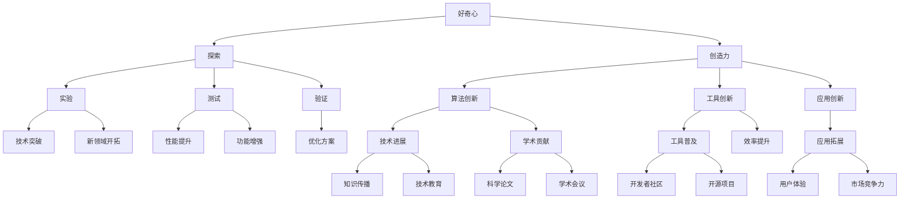

                 

# 好奇心与创造力：探索的双翼

## 1. 背景介绍

在当今信息爆炸的时代，技术创新如同原子裂变一般，释放出前所未有的潜能。然而，尽管我们已经站在了科技前沿，对知识的探索和理解依然远远落后于技术的进展。好奇心与创造力，作为人类探索未知领域的双翼，不仅驱动着科技的发展，也激发了无数创新的火花。本文将深入探讨这两大要素在科技发展中的作用，并从技术角度探讨如何激发和利用好奇心与创造力。

## 2. 核心概念与联系

### 2.1 核心概念概述

- **好奇心**：好奇心是人类探索未知、学习新知的内在动力。在科技领域，好奇心驱动着研究人员对未知领域的探索，推动着技术进步。
- **创造力**：创造力是结合已知信息产生新知识、新方法的能力。在技术创新中，创造力不仅体现在算法和工具的创新上，也体现在对现有技术的重新组合和应用上。
- **探索**：探索是好奇心和创造力的实际应用过程。在技术研究中，探索往往伴随着实验、测试和验证，最终形成创新成果。

### 2.2 核心概念原理和架构的 Mermaid 流程图(Mermaid 流程节点中不要有括号、逗号等特殊字符)



## 3. 核心算法原理 & 具体操作步骤

### 3.1 算法原理概述

好奇心与创造力的驱动下，科技创新往往是多学科交叉、跨领域合作的结果。这一过程涉及到知识的积累、迁移和创造，涵盖从理论研究到实际应用的全链条。在算法原理上，好奇心与创造力的结合主要体现在以下几个方面：

- **知识迁移**：通过迁移学习，将已有领域的知识应用到新领域，加速探索过程。
- **算法优化**：利用优化算法，提高探索效率，减少试错成本。
- **模型融合**：通过模型融合技术，将不同模型的优势结合起来，产生更强的探索能力。

### 3.2 算法步骤详解

1. **知识库构建**：收集和整理现有知识库，为好奇心驱动的探索提供基础。知识库可以是文献、数据集、代码库等形式。
2. **问题定义**：根据好奇心和创造力，明确探索的具体问题，如“如何提高自然语言处理的效率”。
3. **数据收集与预处理**：收集与问题相关的数据，并进行预处理，确保数据质量和适用性。
4. **算法选择**：根据问题的特点，选择合适的算法和模型，如神经网络、深度学习等。
5. **模型训练与优化**：利用优化算法对模型进行训练和优化，调整参数以提高模型性能。
6. **实验验证**：在真实环境中进行实验，验证模型的效果，收集反馈信息。
7. **模型迭代**：根据实验结果和反馈，不断调整模型，进行迭代优化。

### 3.3 算法优缺点

**优点**：
- **高效探索**：通过知识迁移和算法优化，加速了探索过程，减少了试错成本。
- **多学科融合**：将不同领域的知识和方法结合，推动了更广泛的创新。
- **动态适应**：在实际应用中，模型能够根据反馈进行迭代优化，动态适应新情况。

**缺点**：
- **资源消耗**：数据收集、模型训练等过程需要大量计算资源。
- **算法复杂**：复杂的算法和模型设计，对专业技能要求较高。
- **结果不确定性**：探索过程存在一定的不确定性，可能无法达到预期效果。

### 3.4 算法应用领域

好奇心与创造力的驱动下，科技创新已经覆盖了各个领域，包括但不限于：

- **医疗健康**：基于好奇心的探索，推动了基因编辑、精准医疗等新技术的发展。
- **环境保护**：通过创造力，开发出节能减排、智能监测等环境友好型技术。
- **智能制造**：利用知识迁移和算法优化，推动了工业4.0、智能制造等新兴工业技术的出现。
- **交通运输**：基于好奇心，探索无人驾驶、智慧交通等新技术，提升交通系统的效率和安全性。
- **金融科技**：通过创造力，开发出区块链、智能合约等创新金融产品。

## 4. 数学模型和公式 & 详细讲解 & 举例说明

### 4.1 数学模型构建

探索与创新的过程往往需要通过数学模型进行抽象和表达。以自然语言处理(NLP)领域为例，探索语言模型的新算法，构建如下数学模型：

$$
\min_{\theta} \sum_{i=1}^{n} \ell(y_i, f(x_i; \theta))
$$

其中，$\ell$为损失函数，$y_i$为输入数据$x_i$的真实标签，$f(x_i; \theta)$为模型在参数$\theta$下的预测输出。

### 4.2 公式推导过程

在NLP任务中，常用的损失函数包括交叉熵损失、均方误差损失等。以交叉熵损失为例，其推导过程如下：

设模型输出为$y = f(x; \theta)$，真实标签为$y^* \in \{0, 1\}$，则交叉熵损失为：

$$
\ell(y, y^*) = -y^* \log(y) - (1 - y^*) \log(1 - y)
$$

将其代入经验风险公式，得：

$$
\mathcal{L}(\theta) = -\frac{1}{N} \sum_{i=1}^N [y_i \log f(x_i; \theta) + (1-y_i) \log (1-f(x_i; \theta))]
$$

在得到损失函数后，利用梯度下降等优化算法进行模型训练，不断调整参数$\theta$，使模型预测输出逼近真实标签。

### 4.3 案例分析与讲解

以BERT模型为例，BERT在自然语言理解任务上的创新之处在于：

- **双向编码器**：将输入序列的前向和后向信息都考虑在内，提高了语言模型的上下文理解能力。
- **预训练**：在大规模无标签文本上进行预训练，学习通用的语言表示，提高了模型泛化能力。
- **Transformer结构**：采用Transformer结构，提升了模型的并行计算效率。

这些创新是基于好奇心与创造力的结合，通过不断地探索和优化，推动了自然语言处理技术的发展。

## 5. 项目实践：代码实例和详细解释说明

### 5.1 开发环境搭建

1. **安装Python**：在Windows、Linux或MacOS上安装Python，推荐使用3.6或更高版本。
2. **安装PyTorch**：使用pip安装PyTorch，确保安装版本与GPU驱动兼容。
3. **安装TensorBoard**：安装TensorBoard，用于模型训练和调试的可视化。
4. **安装Git**：安装Git，用于代码管理和版本控制。

### 5.2 源代码详细实现

以下是使用PyTorch实现BERT模型的代码示例：

```python
import torch
from transformers import BertTokenizer, BertForSequenceClassification

# 定义模型和分词器
tokenizer = BertTokenizer.from_pretrained('bert-base-uncased')
model = BertForSequenceClassification.from_pretrained('bert-base-uncased', num_labels=2)

# 定义训练函数
def train_epoch(model, dataset, optimizer):
    model.train()
    for batch in dataset:
        inputs = tokenizer(batch['text'], max_length=512, padding='max_length', truncation=True, return_tensors='pt')
        labels = torch.tensor(batch['label'], dtype=torch.long)
        outputs = model(**inputs)
        loss = outputs.loss
        optimizer.zero_grad()
        loss.backward()
        optimizer.step()

# 定义数据集
train_dataset = ...
val_dataset = ...
test_dataset = ...

# 定义优化器
optimizer = torch.optim.Adam(model.parameters(), lr=2e-5)

# 训练模型
for epoch in range(10):
    train_epoch(model, train_dataset, optimizer)
    val_loss = ...
    test_loss = ...
    print(f"Epoch {epoch+1}, val loss: {val_loss:.3f}, test loss: {test_loss:.3f}")
```

### 5.3 代码解读与分析

**tokenizer和BertForSequenceClassification**：
- **tokenizer**：用于将输入文本转换为模型能够处理的token序列。
- **BertForSequenceClassification**：定义模型架构，用于分类任务。

**train_epoch函数**：
- **模型训练**：在每个epoch内，对数据集进行迭代训练，计算损失并更新模型参数。

**优化器选择**：
- **Adam**：常用的优化算法，能够在保证收敛速度的同时，防止参数发散。

**数据集定义**：
- **train_dataset, val_dataset, test_dataset**：定义训练集、验证集和测试集，用于模型训练和评估。

通过上述代码，可以搭建一个简单的BERT模型，并在训练集上进行训练，验证集上进行验证，测试集上进行测试，最终得到模型性能指标。

### 5.4 运行结果展示

在训练过程中，可以使用TensorBoard进行模型训练的可视化：

```bash
tensorboard --logdir log_dir
```

在Web界面上查看训练过程的loss曲线、参数更新情况等，帮助调试和优化模型。

## 6. 实际应用场景

### 6.1 医疗健康

好奇心驱动下的探索，使得医疗健康领域的技术不断突破。例如，基因编辑技术通过CRISPR-Cas9等创新方法，实现了对基因序列的精准修改，为基因治疗带来了新的可能。通过创造力，开发出智能诊断系统，如IBM Watson Health，能够结合海量的医疗数据，提供个性化的诊断建议。

### 6.2 环境保护

基于好奇心与创造力的探索，环境保护技术也在不断进步。通过知识迁移，将机器学习技术应用于环境监测，如智慧水务系统，能够实时监测水质变化，预测污染趋势。利用创造力，开发出智能垃圾分类系统，通过图像识别技术，自动识别垃圾种类，提高垃圾分类的准确性。

### 6.3 智能制造

好奇心与创造力推动了智能制造技术的快速发展。例如，通过探索先进的生产工艺和机器学习算法，实现了智能仓储系统的优化，提高了生产效率和资源利用率。利用创造力，开发出工业机器人，能够根据生产需求，自动调整工作参数，提高生产灵活性和适应性。

### 6.4 未来应用展望

随着技术的不断进步，好奇心与创造力将在更多领域得到应用。例如：

- **智能城市**：通过探索智能交通、智慧能源等技术，提高城市管理的效率和智能化水平。
- **金融科技**：通过探索区块链、智能合约等创新技术，提升金融系统的安全性和透明度。
- **教育科技**：通过探索个性化学习、虚拟现实等技术，提升教育资源的可访问性和教学效果。

## 7. 工具和资源推荐

### 7.1 学习资源推荐

- **Coursera**：提供各类深度学习课程，涵盖从入门到高级的各类内容。
- **DeepLearning.AI**：提供深度学习课程，由深度学习领域的专家授课。
- **Google AI Blog**：Google AI团队定期发布的深度学习技术文章，涵盖最新研究进展和实践经验。

### 7.2 开发工具推荐

- **Jupyter Notebook**：用于编写和运行Python代码，支持数据可视化、代码执行和注释功能。
- **Git**：用于版本控制，帮助开发者管理代码变更和协作。
- **PyTorch Lightning**：用于快速搭建和训练深度学习模型，支持多种优化器和调度策略。

### 7.3 相关论文推荐

- **Neural Information Processing Systems (NeurIPS)**：涵盖深度学习和人工智能领域的最新研究进展。
- **Journal of Machine Learning Research (JMLR)**：提供深度学习、机器学习领域的高质量论文。
- **ArXiv**：开放获取的学术论文库，提供各类深度学习研究成果。

## 8. 总结：未来发展趋势与挑战

### 8.1 研究成果总结

本文探讨了好奇心与创造力在科技探索中的重要作用，强调了这两大要素在推动技术创新、促进知识积累和传播方面的不可替代性。通过对实际项目和案例的分析，展示了这些要素如何驱动技术的突破和发展。

### 8.2 未来发展趋势

- **多模态探索**：未来的探索将不仅仅局限于单一领域，而是将多模态数据（如文本、图像、视频等）结合起来，形成更全面的数据融合模型。
- **跨学科协作**：跨学科的协作和交流将成为创新发展的重要驱动力，推动技术在更多领域的应用。
- **自动化探索**：通过自动化探索工具和算法，加速创新过程，降低探索成本。

### 8.3 面临的挑战

- **资源瓶颈**：数据收集、模型训练等过程需要大量计算资源，可能成为探索的瓶颈。
- **知识鸿沟**：不同领域的专业知识差异较大，跨学科的合作和知识共享需要更多桥梁。
- **伦理问题**：探索新技术时，需要注意技术应用的伦理问题，避免带来负面影响。

### 8.4 研究展望

未来的探索将更多地关注自动化和智能化的结合，通过算法和工具的不断创新，推动更多领域的科技突破。同时，如何平衡技术进步与伦理道德的考量，确保技术的可持续发展，也将是重要的研究方向。

## 9. 附录：常见问题与解答

**Q1：好奇心与创造力如何结合？**

A: 好奇心与创造力的结合，通常通过以下步骤实现：
1. **提出问题**：基于好奇心，提出探索性的问题，如“如何提高自然语言处理的效率”。
2. **知识迁移**：通过迁移学习，将已有领域的知识应用到新领域，如将计算机视觉中的注意力机制应用于NLP。
3. **算法创新**：利用算法优化，提高探索效率，如使用Transformer结构优化NLP任务。
4. **模型融合**：通过模型融合技术，将不同模型的优势结合起来，如将预训练模型与任务特定模型结合，提高泛化能力。

**Q2：好奇心与创造力在项目实践中的具体应用有哪些？**

A: 好奇心与创造力在项目实践中的具体应用包括：
1. **问题定义**：根据探索目标，明确具体问题，如“如何优化图像识别算法”。
2. **数据收集**：收集与问题相关的数据，如公开数据集、行业数据等。
3. **模型选择**：根据问题的特点，选择合适的算法和模型，如卷积神经网络、循环神经网络等。
4. **模型训练**：利用优化算法对模型进行训练和优化，调整参数以提高模型性能。
5. **实验验证**：在真实环境中进行实验，验证模型的效果，收集反馈信息。
6. **模型迭代**：根据实验结果和反馈，不断调整模型，进行迭代优化。

**Q3：如何利用好奇心与创造力进行技术创新？**

A: 利用好奇心与创造力进行技术创新的过程包括：
1. **广泛阅读**：通过阅读最新的研究论文、书籍、报告等，了解前沿技术和研究方向。
2. **跨学科交流**：参与行业会议、研讨会等活动，与其他领域的专家交流，拓宽视野。
3. **实验室探索**：在实验室中尝试新的算法、模型和技术，积累实践经验。
4. **开放协作**：参与开源项目、社区活动，与其他开发者协作，共享资源和技术。
5. **持续学习**：通过在线课程、培训等途径，不断学习新知识，保持好奇心和创造力。

通过这些方法，可以在技术探索中不断发现新的机会和方向，推动技术的进步和创新。

---

作者：禅与计算机程序设计艺术 / Zen and the Art of Computer Programming

