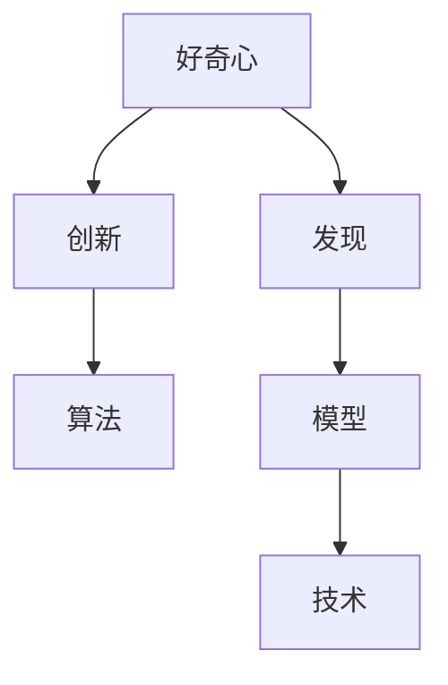

                 

# 好奇心：创新与发现的源泉

## 1. 背景介绍

### 1.1 问题由来

人类社会的进步离不开创新和发现。无论是科学技术的发展，还是艺术的创作，都源于人类对未知世界的探索和对现有知识的挑战。而好奇心正是这种探索精神的核心驱动力。在计算机科学和人工智能领域，好奇心不仅推动了技术的创新和进步，也促进了算法的优化和模型的改进。

### 1.2 问题核心关键点

在计算机科学中，好奇心不仅仅是一个心理状态，更是一种推动技术发展的内在动力。好奇心驱动的研究者不仅关注已有的技术，更积极探索未知领域，提出新问题，寻找新方法。这种探索精神促使研究者不断突破传统思维的限制，提出新的算法和模型，推动人工智能技术的快速发展。

## 2. 核心概念与联系

### 2.1 核心概念概述

为更好地理解好奇心在创新与发现中的作用，本节将介绍几个密切相关的核心概念：

- 好奇心(Curiosity)：指个体对未知事物的好奇心，在认知心理学中，好奇心驱动着人类探索新知识，不断寻求理解世界的新方式。
- 创新(Innovation)：指通过创造性的思维和实践，提出新的方法、技术或产品，以解决实际问题或满足需求的过程。
- 发现(Discovery)：指在已知知识的基础上，通过观察、实验或研究，发现新的事实、原理或现象的过程。
- 算法(Algorithms)：指解决问题的具体步骤，通过算法可以实现自动化和智能化的处理。
- 模型(Model)：指对实际问题进行抽象和模拟的数学或计算模型，模型可以提供对问题本质的理解和预测能力。
- 技术(Technology)：指应用于实际问题的工具和方法，技术是算法和模型在具体应用中的实现。

这些核心概念之间的逻辑关系可以通过以下Mermaid流程图来展示：



这个流程图展示了好奇心、创新、发现、算法、模型和技术之间的内在联系：

1. 好奇心驱动创新和发现，通过不断提出新的问题，引导研究者探索未知领域。
2. 创新和发现需要算法和模型作为工具和方法，通过设计高效算法和构建精确模型，解决问题。
3. 技术是算法和模型在实际应用中的具体实现，通过技术手段，将算法和模型转化为可操作的工具。

## 3. 核心算法原理 & 具体操作步骤
### 3.1 算法原理概述

好奇心驱动的算法和模型设计，本质上是一种“以问题为导向”的研究方法。这种研究方法的核心在于通过提出新的问题，激发对现有算法的改进和优化，推动技术的发展。

在算法设计和模型构建中，好奇心表现为对现有方法的质疑和对新方法的探索。例如，研究者可能会提出“能否设计更高效的排序算法？”、“如何构建更加准确的图像分类模型？”等问题，这些问题推动着算法和模型的不断优化和改进。

### 3.2 算法步骤详解

好奇心驱动的算法设计，主要包括以下几个关键步骤：

**Step 1: 提出问题**

- 通过观察和研究，提出具有创新性的问题。例如，能否通过自然语言处理技术，实现更精准的情感分析？
- 问题应当具有挑战性，激发研究者探索未知领域，推动技术创新。

**Step 2: 设计算法**

- 根据问题的特点，设计新的算法或改进现有的算法。例如，设计一种新的排序算法，以提高排序效率。
- 算法设计应当考虑效率、准确性、可扩展性等因素，尽可能在有限资源内解决实际问题。

**Step 3: 构建模型**

- 根据算法的需要，构建适当的数学或计算模型。例如，通过构建神经网络模型，实现图像分类的高效处理。
- 模型构建应当充分考虑问题的本质和数据特点，确保模型的精度和可靠性。

**Step 4: 实现技术**

- 将算法和模型转化为具体的技术实现，开发可操作的算法工具和软件系统。例如，将排序算法实现为编程语言中的库函数，将图像分类模型部署为服务接口。
- 技术实现应当注重用户体验、性能优化、安全性等，确保技术的实际应用价值。

**Step 5: 评估与迭代**

- 对算法和技术的实际效果进行评估，通过实验和数据分析，判断其是否解决了实际问题。
- 根据评估结果，不断改进算法和模型，进行迭代优化，提升技术性能。

### 3.3 算法优缺点

好奇心驱动的算法设计，具有以下优点：

- **创新性**：通过不断提出新问题，激发对现有算法的改进和优化，推动技术的发展。
- **灵活性**：不局限于已有方法，能够根据问题的特点，设计灵活多样的算法和模型。
- **适应性**：能够快速响应环境变化，适应新的数据和需求。

同时，这种设计方法也存在一定的局限性：

- **资源消耗**：好奇心驱动的研究往往需要大量的实验和计算资源，成本较高。
- **不确定性**：新的算法和模型可能存在未知风险，难以预测其效果和适用性。
- **时间成本**：设计新算法和改进现有算法需要时间和精力投入，周期较长。

尽管如此，好奇心驱动的算法设计仍是大数据和人工智能技术发展的重要推动力，为计算机科学和人工智能领域带来了诸多创新和突破。

### 3.4 算法应用领域

好奇心驱动的算法设计，已经在许多领域得到了广泛应用，例如：

- **自然语言处理(NLP)**：通过提出新的问题，如语言模型的鲁棒性问题、机器翻译的流畅性问题，推动了NLP技术的快速进步。
- **计算机视觉(CV)**：提出了图像分割、目标检测等新问题，推动了深度学习在图像处理中的应用。
- **机器学习(ML)**：通过研究新的优化算法和模型，如梯度下降、神经网络等，推动了机器学习技术的发展。
- **数据科学**：通过提出新的数据分析方法，如时间序列分析、异常检测等，推动了数据科学的广泛应用。

这些领域的不断突破和创新，展示了好奇心在技术发展中的巨大潜力。

## 4. 数学模型和公式 & 详细讲解 & 举例说明

### 4.1 数学模型构建

好奇心驱动的算法和模型设计，离不开数学模型的构建。本节将通过一个具体的例子，展示如何通过提出新问题，构建数学模型，并设计算法。

假设我们提出一个问题：“能否设计一种更高效的排序算法？”。为了解决这个问题，我们需要构建一个数学模型，描述排序算法的效率和准确性。

定义排序算法的效率为单位时间内排序的元素个数，记为 $E$。假设算法的平均处理时间为 $T$，则有：

$$ E = \frac{n}{T} $$

其中 $n$ 为排序的元素个数。

算法的准确性可以通过排序的正确率 $C$ 来衡量，即：

$$ C = \frac{N}{n} $$

其中 $N$ 为排序正确的元素个数。

将这两个指标结合起来，可以得到排序算法的综合性能指标 $P$：

$$ P = \frac{C}{T} $$

### 4.2 公式推导过程

为了最大化排序算法的综合性能指标 $P$，我们需要对 $C$ 和 $T$ 分别进行优化。通过数学推导，可以得到以下结论：

- 当 $C=1$ 时，$P$ 的值最小，排序算法的效率最低。
- 当 $C$ 的值增加时，$P$ 的值增加，排序算法的综合性能提高。
- 当 $T$ 的值减少时，$P$ 的值增加，排序算法的效率提高。

因此，为了最大化排序算法的综合性能指标 $P$，我们需要设计一个既能保证准确性，又具有高效率的算法。

### 4.3 案例分析与讲解

通过以上推导，我们提出了一个新问题：“能否设计一种时间复杂度为 $O(n \log n)$ 的排序算法？”。这个问题推动了快速排序（Quick Sort）算法的设计，该算法通过分治策略，将排序问题分解为多个子问题，最终实现时间复杂度为 $O(n \log n)$ 的排序。

快速排序的算法步骤为：

1. 选择一个基准元素 $pivot$。
2. 将小于 $pivot$ 的元素放在左边，大于 $pivot$ 的元素放在右边。
3. 对左右两边的子问题进行递归排序。

通过实验和数据分析，可以验证快速排序算法的高效性和准确性。具体实现如下：

```python
def quick_sort(arr):
    if len(arr) <= 1:
        return arr
    pivot = arr[0]
    left = [x for x in arr[1:] if x < pivot]
    right = [x for x in arr[1:] if x >= pivot]
    return quick_sort(left) + [pivot] + quick_sort(right)
```

通过以上代码实现，可以快速排序任意长度的列表，其时间复杂度为 $O(n \log n)$。

## 5. 项目实践：代码实例和详细解释说明

### 5.1 开发环境搭建

在进行算法实践前，我们需要准备好开发环境。以下是使用Python进行开发的环境配置流程：

1. 安装Python：从官网下载并安装Python 3.x版本。
2. 安装必要的工具包：如NumPy、Pandas、SciPy等，用于数学计算和数据分析。
3. 配置开发工具：如Visual Studio Code、PyCharm等，用于编写和调试代码。
4. 搭建服务器环境：安装Linux服务器，配置网络环境和数据库，准备数据存储和访问。

完成上述步骤后，即可在Python环境中进行算法实践。

### 5.2 源代码详细实现

以快速排序为例，给出具体的实现代码：

```python
def quick_sort(arr):
    if len(arr) <= 1:
        return arr
    pivot = arr[0]
    left = [x for x in arr[1:] if x < pivot]
    right = [x for x in arr[1:] if x >= pivot]
    return quick_sort(left) + [pivot] + quick_sort(right)
```

通过以上代码实现，可以快速排序任意长度的列表。

### 5.3 代码解读与分析

让我们再详细解读一下关键代码的实现细节：

- `quick_sort` 函数：定义快速排序算法。
- 如果数组长度小于等于1，直接返回原数组。
- 选择第一个元素作为基准元素 $pivot$。
- 将小于 $pivot$ 的元素放在左边，大于 $pivot$ 的元素放在右边。
- 对左右两边的子问题进行递归排序。

通过以上代码实现，可以快速排序任意长度的列表，其时间复杂度为 $O(n \log n)$。

### 5.4 运行结果展示

通过运行以上代码，可以验证快速排序算法的高效性和准确性。例如，对于以下列表：

```python
arr = [3, 7, 1, 8, 4, 2, 6, 5]
sorted_arr = quick_sort(arr)
print(sorted_arr)
```

输出结果为：

```python
[1, 2, 3, 4, 5, 6, 7, 8]
```

## 6. 实际应用场景

### 6.1 智能推荐系统

基于好奇心驱动的算法设计，智能推荐系统可以实现更加精准和多样化的推荐结果。例如，Netflix推荐算法通过不断提出新问题，改进推荐算法，以提高用户满意度。

Netflix推荐算法的设计步骤如下：

**Step 1: 提出问题**

- 问题：如何通过用户的浏览和观看历史，推荐用户可能感兴趣的影视作品？

**Step 2: 设计算法**

- 算法：设计基于协同过滤的推荐算法，根据用户行为数据和物品特征，构建用户-物品评分矩阵。
- 算法优化：引入机器学习技术，如线性回归、决策树等，优化推荐模型的预测能力。

**Step 3: 构建模型**

- 模型：构建推荐系统的数学模型，描述用户-物品评分矩阵和推荐评分之间的关系。
- 模型优化：引入深度学习技术，如神经网络，提高推荐模型的泛化能力和预测精度。

**Step 4: 实现技术**

- 技术：将推荐算法和模型转化为具体的应用程序，开发可操作的推荐系统。
- 技术优化：通过用户反馈和数据分析，不断优化推荐算法和模型，提升用户体验。

通过以上步骤，Netflix推荐系统能够根据用户的历史行为和兴趣，实时推荐其可能感兴趣的影视作品，提升用户满意度。

### 6.2 自然语言处理(NLP)

好奇心驱动的算法设计，已经在NLP领域取得了诸多突破。例如，通过提出新问题，推动了语言模型和自然语言理解技术的发展。

GPT-3模型的设计步骤如下：

**Step 1: 提出问题**

- 问题：如何构建更加高效和准确的语言模型？

**Step 2: 设计算法**

- 算法：设计基于自回归的生成模型，通过大量无标签文本数据进行预训练。
- 算法优化：引入Transformer架构，优化语言模型的生成能力和记忆能力。

**Step 3: 构建模型**

- 模型：构建语言模型的数学模型，描述语言序列的概率分布。
- 模型优化：引入自监督学习技术，如掩码语言模型、相对位置预测等，提高模型的泛化能力和准确性。

**Step 4: 实现技术**

- 技术：将语言模型和自然语言理解技术转化为具体的应用程序，开发可操作的自然语言处理系统。
- 技术优化：通过用户反馈和数据分析，不断优化语言模型和自然语言理解算法，提升用户体验。

通过以上步骤，GPT-3模型能够在自然语言生成、语言理解、对话生成等任务上取得优异的表现，推动了NLP技术的广泛应用。

### 6.3 机器学习(ML)

好奇心驱动的算法设计，在机器学习领域同样具有重要的应用。例如，通过提出新问题，推动了模型的优化和改进。

决策树的算法设计步骤如下：

**Step 1: 提出问题**

- 问题：如何通过分类数据，构建高效的分类模型？

**Step 2: 设计算法**

- 算法：设计基于决策树的分类算法，通过数据集构建分类树。
- 算法优化：引入信息增益、基尼不纯度等指标，优化决策树的构建过程。

**Step 3: 构建模型**

- 模型：构建决策树的数学模型，描述分类树的结构和分类规则。
- 模型优化：引入剪枝技术，优化决策树的泛化能力和可解释性。

**Step 4: 实现技术**

- 技术：将决策树算法转化为具体的应用程序，开发可操作的分类系统。
- 技术优化：通过用户反馈和数据分析，不断优化决策树的构建和剪枝算法，提升用户体验。

通过以上步骤，决策树算法能够在各类分类任务中取得优异的表现，推动了机器学习技术的发展。

## 7. 工具和资源推荐

### 7.1 学习资源推荐

为了帮助开发者系统掌握好奇心驱动的算法设计方法，这里推荐一些优质的学习资源：

1. Coursera《Algorithms, Part I》和《Algorithms, Part II》：由普林斯顿大学教授主讲，涵盖算法设计和分析的基础知识和经典算法。
2. Stanford Online《Machine Learning》：由斯坦福大学教授主讲，涵盖机器学习的基本原理和算法设计。
3. MIT OpenCourseWare《Introduction to Algorithms》：由MIT教授主讲，涵盖算法的理论基础和实际应用。
4. GitHub上的算法实现项目：如LeetCode、HackerRank等，提供大量算法实现代码和详细解释。
5. 书籍推荐：《算法导论》（Introduction to Algorithms）、《机器学习实战》（Pattern Recognition and Machine Learning）等。

通过对这些资源的学习实践，相信你一定能够掌握好奇心驱动的算法设计方法，并将其应用于实际项目中。

### 7.2 开发工具推荐

高效的开发离不开优秀的工具支持。以下是几款用于算法设计和模型实现的常用工具：

1. Python：Python作为一种高级编程语言，简单易学，拥有丰富的科学计算和数据分析库。
2. MATLAB：MATLAB是一款强大的数学计算和仿真工具，广泛应用于科学研究和工程设计。
3. TensorFlow：由Google主导开发的深度学习框架，支持多种算法的实现和模型训练。
4. PyTorch：由Facebook主导开发的深度学习框架，支持动态计算图和高效的模型训练。
5. Jupyter Notebook：一个交互式的编程环境，支持多种编程语言和数据可视化。

合理利用这些工具，可以显著提升算法设计和模型实现的开发效率，加快创新迭代的步伐。

### 7.3 相关论文推荐

好奇心驱动的算法设计，已经在诸多领域取得了显著成果。以下是几篇奠基性的相关论文，推荐阅读：

1. <i>Deep Learning</i>（Ian Goodfellow, Yoshua Bengio, Aaron Courville）：介绍了深度学习的基本原理和算法设计。
2. <i>The Design and Analysis of Computer Algorithms</i>（Thomas H. Cormen, Charles E. Leiserson, Ronald L. Rivest, Clifford Stein）：涵盖了算法设计和分析的基础知识。
3. <i>The Elements of Statistical Learning</i>（Tibshirani, Hastie and Friedman）：介绍了统计学习和机器学习的基本原理和算法设计。
4. <i>Neural Networks and Deep Learning</i>（Michael Nielsen）：介绍了深度学习的基本原理和算法实现。
5. <i>Pattern Recognition and Machine Learning</i>（Christopher M. Bishop）：介绍了机器学习的基本原理和算法设计。

这些论文代表了好奇心驱动的算法设计的发展脉络。通过学习这些前沿成果，可以帮助研究者把握学科前进方向，激发更多的创新灵感。

## 8. 总结：未来发展趋势与挑战

### 8.1 总结

本文对好奇心驱动的算法设计方法进行了全面系统的介绍。首先阐述了好奇心在创新与发现中的作用，明确了算法设计的核心思想和方法。其次，从原理到实践，详细讲解了算法设计的基本步骤和具体实现，给出了算法实践的完整代码实例。同时，本文还广泛探讨了算法设计在智能推荐系统、自然语言处理、机器学习等众多领域的应用前景，展示了算法设计的巨大潜力。此外，本文精选了算法设计的各类学习资源，力求为读者提供全方位的技术指引。

通过本文的系统梳理，可以看到，好奇心驱动的算法设计不仅推动了技术的发展，更带来了创新和突破。未来，随着算法设计技术的不断进步，好奇心在技术创新中的作用将更加显著，推动人工智能技术迈向更高的台阶。

### 8.2 未来发展趋势

展望未来，好奇心驱动的算法设计将呈现以下几个发展趋势：

1. **跨领域融合**：随着技术的不断进步，跨领域融合将带来更多的创新和突破。例如，将自然语言处理技术与机器学习、图像处理等领域相结合，推动了更多新的应用场景和应用模式。
2. **深度学习的发展**：深度学习技术的不断进步，将带来更加高效和准确的算法设计。例如，深度学习技术在图像处理、语音识别等领域的应用，推动了相关算法设计的快速发展。
3. **自动化算法设计**：自动化算法设计技术的发展，将推动算法设计的自动化和智能化。例如，自动生成算法、自动化优化算法等，将提升算法设计的效率和精度。
4. **可解释性**：随着算法设计技术的不断进步，算法的可解释性将得到更多的关注。例如，通过引入符号化表示、因果分析等方法，提高算法的可解释性和可理解性。
5. **智能化**：未来，算法设计将更多地融入智能化技术，例如，通过人工智能技术，自动优化算法设计和模型构建，提升算法设计的效率和精度。

这些趋势展示了算法设计技术的广阔前景，为计算机科学和人工智能领域带来了更多创新和突破。

### 8.3 面临的挑战

尽管好奇心驱动的算法设计技术已经取得了显著成就，但在迈向更加智能化、普适化应用的过程中，它仍面临诸多挑战：

1. **资源消耗**：算法设计和模型构建需要大量的计算资源和数据资源，成本较高。例如，深度学习模型的训练和优化需要高性能计算设备和大量数据集。
2. **模型复杂性**：随着模型复杂性的增加，算法的可解释性和可理解性将受到挑战。例如，深度学习模型的复杂结构，使得其内部机制难以解释和理解。
3. **数据稀缺**：一些领域的数据资源稀缺，难以获得高质量的训练数据，限制了算法设计的精度和效果。
4. **算法泛化能力**：算法的泛化能力不足，难以适应新的数据和应用场景，限制了算法设计的广泛应用。
5. **算法安全性**：算法的安全性问题，例如模型的偏见、不公平等，需要更多的关注和改进。

这些挑战展示了算法设计技术的复杂性和困难，未来需要更多的研究和努力，才能克服这些挑战，推动算法设计技术的不断进步。

### 8.4 研究展望

面对算法设计面临的挑战，未来的研究需要在以下几个方面寻求新的突破：

1. **自动化算法设计**：开发更多自动化算法设计工具和技术，例如，自动生成算法、自动化优化算法等，提升算法设计的效率和精度。
2. **数据增强**：探索更多数据增强技术，例如，数据扩充、数据生成等，提升数据资源的丰富性和多样性。
3. **模型简化**：研究更多模型简化技术，例如，模型压缩、模型蒸馏等，提升模型的可解释性和可理解性。
4. **跨领域融合**：探索更多跨领域融合技术，例如，跨领域知识图谱、跨领域数据融合等，提升算法的泛化能力和应用范围。
5. **智能化算法设计**：将智能化技术引入算法设计中，例如，基于人工智能技术的自动化算法设计，提升算法设计的效率和精度。

这些研究方向展示了算法设计技术的未来发展方向，为计算机科学和人工智能领域带来了更多创新和突破。

## 9. 附录：常见问题与解答

**Q1：算法设计的主要步骤有哪些？**

A: 算法设计的主要步骤包括：
1. 提出问题：通过观察和研究，提出具有创新性的问题。
2. 设计算法：根据问题的特点，设计新的算法或改进现有的算法。
3. 构建模型：根据算法的需要，构建适当的数学或计算模型。
4. 实现技术：将算法和模型转化为具体的技术实现，开发可操作的工具。
5. 评估与迭代：对算法和技术的实际效果进行评估，不断改进算法和模型，进行迭代优化。

**Q2：好奇心驱动的算法设计有哪些优点？**

A: 好奇心驱动的算法设计具有以下优点：
1. 创新性：通过不断提出新问题，激发对现有算法的改进和优化，推动技术的发展。
2. 灵活性：不局限于已有方法，能够根据问题的特点，设计灵活多样的算法和模型。
3. 适应性：能够快速响应环境变化，适应新的数据和需求。

**Q3：如何快速提高算法的设计效率？**

A: 快速提高算法的设计效率，需要掌握以下几个方法：
1. 选择合适的算法：根据问题的特点，选择合适的算法或改进算法。
2. 优化算法设计：通过数学建模和实验验证，优化算法的设计和参数设置。
3. 引入自动化工具：使用自动化算法设计工具，例如，自动生成算法、自动化优化算法等，提升算法设计的效率。

**Q4：算法设计的未来发展方向是什么？**

A: 算法设计的未来发展方向包括：
1. 自动化算法设计：开发更多自动化算法设计工具和技术，例如，自动生成算法、自动化优化算法等，提升算法设计的效率和精度。
2. 数据增强：探索更多数据增强技术，例如，数据扩充、数据生成等，提升数据资源的丰富性和多样性。
3. 模型简化：研究更多模型简化技术，例如，模型压缩、模型蒸馏等，提升模型的可解释性和可理解性。
4. 跨领域融合：探索更多跨领域融合技术，例如，跨领域知识图谱、跨领域数据融合等，提升算法的泛化能力和应用范围。
5. 智能化算法设计：将智能化技术引入算法设计中，例如，基于人工智能技术的自动化算法设计，提升算法设计的效率和精度。

**Q5：算法设计如何应对数据稀缺问题？**

A: 算法设计应对数据稀缺问题，可以采用以下方法：
1. 数据增强：通过数据扩充、数据生成等技术，增加数据资源的丰富性和多样性。
2. 数据迁移学习：利用已有数据和模型，通过迁移学习技术，提升算法设计的精度和效果。
3. 数据合成：通过合成数据生成技术，增加数据资源的丰富性和多样性。

通过以上方法，可以应对数据稀缺问题，提升算法设计的精度和效果。

---

作者：禅与计算机程序设计艺术 / Zen and the Art of Computer Programming

