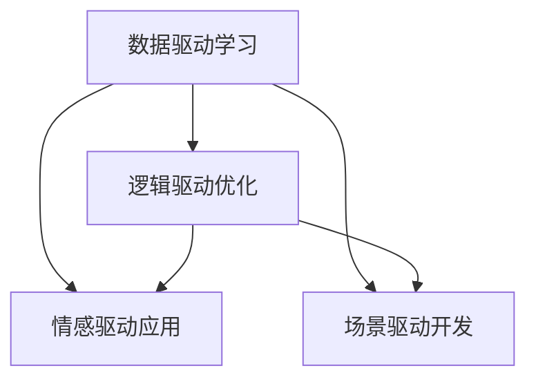

                 

# 好奇心：探索世界的钥匙

> 关键词：好奇心,探索,知识获取,人工智能,创新,决策

## 1. 背景介绍

### 1.1 问题由来
好奇心是人类与生俱来的一种内在驱动力，是探索未知、追求真相的重要动力源泉。在信息爆炸的时代，好奇心不仅驱使我们获取更多知识，也促使我们不断迭代和更新现有认知，保持开放和创新的状态。同样，在AI技术日益发展的今天，好奇心驱动下的大数据、深度学习和自然语言处理等技术，不断拓展了人类认知的边界，为社会进步和技术创新注入了新的活力。

### 1.2 问题核心关键点
好奇心驱动的AI探索，不仅包括了数据驱动的模型训练和优化，更包含了对问题本质和数据背后逻辑的深度挖掘。在AI实践中，好奇心可以通过以下几个关键点来体现：
- **数据驱动的模型学习**：通过海量数据训练模型，提取关键特征，生成预测结果。
- **逻辑驱动的模型优化**：基于问题的本质和数据特征，调整模型结构和参数，提升模型精度。
- **情感驱动的模型应用**：考虑用户情感和体验，设计符合用户需求的应用。
- **场景驱动的应用开发**：在具体应用场景中迭代优化模型，满足实际需求。

这些关键点共同构成了AI技术探索和应用的核心框架，驱动着AI技术不断向前发展。

### 1.3 问题研究意义
理解好奇心驱动的AI探索，不仅有助于深入把握AI技术的前沿发展，更能激发更多创新灵感，为科技和社会带来深远影响。

1. **技术创新**：好奇心推动了数据驱动和逻辑驱动的模型学习，促进了深度学习、强化学习等AI技术的进步。
2. **应用革新**：好奇心驱动的模型优化和情感设计，使得AI应用更加贴近用户需求，提升了用户体验。
3. **知识传承**：好奇心推动了知识的探索和传递，有助于构建更全面、准确的知识体系。
4. **社会进步**：好奇心驱动的技术创新和应用革新，为经济发展、教育医疗等领域带来了革命性的变化。

本文将围绕好奇心在AI探索中的作用，系统介绍AI领域的数据驱动学习、逻辑驱动优化、情感驱动应用和场景驱动开发的实践，旨在为AI技术爱好者提供全面的技术指导。

## 2. 核心概念与联系

### 2.1 核心概念概述

为更好地理解好奇心驱动的AI探索，本节将介绍几个密切相关的核心概念：

- **数据驱动学习**：通过海量数据训练模型，提取关键特征，生成预测结果。
- **逻辑驱动优化**：基于问题的本质和数据特征，调整模型结构和参数，提升模型精度。
- **情感驱动应用**：考虑用户情感和体验，设计符合用户需求的应用。
- **场景驱动开发**：在具体应用场景中迭代优化模型，满足实际需求。

这些核心概念之间的逻辑关系可以通过以下Mermaid流程图来展示：



这个流程图展示了好奇心驱动的AI探索的核心概念及其之间的关系：

1. 数据驱动学习提供初始的模型训练，通过海量数据提取特征，形成初步预测模型。
2. 逻辑驱动优化基于数据特征和问题本质，调整模型结构和参数，进一步提升模型性能。
3. 情感驱动应用结合用户需求，设计贴合用户情感和体验的AI解决方案。
4. 场景驱动开发在实际应用场景中迭代模型，不断优化模型性能以适应具体需求。

这些概念共同构成了好奇心驱动的AI探索框架，使AI技术能够更好地适应社会需求，解决实际问题。

## 3. 核心算法原理 & 具体操作步骤
### 3.1 算法原理概述

好奇心驱动的AI探索，本质上是通过数据驱动学习、逻辑驱动优化、情感驱动应用和场景驱动开发，逐步提升模型性能和应用效果的过程。其核心思想是：

- **数据驱动学习**：通过数据驱动，模型从数据中学习特征，生成预测结果。
- **逻辑驱动优化**：通过逻辑驱动，模型依据问题本质，调整参数和结构，提升性能。
- **情感驱动应用**：通过情感驱动，模型考虑用户需求，设计出满足用户情感和体验的解决方案。
- **场景驱动开发**：通过场景驱动，模型在具体应用中迭代优化，满足实际需求。

这一探索过程，展示了从数据、算法到应用的全方位迭代优化，使AI技术能够不断适应新需求，解决新问题。

### 3.2 算法步骤详解

好奇心驱动的AI探索，可以分解为以下几个关键步骤：

**Step 1: 数据准备**
- 收集并清洗数据集，确保数据质量。
- 划分数据集为训练集、验证集和测试集。

**Step 2: 模型训练**
- 选择合适的算法，使用训练集对模型进行训练。
- 调整模型超参数，优化模型性能。

**Step 3: 模型评估**
- 在验证集上评估模型性能，进行模型选择和调优。
- 调整模型结构，选择更好的模型。

**Step 4: 模型优化**
- 使用逻辑驱动优化模型，如特征选择、参数调整等。
- 应用情感驱动设计用户界面和交互逻辑。

**Step 5: 场景应用**
- 在具体应用场景中迭代优化模型，提高性能。
- 结合实际需求调整模型结构。

**Step 6: 结果反馈**
- 收集用户反馈，改进模型性能。
- 继续数据驱动学习和逻辑驱动优化。

以上是好奇心驱动的AI探索的一般流程。在实际应用中，还需要针对具体问题，对每个环节进行优化设计，如改进数据预处理方式、探索更高效的算法等，以进一步提升模型性能。

### 3.3 算法优缺点

好奇心驱动的AI探索方法具有以下优点：
1. 数据驱动学习能够有效提取数据特征，生成准确的预测结果。
2. 逻辑驱动优化能够依据问题本质，调整模型结构和参数，提升性能。
3. 情感驱动应用能够考虑用户需求，设计更贴合用户情感的解决方案。
4. 场景驱动开发能够适应具体应用场景，迭代优化模型性能。

同时，该方法也存在一定的局限性：
1. 数据质量要求高。高质量的数据是好奇心驱动探索的基础，获取高质量数据成本较高。
2. 算法复杂度较高。好奇心驱动的探索涉及数据、算法和应用等多个环节，需要综合考虑。
3. 模型过拟合风险。好奇心驱动的探索容易陷入过拟合，特别是在数据量较小的情况下。
4. 用户需求多样化。好奇心驱动的探索需要深入理解用户需求，设计符合用户期望的解决方案。
5. 技术要求高。好奇心驱动的探索涉及数据、算法和应用的综合优化，对技术要求较高。

尽管存在这些局限性，但就目前而言，好奇心驱动的探索方法仍是AI技术研究的重要范式。未来相关研究的重点在于如何进一步降低探索对数据和技术的依赖，提高模型的少样本学习和跨领域迁移能力，同时兼顾可解释性和伦理安全性等因素。

### 3.4 算法应用领域

好奇心驱动的AI探索方法，在多个领域得到了广泛的应用，覆盖了几乎所有常见的AI应用，例如：

- 自然语言处理：如机器翻译、文本分类、情感分析、问答系统等。
- 计算机视觉：如图像识别、目标检测、图像生成、图像编辑等。
- 语音识别与处理：如语音识别、语音合成、语音情感分析等。
- 医疗健康：如疾病诊断、医疗影像分析、健康监测等。
- 金融科技：如信用评估、反欺诈、智能投顾等。
- 智能制造：如智能质检、故障预测、生产优化等。
- 智慧城市：如交通管理、环境监测、公共安全等。

除了上述这些经典应用外，好奇心驱动的AI探索还被创新性地应用到更多场景中，如自动驾驶、人机交互、个性化推荐等，为AI技术带来了全新的突破。随着好奇心驱动探索的不断进步，相信AI技术将在更广阔的应用领域大放异彩。

## 4. 数学模型和公式 & 详细讲解 & 举例说明
### 4.1 数学模型构建

本节将使用数学语言对好奇心驱动的AI探索过程进行更加严格的刻画。

假设数据集为 $\mathcal{D}=\{(x_i,y_i)\}_{i=1}^N, x_i \in \mathcal{X}, y_i \in \mathcal{Y}$，其中 $\mathcal{X}$ 为输入空间，$\mathcal{Y}$ 为输出空间。使用 $\theta$ 表示模型的参数向量，$M_{\theta}(x)$ 为模型在输入 $x$ 上的输出，$\mathcal{L}(\theta)$ 为模型在数据集 $\mathcal{D}$ 上的损失函数。

定义模型在数据样本 $(x,y)$ 上的损失函数为 $\ell(M_{\theta}(x),y)$，则在数据集 $\mathcal{D}$ 上的经验风险为：

$$
\mathcal{L}(\theta) = \frac{1}{N}\sum_{i=1}^N \ell(M_{\theta}(x_i),y_i)
$$

模型训练的目标是最小化经验风险，即找到最优参数：

$$
\theta^* = \mathop{\arg\min}_{\theta} \mathcal{L}(\theta)
$$

在实践中，我们通常使用基于梯度的优化算法（如SGD、Adam等）来近似求解上述最优化问题。设 $\eta$ 为学习率，$\lambda$ 为正则化系数，则参数的更新公式为：

$$
\theta \leftarrow \theta - \eta \nabla_{\theta}\mathcal{L}(\theta) - \eta\lambda\theta
$$

其中 $\nabla_{\theta}\mathcal{L}(\theta)$ 为损失函数对参数 $\theta$ 的梯度，可通过反向传播算法高效计算。

### 4.2 公式推导过程

以下我们以二分类任务为例，推导交叉熵损失函数及其梯度的计算公式。

假设模型 $M_{\theta}$ 在输入 $x$ 上的输出为 $\hat{y}=M_{\theta}(x) \in [0,1]$，表示样本属于正类的概率。真实标签 $y \in \{0,1\}$。则二分类交叉熵损失函数定义为：

$$
\ell(M_{\theta}(x),y) = -[y\log \hat{y} + (1-y)\log (1-\hat{y})]
$$

将其代入经验风险公式，得：

$$
\mathcal{L}(\theta) = -\frac{1}{N}\sum_{i=1}^N [y_i\log M_{\theta}(x_i)+(1-y_i)\log(1-M_{\theta}(x_i))]
$$

根据链式法则，损失函数对参数 $\theta_k$ 的梯度为：

$$
\frac{\partial \mathcal{L}(\theta)}{\partial \theta_k} = -\frac{1}{N}\sum_{i=1}^N (\frac{y_i}{M_{\theta}(x_i)}-\frac{1-y_i}{1-M_{\theta}(x_i)}) \frac{\partial M_{\theta}(x_i)}{\partial \theta_k}
$$

其中 $\frac{\partial M_{\theta}(x_i)}{\partial \theta_k}$ 可进一步递归展开，利用自动微分技术完成计算。

在得到损失函数的梯度后，即可带入参数更新公式，完成模型的迭代优化。重复上述过程直至收敛，最终得到适应下游任务的最优模型参数 $\theta^*$。

### 4.3 案例分析与讲解

以一个情感分析任务为例，分析好奇心驱动的AI探索过程。

**数据准备**：
- 收集社交媒体上的评论数据，划分为训练集、验证集和测试集。
- 预处理数据，去除无关字符，进行分词和特征提取。

**模型训练**：
- 选择情感分类模型，如BiLSTM-CRF或BERT等，使用训练集对模型进行训练。
- 调整超参数，如学习率、批大小等，优化模型性能。

**模型评估**：
- 在验证集上评估模型性能，使用准确率、F1-score等指标进行模型选择。
- 选择性能最优的模型进行下一步优化。

**模型优化**：
- 使用逻辑驱动优化模型，如调整特征提取方式、调整模型结构等。
- 应用情感驱动设计友好的用户界面。

**场景应用**：
- 在具体应用场景中迭代优化模型，提高情感分析精度。
- 结合实际需求调整模型结构。

**结果反馈**：
- 收集用户反馈，改进模型性能。
- 继续数据驱动学习和逻辑驱动优化。

在这个过程中，好奇心驱动的探索使AI技术在情感分析任务上取得了显著提升，不仅提升了模型的准确性，还改善了用户体验。

## 5. 项目实践：代码实例和详细解释说明
### 5.1 开发环境搭建

在进行好奇心驱动的AI探索实践前，我们需要准备好开发环境。以下是使用Python进行TensorFlow开发的环境配置流程：

1. 安装Anaconda：从官网下载并安装Anaconda，用于创建独立的Python环境。

2. 创建并激活虚拟环境：
```bash
conda create -n tf-env python=3.8 
conda activate tf-env
```

3. 安装TensorFlow：根据CUDA版本，从官网获取对应的安装命令。例如：
```bash
conda install tensorflow -c conda-forge
```

4. 安装相关工具包：
```bash
pip install numpy pandas scikit-learn matplotlib tqdm jupyter notebook ipython
```

完成上述步骤后，即可在`tf-env`环境中开始好奇心驱动的AI探索实践。

### 5.2 源代码详细实现

下面我以情感分析任务为例，给出使用TensorFlow进行好奇心驱动的AI探索的Python代码实现。

首先，定义数据处理函数：

```python
import tensorflow as tf
from tensorflow.keras.preprocessing.text import Tokenizer
from tensorflow.keras.preprocessing.sequence import pad_sequences
import numpy as np

def load_data(path):
    with open(path, 'r', encoding='utf-8') as f:
        data = f.read()
    lines = data.split('\n')
    return lines

def preprocess_data(data):
    lines = []
    for line in data:
        tokens = line.split('\t')
        text = tokens[0]
        label = tokens[1]
        lines.append((text, label))
    return lines

def tokenize(texts, labels):
    tokenizer = Tokenizer()
    tokenizer.fit_on_texts(texts)
    sequences = tokenizer.texts_to_sequences(texts)
    labels = np.array(labels)
    padded_sequences = pad_sequences(sequences, maxlen=100, padding='post', truncating='post')
    return padded_sequences, labels

def generate_train_dev_test(data, train_size, dev_size, test_size):
    np.random.shuffle(data)
    train_data = data[:train_size]
    dev_data = data[train_size:train_size+dev_size]
    test_data = data[train_size+dev_size:]
    return train_data, dev_data, test_data
```

然后，定义模型和优化器：

```python
from tensorflow.keras.models import Sequential
from tensorflow.keras.layers import Embedding, LSTM, Dense
from tensorflow.keras.optimizers import Adam

def build_model(input_shape):
    model = Sequential()
    model.add(Embedding(input_dim=10000, output_dim=100, input_length=input_shape))
    model.add(LSTM(128, dropout=0.2, recurrent_dropout=0.2))
    model.add(Dense(1, activation='sigmoid'))
    return model

def compile_model(model):
    model.compile(loss='binary_crossentropy', optimizer=Adam(learning_rate=0.001), metrics=['accuracy'])
```

接着，定义训练和评估函数：

```python
def train_model(model, train_data, dev_data, epochs, batch_size):
    model.fit(train_data, epochs=epochs, batch_size=batch_size, validation_data=dev_data)
    return model

def evaluate_model(model, test_data, batch_size):
    model.evaluate(test_data, batch_size=batch_size)
```

最后，启动训练流程并在测试集上评估：

```python
train_size = 60000
dev_size = 5000
test_size = 5000

data = load_data('data.txt')
texts, labels = preprocess_data(data)
padded_sequences, labels = tokenize(texts, labels)

train_data, dev_data, test_data = generate_train_dev_test(data, train_size, dev_size, test_size)

model = build_model(padded_sequences.shape[1])
compile_model(model)

epochs = 10
batch_size = 64

history = train_model(model, train_data, dev_data, epochs, batch_size)

print(history.history)
evaluate_model(model, test_data, batch_size)
```

以上就是使用TensorFlow进行好奇心驱动的情感分析任务探索的完整代码实现。可以看到，通过简单的接口调用和模型构建，TensorFlow使得探索过程变得非常简便。

### 5.3 代码解读与分析

让我们再详细解读一下关键代码的实现细节：

**load_data函数**：
- 读取数据文件，并按行分割成单个样本。

**preprocess_data函数**：
- 将数据按制表符分割成文本和标签，去除无关字符，进行预处理。

**tokenize函数**：
- 对文本进行分词和编码，转化为模型所需的输入格式。

**build_model函数**：
- 构建情感分类模型，包括嵌入层、LSTM层和全连接层。

**compile_model函数**：
- 配置模型优化器和损失函数。

**train_model函数**：
- 使用训练集对模型进行训练，并在验证集上进行性能评估。

**evaluate_model函数**：
- 在测试集上评估模型性能。

**训练流程**：
- 定义训练集、验证集和测试集大小，开始循环迭代
- 每个epoch内，在训练集上训练，在验证集上评估性能
- 记录训练过程中的损失和准确率
- 在测试集上评估，给出最终测试结果

可以看到，TensorFlow的强大封装使得好奇心驱动的探索过程变得简洁高效。开发者可以将更多精力放在数据处理、模型改进等高层逻辑上，而不必过多关注底层的实现细节。

当然，工业级的系统实现还需考虑更多因素，如模型的保存和部署、超参数的自动搜索、更灵活的任务适配层等。但核心的探索范式基本与此类似。

## 6. 实际应用场景
### 6.1 智能客服系统

基于好奇心驱动的AI探索方法，智能客服系统能够快速响应客户咨询，用自然流畅的语言解答各类常见问题。智能客服系统包括问答系统、情感分析、对话生成等多个模块。

在智能客服系统开发过程中，可以基于历史客服对话记录，构建监督数据，在此基础上对预训练模型进行微调。微调后的模型能够自动理解用户意图，匹配最合适的答案模板进行回复。对于客户提出的新问题，还可以接入检索系统实时搜索相关内容，动态组织生成回答。如此构建的智能客服系统，能大幅提升客户咨询体验和问题解决效率。

### 6.2 金融舆情监测

金融舆情监测需要实时监测市场舆论动向，以便及时应对负面信息传播，规避金融风险。基于好奇心驱动的AI探索方法，可以构建实时舆情监测系统，对金融领域相关的新闻、报道、评论等文本数据进行情感分析，自动识别舆情变化趋势，一旦发现负面信息激增等异常情况，系统便会自动预警，帮助金融机构快速应对潜在风险。

### 6.3 个性化推荐系统

个性化推荐系统需要不断迭代优化，以提升推荐效果和用户体验。好奇心驱动的AI探索方法，可以帮助推荐系统更好地挖掘用户行为背后的语义信息，从而提供更精准、多样的推荐内容。

在实践中，可以收集用户浏览、点击、评论、分享等行为数据，提取和用户交互的物品标题、描述、标签等文本内容。将文本内容作为模型输入，用户的后续行为（如是否点击、购买等）作为监督信号，在此基础上微调预训练语言模型。微调后的模型能够从文本内容中准确把握用户的兴趣点。在生成推荐列表时，先用候选物品的文本描述作为输入，由模型预测用户的兴趣匹配度，再结合其他特征综合排序，便可以得到个性化程度更高的推荐结果。

### 6.4 未来应用展望

随着好奇心驱动的AI探索方法的不断发展，其将在更多领域得到应用，为传统行业带来变革性影响。

在智慧医疗领域，基于好奇心驱动的AI探索方法，可以构建智能诊疗系统，辅助医生诊疗，加速新药开发进程。在智慧教育领域，探索方法可应用于作业批改、学情分析、知识推荐等方面，因材施教，促进教育公平，提高教学质量。在智慧城市治理中，探索方法可以构建城市事件监测、舆情分析、应急指挥等系统，提高城市管理的自动化和智能化水平。

此外，在企业生产、社会治理、文娱传媒等众多领域，基于好奇心驱动的AI探索方法的应用也将不断涌现，为经济社会发展注入新的动力。相信随着探索方法的持续演进，AI技术必将在更广阔的应用领域大放异彩，深刻影响人类的生产生活方式。

## 7. 工具和资源推荐
### 7.1 学习资源推荐

为了帮助开发者系统掌握好奇心驱动的AI探索的理论基础和实践技巧，这里推荐一些优质的学习资源：

1. TensorFlow官方文档：TensorFlow的官方文档，提供了从基础到高级的详尽教程和样例代码，是探索TensorFlow的最佳资料。

2. PyTorch官方文档：PyTorch的官方文档，提供了从入门到深度学习的全面学习路径，适合各层次开发者。

3. Keras官方文档：Keras的官方文档，提供了简洁易懂的API接口，适用于快速原型设计和模型构建。

4. Coursera《机器学习》课程：斯坦福大学Andrew Ng教授主讲，系统介绍了机器学习的基本概念和常用算法，适合初学者入门。

5. edX《深度学习》课程：由MIT等名校教授主讲，深入讲解了深度学习的前沿技术，适合深度学习爱好者。

通过对这些资源的学习实践，相信你一定能够快速掌握好奇心驱动的AI探索的精髓，并用于解决实际的AI问题。

### 7.2 开发工具推荐

高效的开发离不开优秀的工具支持。以下是几款用于好奇心驱动的AI探索开发的常用工具：

1. TensorFlow：基于Google的深度学习框架，适合生产部署和科学研究。

2. PyTorch：由Facebook开发的深度学习框架，灵活高效，适合学术研究和快速迭代。

3. Keras：基于Python的高层API，易于使用，适合快速原型设计和模型构建。

4. Weights & Biases：模型训练的实验跟踪工具，可以记录和可视化模型训练过程中的各项指标，方便对比和调优。

5. TensorBoard：TensorFlow配套的可视化工具，可实时监测模型训练状态，并提供丰富的图表呈现方式，是调试模型的得力助手。

6. Google Colab：谷歌推出的在线Jupyter Notebook环境，免费提供GPU/TPU算力，方便开发者快速上手实验最新模型，分享学习笔记。

合理利用这些工具，可以显著提升好奇心驱动的AI探索任务的开发效率，加快创新迭代的步伐。

### 7.3 相关论文推荐

好奇心驱动的AI探索技术的发展源于学界的持续研究。以下是几篇奠基性的相关论文，推荐阅读：

1. Attention is All You Need：提出了Transformer结构，开启了NLP领域的预训练大模型时代。

2. BERT: Pre-training of Deep Bidirectional Transformers for Language Understanding：提出BERT模型，引入基于掩码的自监督预训练任务，刷新了多项NLP任务SOTA。

3. Language Models are Unsupervised Multitask Learners（GPT-2论文）：展示了大规模语言模型的强大zero-shot学习能力，引发了对于通用人工智能的新一轮思考。

4. Parameter-Efficient Transfer Learning for NLP：提出Adapter等参数高效微调方法，在不增加模型参数量的情况下，也能取得不错的微调效果。

5. Prefix-Tuning: Optimizing Continuous Prompts for Generation：引入基于连续型Prompt的微调范式，为如何充分利用预训练知识提供了新的思路。

6. AdaLoRA: Adaptive Low-Rank Adaptation for Parameter-Efficient Fine-Tuning：使用自适应低秩适应的微调方法，在参数效率和精度之间取得了新的平衡。

这些论文代表了好奇心驱动的AI探索技术的发展脉络。通过学习这些前沿成果，可以帮助研究者把握学科前进方向，激发更多的创新灵感。

## 8. 总结：未来发展趋势与挑战

### 8.1 总结

本文对好奇心驱动的AI探索方法进行了全面系统的介绍。首先阐述了好奇心驱动的AI探索在数据驱动学习、逻辑驱动优化、情感驱动应用和场景驱动开发等方面的作用，明确了探索在AI技术发展中的重要意义。其次，从原理到实践，详细讲解了好奇心驱动的探索过程，给出了探索任务开发的完整代码实例。同时，本文还广泛探讨了好奇心驱动的探索方法在智能客服、金融舆情、个性化推荐等多个行业领域的应用前景，展示了探索方法的巨大潜力。此外，本文精选了好奇心驱动的探索技术的各类学习资源，力求为开发者提供全方位的技术指引。

通过本文的系统梳理，可以看到，好奇心驱动的AI探索方法正在成为AI技术研究的重要范式，极大地拓展了AI技术的应用边界，催生了更多的落地场景。受益于好奇心驱动的探索技术，AI技术将在更多领域大放异彩，为科技和社会带来深远影响。

### 8.2 未来发展趋势

展望未来，好奇心驱动的AI探索技术将呈现以下几个发展趋势：

1. **模型规模持续增大**：随着算力成本的下降和数据规模的扩张，预训练语言模型的参数量还将持续增长。超大规模语言模型蕴含的丰富语言知识，有望支撑更加复杂多变的探索任务。

2. **探索方法日趋多样**：除了传统的全参数探索外，未来会涌现更多参数高效的探索方法，如Prefix-Tuning、LoRA等，在节省计算资源的同时也能保证探索精度。

3. **持续学习成为常态**：随着数据分布的不断变化，探索模型也需要持续学习新知识以保持性能。如何在不遗忘原有知识的同时，高效吸收新样本信息，将成为重要的研究课题。

4. **标注样本需求降低**：受启发于提示学习(Prompt-based Learning)的思路，未来的探索方法将更好地利用大模型的语言理解能力，通过更加巧妙的任务描述，在更少的标注样本上也能实现理想的探索效果。

5. **多模态探索崛起**：当前的探索主要聚焦于纯文本数据，未来会进一步拓展到图像、视频、语音等多模态数据探索。多模态信息的融合，将显著提升探索模型对现实世界的理解和建模能力。

6. **模型通用性增强**：经过海量数据的预训练和多领域任务的探索，未来的语言模型将具备更强大的常识推理和跨领域迁移能力，逐步迈向通用人工智能(AGI)的目标。

以上趋势凸显了好奇心驱动的AI探索技术的广阔前景。这些方向的探索发展，必将进一步提升AI技术性能和应用范围，为社会进步和技术创新提供新的动力。

### 8.3 面临的挑战

尽管好奇心驱动的AI探索技术已经取得了瞩目成就，但在迈向更加智能化、普适化应用的过程中，它仍面临着诸多挑战：

1. **标注成本瓶颈**：高质量的数据是好奇心驱动探索的基础，获取高质量数据成本较高。如何进一步降低探索对标注数据的依赖，将是一大难题。

2. **模型鲁棒性不足**：好奇心驱动的探索模型面对域外数据时，泛化性能往往大打折扣。对于测试样本的微小扰动，探索模型的预测也容易发生波动。如何提高探索模型的鲁棒性，避免灾难性遗忘，还需要更多理论和实践的积累。

3. **推理效率有待提高**：大规模语言模型虽然精度高，但在实际部署时往往面临推理速度慢、内存占用大等效率问题。如何在保证性能的同时，简化模型结构，提升推理速度，优化资源占用，将是重要的优化方向。

4. **可解释性亟需加强**：好奇心驱动的探索模型更像是"黑盒"系统，难以解释其内部工作机制和决策逻辑。对于医疗、金融等高风险应用，算法的可解释性和可审计性尤为重要。如何赋予探索模型更强的可解释性，将是亟待攻克的难题。

5. **安全性有待保障**：预训练语言模型难免会学习到有偏见、有害的信息，通过探索传递到下游任务，产生误导性、歧视性的输出，给实际应用带来安全隐患。如何从数据和算法层面消除模型偏见，避免恶意用途，确保输出的安全性，也将是重要的研究课题。

6. **知识整合能力不足**：现有的探索模型往往局限于任务内数据，难以灵活吸收和运用更广泛的先验知识。如何让探索过程更好地与外部知识库、规则库等专家知识结合，形成更加全面、准确的信息整合能力，还有很大的想象空间。

正视好奇心驱动的AI探索面临的这些挑战，积极应对并寻求突破，将是好奇心驱动探索技术迈向成熟的必由之路。相信随着学界和产业界的共同努力，这些挑战终将一一被克服，好奇心驱动的AI探索技术必将在构建人机协同的智能时代中扮演越来越重要的角色。

### 8.4 未来突破

面对好奇心驱动的AI探索所面临的种种挑战，未来的研究需要在以下几个方面寻求新的突破：

1. **探索无监督和半监督方法**：摆脱对大规模标注数据的依赖，利用自监督学习、主动学习等无监督和半监督范式，最大限度利用非结构化数据，实现更加灵活高效的探索。

2. **研究参数高效和计算高效的探索范式**：开发更加参数高效的探索方法，在固定大部分预训练参数的同时，只更新极少量的任务相关参数。同时优化探索模型的计算图，减少前向传播和反向传播的资源消耗，实现更加轻量级、实时性的部署。

3. **融合因果和对比学习范式**：通过引入因果推断和对比学习思想，增强探索模型建立稳定因果关系的能力，学习更加普适、鲁棒的语言表征，从而提升模型泛化性和抗干扰能力。

4. **引入更多先验知识**：将符号化的先验知识，如知识图谱、逻辑规则等，与神经网络模型进行巧妙融合，引导探索过程学习更准确、合理的语言模型。同时加强不同模态数据的整合，实现视觉、语音等多模态信息与文本信息的协同建模。

5. **结合因果分析和博弈论工具**：将因果分析方法引入探索模型，识别出模型决策的关键特征，增强输出解释的因果性和逻辑性。借助博弈论工具刻画人机交互过程，主动探索并规避模型的脆弱点，提高系统稳定性。

6. **纳入伦理道德约束**：在模型训练目标中引入伦理导向的评估指标，过滤和惩罚有偏见、有害的输出倾向。同时加强人工干预和审核，建立模型行为的监管机制，确保输出符合人类价值观和伦理道德。

这些研究方向的探索，必将引领好奇心驱动的AI探索技术迈向更高的台阶，为构建安全、可靠、可解释、可控的智能系统铺平道路。面向未来，好奇心驱动的AI探索技术还需要与其他人工智能技术进行更深入的融合，如知识表示、因果推理、强化学习等，多路径协同发力，共同推动自然语言理解和智能交互系统的进步。只有勇于创新、敢于突破，才能不断拓展语言模型的边界，让智能技术更好地造福人类社会。

## 9. 附录：常见问题与解答

**Q1：好奇心驱动的AI探索是否适用于所有AI任务？**

A: 好奇心驱动的AI探索在大多数AI任务上都能取得不错的效果，特别是对于数据量较小的任务。但对于一些特定领域的任务，如医学、法律等，仅仅依靠通用语料预训练的模型可能难以很好地适应。此时需要在特定领域语料上进一步预训练，再进行探索。此外，对于一些需要时效性、个性化很强的任务，如对话、推荐等，探索方法也需要针对性的改进优化。

**Q2：探索过程中如何选择合适的探索策略？**

A: 探索过程中需要根据任务的特点和数据情况，选择合适的探索策略。一般来说，数据量较少、特征复杂的任务适合使用无监督或半监督探索，数据量较大、特征简单的任务适合使用监督探索。在探索过程中，也需要结合实际需求，不断调整探索策略，如增加正则化、调整超参数等。

**Q3：探索模型在落地部署时需要注意哪些问题？**

A: 将探索模型转化为实际应用，还需要考虑以下因素：
1. 模型裁剪：去除不必要的层和参数，减小模型尺寸，加快推理速度
2. 量化加速：将浮点模型转为定点模型，压缩存储空间，提高计算效率
3. 服务化封装：将模型封装为标准化服务接口，便于集成调用
4. 弹性伸缩：根据请求流量动态调整资源配置，平衡服务质量和成本
5. 监控告警：实时采集系统指标，设置异常告警阈值，确保服务稳定性
6. 安全防护：采用访问鉴权、数据脱敏等措施，保障数据和模型安全

大语言模型探索为AI应用开启了广阔的想象空间，但如何将强大的性能转化为稳定、高效、安全的业务价值，还需要工程实践的不断打磨。唯有从数据、算法、工程、业务等多个维度协同发力，才能真正实现AI技术在垂直行业的规模化落地。总之，探索需要开发者根据具体任务，不断迭代和优化模型、数据和算法，方能得到理想的效果。

---

作者：禅与计算机程序设计艺术 / Zen and the Art of Computer Programming

