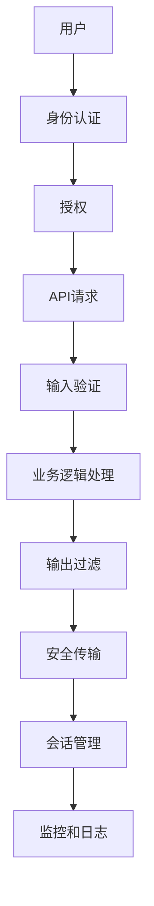

                 

# 如何设计安全可靠的 API？

在当今互联网时代，API（Application Programming Interface）成为了连接不同系统和应用的桥梁。无论是传统的企业内部应用，还是现代的云服务提供商，API无处不在。如何设计出安全可靠的API，成为了每个开发者和架构师必须面对的重要课题。本文将从设计理念、技术实现、应用场景和未来趋势等多个角度，深入探讨如何构建安全可靠的API。

## 1. 背景介绍

### 1.1 问题由来

随着互联网和云计算的发展，API已经成为现代应用程序不可或缺的一部分。然而，API的广泛使用也带来了很多安全问题。例如：

- **SQL注入攻击**：攻击者通过在API请求中注入恶意的SQL代码，来非法访问或修改数据库。
- **跨站脚本攻击(XSS)**：攻击者通过API返回的HTML页面，注入恶意的脚本代码，实现对用户数据的窃取和篡改。
- **跨站请求伪造(CSRF)**：攻击者通过伪造用户请求，在用户不知情的情况下执行恶意操作。
- **权限滥用**：攻击者通过窃取或伪造用户身份，获取不属于自己的权限，进行非法操作。

这些问题不仅会影响API的使用安全性，还可能导致严重的数据泄露和业务中断。因此，如何设计安全可靠的API，成为了一个迫切需要解决的问题。

### 1.2 问题核心关键点

设计安全可靠的API，需要从多个维度进行全面考虑。以下是其中几个关键点：

- **身份认证和授权**：确保只有经过验证和授权的用户才能访问API。
- **数据加密和传输安全**：确保数据在传输过程中不被窃取或篡改。
- **输入验证和输出过滤**：防止恶意的输入数据和输出结果对系统造成危害。
- **日志记录和监控**：及时发现和响应API的安全问题。

这些问题往往相互关联，需要在API设计过程中进行综合考虑和部署。

## 2. 核心概念与联系

### 2.1 核心概念概述

为了更好地理解如何设计安全可靠的API，本节将介绍几个密切相关的核心概念：

- **身份认证（Authentication）**：验证用户身份的过程，通常使用用户名和密码、令牌、证书等方式。
- **授权（Authorization）**：在身份认证通过后，根据用户角色和权限，限制其对API资源的访问。
- **输入验证（Input Validation）**：对用户输入的数据进行检查和过滤，防止恶意数据注入。
- **输出过滤（Output Filtering）**：对API返回的数据进行过滤，防止敏感信息泄露。
- **安全传输协议（Secure Transport）**：使用HTTPS等安全协议，确保数据在传输过程中的机密性和完整性。
- **会话管理（Session Management）**：管理用户的会话状态，确保会话的安全性。
- **API网关（API Gateway）**：作为API的前端代理，提供负载均衡、限流、缓存等功能。
- **监控和日志（Monitoring and Logging）**：实时监控API的访问行为和异常事件，记录日志以供分析和审计。

这些概念之间存在紧密的联系，共同构成了API安全体系的基础。

### 2.2 核心概念原理和架构的 Mermaid 流程图



这个流程图展示了API设计的核心流程：

1. 用户发起API请求。
2. 经过身份认证和授权，确定用户是否有权限访问API。
3. 对用户输入的数据进行验证。
4. 进行业务逻辑处理。
5. 对API返回的数据进行过滤。
6. 使用安全传输协议，确保数据安全。
7. 管理用户的会话状态。
8. 实时监控和记录API的访问行为。

## 3. 核心算法原理 & 具体操作步骤

### 3.1 算法原理概述

设计安全可靠的API，本质上是一个多层级的安全防护过程。其核心思想是通过多种手段，构建一套完整的安全防护体系，确保API的安全性。

形式化地，我们可以将API的安全设计分为以下几个步骤：

1. **身份认证（Authentication）**：验证用户的身份，确保只有合法用户才能访问API。
2. **授权（Authorization）**：根据用户身份，限制其对API资源的访问权限。
3. **输入验证（Input Validation）**：对用户输入的数据进行检查和过滤，防止恶意注入。
4. **业务逻辑处理（Business Logic）**：执行API请求的业务逻辑，生成响应数据。
5. **输出过滤（Output Filtering）**：对响应数据进行过滤，防止敏感信息泄露。
6. **安全传输（Secure Transport）**：使用安全协议，确保数据在传输过程中的机密性和完整性。
7. **会话管理（Session Management）**：管理用户的会话状态，确保会话安全性。
8. **监控和日志（Monitoring and Logging）**：实时监控API访问行为，记录日志以供分析和审计。

### 3.2 算法步骤详解

**Step 1: 身份认证（Authentication）**

身份认证是API安全的基础，通过验证用户身份，确保只有合法用户才能访问API。常见的身份认证方式包括：

- **用户名和密码**：用户输入用户名和密码，服务器进行验证。
- **令牌（Token）**：服务器生成一个令牌，用户每次访问API时都需要携带该令牌。
- **证书（Certificate）**：通过数字证书进行身份验证。

在实现身份认证时，需要注意以下几点：

- **密码加密**：密码在传输和存储过程中必须进行加密，防止被窃取。
- **令牌过期和续期**：令牌设置有效期，并支持续期，防止令牌被重复使用。
- **证书管理**：使用安全的证书管理方式，防止证书泄露。

**Step 2: 授权（Authorization）**

授权是在身份认证通过后，根据用户角色和权限，限制其对API资源的访问。常见的授权方式包括：

- **基于角色的访问控制（RBAC）**：根据用户的角色，分配相应的权限。
- **基于属性的访问控制（ABAC）**：根据用户属性，动态调整权限。

在实现授权时，需要注意以下几点：

- **权限最小化**：只授权必要的权限，减少潜在的风险。
- **动态权限管理**：根据用户行为和状态，动态调整权限。
- **权限审计**：记录和审计用户权限的使用情况，防止权限滥用。

**Step 3: 输入验证（Input Validation）**

输入验证是对用户输入的数据进行检查和过滤，防止恶意注入。常见的输入验证方式包括：

- **格式验证**：检查数据格式是否符合预期。
- **长度限制**：限制输入数据的长度，防止缓冲区溢出等攻击。
- **正则表达式**：使用正则表达式对输入数据进行过滤和验证。

在实现输入验证时，需要注意以下几点：

- **边界检查**：检查输入数据的边界，防止越界访问。
- **异常处理**：对非法输入数据进行异常处理，防止系统崩溃。
- **动态验证**：根据业务逻辑动态调整验证规则。

**Step 4: 业务逻辑处理（Business Logic）**

业务逻辑处理是API的核心功能，执行实际的业务操作。在实现业务逻辑时，需要注意以下几点：

- **数据一致性**：确保数据的一致性和完整性，防止数据损坏。
- **业务规则**：根据业务规则，处理输入数据和生成响应数据。
- **数据隔离**：对敏感数据进行隔离，防止数据泄露。

**Step 5: 输出过滤（Output Filtering）**

输出过滤是对API返回的数据进行过滤，防止敏感信息泄露。常见的输出过滤方式包括：

- **数据脱敏**：对敏感信息进行脱敏处理。
- **内容审查**：对输出内容进行审查，防止有害信息传播。
- **权限检查**：根据用户权限，过滤敏感信息。

在实现输出过滤时，需要注意以下几点：

- **敏感信息识别**：识别敏感信息，进行过滤或脱敏。
- **过滤规则**：根据业务规则和政策，设置过滤规则。
- **日志记录**：记录敏感信息的过滤情况，方便审计和监控。

**Step 6: 安全传输（Secure Transport）**

安全传输协议是确保数据在传输过程中的机密性和完整性的重要手段。常见的安全传输协议包括：

- **HTTPS**：使用SSL/TLS协议，确保数据加密和传输安全。
- **VPN**：使用虚拟专用网络，确保数据在网络传输过程中的安全性。
- **IPSec**：使用IPSec协议，确保数据在网络传输过程中的安全性。

在实现安全传输时，需要注意以下几点：

- **证书管理**：使用安全的证书管理方式，防止证书泄露。
- **密钥管理**：使用安全的密钥管理方式，防止密钥泄露。
- **加密算法**：选择合适的加密算法，确保数据加密强度。

**Step 7: 会话管理（Session Management）**

会话管理是管理用户的会话状态，确保会话安全性。常见的会话管理方式包括：

- **Cookie**：使用HTTP Cookie进行会话管理。
- **Token**：使用令牌进行会话管理。
- **Session**：使用服务器端的会话管理方式。

在实现会话管理时，需要注意以下几点：

- **会话过期**：设置会话有效期，防止会话劫持。
- **会话固定**：避免会话固定攻击，防止会话劫持。
- **会话跟踪**：记录和审计会话状态，方便异常处理。

**Step 8: 监控和日志（Monitoring and Logging）**

监控和日志是实时监控API的访问行为和异常事件，记录日志以供分析和审计。常见的监控和日志方式包括：

- **日志记录**：记录API的访问行为和异常事件。
- **异常处理**：对异常事件进行处理，防止系统崩溃。
- **报警机制**：设置报警机制，及时发现和响应异常事件。

在实现监控和日志时，需要注意以下几点：

- **日志格式**：使用标准的日志格式，方便分析和审计。
- **日志存储**：使用可靠的日志存储方式，防止日志丢失。
- **日志分析**：使用数据分析工具，对日志进行分析和审计。

### 3.3 算法优缺点

设计安全可靠的API，需要综合考虑多种因素，其优缺点如下：

**优点**：

- **全面防护**：通过多种手段构建完整的安全防护体系，确保API的安全性。
- **灵活性高**：可以根据业务需求，灵活调整安全策略。
- **可扩展性**：可以适应不同规模和类型的API，支持多种应用场景。

**缺点**：

- **复杂性高**：需要综合考虑多种因素，设计复杂的安全策略。
- **开发成本高**：需要投入大量时间和资源进行设计和实现。
- **维护困难**：安全策略需要定期更新和维护，防止新的安全漏洞出现。

尽管存在这些缺点，但通过合理的架构设计和实现，设计安全可靠的API是完全可行的。

### 3.4 算法应用领域

设计安全可靠的API，已经被广泛应用于各个领域，例如：

- **企业内部应用**：企业的内部API需要保证数据安全和权限控制，防止内部信息泄露和权限滥用。
- **云服务提供商**：云服务提供商需要保证API的安全性，防止恶意用户对云服务进行攻击。
- **金融领域**：金融领域的API需要保证数据的机密性和完整性，防止金融欺诈和数据泄露。
- **医疗领域**：医疗领域的API需要保证数据的安全性和隐私性，防止医疗数据泄露。
- **政府服务**：政府服务的API需要保证数据的安全性和合法性，防止滥用和非法访问。

这些领域的应用场景，都需要设计安全可靠的API，以确保数据的机密性和完整性，防止安全漏洞。

## 4. 数学模型和公式 & 详细讲解

### 4.1 数学模型构建

为了更好地理解设计安全可靠的API，我们将从数学模型的角度进行详细讲解。

假设API的输入数据为 $x$，输出数据为 $y$，身份认证结果为 $A$，授权结果为 $P$，输入验证结果为 $V$，业务逻辑处理结果为 $L$，输出过滤结果为 $F$，安全传输结果为 $T$，会话管理结果为 $S$，监控和日志结果为 $L$。则API的安全模型可以表示为：

$$
y = A \cdot P \cdot V \cdot L \cdot F \cdot T \cdot S \cdot L
$$

其中 $A$ 为身份认证结果，$P$ 为授权结果，$V$ 为输入验证结果，$L$ 为业务逻辑处理结果，$F$ 为输出过滤结果，$T$ 为安全传输结果，$S$ 为会话管理结果，$L$ 为监控和日志结果。

### 4.2 公式推导过程

通过上述公式，我们可以看到，设计安全可靠的API，需要从多个维度进行综合考虑。下面以一个简单的例子，推导API的安全模型：

假设API的输入数据为 $x$，输出数据为 $y$，用户输入的令牌为 $T$，服务器生成的令牌为 $t$。则API的授权结果 $P$ 可以表示为：

$$
P = \begin{cases}
1, & \text{if } T = t \\
0, & \text{otherwise}
\end{cases}
$$

其中 $T$ 为用户输入的令牌，$t$ 为服务器生成的令牌。

进一步地，假设API的业务逻辑处理结果为 $L$，输出过滤结果为 $F$。则API的最终输出数据 $y$ 可以表示为：

$$
y = P \cdot V \cdot L \cdot F
$$

其中 $V$ 为输入验证结果，$L$ 为业务逻辑处理结果，$F$ 为输出过滤结果。

### 4.3 案例分析与讲解

为了更好地理解上述公式的应用，我们可以分析一个具体的案例。假设我们设计一个银行转账API，其输入数据为转账金额 $x$，输出数据为转账结果 $y$。则API的授权结果 $P$ 可以表示为：

$$
P = \begin{cases}
1, & \text{if user is authorized} \\
0, & \text{otherwise}
\end{cases}
$$

其中用户需要通过身份认证和授权，才能使用该API。

假设API的输入验证结果为 $V$，业务逻辑处理结果为 $L$，输出过滤结果为 $F$。则API的最终输出数据 $y$ 可以表示为：

$$
y = P \cdot V \cdot L \cdot F
$$

其中 $V$ 为输入验证结果，$L$ 为业务逻辑处理结果，$F$ 为输出过滤结果。例如，输入验证可以检查转账金额是否合法，业务逻辑处理可以检查账户余额是否充足，输出过滤可以脱敏账户信息，防止敏感信息泄露。

## 5. 项目实践：代码实例和详细解释说明

### 5.1 开发环境搭建

在进行API开发前，我们需要准备好开发环境。以下是使用Python进行Flask开发的环境配置流程：

1. 安装Anaconda：从官网下载并安装Anaconda，用于创建独立的Python环境。

2. 创建并激活虚拟环境：
```bash
conda create -n flask-env python=3.8 
conda activate flask-env
```

3. 安装Flask：
```bash
pip install Flask
```

4. 安装WSGI工具：
```bash
pip install gunicorn
```

5. 安装其他工具包：
```bash
pip install SQLAlchemy numpy pandas scikit-learn matplotlib tqdm jupyter notebook ipython
```

完成上述步骤后，即可在`flask-env`环境中开始API开发。

### 5.2 源代码详细实现

下面是使用Flask框架实现一个简单API的代码示例：

```python
from flask import Flask, request, jsonify

app = Flask(__name__)

# 身份认证
def authenticate(username, password):
    # 根据用户名和密码进行验证
    # 返回验证结果
    return True

# 授权
def authorize(username):
    # 根据用户角色和权限，限制其对API资源的访问
    # 返回授权结果
    return True

# 输入验证
def validate_input(input_data):
    # 对用户输入的数据进行检查和过滤
    # 返回验证结果
    return True

# 业务逻辑处理
def process_data(input_data):
    # 执行实际的业务操作
    # 返回处理结果
    return 200

# 输出过滤
def filter_output(data):
    # 对API返回的数据进行过滤
    # 返回过滤结果
    return data

# 安全传输
def secure传输(data):
    # 使用安全协议，确保数据在传输过程中的机密性和完整性
    # 返回传输结果
    return data

# 会话管理
def manage_session(username):
    # 管理用户的会话状态
    # 返回会话状态
    return True

# 监控和日志
def log_event(event):
    # 记录API的访问行为和异常事件
    # 返回日志记录结果
    return True

# 处理API请求
@app.route('/api', methods=['POST'])
def handle_api():
    # 获取请求参数
    input_data = request.get_json()

    # 身份认证
    auth_result = authenticate(input_data['username'], input_data['password'])

    # 授权
    authz_result = authorize(input_data['username'])

    # 输入验证
    input_valid_result = validate_input(input_data)

    # 业务逻辑处理
    process_result = process_data(input_data)

    # 输出过滤
    output_filter_result = filter_output(process_result)

    # 安全传输
    secure_result = secure传输(output_filter_result)

    # 会话管理
    session_result = manage_session(input_data['username'])

    # 监控和日志
    log_result = log_event(input_data)

    # 返回结果
    return jsonify(auth_result, authz_result, input_valid_result, process_result, output_filter_result, secure_result, session_result, log_result)

if __name__ == '__main__':
    app.run(debug=True)
```

可以看到，使用Flask框架实现API非常简单，只需要定义各个模块的函数，并在Flask应用中组合使用即可。

### 5.3 代码解读与分析

让我们再详细解读一下关键代码的实现细节：

**Flask应用初始化**：
- `Flask(__name__)`：创建Flask应用实例。

**路由定义**：
- `@app.route('/api', methods=['POST'])`：定义路由和HTTP方法。

**API请求处理**：
- `handle_api()`函数：处理API请求，包含多个模块的函数调用。

**身份认证**：
- `authenticate()`函数：根据用户名和密码进行身份验证，返回验证结果。

**授权**：
- `authorize()`函数：根据用户角色和权限，限制其对API资源的访问，返回授权结果。

**输入验证**：
- `validate_input()`函数：对用户输入的数据进行检查和过滤，返回验证结果。

**业务逻辑处理**：
- `process_data()`函数：执行实际的业务操作，返回处理结果。

**输出过滤**：
- `filter_output()`函数：对API返回的数据进行过滤，返回过滤结果。

**安全传输**：
- `secure传输()`函数：使用安全协议，确保数据在传输过程中的机密性和完整性，返回传输结果。

**会话管理**：
- `manage_session()`函数：管理用户的会话状态，返回会话状态。

**监控和日志**：
- `log_event()`函数：记录API的访问行为和异常事件，返回日志记录结果。

**API请求处理**：
- `handle_api()`函数：获取请求参数，依次调用各个模块的函数，返回最终结果。

可以看到，使用Flask框架实现API非常简单，只需要定义各个模块的函数，并在Flask应用中组合使用即可。

## 6. 实际应用场景

### 6.1 智能客服系统

智能客服系统是一个典型的应用场景，通过设计安全可靠的API，可以显著提升客服系统的安全性。

具体而言，可以设计一个API，用于处理用户的聊天请求。该API需要具备身份认证、授权、输入验证、业务逻辑处理、输出过滤、安全传输、会话管理和监控和日志等功能，以确保系统的安全性。

例如，在身份认证方面，可以通过验证用户的账号信息进行身份认证，防止非法用户访问。在授权方面，可以根据用户角色和权限，限制其对客服系统的访问，防止权限滥用。在输入验证方面，可以检查用户的输入数据，防止恶意注入。在业务逻辑处理方面，可以执行实际的客服操作，如回复用户的提问。在输出过滤方面，可以脱敏敏感信息，防止数据泄露。在安全传输方面，可以使用HTTPS协议，确保数据在传输过程中的机密性和完整性。在会话管理方面，可以管理用户的会话状态，防止会话劫持。在监控和日志方面，可以记录用户的聊天行为和系统异常事件，方便分析和审计。

### 6.2 金融服务系统

金融服务系统是一个高风险的应用场景，需要设计安全可靠的API，以确保系统的安全性。

具体而言，可以设计一个API，用于处理用户的金融交易请求。该API需要具备身份认证、授权、输入验证、业务逻辑处理、输出过滤、安全传输、会话管理和监控和日志等功能，以确保系统的安全性。

例如，在身份认证方面，可以通过验证用户的金融账户信息进行身份认证，防止非法用户访问。在授权方面，可以根据用户的金融权限，限制其对金融系统的访问，防止权限滥用。在输入验证方面，可以检查用户的交易金额，防止异常交易。在业务逻辑处理方面，可以执行实际的金融操作，如转账、取款等。在输出过滤方面，可以脱敏金融信息，防止数据泄露。在安全传输方面，可以使用HTTPS协议，确保数据在传输过程中的机密性和完整性。在会话管理方面，可以管理用户的金融会话状态，防止会话劫持。在监控和日志方面，可以记录用户的金融行为和系统异常事件，方便分析和审计。

### 6.3 医疗信息管理系统

医疗信息管理系统是一个需要高安全性保证的应用场景，需要设计安全可靠的API，以确保系统的安全性。

具体而言，可以设计一个API，用于处理医生的医疗信息请求。该API需要具备身份认证、授权、输入验证、业务逻辑处理、输出过滤、安全传输、会话管理和监控和日志等功能，以确保系统的安全性。

例如，在身份认证方面，可以通过验证医生的账号信息进行身份认证，防止非法用户访问。在授权方面，可以根据医生的角色和权限，限制其对医疗系统的访问，防止权限滥用。在输入验证方面，可以检查医生的输入数据，防止恶意注入。在业务逻辑处理方面，可以执行实际的医疗操作，如查看病历、下达医嘱等。在输出过滤方面，可以脱敏患者信息，防止数据泄露。在安全传输方面，可以使用HTTPS协议，确保数据在传输过程中的机密性和完整性。在会话管理方面，可以管理医生的会话状态，防止会话劫持。在监控和日志方面，可以记录医生的医疗行为和系统异常事件，方便分析和审计。

## 7. 工具和资源推荐

### 7.1 学习资源推荐

为了帮助开发者系统掌握设计安全可靠的API的理论基础和实践技巧，这里推荐一些优质的学习资源：

1. **《API设计指南》**：介绍API设计的最佳实践，涵盖身份认证、授权、输入验证、业务逻辑处理、输出过滤、安全传输、会话管理和监控和日志等多个方面。

2. **《RESTful API设计规范》**：详细讲解RESTful API的设计规范，包括HTTP方法、状态码、请求头和请求体等。

3. **《API安全性最佳实践》**：讲解API安全性相关的最佳实践，涵盖身份认证、授权、输入验证、业务逻辑处理、输出过滤、安全传输、会话管理和监控和日志等多个方面。

4. **《OAuth 2.0规范》**：介绍OAuth 2.0协议的设计和实现，涵盖身份认证和授权机制。

5. **《API监控与日志分析》**：讲解API监控和日志分析的技术和方法，帮助开发者及时发现和解决API问题。

6. **《API安全威胁与防护》**：介绍API常见的安全威胁和防护措施，如SQL注入、跨站脚本、跨站请求伪造等。

7. **《API安全与合规》**：讲解API安全与合规的法律法规和标准，如GDPR、PCI DSS等。

通过对这些资源的学习实践，相信你一定能够快速掌握设计安全可靠的API的精髓，并用于解决实际的API问题。

### 7.2 开发工具推荐

高效的开发离不开优秀的工具支持。以下是几款用于API开发和安全的常用工具：

1. **Flask**：轻量级的Web框架，易于使用，适合快速开发API。

2. **Django**：功能强大的Web框架，适合构建大型API应用。

3. **Spring Boot**：Java生态系统中的轻量级框架，适合构建RESTful API。

4. **Express**：Node.js生态系统中的Web框架，适合构建快速API。

5. **Spring Security**：Spring生态系统中的安全框架，适合构建安全的API。

6. **JWT（JSON Web Token）**：一种轻量级的身份认证和授权机制，适合构建安全的API。

7. **OAuth 2.0**：一种流行的身份认证和授权机制，适合构建安全的API。

8. **JWT**：一种轻量级的身份认证和授权机制，适合构建安全的API。

9. **OpenAPI（Swagger）**：一种API设计规范，帮助开发者设计可读性强的API文档。

10. **Postman**：一款API测试工具，方便进行API的测试和调试。

合理利用这些工具，可以显著提升API开发和安全的效率，加快创新迭代的步伐。

### 7.3 相关论文推荐

API设计和安全性研究源于学界的持续研究。以下是几篇奠基性的相关论文，推荐阅读：

1. **《A Survey of Access Control Mechanisms in Web Services》**：详细介绍了Web服务的访问控制机制，涵盖RBAC、ABAC、策略管理等多个方面。

2. **《OAuth 2.0 Authorization Framework》**：介绍了OAuth 2.0协议的设计和实现，涵盖身份认证和授权机制。

3. **《API Security: A Survey of Attacks, Threats, and Countermeasures》**：详细介绍了API安全性相关的攻击和防护措施，如SQL注入、跨站脚本、跨站请求伪造等。

4. **《RESTful Web Services》**：详细讲解RESTful API的设计和实现，涵盖HTTP方法、状态码、请求头和请求体等多个方面。

5. **《A Survey of Authentication, Authorization, and Auditing Techniques in Web Services》**：详细介绍了Web服务的认证、授权和审计技术，涵盖OAuth、JWT等多个方面。

6. **《API Security Best Practices》**：讲解API安全性相关的最佳实践，涵盖身份认证、授权、输入验证、业务逻辑处理、输出过滤、安全传输、会话管理和监控和日志等多个方面。

这些论文代表了大规模语言模型微调技术的发展脉络。通过学习这些前沿成果，可以帮助研究者把握学科前进方向，激发更多的创新灵感。

## 8. 总结：未来发展趋势与挑战

### 8.1 研究成果总结

本文对设计安全可靠的API进行了全面系统的介绍。首先阐述了设计安全可靠的API的背景和意义，明确了身份认证、授权、输入验证、业务逻辑处理、输出过滤、安全传输、会话管理和监控和日志等多个维度的安全设计。其次，从原理到实践，详细讲解了API设计的数学模型和关键步骤，给出了API开发的完整代码实例。同时，本文还广泛探讨了API设计在智能客服、金融服务、医疗信息等多个行业领域的应用前景，展示了API设计的巨大潜力。此外，本文精选了API设计相关的学习资源，力求为读者提供全方位的技术指引。

通过本文的系统梳理，可以看到，设计安全可靠的API在互联网时代具有重要意义。通过全面的安全设计，可以显著提升API的安全性和可靠性，防范各种安全威胁，保护用户数据和系统安全。未来，随着API设计技术的不断演进，API设计将在各个领域发挥更加重要的作用，推动人工智能技术的产业化进程。

### 8.2 未来发展趋势

展望未来，API设计技术将呈现以下几个发展趋势：

1. **自动化设计**：借助自动化设计工具，快速生成API设计规范和代码，提升API设计的效率和质量。

2. **智能化设计**：通过机器学习和自然语言处理技术，智能生成API设计规范和代码，提升API设计的灵活性和创新性。

3. **跨域设计**：实现跨语言、跨平台、跨协议的API设计，提升API设计的普适性和兼容性。

4. **智能化运维**：通过智能运维工具，实时监控API的运行状态，自动处理异常事件，提升API的稳定性和可靠性。

5. **去中心化设计**：构建去中心化的API生态，提升API的可扩展性和互操作性。

以上趋势凸显了API设计技术的广阔前景。这些方向的探索发展，必将进一步提升API设计的灵活性和可靠性，为构建安全、可靠、可扩展的智能系统铺平道路。

### 8.3 面临的挑战

尽管API设计技术已经取得了不少进展，但在迈向更加智能化、普适化应用的过程中，它仍面临着诸多挑战：

1. **复杂性高**：API设计涉及多个维度的安全设计，需要综合考虑多种因素，设计复杂。

2. **开发成本高**：需要投入大量时间和资源进行设计和实现，成本较高。

3. **维护困难**：API设计需要定期更新和维护，防止新的安全漏洞出现。

4. **技术更新快**：API设计需要不断跟进技术更新，防止被新技术淘汰。

5. **跨域设计困难**：实现跨语言、跨平台、跨协议的API设计，需要克服技术和标准上的挑战。

尽管存在这些挑战，但通过合理的架构设计和实现，设计安全可靠的API是完全可行的。

### 8.4 研究展望

面对API设计所面临的种种挑战，未来的研究需要在以下几个方面寻求新的突破：

1. **自动化设计工具**：开发自动化设计工具，快速生成API设计规范和代码，提升API设计的效率和质量。

2. **智能化设计技术**：通过机器学习和自然语言处理技术，智能生成API设计规范和代码，提升API设计的灵活性和创新性。

3. **跨域设计技术**：开发跨语言、跨平台、跨协议的API设计技术，提升API设计的普适性和兼容性。

4. **智能化运维技术**：开发智能运维工具，实时监控API的运行状态，自动处理异常事件，提升API的稳定性和可靠性。

5. **去中心化设计技术**：构建去中心化的API生态，提升API的可扩展性和互操作性。

这些研究方向的探索，必将引领API设计技术迈向更高的台阶，为构建安全、可靠、可扩展的智能系统铺平道路。面向未来，API设计技术还需要与其他人工智能技术进行更深入的融合，如知识表示、因果推理、强化学习等，多路径协同发力，共同推动人工智能技术的产业化进程。

总之，设计安全可靠的API是一个复杂而重要的任务，需要综合考虑多个维度的安全设计。通过全面的安全设计，可以显著提升API的安全性和可靠性，防范各种安全威胁，保护用户数据和系统安全。未来，随着API设计技术的不断演进，API设计将在各个领域发挥更加重要的作用，推动人工智能技术的产业化进程。

## 9. 附录：常见问题与解答

**Q1：如何选择合适的身份认证方式？**

A: 选择合适的身份认证方式，需要考虑多个因素。一般来说，需要综合考虑安全性、易用性、扩展性和成本等。例如，可以使用OAuth 2.0协议进行身份认证，保证安全性高、易用性好、扩展性强、成本低。

**Q2：如何进行输入验证和输出过滤？**

A: 进行输入验证和输出过滤，需要设计合适的验证规则和过滤规则。一般来说，可以使用正则表达式、白名单、黑名单等手段进行验证和过滤。同时，需要根据具体的业务需求，设计相应的验证规则和过滤规则。

**Q3：如何实现安全的会话管理？**

A: 实现安全的会话管理，需要综合考虑多个因素。一般来说，需要选择合适的会话管理方式，如JWT、OAuth等，并进行加密和签名处理。同时，需要设置合适的会话有效期，防止会话劫持。

**Q4：如何进行API的监控和日志记录？**

A: 进行API的监控和日志记录，需要选择合适的监控工具和日志工具。一般来说，可以使用ELK Stack、Prometheus等工具进行监控和日志记录。同时，需要根据具体的业务需求，设计相应的监控指标和日志记录策略。

**Q5：如何进行API的性能优化？**

A: 进行API的性能优化，需要综合考虑多个因素。一般来说，需要进行缓存、限流、负载均衡等优化措施。同时，需要根据具体的业务需求，设计相应的性能优化策略。

通过以上常见问题的解答，相信你一定能够更好地理解和应用设计安全可靠的API的理论和实践，设计出安全、可靠、高效的API系统。

---

作者：禅与计算机程序设计艺术 / Zen and the Art of Computer Programming

