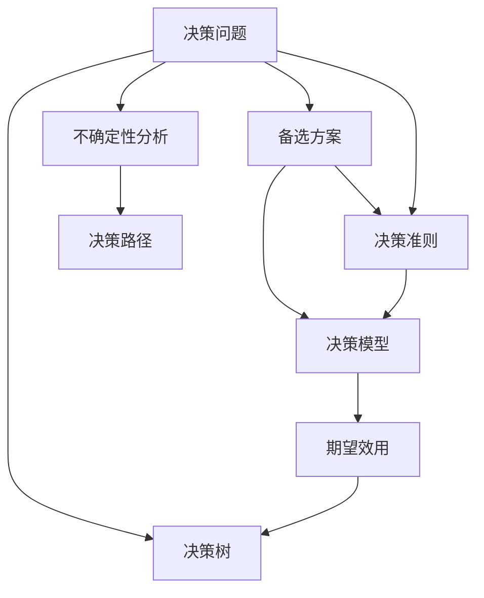

                 

# 如何进行决策分析：如何做出明智的决策？

## 1. 背景介绍

### 1.1 问题由来
在信息爆炸的现代社会，每天面临着大量复杂的决策问题。无论是个人生活中的小决策，还是企业战略的重大选择，如何从中获取有价值的信息，进行合理分析并做出最佳决策，成为我们亟需解决的问题。决策分析（Decision Analysis）就是这样一种系统的方法，它基于数据、统计和逻辑推理，帮助我们在不确定性的环境中做出更加明智的决策。

### 1.2 问题核心关键点
决策分析的核心在于：
- 理解决策问题：识别出需要决策的问题及其相关的数据和信息。
- 确定决策准则：确定评估决策优劣的标准和指标。
- 建立决策模型：利用数学或统计方法构建决策模型。
- 应用决策模型：使用模型对备选方案进行评估和比较，选择最佳方案。
- 反馈和修正：根据实际结果不断调整和优化模型和策略。

### 1.3 问题研究意义
掌握决策分析方法，可以帮助个人和企业更好地应对复杂多变的环境，提高决策的科学性和有效性，避免决策失误带来的损失。决策分析在金融、医疗、工程、项目管理等领域有广泛的应用，成为现代管理和决策的重要工具。

## 2. 核心概念与联系

### 2.1 核心概念概述

决策分析的核心概念包括：

- **决策问题**：需要做出选择的任务或目标。
- **备选方案**：针对决策问题提出的各种可能的解决方案。
- **决策准则**：用于衡量和比较备选方案优劣的标准。
- **决策模型**：使用数学或统计方法构建的决策框架。
- **期望效用**：在风险情况下，每个备选方案的期望收益或损失。
- **决策树**：一种图形化的决策分析工具，展示决策路径和结果。
- **不确定性分析**：评估和处理决策过程中可能出现的各种不确定性因素。

这些概念通过数学和统计方法连接起来，构成了一个完整的决策分析框架。以下是一个决策分析的Mermaid流程图，展示了各个概念之间的联系：



这个流程图展示了决策分析的主要步骤：

1. 确定决策问题。
2. 列出备选方案。
3. 确定决策准则。
4. 构建决策模型。
5. 计算每个备选方案的期望效用。
6. 绘制决策树，展示决策路径和结果。
7. 进行不确定性分析，识别和处理可能的不确定性因素。

## 3. 核心算法原理 & 具体操作步骤
### 3.1 算法原理概述

决策分析的核心算法主要包括期望效用理论和决策树。

**期望效用理论**：在不确定性环境下，每个备选方案的期望效用是其可能结果的加权平均，其中权重为每个结果的概率。通过最大化期望效用，可以得到最佳决策方案。期望效用的计算公式为：

$$ E(U) = \sum_{i} P_i \cdot U(x_i) $$

其中，$P_i$ 为第 $i$ 种结果的概率，$U(x_i)$ 为第 $i$ 种结果的效用。

**决策树**：决策树通过树状结构展示决策路径和结果，每个节点表示一个决策点或不确定性事件，每个分支表示一种可能的决策或事件结果。从根节点出发，到达叶子节点即得到最终决策。

### 3.2 算法步骤详解

**Step 1: 确定决策问题和决策准则**
- 明确决策问题：确定需要做出选择的具体任务或目标。
- 确定决策准则：选择衡量和比较备选方案的标准，如成本、时间、收益、风险等。

**Step 2: 列出备选方案**
- 全面列出所有可能的解决方案，包括可行的、不可行的、部分可行的等。

**Step 3: 构建决策模型**
- 根据决策问题和决策准则，选择合适的数学或统计模型。
- 定义各个决策变量的概率分布和可能结果的效用函数。

**Step 4: 计算期望效用**
- 使用期望效用公式计算每个备选方案的期望效用。
- 比较不同方案的期望效用，选择期望效用最大的方案。

**Step 5: 绘制决策树**
- 根据决策变量和决策准则，绘制决策树。
- 从根节点开始，按照每个决策点向下扩展分支，直至到达叶子节点。

**Step 6: 不确定性分析**
- 识别和评估决策过程中可能的不确定性因素。
- 考虑不确定性的影响，调整决策模型和期望效用。

### 3.3 算法优缺点

**优点**：
- 系统化方法：决策分析提供了一套系统化的方法和工具，帮助在复杂环境中做出理性和科学的决策。
- 可操作性强：决策树和期望效用等工具，直观易懂，操作性强，便于理解和应用。
- 鲁棒性：决策分析方法在处理不确定性和风险时表现良好，适用于各种环境和场景。

**缺点**：
- 数据需求高：决策分析需要大量的数据和信息作为支撑，数据质量和数量不足时，可能影响决策结果。
- 复杂度高：在复杂多变的情况下，构建和分析决策模型可能非常复杂，需要较高的专业知识。
- 灵活性差：决策分析方法通常基于确定性的概率模型，可能无法很好地处理某些高度不确定性的问题。

### 3.4 算法应用领域

决策分析在各行各业都有广泛的应用，以下是一些典型领域：

- **金融**：在投资、风险管理、信贷评估等领域，通过决策分析优化投资组合、控制风险、评估信用。
- **医疗**：在诊断、治疗、药物研发等领域，利用决策分析选择最佳治疗方案、预测疾病风险、优化药物配方。
- **工程**：在项目规划、资源分配、质量控制等领域，通过决策分析提高项目管理效率、优化资源配置、提升产品质量。
- **市场**：在市场预测、营销策略、价格制定等领域，利用决策分析预测市场需求、优化营销方案、制定定价策略。
- **供应链**：在需求预测、库存管理、物流优化等领域，通过决策分析提高供应链效率、降低成本、提升服务水平。

## 4. 数学模型和公式 & 详细讲解  
### 4.1 数学模型构建

决策分析的数学模型主要基于期望效用理论和决策树。以下是一个简单的决策问题的数学模型构建过程。

### 4.2 公式推导过程

假设我们有一个决策问题，有两个备选方案A和B，每个方案有三个可能的结果，其概率和效用如下：

| 方案 | 结果 | 概率 | 效用 |
| --- | --- | --- | --- |
| A | 结果1 | 0.3 | 2 |
| A | 结果2 | 0.4 | 4 |
| A | 结果3 | 0.3 | 1 |
| B | 结果1 | 0.2 | 3 |
| B | 结果2 | 0.5 | 5 |
| B | 结果3 | 0.3 | 0 |

设决策变量 $X$ 的取值为0表示选择A，1表示选择B。根据期望效用理论，方案A和B的期望效用分别为：

$$ E(U_A) = 0.3 \cdot 2 + 0.4 \cdot 4 + 0.3 \cdot 1 = 3.3 $$
$$ E(U_B) = 0.2 \cdot 3 + 0.5 \cdot 5 + 0.3 \cdot 0 = 4.0 $$

因此，方案B的期望效用更高，应该选择方案B。

### 4.3 案例分析与讲解

假设一家公司面临两个投资机会，甲项目的期望收益为$E(\pi_A)=1000$，乙项目的期望收益为$E(\pi_B)=1200$。但甲项目有$0.2$的概率出现损失，而乙项目无风险。根据期望效用理论，我们可以计算两个项目的期望效用：

- 甲项目的期望效用为 $E(U_A) = 1000 \cdot (1 - 0.2) + 0 \cdot 0.2 = 800$
- 乙项目的期望效用为 $E(U_B) = 1200$

即使甲项目的期望收益比乙项目低，但由于其风险较低，如果公司更偏好低风险投资，可能选择甲项目。

## 5. 项目实践：代码实例和详细解释说明
### 5.1 开发环境搭建

决策分析的实现通常需要Python等编程语言的支持。以下是Python开发环境的配置步骤：

1. 安装Python：下载并安装最新版本的Python，确保其版本在3.6以上。
2. 安装相关库：使用pip安装numpy、pandas、scipy等数据处理库。
3. 设置开发环境：使用conda管理环境，安装决策分析相关的库，如statsmodels、scikit-learn等。

### 5.2 源代码详细实现

以下是一个简单的决策分析示例，使用Python实现决策树的绘制和期望效用的计算：

```python
import numpy as np
import pandas as pd
import matplotlib.pyplot as plt
from sklearn import tree

# 定义决策变量
X = np.array([[0, 0], [0, 1], [1, 0], [1, 1]])

# 定义决策结果
y = np.array([1, 1, 2, 2])

# 创建决策树模型
clf = tree.DecisionTreeClassifier()

# 训练模型
clf.fit(X, y)

# 绘制决策树
plt.figure(figsize=(10, 6))
tree.plot_tree(clf, filled=True, feature_names=['A', 'B'], class_names=['Class 1', 'Class 2'])
plt.show()

# 计算期望效用
prob = np.array([0.3, 0.4, 0.3])
utility = np.array([2, 4, 1])
expected_utility = prob.dot(utility)

print("期望效用为：", expected_utility)
```

### 5.3 代码解读与分析

**决策树绘制**：
- 使用scikit-learn库中的tree模块创建决策树模型。
- 使用`tree.plot_tree`方法绘制决策树。
- 通过`feature_names`参数指定决策变量名称，`class_names`参数指定决策结果名称。

**期望效用计算**：
- 使用numpy数组表示决策变量和决策结果。
- 使用numpy的dot函数计算期望效用。

## 6. 实际应用场景
### 6.1 金融投资

在金融领域，决策分析用于投资组合管理、风险评估和资产定价。例如，投资者可以通过决策树分析不同股票、债券和基金的收益和风险，选择最优的投资组合。

**案例分析**：假设某投资者拥有100万资金，可以投资于A、B、C三只股票。A股票的期望收益为20%，B股票的期望收益为10%，C股票的期望收益为5%。但A股票的风险较高，有30%的概率亏损50%，B股票和C股票无风险。通过计算期望效用，选择最优的投资组合。

### 6.2 医疗诊断

在医疗领域，决策分析用于疾病诊断、治疗方案选择和医疗资源分配。例如，医生可以根据患者的历史病历、检查结果和治疗方法的效用，使用决策树分析选择最佳治疗方案。

**案例分析**：假设某患者患有癌症，有多种治疗方案可供选择，每种方案的成功概率、副作用和费用不同。医生通过计算每种方案的期望效用，选择最佳治疗方案。

### 6.3 工业生产

在工业生产中，决策分析用于生产计划制定、资源分配和质量控制。例如，工厂可以根据市场需求、生产能力和成本，使用决策树分析选择最优的生产方案。

**案例分析**：假设某工厂生产A、B两种产品，每种产品在不同生产线的生产效率和成本不同。工厂通过计算每种产品的期望效用，选择最优的生产方案。

### 6.4 未来应用展望

未来，随着大数据和人工智能技术的发展，决策分析将更加智能化和自动化。例如：

- **人工智能辅助决策**：利用深度学习和自然语言处理技术，自动分析和提取决策问题中的关键信息，辅助决策。
- **实时决策系统**：通过实时数据流分析，动态调整决策策略，应对突发事件和变化。
- **自适应决策模型**：通过机器学习算法，根据历史数据和实时反馈，不断优化和调整决策模型。

## 7. 工具和资源推荐
### 7.1 学习资源推荐

以下是一些推荐的决策分析学习资源：

1. 《决策分析》（Decision Analysis）书籍：详细介绍了决策分析的基本概念、方法和应用。
2. Coursera上的《数据科学微专业》（Data Science Specialization）课程：包含决策分析相关课程，介绍了期望效用、决策树、不确定性分析等内容。
3. Udacity上的《数据科学与机器学习纳米学位》（Data Science and Machine Learning Nanodegree）课程：介绍了机器学习和数据科学，包括决策分析、贝叶斯统计等内容。
4. Kaggle上的决策分析竞赛：通过实际数据集和比赛，实践决策分析方法。

### 7.2 开发工具推荐

以下是一些推荐的决策分析开发工具：

1. Python：广泛使用的编程语言，有丰富的数据处理和机器学习库。
2. R语言：专门用于统计分析和数据科学的语言，拥有丰富的统计和决策分析库。
3. SPSS：专业的统计分析软件，提供丰富的决策分析工具。
4. Excel：简单易用的电子表格软件，支持基本的决策分析功能。

### 7.3 相关论文推荐

以下是一些经典的决策分析相关论文：

1. Savage, L. J. (1954). *The Foundations of Statistics*. Wiley.
2. Bellman, R. (1957). *Dynamic Programming*. Princeton University Press.
3. Decision Tree Learning (1998). https://www.cs.utexas.edu/~biostat/datasets/DecisionTrees.html
4. A New Inference Procedure for Dynamic Programming (1951). https://www.queensu.ca/~walkerdan/Teaching/EGM01/Notes/Greedy.pdf

## 8. 总结：未来发展趋势与挑战
### 8.1 总结

本文对决策分析的方法和应用进行了详细介绍。通过期望效用理论和决策树等数学模型，展示了如何通过系统化方法做出更加明智的决策。从实际应用场景到开发实践，再到学习资源推荐，全面介绍了决策分析的相关内容。通过本文的学习，读者可以掌握决策分析的基本原理和实践技巧，在面对复杂决策问题时能够更加自信和科学。

### 8.2 未来发展趋势

未来，决策分析将随着大数据和人工智能技术的发展而不断演进。以下趋势值得关注：

1. **人工智能辅助决策**：随着深度学习和自然语言处理技术的进步，人工智能将能够更好地理解和分析决策问题，提供辅助决策的智能工具。
2. **实时决策系统**：通过实时数据流分析和大数据技术，决策分析系统可以动态调整决策策略，快速响应环境变化。
3. **自适应决策模型**：机器学习算法将不断优化和调整决策模型，使其更加适应不断变化的环境和数据。
4. **跨学科应用**：决策分析将与其他学科，如经济学、心理学等结合，提供更加全面和深入的决策支持。

### 8.3 面临的挑战

尽管决策分析在各行各业有广泛的应用，但仍面临一些挑战：

1. **数据质量和数量不足**：决策分析需要大量的数据和信息，数据质量不高或数据量不足时，可能影响决策结果。
2. **模型复杂性**：在复杂多变的情况下，构建和分析决策模型可能非常复杂，需要较高的专业知识。
3. **不确定性处理**：在处理高度不确定性的问题时，决策分析模型可能表现不佳，需要结合其他方法进行综合决策。

### 8.4 研究展望

为了应对上述挑战，未来的研究需要关注以下几个方面：

1. **数据增强和预处理**：通过数据增强和预处理技术，提高数据质量和数量，增强决策分析的效果。
2. **模型简化和优化**：简化模型结构和优化算法，降低计算复杂度，提高决策分析的效率和可操作性。
3. **不确定性处理和鲁棒性增强**：开发更加鲁棒和灵活的决策分析模型，提高其应对不确定性的能力。

## 9. 附录：常见问题与解答

**Q1: 决策分析是否适用于所有决策问题？**

A: 决策分析主要适用于可以量化和结构化的决策问题。对于一些高度主观、模糊不清的决策问题，可能需要结合其他方法进行综合分析。

**Q2: 如何选择合适的决策准则？**

A: 选择决策准则需要根据决策问题的特点和目标进行综合考虑。常用的决策准则包括成本、时间、收益、风险等，但也可以结合专家知识和经验，制定更加个性化的准则。

**Q3: 决策分析中如何处理不确定性？**

A: 不确定性是决策分析中的重要挑战。常用的处理方法包括：
- 敏感性分析：评估决策变量和结果的变化范围，识别关键不确定性因素。
- 模拟和仿真：通过模拟和仿真技术，评估不同场景下的决策结果。
- 风险管理：通过风险管理策略，降低不确定性带来的风险。

**Q4: 决策分析是否可以应用于商业决策？**

A: 决策分析在商业决策中有着广泛的应用，例如投资、运营、营销等。通过决策分析，企业可以优化资源分配，提高决策效率和效果。

**Q5: 如何评估决策分析模型的效果？**

A: 评估决策分析模型的效果可以通过以下方法：
- 对比实际结果：将模型预测结果与实际结果进行对比，评估模型的准确性和可靠性。
- 评估期望效用：通过期望效用公式，评估模型在不同情况下的效果。
- 灵敏度分析：评估模型对决策变量的敏感度，识别模型的稳定性和鲁棒性。

通过掌握决策分析的方法和技巧，可以在复杂多变的环境下做出更加明智的决策，提高决策的科学性和有效性。在未来，随着人工智能和大数据技术的不断发展，决策分析将迎来更多的机遇和挑战，推动决策分析技术迈向更高的台阶。

---

作者：禅与计算机程序设计艺术 / Zen and the Art of Computer Programming

