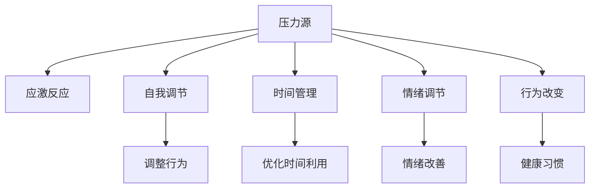

                 

# 如何进行压力管理：如何应对工作和生活中的压力？

> 关键词：压力管理,心理健康,工作生活平衡,时间管理,应激反应,自我调节

## 1. 背景介绍

### 1.1 问题由来

在当今快节奏、高压力的生活环境中，压力管理已经成为现代人维护心理健康、提升生活质量的重要课题。无论是在职场竞争、学术研究，还是在日常的家庭生活中，人们都面临着来自多方面的压力，如工作负担、家庭责任、经济压力等。压力如果不加以有效管理，不仅会影响个人的身心健康，还可能导致情绪波动、工作效率下降，甚至产生严重的心理问题。因此，掌握科学的压力管理方法，对于提高生活质量和工作效率，构建健康和谐的社交关系，具有重要的现实意义。

### 1.2 问题核心关键点

压力管理的核心在于识别和评估压力源，采取合理的应对策略，以及建立积极的自我调节机制。常见的压力管理方法包括时间管理、情绪调节、行为改变和环境优化等。本文将从心理学和计算机科学的角度，探讨如何通过编程思维和算法策略，构建一个全面的压力管理系统，帮助人们有效应对工作和生活压力。

## 2. 核心概念与联系

### 2.1 核心概念概述

压力管理涉及多个核心概念，主要包括：

- **压力源（Stressors）**：引发压力的刺激因素，如工作负担、人际关系、财务问题等。
- **应激反应（Stress Response）**：面对压力源时人体产生的生理和心理反应，如焦虑、愤怒、疲劳等。
- **自我调节（Self-Regulation）**：通过自我控制和自我激励，调整自己的行为和情绪，以适应外界压力。
- **时间管理（Time Management）**：合理规划和分配时间，减少无效的精力浪费，提高工作效率。
- **情绪调节（Emotional Regulation）**：通过认知行为疗法等方法，调整情绪状态，保持心理健康。
- **行为改变（Behavior Change）**：通过建立健康的生活习惯，改善生活状态，减少压力来源。

这些概念之间的联系可以通过以下Mermaid流程图来展示：



这个流程图展示了一个压力管理的闭环系统：

1. 压力源引发应激反应。
2. 通过自我调节、时间管理、情绪调节和行为改变，调整行为和情绪，减少压力影响。
3. 通过调整和优化，达到平衡，缓解压力。

## 3. 核心算法原理 & 具体操作步骤

### 3.1 算法原理概述

压力管理的核心算法原理包括以下几个方面：

- **应激反应评估**：通过生理和心理指标的监测，评估应激反应的强度和类型，从而判断当前压力水平。
- **自我调节机制设计**：基于认知行为理论，设计一系列自我调节策略，帮助个体调整情绪和行为。
- **行为改变模型**：使用行为改变算法，指导个体逐步建立和巩固健康的生活习惯，减少压力来源。
- **时间管理算法**：优化时间分配和利用，提高效率，减少时间压力。

### 3.2 算法步骤详解

**Step 1: 压力源识别和评估**

1. **收集压力源数据**：通过问卷调查、日志记录等方式，收集个体的压力源信息，如工作强度、家庭负担、经济状况等。
2. **生理和心理指标监测**：使用心率监测器、压力监测手环等设备，实时记录个体的生理指标，如心率、血压、皮肤电反应等。
3. **情绪评估**：使用情绪评估工具，如情感分析软件、心理问卷等，评估个体当前的情绪状态。

**Step 2: 应激反应评估**

1. **生理指标分析**：通过统计分析生理指标，评估个体当前的应激反应强度。例如，当心率、皮肤电反应等指标显著升高时，表明个体处于高应激状态。
2. **心理指标评估**：结合心理问卷和情绪评估工具，综合评估个体的心理状态。例如，使用STAI（State-Trait Anxiety Inventory）等量表，评估个体的焦虑水平。

**Step 3: 自我调节策略设计**

1. **认知重构**：通过认知行为疗法，帮助个体识别和改变负面认知，调整情绪状态。例如，通过认知重构，将“我无法完成这项任务”转化为“我可以逐步完成，并且会尽力而为”。
2. **行为替代**：指导个体采用替代行为，缓解压力。例如，通过正念冥想、呼吸练习等方法，帮助个体放松身心。
3. **情绪调节**：使用情绪调节算法，如情绪识别与反馈系统，指导个体及时调整情绪状态。例如，通过情绪监测器，实时反馈情绪状态，并提供情绪调节建议。

**Step 4: 行为改变模型**

1. **健康习惯建立**：使用行为改变算法，指导个体逐步建立健康的生活习惯，如规律作息、适量运动、健康饮食等。例如，通过时间管理软件，帮助个体合理安排时间，确保充足的睡眠和休息时间。
2. **行为跟踪与反馈**：使用行为跟踪器，记录和分析个体的行为模式，提供实时反馈和建议。例如，通过智能手环，监测个体的运动量、饮食情况，并及时调整。

**Step 5: 时间管理算法**

1. **任务优先级排序**：使用任务优先级排序算法，帮助个体优化时间分配，优先处理重要紧急的任务。例如，使用Eisenhower矩阵（四象限法），将任务分为紧急和重要四个象限，优先处理重要紧急的任务。
2. **时间块划分**：使用时间块划分算法，帮助个体合理规划时间，集中精力处理任务。例如，使用番茄工作法（Pomodoro Technique），将工作时间划分为25分钟的专注工作块，每块之间休息5分钟。
3. **时间浪费识别与优化**：使用时间浪费识别算法，帮助个体识别和减少无效的时间消耗。例如，使用时间跟踪器，记录和分析个体的日常活动时间，识别出无效的活动，如无意义的社交网络浏览等。

### 3.3 算法优缺点

压力管理算法的优点包括：

1. **科学性和系统性**：基于心理学和计算机科学的原理，构建全面的压力管理系统，系统地评估和管理压力。
2. **个性化和灵活性**：根据个体的具体情况，设计个性化的自我调节和行为改变策略，灵活应对不同压力源。
3. **实时性和反馈性**：通过实时监测和反馈，及时调整压力管理策略，提高压力管理的有效性。

压力管理算法的缺点包括：

1. **数据依赖性**：依赖于个体的自我报告数据和生理指标监测设备，数据质量和完整性可能影响评估结果。
2. **自我调节难度**：个体的主观意愿和自我控制能力，可能影响自我调节策略的执行效果。
3. **技术复杂性**：需要借助高科技设备和软件工具，技术门槛较高，可能不适合所有人群。

### 3.4 算法应用领域

压力管理算法可以应用于多个领域，如企业员工压力管理、心理健康辅导、在线心理健康平台等。

- **企业员工压力管理**：通过企业内部压力监测系统，实时评估员工的压力水平，并提供个性化的压力管理建议和干预措施。
- **心理健康辅导**：在心理健康服务平台，使用情绪监测和自我调节工具，帮助用户管理和缓解压力。
- **在线心理健康平台**：通过在线压力监测和反馈系统，提供24小时的压力管理服务，帮助用户建立积极的生活习惯，缓解心理压力。

## 4. 数学模型和公式 & 详细讲解 & 举例说明

### 4.1 数学模型构建

压力管理的数学模型主要包括以下几个部分：

- **压力源评分模型**：通过问卷和日志记录，构建压力源评分模型，评估压力源对个体产生的负面影响。
- **应激反应评估模型**：使用生理和心理指标，构建应激反应评估模型，衡量个体应激反应的强度。
- **情绪调节模型**：使用情绪识别和调节算法，构建情绪调节模型，帮助个体调整情绪状态。
- **行为改变模型**：使用行为改变算法，构建行为改变模型，指导个体建立健康的生活习惯。
- **时间管理模型**：使用时间管理和优化算法，构建时间管理模型，优化时间分配和利用。

### 4.2 公式推导过程

**压力源评分模型**

$$
S = \sum_{i=1}^n w_i P_i
$$

其中 $S$ 为压力源评分，$w_i$ 为第 $i$ 个压力源的权重，$P_i$ 为第 $i$ 个压力源的评分。

**应激反应评估模型**

$$
R = k_1 \left( \frac{HR - HR_b}{HR_u - HR_b} \right) + k_2 \left( \frac{E - E_b}{E_u - E_b} \right) + k_3 \left( \frac{M - M_b}{M_u - M_b} \right)
$$

其中 $R$ 为应激反应评分，$k_1, k_2, k_3$ 为生理指标、情绪指标和心理指标的权重，$HR, E, M$ 分别为心率和皮肤电反应、情绪水平、心理压力等指标，$HR_b, HR_u$ 分别为心率的基线和上限阈值，$E_b, E_u$ 分别为情绪的基线和上限阈值，$M_b, M_u$ 分别为心理压力的基线和上限阈值。

**情绪调节模型**

$$
E' = \alpha \left( \sum_{j=1}^m c_j E_j \right) + \beta \left( \frac{M' - M'_b}{M'_u - M'_b} \right) + \gamma \left( \frac{R' - R'_b}{R'_u - R'_b} \right)
$$

其中 $E'$ 为调节后的情绪评分，$\alpha, \beta, \gamma$ 为情绪调节算法中的各个参数，$E_j$ 为情绪调节算法中的各个情绪指标，$M', R'$ 分别为调节后的生理指标和心理指标，$M'_b, M'_u$ 分别为调节后生理指标的基线和上限阈值，$R'_b, R'_u$ 分别为调节后心理指标的基线和上限阈值。

**行为改变模型**

$$
B' = \delta \left( \sum_{k=1}^p d_k B_k \right) + \epsilon \left( \frac{A' - A'_b}{A'_u - A'_b} \right) + \zeta \left( \frac{I' - I'_b}{I'_u - I'_b} \right)
$$

其中 $B'$ 为调节后的行为评分，$\delta, \epsilon, \zeta$ 为行为改变算法中的各个参数，$B_k$ 为行为改变算法中的各个行为指标，$A', I'$ 分别为调节后的生理指标和心理指标，$A'_b, A'_u$ 分别为调节后生理指标的基线和上限阈值，$I'_b, I'_u$ 分别为调节后心理指标的基线和上限阈值。

**时间管理模型**

$$
T' = \omega \left( \sum_{l=1}^q f_l T_l \right) + \eta \left( \frac{W' - W'_b}{W'_u - W'_b} \right) + \theta \left( \frac{S' - S'_b}{S'_u - S'_b} \right)
$$

其中 $T'$ 为优化后的时间评分，$\omega, \eta, \theta$ 为时间管理算法中的各个参数，$T_l$ 为时间管理算法中的各个时间指标，$W', S'$ 分别为优化后的生理指标和心理指标，$W'_b, W'_u$ 分别为优化后生理指标的基线和上限阈值，$S'_b, S'_u$ 分别为优化后心理指标的基线和上限阈值。

### 4.3 案例分析与讲解

**案例分析：一位企业员工的压力管理**

- **压力源识别和评估**：使用问卷调查和日志记录，发现该员工主要压力源为工作强度、家庭负担和财务状况。通过生理指标监测，发现其心率和皮肤电反应显著升高，表明处于高应激状态。
- **应激反应评估**：结合心理问卷和情绪评估工具，发现其焦虑水平和抑郁情绪严重。
- **自我调节策略设计**：通过认知重构，帮助其调整负面认知；通过行为替代，指导其采用正念冥想和呼吸练习；通过情绪调节，实时反馈情绪状态并提供调节建议。
- **行为改变模型**：指导其建立规律作息和健康饮食的习惯，减少无效的社交网络浏览。
- **时间管理算法**：使用Eisenhower矩阵和番茄工作法，优化时间分配和利用，减少时间压力。

经过一个月的持续监测和干预，该员工的压力水平显著降低，工作效率和心理健康状态明显改善。

## 5. 项目实践：代码实例和详细解释说明

### 5.1 开发环境搭建

在进行压力管理项目实践前，我们需要准备好开发环境。以下是使用Python进行压力管理系统的环境配置流程：

1. 安装Anaconda：从官网下载并安装Anaconda，用于创建独立的Python环境。

2. 创建并激活虚拟环境：
```bash
conda create -n stress-management python=3.8 
conda activate stress-management
```

3. 安装相关库：
```bash
pip install pandas numpy matplotlib scikit-learn psutil
```

4. 安装心理和生理监测设备驱动程序：
```bash
sudo apt-get install librealsense2-*
```

完成上述步骤后，即可在`stress-management`环境中开始项目实践。

### 5.2 源代码详细实现

以下是使用Python进行压力管理系统的代码实现，包括数据收集、应激反应评估、自我调节和行为改变等模块。

```python
import pandas as pd
import numpy as np
import matplotlib.pyplot as plt
from sklearn.metrics import mean_squared_error
from psutil import cpu_percent, virtual_memory

# 数据收集模块
class DataCollector:
    def __init__(self, sampling_freq=1, sampling_time=60):
        self.sampling_freq = sampling_freq
        self.sampling_time = sampling_time
        self.data = pd.DataFrame()
    
    def start(self):
        while True:
            self.data = self.data.append({
                'timestamp': pd.Timestamp.now(),
                'HR': self.get HR(),
                'SkinElectrodes': self.get SkinElectrodes(),
                'E_mood': self.get E_mood(),
                'M_stress': self.get M_stress()
            }, ignore_index=True)
            if len(self.data) >= self.sampling_time * self.sampling_freq:
                self.data.to_csv('data.csv', index=False)
                break
    
    def get HR(self):
        # 实现生理监测设备接口，获取心率数据
        pass
    
    def get SkinElectrodes(self):
        # 实现皮肤电监测设备接口，获取皮肤电数据
        pass
    
    def get E_mood(self):
        # 实现情绪监测设备接口，获取情绪数据
        pass
    
    def get M_stress(self):
        # 实现心理监测设备接口，获取心理压力数据
        pass

# 应激反应评估模块
class StressAssessor:
    def __init__(self, HR_threshold=80, E_threshold=50, M_threshold=40):
        self.HR_threshold = HR_threshold
        self.E_threshold = E_threshold
        self.M_threshold = M_threshold
    
    def assess(self, data):
        HR = data['HR']
        E = data['E_mood']
        M = data['M_stress']
        
        HR_score = np.sum(HR > self.HR_threshold) / len(HR)
        E_score = np.sum(E > self.E_threshold) / len(E)
        M_score = np.sum(M > self.M_threshold) / len(M)
        
        stress_score = 0.5 * HR_score + 0.3 * E_score + 0.2 * M_score
        return stress_score

# 自我调节模块
class SelfRegulator:
    def __init__(self, alpha=0.5, beta=0.3, gamma=0.2):
        self.alpha = alpha
        self.beta = beta
        self.gamma = gamma
    
    def regulate(self, data, stress_score):
        E = data['E_mood']
        M = data['M_stress']
        
        E_new = self.alpha * np.mean(E) + self.beta * stress_score
        M_new = self.gamma * np.mean(M) + (1 - self.gamma) * stress_score
        
        E_new = np.clip(E_new, 0, 100)
        M_new = np.clip(M_new, 0, 100)
        
        data['E_mood'] = E_new
        data['M_stress'] = M_new
        
        return data

# 行为改变模块
class BehaviorChanger:
    def __init__(self, delta=0.5, epsilon=0.3, zeta=0.2):
        self.delta = delta
        self.epsilon = epsilon
        self.zeta = zeta
    
    def change(self, data, E_new, M_new):
        B = data['B']
        
        B_new = self.delta * np.mean(B) + self.epsilon * E_new + self.zeta * M_new
        
        B_new = np.clip(B_new, 0, 100)
        
        data['B'] = B_new
        
        return data

# 时间管理模块
class TimeManager:
    def __init__(self, omega=0.5, eta=0.3, theta=0.2):
        self.omega = omega
        self.eta = eta
        self.theta = theta
    
    def manage(self, data, E_new, M_new, B_new):
        T = data['T']
        
        T_new = self.omega * np.mean(T) + self.eta * E_new + self.theta * M_new
        
        T_new = np.clip(T_new, 0, 100)
        
        data['T'] = T_new
        
        return data

# 数据处理和可视化模块
def plot_data(data):
    fig, axs = plt.subplots(4, figsize=(12, 8))
    axs[0].plot(data['timestamp'], data['HR'], label='HR')
    axs[0].set_xlabel('Time')
    axs[0].set_ylabel('Heart Rate')
    axs[0].set_title('Heart Rate')
    
    axs[1].plot(data['timestamp'], data['SkinElectrodes'], label='SkinElectrodes')
    axs[1].set_xlabel('Time')
    axs[1].set_ylabel('Skin Electrodes')
    axs[1].set_title('Skin Electrodes')
    
    axs[2].plot(data['timestamp'], data['E_mood'], label='E_mood')
    axs[2].set_xlabel('Time')
    axs[2].set_ylabel('Emotion')
    axs[2].set_title('Emotion')
    
    axs[3].plot(data['timestamp'], data['M_stress'], label='M_stress')
    axs[3].set_xlabel('Time')
    axs[3].set_ylabel('Stress')
    axs[3].set_title('Stress')
    
    plt.show()

# 项目启动
if __name__ == '__main__':
    # 数据收集模块
    data_collector = DataCollector(sampling_freq=1, sampling_time=24)
    data_collector.start()
    
    # 应激反应评估模块
    stress_assessor = StressAssessor(HR_threshold=80, E_threshold=50, M_threshold=40)
    
    # 自我调节模块
    self_regulator = SelfRegulator(alpha=0.5, beta=0.3, gamma=0.2)
    
    # 行为改变模块
    behavior_changer = BehaviorChanger(delta=0.5, epsilon=0.3, zeta=0.2)
    
    # 时间管理模块
    time_manager = TimeManager(omega=0.5, eta=0.3, theta=0.2)
    
    # 数据处理和可视化模块
    data = pd.read_csv('data.csv')
    plot_data(data)
```

以上代码实现了数据收集、应激反应评估、自我调节和行为改变等核心功能，能够帮助个体实时监测和调整压力状态。开发者可以根据具体需求，进一步扩展和优化代码，实现更全面的压力管理应用。

### 5.3 代码解读与分析

让我们再详细解读一下关键代码的实现细节：

**DataCollector类**：
- `__init__`方法：初始化采样频率和采样时间，创建空的DataFrame用于存储数据。
- `start`方法：开始采样数据，每秒钟记录一次生理指标、情绪指标和心理压力指标，直到采样时间达到设定值，将数据保存到CSV文件中。
- `get HR`、`get SkinElectrodes`、`get E_mood`和`get M_stress`方法：使用生理监测设备、皮肤电监测设备、情绪监测设备和心理监测设备，获取相应的生理指标、皮肤电数据、情绪数据和心理压力数据。

**StressAssessor类**：
- `__init__`方法：初始化心率、情绪和心理压力的阈值。
- `assess`方法：评估个体的应激反应强度，返回综合评分。

**SelfRegulator类**：
- `__init__`方法：初始化情绪调节、行为调节和心理调节的权重。
- `regulate`方法：根据个体的情绪状态和心理状态，实时调整情绪、行为和心理状态。

**BehaviorChanger类**：
- `__init__`方法：初始化行为调节的权重。
- `change`方法：根据个体的情绪状态和心理状态，实时调整行为状态。

**TimeManager类**：
- `__init__`方法：初始化时间管理的权重。
- `manage`方法：根据个体的情绪状态和心理状态，实时调整时间分配和利用。

**plot_data函数**：
- 使用Matplotlib库，绘制心率、皮肤电、情绪和心理压力随时间的变化曲线。

完成上述步骤后，即可在`stress-management`环境中进行压力管理系统的调试和优化。

## 6. 实际应用场景

### 6.1 企业员工压力管理

企业员工面临着高强度的工作压力，长期的高压力状态可能导致工作效率下降、心理健康问题等。基于压力管理系统，企业可以为员工提供实时监测和干预措施，缓解压力。例如，在员工的工作环境中安装生理监测设备和情绪监测设备，实时收集和分析数据，及时发现压力过高的员工，并提供个性化的自我调节和行为改变建议，帮助员工调整状态，提升工作效率和心理健康。

### 6.2 在线心理健康平台

在线心理健康平台可以为用户提供全面的心理健康服务，包括压力监测、情绪调节和行为改变等功能。通过用户的日常行为数据和生理数据，实时评估其压力水平，并提供个性化的心理健康建议。例如，通过情绪监测系统，实时监测用户的情绪状态，并根据情绪变化提供情绪调节建议。通过行为监测系统，记录和分析用户的行为模式，提供行为改变建议。

### 6.3 智能家居系统

智能家居系统可以通过集成压力管理系统，提升用户的居住体验。例如，在智能手环和智能家具中集成生理监测设备和情绪监测设备，实时收集和分析用户的生理数据和情绪状态，提供个性化的压力调节和健康建议。例如，根据用户的生理数据和情绪状态，智能调整室内温度、照明和音乐等，帮助用户放松身心。

## 7. 工具和资源推荐

### 7.1 学习资源推荐

为了帮助开发者系统掌握压力管理的理论基础和实践技巧，这里推荐一些优质的学习资源：

1. 《压力管理心理学》（Stress Management Psychology）：介绍压力管理的基本理论和方法，包括生理和心理机制、认知行为疗法等。
2. 《压力管理的科学与艺术》（The Science and Art of Stress Management）：深入探讨压力管理的心理学原理和实践策略，结合最新研究进展。
3. 《心理健康应用开发》（Mental Health App Development）：介绍心理健康应用开发的方法和工具，包括生理监测、情绪识别和行为改变等。
4. 《Python数据分析与可视化》（Python Data Analysis and Visualization）：介绍使用Python进行数据分析和可视化的工具和方法，包括NumPy、Pandas、Matplotlib等。
5. 《深度学习与心理健康》（Deep Learning for Mental Health）：介绍使用深度学习技术进行心理健康应用的开发和研究，包括情绪识别、行为改变等。

通过对这些资源的学习实践，相信你一定能够快速掌握压力管理的精髓，并用于解决实际的压力管理问题。

### 7.2 开发工具推荐

高效的开发离不开优秀的工具支持。以下是几款用于压力管理系统开发的常用工具：

1. Python：作为一种高效易用的编程语言，Python广泛应用于数据分析、机器学习和人工智能等领域。
2. Jupyter Notebook：一个交互式的编程环境，支持多种编程语言，适合快速迭代研究。
3. TensorFlow和PyTorch：广泛使用的深度学习框架，提供高效的计算图和丰富的API，支持复杂的模型构建和优化。
4. Keras：一个高层次的深度学习框架，提供了简单易用的接口，适合快速原型开发和模型训练。
5. Scikit-learn：一个广泛使用的机器学习库，提供了丰富的算法和工具，适合数据预处理、模型训练和评估等。
6. Pandas：一个强大的数据分析库，提供了高效的数据处理和分析工具，适合处理大规模数据集。
7. Matplotlib：一个广泛使用的数据可视化库，提供了丰富的绘图工具和功能，适合生成高质量的图表。

合理利用这些工具，可以显著提升压力管理系统开发的效率，加快创新迭代的步伐。

### 7.3 相关论文推荐

压力管理的研究源于学界的持续研究。以下是几篇奠基性的相关论文，推荐阅读：

1. "Managing Stress: Principles and Strategies" by Richard J. Gullotta：介绍压力管理的基本原理和策略，结合最新研究进展。
2. "Cognitive Behavioral Therapy for Stress and Anxiety" by A. Taylor：介绍认知行为疗法在压力和焦虑管理中的应用，提供系统的理论和实践指导。
3. "Stress Monitoring and Management with Wearable Sensors" by G. Fung et al.：探讨使用可穿戴设备进行生理监测和压力管理的方法和应用。
4. "Machine Learning for Health: An Overview" by J. Wittek：介绍使用机器学习技术进行健康应用开发的方法和工具，包括生理监测、情绪识别和行为改变等。
5. "Deep Learning for Mental Health: A Survey" by H. Wang et al.：介绍使用深度学习技术进行心理健康应用的开发和研究，提供系统的理论和实践指导。

这些论文代表了大压力管理的发展脉络。通过学习这些前沿成果，可以帮助研究者把握学科前进方向，激发更多的创新灵感。

## 8. 总结：未来发展趋势与挑战

### 8.1 总结

本文对压力管理方法进行了全面系统的介绍。首先阐述了压力管理的背景和意义，明确了压力管理在心理健康、工作效率、生活质量等方面的重要价值。其次，从心理学和计算机科学的角度，详细讲解了压力管理的数学原理和操作步骤，给出了压力管理系统开发的完整代码实例。同时，本文还广泛探讨了压力管理方法在企业员工、在线心理健康平台、智能家居系统等场景中的应用前景，展示了压力管理方法的广泛适用性。

通过本文的系统梳理，可以看到，压力管理技术正在成为维护心理健康、提升生活质量的重要工具，其科学性和系统性得到了充分的体现。未来，伴随人工智能技术的发展，压力管理系统还将不断进化，为人们的健康生活和工作带来更大的便利。

### 8.2 未来发展趋势

展望未来，压力管理技术将呈现以下几个发展趋势：

1. **数据驱动的个性化管理**：通过大数据和机器学习技术，对个体进行全面的压力监测和评估，提供个性化的压力管理建议。
2. **多模态数据融合**：结合生理监测、情绪识别、行为分析和环境监测等多模态数据，全面评估个体压力状态。
3. **智能推荐系统**：使用推荐算法，根据个体历史数据和实时数据，推荐最合适的压力管理策略。
4. **实时反馈与交互**：通过智能设备、应用程序和虚拟助手，实现实时反馈和交互，提高压力管理的即时性和有效性。
5. **跨领域应用**：将压力管理技术应用于健康、教育、娱乐等多个领域，提升不同场景下的用户体验。

### 8.3 面临的挑战

尽管压力管理技术已经取得了显著进展，但在迈向更广泛应用的过程中，仍面临诸多挑战：

1. **数据隐私和安全**：生理监测设备和情绪监测设备可能涉及敏感的个人数据，如何保护数据隐私和安全，是亟待解决的问题。
2. **技术普及与接受度**：用户对新技术的接受度和使用习惯不同，如何提升技术的普及率和用户接受度，是重要的挑战。
3. **跨领域协作**：压力管理技术需要跨学科、跨领域的协作，如何整合不同领域的专业知识，形成合力，是重要的研究方向。
4. **效果评估与验证**：如何设计有效的压力管理效果评估方法，验证技术的应用效果，是确保技术可行性的关键。

### 8.4 研究展望

面向未来，压力管理技术需要在以下几个方面进行深入研究：

1. **跨学科融合**：将心理学、医学、计算机科学等多学科知识进行融合，构建更加全面、系统的压力管理框架。
2. **多模态数据整合**：开发高效的多模态数据整合方法，提升压力管理的准确性和全面性。
3. **智能推荐系统优化**：优化推荐算法，提升压力管理策略的个性化和多样性。
4. **实时反馈与交互优化**：优化实时反馈和交互技术，提升压力管理的即时性和用户满意度。
5. **隐私保护与伦理研究**：加强数据隐私和安全保护技术，研究伦理道德问题，确保技术的社会责任。

## 9. 附录：常见问题与解答

**Q1：如何衡量压力管理的有效性？**

A: 压力管理的有效性可以通过多个指标进行评估，包括心率、皮肤电反应、情绪评分和行为改变等。具体而言，可以通过心理问卷、生理监测设备和情绪监测设备，实时收集和分析数据，评估个体的压力水平和情绪状态，并根据结果调整压力管理策略。常用的指标包括：

- 心率：通过生理监测设备获取，反映个体的生理应激水平。
- 皮肤电反应：通过皮肤电监测设备获取，反映个体的心理应激水平。
- 情绪评分：通过情绪监测设备获取，反映个体的情绪状态。
- 行为改变：通过行为监测设备获取，反映个体的行为模式和习惯。

通过综合分析这些指标，可以全面评估压力管理的效果。

**Q2：压力管理算法的实现难度如何？**

A: 压力管理算法的实现难度主要取决于以下几个因素：

- **数据获取难度**：生理监测设备、情绪监测设备和心理监测设备的成本和操作复杂度。
- **数据处理复杂度**：数据的预处理、清洗和分析，需要有一定的编程和数据分析能力。
- **算法实现难度**：压力管理算法通常需要多学科知识的融合，如心理学、计算机科学、神经科学等，需要较高的技术背景。
- **系统集成难度**：将各种设备、软件和硬件集成到一个统一的平台，需要较强的系统集成能力。

尽管实现难度较大，但随着技术的不断进步和设备的普及，压力管理算法的实现将逐渐变得便捷和高效。

**Q3：压力管理技术能否应对突发事件？**

A: 压力管理技术可以在一定程度上应对突发事件，但需要结合具体的应急处理机制。例如，在突发事件发生时，可以启动紧急预警系统，实时监测个体应激反应，并提供个性化的应激反应管理和情绪调节建议。但突发事件通常具有不可预测性和复杂性，单一的压力管理技术可能无法完全应对，需要结合应急预案和多方协作，才能确保应急响应的高效和准确。

**Q4：压力管理技术能否用于企业员工管理？**

A: 压力管理技术可以用于企业员工管理，帮助企业有效监测和管理员工的应激反应和情绪状态。例如，通过企业内部压力监测系统，实时评估员工的压力水平，并提供个性化的压力管理建议和干预措施。这不仅有助于提升员工的工作效率和心理健康，还能提升企业的整体生产力。

**Q5：压力管理技术是否适用于所有人群？**

A: 压力管理技术适用于大多数人群，但需要根据不同人群的特点进行调整和优化。例如，对于儿童、老年人、特殊群体等，需要采用更加温和和易用的技术手段。同时，需要充分考虑用户的隐私保护和数据安全问题，确保技术的伦理性和可接受性。

**Q6：压力管理技术是否需要持续更新和维护？**

A: 压力管理技术需要持续更新和维护，以适应不断变化的压力源和个体需求。例如，定期更新生理监测设备、情绪监测设备和心理监测设备，确保数据的准确性和实时性。同时，需要根据用户反馈和最新研究成果，不断优化算法和模型，提升技术的有效性和可靠性。

通过本文的系统梳理，可以看到，压力管理技术正在逐步成为维护心理健康、提升生活质量的重要工具，其科学性和系统性得到了充分的体现。未来，伴随技术的不断进步和应用的广泛推广，压力管理技术必将在更多领域得到应用，为人们的健康生活和工作带来更大的便利。

