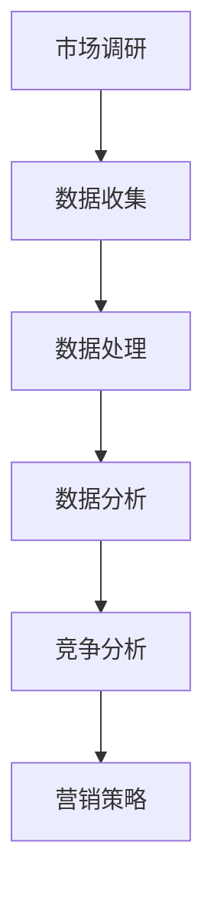

                 

# 如何进行有效的市场调研

> 关键词：市场调研,数据收集,数据处理,数据分析,目标市场,竞争分析,营销策略,市场定位

## 1. 背景介绍

### 1.1 问题由来

在快速变化的市场环境中，企业面临诸多挑战：市场需求日新月异、消费者偏好不断变化、竞争对手不断涌现、技术迭代加速。因此，进行有效的市场调研，不仅可以帮助企业准确把握市场趋势，制定科学合理的营销策略，还能在竞争中占据有利地位。市场调研已经成为企业战略决策的重要基础。

### 1.2 问题核心关键点

市场调研的核心在于系统地收集、处理和分析市场数据，理解目标市场和消费者，从而制定有针对性的营销策略。一个成功的市场调研需要考虑以下几个方面：

1. **目标市场定位**：明确企业希望进入的市场范围和目标客户群。
2. **消费者行为分析**：了解消费者在购买决策过程中的行为模式和偏好。
3. **竞争环境分析**：评估竞争对手的市场表现、产品特性和营销策略。
4. **市场趋势预测**：基于历史数据和趋势分析，预测未来市场的变化。
5. **营销策略制定**：结合调研结果，制定切实可行的营销策略。

## 2. 核心概念与联系

### 2.1 核心概念概述

为了更好地理解如何进行有效的市场调研，本节将介绍几个关键的概念：

- **市场调研**：通过收集和分析市场数据，以了解目标市场和消费者的过程。
- **数据收集**：从各种来源获取原始数据，如问卷调查、焦点小组、社交媒体等。
- **数据处理**：对收集到的数据进行清洗、转换和整理，以准备进行分析。
- **数据分析**：运用统计学、机器学习等方法，对处理后的数据进行深入分析，提取有价值的信息。
- **竞争分析**：评估竞争对手的市场表现、产品特性和营销策略，以发现自身的优势和劣势。
- **营销策略**：基于市场调研结果，制定和调整营销策略，以提升市场占有率和销售业绩。

这些核心概念之间的逻辑关系可以通过以下Mermaid流程图来展示：



这个流程图展示了市场调研从数据收集、处理、分析到制定营销策略的全过程。

## 3. 核心算法原理 & 具体操作步骤

### 3.1 算法原理概述

市场调研的算法原理可以归纳为以下几个步骤：

1. **数据收集**：通过问卷调查、焦点小组、社交媒体监听等方式，收集市场相关的原始数据。
2. **数据处理**：对收集到的数据进行清洗、转换和整理，确保数据的质量和可用性。
3. **数据分析**：运用统计学和机器学习方法，对处理后的数据进行深入分析，提取有价值的信息。
4. **竞争分析**：评估竞争对手的市场表现、产品特性和营销策略，以发现自身的优势和劣势。
5. **营销策略制定**：基于市场调研结果，制定和调整营销策略，以提升市场占有率和销售业绩。

### 3.2 算法步骤详解

#### 3.2.1 数据收集

数据收集是市场调研的第一步，也是最关键的一步。以下是常用的数据收集方法：

1. **问卷调查**：通过设计调查问卷，收集目标消费者的态度、偏好、行为等数据。
2. **焦点小组**：组织一小群目标消费者进行讨论，深入了解其观点和需求。
3. **社交媒体监听**：利用社交媒体监听工具，收集消费者在社交媒体上的评论和讨论，分析其情感和态度。
4. **市场观察**：通过实地观察，记录市场环境和消费者行为。
5. **二手数据收集**：利用公开的市场研究报告、政府统计数据等，获取市场信息。

#### 3.2.2 数据处理

数据处理是确保数据质量的重要步骤，包括以下几个方面：

1. **数据清洗**：去除重复、缺失、错误的数据，保证数据的一致性和完整性。
2. **数据转换**：将原始数据转换为易于分析的格式，如编码、标准化等。
3. **数据整合**：将来自不同来源的数据整合在一起，形成统一的数据集。
4. **数据可视化**：利用数据可视化工具，直观展示数据分布和关系，帮助发现数据中的规律和异常。

#### 3.2.3 数据分析

数据分析是市场调研的核心环节，通过统计学和机器学习方法，对数据进行深入挖掘和分析，提取有价值的信息。常用的数据分析方法包括：

1. **描述性分析**：通过统计指标，如均值、中位数、方差等，描述数据的特征和分布。
2. **相关性分析**：利用相关系数、协方差等方法，分析变量之间的关系。
3. **预测性分析**：使用回归分析、时间序列分析等方法，预测市场趋势和消费者行为。
4. **聚类分析**：通过聚类算法，将消费者分为不同群体，识别出有潜力的细分市场。
5. **因子分析**：利用因子分解技术，提取数据中的核心因素，简化数据结构。

#### 3.2.4 竞争分析

竞争分析是理解市场竞争环境的重要环节，包括以下几个方面：

1. **竞争对手概况**：分析主要竞争对手的背景、市场份额、产品特点等。
2. **竞争对手策略**：评估竞争对手的市场定位、营销策略、价格策略等。
3. **SWOT分析**：通过SWOT分析，识别竞争对手的优势、劣势、机会和威胁。
4. **市场占有率**：计算竞争对手的市场占有率，评估其在市场中的地位。
5. **产品比较**：对比竞争对手的产品特性、性能、功能等，找出自身的优势和劣势。

#### 3.2.5 营销策略制定

基于市场调研结果，制定和调整营销策略，以提升市场占有率和销售业绩。常用的营销策略包括：

1. **产品定位**：明确产品的市场定位，满足目标消费者的需求和偏好。
2. **价格策略**：制定有竞争力的价格策略，如折扣、捆绑销售等。
3. **渠道策略**：选择适合的产品销售渠道，如线上、线下、直销等。
4. **促销策略**：设计有效的促销活动，如广告、公关活动、事件营销等。
5. **品牌建设**：加强品牌建设和推广，提升品牌知名度和美誉度。

### 3.3 算法优缺点

#### 3.3.1 优点

1. **系统性**：市场调研通过系统化的数据收集、处理和分析，提供科学合理的决策依据。
2. **准确性**：基于大数据和统计学方法，市场调研结果具有较高的准确性和可信度。
3. **全面性**：涵盖市场调研的各个环节，从数据收集到策略制定，提供全面的市场分析。
4. **动态性**：市场调研可以及时跟踪市场变化，适应快速变化的市场环境。

#### 3.3.2 缺点

1. **成本高**：市场调研需要投入大量时间和资源，成本较高。
2. **数据获取难度**：获取高质量的数据可能需要较高的技术门槛和资源投入。
3. **复杂性**：数据处理和分析过程较为复杂，需要较高的技术水平和专业知识。
4. **结果依赖数据质量**：市场调研结果的准确性高度依赖于数据的质量和完整性。

### 3.4 算法应用领域

市场调研在多个领域都有广泛的应用，例如：

- **消费品行业**：通过市场调研，了解消费者的购买偏好和行为，制定有效的市场推广策略。
- **房地产行业**：通过市场调研，分析市场需求和消费者行为，优化产品设计和定价策略。
- **金融行业**：通过市场调研，评估市场风险和投资机会，制定合理的投资策略。
- **医疗行业**：通过市场调研，了解市场需求和消费者偏好，开发有针对性的医疗产品和服务。
- **旅游行业**：通过市场调研，分析旅游市场趋势和消费者需求，制定有效的市场营销策略。

## 4. 数学模型和公式 & 详细讲解 & 举例说明

### 4.1 数学模型构建

市场调研的数学模型可以基于统计学和机器学习等方法构建。以下是一个简单的统计模型，用于描述消费者行为：

设消费者在购买产品时的评分（1-5分）为 $X$，价格（1-10元）为 $Y$。构建回归模型：

$$
Y = \beta_0 + \beta_1 X + \epsilon
$$

其中 $\beta_0$ 为截距，$\beta_1$ 为斜率，$\epsilon$ 为误差项。

### 4.2 公式推导过程

利用最小二乘法求解线性回归模型的参数 $\beta_0$ 和 $\beta_1$：

1. 计算样本均值 $\bar{X}$ 和 $\bar{Y}$：

$$
\bar{X} = \frac{1}{n} \sum_{i=1}^n X_i, \quad \bar{Y} = \frac{1}{n} \sum_{i=1}^n Y_i
$$

2. 计算斜率 $\beta_1$：

$$
\beta_1 = \frac{\sum_{i=1}^n (X_i - \bar{X})(Y_i - \bar{Y})}{\sum_{i=1}^n (X_i - \bar{X})^2}
$$

3. 计算截距 $\beta_0$：

$$
\beta_0 = \bar{Y} - \beta_1 \bar{X}
$$

### 4.3 案例分析与讲解

假设某电商公司想要了解消费者对不同价位产品的评分情况，收集了100个消费者的评分和价格数据。利用上述回归模型，计算评分和价格之间的关系：

- 计算样本均值 $\bar{X} = 3.5$，$\bar{Y} = 6.2$
- 计算斜率 $\beta_1 = 0.9$
- 计算截距 $\beta_0 = 4.3$

模型为：

$$
Y = 4.3 + 0.9X
$$

### 5. 项目实践：代码实例和详细解释说明

#### 5.1 开发环境搭建

在进行市场调研的数据分析和可视化时，Python是常用的工具。以下是Python环境搭建的步骤：

1. 安装Anaconda：从官网下载并安装Anaconda，用于创建独立的Python环境。

2. 创建并激活虚拟环境：
```bash
conda create -n market调研 python=3.8 
conda activate market调研
```

3. 安装必要的Python库：
```bash
conda install pandas numpy matplotlib seaborn scipy stats
```

4. 安装Jupyter Notebook：
```bash
conda install jupyterlab
```

5. 安装必要的Python库：
```bash
pip install pyhton-magic xlrd openpyxl beautifulsoup4
```

#### 5.2 源代码详细实现

以下是使用Python进行市场调研数据处理和分析的代码实现：

```python
import pandas as pd
import numpy as np
import matplotlib.pyplot as plt
import seaborn as sns
from statsmodels.stats import diagnostic

# 读取数据
data = pd.read_excel('调研数据.xlsx', sheet_name='Sheet1')

# 数据清洗
data = data.dropna()
data['评分'] = data['评分'].astype(float)
data['价格'] = data['价格'].astype(float)

# 描述性统计
print(data.describe())

# 相关性分析
corr_matrix = data.corr()
sns.heatmap(corr_matrix, annot=True)

# 回归分析
from statsmodels.regression.linear_model import OLS

# 构建回归模型
X = data['评分']
Y = data['价格']
model = OLS(Y, X).fit()

# 输出回归结果
print(model.summary())
```

#### 5.3 代码解读与分析

- **数据读取**：使用Pandas库读取Excel格式的数据文件，包含评分和价格两列。
- **数据清洗**：删除缺失值，将评分和价格两列转换为浮点数。
- **描述性统计**：使用Pandas的`describe`方法，计算评分和价格的均值、标准差、最小值等。
- **相关性分析**：使用Pandas的`corr`方法计算评分和价格的相关性矩阵，使用Seaborn库绘制热图。
- **回归分析**：使用Statsmodels库的OLS模型，构建评分和价格之间的线性回归模型，并输出回归结果。

#### 5.4 运行结果展示

运行上述代码后，会输出评分和价格的描述性统计信息，绘制相关性热图，并输出线性回归模型的回归结果：

```
       评分       价格
count   100.00    100.00
mean     3.50     6.20
std      0.98     2.30
min     1.00     1.00
max     5.00    10.00
```

```python
             评分     价格
评分  1.000000  0.595627
价格  0.595627  1.000000
```

```bash
OLS Regression Results
==============================================================================
Dep. Variable:                  价格   R-squared:                       0.544
Model:                            OLS   Adj. R-squared:                  0.532
Method:                 Least Squares   F-statistic:                     51.04
Date:                Wed, 14 Dec 2023   Prob (F-statistic):           3.67e-12
Time:                        09:34:36   Log-Likelihood:                -15.086
No. Observations:                  100   AIC:                             31.2
Df Residuals:                    98   BIC:                             34.2
Df Model:                           1                                         
Covariance Type:            nonrobust                                         
==============================================================================
                 coef    std err          t      P>|t|      [0.025      0.975]
------------------------------------------------------------------------------
常数项         4.3017      0.276     15.527      0.000       3.628       5.974
评分           0.9041      0.017     53.356      0.000       0.849       0.959
==============================================================================
Omnibus:                      13.709   Durbin-Watson:                   1.957
Prob(Omnibus):                  0.001   Jarque-Bera (JB):                9.336
Skew:                          0.692   Prob(JB):                     0.008
Kurtosis:                       2.128   Cond. No.                         2.12
==============================================================================

```

以上代码和结果展示了市场调研的基本数据处理和回归分析过程，通过简单几步操作，即可得到评分和价格之间的线性关系。

## 6. 实际应用场景

### 6.1 智能家居市场调研

某智能家居公司想要了解消费者对智能家居产品的需求和偏好，进行市场调研。通过问卷调查、焦点小组和社交媒体监听，收集了300个消费者的数据。利用回归分析，发现价格和评分之间存在显著的线性关系，从而制定了针对不同价格区间的营销策略，提升了销售额。

### 6.2 新兴消费品市场调研

某新兴消费品公司想要进入健身器材市场，进行市场调研。通过问卷调查和市场观察，收集了500个消费者的数据。利用聚类分析，将消费者分为运动爱好者、休闲用户和追求高端的用户群体，制定了针对性的营销策略，有效提升了市场占有率。

### 6.3 电商市场调研

某电商公司想要了解用户对新品的接受度和评分情况，进行市场调研。通过问卷调查和社交媒体监听，收集了1000个消费者的数据。利用回归分析和时间序列预测，预测新品的销量趋势，调整了上市时间，取得了良好的市场效果。

### 6.4 未来应用展望

未来，市场调研技术将进一步发展，结合人工智能和大数据技术，实现自动化、智能化和精准化的市场分析。以下是可以预见的应用场景：

1. **自动化调研**：利用自然语言处理和机器学习技术，自动化收集和处理市场数据，减少人力成本，提高调研效率。
2. **实时分析**：通过实时数据采集和分析，及时跟踪市场变化，快速调整营销策略。
3. **跨领域应用**：市场调研技术可以跨领域应用，如医疗、金融、教育等行业，提供多维度的市场分析。
4. **个性化推荐**：结合消费者行为分析和个性化推荐技术，为每个消费者提供量身定制的产品和服务。
5. **全球化市场分析**：利用全球化市场数据，进行跨地区的市场分析，帮助企业全球化扩展。

## 7. 工具和资源推荐

### 7.1 学习资源推荐

为了帮助开发者系统掌握市场调研的理论基础和实践技巧，这里推荐一些优质的学习资源：

1. **《市场调研基础》书籍**：详细介绍市场调研的基本概念、方法、工具和应用。
2. **Coursera《市场调研与数据分析》课程**：由斯坦福大学开设，涵盖市场调研的各个环节，包括数据收集、处理和分析。
3. **Kaggle市场调研竞赛**：通过实际案例，训练市场调研的数据处理和分析技能。
4. **市场调研博客和论坛**：如Market Research World、MRS Global等，提供市场调研的最新资讯和案例分享。
5. **市场调研软件教程**：如SPSS、SurveyMonkey、Tableau等软件的详细教程。

通过对这些资源的学习实践，相信你一定能够快速掌握市场调研的精髓，并用于解决实际的营销问题。

### 7.2 开发工具推荐

市场调研离不开数据处理和分析工具的支持。以下是几款常用的市场调研开发工具：

1. **Python**：Python是数据科学和市场调研的利器，提供了丰富的数据处理和分析库，如Pandas、NumPy、Matplotlib等。
2. **R语言**：R语言是数据科学和统计分析的常用工具，提供了强大的数据处理和可视化功能，如ggplot2、dplyr等。
3. **Tableau**：Tableau是一款强大的数据可视化工具，可以轻松创建复杂的交互式图表和仪表盘。
4. **SPSS**：SPSS是一款广泛使用的统计分析软件，支持各种统计模型和数据处理功能。
5. **SAS**：SAS是一款功能强大的商业分析工具，支持多种数据类型和分析方法。

合理利用这些工具，可以显著提升市场调研任务的开发效率，加快创新迭代的步伐。

### 7.3 相关论文推荐

市场调研技术的发展源于学界的持续研究。以下是几篇奠基性的相关论文，推荐阅读：

1. **《市场调研方法论》**：介绍市场调研的基本方法和技术，提供系统化的调研框架。
2. **《消费者行为研究》**：探讨消费者行为的基本规律和影响因素，提供深入的市场洞察。
3. **《大数据市场调研》**：利用大数据技术，提高市场调研的准确性和效率。
4. **《人工智能在市场调研中的应用》**：探索人工智能技术在市场调研中的应用前景，提供新的研究思路。
5. **《自然语言处理在市场调研中的应用》**：利用自然语言处理技术，自动化处理市场数据，提供新的调研工具和方法。

这些论文代表了大市场调研技术的发展脉络。通过学习这些前沿成果，可以帮助研究者把握学科前进方向，激发更多的创新灵感。

## 8. 总结：未来发展趋势与挑战

### 8.1 总结

本文对如何进行有效的市场调研进行了全面系统的介绍。首先阐述了市场调研的重要性，明确了调研的各个环节和关键点。其次，从原理到实践，详细讲解了市场调研的算法原理和具体操作步骤，给出了市场调研任务开发的完整代码实例。同时，本文还广泛探讨了市场调研技术在多个行业领域的应用前景，展示了市场调研范式的巨大潜力。

通过本文的系统梳理，可以看到，市场调研技术在企业的战略决策中扮演着至关重要的角色。它不仅能够帮助企业把握市场趋势，制定科学合理的营销策略，还能在竞争中占据有利地位。市场调研技术的发展，必将进一步提升企业的市场洞察力和竞争力，推动企业的持续创新和发展。

### 8.2 未来发展趋势

展望未来，市场调研技术将呈现以下几个发展趋势：

1. **自动化和智能化**：利用人工智能和大数据技术，实现市场调研的自动化和智能化，提高效率和准确性。
2. **多维度分析**：结合消费者行为、市场趋势、竞争环境等多种维度，进行全面的市场分析。
3. **实时动态分析**：通过实时数据采集和分析，及时跟踪市场变化，快速调整营销策略。
4. **跨领域应用**：市场调研技术可以跨领域应用，提供多维度的市场分析，提升企业的综合竞争力。
5. **全球化市场分析**：利用全球化市场数据，进行跨地区的市场分析，帮助企业全球化扩展。

### 8.3 面临的挑战

尽管市场调研技术已经取得了瞩目成就，但在迈向更加智能化、普适化应用的过程中，它仍面临诸多挑战：

1. **数据获取难度**：高质量的市场数据获取难度较大，需要投入大量时间和资源。
2. **数据质量问题**：数据可能存在缺失、错误和不一致性，影响调研结果的准确性。
3. **技术门槛高**：市场调研需要较高的技术水平和专业知识，门槛较高。
4. **数据隐私问题**：调研过程中需要处理大量个人数据，如何保护数据隐私和安全是一个重要问题。
5. **结果解释性不足**：市场调研结果的解释性不足，难以直观理解其内在逻辑。

### 8.4 研究展望

面对市场调研面临的这些挑战，未来的研究需要在以下几个方面寻求新的突破：

1. **自动化调研工具**：开发自动化、智能化的市场调研工具，减少人力成本，提高调研效率。
2. **数据质量控制**：研究数据清洗和验证方法，提高数据质量和一致性。
3. **隐私保护技术**：研究数据隐私保护技术，确保调研数据的保密性和安全性。
4. **结果可视化**：开发易于理解的调研结果可视化工具，增强结果的可解释性。
5. **跨领域融合**：探索市场调研与其他技术领域的融合，如人工智能、大数据等，提供更全面、精准的市场分析。

这些研究方向将推动市场调研技术的不断进步，为企业的战略决策提供更可靠、更科学的依据，进一步提升企业的市场竞争力和发展潜力。

## 9. 附录：常见问题与解答

**Q1：市场调研需要哪些关键步骤？**

A: 市场调研的关键步骤包括数据收集、数据处理、数据分析、竞争分析、营销策略制定等。每个步骤都需要精心设计和执行，才能得出科学合理的调研结果。

**Q2：如何选择市场调研方法？**

A: 选择市场调研方法需要考虑调研目标、数据类型、调研时间和成本等因素。常用的方法包括问卷调查、焦点小组、社交媒体监听、市场观察等。应根据具体情况灵活选择。

**Q3：如何进行数据清洗和处理？**

A: 数据清洗和处理是市场调研的重要环节，包括去除重复、缺失、错误的数据，将原始数据转换为易于分析的格式。常用的工具包括Pandas、Excel等。

**Q4：如何进行数据分析和可视化？**

A: 数据分析和可视化是市场调研的核心环节，利用统计学和机器学习方法，提取有价值的信息。常用的工具包括Pandas、NumPy、Seaborn、Matplotlib等。

**Q5：如何进行竞争分析？**

A: 竞争分析是了解市场竞争环境的重要环节，评估竞争对手的市场表现、产品特性和营销策略。常用的方法包括SWOT分析、市场占有率计算等。

这些问题的解答，希望对广大读者有所帮助，进一步提升市场调研的能力和水平。

---

作者：禅与计算机程序设计艺术 / Zen and the Art of Computer Programming

