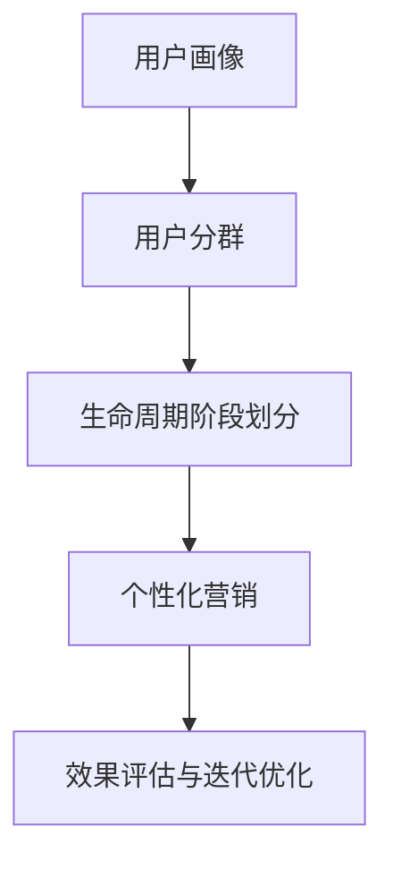

                 

## 1. 背景介绍

在数字化时代，用户生命周期管理(UCM, User Lifecycle Management)变得尤为重要。通过对用户行为数据的深度分析，企业可以制定出更加个性化的营销策略，从而提升用户满意度和忠诚度，增加用户生命周期价值。然而，如何高效、系统地进行用户生命周期管理，是企业面临的一项重要挑战。本文将从用户生命周期管理的核心概念、算法原理、实际操作以及实际应用场景等方面，深入探讨如何进行有效的用户生命周期管理。

### 1.1 问题由来

在数字营销领域，传统的流量驱动模式已经逐渐失效。仅依赖单一的广告投放，无法保证用户的长期粘性和品牌忠诚度。从简单地获取客户，到长期维持客户关系，企业需要转变思维方式，系统地进行用户生命周期管理。

### 1.2 问题核心关键点

用户生命周期管理聚焦于对用户全生命周期内的行为数据进行分析，挖掘不同阶段的潜在需求和行为模式，从而提供精准的营销策略和个性化的用户体验。其核心关键点在于：

- 数据收集：通过多种渠道（如网站、APP、社交媒体等）获取用户行为数据。
- 用户画像构建：基于用户行为数据构建详细的用户画像，以便全面了解用户特征。
- 用户分群：通过聚类算法或分类算法对用户进行分层，方便精准定位。
- 生命周期阶段划分：将用户生命周期划分为不同阶段，针对不同阶段的用户，制定相应的策略。
- 营销策略制定：结合用户画像和生命周期阶段，制定个性化营销策略。
- 效果评估与迭代优化：不断跟踪营销策略效果，根据反馈结果迭代优化。

### 1.3 问题研究意义

用户生命周期管理能够为企业提供全方位的用户洞察，指导企业进行精准营销，实现用户留存和增值。其研究意义在于：

- 提升用户满意度和忠诚度：通过个性化的营销策略，增强用户粘性。
- 优化营销投入：精准定位用户，避免资源浪费，提高营销ROI。
- 增强市场竞争力：提供用户全生命周期的价值管理，帮助企业在激烈的市场竞争中脱颖而出。
- 推动业务创新：通过深入理解用户行为，企业能够发现新的业务机会，实现创新突破。

## 2. 核心概念与联系

### 2.1 核心概念概述

为了更好地理解用户生命周期管理，本节将介绍几个密切相关的核心概念：

- **用户生命周期管理(UCM, User Lifecycle Management)**：是指对用户全生命周期内的行为数据进行分析，挖掘不同阶段的潜在需求和行为模式，从而提供精准的营销策略和个性化的用户体验。

- **用户画像(User Persona)**：基于用户行为数据构建详细的用户画像，以便全面了解用户特征。用户画像包括用户的地理位置、年龄、性别、兴趣偏好、消费习惯等。

- **用户分群(Segmentation)**：通过聚类算法或分类算法对用户进行分层，方便精准定位。用户分群可以基于不同维度进行，如行为、价值、人口统计特征等。

- **生命周期阶段(Lifecycle Stage)**：将用户生命周期划分为不同阶段，针对不同阶段的用户，制定相应的策略。常见生命周期阶段包括潜在客户、新客户、忠诚客户、流失客户等。

- **个性化营销(Personalized Marketing)**：结合用户画像和生命周期阶段，制定个性化营销策略，提高用户体验和满意度。

- **效果评估与迭代优化(Measurement & Optimization)**：不断跟踪营销策略效果，根据反馈结果迭代优化，提升营销效果。

这些核心概念之间的逻辑关系可以通过以下Mermaid流程图来展示：



这个流程图展示了大语言模型的核心概念及其之间的关系：

1. 用户画像通过分析用户行为数据构建，提供全面的用户洞察。
2. 用户分群将用户进行分层，方便精准定位和策略制定。
3. 生命周期阶段划分将用户划分为不同阶段，便于针对不同阶段的用户制定策略。
4. 个性化营销结合用户画像和生命周期阶段，制定个性化的营销策略。
5. 效果评估与迭代优化根据营销策略的效果，不断调整优化。

这些概念共同构成了用户生命周期管理的理论基础，使其能够有效地指导企业进行精准营销和用户管理。

## 3. 核心算法原理 & 具体操作步骤

### 3.1 算法原理概述

用户生命周期管理的核心在于通过分析用户行为数据，挖掘用户在不同生命周期阶段的行为特征，并制定相应的营销策略。其算法原理可概括为以下几个步骤：

1. **数据收集**：通过多种渠道获取用户行为数据，如网站访问记录、APP使用日志、社交媒体互动等。
2. **数据预处理**：清洗和标准化数据，去除噪声和异常值。
3. **用户画像构建**：基于处理后的数据构建用户画像，包含用户的基本信息、行为特征、消费习惯等。
4. **用户分群**：通过聚类算法或分类算法对用户进行分层，方便精准定位。
5. **生命周期阶段划分**：根据用户行为数据，划分用户生命周期阶段。
6. **营销策略制定**：结合用户画像和生命周期阶段，制定个性化营销策略。
7. **效果评估与迭代优化**：跟踪营销策略效果，根据反馈结果迭代优化。

### 3.2 算法步骤详解

以下是用户生命周期管理的详细操作步骤：

#### 3.2.1 数据收集

用户生命周期管理的第一步是数据收集。通过多种渠道获取用户行为数据，如网站访问记录、APP使用日志、社交媒体互动等。

- **网站数据**：通过网站分析工具（如Google Analytics）获取用户访问记录，包括访问时间、页面浏览量、停留时间、跳出率等。
- **APP数据**：通过移动应用统计工具（如Flurry Analytics）获取用户行为数据，包括应用打开次数、使用时长、功能使用情况等。
- **社交媒体数据**：通过社交媒体分析工具（如Facebook Insights、Twitter Analytics）获取用户互动数据，包括点赞、评论、分享等。

#### 3.2.2 数据预处理

数据预处理是数据清洗和标准化的过程，目的是提高数据质量，为后续分析提供可靠的基础。

- **清洗数据**：去除数据中的噪声和异常值，如缺失值、重复值、错误值等。
- **标准化数据**：对数据进行标准化处理，使其符合后续分析的要求。例如，对访问时间进行归一化处理，使其统一为小时或分钟。

#### 3.2.3 用户画像构建

用户画像构建是通过分析用户行为数据，构建详细的用户画像，以便全面了解用户特征。

- **基本信息**：包括用户的地理位置、年龄、性别、教育背景等。
- **行为特征**：包括用户的访问时间、页面浏览量、停留时间、跳出率等。
- **消费习惯**：包括用户的购买记录、浏览历史、收藏商品等。

#### 3.2.4 用户分群

用户分群是通过聚类算法或分类算法对用户进行分层，方便精准定位。

- **聚类算法**：如K-means、层次聚类等，将用户按照相似性分为不同的群组。
- **分类算法**：如决策树、随机森林等，根据用户特征进行分类。

#### 3.2.5 生命周期阶段划分

生命周期阶段划分是根据用户行为数据，将用户划分为不同阶段，方便制定相应的策略。

- **潜在客户**：从未访问过网站的用户，需要吸引其首次访问。
- **新客户**：首次访问网站的用户，需要进行引导转化。
- **忠诚客户**：多次访问网站并购买商品的用户，需要保持其忠诚度。
- **流失客户**：长时间未访问网站或未购买商品的用户，需要重新吸引。

#### 3.2.6 营销策略制定

营销策略制定是结合用户画像和生命周期阶段，制定个性化营销策略。

- **潜在客户**：通过邮件营销、搜索引擎优化（SEO）等方式吸引首次访问。
- **新客户**：提供优惠促销、推荐商品、个性化推荐等，引导转化。
- **忠诚客户**：提供会员专属优惠、积分奖励、个性化推荐等，保持忠诚度。
- **流失客户**：通过邮件营销、个性化推荐等方式，重新吸引。

#### 3.2.7 效果评估与迭代优化

效果评估与迭代优化是根据营销策略的效果，不断调整优化，提升营销效果。

- **效果评估**：通过统计指标（如转化率、回购率、客户满意度等）评估营销策略的效果。
- **迭代优化**：根据评估结果，调整优化营销策略，如优化广告投放渠道、调整促销活动时间等。

### 3.3 算法优缺点

用户生命周期管理的算法具有以下优点：

- **提升用户满意度和忠诚度**：通过个性化的营销策略，增强用户粘性。
- **优化营销投入**：精准定位用户，避免资源浪费，提高营销ROI。
- **增强市场竞争力**：提供用户全生命周期的价值管理，帮助企业在激烈的市场竞争中脱颖而出。
- **推动业务创新**：通过深入理解用户行为，企业能够发现新的业务机会，实现创新突破。

同时，该方法也存在一定的局限性：

- **数据质量要求高**：数据质量直接影响到用户画像和分群结果，需要保证数据来源的多样性和完整性。
- **算法复杂度较高**：聚类、分类等算法需要较高的计算资源，需要较强的技术支持。
- **用户隐私问题**：收集和分析用户数据涉及隐私问题，需要遵守相关的法律法规。

尽管存在这些局限性，但就目前而言，用户生命周期管理是提升用户价值的重要手段，值得企业在实践中广泛应用。

### 3.4 算法应用领域

用户生命周期管理在多个领域已经得到了广泛的应用，例如：

- **电商领域**：通过分析用户行为数据，提升用户转化率和购物体验。
- **金融领域**：通过分析客户行为，提高客户留存率和交叉销售率。
- **媒体领域**：通过分析用户互动数据，提高广告投放效果和用户满意度。
- **旅游领域**：通过分析用户行为数据，提升客户粘性和复购率。
- **教育领域**：通过分析学生行为数据，提高学习效果和用户参与度。

除了上述这些领域，用户生命周期管理还可以应用于医疗、公共服务、能源等多个行业，帮助企业提升服务质量和用户体验。

## 4. 数学模型和公式 & 详细讲解 & 举例说明

### 4.1 数学模型构建

用户生命周期管理的数学模型可以概括为以下几个部分：

1. **用户行为数据**：通过多种渠道获取用户行为数据，如网站访问记录、APP使用日志、社交媒体互动等。
2. **用户画像构建**：基于用户行为数据构建用户画像，包含用户的基本信息、行为特征、消费习惯等。
3. **用户分群**：通过聚类算法或分类算法对用户进行分层，方便精准定位。
4. **生命周期阶段划分**：根据用户行为数据，划分用户生命周期阶段。
5. **营销策略制定**：结合用户画像和生命周期阶段，制定个性化营销策略。
6. **效果评估与迭代优化**：通过统计指标评估营销策略的效果，根据反馈结果迭代优化。

### 4.2 公式推导过程

以下是用户生命周期管理的数学模型公式推导过程：

假设用户行为数据为 $D=\{(x_i,y_i)\}_{i=1}^N, x_i \in \mathcal{X}, y_i \in \mathcal{Y}$，其中 $x_i$ 为输入特征，$y_i$ 为行为标签。用户画像表示为 $P$，用户分群表示为 $S$，生命周期阶段表示为 $L$，营销策略表示为 $M$，效果评估指标表示为 $E$。

用户画像构建的数学模型为：

$$
P=f(x)
$$

其中 $f$ 为数据处理函数，用于将用户行为数据转换为用户画像。

用户分群的数学模型为：

$$
S=g(P)
$$

其中 $g$ 为聚类或分类算法，用于将用户画像分为不同的群组。

生命周期阶段的数学模型为：

$$
L=h(S)
$$

其中 $h$ 为划分函数，用于根据用户分群划分生命周期阶段。

营销策略制定的数学模型为：

$$
M=k(L,P)
$$

其中 $k$ 为策略制定函数，用于根据用户画像和生命周期阶段制定营销策略。

效果评估的数学模型为：

$$
E=h(M,D)
$$

其中 $h$ 为评估函数，用于评估营销策略的效果。

迭代优化的数学模型为：

$$
M^* \leftarrow M - \eta \nabla_{M}E
$$

其中 $\eta$ 为优化算法中的学习率，$\nabla_{M}E$ 为营销策略效果对策略的梯度。

### 4.3 案例分析与讲解

以电商领域的用户生命周期管理为例，分析其具体实现过程：

#### 4.3.1 数据收集

电商网站通过以下方式收集用户行为数据：

- **网站访问记录**：通过网站分析工具获取用户访问记录，包括访问时间、页面浏览量、停留时间、跳出率等。
- **APP使用日志**：通过移动应用统计工具获取用户行为数据，包括应用打开次数、使用时长、功能使用情况等。
- **社交媒体互动**：通过社交媒体分析工具获取用户互动数据，包括点赞、评论、分享等。

#### 4.3.2 数据预处理

电商网站对收集到的数据进行以下预处理：

- **清洗数据**：去除数据中的噪声和异常值，如缺失值、重复值、错误值等。
- **标准化数据**：对数据进行标准化处理，使其符合后续分析的要求。例如，对访问时间进行归一化处理，使其统一为小时或分钟。

#### 4.3.3 用户画像构建

电商网站通过以下方式构建用户画像：

- **基本信息**：包括用户的地理位置、年龄、性别、教育背景等。
- **行为特征**：包括用户的访问时间、页面浏览量、停留时间、跳出率等。
- **消费习惯**：包括用户的购买记录、浏览历史、收藏商品等。

#### 4.3.4 用户分群

电商网站通过以下方式对用户进行分群：

- **聚类算法**：如K-means、层次聚类等，将用户按照相似性分为不同的群组。
- **分类算法**：如决策树、随机森林等，根据用户特征进行分类。

#### 4.3.5 生命周期阶段划分

电商网站通过以下方式划分用户生命周期阶段：

- **潜在客户**：从未访问过网站的用户，需要吸引其首次访问。
- **新客户**：首次访问网站的用户，需要进行引导转化。
- **忠诚客户**：多次访问网站并购买商品的用户，需要保持其忠诚度。
- **流失客户**：长时间未访问网站或未购买商品的用户，需要重新吸引。

#### 4.3.6 营销策略制定

电商网站通过以下方式制定营销策略：

- **潜在客户**：通过邮件营销、搜索引擎优化（SEO）等方式吸引首次访问。
- **新客户**：提供优惠促销、推荐商品、个性化推荐等，引导转化。
- **忠诚客户**：提供会员专属优惠、积分奖励、个性化推荐等，保持忠诚度。
- **流失客户**：通过邮件营销、个性化推荐等方式，重新吸引。

#### 4.3.7 效果评估与迭代优化

电商网站通过以下方式评估营销策略的效果：

- **效果评估**：通过统计指标（如转化率、回购率、客户满意度等）评估营销策略的效果。
- **迭代优化**：根据评估结果，调整优化营销策略，如优化广告投放渠道、调整促销活动时间等。

## 5. 项目实践：代码实例和详细解释说明

### 5.1 开发环境搭建

在进行用户生命周期管理项目实践前，我们需要准备好开发环境。以下是使用Python进行项目开发的开发环境配置流程：

1. 安装Anaconda：从官网下载并安装Anaconda，用于创建独立的Python环境。

2. 创建并激活虚拟环境：
```bash
conda create -n ucm-env python=3.8 
conda activate ucm-env
```

3. 安装必要的工具包：
```bash
pip install pandas numpy matplotlib scikit-learn matplotlib jupyter notebook ipython
```

完成上述步骤后，即可在`ucm-env`环境中开始项目实践。

### 5.2 源代码详细实现

下面以用户生命周期管理为例，给出使用Python进行用户画像构建、用户分群、生命周期阶段划分和营销策略制定的代码实现。

首先，定义数据处理函数：

```python
import pandas as pd

def preprocess_data(data):
    # 清洗数据
    data.dropna(inplace=True)
    data = data[(data['stay_time'] > 0) & (data['page_count'] > 0)]
    data['stay_time'] = data['stay_time'].fillna(0)
    data['page_count'] = data['page_count'].fillna(0)
    
    # 标准化数据
    data['stay_time'] = data['stay_time'] / 24
    data['page_count'] = data['page_count'] / 100
    
    return data
```

然后，定义用户画像构建函数：

```python
def build_user_profile(data):
    # 基本信息
    profile = {}
    profile['age'] = data['age'].mean()
    profile['gender'] = data['gender'].mode()[0]
    profile['location'] = data['location'].mode()[0]
    
    # 行为特征
    profile['stay_time'] = data['stay_time'].mean()
    profile['page_count'] = data['page_count'].mean()
    
    # 消费习惯
    profile['purchase_count'] = data['purchase_count'].mean()
    profile['average_cost'] = data['cost'].mean()
    
    return profile
```

接着，定义用户分群函数：

```python
from sklearn.cluster import KMeans

def cluster_users(data):
    # 聚类算法
    kmeans = KMeans(n_clusters=5)
    kmeans.fit(data[['stay_time', 'page_count']])
    labels = kmeans.predict(data[['stay_time', 'page_count']])
    
    return labels
```

然后，定义生命周期阶段划分函数：

```python
def map_lifecycle_stage(labels):
    # 生命周期阶段划分
    stage_mapping = {
        0: '潜在客户',
        1: '新客户',
        2: '忠诚客户',
        3: '流失客户'
    }
    
    return [stage_mapping[label] for label in labels]
```

最后，定义营销策略制定函数：

```python
def define_marketing_strategy(data, stage):
    # 营销策略制定
    if stage == '潜在客户':
        strategy = 'SEO and PPC'
    elif stage == '新客户':
        strategy = '优惠券和个性化推荐'
    elif stage == '忠诚客户':
        strategy = '会员专属优惠'
    else:
        strategy = '邮件营销'
    
    return strategy
```

使用上述函数进行用户画像构建、用户分群、生命周期阶段划分和营销策略制定：

```python
# 加载数据
data = pd.read_csv('user_data.csv')

# 数据预处理
data = preprocess_data(data)

# 用户画像构建
user_profile = build_user_profile(data)

# 用户分群
labels = cluster_users(data)

# 生命周期阶段划分
life_cycle_stages = map_lifecycle_stage(labels)

# 营销策略制定
marketing_strategies = [define_marketing_strategy(data, stage) for stage in life_cycle_stages]

print(user_profile)
print(labels)
print(life_cycle_stages)
print(marketing_strategies)
```

以上就是用户生命周期管理项目的完整代码实现。可以看到，Python通过Pandas、Scikit-learn等库，可以方便地进行数据处理、聚类、分类等操作，非常适合进行用户生命周期管理的实践。

### 5.3 代码解读与分析

让我们再详细解读一下关键代码的实现细节：

**preprocess_data函数**：
- 数据清洗：去除缺失值、异常值。
- 数据标准化：将访问时间归一化，将页面访问量标准化。

**build_user_profile函数**：
- 计算用户基本信息：如年龄、性别、地理位置。
- 计算用户行为特征：如停留时间、页面访问量。
- 计算用户消费习惯：如购买次数、平均消费金额。

**cluster_users函数**：
- 聚类算法：使用K-means算法对用户进行聚类，将用户分为5个不同的群组。

**map_lifecycle_stage函数**：
- 生命周期阶段划分：将聚类结果映射为不同的生命周期阶段。

**define_marketing_strategy函数**：
- 营销策略制定：根据用户生命周期阶段，制定不同的营销策略。

**整体代码流程**：
- 数据加载和预处理。
- 用户画像构建。
- 用户分群。
- 生命周期阶段划分。
- 营销策略制定。
- 结果输出。

可以看到，通过Python等工具，用户生命周期管理的具体实现过程非常简单，只要理清数据流程和函数调用，就可以快速完成项目开发。

## 6. 实际应用场景

### 6.1 电商领域

电商领域是用户生命周期管理的典型应用场景。电商平台通过收集用户行为数据，构建详细的用户画像，划分生命周期阶段，制定个性化营销策略，从而提升用户满意度和忠诚度，增加用户生命周期价值。

在具体实践中，电商平台可以基于用户生命周期管理模型，实时监测用户行为，及时调整营销策略，实现用户留存和增值。例如，对于首次访问网站的用户，电商平台可以通过邮件营销、搜索引擎优化（SEO）等方式吸引其首次访问；对于多次访问网站并购买商品的用户，电商平台可以提供会员专属优惠、积分奖励、个性化推荐等，保持其忠诚度。

### 6.2 金融领域

金融领域也需要通过用户生命周期管理，了解客户行为，提升客户留存率和交叉销售率。例如，银行可以基于用户生命周期管理模型，分析客户行为数据，识别出高价值客户和潜在流失客户，制定相应的营销策略。

在具体实践中，银行可以基于用户生命周期管理模型，实时监测客户行为，及时调整营销策略，实现客户留存和增值。例如，对于新客户，银行可以提供优惠利率、推荐理财产品等，引导客户进行更多的金融交易；对于潜在流失客户，银行可以通过电话营销、个性化推荐等方式，重新吸引客户。

### 6.3 媒体领域

媒体领域可以通过用户生命周期管理，提高广告投放效果和用户满意度。例如，新闻媒体可以通过用户生命周期管理模型，分析用户互动数据，识别出高互动用户和潜在流失用户，制定相应的营销策略。

在具体实践中，媒体可以基于用户生命周期管理模型，实时监测用户行为，及时调整广告投放策略，实现用户留存和增值。例如，对于高互动用户，媒体可以提供定制化的新闻推荐、互动活动等，增强用户粘性；对于潜在流失用户，媒体可以通过个性化推荐、互动话题等方式，重新吸引用户。

### 6.4 旅游领域

旅游领域可以通过用户生命周期管理，提升客户粘性和复购率。例如，旅游网站可以基于用户生命周期管理模型，分析用户行为数据，识别出高价值客户和潜在流失客户，制定相应的营销策略。

在具体实践中，旅游网站可以基于用户生命周期管理模型，实时监测用户行为，及时调整营销策略，实现客户留存和增值。例如，对于新客户，旅游网站可以提供优惠促销、推荐景点、个性化推荐等，引导客户进行更多的旅游活动；对于潜在流失客户，旅游网站可以通过邮件营销、个性化推荐等方式，重新吸引客户。

### 6.5 教育领域

教育领域可以通过用户生命周期管理，提高学习效果和用户参与度。例如，在线教育平台可以通过用户生命周期管理模型，分析学生行为数据，识别出高价值学生和潜在流失学生，制定相应的营销策略。

在具体实践中，在线教育平台可以基于用户生命周期管理模型，实时监测学生行为，及时调整营销策略，实现学生留存和增值。例如，对于新学生，在线教育平台可以提供免费试听、个性化推荐等，吸引其参与学习；对于潜在流失学生，在线教育平台可以通过邮件营销、个性化推荐等方式，重新吸引学生。

## 7. 工具和资源推荐

### 7.1 学习资源推荐

为了帮助开发者系统掌握用户生命周期管理的理论基础和实践技巧，这里推荐一些优质的学习资源：

1. 《用户生命周期管理指南》：由知名NLP专家撰写，系统介绍了用户生命周期管理的核心概念、算法原理和实践技巧。

2. 《数据挖掘与统计学习》：介绍了数据预处理、聚类、分类等关键技术，适合初学者快速入门。

3. 《Python数据科学手册》：系统介绍了Python在数据处理、机器学习、数据可视化等方面的应用，适合深入学习。

4. Scikit-learn官方文档：介绍了Scikit-learn库中各种算法的用法和性能评估方法，是数据分析和机器学习的必备资源。

5. Kaggle：提供了大量的数据集和竞赛，适合进行实战练习和经验分享。

通过对这些资源的学习实践，相信你一定能够快速掌握用户生命周期管理的精髓，并用于解决实际的NLP问题。

### 7.2 开发工具推荐

高效的开发离不开优秀的工具支持。以下是几款用于用户生命周期管理开发的常用工具：

1. Python：基于Python的开源编程语言，灵活方便，适用于数据分析和机器学习任务。

2. Pandas：基于Python的数据处理库，支持大规模数据集的操作和分析。

3. Scikit-learn：基于Python的机器学习库，支持分类、聚类、回归等任务。

4. K-means：基于Python的聚类算法，适合进行用户分群。

5. Scikit-learn官网：提供了丰富的学习资源和实战样例，适合进行深入学习。

6. Jupyter Notebook：基于Python的交互式笔记本，支持代码和文档的混合编写和执行。

合理利用这些工具，可以显著提升用户生命周期管理的开发效率，加快创新迭代的步伐。

### 7.3 相关论文推荐

用户生命周期管理的理论研究源于学界的持续探索。以下是几篇奠基性的相关论文，推荐阅读：

1. Customer Lifetime Value Prediction: A Comparative Study：分析了多种客户生命周期价值预测方法，并进行了效果对比。

2. Segmentation and Analysis of Customer Lifetime Value (CLV)：介绍了客户分群和生命周期价值分析的方法，并进行案例分析。

3. The Influence of Customer Lifetime Value (CLV) on Customer Retention Strategies：探讨了生命周期价值对客户保留策略的影响，并提出了相应的策略建议。

4. The Effect of Customer Lifetime Value (CLV) on Sales Growth：分析了生命周期价值对销售增长的影响，并提出了相应的营销策略。

5. Customer Segmentation and Lifetime Value Analysis：介绍了客户分群和生命周期价值分析的方法，并进行案例分析。

这些论文代表了大语言模型微调技术的发展脉络。通过学习这些前沿成果，可以帮助研究者把握学科前进方向，激发更多的创新灵感。

## 8. 总结：未来发展趋势与挑战

### 8.1 研究成果总结

本文对用户生命周期管理的核心概念、算法原理、操作步骤以及实际应用进行了全面系统的介绍。具体内容包括：

- **数据收集**：通过多种渠道获取用户行为数据。
- **数据预处理**：清洗和标准化数据，提高数据质量。
- **用户画像构建**：基于用户行为数据构建详细的用户画像。
- **用户分群**：通过聚类或分类算法对用户进行分层。
- **生命周期阶段划分**：根据用户行为数据划分用户生命周期阶段。
- **营销策略制定**：结合用户画像和生命周期阶段，制定个性化营销策略。
- **效果评估与迭代优化**：跟踪营销策略效果，根据反馈结果迭代优化。

通过本文的系统梳理，可以看到，用户生命周期管理能够为企业提供全方位的用户洞察，指导企业进行精准营销，实现用户留存和增值。

### 8.2 未来发展趋势

展望未来，用户生命周期管理将呈现以下几个发展趋势：

1. **数据质量提升**：随着数据采集和处理技术的不断进步，用户行为数据将变得更加丰富和多样化。高质量的数据将进一步提升用户画像和分群的效果，提高营销策略的精准性。

2. **算法技术创新**：聚类、分类等算法的不断发展，将带来更加高效的用户分群和生命周期阶段划分方法。深度学习等高级算法将进一步提升营销策略的制定效果。

3. **跨领域应用拓展**：用户生命周期管理将从电商、金融等单一领域，向更多行业领域拓展，如旅游、医疗、能源等。不同领域的用户需求和行为特征，将推动用户生命周期管理技术的创新和发展。

4. **个性化营销增强**：结合自然语言处理、知识图谱等技术，用户生命周期管理将更加精准，能够提供更加个性化的营销策略，提升用户体验和满意度。

5. **全渠道整合**：用户生命周期管理将实现跨渠道整合，将线上和线下的用户行为数据进行整合分析，提供更加全面的用户洞察。

6. **智能化应用提升**：通过机器学习、人工智能等技术，用户生命周期管理将更加智能化，能够自动生成营销策略，实现自动化、智能化管理。

以上趋势凸显了用户生命周期管理的广阔前景。这些方向的探索发展，必将进一步提升用户价值，推动企业数字化转型的进程。

### 8.3 面临的挑战

尽管用户生命周期管理已经取得了显著的成效，但在实现全流程、智能化、跨领域应用的过程中，仍面临诸多挑战：

1. **数据隐私问题**：收集和分析用户数据涉及隐私问题，需要遵守相关的法律法规，保护用户隐私。

2. **数据质量差异**：不同渠道的数据质量差异较大，需要保证数据来源的多样性和完整性。

3. **算法复杂度高**：聚类、分类等算法需要较高的计算资源，需要较强的技术支持。

4. **策略执行难度**：制定好的营销策略需要得到有效的执行，不同渠道的执行方式不同，需要多渠道协同。

5. **个性化需求多样**：不同用户对个性化策略的需求不同，需要灵活调整营销策略。

6. **跨领域应用复杂**：不同领域的用户需求和行为特征不同，需要针对性地进行数据处理和算法优化。

尽管存在这些挑战，但通过不断优化技术、完善法规、加强协同，用户生命周期管理必将实现更好的应用效果。

### 8.4 研究展望

未来，用户生命周期管理需要在以下几个方面进行更深入的研究：

1. **跨模态数据融合**：将用户在不同模态下的数据进行融合，提供更加全面的用户洞察。

2. **算法集成优化**：将多种算法进行集成优化，提供更加精准的用户分群和生命周期阶段划分。

3. **数据隐私保护**：加强数据隐私保护，保证用户数据的安全性和合法性。

4. **自动化策略生成**：开发自动化策略生成工具，提升营销策略制定的效率和效果。

5. **多渠道协同**：实现跨渠道的用户行为数据整合，提升策略执行的效果。

6. **智能化应用**：引入深度学习等技术，提升用户生命周期管理的智能化水平。

这些研究方向将推动用户生命周期管理技术的发展，进一步提升用户价值，帮助企业实现数字化转型。面向未来，用户生命周期管理技术将不断突破，为经济社会的发展注入新的动力。

## 9. 附录：常见问题与解答

**Q1：用户生命周期管理是否适用于所有行业？**

A: 用户生命周期管理在多数行业中都有广泛应用，但不同行业的应用场景和数据特征有所不同。例如，电商、金融、旅游等行业的用户行为数据较为丰富，适合进行详细分析；而医疗、教育等行业的用户行为数据相对较少，需要进行数据增强和预处理。

**Q2：如何进行用户分群？**

A: 用户分群可以通过聚类算法（如K-means、层次聚类等）或分类算法（如决策树、随机森林等）进行。聚类算法将用户按照相似性分为不同的群组，分类算法根据用户特征进行分类。

**Q3：用户画像如何构建？**

A: 用户画像可以通过对用户行为数据进行分析，计算出用户的基本信息、行为特征和消费习惯。例如，用户的年龄、性别、地理位置、访问时间、页面浏览量、停留时间、跳出率、购买记录、浏览历史等。

**Q4：如何提高数据质量？**

A: 数据质量直接影响用户画像和分群的效果，提高数据质量是用户生命周期管理的关键步骤。可以通过以下方式提高数据质量：

- **数据清洗**：去除缺失值、异常值、错误值等。
- **数据标准化**：对数据进行标准化处理，使其符合后续分析的要求。
- **数据增强**：通过回译、近义替换等方式扩充训练集，提高数据多样性。

**Q5：如何优化营销策略？**

A: 营销策略的优化需要结合用户画像和生命周期阶段，制定个性化的营销策略。具体优化方法包括：

- **数据驱动**：基于数据分析结果，及时调整营销策略。
- **A/B测试**：通过A/B测试比较不同策略的效果，选择最优策略。
- **多渠道协同**：将不同渠道的用户行为数据进行整合分析，实现多渠道协同优化。

通过对这些问题的解答，希望能为读者提供更加全面的用户生命周期管理知识，帮助企业在实际应用中更好地进行精准营销和用户管理。

---

作者：禅与计算机程序设计艺术 / Zen and the Art of Computer Programming

