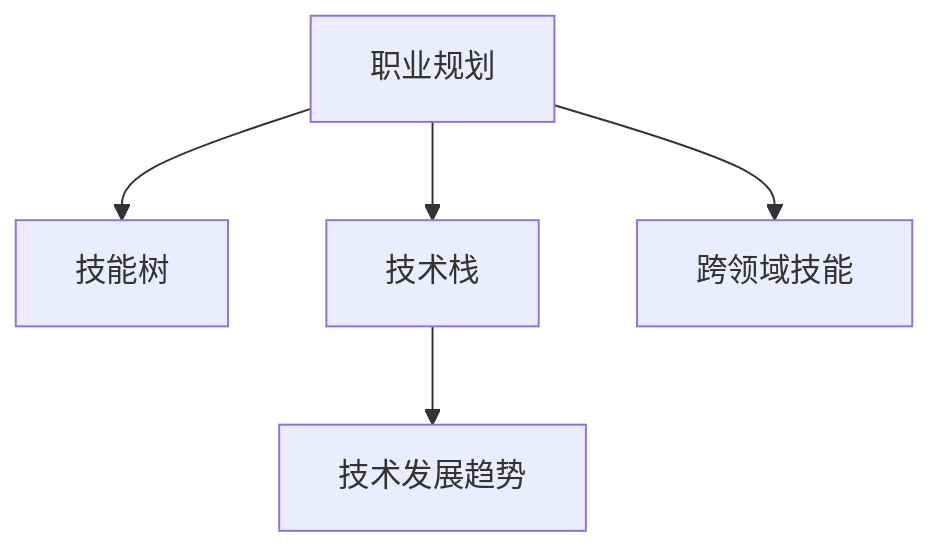

                 

# 如何进行职业规划：如何找到适合自己的职业道路？

> 关键词：职业规划, 职业道路, 技术发展, 人工智能, 计算机科学, 技能提升, 职业发展策略

## 1. 背景介绍

### 1.1 问题由来
职业规划是每个职业人成长过程中必不可少的一环。无论是初入职场的新手，还是已经在职场有所成就的专业人士，一个清晰合理的职业规划都可以在职业发展的各个阶段提供方向和动力。然而，职业规划并非易事，尤其是对于正在面临职业选择和技术发展的冲击。随着技术的快速迭代，如何在纷繁复杂的职业路径中找到最适合自己的道路，成为了很多职业人面临的问题。

### 1.2 问题核心关键点
职业规划的核心在于了解自身的兴趣、技能和价值观，同时结合当前和未来的技术趋势，制定出一条既能发挥自身优势，又符合未来发展方向的道路。这其中涉及的技术和软技能包括但不限于：算法与数据结构、机器学习与深度学习、软件工程、项目管理、团队协作、沟通技巧等。

### 1.3 问题研究意义
一个合理的职业规划可以帮助职业人实现自我价值，提升工作效率，避免盲目跳槽，同时也为职业生涯的长远发展打下坚实的基础。对于组织而言，职业规划可以优化人力资源配置，提升团队整体效率，增强组织竞争力。

## 2. 核心概念与联系

### 2.1 核心概念概述

为更好地理解如何进行职业规划，本文将介绍几个核心概念：

- **职业规划**：基于个人兴趣、技能和价值观，结合当前和未来的技术趋势，制定出符合自身发展的职业发展道路。

- **技能树**：将各种技术和软技能划分为多个层级，形成一个树形结构，帮助职业人识别需要优先掌握的核心技能和外围技能。

- **技术栈**：特定领域或职位所需的技术和工具的集合，包括编程语言、框架、库、工具等。

- **技术发展趋势**：结合当前的技术热点和未来趋势，预测哪些技术和工具将会成为行业标准或热点。

- **跨领域技能**：除了特定领域的技能外，对于软件工程师、数据科学家、产品经理等职业，跨领域技能如沟通、团队协作、问题解决等同样重要。

这些概念之间的逻辑关系可以通过以下Mermaid流程图来展示：



这个流程图展示了一系列概念之间的联系：

1. 职业规划基于技能树，识别关键技能和辅助技能。
2. 技术栈为职业发展提供必要的技术储备。
3. 技术发展趋势指导技能树的扩展和提升。
4. 跨领域技能贯穿整个职业发展，提升职业的综合能力。

## 3. 核心算法原理 & 具体操作步骤
### 3.1 算法原理概述

职业规划的核心算法可以理解为一种基于数据驱动的决策支持系统，它通过分析个人兴趣、技能、价值观、技术发展趋势等多个维度，结合机器学习和数据分析方法，帮助职业人制定出最优的职业规划方案。

具体来说，职业规划算法包括以下步骤：

1. **数据采集**：收集职业人的基本信息、兴趣、技能、项目经验、学习背景等数据。
2. **数据分析**：使用数据挖掘和机器学习算法分析个人技能与市场需求之间的匹配度。
3. **匹配度计算**：基于个人技能和市场需求，计算匹配度，评估职业人的适应性。
4. **推荐系统**：根据匹配度和技术发展趋势，推荐适合的职业路径和技能学习方向。
5. **动态调整**：根据职业人的反馈和新的技术发展，动态调整职业规划。

### 3.2 算法步骤详解

**Step 1: 数据采集**
- 使用问卷、访谈、项目管理工具等方式收集职业人的基本信息和职业兴趣。
- 分析职业人的技能水平和学习背景，收集其项目经验和技术积累。
- 收集当前和未来的技术发展趋势数据，如GitHub趋势、招聘市场分析等。

**Step 2: 数据分析**
- 使用数据挖掘技术，从职业人的技能和项目经验中提取关键技能和外围技能。
- 使用机器学习算法，如随机森林、支持向量机等，分析技能树与市场需求之间的匹配度。
- 计算技能树中每个技能对于不同职业路径的贡献度，评估职业人的技能适应性。

**Step 3: 匹配度计算**
- 构建技能树和职业路径之间的关系图，使用图算法计算技能与路径之间的匹配度。
- 结合技术发展趋势，评估当前技能对未来职业的适应性，预测未来需求。

**Step 4: 推荐系统**
- 根据技能匹配度和未来趋势，使用推荐算法推荐适合的职业路径和技能提升方向。
- 引入最新的技术发展，动态调整推荐结果。

**Step 5: 动态调整**
- 定期收集职业人的反馈和新的项目经验，调整技能树和推荐系统。
- 引入人工智能和机器学习技术，优化推荐系统的精度和实时性。

### 3.3 算法优缺点

基于数据驱动的职业规划算法具有以下优点：

- 客观公正：基于数据和算法计算得出职业建议，避免了个人主观偏见。
- 动态调整：能够根据技术发展趋势和个人反馈进行动态调整，保持职业规划的前瞻性和灵活性。
- 综合评估：结合技能匹配、技术趋势和市场需求，提供全面的职业发展建议。

同时，该算法也存在一些局限性：

- 数据依赖：依赖于准确的数据采集和分析，如果数据不全面或不准确，可能会影响推荐结果。
- 算法复杂：涉及多种数据处理和机器学习算法，实现复杂，需要一定的技术积累。
- 隐私风险：收集和分析个人数据可能带来隐私风险，需要采取措施保护数据安全。

### 3.4 算法应用领域

基于数据驱动的职业规划算法已经在多个领域得到应用，例如：

- 软件工程师职业规划：分析个人项目经验，推荐适合的编程语言和技术栈。
- 数据科学家职业规划：结合个人技能和数据分析趋势，推荐数据处理工具和机器学习模型。
- 产品经理职业规划：根据产品需求和市场趋势，推荐产品经理需要掌握的技能和项目管理工具。
- 人力资源管理：根据员工技能和市场需求，优化人力资源配置，提高组织效率。

除了上述这些经典应用外，职业规划算法还被创新性地应用于教育培训、职业咨询等多个领域，为不同背景的职业人提供个性化的职业发展建议。

## 4. 数学模型和公式 & 详细讲解
### 4.1 数学模型构建

为了更加严谨地描述职业规划算法，我们将其抽象为数学模型。记职业人为 $O$，职业路径为 $P$，技能树为 $S$，技能与路径之间的匹配度为 $M$。模型的目标是最小化职业人的适应误差，即：

$$
\min_{M} \sum_{i=1}^N |M_i - O_i \cdot P_i|^2
$$

其中 $O_i$ 为职业人 $i$ 的适应性，$P_i$ 为职业路径 $i$ 的适应性，$M_i$ 为技能树与路径 $i$ 之间的匹配度。

### 4.2 公式推导过程

以下我们将以一个简化的模型为例，推导职业规划的数学公式。

假设职业人 $O$ 有 $n$ 个技能，每个技能 $s_j$ 与路径 $P$ 之间的匹配度为 $m_{j,i}$，则职业人 $O$ 与路径 $P$ 之间的匹配度为：

$$
M = \sum_{j=1}^n m_{j,i}
$$

其中 $m_{j,i}$ 表示技能 $s_j$ 对于路径 $i$ 的贡献度。对于每个技能 $s_j$，其贡献度 $m_{j,i}$ 可以表示为：

$$
m_{j,i} = \sum_{k=1}^K w_k \cdot a_{j,k} \cdot b_{k,i}
$$

其中 $w_k$ 为技能 $s_j$ 对于路径 $i$ 的重要性权重，$a_{j,k}$ 为技能 $s_j$ 在当前技术栈中的权重，$b_{k,i}$ 为路径 $i$ 中技能 $k$ 的权重。权重 $w_k$、$a_{j,k}$ 和 $b_{k,i}$ 的计算可以使用机器学习算法，如随机森林、支持向量机等，根据市场数据和历史职业数据进行训练。

将上式代入职业匹配度 $M$ 的计算公式，得：

$$
M = \sum_{j=1}^n \sum_{k=1}^K w_k \cdot a_{j,k} \cdot b_{k,i}
$$

这就是职业规划算法的数学模型。通过对这个模型进行优化，可以计算出职业人 $O$ 与路径 $i$ 之间的匹配度，进而推荐适合的职业路径。

### 4.3 案例分析与讲解

假设有一个软件工程师 $O$，其技能树 $S$ 包括 Java、Python、数据库管理、DevOps 等技能。当前技术栈 $T$ 包含 Spring、Django、MySQL、Kubernetes 等技术。市场趋势 $M$ 预测未来 Java 和 Python 的需求将持续增长，而 MySQL 和 Kubernetes 的重要性将逐渐降低。

根据上述公式，我们计算职业人 $O$ 与路径 $i$ 之间的匹配度 $M$。首先，通过随机森林等算法计算每个技能与路径的重要性权重 $w_k$，得：

$$
w_1 = 0.8, w_2 = 0.7, w_3 = 0.5, w_4 = 0.3
$$

然后，计算每个技能在当前技术栈中的权重 $a_{j,k}$，得：

$$
a_{1,1} = 0.9, a_{1,2} = 0.8, a_{1,3} = 0.6, a_{1,4} = 0.5 \\
a_{2,1} = 0.7, a_{2,2} = 0.6, a_{2,3} = 0.4, a_{2,4} = 0.3 \\
a_{3,1} = 0.5, a_{3,2} = 0.4, a_{3,3} = 0.3, a_{3,4} = 0.2 \\
a_{4,1} = 0.3, a_{4,2} = 0.2, a_{4,3} = 0.1, a_{4,4} = 0
$$

最后，根据市场趋势 $M$ 计算每个技能与路径的匹配度 $m_{j,i}$，得：

$$
m_{1,1} = 0.8 \cdot 0.9 \cdot 0.9 = 0.648 \\
m_{1,2} = 0.7 \cdot 0.8 \cdot 0.7 = 0.392 \\
m_{1,3} = 0.5 \cdot 0.6 \cdot 0.5 = 0.15 \\
m_{1,4} = 0.3 \cdot 0.3 \cdot 0.3 = 0.027 \\
m_{2,1} = 0.7 \cdot 0.8 \cdot 0.7 = 0.392 \\
m_{2,2} = 0.6 \cdot 0.8 \cdot 0.5 = 0.24 \\
m_{2,3} = 0.4 \cdot 0.6 \cdot 0.5 = 0.12 \\
m_{2,4} = 0.3 \cdot 0.3 \cdot 0 = 0 \\
m_{3,1} = 0.5 \cdot 0.7 \cdot 0.7 = 0.245 \\
m_{3,2} = 0.4 \cdot 0.6 \cdot 0.4 = 0.096 \\
m_{3,3} = 0.3 \cdot 0.3 \cdot 0.3 = 0.027 \\
m_{3,4} = 0.2 \cdot 0.3 \cdot 0.3 = 0.036 \\
m_{4,1} = 0.3 \cdot 0.3 \cdot 0.3 = 0.027 \\
m_{4,2} = 0.2 \cdot 0.3 \cdot 0.3 = 0.018 \\
m_{4,3} = 0.1 \cdot 0.3 \cdot 0.3 = 0.009 \\
m_{4,4} = 0 \cdot 0 \cdot 0 = 0
$$

将这些匹配度代入公式，得：

$$
M = 0.648 \cdot 0.8 + 0.392 \cdot 0.7 + 0.15 \cdot 0.5 + 0.027 \cdot 0.3 = 0.864
$$

根据 $M$ 的值，我们可以推荐职业人 $O$ 转向 Java 或 Python 相关职业路径，因为这两个路径与技能树 $S$ 的匹配度最高。

## 5. 项目实践：代码实例和详细解释说明
### 5.1 开发环境搭建

在进行职业规划实践前，我们需要准备好开发环境。以下是使用Python进行PyTorch开发的环境配置流程：

1. 安装Anaconda：从官网下载并安装Anaconda，用于创建独立的Python环境。

2. 创建并激活虚拟环境：
```bash
conda create -n pytorch-env python=3.8 
conda activate pytorch-env
```

3. 安装PyTorch：根据CUDA版本，从官网获取对应的安装命令。例如：
```bash
conda install pytorch torchvision torchaudio cudatoolkit=11.1 -c pytorch -c conda-forge
```

4. 安装各类工具包：
```bash
pip install numpy pandas scikit-learn matplotlib tqdm jupyter notebook ipython
```

完成上述步骤后，即可在`pytorch-env`环境中开始职业规划实践。

### 5.2 源代码详细实现

这里我们以一个简化的职业规划系统为例，使用PyTorch实现基于数据驱动的职业规划算法。

首先，定义职业人、职业路径和技能树的类：

```python
class JobSeeker:
    def __init__(self, skills, experience):
        self.skills = skills
        self.experience = experience

class JobPath:
    def __init__(self, name, skills_required, weights):
        self.name = name
        self.skills_required = skills_required
        self.weights = weights

class SkillTree:
    def __init__(self, skills, weights):
        self.skills = skills
        self.weights = weights
```

然后，实现数据采集和分析的函数：

```python
def collect_data():
    # 从问卷、项目管理系统等工具收集数据
    # 返回职业人的基本信息、兴趣、技能、项目经验、学习背景等数据
    pass

def analyze_data(data):
    # 使用随机森林等算法分析技能和路径之间的匹配度
    # 返回每个技能对于不同路径的贡献度
    pass
```

接着，实现匹配度计算和推荐系统的函数：

```python
def calculate_matching_degree(job_seeker, job_path, match_matrix):
    matching_degree = 0
    for skill, required_skill, weight in zip(job_seeker.skills, job_path.skills_required, job_path.weights):
        matching_degree += weight * match_matrix[skill][required_skill]
    return matching_degree

def recommend_paths(job_seeker, paths, match_matrix):
    matching_degrees = [calculate_matching_degree(job_seeker, path, match_matrix) for path in paths]
    recommended_path = max(matching_degrees)
    return recommended_path
```

最后，启动推荐系统并给出职业建议：

```python
def main():
    # 收集数据
    job_seeker_data = collect_data()

    # 分析数据
    match_matrix = analyze_data(job_seeker_data)

    # 推荐路径
    job_seeker = JobSeeker(skills=job_seeker_data.skills, experience=job_seeker_data.experience)
    paths = [JobPath(name=path, skills_required=path_skills, weights=path_weights) for path, path_skills, path_weights in data]
    recommended_path = recommend_paths(job_seeker, paths, match_matrix)

    print(f"推荐职业路径：{recommended_path.name}")
    print(f"匹配度：{recommended_path.matching_degree}")

if __name__ == '__main__':
    main()
```

以上就是使用PyTorch进行职业规划的完整代码实现。可以看到，基于数据驱动的职业规划算法，通过数据采集、数据分析和匹配度计算，实现了对职业人的个性化职业建议。

### 5.3 代码解读与分析

让我们再详细解读一下关键代码的实现细节：

**JobSeeker类**：
- `__init__`方法：初始化职业人的技能和项目经验。

**JobPath类**：
- `__init__`方法：初始化职业路径的名称、所需技能和权重。

**SkillTree类**：
- `__init__`方法：初始化技能树的各个技能及其权重。

**collect_data函数**：
- 通过问卷、访谈、项目管理工具等方式，收集职业人的基本信息、兴趣、技能、项目经验、学习背景等数据。

**analyze_data函数**：
- 使用随机森林等算法，分析技能和路径之间的匹配度，计算每个技能对于不同路径的贡献度。

**calculate_matching_degree函数**：
- 计算职业人技能与路径之间的匹配度，即技能对于路径的贡献度。

**recommend_paths函数**：
- 根据职业人的技能和路径匹配度，推荐适合的职业路径。

**main函数**：
- 收集数据，分析数据，推荐路径，并输出职业建议。

通过这些函数和类的实现，我们能够构建一个基本的基于数据驱动的职业规划系统，为职业人提供个性化的职业建议。

当然，工业级的系统实现还需考虑更多因素，如用户界面、数据可视化、交互逻辑等。但核心的算法框架和思路基本与此类似。

## 6. 实际应用场景
### 6.1 职业咨询

职业咨询师可以使用基于数据驱动的职业规划算法，为职业人提供个性化的职业发展建议。系统可以自动收集职业人的基本信息、项目经验、技能水平等数据，结合当前和未来的技术趋势，推荐适合的职业路径和技能提升方向。职业咨询师可以根据系统的建议，结合自身经验，进一步调整职业规划方案，确保职业人的职业发展方向符合其兴趣和价值观。

### 6.2 人力资源管理

人力资源部门可以使用基于数据驱动的职业规划算法，优化人力资源配置，提升组织效率。系统可以分析员工的技能树，结合市场趋势，推荐适合的职业路径和技能提升方向，帮助员工进行职业发展规划。同时，系统还可以根据员工的职业发展轨迹，预测未来的岗位需求，提前制定人才储备计划，确保组织能够应对未来的技术变化。

### 6.3 教育培训

教育培训机构可以使用基于数据驱动的职业规划算法，为学员提供个性化的职业发展建议。系统可以分析学员的技能水平和学习背景，结合当前和未来的技术趋势，推荐适合的职业路径和技能提升方向。培训机构可以根据系统的建议，设计针对性的培训课程，帮助学员实现职业目标。

### 6.4 未来应用展望

随着技术的不断进步，基于数据驱动的职业规划算法将在更多领域得到应用，为职业人的职业发展提供更精准、全面的指导。

在智慧医疗领域，职业规划算法可以结合医疗技术的最新发展，为医生、护士等职业人提供个性化的职业发展建议，提升医疗服务质量。

在智能制造领域，职业规划算法可以结合工业4.0技术，为工程师、技术人员等职业人提供个性化的职业发展建议，提升制造业的智能化水平。

在金融领域，职业规划算法可以结合金融科技的发展，为金融分析师、程序员等职业人提供个性化的职业发展建议，提升金融服务的智能化水平。

此外，在教育、政府、旅游、物流等多个领域，基于数据驱动的职业规划算法都将发挥重要作用，为职业人的职业发展提供全方位的支持。相信随着算法的不断完善和优化，职业规划将变得越来越智能和精准，帮助职业人实现自我价值，推动社会进步。

## 7. 工具和资源推荐
### 7.1 学习资源推荐

为了帮助开发者系统掌握职业规划的理论基础和实践技巧，这里推荐一些优质的学习资源：

1. 《职业规划与技能提升》系列博文：由职业规划专家撰写，深入浅出地介绍了职业规划的各个方面，包括兴趣评估、技能提升、职业路径规划等。

2. Coursera《职业发展与管理》课程：耶鲁大学开设的知名课程，涵盖职业规划、领导力发展、组织行为等多个方面，帮助学员系统学习职业发展的理论和方法。

3. 《现代职业规划》书籍：系统介绍了职业规划的基本原理和实用技巧，适合各层次职业人阅读。

4. 《软技能与硬技能：人工智能时代职业人的全面发展》书籍：结合人工智能的发展趋势，介绍职业人在软技能和硬技能方面的全面发展策略。

5. LinkedIn Learning：职业培训平台，提供大量职业规划和技能提升的视频课程，涵盖从初级到高级的各个层次。

通过对这些资源的学习实践，相信你一定能够快速掌握职业规划的精髓，并用于解决实际的职业问题。
###  7.2 开发工具推荐

高效的开发离不开优秀的工具支持。以下是几款用于职业规划开发的常用工具：

1. Jupyter Notebook：基于Python的开源交互式计算环境，支持代码编写、数据分析、可视化等操作，适合职业规划算法的开发和测试。

2. Scikit-learn：Python机器学习库，提供了各种数据挖掘和机器学习算法，适合数据采集和分析。

3. Pandas：Python数据分析库，支持大规模数据处理和分析，适合职业规划数据的存储和处理。

4. TensorFlow：由Google主导开发的开源深度学习框架，适合大规模数据处理和模型训练，适合职业规划算法的实现。

5. Kaggle：数据科学竞赛平台，提供了大量职业规划相关的数据集和竞赛，适合职业规划算法的实践和验证。

合理利用这些工具，可以显著提升职业规划任务的开发效率，加快创新迭代的步伐。

### 7.3 相关论文推荐

职业规划技术的发展源于学界的持续研究。以下是几篇奠基性的相关论文，推荐阅读：

1. "A Systematic Framework for Career Planning"（职业规划系统框架）：由职业规划专家撰写，系统介绍了职业规划的各个方面，包括理论基础、方法论和应用实践。

2. "Career Path Prediction Using Machine Learning"（基于机器学习的职业路径预测）：介绍了使用机器学习算法进行职业路径预测的方法，并给出了多个实际应用的案例。

3. "Skills Development for Future Career Trends"（面向未来职业趋势的技能发展）：探讨了未来职业趋势对技能需求的影响，提出了相应的技能提升策略。

4. "Data-Driven Career Planning: A Survey"（数据驱动的职业规划综述）：系统综述了数据驱动的职业规划方法和技术，提供了多种职业规划算法的实现。

5. "Personalized Career Planning with Artificial Intelligence"（人工智能辅助的职业规划）：介绍了人工智能技术在职业规划中的应用，包括职业推荐、技能提升、职业路径规划等。

这些论文代表了大数据驱动的职业规划技术的发展脉络。通过学习这些前沿成果，可以帮助研究者把握学科前进方向，激发更多的创新灵感。

## 8. 总结：未来发展趋势与挑战
### 8.1 总结

本文对基于数据驱动的职业规划方法进行了全面系统的介绍。首先阐述了职业规划的核心概念和重要性，明确了职业规划在职业发展的各个阶段提供方向和动力的作用。其次，从算法原理到具体实现，详细讲解了职业规划的数学模型和算法步骤，给出了职业规划的代码实现。同时，本文还广泛探讨了职业规划方法在多个领域的应用前景，展示了职业规划范式的巨大潜力。此外，本文还推荐了多种学习资源和开发工具，力求为开发者提供全方位的技术指引。

通过本文的系统梳理，可以看到，基于数据驱动的职业规划方法正在成为职业发展的重要手段，极大地提升了职业人的自我认知和职业发展效率。未来，伴随数据驱动技术和人工智能的不断进步，职业规划将更加智能、精准，为职业人的职业发展提供更全面的支持。

### 8.2 未来发展趋势

展望未来，基于数据驱动的职业规划技术将呈现以下几个发展趋势：

1. 技术自动化：通过机器学习和数据挖掘技术，自动化职业规划的各个环节，提供更智能、个性化的职业建议。

2. 跨领域融合：将职业规划与知识图谱、自然语言处理、决策树等技术进行融合，构建更全面的职业规划系统。

3. 实时动态调整：结合实时数据和用户反馈，动态调整职业规划建议，确保职业人的职业发展与市场需求保持一致。

4. 多模态数据融合：结合文本、图像、音频等多种模态数据，更全面地了解职业人的能力和兴趣，提供更精准的职业建议。

5. 全球化应用：结合不同国家和地区的职业发展趋势，提供具有全球视角的职业规划建议，帮助职业人实现全球化职业发展。

以上趋势凸显了基于数据驱动的职业规划技术的广阔前景。这些方向的探索发展，必将引领职业规划技术迈向更高的台阶，为职业人的职业发展提供更全面的支持。

### 8.3 面临的挑战

尽管基于数据驱动的职业规划技术已经取得了瞩目成就，但在迈向更加智能化、普适化应用的过程中，它仍面临着诸多挑战：

1. 数据依赖：依赖于准确的数据采集和分析，如果数据不全面或不准确，可能会影响推荐结果。

2. 算法复杂：涉及多种数据处理和机器学习算法，实现复杂，需要一定的技术积累。

3. 隐私风险：收集和分析个人数据可能带来隐私风险，需要采取措施保护数据安全。

4. 技术快速迭代：随着技术的快速迭代，职业规划算法需要不断更新和优化，以保持其前瞻性和实用性。

5. 用户交互体验：职业规划系统的用户界面和交互逻辑需要不断改进，提高用户体验和用户粘性。

6. 市场变化：市场需求和技术趋势的变化，要求职业规划算法具有高度的适应性和灵活性。

这些挑战需要职业规划技术在不断探索和实践中逐步克服，才能实现更加智能、全面、实用的职业规划系统。

### 8.4 研究展望

面对职业规划技术所面临的种种挑战，未来的研究需要在以下几个方面寻求新的突破：

1. 探索无监督和半监督职业规划方法：摆脱对大规模标注数据的依赖，利用自监督学习、主动学习等无监督和半监督范式，最大限度利用非结构化数据，实现更加灵活高效的职业规划。

2. 研究参数高效和计算高效的职业规划范式：开发更加参数高效的职业规划方法，在固定大部分预训练参数的同时，只更新极少量的任务相关参数。同时优化算法的计算图，减少前向传播和反向传播的资源消耗，实现更加轻量级、实时性的部署。

3. 融合因果和对比学习范式：通过引入因果推断和对比学习思想，增强职业规划模型建立稳定因果关系的能力，学习更加普适、鲁棒的语言表征，从而提升模型泛化性和抗干扰能力。

4. 引入更多先验知识：将符号化的先验知识，如知识图谱、逻辑规则等，与神经网络模型进行巧妙融合，引导职业规划过程学习更准确、合理的语言模型。同时加强不同模态数据的整合，实现视觉、语音等多模态信息与文本信息的协同建模。

5. 结合因果分析和博弈论工具：将因果分析方法引入职业规划模型，识别出模型决策的关键特征，增强输出解释的因果性和逻辑性。借助博弈论工具刻画人机交互过程，主动探索并规避模型的脆弱点，提高系统稳定性。

6. 纳入伦理道德约束：在模型训练目标中引入伦理导向的评估指标，过滤和惩罚有偏见、有害的输出倾向。同时加强人工干预和审核，建立模型行为的监管机制，确保输出符合人类价值观和伦理道德。

这些研究方向的探索，必将引领职业规划技术迈向更高的台阶，为构建安全、可靠、可解释、可控的智能系统铺平道路。面向未来，职业规划技术还需要与其他人工智能技术进行更深入的融合，如知识表示、因果推理、强化学习等，多路径协同发力，共同推动职业规划系统的进步。只有勇于创新、敢于突破，才能不断拓展职业规划技术的边界，让智能技术更好地造福职业人。

## 9. 附录：常见问题与解答

**Q1：如何进行兴趣评估？**

A: 兴趣评估可以通过问卷调查、心理测试等方式进行。问卷设计需要覆盖职业人的不同兴趣领域，如技术、艺术、商业等，并设计相应的问题。心理测试可以采用MBTI、霍兰德职业兴趣测试等工具，帮助职业人了解自身的兴趣类型。

**Q2：如何选择合适的职业路径？**

A: 选择合适的职业路径需要综合考虑职业人的兴趣、技能和市场需求。可以借助职业规划算法，通过数据采集和分析，计算职业人技能与不同职业路径的匹配度，推荐适合的职业路径。同时，职业人还可以结合自身经验和职业愿景，进行权衡和选择。

**Q3：如何提升职业人的软技能？**

A: 提升职业人的软技能可以从沟通、团队协作、问题解决等多个方面入手。可以通过职业培训、工作坊、读书会等方式进行，或者通过在线课程和书籍进行自学。

**Q4：如何应对职业路径中的不确定性？**

A: 职业路径中的不确定性是不可避免的。职业人需要具备灵活应变的能力，能够根据市场需求和自身兴趣进行适时调整。同时，职业规划系统也可以通过动态调整算法，结合实时数据和用户反馈，提供更加灵活的职业建议。

**Q5：如何评估职业规划系统的效果？**

A: 评估职业规划系统的效果可以从多个维度进行，如用户满意度、职业建议的匹配度、职业人晋升情况等。可以通过问卷调查、用户反馈、职业人成功案例等方式进行评估，并根据评估结果不断优化系统。

通过对这些问题的回答，职业人可以更好地理解职业规划的方法和技巧，选择适合自己的职业道路。

---

作者：禅与计算机程序设计艺术 / Zen and the Art of Computer Programming

