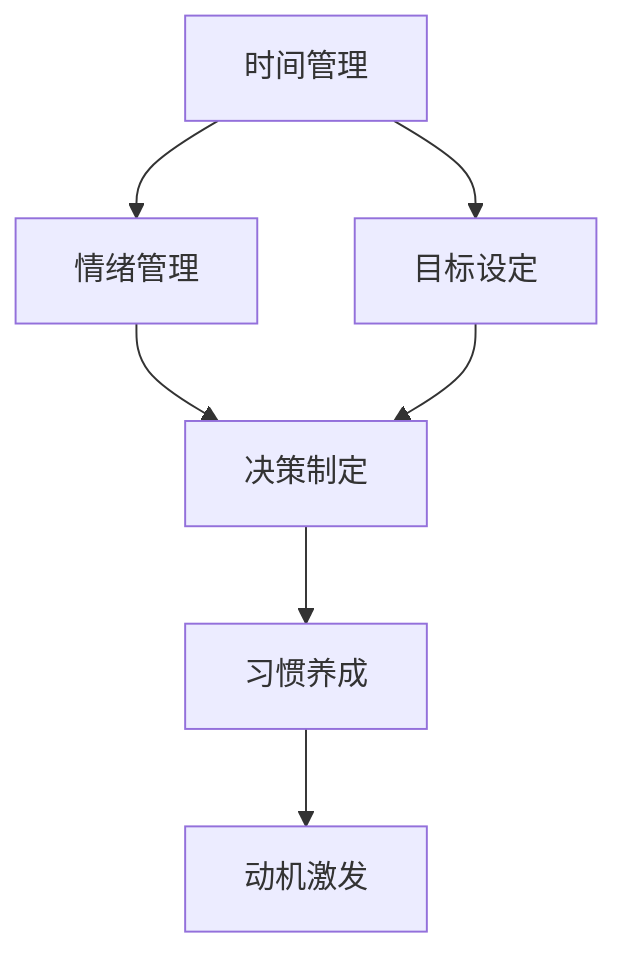

                 

# 如何进行自我管理：如何提高自我控制和自律能力？

> 关键词：自我管理,自律能力,自我控制,时间管理,行为心理学,习惯养成,效率提升,决策制定,心理健康

## 1. 背景介绍

### 1.1 问题由来
在现代社会中，时间管理、任务执行、情绪控制等自我管理能力显得尤为重要。随着生活节奏的加快和工作压力的增大，许多人发现自己难以高效地管理时间和任务，情绪波动也变得更加频繁。如何提高自我控制和自律能力，成为越来越多人关注的问题。

自我管理（Self-Management）和自律能力（Self-Discipline）在心理学和行为学中有着广泛的研究。自我管理是指个体在情绪、行为、时间和任务等方面的管理能力；而自律能力则是指个体能够克服内在或外在的诱惑，保持行为的长期一致性。

### 1.2 问题核心关键点
自我管理和自律能力的关键点在于如何通过科学的方法和工具，帮助个体提高管理时间和任务的能力，维持稳定的情绪状态，增强自我控制和决策能力。

核心问题包括：
- 如何合理分配时间，提高效率？
- 如何制定长期目标，保持持续动力？
- 如何控制情绪，减少压力？
- 如何在诱惑和干扰面前保持自律？

### 1.3 问题研究意义
提升自我管理能力和自律性，不仅能帮助个体在职业生涯和个人生活中取得成功，还能提升心理健康水平，减少焦虑和抑郁的风险。

- **提升效率**：良好的时间管理和自律性能够显著提高工作效率，减少拖延现象，让个体有更多时间进行自我提升和享受生活。
- **实现目标**：通过制定明确的目标和计划，个体可以更好地掌控自己的行动，实现长期职业和个人发展目标。
- **情绪管理**：良好的情绪控制能力可以帮助个体应对压力和挑战，保持积极的心态，增强适应力和抗挫能力。
- **决策能力**：自律性和自我控制力强的人，更能够做出理性的决策，避免冲动行为，降低错误决策的风险。

## 2. 核心概念与联系

### 2.1 核心概念概述

为更好地理解自我管理和自律能力的提升方法，本节将介绍几个密切相关的核心概念：

- **时间管理**：通过科学的时间分配和任务优先级设定，提升工作和生活的效率。
- **目标设定**：制定明确、可行的短期和长期目标，并根据进展不断调整。
- **情绪管理**：通过调节心理状态和行为习惯，减少负面情绪，增强积极心态。
- **决策制定**：在面对选择时，根据信息、情感和价值观等做出最优的决策。
- **习惯养成**：通过重复和强化，将有益行为转化为自动化的习惯。
- **动机激发**：通过自我激励和外部刺激，保持对目标的兴趣和热情。

这些概念之间相互联系，共同构成个体自我管理和自律能力提升的框架。通过理解这些核心概念，我们可以更好地把握提升自我管理的科学方法。

### 2.2 核心概念原理和架构的 Mermaid 流程图



这个流程图展示了你完成一项任务（例如工作或学习）时，这些核心概念是如何相互作用的：

1. 时间管理（A）帮助我们规划任务和分配时间，确保按时完成任务。
2. 目标设定（B）提供任务的方向和动力，帮助我们明确目标。
3. 情绪管理（C）确保在面对压力和挑战时，保持积极的心态。
4. 决策制定（D）帮助我们在各种选择中做出最优的决策。
5. 习惯养成（E）通过重复和强化，将有益行为转化为自动化习惯。
6. 动机激发（F）通过自我激励和外部刺激，保持对目标的兴趣和热情。

这些概念的协同作用，可以有效地提升个体的自我管理能力和自律性。

## 3. 核心算法原理 & 具体操作步骤

### 3.1 算法原理概述

提升自我管理能力和自律性，本质上是一个通过科学方法和技术工具，逐步优化个体行为和心理状态的过程。其核心思想是：通过合理的时间分配、明确的目标设定、有效的情绪调节和高效的决策制定，将有益行为转化为自动化的习惯，并不断激发和维持动机。

### 3.2 算法步骤详解

提升自我管理能力和自律性的一般步骤包括以下几个关键环节：

**Step 1: 设定目标和优先级**
- 制定明确、可行的短期和长期目标。
- 根据目标的重要性和紧急程度，设定优先级。
- 将大目标拆解为小步骤，便于执行和评估。

**Step 2: 时间管理**
- 使用时间管理工具（如时间日志、番茄工作法、GTD等）记录和分析时间使用情况。
- 设定时间块（例如工作时间、休息时间、娱乐时间），确保各部分时间均衡。
- 避免时间浪费，例如通过限制社交媒体使用、关闭不必要的通知等方式。

**Step 3: 情绪管理**
- 识别和管理压力源，例如通过运动、冥想、深呼吸等方法减轻压力。
- 培养积极的自我对话，避免负面思维和自我贬低。
- 建立支持系统，与家人、朋友或同事分享和交流情绪。

**Step 4: 决策制定**
- 提高信息获取能力，通过阅读、学习、咨询等方式获取更多决策依据。
- 使用决策模型和工具，例如SWOT分析、成本效益分析等，评估不同选择的优劣。
- 考虑情绪和价值观，确保决策符合个人的长期利益和价值观。

**Step 5: 习惯养成**
- 设定每日和每周的习惯清单，确保有益行为得到重复和强化。
- 使用习惯追踪工具（如Habitica、HabitBull等）记录和评估习惯的执行情况。
- 逐步调整习惯列表，添加新的有益行为，并消除不良习惯。

**Step 6: 动机激发**
- 通过设定奖励和惩罚机制，激励自己坚持有益行为。
- 利用外部激励，例如通过社交媒体分享、参与挑战等方式获取外部认可。
- 找到内在动机，例如通过思考目标的意义和实现后的成就感，保持持续动力。

### 3.3 算法优缺点

**优点**：
- 通过科学方法和工具，提升个体的自我管理能力和自律性。
- 可量化和可操作性强，能够逐步优化个体行为和心理状态。
- 适用范围广，适用于各种职业和生活场景。

**缺点**：
- 需要持续的自我监控和调整，耗时较长。
- 个体差异大，需要根据自身情况定制化方案。
- 部分方法效果有限，例如依赖外部激励可能不足够持久。

### 3.4 算法应用领域

提升自我管理和自律性的方法，在职业发展、教育、健康等多个领域都有广泛应用。

- **职业发展**：通过合理的时间管理、目标设定和决策制定，提升工作效率和职业成就。
- **教育**：通过习惯养成和动机激发，帮助学生保持学习兴趣和专注力。
- **健康管理**：通过情绪管理和时间管理，改善生活习惯，提升身体健康水平。
- **人际关系**：通过良好的情绪调节和决策制定，维护良好的人际关系。

## 4. 数学模型和公式 & 详细讲解

### 4.1 数学模型构建

提升自我管理和自律性涉及多个维度的数据和行为，可以通过建立数学模型来系统分析和优化。

假设个体有 $N$ 个任务，每个任务需要 $t_i$ 时间，设总时间为 $T$。目标函数为最大化总任务完成数，约束条件为：
$$
\max \sum_{i=1}^N c_i \\
\text{s.t.} \sum_{i=1}^N t_i \leq T
$$
其中 $c_i$ 表示完成第 $i$ 个任务的重要性系数，反映任务的优先级。

### 4.2 公式推导过程

我们可以通过整数线性规划(ILP)方法求解上述目标函数，通过松弛变量和惩罚项处理时间不足的问题，例如：
$$
\max \sum_{i=1}^N c_i - \lambda \sum_{i=1}^N t_i
$$
$$
\text{s.t.} \sum_{i=1}^N t_i \leq T \\
0 \leq x_i \leq 1
$$
其中 $x_i$ 表示第 $i$ 个任务是否被执行，$\lambda$ 为时间惩罚系数。

### 4.3 案例分析与讲解

例如，小明希望在一周内完成学习、工作和锻炼三个任务，每个任务的重要性和所需时间如下：

- 学习（重要性系数 $c_1=0.8$, 时间 $t_1=4$ 小时）
- 工作（重要性系数 $c_2=0.7$, 时间 $t_2=5$ 小时）
- 锻炼（重要性系数 $c_3=0.6$, 时间 $t_3=2$ 小时）

设总时间为 $T=168$ 小时，则目标函数为：
$$
\max 0.8x_1 + 0.7x_2 + 0.6x_3
$$
约束条件为：
$$
4x_1 + 5x_2 + 2x_3 \leq 168 \\
0 \leq x_i \leq 1
$$

通过求解上述ILP问题，可以找到最优的任务分配方案，最大化总任务完成数。

## 5. 项目实践：代码实例和详细解释说明

### 5.1 开发环境搭建

在进行自我管理和自律性提升的实践前，我们需要准备好开发环境。以下是使用Python进行开发的流程：

1. 安装Python 3.9或以上版本。
2. 安装相关的依赖包，例如numpy、pandas、scipy等。
3. 使用IDE（如PyCharm、Visual Studio Code等）进行代码编写。

### 5.2 源代码详细实现

下面是一个简单的Python程序，实现基于时间管理的目标优化：

```python
import numpy as np
from scipy.optimize import linprog

# 定义任务和目标
tasks = [0.8, 0.7, 0.6]
time_per_task = [4, 5, 2]
total_time = 168

# 建立目标函数和约束条件
c = np.array([tasks])
A = np.array([[1, 1, 1]])
b = np.array([total_time])
x0_bounds = (0, None)

# 求解线性规划问题
result = linprog(c, A_ub=A, b_ub=b, bounds=x0_bounds)

# 输出最优任务分配
print(f"最优任务分配：{x0_bounds}, 总任务完成数：{result.fun}")
```

### 5.3 代码解读与分析

在上述代码中，我们使用了Python的SciPy库中的linprog函数求解线性规划问题。代码的实现步骤如下：

1. 定义任务和目标：设定每个任务的重要性系数和所需时间。
2. 建立目标函数和约束条件：设定目标函数为最大化总任务完成数，约束条件为总时间不超过总时间限制。
3. 求解线性规划问题：使用linprog函数求解最优任务分配。
4. 输出最优结果：输出最优任务分配方案和总任务完成数。

通过这个简单的示例，可以看到如何使用科学计算工具求解自我管理和自律性的优化问题。在实际应用中，还需要根据具体任务和需求，进一步定制和优化算法和模型。

### 5.4 运行结果展示

假设求解上述线性规划问题，得到的最优任务分配为 $x_1=0.4, x_2=0.5, x_3=0.1$，即小明应该分别完成学习任务 $4 \times 0.4=1.6$ 小时、工作任务 $5 \times 0.5=2.5$ 小时和锻炼任务 $2 \times 0.1=0.2$ 小时。

通过这个示例，可以直观地看到线性规划方法在时间管理和目标优化中的应用效果。

## 6. 实际应用场景

### 6.1 时间管理工具

时间管理工具（如Trello、Todoist、Notion等）帮助个体记录和规划日常任务，提升时间使用效率。通过设定任务优先级、时间块和提醒功能，个体可以更好地管理时间，减少拖延和浪费时间。

例如，Todoist可以使用时间追踪和报告功能，帮助个体分析时间使用情况，优化时间管理策略。

### 6.2 情绪管理工具

情绪管理工具（如Headspace、Calm等）通过冥想、深呼吸、正念等技术，帮助个体调节情绪，减少压力和焦虑。通过定期的情绪管理练习，个体可以保持积极的心态，提升自我管理能力。

例如，Headspace提供多种冥想课程，帮助用户通过短时间的练习，逐步提升情绪控制能力。

### 6.3 习惯养成工具

习惯养成工具（如Habitica、HabitBull等）通过设定每日和每周习惯清单、记录习惯执行情况、提供激励机制等功能，帮助个体养成和保持有益习惯。

例如，Habitica使用游戏化的方式，通过设定任务、角色和奖励，激励用户坚持养成健康习惯。

### 6.4 未来应用展望

随着科技的发展，自我管理和自律性提升的工具和技术将越来越丰富。未来，基于AI的个性化建议、情绪识别和干预、习惯追踪与分析等功能，将进一步提升个体自我管理的效果。

- **AI个性化建议**：通过分析个体的行为数据，AI可以提供个性化的自我管理建议，帮助个体优化时间分配和任务优先级。
- **情绪识别与干预**：利用面部识别和语音分析技术，实时监测个体情绪状态，并提供情绪调节建议和干预措施。
- **习惯追踪与分析**：通过大数据分析和机器学习技术，分析个体习惯养成情况，并提供持续改进建议。

## 7. 工具和资源推荐

### 7.1 学习资源推荐

提升自我管理和自律性需要系统的理论知识和实践技能，以下是一些优质的学习资源：

1. 《高效能人士的七个习惯》（Stephen R. Covey）：经典时间管理和自我管理的书籍，提供了实用的方法和原则。
2. 《自控力》（Kelly McGonigal）：心理学大师的畅销书，介绍了提升自我控制和自律性的方法和技巧。
3. Coursera的《时间管理和自我管理》课程：由斯坦福大学教授讲授，涵盖时间管理、目标设定、情绪调节等核心内容。
4. Udemy的《自我管理：提升自律性》课程：系统介绍自我管理方法和工具，提供实际应用案例。
5. 《行为心理学》课程：了解行为背后的心理机制，帮助个体更科学地管理自我。

通过对这些资源的学习，你可以系统掌握提升自我管理和自律性的理论知识和实践技能。

### 7.2 开发工具推荐

提升自我管理和自律性需要依赖各种工具，以下是一些推荐的开发工具：

1. Todoist：帮助个体记录和规划任务，优化时间管理。
2. Headspace：提供冥想和深呼吸练习，帮助个体调节情绪。
3. Trello：通过看板和列表形式，帮助个体规划任务和跟踪进度。
4. Habitica：通过游戏化的方式，激励个体养成和保持有益习惯。
5. Google Calendar：帮助个体设定时间块，管理日常任务和时间。

这些工具在实际应用中，能够显著提升自我管理和自律性，带来实际效果。

### 7.3 相关论文推荐

提升自我管理和自律性的研究涉及心理学、行为学、时间管理等多个领域，以下是几篇奠基性的相关论文，推荐阅读：

1. "Time Management: A Review and Analysis of Research"（《时间管理的回顾与分析》）：总结了时间管理的研究方法和实践经验，提供了系统的理论框架。
2. "Self-Discipline and Personality: A Comparison of Self-Discipline and Conscientiousness"（《自律性与性格：自律性与认真性比较》）：探讨了自律性与性格特征之间的关系，揭示了自律性的心理基础。
3. "The Power of Habit"（《习惯的力量》）：介绍习惯形成和改变的心理学机制，提供了提升习惯养成的方法和策略。
4. "Self-Control and Reward Sensitivity in Attributional Style"（《自我控制与奖赏敏感性：归因风格》）：研究了自我控制与个体对奖励的反应之间的关系，提供了增强自我控制的心理学视角。

这些论文代表了自我管理和自律性研究的最新进展，阅读这些论文有助于深化理解，进一步优化实践方法。

## 8. 总结：未来发展趋势与挑战

### 8.1 研究成果总结

提升自我管理和自律性是一个多学科交叉的研究领域，涉及时间管理、情绪调节、习惯养成等多个方面。通过科学的方法和工具，个体可以有效提升自我控制和自律能力，实现高效的时间管理和任务执行。

### 8.2 未来发展趋势

未来，自我管理和自律性提升将呈现以下几个趋势：

1. **AI和大数据分析**：利用AI和大数据技术，提供个性化的自我管理建议和情绪干预措施，帮助个体更好地应对复杂的心理和行为问题。
2. **多模态技术应用**：结合面部表情、语音、生理信号等多模态数据，提升情绪识别的准确性和干预效果。
3. **神经科学与心理学结合**：通过神经科学和心理学的深入研究，揭示自我管理的生理和心理机制，提供更科学的优化方法。
4. **社会支持和协作**：通过社交网络和协作工具，建立支持系统和反馈机制，帮助个体更好地维持自我管理和自律性。

### 8.3 面临的挑战

尽管自我管理和自律性提升技术在不断发展，但仍面临诸多挑战：

1. **个性化需求**：每个人的需求和情况不同，需要个性化的解决方案，如何在不增加开发成本的情况下，满足多样化的需求，是一大难题。
2. **数据隐私**：个体在使用自我管理工具时，需要保护数据隐私，避免数据泄露和滥用。
3. **技术适应性**：个体需要时间和技能学习新技术，如何降低技术使用门槛，帮助更多用户采纳新技术，需要进一步优化和推广。
4. **心理健康风险**：过度依赖技术可能带来心理依赖和压力，如何平衡技术应用与个体心理健康，仍需进一步探索。

### 8.4 研究展望

未来，提升自我管理和自律性研究需要在以下几个方面寻求新的突破：

1. **跨学科融合**：结合心理学、时间管理、情绪调节、神经科学等多个学科的知识，形成更为全面的理论框架和方法体系。
2. **大数据和AI融合**：利用大数据和AI技术，提供更精准的个性化建议和干预措施，提升自我管理效果。
3. **技术与社会结合**：研究技术在社会中的应用效果，探讨技术对个体和社会的影响，确保技术应用的可持续性和伦理性。
4. **人机协作**：结合人工干预和机器学习，提供更灵活和智能的自我管理方案，帮助个体在复杂环境中更好地管理自我。

通过这些研究方向的探索，将进一步提升自我管理和自律性的科学性和实用性，为个体和社会的全面发展提供有力支持。

## 9. 附录：常见问题与解答

**Q1：如何保持长期动力？**

A: 设定长期目标时，可以将其拆分为多个短期目标，逐步实现，从而保持持续的动力。同时，可以设定奖励和惩罚机制，通过外部激励维持动力。

**Q2：如何避免过度依赖技术？**

A: 自我管理工具和技术只是辅助手段，个体需要结合自身情况，合理使用，避免过度依赖。可以通过定期反思和调整，找到适合自己的方法。

**Q3：如何处理拖延问题？**

A: 识别拖延的原因，设定明确的任务优先级，利用番茄工作法等时间管理方法，逐步建立高效的工作习惯。同时，可以寻求外部支持，如团队协作和监督机制。

**Q4：如何应对情绪波动？**

A: 通过情绪管理工具和技术，如冥想、深呼吸、正念等，逐步调整情绪状态。同时，建立支持系统，与家人、朋友或同事分享和交流情绪。

**Q5：如何选择适合自己的工具和方法？**

A: 可以根据个人需求和情况，尝试多种工具和方法，找到最适合自己的方式。可以参考他人的经验，结合自身实际情况，进行合理选择。

通过这些常见问题的解答，可以更好地理解自我管理和自律性提升的方法和技巧，实现个人和社会的全面发展。

---

作者：禅与计算机程序设计艺术 / Zen and the Art of Computer Programming

