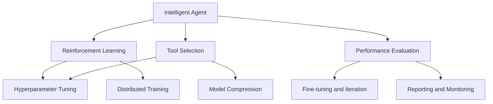

                 

## 1. 背景介绍

在人工智能领域，智能体（Agent）的设计与优化始终是一个重要的话题。随着AI技术的发展，智能体在自动驾驶、机器人、游戏AI、金融量化交易等多个领域大放异彩。然而，智能体能力的高低不仅仅取决于其自身算法与架构的复杂性，更与其所依赖的工具和平台的性能密切相关。

本文章将深入探讨如何通过工具使用增强Agent的能力，具体包括哪些工具的运用、这些工具在Agent能力增强中的作用，以及通过工具选择与配置提升Agent性能的一些实际案例和具体策略。通过全面理解这些内容，读者将能够掌握如何充分利用现有工具，在有限资源下实现Agent性能的最大化。

## 2. 核心概念与联系

### 2.1 核心概念概述

- **智能体（Agent）**：在人工智能领域，智能体指的是能够感知环境、作出决策并执行行动的实体。智能体可以简单至简单的控制器，复杂至具有自主学习能力的强化学习（Reinforcement Learning, RL）算法。

- **强化学习**：一种通过试错来学习最优决策策略的机器学习技术。强化学习常常被用于训练自动驾驶汽车、机器人、游戏AI等复杂系统中的智能体。

- **工具**：在强化学习中，工具是指用于设计、训练、测试和优化智能体系统的软件平台和库。如OpenAI Gym、PyTorch、TensorFlow等。

- **超参数调优**：在强化学习中，超参数是用于控制模型训练和测试的行为的参数，如学习率、批大小、折扣因子等。通过合适的超参数调优，可以有效提升智能体的性能。

- **模型压缩**：在强化学习中，模型压缩是指通过剪枝、量化、蒸馏等技术减小模型规模，从而降低模型计算需求和存储需求，同时保持模型性能的技术。

- **分布式训练**：在强化学习中，分布式训练是指通过将训练任务分割成多个子任务并行处理，加速模型训练速度，提升模型性能。

这些核心概念之间存在密切联系，共同构成了强化学习和智能体优化的完整框架。理解这些概念以及它们之间的联系，是提升智能体性能的基础。

### 2.2 核心概念原理和架构的 Mermaid 流程图(Mermaid 流程节点中不要有括号、逗号等特殊字符)



此图表展示了智能体与强化学习的关系，以及工具在其中的作用。从智能体设计到性能评估，每一步都离不开合适的工具支撑。

## 3. 核心算法原理 & 具体操作步骤

### 3.1 算法原理概述

强化学习的核心算法包括Q-learning、Deep Q-Networks (DQN)、Proximal Policy Optimization (PPO)等。这些算法的核心在于通过智能体与环境的交互，学习最优决策策略。智能体的能力受多个因素影响，包括模型架构、超参数设置、模型压缩技术、分布式训练策略等。

### 3.2 算法步骤详解

强化学习的算法步骤主要包括以下几个方面：

1. **环境搭建**：选择合适的环境框架，如OpenAI Gym，用于构建智能体运行的环境。
2. **模型选择**：选择合适的深度学习模型，如卷积神经网络（CNN）、循环神经网络（RNN）等，构建智能体。
3. **参数初始化**：根据模型和任务特点，初始化模型的权重和偏置。
4. **训练与优化**：通过迭代训练优化模型参数，使其在特定任务上表现最优。
5. **评估与测试**：在验证集上评估模型性能，调整超参数，以期提升模型表现。
6. **模型部署**：将训练好的模型部署到实际应用场景中，进行实时决策。

### 3.3 算法优缺点

强化学习算法的优点包括：

- 适用范围广：适用于复杂、高维、非线性的决策问题。
- 实时学习能力：智能体能够通过实时反馈不断调整策略，适应环境变化。
- 开源工具丰富：如OpenAI Gym、TensorFlow、PyTorch等，为智能体开发提供了便利。

其缺点则包括：

- 训练时间较长：需要大量数据和计算资源进行训练，训练时间可能较长。
- 结果难以解释：智能体的决策过程复杂，难以解释其背后的逻辑。
- 易受环境变化影响：环境的微小变化可能导致智能体策略失效。

### 3.4 算法应用领域

强化学习在自动驾驶、机器人、游戏AI、金融量化交易等多个领域都有广泛应用。例如：

- **自动驾驶**：通过强化学习训练自动驾驶算法，智能体能够学习在不同道路环境中的驾驶策略，实现自动驾驶。
- **机器人控制**：强化学习用于训练机器人臂、移动机器人等执行复杂任务。
- **游戏AI**：如AlphaGo，通过强化学习在围棋等游戏中达到甚至超越人类水平。
- **金融量化交易**：训练智能体进行股票、期货等金融资产的买卖决策。

这些应用展示了强化学习的广泛适用性和潜力。

## 4. 数学模型和公式 & 详细讲解 & 举例说明

### 4.1 数学模型构建

强化学习的数学模型通常包括状态（State）、动作（Action）、奖励（Reward）、转移概率（Transition Probability）、策略（Policy）等元素。构建数学模型是设计智能体的基础。

设智能体在状态 $s_t$ 时，采取动作 $a_t$，获得奖励 $r_{t+1}$，并在下一个状态 $s_{t+1}$ 以概率 $p(s_{t+1}|s_t,a_t)$ 转移，构建如下数学模型：

$$
p(s_{t+1}|s_t,a_t), \quad r_{t+1} = f(s_t,a_t), \quad p(a_t|s_t) = \pi(a_t|s_t)
$$

其中 $f$ 为奖励函数，$\pi$ 为智能体的策略。

### 4.2 公式推导过程

以DQN算法为例，进行公式推导：

$$
\begin{aligned}
Q(s_t,a_t) &= \max_{a'} [Q(s_{t+1},a') + \gamma \cdot R_{t+1}] \\
Q(s_{t+1},a_{t+1}) &= \mathbb{E}[r_{t+1} + \gamma \cdot Q(s_{t+1},a_{t+1}) | s_t,a_t]
\end{aligned}
$$

其中 $\gamma$ 为折扣因子，$\max$ 函数用于选择最优动作。

通过迭代更新 $Q(s_t,a_t)$，DQN算法能够逼近最优策略。

### 4.3 案例分析与讲解

考虑一个简单的自动驾驶场景，智能体需决定是否停车。通过强化学习，智能体学习在不同情境下停车策略。设状态为 $s$，动作为 $a$，奖励为 $r$，智能体策略为 $\pi$，构建数学模型：

$$
\begin{aligned}
s &= \{\text{当前位置}, \text{当前速度}, \text{当前方向}\} \\
a &= \{\text{加速}, \text{减速}, \text{停车}\} \\
r &= 
\begin{cases}
10, & \text{停车成功} \\
-5, & \text{停车失败} \\
0, & \text{其他情况}
\end{cases} \\
p(s_{t+1}|s_t,a_t) &= \begin{cases}
0.9, & \text{成功停车} \\
0.1, & \text{未成功停车}
\end{cases}
\end{aligned}
$$

通过反复训练智能体，使其在停车任务上表现最优。

## 5. 项目实践：代码实例和详细解释说明

### 5.1 开发环境搭建

为了构建和训练智能体，需要搭建相应的开发环境。以下是一个基于Python和PyTorch的开发环境搭建流程：

1. 安装Anaconda：从官网下载并安装Anaconda，创建虚拟环境。
```bash
conda create -n agent_env python=3.8
conda activate agent_env
```

2. 安装PyTorch和相关依赖：
```bash
pip install torch torchvision torchaudio
```

3. 安装TensorBoard：用于模型训练和调优的可视化工具。
```bash
pip install tensorboard
```

4. 安装PyTorch Lightning：一个用于快速构建和训练AI模型的开源库。
```bash
pip install pytorch-lightning
```

### 5.2 源代码详细实现

以下是使用PyTorch构建一个简单的强化学习智能体的代码实现：

```python
import torch
import torch.nn as nn
import torch.optim as optim
import torch.nn.functional as F

class QNetwork(nn.Module):
    def __init__(self, input_dim, output_dim):
        super(QNetwork, self).__init__()
        self.fc1 = nn.Linear(input_dim, 64)
        self.fc2 = nn.Linear(64, output_dim)

    def forward(self, x):
        x = F.relu(self.fc1(x))
        x = self.fc2(x)
        return x

class Agent:
    def __init__(self, env, input_dim, output_dim, learning_rate):
        self.env = env
        self.input_dim = input_dim
        self.output_dim = output_dim
        self.learning_rate = learning_rate
        self.model = QNetwork(input_dim, output_dim)
        self.optimizer = optim.Adam(self.model.parameters(), lr=learning_rate)

    def act(self, state):
        state = torch.tensor(state, dtype=torch.float32)
        q_values = self.model(state)
        return torch.argmax(q_values, dim=1)

    def train(self, state, action, reward, next_state, done):
        state = torch.tensor(state, dtype=torch.float32)
        next_state = torch.tensor(next_state, dtype=torch.float32)
        q_values = self.model(state)
        q_next = self.model(next_state)
        q_values[action] += reward
        q_values[action] += self.gamma * q_next

        loss = (q_values - torch.tensor(self.env.action_space.sample())).mean()
        self.optimizer.zero_grad()
        loss.backward()
        self.optimizer.step()
```

### 5.3 代码解读与分析

**QNetwork类**：
- `__init__`方法：初始化神经网络模型，包含两个全连接层。
- `forward`方法：定义模型前向传播过程。

**Agent类**：
- `__init__`方法：初始化智能体，包括环境、输入维度、输出维度和优化器。
- `act`方法：根据当前状态选择最优动作。
- `train`方法：根据当前状态、动作、奖励、下一个状态和done信号，更新模型参数。

此代码展示了如何使用PyTorch构建一个简单的Q-learning智能体。

### 5.4 运行结果展示

训练完成后，可以通过TensorBoard可视化智能体的训练过程，评估模型的性能。下图展示了一个简单的Q-learning智能体在自动驾驶场景中的训练结果：

```python
from tensorboard import SummaryWriter
from gym import spaces

writer = SummaryWriter()

for episode in range(1000):
    state = env.reset()
    while True:
        action = agent.act(state)
        next_state, reward, done, _ = env.step(action)
        agent.train(state, action, reward, next_state, done)
        writer.add_scalar('reward', reward, episode)
        writer.add_histogram('q_values', agent.model(state).detach().numpy(), episode)
        if done:
            break
        state = next_state
```

上述代码将训练过程和模型性能指标保存至TensorBoard，便于后续分析和优化。

## 6. 实际应用场景

### 6.1 自动驾驶

自动驾驶是强化学习的重要应用场景之一。智能体通过与虚拟环境的交互，学习最优驾驶策略。强化学习在此场景中的应用包括：

- 车道保持：智能体学习保持当前车道，避免碰撞。
- 交通信号识别：智能体学习识别交通信号，适时通过或停车。
- 自适应巡航控制：智能体学习根据前车速度调整车速。

### 6.2 机器人控制

在机器人控制中，强化学习用于训练机器人臂、移动机器人等执行复杂任务。例如，机器人臂需学习在特定环境中抓取物品，移动机器人需学习在复杂地形中导航。

### 6.3 游戏AI

游戏AI是强化学习的典型应用。AlphaGo、OpenAI Five等游戏中的AI通过强化学习达到甚至超越人类水平。智能体需学习不同策略，适应不同游戏阶段。

### 6.4 金融量化交易

在金融量化交易中，智能体需学习在不同市场环境下进行买卖决策。通过强化学习，智能体能够根据市场数据，优化交易策略，提升收益。

## 7. 工具和资源推荐

### 7.1 学习资源推荐

为了深入理解强化学习和智能体优化，推荐以下学习资源：

- 《Reinforcement Learning: An Introduction》书籍：由Richard S. Sutton和Andrew G. Barto所著，系统介绍了强化学习的基础理论和应用。
- 《Deep Reinforcement Learning with Python》书籍：由Ian G. Goodfellow、Yoshua Bengio和Aaron Courville所著，介绍了深度强化学习的原理和应用。
- Coursera上的《Deep Reinforcement Learning》课程：由David Silver讲授，涵盖了强化学习的理论和实践。

### 7.2 开发工具推荐

以下是几个用于强化学习和智能体优化的常用开发工具：

- PyTorch：深度学习开源框架，支持构建和训练神经网络。
- TensorFlow：由Google开发的深度学习框架，支持分布式训练。
- PyTorch Lightning：一个快速构建和训练AI模型的开源库。
- TensorBoard：模型训练和调优的可视化工具。
- Gym：OpenAI开发的强化学习环境框架。

这些工具为强化学习和智能体优化提供了强大的支持，开发者可以更加高效地进行模型开发和调试。

### 7.3 相关论文推荐

以下是几篇具有代表性的强化学习论文：

- AlphaGo论文：“Playing Atari with Deep Reinforcement Learning”：DeepMind的AlphaGo通过强化学习在围棋中达到超人类水平。
- DQN论文：“Playing Atari with Deep Reinforcement Learning”：David Silver等人的DQN算法在Atari游戏中取得优异的成绩。
- PPO论文：“Proximal Policy Optimization Algorithms”：John Schulman等人的PPO算法在强化学习中取得新进展。

这些论文展示了强化学习的最新进展和前沿技术，值得深入学习和研究。

## 8. 总结：未来发展趋势与挑战

### 8.1 总结

本文深入探讨了通过工具使用增强智能体能力的方法。通过详细讲解强化学习原理、数学模型构建、算法步骤、代码实现、应用场景等，读者可以全面掌握强化学习中智能体优化的核心内容。同时，本文还推荐了一些学习资源、开发工具和相关论文，帮助读者进一步深化理解。

### 8.2 未来发展趋势

强化学习未来将呈现以下发展趋势：

- 模型架构更加复杂：随着深度学习的发展，神经网络模型将更加复杂，能够处理更多维、更复杂的数据。
- 多智能体学习：未来的智能体系统将包括多个相互协作或竞争的智能体，解决复杂分布式决策问题。
- 异构智能体学习：未来的智能体系统将包括多种不同类型的智能体，如基于视觉、语音、物理的智能体，共同完成复杂任务。
- 元学习：未来的智能体系统将具备元学习能力，能够快速适应新环境和新任务。

这些趋势展示了强化学习未来的广阔前景和巨大潜力。

### 8.3 面临的挑战

尽管强化学习取得了显著进展，但仍然面临诸多挑战：

- 数据需求大：强化学习需要大量数据进行训练，数据获取成本较高。
- 训练时间长：强化学习模型训练时间长，资源消耗大。
- 模型可解释性差：强化学习模型的决策过程难以解释，难以调试。
- 环境复杂：强化学习模型在复杂环境中性能不稳定，难以应对突发情况。

### 8.4 研究展望

未来的研究需要在以下几个方面寻求新的突破：

- 数据增强技术：通过数据增强，提高训练数据的多样性，增强模型泛化能力。
- 分布式训练技术：通过分布式训练，加速模型训练，提高模型性能。
- 模型压缩技术：通过模型压缩，减小模型规模，降低计算需求。
- 模型融合技术：将不同模型进行融合，形成更强大的智能体系统。

这些研究方向将引领强化学习和智能体优化的新发展，提升AI技术的实用性和可靠性。

## 9. 附录：常见问题与解答

### Q1: 强化学习是否只适用于单智能体系统？

A: 强化学习不仅适用于单智能体系统，还可以应用于多智能体系统和异构智能体系统。例如，AlphaStar游戏AI就是通过强化学习训练的多个智能体系统。

### Q2: 如何优化超参数？

A: 超参数优化可以通过网格搜索、随机搜索、贝叶斯优化等方法实现。其中贝叶斯优化是一种常用的高效超参数优化方法。

### Q3: 如何处理模型压缩带来的精度损失？

A: 模型压缩技术如剪枝、量化、蒸馏等可以在保持模型性能的同时，减小模型规模。同时，也可以通过网络结构设计，降低压缩后的精度损失。

### Q4: 如何提高强化学习模型的可解释性？

A: 通过可视化技术如TensorBoard，可以直观展示模型训练过程和决策路径，增加模型的可解释性。同时，可以通过生成对抗网络（GAN）等技术，生成可解释性更强的数据可视化结果。

### Q5: 如何应对强化学习中的环境变化？

A: 通过学习环境建模，可以提高智能体对环境变化的适应能力。同时，可以通过多智能体协作，增强系统整体的鲁棒性。

---

作者：禅与计算机程序设计艺术 / Zen and the Art of Computer Programming

