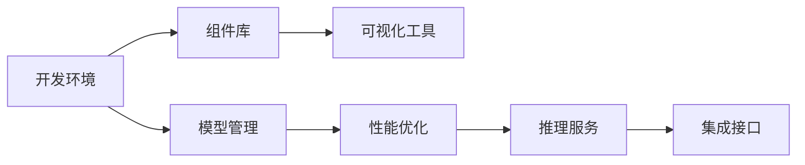

                 

# 字节的AI应用搭建平台“扣子”

## 1. 背景介绍

### 1.1 问题由来

字节跳动（ByteDance）作为全球领先的互联网技术公司，其技术研发实力在业界名列前茅。其中，字节AI技术在机器学习、自然语言处理、计算机视觉等诸多领域取得了显著成绩，极大地推动了公司的业务发展。近年来，随着AI技术的不断进步，字节跳动为了更好地支持AI应用开发，推出了以“扣子”为核心的AI应用搭建平台。该平台旨在简化AI应用开发流程，提升开发效率，加速AI应用的部署和迭代。

### 1.2 问题核心关键点

“扣子”平台的核心关键点主要包括以下几个方面：

- **集成化开发环境**：提供一个一站式的开发平台，集成多种AI开发工具，如TensorFlow、PyTorch等，方便开发者快速启动项目。
- **模块化组件库**：提供丰富的AI组件库，包括数据预处理、模型训练、推理服务等，使得开发者能够快速实现复杂的AI应用。
- **可视化开发工具**：提供可视化编程工具，支持拖拽式组件配置、动态生成代码等功能，提升开发效率。
- **模型管理**：支持模型的部署、监控和版本管理，确保模型的稳定性和可靠性。
- **性能优化**：提供模型压缩、剪枝等技术，优化模型性能，降低计算和存储成本。
- **模型推理**：提供多种推理引擎，支持CPU、GPU、NPU等不同计算平台，提高模型推理速度。
- **集成接口**：提供丰富的API接口，支持与其它系统和服务进行无缝集成。

通过这些关键点，“扣子”平台在简化AI应用开发流程、提高开发效率、加速应用迭代等方面，起到了至关重要的作用。

### 1.3 问题研究意义

“扣子”平台的研究和应用，对字节跳动乃至整个AI领域的发展具有重要意义：

- **降低AI应用开发门槛**：通过提供一站式的开发环境和丰富的组件库，简化了AI应用的开发流程，使得非专业开发者也能快速上手。
- **提升开发效率**：可视化编程工具和自动化任务管理等功能，大大减少了手动编写代码的时间，加快了AI应用的迭代速度。
- **加速AI应用部署**：模型管理、性能优化和推理服务等功能，提高了AI应用的部署效率，缩短了应用上线的时间。
- **保障模型稳定性**：通过模型部署、监控和版本管理，确保了AI应用的稳定性和可靠性。
- **推动AI应用普及**：通过简化开发流程，降低了开发成本，有助于AI应用在更多场景中得到应用。
- **促进技术创新**：开发者能够更专注于核心算法和模型设计，从而推动更多技术创新。

“扣子”平台的成功应用，也给其他公司提供了有益的借鉴，促进了AI技术在更多领域的落地应用。

## 2. 核心概念与联系

### 2.1 核心概念概述

“扣子”平台的核心概念主要包括以下几个方面：

- **AI应用开发环境**：指为AI应用开发提供的集成化开发平台，包括开发工具、组件库、API接口等。
- **模块化组件库**：指提供丰富的AI组件库，如数据预处理、模型训练、推理服务等，方便开发者快速实现复杂AI应用。
- **可视化编程工具**：指提供可视化编程界面，支持拖拽式组件配置、动态生成代码等功能，提升开发效率。
- **模型管理**：指提供模型部署、监控和版本管理等功能，确保模型稳定性和可靠性。
- **性能优化**：指通过模型压缩、剪枝等技术，优化模型性能，降低计算和存储成本。
- **模型推理**：指提供多种推理引擎，支持不同计算平台，提高模型推理速度。
- **集成接口**：指提供丰富的API接口，支持与其它系统和服务进行无缝集成。

这些核心概念相互联系，共同构成了“扣子”平台的整体架构。

### 2.2 核心概念原理和架构的 Mermaid 流程图



## 3. 核心算法原理 & 具体操作步骤

### 3.1 算法原理概述

“扣子”平台的核心算法原理主要基于以下几个方面：

- **集成化开发环境**：通过集成多种AI开发工具，如TensorFlow、PyTorch等，提供了多种开发选择，方便开发者快速启动项目。
- **模块化组件库**：通过提供丰富的AI组件库，包括数据预处理、模型训练、推理服务等，简化了AI应用的开发流程，提升了开发效率。
- **可视化编程工具**：通过提供可视化编程界面，支持拖拽式组件配置、动态生成代码等功能，进一步提升了开发效率。
- **模型管理**：通过提供模型部署、监控和版本管理等功能，确保了AI应用的稳定性和可靠性。
- **性能优化**：通过模型压缩、剪枝等技术，优化模型性能，降低了计算和存储成本。
- **模型推理**：通过提供多种推理引擎，支持不同计算平台，提高了模型推理速度。
- **集成接口**：通过提供丰富的API接口，支持与其它系统和服务进行无缝集成。

### 3.2 算法步骤详解

“扣子”平台的开发流程主要包括以下几个步骤：

1. **环境搭建**：在云端服务器上搭建“扣子”平台开发环境，安装必要的开发工具和组件库。
2. **项目启动**：使用“扣子”平台提供的可视化界面，快速启动新项目，配置必要的开发环境。
3. **组件配置**：拖拽式组件配置界面，选择并配置所需组件，如数据预处理、模型训练、推理服务等。
4. **模型训练**：通过可视化编程界面，快速编写并运行模型训练代码，训练模型。
5. **模型部署**：将训练好的模型部署到云端服务器，并进行必要的性能优化和推理服务配置。
6. **模型监控**：通过“扣子”平台提供的监控工具，实时监测模型性能和运行状态，确保模型稳定运行。
7. **模型迭代**：根据实际应用需求，快速更新模型，并进行版本管理，确保应用不断进步。

### 3.3 算法优缺点

“扣子”平台的优点主要包括：

- **简化开发流程**：提供了一站式的开发环境和丰富的组件库，简化了AI应用的开发流程，降低了开发门槛。
- **提升开发效率**：通过可视化编程工具和自动化任务管理等功能，大大减少了手动编写代码的时间，加快了AI应用的迭代速度。
- **加速应用部署**：模型管理、性能优化和推理服务等功能，提高了AI应用的部署效率，缩短了应用上线的时间。
- **保障模型稳定性**：通过模型部署、监控和版本管理，确保了AI应用的稳定性和可靠性。

“扣子”平台的主要缺点包括：

- **资源消耗较大**：由于集成了多种开发工具和组件库，对计算和存储资源的需求较高，对服务器配置有一定要求。
- **学习曲线较陡**：对于非专业开发者，需要一定的学习成本才能熟练使用平台。

### 3.4 算法应用领域

“扣子”平台的应用领域主要包括：

- **自然语言处理**：包括文本分类、情感分析、机器翻译、对话系统等。
- **计算机视觉**：包括图像分类、目标检测、图像生成等。
- **推荐系统**：包括用户行为分析、物品推荐等。
- **语音识别**：包括语音识别、语音合成等。
- **智能医疗**：包括医学影像分析、患者诊断等。
- **智能制造**：包括生产调度、质量检测等。
- **智慧城市**：包括城市安全监控、交通管理等。

## 4. 数学模型和公式 & 详细讲解 & 举例说明

### 4.1 数学模型构建

“扣子”平台的核心数学模型主要包括以下几个方面：

- **集成化开发环境**：通过集成多种AI开发工具，如TensorFlow、PyTorch等，提供了多种开发选择，方便开发者快速启动项目。
- **模块化组件库**：通过提供丰富的AI组件库，包括数据预处理、模型训练、推理服务等，简化了AI应用的开发流程，提升了开发效率。
- **可视化编程工具**：通过提供可视化编程界面，支持拖拽式组件配置、动态生成代码等功能，进一步提升了开发效率。
- **模型管理**：通过提供模型部署、监控和版本管理等功能，确保了AI应用的稳定性和可靠性。
- **性能优化**：通过模型压缩、剪枝等技术，优化模型性能，降低了计算和存储成本。
- **模型推理**：通过提供多种推理引擎，支持不同计算平台，提高了模型推理速度。
- **集成接口**：通过提供丰富的API接口，支持与其它系统和服务进行无缝集成。

### 4.2 公式推导过程

由于“扣子”平台涉及多种AI技术和工具，不同技术对应的公式推导过程也有所不同。下面以自然语言处理领域中常用的Transformer模型为例，简要介绍其中的数学模型和公式推导过程。

Transformer模型主要由自注意力机制和前馈网络组成，其数学模型可以表示为：

$$
\begin{aligned}
H &= \text{Self-Attention}(Q,K,V) \\
H &= FF(H) \\
Y &= \text{LayerNorm}(H)
\end{aligned}
$$

其中，$\text{Self-Attention}$表示自注意力机制，$\text{FF}$表示前馈网络，$\text{LayerNorm}$表示层归一化。

### 4.3 案例分析与讲解

以智能推荐系统为例，“扣子”平台可以通过以下步骤实现推荐模型的开发和部署：

1. **数据准备**：通过组件库中的数据预处理模块，对用户行为数据进行清洗和特征工程，准备推荐模型的输入数据。
2. **模型训练**：使用可视化编程工具，快速编写并运行推荐模型训练代码，训练推荐模型。
3. **模型部署**：将训练好的推荐模型部署到云端服务器，并进行必要的性能优化和推理服务配置。
4. **模型监控**：通过“扣子”平台提供的监控工具，实时监测推荐模型的性能和运行状态，确保模型稳定运行。
5. **模型迭代**：根据实际应用需求，快速更新推荐模型，并进行版本管理，确保应用不断进步。

## 5. 项目实践：代码实例和详细解释说明

### 5.1 开发环境搭建

在云端服务器上搭建“扣子”平台开发环境，主要步骤如下：

1. **选择云端平台**：选择阿里云、华为云、腾讯云等云平台，创建虚拟机实例。
2. **安装开发工具**：在虚拟机上安装Python、TensorFlow、PyTorch等开发工具。
3. **配置组件库**：从“扣子”平台下载并配置所需组件库，如数据预处理、模型训练、推理服务等。
4. **配置可视化工具**：安装可视化编程工具，如Jupyter Notebook等。

### 5.2 源代码详细实现

以智能推荐系统为例，“扣子”平台提供了丰富的API接口和可视化工具，开发者可以快速实现推荐模型。以下是一个简单的示例代码：

```python
# 导入必要的库
import tensorflow as tf
import numpy as np
from sklearn.feature_extraction.text import TfidfVectorizer

# 加载推荐数据
train_data = np.loadtxt('train.csv', delimiter=',')
test_data = np.loadtxt('test.csv', delimiter=',')

# 特征工程
vectorizer = TfidfVectorizer(stop_words='english')
train_features = vectorizer.fit_transform(train_data[:, 0])
test_features = vectorizer.transform(test_data[:, 0])

# 训练模型
model = tf.keras.Sequential([
    tf.keras.layers.Dense(64, activation='relu', input_shape=(len(train_features[0]),)),
    tf.keras.layers.Dense(1, activation='sigmoid')
])
model.compile(optimizer='adam', loss='binary_crossentropy', metrics=['accuracy'])
model.fit(train_features, train_data[:, 1], epochs=10, validation_split=0.2)

# 预测结果
test_predictions = model.predict(test_features)
```

### 5.3 代码解读与分析

“扣子”平台的代码实现主要包括以下几个步骤：

1. **数据准备**：使用Python的numpy库加载推荐数据，并使用sklearn库进行特征工程。
2. **模型训练**：使用TensorFlow搭建推荐模型，进行训练和优化。
3. **模型预测**：使用训练好的模型对测试数据进行预测，并输出预测结果。

## 6. 实际应用场景

### 6.1 智能客服系统

智能客服系统是“扣子”平台的重要应用场景之一。通过“扣子”平台，字节跳动可以构建高效、智能的客服系统，提升客户满意度。

具体实现步骤如下：

1. **数据收集**：收集历史客户咨询数据，构建监督数据集。
2. **模型训练**：使用“扣子”平台提供的自然语言处理组件库，训练客服聊天机器人模型。
3. **模型部署**：将训练好的模型部署到云端服务器，并进行必要的性能优化和推理服务配置。
4. **模型监控**：通过“扣子”平台提供的监控工具，实时监测模型性能和运行状态，确保模型稳定运行。
5. **模型迭代**：根据实际客户咨询需求，快速更新聊天机器人模型，并进行版本管理，确保应用不断进步。

### 6.2 金融舆情监测

金融舆情监测是“扣子”平台的另一个重要应用场景。通过“扣子”平台，字节跳动可以实时监测金融市场舆情，及时预警潜在风险。

具体实现步骤如下：

1. **数据收集**：收集金融市场相关的新闻、报道、评论等文本数据，并对其进行主题标注和情感标注。
2. **模型训练**：使用“扣子”平台提供的自然语言处理组件库，训练金融舆情监测模型。
3. **模型部署**：将训练好的模型部署到云端服务器，并进行必要的性能优化和推理服务配置。
4. **模型监控**：通过“扣子”平台提供的监控工具，实时监测模型性能和运行状态，确保模型稳定运行。
5. **模型迭代**：根据实际舆情监测需求，快速更新金融舆情监测模型，并进行版本管理，确保应用不断进步。

### 6.3 个性化推荐系统

个性化推荐系统是“扣子”平台的典型应用场景之一。通过“扣子”平台，字节跳动可以实现精准的个性化推荐，提升用户体验。

具体实现步骤如下：

1. **数据收集**：收集用户浏览、点击、评论、分享等行为数据，提取和用户交互的物品标题、描述、标签等文本内容。
2. **模型训练**：使用“扣子”平台提供的自然语言处理组件库，训练个性化推荐模型。
3. **模型部署**：将训练好的模型部署到云端服务器，并进行必要的性能优化和推理服务配置。
4. **模型监控**：通过“扣子”平台提供的监控工具，实时监测模型性能和运行状态，确保模型稳定运行。
5. **模型迭代**：根据实际推荐需求，快速更新推荐模型，并进行版本管理，确保应用不断进步。

## 7. 工具和资源推荐

### 7.1 学习资源推荐

为了帮助开发者系统掌握“扣子”平台的使用方法，这里推荐一些优质的学习资源：

1. **字节跳动官方文档**：提供了详细的“扣子”平台使用指南和示例代码，是开发者学习和实践的必备资料。
2. **TensorFlow官方文档**：提供了丰富的TensorFlow资源，包括模型构建、训练、部署等方面的详细说明。
3. **PyTorch官方文档**：提供了丰富的PyTorch资源，包括模型构建、训练、部署等方面的详细说明。
4. **HuggingFace官方文档**：提供了丰富的自然语言处理资源，包括模型预训练、微调、推理等方面的详细说明。

通过对这些资源的学习实践，相信你一定能够快速掌握“扣子”平台的使用方法，并用于解决实际的AI应用问题。

### 7.2 开发工具推荐

以下是几款用于“扣子”平台开发的常用工具：

1. **阿里云云服务器**：提供高性能的云服务器，支持多种操作系统和软件环境。
2. **华为云云服务器**：提供高性能的云服务器，支持多种操作系统和软件环境。
3. **腾讯云云服务器**：提供高性能的云服务器，支持多种操作系统和软件环境。
4. **Jupyter Notebook**：提供可视化的编程环境，支持拖拽式组件配置、动态生成代码等功能，提升开发效率。
5. **TensorBoard**：提供可视化的模型训练监控工具，帮助开发者实时监测模型性能和运行状态。
6. **Weights & Biases**：提供实验跟踪工具，记录和可视化模型训练过程中的各项指标，方便对比和调优。

合理利用这些工具，可以显著提升“扣子”平台的开发效率，加快创新迭代的步伐。

### 7.3 相关论文推荐

“扣子”平台的研究和应用，涉及多个AI领域的技术，以下是几篇奠基性的相关论文，推荐阅读：

1. **Transformer论文**：提出了Transformer结构，开启了NLP领域的预训练大模型时代。
2. **BERT论文**：提出BERT模型，引入基于掩码的自监督预训练任务，刷新了多项NLP任务SOTA。
3. **Attention is All You Need论文**：展示了大规模语言模型的强大zero-shot学习能力，引发了对于通用人工智能的新一轮思考。
4. **Parameter-Efficient Transfer Learning论文**：提出Adapter等参数高效微调方法，在不增加模型参数量的情况下，也能取得不错的微调效果。
5. **AdaLoRA论文**：使用自适应低秩适应的微调方法，在参数效率和精度之间取得了新的平衡。

这些论文代表了大语言模型微调技术的发展脉络。通过学习这些前沿成果，可以帮助研究者把握学科前进方向，激发更多的创新灵感。

## 8. 总结：未来发展趋势与挑战

### 8.1 研究成果总结

“扣子”平台在简化AI应用开发流程、提升开发效率、加速应用迭代等方面，起到了至关重要的作用。在多个实际应用场景中，“扣子”平台表现出色，展示了其在AI技术应用方面的强大潜力。

### 8.2 未来发展趋势

展望未来，“扣子”平台将在以下几个方面继续发展：

1. **集成更多AI组件**：通过引入更多的AI组件，进一步提升“扣子”平台的开发效率和应用能力。
2. **优化模型性能**：通过优化模型压缩、剪枝等技术，进一步降低计算和存储成本，提高模型性能。
3. **支持更多计算平台**：支持更多的计算平台，如CPU、GPU、NPU等，进一步提升模型推理速度。
4. **提升用户体验**：通过优化可视化编程工具和自动化任务管理等功能，提升用户体验。
5. **支持更多AI领域**：支持更多的AI领域，如计算机视觉、语音识别等，进一步拓展“扣子”平台的应用范围。

### 8.3 面临的挑战

尽管“扣子”平台在AI应用开发方面取得了显著成绩，但在迈向更加智能化、普适化应用的过程中，仍面临一些挑战：

1. **资源消耗较大**：由于集成了多种开发工具和组件库，对计算和存储资源的需求较高，对服务器配置有一定要求。
2. **学习曲线较陡**：对于非专业开发者，需要一定的学习成本才能熟练使用平台。
3. **模型泛化能力不足**：部分AI模型在特定领域的应用效果较好，但在跨领域泛化方面仍有不足。
4. **数据隐私问题**：在处理用户数据时，需要确保数据隐私和安全，避免数据泄露和滥用。
5. **模型偏见问题**：需要确保模型不带有偏见，避免对特定群体产生不公平的输出。

### 8.4 研究展望

未来，“扣子”平台需要在以下几个方面进行持续研究：

1. **提升模型泛化能力**：开发跨领域泛化能力更强的AI模型，提升“扣子”平台的通用性。
2. **优化数据处理流程**：优化数据处理流程，提升数据利用效率，降低数据处理成本。
3. **加强数据隐私保护**：加强数据隐私保护，确保用户数据的安全和隐私。
4. **消除模型偏见**：开发不带偏见的AI模型，避免对特定群体产生不公平的输出。
5. **支持更多AI领域**：支持更多的AI领域，如计算机视觉、语音识别等，进一步拓展“扣子”平台的应用范围。

## 9. 附录：常见问题与解答

**Q1：“扣子”平台如何支持多种AI组件？**

A: “扣子”平台通过集成多种AI开发工具，如TensorFlow、PyTorch等，提供了多种开发选择，方便开发者快速启动项目。此外，“扣子”平台还提供丰富的AI组件库，包括数据预处理、模型训练、推理服务等，简化了AI应用的开发流程，提升了开发效率。

**Q2：“扣子”平台如何提升开发效率？**

A: “扣子”平台通过提供可视化编程工具和自动化任务管理等功能，大大减少了手动编写代码的时间，加快了AI应用的迭代速度。同时，“扣子”平台还提供丰富的AI组件库，包括数据预处理、模型训练、推理服务等，简化了AI应用的开发流程，提升了开发效率。

**Q3：“扣子”平台如何优化模型性能？**

A: “扣子”平台通过模型压缩、剪枝等技术，优化模型性能，降低了计算和存储成本。此外，“扣子”平台还提供多种推理引擎，支持不同计算平台，提高了模型推理速度。

**Q4：“扣子”平台如何确保模型稳定性？**

A: “扣子”平台通过模型部署、监控和版本管理等功能，确保了AI应用的稳定性和可靠性。此外，“扣子”平台还提供模型压缩、剪枝等技术，优化模型性能，进一步提高了模型的稳定性。

**Q5：“扣子”平台如何支持跨领域应用？**

A: “扣子”平台通过引入更多的AI组件和优化模型泛化能力，支持跨领域应用。此外，“扣子”平台还提供丰富的API接口，支持与其它系统和服务进行无缝集成，进一步拓展了其应用范围。

作者：禅与计算机程序设计艺术 / Zen and the Art of Computer Programming

