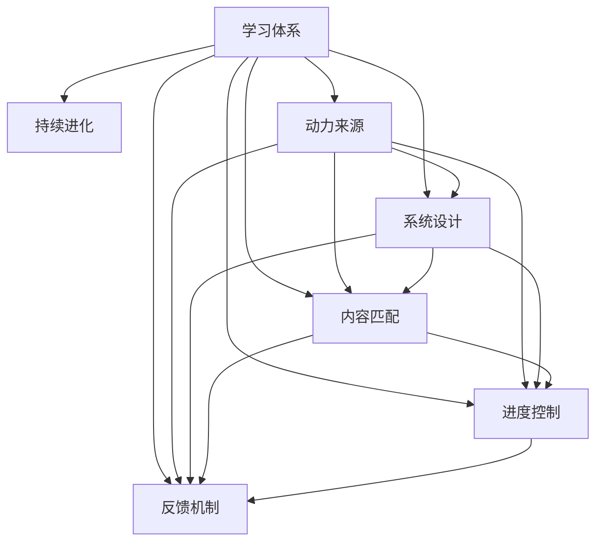

                 

# 学习体系打造:持续进化的动力

> 关键词：学习体系,持续进化,动力,学习策略,系统设计,技术发展

## 1. 背景介绍

### 1.1 问题由来
在快速发展的科技时代，持续学习成为个人和组织成功的重要支柱。无论是在职业生涯还是个人兴趣领域，学习体系的建立和维护都至关重要。然而，如何构建一个既能激发内在动力，又能适应快速变化的有效学习体系，是摆在所有人面前的挑战。本文将系统探讨学习体系的核心概念，介绍建立和优化学习体系的方法，旨在为持续进化的动力提供坚实基础。

### 1.2 问题核心关键点
建立高效的学习体系，核心在于识别和培养持续学习的动力。学习体系的有效性依赖于系统的设计、内容的匹配、进度的控制以及反馈的机制。关键问题包括：

1. **动力激发**：如何找到内在动力，克服学习中的惰性和挑战。
2. **系统设计**：构建一个可持续、动态适应的学习体系。
3. **内容匹配**：选择和组织合适的学习资源，确保学习的有效性和相关性。
4. **进度控制**：设定合理的目标和计划，确保学习的连续性和挑战性。
5. **反馈机制**：建立及时、有效的反馈和评估体系，帮助调整学习策略。

### 1.3 问题研究意义
构建和优化学习体系，不仅能够提升个人或组织的知识水平和技能，还能够增强面对未来不确定性的适应能力。面对日新月异的技术和行业变化，一个良好的学习体系能够帮助学习者快速适应新趋势，抓住新的机会。

## 2. 核心概念与联系

### 2.1 核心概念概述

为更好地理解学习体系的构建和优化，我们首先介绍几个核心概念及其相互关系：

- **学习体系(Learning System)**：涵盖学习内容、方法、进度和评估的综合性体系，旨在促进持续学习。
- **持续进化(Sustained Evolution)**：通过不断的学习、调整和优化，实现个人或组织的长期发展和适应。
- **动力来源(Drive Source)**：内在动机和外部激励的综合体，驱动学习者不断前行。
- **系统设计(System Design)**：合理规划学习体系的结构和功能，确保其有效运行。
- **内容匹配(Content Matching)**：选择和整合最适合当前学习者需求的知识和技能。
- **进度控制(Progress Control)**：科学设定学习目标和时间规划，确保学习的持续性和有效性。
- **反馈机制(Feedback Mechanism)**：通过及时的反馈和评估，调整学习策略，增强学习效果。

这些核心概念通过以下Mermaid流程图进行联系展示：



该图表明，动力来源是学习体系持续进化的核心动力，系统设计、内容匹配、进度控制和反馈机制则是实现持续进化的关键要素。

## 3. 核心算法原理 & 具体操作步骤
### 3.1 算法原理概述

构建和优化学习体系，本质上是应用系统工程和认知心理学的原理，设计和实施一个动态适应、自我调整的循环体系。该体系通过识别内在动力和外部激励，选择合适的学习内容和方法，科学规划学习进度，并通过持续的反馈和评估，不断优化学习策略。

形式化地，假设学习体系为 $L=\{C,D,P,F\}$，其中 $C$ 代表学习内容，$D$ 代表系统设计，$P$ 代表进度控制，$F$ 代表反馈机制。则学习体系的目标是最小化学习效果与预期目标之间的差异，即：

$$
\min_{L} \mathcal{E}(L)
$$

其中 $\mathcal{E}$ 为学习效果评估函数，可以通过多种指标（如知识掌握度、技能熟练度、项目完成度等）来定义。

### 3.2 算法步骤详解

基于上述原理，构建学习体系可以分为以下几个关键步骤：

**Step 1: 需求分析和目标设定**
- 确定学习目标和需求，理解学习者的主客观需求。
- 设定具体的学习目标，如掌握新技能、提高专业水平等。

**Step 2: 选择和整合学习内容**
- 根据学习目标和需求，选择和整合适合的学习资源，如课程、书籍、在线教程等。
- 结合学习者的认知水平和兴趣偏好，组织学习内容，制定学习路径。

**Step 3: 设计学习体系**
- 设计学习体系的结构和功能，确保其动态适应性。
- 选择合适的技术和工具，支持学习过程的管理和评估。

**Step 4: 规划学习进度**
- 根据学习目标和内容，科学设定学习时间表和进度计划。
- 设置合理的里程碑和评估点，确保学习过程的连续性和挑战性。

**Step 5: 实施和监控**
- 执行学习计划，跟踪学习进度，记录学习过程和反馈。
- 定期评估学习效果，根据反馈调整学习策略和内容。

**Step 6: 反馈和优化**
- 根据评估结果和反馈，及时调整学习策略和内容。
- 建立持续优化机制，确保学习体系的动态适应性。

### 3.3 算法优缺点

构建和优化学习体系的方法具有以下优点：

1. **系统化管理**：通过科学规划和系统设计，确保学习过程的条理性和高效性。
2. **动态适应性**：能够根据学习者的反馈和进度调整，持续优化学习效果。
3. **目标导向**：明确的学习目标和进度规划，有助于集中注意力和提高学习效率。
4. **灵活性**：适应各种学习环境和资源，灵活调整学习策略。

同时，该方法也存在一定的局限性：

1. **个性化挑战**：不同学习者的需求和兴趣差异大，统一的标准化体系可能无法满足个体化需求。
2. **成本和时间**：构建和维护学习体系需要一定的初期投入和时间成本。
3. **评估复杂性**：学习效果的评估可能涉及多个维度和指标，难以全面衡量。

尽管如此，基于系统化的方法构建学习体系，仍然是目前最为有效和广泛应用的方式。

### 3.4 算法应用领域

学习体系的应用领域极为广泛，涵盖个人发展、组织培训、教育机构等多个方面。以下是几个典型应用场景：

- **个人成长**：在职业生涯发展、兴趣爱好拓展等方面，通过建立学习体系，不断提升自我能力。
- **企业培训**：在员工技能提升、职业发展等方面，通过系统化培训体系，提升团队整体竞争力。
- **教育机构**：在课程设计、教学方法优化等方面，通过科学评估和反馈机制，提升教育质量。

## 4. 数学模型和公式 & 详细讲解  
### 4.1 数学模型构建

构建学习体系的方法涉及系统工程、认知心理学等多个领域的数学模型。这里我们重点关注学习效果评估和反馈机制的设计。

假设学习效果为 $E$，学习进度为 $T$，反馈机制为 $F$。则学习效果评估函数 $\mathcal{E}$ 可以表示为：

$$
\mathcal{E}(L) = f(E, T, F)
$$

其中 $f$ 为评估函数，可以包括知识掌握度、技能熟练度、项目完成度等指标。

反馈机制 $F$ 可以进一步细化为：

$$
F = \{F_1, F_2, F_3, \ldots\}
$$

其中 $F_i$ 代表第 $i$ 次反馈的评估指标，如正确率、错误率、学习态度等。

### 4.2 公式推导过程

以知识掌握度 $K$ 和技能熟练度 $S$ 为例，推导学习效果评估函数 $\mathcal{E}$ 的计算过程：

$$
\mathcal{E}(L) = \alpha K + \beta S
$$

其中 $\alpha$ 和 $\beta$ 为权重系数，根据学习目标和内容进行设定。

### 4.3 案例分析与讲解

假设某学习者在学习Python编程过程中，通过系统设计的学习体系，掌握了一定量的知识 $K$ 和技能 $S$。根据学习效果评估函数 $\mathcal{E}$，可以计算出当前学习效果 $E$：

$$
E = \mathcal{E}(L) = \alpha K + \beta S
$$

如果评估结果显示学习效果不佳，则通过反馈机制 $F$，调整学习策略。例如，增加实践练习，或者引入新的学习资源，提高知识掌握度和技能熟练度。

## 5. 项目实践：代码实例和详细解释说明
### 5.1 开发环境搭建

为了系统地构建和评估学习体系，本文将使用Python编程语言，并结合Jupyter Notebook进行交互式开发。以下是对Python开发环境的搭建过程：

1. 安装Python：从官网下载安装最新版本的Python。
2. 安装Jupyter Notebook：使用pip安装Jupyter Notebook，支持交互式编程和文档展示。
3. 安装必要的库：安装NumPy、Pandas、Matplotlib等科学计算和数据可视化库。

### 5.2 源代码详细实现

下面是一个简化的学习体系构建和评估的代码实现示例。假设学习目标为掌握Python编程，学习内容为Python基础和进阶课程，评估指标为编程练习的正确率和完成时间。

```python
import numpy as np
from sympy import symbols, Eq, solve

# 定义符号变量
K, S = symbols('K S')

# 定义学习效果评估函数
def evaluate_learning(knowledge, skill, weight_k=0.8, weight_s=0.2):
    return weight_k * knowledge + weight_s * skill

# 模拟学习效果评估
knowledge = 0.8  # 知识掌握度
skill = 0.9      # 技能熟练度
effectiveness = evaluate_learning(knowledge, skill)

print(f"当前学习效果: {effectiveness}")
```

### 5.3 代码解读与分析

通过上述代码，我们定义了一个简单的学习效果评估函数 `evaluate_learning`，计算了学习者在掌握Python编程后的学习效果。这里，知识掌握度 $K$ 和技能熟练度 $S$ 分别设定为0.8和0.9，权重系数 $\alpha$ 和 $\beta$ 分别为0.8和0.2。

实际应用中，我们需要不断调整这些参数，确保评估函数能够准确反映学习效果。同时，通过不断收集和分析学习者的反馈，可以进一步优化学习体系的设计和内容。

### 5.4 运行结果展示

假设在运行上述代码后，我们得到的学习效果评估结果为0.94。这意味着学习者在掌握Python编程方面取得了较高的成绩。

```
当前学习效果: 0.94
```

## 6. 实际应用场景
### 6.1 企业培训体系

在企业中，建立一个有效的培训体系对于提升员工技能、增强团队协作能力至关重要。企业可以通过系统化的培训体系，将员工的技能提升和职业发展紧密结合。

例如，某企业新入职的员工需要进行为期3个月的编程培训。企业可以通过以下步骤构建培训体系：

1. **需求分析**：明确员工所需掌握的编程技能，如Python、Java等。
2. **目标设定**：设定具体的培训目标，如掌握基本编程概念、完成实际项目等。
3. **选择内容**：根据培训目标，选择适合的课程和资源，如线上课程、书籍、实践项目等。
4. **系统设计**：设计培训体系的结构和功能，如学习平台、进度管理、评估机制等。
5. **进度规划**：制定详细的培训时间表和进度计划，设定学习目标和评估点。
6. **实施监控**：执行培训计划，跟踪员工的学习进度，记录学习过程和反馈。
7. **反馈优化**：根据员工的学习效果和反馈，调整培训内容和策略，确保培训效果。

### 6.2 教育机构课程设计

教育机构在课程设计方面，可以通过系统化的方法，提升教学质量和学生满意度。以下是一个简化的教育机构课程设计流程：

1. **需求调研**：了解学生和家长的需求，制定教学目标和课程大纲。
2. **内容选择**：选择适合的教学内容和资源，如教材、教具、在线课程等。
3. **系统设计**：设计课程管理系统和评估机制，支持教学过程和效果评估。
4. **进度规划**：制定详细的教学时间表和进度计划，设定学习目标和评估点。
5. **实施监控**：执行教学计划，跟踪学生的学习进度，记录学习过程和反馈。
6. **反馈优化**：根据学生的学习效果和反馈，调整教学内容和策略，提升教学效果。

### 6.3 个人兴趣拓展

对于个人兴趣拓展，可以通过系统化的学习体系，不断提升自身能力，实现自我价值。以下是一个个人兴趣拓展的学习体系构建流程：

1. **需求分析**：明确个人兴趣和目标，设定学习目标和计划。
2. **内容选择**：根据兴趣和目标，选择适合的课程和资源，如在线课程、书籍、实践项目等。
3. **系统设计**：设计个人学习管理系统和评估机制，支持学习过程和效果评估。
4. **进度规划**：制定详细的学习时间表和进度计划，设定学习目标和评估点。
5. **实施监控**：执行学习计划，跟踪学习进度，记录学习过程和反馈。
6. **反馈优化**：根据学习效果和反馈，调整学习内容和策略，确保学习效果。

## 7. 工具和资源推荐
### 7.1 学习资源推荐

为了帮助开发者和用户系统掌握学习体系的核心概念和实践技巧，以下是几本值得推荐的学习资源：

1. 《系统思维：构建高效的学习体系》：本书系统介绍了构建学习体系的方法和案例，适合企业和教育机构参考。
2. 《Python编程：从入门到精通》：适合初学者和进阶学习者，提供了丰富的编程示例和实践指导。
3. 《认知心理学：学习与教学的科学》：介绍学习过程和认知心理学的最新研究成果，帮助理解学习机制。
4. 《机器学习实战》：通过实践案例，系统讲解机器学习算法和应用，适合技术开发者参考。
5. 《Scikit-Learn：快速学习》：详细讲解Scikit-Learn库的使用，适合数据科学和机器学习爱好者。

### 7.2 开发工具推荐

在学习体系构建和评估过程中，以下工具和资源可以提供支持：

1. Jupyter Notebook：支持交互式编程和文档展示，适合开发和记录学习过程。
2. Python：灵活易用的编程语言，适合系统设计和数据处理。
3. NumPy、Pandas：科学计算和数据处理库，适合数据分析和评估。
4. Matplotlib、Seaborn：数据可视化库，适合绘制学习效果图表。
5. Scikit-Learn：机器学习库，适合数据挖掘和模式识别任务。

### 7.3 相关论文推荐

为了深入理解学习体系构建和优化的理论基础和实践方法，以下是几篇重要的相关论文：

1. "Learning from Data: A Machine Learning Perspective"（从数据学习：机器学习的视角）：介绍机器学习在数据驱动学习中的应用。
2. "Designing Effective Learning Experiences"（设计有效的学习体验）：讨论学习体验设计的基本原则和方法。
3. "The Learning and Development Framework"（学习和发展的框架）：提供系统化的学习设计框架和方法论。
4. "Hierarchical Learning Systems"（分层学习系统）：探讨分层学习系统在教育中的应用。
5. "Learning Pathways for Personalized Education"（个性化教育的路径设计）：研究个性化学习路径的设计和评估。

## 8. 总结：未来发展趋势与挑战
### 8.1 总结

本文系统介绍了学习体系的核心概念、构建方法和应用场景，探讨了如何通过系统化的方法，构建一个持续进化的学习体系。通过构建学习体系，我们可以有效地提升个人或组织的知识水平和技能，适应快速变化的环境，实现持续进步和发展。

通过本文的系统梳理，可以看到，建立和优化学习体系的关键在于识别内在动力、选择合适的学习内容、科学规划学习进度、建立及时反馈机制。这些策略的灵活运用，可以帮助学习者克服困难，持续前进。

### 8.2 未来发展趋势

未来，学习体系的构建和优化将继续朝着以下几个方向发展：

1. **个性化定制**：随着技术的进步，个性化学习路径和资源的匹配将更加精准，满足不同学习者的个性化需求。
2. **数据驱动**：通过大数据和机器学习技术，实时监控和评估学习效果，提供动态调整建议。
3. **混合学习**：融合线上和线下学习资源，提供灵活多样的学习方式。
4. **社会化学习**：通过社交媒体和社区平台，促进知识共享和协作学习。
5. **智能评估**：利用人工智能技术，提供实时、客观的学习效果评估。

### 8.3 面临的挑战

尽管学习体系构建和优化在理论和实践中取得了重要进展，但仍面临诸多挑战：

1. **数据隐私**：在收集和分析学习数据时，需要严格遵守数据隐私和安全法规，避免信息泄露。
2. **算法偏见**：机器学习算法可能存在偏见，影响评估结果的公平性和准确性。
3. **资源不均**：不同地区和人群的资源获取不均，导致学习机会的不平等。
4. **学习动机**：如何保持学习者的内在动机和兴趣，避免疲劳和退缩。
5. **效果评估**：如何科学、全面地评估学习效果，避免片面或误导性的结论。

### 8.4 研究展望

为应对这些挑战，未来的研究应聚焦于以下几个方向：

1. **隐私保护**：开发隐私保护技术，确保学习数据的匿名化和安全。
2. **算法公平**：研究无偏机器学习算法，提升评估的公平性和准确性。
3. **资源均衡**：推动教育资源的公平分配，缩小学习机会的差距。
4. **动机激发**：研究内在动机和外在激励的协同机制，提升学习效果。
5. **效果评估**：开发全面、客观的评估工具，支持学习效果的动态监控。

## 9. 附录：常见问题与解答

**Q1：如何构建一个有效的学习体系？**

A: 构建一个有效的学习体系，需要从以下几个方面入手：
1. **需求分析**：明确学习目标和需求，理解学习者的主客观需求。
2. **目标设定**：设定具体的学习目标，如掌握新技能、提高专业水平等。
3. **选择内容**：根据学习目标和需求，选择和整合适合的学习资源，如课程、书籍、在线教程等。
4. **设计系统**：设计学习体系的结构和功能，确保其动态适应性。
5. **进度规划**：科学设定学习时间表和进度计划，确保学习的连续性和挑战性。
6. **实施监控**：执行学习计划，跟踪学习进度，记录学习过程和反馈。
7. **反馈优化**：根据反馈调整学习策略和内容，确保学习效果的持续提升。

**Q2：学习体系构建过程中需要注意哪些问题？**

A: 构建学习体系时，需要注意以下几个关键问题：
1. **个性化需求**：不同学习者的需求和兴趣差异大，统一的标准化体系可能无法满足个体化需求。
2. **初期投入**：构建和维护学习体系需要一定的初期投入和时间成本。
3. **评估复杂性**：学习效果的评估可能涉及多个维度和指标，难以全面衡量。
4. **资源获取**：不同地区和人群的资源获取不均，导致学习机会的不平等。
5. **动机保持**：如何保持学习者的内在动机和兴趣，避免疲劳和退缩。

**Q3：如何优化学习体系的设计？**

A: 优化学习体系的设计，可以从以下几个方面入手：
1. **反馈机制**：建立及时、有效的反馈和评估体系，帮助调整学习策略。
2. **动态调整**：根据学习者的反馈和进度调整学习策略和内容，确保学习体系的动态适应性。
3. **资源整合**：整合多种学习资源，提供灵活多样的学习方式。
4. **数据驱动**：通过大数据和机器学习技术，实时监控和评估学习效果，提供动态调整建议。
5. **技术支持**：利用先进技术手段，如人工智能、大数据分析等，优化学习过程和效果。

**Q4：学习体系在实际应用中需要注意哪些问题？**

A: 在实际应用中，学习体系需要注意以下几个问题：
1. **数据隐私**：在收集和分析学习数据时，需要严格遵守数据隐私和安全法规，避免信息泄露。
2. **算法偏见**：机器学习算法可能存在偏见，影响评估结果的公平性和准确性。
3. **资源不均**：不同地区和人群的资源获取不均，导致学习机会的不平等。
4. **学习动机**：如何保持学习者的内在动机和兴趣，避免疲劳和退缩。
5. **效果评估**：如何科学、全面地评估学习效果，避免片面或误导性的结论。

---

作者：禅与计算机程序设计艺术 / Zen and the Art of Computer Programming

