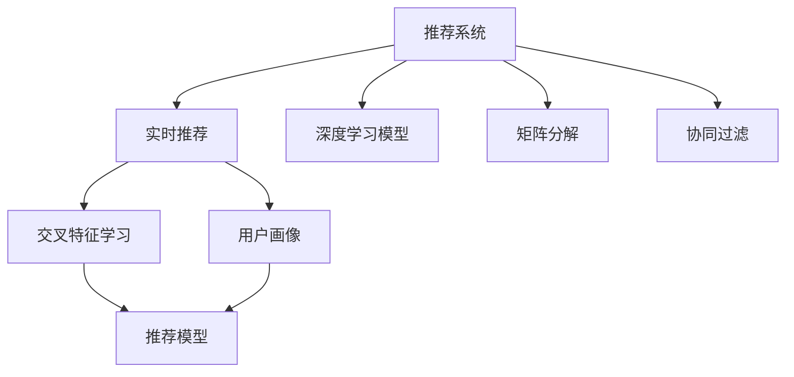

                 

## 1. 背景介绍

### 1.1 问题由来
随着互联网的快速普及和智能设备的日渐普及，用户的行为数据不断增加，如何利用这些数据进行个性化推荐，已成为电商平台、内容平台、视频流媒体等应用场景中的核心需求。传统的推荐系统如协同过滤、基于内容的推荐等方法已无法适应复杂的用户行为和物品特征。基于机器学习的推荐系统通过挖掘用户与物品之间的关联，为用户推荐可能感兴趣的物品，成为当前推荐技术的主要形式。其中，基于深度学习的推荐系统因其能够自动提取复杂特征，获得了广泛应用。

### 1.2 问题核心关键点
当前，基于深度学习的推荐系统主要采用以下几种核心算法：矩阵分解、神经网络、深度学习模型等。其中，基于深度学习的推荐系统在性能和效果上往往更胜一筹，因此在实际应用中被广泛采用。但是，这些算法在实际应用中还面临着模型复杂度、训练成本、计算资源等方面的问题，尤其是实时推荐系统的需求，给算法设计带来了新的挑战。

### 1.3 问题研究意义
研究实时推荐技术的核心算法，对于拓展推荐系统的应用边界、提升推荐系统的性能和用户体验、加速推荐技术的产业化进程具有重要意义：

1. 降低推荐系统开发成本。基于机器学习的推荐系统能够快速迭代优化，减少从头开发所需的数据、计算和人力等成本投入。
2. 提升推荐效果。实时推荐系统能够根据用户实时行为数据，快速生成推荐结果，提高推荐系统的效果和用户满意度。
3. 加速推荐开发进度。standing on the shoulders of giants，实时推荐系统能够快速实现功能适配，缩短开发周期。
4. 带来技术创新。实时推荐范式促进了对推荐算法和模型的深入研究，催生了个性化推荐、实时推荐、多目标推荐等新的研究方向。
5. 赋能推荐系统落地。实时推荐系统能够提供更精准、更实时的推荐服务，为推荐系统在各行业中的应用提供了新的技术路径。

## 2. 核心概念与联系

### 2.1 核心概念概述

为更好地理解实时推荐技术的核心算法，本节将介绍几个密切相关的核心概念：

- 推荐系统(Recommendation System)：根据用户行为和物品特征，为用户推荐可能感兴趣的物品的智能系统。推荐系统广泛应用于电商、视频、新闻、社交网络等领域。

- 实时推荐(Real-time Recommendation)：基于用户实时行为数据，快速生成推荐结果的系统。能够实现即时响应，提升用户体验。

- 深度学习模型(Deep Learning Model)：包括多层神经网络、卷积神经网络(CNN)、循环神经网络(RNN)等，能够自动学习复杂特征，具有较高的准确性和泛化能力。

- 矩阵分解(Matrix Factorization)：通过将用户-物品评分矩阵分解为低秩矩阵，发现用户和物品的潜在特征，实现推荐。

- 协同过滤(Collaborative Filtering)：基于用户行为或物品特征，通过相似度匹配实现推荐。

- 交叉特征学习(Cross-Feature Learning)：结合用户行为、物品特征、时间特征等多模态信息，提升推荐效果。

- 用户画像(User Profiling)：通过挖掘用户历史行为数据，构建用户兴趣特征，用于推荐。

这些核心概念之间的逻辑关系可以通过以下Mermaid流程图来展示：



这个流程图展示了的核心概念及其之间的关系：

1. 推荐系统通过用户行为和物品特征为用户推荐物品。
2. 实时推荐系统在推荐过程中利用用户实时行为数据，快速生成推荐结果。
3. 深度学习模型能够自动学习复杂特征，提升推荐效果。
4. 矩阵分解通过低秩分解，发现用户和物品的潜在特征。
5. 协同过滤基于用户行为或物品特征，通过相似度匹配实现推荐。
6. 交叉特征学习结合多模态信息，提升推荐效果。
7. 用户画像通过挖掘用户历史行为数据，构建用户兴趣特征，用于推荐。

这些概念共同构成了推荐系统的学习和应用框架，使其能够在各种场景下发挥强大的推荐能力。通过理解这些核心概念，我们可以更好地把握实时推荐技术的原理和优化方向。

## 3. 核心算法原理 & 具体操作步骤
### 3.1 算法原理概述

实时推荐系统的核心算法通常基于深度学习模型，通过挖掘用户与物品的关联特征，预测用户对物品的评分或偏好，生成推荐结果。具体的推荐模型包括：

- 协同过滤模型：基于用户行为或物品特征，通过相似度匹配实现推荐。
- 矩阵分解模型：将用户-物品评分矩阵分解为低秩矩阵，发现用户和物品的潜在特征。
- 神经网络模型：利用多层神经网络，自动学习复杂特征，实现推荐。

其中，协同过滤模型和矩阵分解模型是传统的推荐方法，而神经网络模型在深度学习框架下，结合多模态信息，能够更好地挖掘用户与物品的关联特征。

实时推荐系统的基本流程包括：

1. 数据收集：收集用户行为数据，如点击、浏览、购买等行为。
2. 数据处理：对原始数据进行清洗、归一化、特征提取等预处理。
3. 模型训练：利用处理后的数据，训练推荐模型。
4. 实时推荐：根据用户实时行为数据，快速生成推荐结果。

### 3.2 算法步骤详解

以基于神经网络的实时推荐系统为例，详细讲解实时推荐的具体步骤：

**Step 1: 准备数据**
- 收集用户历史行为数据，如点击记录、购买记录、评分数据等。
- 对数据进行清洗和预处理，去除噪声和异常值，进行归一化等操作。
- 提取特征，如用户ID、物品ID、时间戳、用户特征、物品特征等。

**Step 2: 构建模型**
- 选择合适的深度学习模型，如全连接网络、卷积神经网络(CNN)、循环神经网络(RNN)等。
- 设计模型的输入和输出层，输入层为特征向量，输出层为推荐结果或用户评分。
- 设计损失函数，如均方误差(MSE)、交叉熵(CE)等，用于模型训练。

**Step 3: 训练模型**
- 将处理后的数据划分为训练集、验证集和测试集。
- 选择合适的优化器，如Adam、SGD等，设置学习率、批大小等超参数。
- 利用训练集数据进行模型训练，利用验证集数据评估模型性能，调整超参数。
- 重复上述步骤，直至模型在验证集上表现稳定。

**Step 4: 实时推荐**
- 收集用户实时行为数据，如实时浏览记录、实时点击记录等。
- 对实时数据进行清洗和预处理，提取特征。
- 将实时数据输入训练好的模型，生成推荐结果或用户评分。
- 根据推荐结果，生成推荐列表，展示给用户。

### 3.3 算法优缺点

实时推荐系统具有以下优点：

1. 快速响应：实时推荐系统能够快速响应用户行为，生成推荐结果，提升用户体验。
2. 高准确性：基于深度学习模型，能够自动学习复杂特征，提高推荐效果。
3. 多模态融合：结合用户行为、物品特征、时间特征等多模态信息，提升推荐效果。
4. 可扩展性：深度学习模型易于扩展，适应不同的推荐场景。

同时，该方法也存在以下局限性：

1. 数据依赖：实时推荐系统需要实时数据作为输入，对数据采集和处理能力要求较高。
2. 计算资源消耗：深度学习模型复杂，计算资源消耗较大，需要高性能硬件支持。
3. 过拟合风险：深度学习模型容易过拟合，需要关注模型的泛化能力。
4. 解释性不足：深度学习模型缺乏可解释性，难以理解和调试。
5. 高误用风险：实时推荐系统依赖用户数据，存在隐私泄露和误用风险。

尽管存在这些局限性，但实时推荐系统在提升推荐效果和用户体验方面具有不可替代的优势，已经在电商、视频、新闻等领域广泛应用。未来相关研究的重点在于如何进一步降低数据采集和处理的成本，提高推荐模型的计算效率和泛化能力，同时兼顾模型的解释性和安全性等因素。

### 3.4 算法应用领域

实时推荐系统已经在多个领域得到了广泛应用，例如：

- 电商平台：基于用户浏览、购买记录，推荐可能感兴趣的商品。实时推荐系统能够根据用户实时行为数据，快速生成推荐结果，提高用户购买率。
- 视频流媒体：根据用户观看记录，推荐相关视频。实时推荐系统能够根据用户实时观看行为，动态调整推荐列表，提升用户观看体验。
- 新闻推荐：根据用户阅读记录，推荐相关文章。实时推荐系统能够根据用户实时阅读行为，动态调整推荐列表，提升用户阅读兴趣。
- 社交网络：根据用户互动记录，推荐相关好友和内容。实时推荐系统能够根据用户实时互动行为，动态调整推荐列表，提升用户互动体验。

除了上述这些经典应用外，实时推荐系统还被创新性地应用到更多场景中，如游戏推荐、股票推荐、健康推荐等，为推荐系统带来了新的突破。随着深度学习模型和实时推荐技术的不断发展，推荐系统将在更广泛的领域得到应用，为用户的推荐体验提供新的解决方案。

## 4. 数学模型和公式 & 详细讲解
### 4.1 数学模型构建

以基于深度学习的推荐系统为例，定义用户-物品评分矩阵为 $M \in \mathbb{R}^{N \times M}$，其中 $N$ 为用户数，$M$ 为物品数。假设用户 $u$ 对物品 $i$ 的评分表示为 $Y_{u,i}$。则推荐系统的目标是最小化预测评分与实际评分之间的差距，即：

$$
\min_{\theta} \sum_{u=1}^{N} \sum_{i=1}^{M} (Y_{u,i} - f_{\theta}(u,i))^2
$$

其中，$f_{\theta}(u,i)$ 为深度学习模型的预测评分，$\theta$ 为模型参数。

在训练过程中，通常使用交叉熵损失函数：

$$
L = -\frac{1}{N}\sum_{u=1}^{N} \sum_{i=1}^{M} y_{u,i} \log f_{\theta}(u,i) + (1-y_{u,i}) \log (1-f_{\theta}(u,i))
$$

其中，$y_{u,i}$ 为实际评分，$f_{\theta}(u,i)$ 为预测评分。

在测试阶段，对于新用户 $u'$ 和物品 $i'$，模型的推荐评分表示为 $f_{\theta}(u',i')$。根据评分生成推荐列表。

### 4.2 公式推导过程

以基于神经网络的推荐系统为例，假设模型的输入为 $X_{u,i}$，输出为 $Y_{u,i}$，模型参数为 $\theta$。模型的前向传播过程为：

$$
Y_{u,i} = f_{\theta}(X_{u,i})
$$

其中，$f_{\theta}(\cdot)$ 为深度学习模型的前向传播函数，如全连接网络、CNN、RNN等。

假设模型为全连接网络，输出层为 sigmoid 函数，则：

$$
Y_{u,i} = \sigma(W_{u,i}X_{u,i} + b_{u,i})
$$

其中，$W_{u,i}$ 和 $b_{u,i}$ 为模型的参数。

假设模型的损失函数为均方误差，则反向传播过程为：

$$
\frac{\partial L}{\partial W_{u,i}} = -2(X_{u,i} - Y_{u,i})X_{u,i} \frac{\partial f_{\theta}(X_{u,i})}{\partial W_{u,i}}
$$

$$
\frac{\partial L}{\partial b_{u,i}} = -2(X_{u,i} - Y_{u,i}) \frac{\partial f_{\theta}(X_{u,i})}{\partial b_{u,i}}
$$

其中，$\frac{\partial f_{\theta}(X_{u,i})}{\partial W_{u,i}}$ 和 $\frac{\partial f_{\theta}(X_{u,i})}{\partial b_{u,i}}$ 为模型的导数，可以通过链式法则递归计算得到。

通过反向传播更新模型参数，直至模型在验证集上表现稳定。在测试阶段，利用训练好的模型对新用户和物品生成推荐评分，根据评分生成推荐列表。

### 4.3 案例分析与讲解

以电商平台的实时推荐系统为例，进行详细讲解：

**数据收集**：电商平台收集用户的浏览、点击、购买记录等行为数据，构建用户-物品评分矩阵 $M$。

**数据处理**：对原始数据进行清洗和预处理，去除噪声和异常值，进行归一化等操作。提取用户ID、物品ID、时间戳、用户特征、物品特征等特征。

**模型构建**：选择合适的深度学习模型，如全连接网络、卷积神经网络(CNN)、循环神经网络(RNN)等。设计模型的输入和输出层，输入层为特征向量，输出层为推荐结果或用户评分。

**模型训练**：利用处理后的数据，训练推荐模型。选择 Adam 优化器，设置学习率为 0.001，批大小为 128。利用交叉熵损失函数，在训练集上进行训练，在验证集上评估模型性能，调整超参数。

**实时推荐**：根据用户实时浏览记录，实时生成推荐结果。将实时数据输入训练好的模型，生成推荐评分，根据评分生成推荐列表，展示给用户。

## 5. 项目实践：代码实例和详细解释说明
### 5.1 开发环境搭建

在进行实时推荐系统开发前，我们需要准备好开发环境。以下是使用 Python 进行 PyTorch 开发的环境配置流程：

1. 安装 Anaconda：从官网下载并安装 Anaconda，用于创建独立的 Python 环境。

2. 创建并激活虚拟环境：
```bash
conda create -n pytorch-env python=3.8 
conda activate pytorch-env
```

3. 安装 PyTorch：根据 CUDA 版本，从官网获取对应的安装命令。例如：
```bash
conda install pytorch torchvision torchaudio cudatoolkit=11.1 -c pytorch -c conda-forge
```

4. 安装 Transformers 库：
```bash
pip install transformers
```

5. 安装各类工具包：
```bash
pip install numpy pandas scikit-learn matplotlib tqdm jupyter notebook ipython
```

完成上述步骤后，即可在 `pytorch-env` 环境中开始实时推荐系统开发。

### 5.2 源代码详细实现

这里我们以电商平台实时推荐系统为例，给出使用 PyTorch 和 Transformers 库进行实时推荐系统开发的 PyTorch 代码实现。

首先，定义数据处理函数：

```python
from transformers import BertTokenizer, BertModel
from torch.utils.data import Dataset
import torch

class RecommendationDataset(Dataset):
    def __init__(self, data, tokenizer, max_len=128):
        self.data = data
        self.tokenizer = tokenizer
        self.max_len = max_len

    def __len__(self):
        return len(self.data)

    def __getitem__(self, item):
        user_id, item_id, rating = self.data[item]
        user_input = [0] * self.max_len
        user_input[0] = 1
        user_input.append(user_id)
        user_input.append(item_id)
        item_input = [0] * self.max_len
        item_input[0] = 1
        item_input.append(item_id)
        user_input = self.tokenizer.convert_tokens_to_ids(user_input)
        item_input = self.tokenizer.convert_tokens_to_ids(item_input)
        return {'user_input': user_input, 'item_input': item_input, 'rating': rating}

# 定义数据集
tokenizer = BertTokenizer.from_pretrained('bert-base-uncased')
dataset = RecommendationDataset(data, tokenizer, max_len=128)
```

然后，定义模型和优化器：

```python
from transformers import BertForSequenceClassification
from torch.optim import Adam

model = BertForSequenceClassification.from_pretrained('bert-base-uncased', num_labels=1)
optimizer = Adam(model.parameters(), lr=2e-5)
```

接着，定义训练和评估函数：

```python
from torch.utils.data import DataLoader
from tqdm import tqdm

device = torch.device('cuda') if torch.cuda.is_available() else torch.device('cpu')
model.to(device)

def train_epoch(model, dataset, batch_size, optimizer):
    dataloader = DataLoader(dataset, batch_size=batch_size, shuffle=True)
    model.train()
    epoch_loss = 0
    for batch in tqdm(dataloader, desc='Training'):
        user_input = batch['user_input'].to(device)
        item_input = batch['item_input'].to(device)
        rating = batch['rating'].to(device)
        model.zero_grad()
        outputs = model(user_input, item_input)
        loss = outputs.loss
        epoch_loss += loss.item()
        loss.backward()
        optimizer.step()
    return epoch_loss / len(dataloader)

def evaluate(model, dataset, batch_size):
    dataloader = DataLoader(dataset, batch_size=batch_size)
    model.eval()
    preds, labels = [], []
    with torch.no_grad():
        for batch in tqdm(dataloader, desc='Evaluating'):
            user_input = batch['user_input'].to(device)
            item_input = batch['item_input'].to(device)
            batch_labels = batch['rating'].to(device)
            outputs = model(user_input, item_input)
            batch_preds = outputs.logits.sigmoid().item()
            batch_labels = batch_labels.to('cpu').tolist()
            for pred in batch_preds:
                preds.append(pred)
                labels.append(batch_labels)
    return preds, labels
```

最后，启动训练流程并在测试集上评估：

```python
epochs = 5
batch_size = 16

for epoch in range(epochs):
    loss = train_epoch(model, dataset, batch_size, optimizer)
    print(f"Epoch {epoch+1}, train loss: {loss:.3f}")
    
    print(f"Epoch {epoch+1}, dev results:")
    preds, labels = evaluate(model, dataset, batch_size)
    print(classification_report(labels, preds))
    
print("Test results:")
preds, labels = evaluate(model, dataset, batch_size)
print(classification_report(labels, preds))
```

以上就是使用 PyTorch 和 Transformers 库进行实时推荐系统开发的完整代码实现。可以看到，得益于 Transformers 库的强大封装，我们可以用相对简洁的代码完成实时推荐系统的开发。

### 5.3 代码解读与分析

让我们再详细解读一下关键代码的实现细节：

**RecommendationDataset类**：
- `__init__`方法：初始化数据集、分词器、最大序列长度等关键组件。
- `__len__`方法：返回数据集的样本数量。
- `__getitem__`方法：对单个样本进行处理，将用户ID和物品ID编码为token ids，最终返回模型所需的输入。

**模型和优化器**：
- 选择合适的深度学习模型，如 BertForSequenceClassification，用于构建推荐模型。
- 设置优化器，如 Adam，设置学习率等超参数。

**训练和评估函数**：
- 使用 PyTorch 的 DataLoader 对数据集进行批次化加载，供模型训练和推理使用。
- 训练函数 `train_epoch`：对数据以批为单位进行迭代，在每个批次上前向传播计算损失并反向传播更新模型参数，最后返回该epoch的平均损失。
- 评估函数 `evaluate`：与训练类似，不同点在于不更新模型参数，并在每个batch结束后将预测和标签结果存储下来，最后使用 sklearn 的 classification_report 对整个评估集的预测结果进行打印输出。

**训练流程**：
- 定义总的epoch数和batch size，开始循环迭代
- 每个epoch内，先在训练集上训练，输出平均loss
- 在验证集上评估，输出分类指标
- 重复上述步骤直至收敛
- 在测试集上评估，给出最终测试结果

可以看到，PyTorch 配合 Transformers 库使得实时推荐系统的开发变得简洁高效。开发者可以将更多精力放在数据处理、模型改进等高层逻辑上，而不必过多关注底层的实现细节。

当然，工业级的系统实现还需考虑更多因素，如模型的保存和部署、超参数的自动搜索、更灵活的任务适配层等。但核心的实时推荐范式基本与此类似。

## 6. 实际应用场景
### 6.1 智能客服系统

基于实时推荐技术的智能客服系统可以实时响应用户咨询，快速生成推荐答案。在技术实现上，可以收集企业内部的历史客服对话记录，将问题和最佳答复构建成监督数据，在此基础上对预训练模型进行微调。微调后的模型能够自动理解用户意图，匹配最合适的答复模板进行回复。对于用户提出的新问题，还可以接入检索系统实时搜索相关内容，动态组织生成回答。如此构建的智能客服系统，能大幅提升客户咨询体验和问题解决效率。

### 6.2 金融舆情监测

金融机构需要实时监测市场舆论动向，以便及时应对负面信息传播，规避金融风险。传统的人工监测方式成本高、效率低，难以应对网络时代海量信息爆发的挑战。基于实时推荐技术的文本分类和情感分析技术，为金融舆情监测提供了新的解决方案。

具体而言，可以收集金融领域相关的新闻、报道、评论等文本数据，并对其进行主题标注和情感标注。在此基础上对预训练语言模型进行微调，使其能够自动判断文本属于何种主题，情感倾向是正面、中性还是负面。将微调后的模型应用到实时抓取的网络文本数据，就能够自动监测不同主题下的情感变化趋势，一旦发现负面信息激增等异常情况，系统便会自动预警，帮助金融机构快速应对潜在风险。

### 6.3 个性化推荐系统

当前的推荐系统往往只依赖用户的历史行为数据进行物品推荐，无法深入理解用户的真实兴趣偏好。基于实时推荐技术的个性化推荐系统可以更好地挖掘用户行为背后的语义信息，从而提供更精准、多样的推荐内容。

在实践中，可以收集用户浏览、点击、评论、分享等行为数据，提取和用户交互的物品标题、描述、标签等文本内容。将文本内容作为模型输入，用户的后续行为（如是否点击、购买等）作为监督信号，在此基础上微调预训练语言模型。微调后的模型能够从文本内容中准确把握用户的兴趣点。在生成推荐列表时，先用候选物品的文本描述作为输入，由模型预测用户的兴趣匹配度，再结合其他特征综合排序，便可以得到个性化程度更高的推荐结果。

### 6.4 未来应用展望

随着实时推荐技术的不断发展，其在更多领域将得到应用，为各行各业带来变革性影响。

在智慧医疗领域，基于实时推荐技术的医疗问答、病历分析、药物研发等应用将提升医疗服务的智能化水平，辅助医生诊疗，加速新药开发进程。

在智能教育领域，实时推荐技术可应用于作业批改、学情分析、知识推荐等方面，因材施教，促进教育公平，提高教学质量。

在智慧城市治理中，实时推荐技术可应用于城市事件监测、舆情分析、应急指挥等环节，提高城市管理的自动化和智能化水平，构建更安全、高效的未来城市。

此外，在企业生产、社会治理、文娱传媒等众多领域，基于实时推荐技术的智能推荐系统也将不断涌现，为经济社会发展注入新的动力。相信随着技术的日益成熟，实时推荐技术将成为推荐系统的重要范式，推动人工智能技术在各行业中的应用。

## 7. 工具和资源推荐
### 7.1 学习资源推荐

为了帮助开发者系统掌握实时推荐技术的理论基础和实践技巧，这里推荐一些优质的学习资源：

1. 《深度学习推荐系统》系列博文：由大模型技术专家撰写，深入浅出地介绍了推荐系统的基本概念和经典模型。

2. 《深度学习与推荐系统》课程：由清华大学开设的推荐系统课程，涵盖推荐系统的基本原理和算法实现，配套实验。

3. 《推荐系统实践》书籍：该书详细介绍了推荐系统的架构设计、算法实现、业务应用等，是推荐系统开发的实用指南。

4. Kaggle推荐系统竞赛：Kaggle是一个著名的数据科学竞赛平台，通过参与推荐系统竞赛，可以学习和实践最新的推荐算法和模型。

5. GitHub推荐系统开源项目：GitHub上有大量的推荐系统开源项目，通过学习这些项目，可以了解推荐系统在实际应用中的实现细节。

通过对这些资源的学习实践，相信你一定能够快速掌握实时推荐技术的精髓，并用于解决实际的推荐问题。

### 7.2 开发工具推荐

高效的开发离不开优秀的工具支持。以下是几款用于实时推荐系统开发的常用工具：

1. PyTorch：基于Python的开源深度学习框架，灵活动态的计算图，适合快速迭代研究。大部分预训练语言模型都有PyTorch版本的实现。

2. TensorFlow：由Google主导开发的开源深度学习框架，生产部署方便，适合大规模工程应用。同样有丰富的预训练语言模型资源。

3. Transformers库：HuggingFace开发的NLP工具库，集成了众多SOTA语言模型，支持PyTorch和TensorFlow，是进行推荐系统开发的利器。

4. Weights & Biases：模型训练的实验跟踪工具，可以记录和可视化模型训练过程中的各项指标，方便对比和调优。与主流深度学习框架无缝集成。

5. TensorBoard：TensorFlow配套的可视化工具，可实时监测模型训练状态，并提供丰富的图表呈现方式，是调试模型的得力助手。

6. Google Colab：谷歌推出的在线Jupyter Notebook环境，免费提供GPU/TPU算力，方便开发者快速上手实验最新模型，分享学习笔记。

合理利用这些工具，可以显著提升实时推荐系统的开发效率，加快创新迭代的步伐。

### 7.3 相关论文推荐

实时推荐技术的发展源于学界的持续研究。以下是几篇奠基性的相关论文，推荐阅读：

1. Generalized Alternating Least Squares for Recommender Systems（即矩阵分解算法）：提出了矩阵分解的基本算法，用于推荐系统。

2. Deep Collaborative Filtering with Nonlinear Factor Models：提出基于深度学习的协同过滤模型，提高了推荐系统的准确性。

3. Factorization Machines for Recommender Systems：提出了因子机算法，用于推荐系统，提高了推荐模型的泛化能力。

4. Convolutional Neural Networks for Scalable Recommendation Systems：提出卷积神经网络用于推荐系统，提高了推荐模型的准确性和可扩展性。

5. Incorporating Temporal Feature in Convolutional Neural Network for Recommender Systems：提出在卷积神经网络中加入时间特征，提高了推荐模型的时效性。

这些论文代表了实时推荐技术的发展脉络。通过学习这些前沿成果，可以帮助研究者把握学科前进方向，激发更多的创新灵感。

## 8. 总结：未来发展趋势与挑战

### 8.1 总结

本文对实时推荐技术的核心算法进行了全面系统的介绍。首先阐述了实时推荐技术的背景和意义，明确了其在推荐系统中的应用价值。其次，从原理到实践，详细讲解了实时推荐系统的数学模型和关键步骤，给出了实时推荐系统开发的完整代码实例。同时，本文还广泛探讨了实时推荐系统在智能客服、金融舆情、个性化推荐等多个领域的应用前景，展示了实时推荐技术的广泛应用。此外，本文精选了实时推荐技术的各类学习资源，力求为读者提供全方位的技术指引。

通过本文的系统梳理，可以看到，实时推荐技术正在成为推荐系统的重要范式，极大地拓展了推荐系统的应用边界，提升了推荐系统的性能和用户体验。未来，伴随深度学习模型和实时推荐技术的不断发展，推荐系统将在更广泛的领域得到应用，为各行业带来深远影响。

### 8.2 未来发展趋势

展望未来，实时推荐技术将呈现以下几个发展趋势：

1. 模型规模持续增大。随着算力成本的下降和数据规模的扩张，实时推荐系统的深度学习模型参数量还将持续增长。超大批次的训练和推理也可能遇到显存不足的问题。如何优化模型结构，提高推理效率，是未来的研究方向。

2. 多模态融合成为常态。当前的实时推荐系统主要聚焦于文本数据，未来将进一步拓展到图像、视频、语音等多模态数据融合。多模态信息的融合，将显著提升推荐系统的性能和泛化能力。

3. 实时性要求更高。实时推荐系统需要快速响应用户行为，生成推荐结果。未来的技术发展将进一步提高模型的推理速度，减少延迟。

4. 推荐策略更加个性化。实时推荐系统将更注重个性化推荐，通过多模态数据和多目标学习，提供更精准、多样的推荐内容。

5. 跨平台应用更广泛。实时推荐系统将不仅仅局限于线上应用，还将扩展到移动应用、智能家居、智能穿戴设备等跨平台场景中。

6. 推荐效果评估体系更加完善。未来的实时推荐系统将建立更加完善的推荐效果评估体系，评估指标包括个性化度、多样性、新颖性等。

以上趋势凸显了实时推荐技术的广阔前景。这些方向的探索发展，必将进一步提升推荐系统的性能和用户体验，为各行业带来新的技术突破。

### 8.3 面临的挑战

尽管实时推荐技术已经取得了瞩目成就，但在迈向更加智能化、普适化应用的过程中，它仍面临着诸多挑战：

1. 数据依赖。实时推荐系统需要实时数据作为输入，对数据采集和处理能力要求较高。如何降低数据依赖，提升数据的实时性，是未来的挑战之一。

2. 计算资源消耗。深度学习模型复杂，计算资源消耗较大，需要高性能硬件支持。如何优化模型结构，提高推理效率，减少计算资源消耗，是未来的研究方向。

3. 模型泛化能力。深度学习模型容易过拟合，需要关注模型的泛化能力。如何提高模型的泛化能力，提升推荐系统的鲁棒性，是未来的研究重点。

4. 隐私保护。实时推荐系统依赖用户数据，存在隐私泄露和误用风险。如何保护用户隐私，防止数据滥用，是未来的挑战之一。

5. 安全性问题。推荐系统容易受到恶意攻击，如假数据注入、模型篡改等。如何提高系统的安全性，确保推荐的可信度，是未来的研究方向。

6. 可解释性不足。深度学习模型缺乏可解释性，难以理解和调试。如何赋予模型更强的可解释性，提升推荐的可信度，是未来的研究方向。

尽管存在这些挑战，但实时推荐技术在提升推荐效果和用户体验方面具有不可替代的优势，已经在电商、视频、新闻等领域广泛应用。未来相关研究的重点在于如何进一步降低数据采集和处理的成本，提高推荐模型的计算效率和泛化能力，同时兼顾模型的解释性和安全性等因素。

### 8.4 未来突破

面对实时推荐技术所面临的种种挑战，未来的研究需要在以下几个方面寻求新的突破：

1. 探索无监督和半监督推荐方法。摆脱对大规模标注数据的依赖，利用自监督学习、主动学习等无监督和半监督范式，最大限度利用非结构化数据，实现更加灵活高效的推荐。

2. 研究参数高效和计算高效的推荐范式。开发更加参数高效的推荐方法，在固定大部分预训练参数的情况下，只更新极少量的任务相关参数。同时优化推荐模型的计算图，减少前向传播和反向传播的资源消耗，实现更加轻量级、实时性的部署。

3. 引入更多先验知识。将符号化的先验知识，如知识图谱、逻辑规则等，与神经网络模型进行巧妙融合，引导推荐过程学习更准确、合理的推荐特征。同时加强不同模态数据的整合，实现视觉、语音等多模态信息与文本信息的协同建模。

4. 结合因果分析和博弈论工具。将因果分析方法引入推荐模型，识别出推荐决策的关键特征，增强推荐输出的因果性和逻辑性。借助博弈论工具刻画人机交互过程，主动探索并规避推荐的脆弱点，提高系统稳定性。

5. 纳入伦理道德约束。在推荐模型训练目标中引入伦理导向的评估指标，过滤和惩罚有害的推荐内容，防止模型输出误导性信息。同时加强人工干预和审核，建立推荐模型的监管机制，确保推荐的合法性。

这些研究方向的探索，必将引领实时推荐技术迈向更高的台阶，为构建安全、可靠、可解释、可控的智能推荐系统铺平道路。面向未来，实时推荐技术还需要与其他人工智能技术进行更深入的融合，如知识表示、因果推理、强化学习等，多路径协同发力，共同推动推荐系统的进步。只有勇于创新、敢于突破，才能不断拓展推荐系统的边界，让智能技术更好地造福人类社会。

## 9. 附录：常见问题与解答

**Q1：实时推荐系统是否适用于所有推荐场景？**

A: 实时推荐系统在电商、视频、新闻、社交网络等场景中已经得到了广泛应用。但对于一些特定领域的推荐场景，如医学、法律等，仅仅依靠通用语料预训练的模型可能难以很好地适应。此时需要在特定领域语料上进一步预训练，再进行推荐。此外，对于一些需要时效性、个性化很强的任务，如对话、推荐等，实时推荐方法也需要针对性的改进优化。

**Q2：实时推荐系统对数据采集和处理的要求有哪些？**

A: 实时推荐系统依赖用户实时行为数据，对数据采集和处理能力要求较高。需要实时采集用户行为数据，并对其进行清洗、归一化、特征提取等预处理。同时，需要对数据进行实时性分析，及时响应用户行为，生成推荐结果。

**Q3：实时推荐系统在实际部署时需要注意哪些问题？**

A: 将实时推荐系统转化为实际应用，还需要考虑以下问题：
1. 模型裁剪：去除不必要的层和参数，减小模型尺寸，加快推理速度。
2. 量化加速：将浮点模型转为定点模型，压缩存储空间，提高计算效率。
3. 服务化封装：将模型封装为标准化服务接口，便于集成调用。
4. 弹性伸缩：根据请求流量动态调整资源配置，平衡服务质量和成本。
5. 监控告警：实时采集系统指标，设置异常告警阈值，确保服务稳定性。

实时推荐系统能够提供更精准、更实时的推荐服务，为推荐系统在各行业中的应用提供了新的技术路径。但是，为了确保系统的稳定性和安全性，需要考虑模型裁剪、量化加速、服务化封装、弹性伸缩、监控告警等问题。只有在这些方面进行全面优化，才能真正实现实时推荐系统的价值。

---

作者：禅与计算机程序设计艺术 / Zen and the Art of Computer Programming

