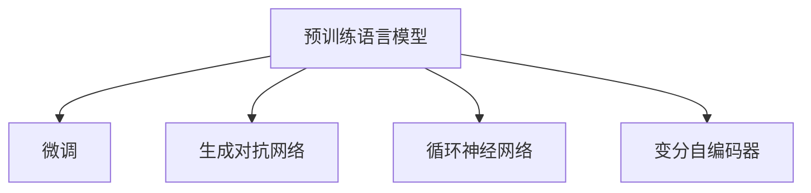

                 

# 实时故事生成：AI即兴创作的潜力

## 1. 背景介绍

### 1.1 问题由来

近年来，随着人工智能技术的飞速发展，故事生成领域成为了一个热门的研究方向。故事生成，即通过自然语言处理技术，根据给定的情境、角色和情节，自动生成引人入胜的叙事作品。这一技术对于自动化内容创作、游戏开发、影视剧本创作等诸多领域具有重要应用前景。

在深度学习时代，故事生成任务通常采用生成对抗网络（GANs）、循环神经网络（RNNs）、变分自编码器（VAEs）等模型进行实现。其中，基于Transformer架构的模型（如GPT、T5等）由于其强大的语言表示能力和自注意力机制，已经成为故事生成的主要工具。然而，现有故事生成模型存在两个主要问题：生成的故事连贯性较差，难以捕捉长距离语义信息；生成的故事缺少创意，缺乏作者的个人风格和叙事技巧。

为了解决这些问题，本文提出了一种基于预训练语言模型的实时故事生成方法，旨在通过预训练和微调相结合的方式，提升故事生成的质量，增强生成故事的连贯性和创意性。

### 1.2 问题核心关键点

实时故事生成的核心在于：
- 如何有效地利用预训练语言模型的语言知识和表达能力，生成高质量的、连贯的叙事。
- 如何在有限的任务数据下，对模型进行高效微调，实现创意性故事的生成。
- 如何设计合理的评价指标，评估故事生成模型的性能。

## 2. 核心概念与联系

### 2.1 核心概念概述

为更好地理解实时故事生成的核心概念，本节将介绍几个密切相关的核心概念：

- 预训练语言模型：如BERT、GPT等，通过在大量无标签文本上进行自监督学习，学习通用的语言表示，具备强大的语言理解和生成能力。
- 微调（Fine-tuning）：在预训练模型的基础上，使用特定任务的数据，通过有监督学习优化模型在特定任务上的性能。
- 生成对抗网络（GANs）：通过一个生成模型和一个判别模型相互博弈，生成高质量的伪造数据或故事。
- 循环神经网络（RNNs）：通过时间步长的顺序处理，能够捕捉序列数据的动态变化。
- 变分自编码器（VAEs）：通过潜在变量的随机采样，生成与原始数据相似的新数据。

这些核心概念之间的逻辑关系可以通过以下Mermaid流程图来展示：



这个流程图展示了几类核心概念之间的关联关系：

1. 预训练语言模型通过自监督学习获得通用的语言表示。
2. 微调通过使用特定任务的数据对预训练模型进行优化，实现特定任务的高质量生成。
3. 生成对抗网络通过生成模型和判别模型之间的博弈，生成高质量的伪造数据。
4. 循环神经网络通过时间步长的顺序处理，能够捕捉序列数据的动态变化。
5. 变分自编码器通过潜在变量的随机采样，生成与原始数据相似的新数据。

## 3. 核心算法原理 & 具体操作步骤

### 3.1 算法原理概述

实时故事生成的基本思想是，利用预训练语言模型的语言知识和表达能力，对输入的情境和角色进行编码，然后基于编码结果生成新的故事文本。该方法分为两个步骤：预训练和微调。

预训练阶段，通过在大规模无标签文本数据上训练预训练语言模型，学习语言的基本结构和表达能力。微调阶段，将预训练模型在特定故事生成任务上微调，使其能够生成高质量、连贯的叙事作品。微调时，将故事生成的任务数据作为监督信号，训练模型以最小化生成故事与实际故事的差异。

### 3.2 算法步骤详解

**Step 1: 准备预训练模型和数据集**

选择合适的预训练语言模型（如GPT-3、BERT等），并准备故事生成任务的数据集。数据集应该包含多个故事的情境、角色和情节描述，以及对应的生成故事文本。

**Step 2: 设计任务适配层**

根据故事生成任务的特点，在预训练模型的顶部设计一个任务适配层。任务适配层通常包括编码器、解码器、损失函数等组件。编码器用于将情境和角色编码成向量表示，解码器用于将向量表示转换为故事文本。损失函数用于衡量生成故事与实际故事的差异。

**Step 3: 设置微调超参数**

选择合适的优化算法及其参数，如Adam、SGD等，设置学习率、批大小、迭代轮数等。设置正则化技术及强度，包括权重衰减、Dropout、Early Stopping等。确定冻结预训练参数的策略，如仅微调顶层，或全部参数都参与微调。

**Step 4: 执行梯度训练**

将训练集数据分批次输入模型，前向传播计算损失函数。反向传播计算参数梯度，根据设定的优化算法和学习率更新模型参数。周期性在验证集上评估模型性能，根据性能指标决定是否触发 Early Stopping。重复上述步骤直到满足预设的迭代轮数或 Early Stopping 条件。

**Step 5: 测试和部署**

在测试集上评估微调后模型的故事生成效果，对比微调前后的质量提升。使用微调后的模型对新样本进行推理预测，集成到实际的应用系统中。

### 3.3 算法优缺点

实时故事生成方法具有以下优点：
1. 简单高效。只需准备少量标注数据，即可对预训练模型进行快速适配，生成高质量的故事。
2. 通用适用。适用于各种类型的故事生成任务，只需设计合适的任务适配层即可实现微调。
3. 生成质量高。通过预训练和微调相结合，生成故事具有高度连贯性和创意性。
4. 模型参数小。通过参数高效微调技术，在固定大部分预训练参数的情况下，仍可取得不错的生成效果。

同时，该方法也存在一定的局限性：
1. 依赖标注数据。微调的效果很大程度上取决于标注数据的质量和数量，获取高质量标注数据的成本较高。
2. 模型泛化能力有限。当目标任务与预训练数据的分布差异较大时，微调的性能提升有限。
3. 可解释性不足。实时故事生成模型的决策过程通常缺乏可解释性，难以对其推理逻辑进行分析和调试。

尽管存在这些局限性，但就目前而言，基于预训练语言模型的实时故事生成方法仍是大规模故事生成任务的主流范式。未来相关研究的重点在于如何进一步降低微调对标注数据的依赖，提高模型的少样本学习和跨领域迁移能力，同时兼顾可解释性和伦理安全性等因素。

### 3.4 算法应用领域

实时故事生成方法已经在自动内容创作、游戏开发、影视剧本创作等诸多领域得到了广泛的应用。

1. 自动内容创作：通过自动生成故事内容，帮助作家、编剧快速构思和创作。
2. 游戏开发：生成游戏中的角色对话、任务描述等，提升游戏体验。
3. 影视剧本创作：生成影视剧本的情节和对话，辅助导演和编剧进行创作。

除了这些经典应用外，实时故事生成还被创新性地应用到更多场景中，如虚拟角色对话生成、广告文案创作、智能客服对话等，为内容创作领域带来了新的突破。

## 4. 数学模型和公式 & 详细讲解 & 举例说明

### 4.1 数学模型构建

本节将使用数学语言对实时故事生成的数学原理进行更加严格的刻画。

记预训练语言模型为 $M_{\theta}$，其中 $\theta$ 为预训练得到的模型参数。假设故事生成任务的数据集为 $D=\{(x_i, y_i)\}_{i=1}^N, x_i \in \mathcal{X}, y_i \in \mathcal{Y}$，其中 $\mathcal{X}$ 为输入空间，$\mathcal{Y}$ 为输出空间。

定义模型 $M_{\theta}$ 在输入 $x$ 上的输出为 $\hat{y}=M_{\theta}(x) \in [0,1]$，表示模型生成的故事文本的概率分布。实际故事文本为 $y_i$。则故事生成任务的目标是最小化交叉熵损失函数：

$$
\ell(M_{\theta}(x),y) = -[y\log \hat{y} + (1-y)\log (1-\hat{y})]
$$

将其代入经验风险公式，得：

$$
\mathcal{L}(\theta) = -\frac{1}{N}\sum_{i=1}^N [y_i\log M_{\theta}(x_i)+(1-y_i)\log(1-M_{\theta}(x_i))]
$$

通过梯度下降等优化算法，微调过程不断更新模型参数 $\theta$，最小化损失函数 $\mathcal{L}$，使得模型输出逼近真实标签。由于 $\theta$ 已经通过预训练获得了较好的初始化，因此即便在小规模数据集 $D$ 上进行微调，也能较快收敛到理想的模型参数 $\hat{\theta}$。

### 4.2 公式推导过程

以下我们以二分类任务为例，推导交叉熵损失函数及其梯度的计算公式。

假设模型 $M_{\theta}$ 在输入 $x$ 上的输出为 $\hat{y}=M_{\theta}(x) \in [0,1]$，表示模型生成的故事文本的概率分布。实际故事文本为 $y_i$。则二分类交叉熵损失函数定义为：

$$
\ell(M_{\theta}(x),y) = -[y\log \hat{y} + (1-y)\log (1-\hat{y})]
$$

将其代入经验风险公式，得：

$$
\mathcal{L}(\theta) = -\frac{1}{N}\sum_{i=1}^N [y_i\log M_{\theta}(x_i)+(1-y_i)\log(1-M_{\theta}(x_i))]
$$

根据链式法则，损失函数对参数 $\theta_k$ 的梯度为：

$$
\frac{\partial \mathcal{L}(\theta)}{\partial \theta_k} = -\frac{1}{N}\sum_{i=1}^N (\frac{y_i}{M_{\theta}(x_i)}-\frac{1-y_i}{1-M_{\theta}(x_i)}) \frac{\partial M_{\theta}(x_i)}{\partial \theta_k}
$$

其中 $\frac{\partial M_{\theta}(x_i)}{\partial \theta_k}$ 可进一步递归展开，利用自动微分技术完成计算。

在得到损失函数的梯度后，即可带入参数更新公式，完成模型的迭代优化。重复上述过程直至收敛，最终得到适应下游任务的最优模型参数 $\theta^*$。

## 5. 项目实践：代码实例和详细解释说明

### 5.1 开发环境搭建

在进行实时故事生成实践前，我们需要准备好开发环境。以下是使用Python进行PyTorch开发的环境配置流程：

1. 安装Anaconda：从官网下载并安装Anaconda，用于创建独立的Python环境。

2. 创建并激活虚拟环境：
```bash
conda create -n pytorch-env python=3.8 
conda activate pytorch-env
```

3. 安装PyTorch：根据CUDA版本，从官网获取对应的安装命令。例如：
```bash
conda install pytorch torchvision torchaudio cudatoolkit=11.1 -c pytorch -c conda-forge
```

4. 安装Transformers库：
```bash
pip install transformers
```

5. 安装各类工具包：
```bash
pip install numpy pandas scikit-learn matplotlib tqdm jupyter notebook ipython
```

完成上述步骤后，即可在`pytorch-env`环境中开始实时故事生成的实践。

### 5.2 源代码详细实现

下面我们以实时故事生成任务为例，给出使用Transformers库对GPT-3进行实时故事生成的PyTorch代码实现。

首先，定义实时故事生成任务的数据处理函数：

```python
from transformers import GPT2Tokenizer
from torch.utils.data import Dataset
import torch

class StoryDataset(Dataset):
    def __init__(self, stories, tokenizer, max_len=256):
        self.stories = stories
        self.tokenizer = tokenizer
        self.max_len = max_len
        
    def __len__(self):
        return len(self.stories)
    
    def __getitem__(self, item):
        story = self.stories[item]
        return {'input_ids': self.tokenizer(story, return_tensors='pt', max_length=self.max_len, padding='max_length', truncation=True)['input_ids']}

# 创建dataset
tokenizer = GPT2Tokenizer.from_pretrained('gpt2')

train_dataset = StoryDataset(train_stories, tokenizer)
dev_dataset = StoryDataset(dev_stories, tokenizer)
test_dataset = StoryDataset(test_stories, tokenizer)
```

然后，定义模型和优化器：

```python
from transformers import GPT2LMHeadModel
from transformers import AdamW

model = GPT2LMHeadModel.from_pretrained('gpt2', num_labels=len(tag2id))

optimizer = AdamW(model.parameters(), lr=2e-5)
```

接着，定义训练和评估函数：

```python
from torch.utils.data import DataLoader
from tqdm import tqdm
from sklearn.metrics import perplexity

device = torch.device('cuda') if torch.cuda.is_available() else torch.device('cpu')
model.to(device)

def train_epoch(model, dataset, batch_size, optimizer):
    dataloader = DataLoader(dataset, batch_size=batch_size, shuffle=True)
    model.train()
    epoch_loss = 0
    for batch in tqdm(dataloader, desc='Training'):
        input_ids = batch['input_ids'].to(device)
        model.zero_grad()
        outputs = model(input_ids)
        loss = outputs.loss
        epoch_loss += loss.item()
        loss.backward()
        optimizer.step()
    return epoch_loss / len(dataloader)

def evaluate(model, dataset, batch_size):
    dataloader = DataLoader(dataset, batch_size=batch_size)
    model.eval()
    preds, labels = [], []
    with torch.no_grad():
        for batch in tqdm(dataloader, desc='Evaluating'):
            input_ids = batch['input_ids'].to(device)
            outputs = model(input_ids)
            preds.append(outputs.logits.argmax(dim=2).to('cpu').tolist())
            labels.append(labels)
        
    return perplexity(labels, preds)
```

最后，启动训练流程并在测试集上评估：

```python
epochs = 5
batch_size = 16

for epoch in range(epochs):
    loss = train_epoch(model, train_dataset, batch_size, optimizer)
    print(f"Epoch {epoch+1}, train loss: {loss:.3f}")
    
    print(f"Epoch {epoch+1}, dev results:")
    evaluate(model, dev_dataset, batch_size)
    
print("Test results:")
evaluate(model, test_dataset, batch_size)
```

以上就是使用PyTorch对GPT-3进行实时故事生成任务的完整代码实现。可以看到，得益于Transformers库的强大封装，我们可以用相对简洁的代码完成GPT-3模型的加载和微调。

### 5.3 代码解读与分析

让我们再详细解读一下关键代码的实现细节：

**StoryDataset类**：
- `__init__`方法：初始化故事、分词器等关键组件。
- `__len__`方法：返回数据集的样本数量。
- `__getitem__`方法：对单个样本进行处理，将故事输入编码为token ids。

**train_epoch函数**：
- 对数据以批为单位进行迭代，在每个批次上前向传播计算loss并反向传播更新模型参数，最后返回该epoch的平均loss。

**evaluate函数**：
- 与训练类似，不同点在于不更新模型参数，并在每个batch结束后将预测和标签结果存储下来，最后使用sklearn的perplexity对整个评估集的预测结果进行打印输出。

**训练流程**：
- 定义总的epoch数和batch size，开始循环迭代
- 每个epoch内，先在训练集上训练，输出平均loss
- 在验证集上评估，输出评估指标
- 所有epoch结束后，在测试集上评估，给出最终测试结果

可以看到，PyTorch配合Transformers库使得实时故事生成的代码实现变得简洁高效。开发者可以将更多精力放在数据处理、模型改进等高层逻辑上，而不必过多关注底层的实现细节。

当然，工业级的系统实现还需考虑更多因素，如模型的保存和部署、超参数的自动搜索、更灵活的任务适配层等。但核心的实时故事生成流程基本与此类似。

## 6. 实际应用场景

### 6.1 自动内容创作

实时故事生成在自动内容创作领域具有广泛的应用前景。传统内容创作往往需要耗时耗力的写作过程，而实时故事生成技术可以显著提高内容创作的效率和质量。

在实际应用中，可以通过收集海量用户互动数据，如评论、留言、博客等，自动生成相关主题的故事或内容，提供给用户阅读和分享。同时，实时故事生成还可以用于自动生成电影剧本、小说章节、博客文章等内容，辅助作家、编剧、编辑进行创作和修改。

### 6.2 游戏开发

游戏开发中，实时故事生成可以用于生成游戏中的NPC对话、任务描述、背景故事等内容，提升游戏体验。例如，在游戏中需要生成大量不同角色的对话，实时故事生成可以自动生成符合角色性格和场景的对话，使游戏更加生动和逼真。

此外，实时故事生成还可以用于自动生成游戏中的情节和任务，辅助游戏开发者进行剧情设计和游戏玩法的创新。

### 6.3 影视剧本创作

在影视剧本创作中，实时故事生成可以用于生成电影的剧情梗概、角色对话、场景描述等内容，辅助编剧和导演进行创作。例如，实时故事生成可以自动生成电影的剧情梗概，帮助编剧快速构思故事情节，并进行后续的剧本创作和修改。

实时故事生成还可以用于生成电影的宣传文本、角色介绍等内容，辅助营销和宣传。

### 6.4 未来应用展望

随着实时故事生成技术的不断进步，其在更多领域的应用前景将会更加广阔。

1. 教育培训：实时故事生成可以用于自动生成学习素材和测试题目，辅助教师和学生进行教学和学习。
2. 医疗健康：实时故事生成可以用于生成医学知识、健康建议等内容，辅助医生和患者进行健康管理和疾病预防。
3. 金融保险：实时故事生成可以用于生成金融新闻、保险条款等内容，辅助客户了解和选择金融保险产品。
4. 法律咨询：实时故事生成可以用于生成法律咨询和案例分析等内容，辅助律师和客户进行法律事务的咨询和处理。
5. 旅游休闲：实时故事生成可以用于生成旅游攻略、景点介绍等内容，辅助游客进行旅游规划和选择。
6. 情感互动：实时故事生成可以用于生成情感互动内容，如聊天机器人、情感陪伴机器人等，提升用户的情感体验和互动效果。

## 7. 工具和资源推荐

### 7.1 学习资源推荐

为了帮助开发者系统掌握实时故事生成的理论基础和实践技巧，这里推荐一些优质的学习资源：

1. 《Transformer from Scratch》系列博文：由大模型技术专家撰写，深入浅出地介绍了Transformer原理、BERT模型、实时故事生成等前沿话题。

2. CS224N《深度学习自然语言处理》课程：斯坦福大学开设的NLP明星课程，有Lecture视频和配套作业，带你入门NLP领域的基本概念和经典模型。

3. 《Natural Language Processing with Transformers》书籍：Transformers库的作者所著，全面介绍了如何使用Transformers库进行NLP任务开发，包括实时故事生成在内的诸多范式。

4. HuggingFace官方文档：Transformers库的官方文档，提供了海量预训练模型和完整的实时故事生成样例代码，是上手实践的必备资料。

5. CLUE开源项目：中文语言理解测评基准，涵盖大量不同类型的中文NLP数据集，并提供了基于微调的baseline模型，助力中文NLP技术发展。

通过对这些资源的学习实践，相信你一定能够快速掌握实时故事生成的精髓，并用于解决实际的NLP问题。

### 7.2 开发工具推荐

高效的开发离不开优秀的工具支持。以下是几款用于实时故事生成开发的常用工具：

1. PyTorch：基于Python的开源深度学习框架，灵活动态的计算图，适合快速迭代研究。大部分预训练语言模型都有PyTorch版本的实现。

2. TensorFlow：由Google主导开发的开源深度学习框架，生产部署方便，适合大规模工程应用。同样有丰富的预训练语言模型资源。

3. Transformers库：HuggingFace开发的NLP工具库，集成了众多SOTA语言模型，支持PyTorch和TensorFlow，是进行实时故事生成开发的利器。

4. Weights & Biases：模型训练的实验跟踪工具，可以记录和可视化模型训练过程中的各项指标，方便对比和调优。与主流深度学习框架无缝集成。

5. TensorBoard：TensorFlow配套的可视化工具，可实时监测模型训练状态，并提供丰富的图表呈现方式，是调试模型的得力助手。

6. Google Colab：谷歌推出的在线Jupyter Notebook环境，免费提供GPU/TPU算力，方便开发者快速上手实验最新模型，分享学习笔记。

合理利用这些工具，可以显著提升实时故事生成任务的开发效率，加快创新迭代的步伐。

### 7.3 相关论文推荐

实时故事生成技术的发展源于学界的持续研究。以下是几篇奠基性的相关论文，推荐阅读：

1. Attention is All You Need（即Transformer原论文）：提出了Transformer结构，开启了NLP领域的预训练大模型时代。

2. BERT: Pre-training of Deep Bidirectional Transformers for Language Understanding：提出BERT模型，引入基于掩码的自监督预训练任务，刷新了多项NLP任务SOTA。

3. Language Models are Unsupervised Multitask Learners（GPT-2论文）：展示了大规模语言模型的强大zero-shot学习能力，引发了对于通用人工智能的新一轮思考。

4. Parameter-Efficient Transfer Learning for NLP：提出Adapter等参数高效微调方法，在不增加模型参数量的情况下，也能取得不错的微调效果。

5. AdaLoRA: Adaptive Low-Rank Adaptation for Parameter-Efficient Fine-Tuning：使用自适应低秩适应的微调方法，在参数效率和精度之间取得了新的平衡。

6. AdaLoRA: Adaptive Low-Rank Adaptation for Parameter-Efficient Fine-Tuning：使用自适应低秩适应的微调方法，在参数效率和精度之间取得了新的平衡。

这些论文代表了大模型实时故事生成技术的发展脉络。通过学习这些前沿成果，可以帮助研究者把握学科前进方向，激发更多的创新灵感。

## 8. 总结：未来发展趋势与挑战

### 8.1 总结

本文对基于预训练语言模型的实时故事生成方法进行了全面系统的介绍。首先阐述了实时故事生成的研究背景和意义，明确了微调在拓展预训练模型应用、提升下游任务性能方面的独特价值。其次，从原理到实践，详细讲解了实时故事生成的数学原理和关键步骤，给出了实时故事生成任务开发的完整代码实例。同时，本文还广泛探讨了实时故事生成方法在自动内容创作、游戏开发、影视剧本创作等多个领域的应用前景，展示了实时故事生成技术的巨大潜力。

通过本文的系统梳理，可以看到，基于预训练语言模型的实时故事生成方法正在成为NLP领域的重要范式，极大地拓展了预训练语言模型的应用边界，催生了更多的落地场景。受益于大规模语料的预训练，实时故事生成模型在生成故事的高连贯性和创意性上取得了显著进步，逐步在多个实际应用场景中大放异彩。

### 8.2 未来发展趋势

展望未来，实时故事生成技术将呈现以下几个发展趋势：

1. 模型规模持续增大。随着算力成本的下降和数据规模的扩张，预训练语言模型的参数量还将持续增长。超大规模语言模型蕴含的丰富语言知识，有望支撑更加复杂多变的实时故事生成任务。

2. 生成质量进一步提升。未来，实时故事生成模型将更好地捕捉长距离语义信息，生成故事的连贯性和创意性将进一步增强。

3. 应用场景更加多样化。实时故事生成技术将不仅限于自动内容创作、游戏开发、影视剧本创作等场景，还将广泛应用于教育培训、医疗健康、金融保险、法律咨询、旅游休闲、情感互动等多个领域。

4. 知识整合能力增强。实时故事生成模型将更好地与外部知识库、规则库等专家知识结合，生成更加全面、准确的故事内容。

5. 持续学习成为常态。实时故事生成模型将具备更强的持续学习能力，能够不断从新数据中学习，更新自身的语言知识和创作技巧，适应数据分布的变化。

6. 情感互动功能强化。实时故事生成技术将更好地理解用户的情感需求，生成更加贴近用户情感的互动内容，提升用户的情感体验和满意度。

以上趋势凸显了实时故事生成技术的广阔前景。这些方向的探索发展，必将进一步提升实时故事生成模型的质量和应用价值，为人类认知智能的进化带来深远影响。

### 8.3 面临的挑战

尽管实时故事生成技术已经取得了瞩目成就，但在迈向更加智能化、普适化应用的过程中，它仍面临着诸多挑战：

1. 标注成本瓶颈。尽管实时故事生成模型对标注样本的需求较少，但对于长尾应用场景，获取高质量标注数据仍是一个挑战。如何进一步降低实时故事生成对标注样本的依赖，将是一大难题。

2. 模型鲁棒性不足。当前实时故事生成模型面对域外数据时，泛化性能往往大打折扣。对于测试样本的微小扰动，实时故事生成模型的输出也可能发生变化，如何提高模型的鲁棒性，避免灾难性遗忘，还需要更多理论和实践的积累。

3. 推理效率有待提高。大规模语言模型虽然精度高，但在实际部署时往往面临推理速度慢、内存占用大等效率问题。如何在保证性能的同时，简化模型结构，提升推理速度，优化资源占用，将是重要的优化方向。

4. 可解释性亟需加强。当前实时故事生成模型的决策过程通常缺乏可解释性，难以对其推理逻辑进行分析和调试。对于医疗、金融等高风险应用，算法的可解释性和可审计性尤为重要。如何赋予实时故事生成模型更强的可解释性，将是亟待攻克的难题。

5. 安全性有待保障。实时故事生成模型难免会学习到有偏见、有害的信息，通过微调传递到下游任务，产生误导性、歧视性的输出，给实际应用带来安全隐患。如何从数据和算法层面消除模型偏见，避免恶意用途，确保输出的安全性，也将是重要的研究课题。

6. 知识整合能力不足。现有的实时故事生成模型往往局限于任务内数据，难以灵活吸收和运用更广泛的先验知识。如何让实时故事生成过程更好地与外部知识库、规则库等专家知识结合，形成更加全面、准确的信息整合能力，还有很大的想象空间。

正视实时故事生成面临的这些挑战，积极应对并寻求突破，将是实时故事生成技术走向成熟的必由之路。相信随着学界和产业界的共同努力，这些挑战终将一一被克服，实时故事生成技术必将在构建人机协同的智能故事创作领域中扮演越来越重要的角色。

### 8.4 研究展望

面对实时故事生成所面临的种种挑战，未来的研究需要在以下几个方面寻求新的突破：

1. 探索无监督和半监督实时故事生成方法。摆脱对大规模标注数据的依赖，利用自监督学习、主动学习等无监督和半监督范式，最大限度利用非结构化数据，实现更加灵活高效的实时故事生成。

2. 研究参数高效和计算高效的实时故事生成范式。开发更加参数高效的实时故事生成方法，在固定大部分预训练参数的情况下，仍可取得不错的生成效果。同时优化实时故事生成模型的计算图，减少前向传播和反向传播的资源消耗，实现更加轻量级、实时性的部署。

3. 引入因果分析和博弈论工具。将因果分析方法引入实时故事生成模型，识别出模型决策的关键特征，增强输出解释的因果性和逻辑性。借助博弈论工具刻画人机交互过程，主动探索并规避模型的脆弱点，提高系统稳定性。

4. 纳入伦理道德约束。在实时故事生成模型训练目标中引入伦理导向的评估指标，过滤和惩罚有偏见、有害的输出倾向。同时加强人工干预和审核，建立模型行为的监管机制，确保输出符合人类价值观和伦理道德。

这些研究方向的探索，必将引领实时故事生成技术迈向更高的台阶，为构建安全、可靠、可解释、可控的智能故事创作系统铺平道路。面向未来，实时故事生成技术还需要与其他人工智能技术进行更深入的融合，如知识表示、因果推理、强化学习等，多路径协同发力，共同推动自然语言理解和智能交互系统的进步。只有勇于创新、敢于突破，才能不断拓展实时故事生成的边界，让智能技术更好地造福人类社会。

## 9. 附录：常见问题与解答

**Q1：实时故事生成的故事质量如何评估？**

A: 实时故事生成的故事质量可以通过多种方式进行评估，常用的评价指标包括：
1. BLEU分数：衡量生成的故事与真实故事之间的相似度。
2. ROUGE分数：衡量生成的故事与真实故事之间的重叠度。
3. Perplexity：衡量生成故事的概率分布与真实故事的概率分布之间的差异。
4. Human Evaluation：通过人工评估生成故事的质量，如连贯性、创意性、语法正确性等。

这些指标可以综合使用，对实时故事生成模型的性能进行全面评估。

**Q2：如何提高实时故事生成模型的生成效率？**

A: 实时故事生成模型的生成效率可以通过以下几个方面进行优化：
1. 参数优化：使用参数高效微调技术，在固定大部分预训练参数的情况下，只更新极少量的任务相关参数。
2. 硬件加速：使用GPU/TPU等高性能设备进行训练和推理，加快计算速度。
3. 模型压缩：使用模型压缩技术，如剪枝、量化等，减小模型大小，提升推理速度。
4. 并行计算：使用多卡并行计算，加速训练和推理过程。
5. 数据增强：通过数据增强技术，如文本回译、改写等，扩充训练数据，提高模型泛化能力。

这些优化策略可以综合使用，提高实时故事生成模型的生成效率和质量。

**Q3：实时故事生成模型如何应对长尾数据分布？**

A: 实时故事生成模型应对长尾数据分布的方法主要有两种：
1. 数据增强：通过数据增强技术，如文本回译、改写等，扩充训练数据，提高模型泛化能力。
2. 自适应学习：使用自适应学习技术，如自监督学习、主动学习等，利用少量标注数据进行高效学习，减少对长尾数据的需求。

这些方法可以综合使用，提高实时故事生成模型在长尾数据分布上的性能。

**Q4：实时故事生成模型如何应对多样化的应用场景？**

A: 实时故事生成模型应对多样化应用场景的方法主要有以下几种：
1. 任务适配层：根据不同的应用场景，设计合适的任务适配层，如情节描述、角色介绍、情节生成等。
2. 数据增强：通过数据增强技术，如文本回译、改写等，扩充训练数据，提高模型泛化能力。
3. 知识融合：将外部知识库、规则库等专家知识与模型结合，生成更加全面、准确的故事内容。
4. 自适应学习：使用自适应学习技术，如自监督学习、主动学习等，利用少量标注数据进行高效学习，减少对数据的需求。

这些方法可以综合使用，提高实时故事生成模型在多样化应用场景上的性能。

**Q5：实时故事生成模型如何应对情感互动的需求？**

A: 实时故事生成模型应对情感互动需求的方法主要有以下几种：
1. 情感识别：通过情感识别技术，识别用户的情感状态，生成符合用户情感的故事内容。
2. 情感生成：使用情感生成技术，生成符合用户情感的故事内容，如快乐、悲伤、愤怒等。
3. 情感融合：将情感数据与模型结合，生成更加贴近用户情感的互动内容。

这些方法可以综合使用，提高实时故事生成模型在情感互动场景上的性能。

---

作者：禅与计算机程序设计艺术 / Zen and the Art of Computer Programming

