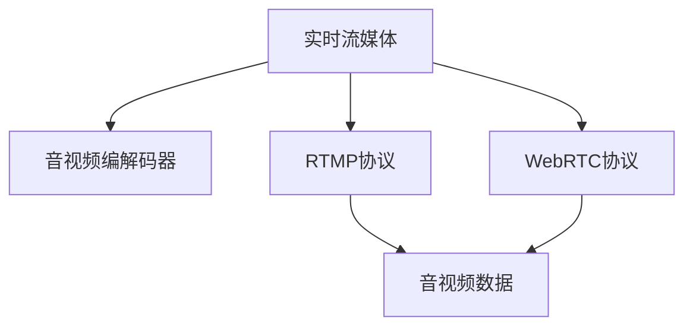

                 

# 实时流媒体协议：RTMP 和 WebRTC

## 1. 背景介绍

在当今数字化时代，流媒体技术在娱乐、教育、商业等多个领域发挥着不可替代的作用。实时流媒体协议，作为流媒体传输的核心，保障了高质量、低延迟的音视频数据传输，确保了用户在使用过程中的流畅体验。

### 1.1 问题由来

随着互联网技术的发展，实时流媒体应用需求日益增加。传统TCP/IP协议虽然适用于一般数据传输，但在实时流媒体领域，由于数据传输的要求，并不能很好地满足流媒体的传输需求。为了更好地解决这些问题，实时流媒体协议应运而生。

### 1.2 问题核心关键点
实时流媒体协议主要有RTMP和WebRTC两种，它们分别采用不同的技术和架构，分别适用于不同的应用场景。

- RTMP协议：实时流媒体传输协议，用于Adobe Flash Player中的流媒体传输，在娱乐领域应用广泛。
- WebRTC协议：基于Web标准的实时通信协议，用于浏览器间的音视频通信，适用于Web应用场景。

## 2. 核心概念与联系

### 2.1 核心概念概述

为了更好地理解RTMP和WebRTC，本节将介绍几个密切相关的核心概念：

- 实时流媒体：指将音频、视频等多媒体内容实时传输给用户的过程。实时流媒体要求传输速度快、延迟低、带宽占用稳定。
- RTMP协议：实时消息传输协议，由Macromedia公司开发，用于Adobe Flash Player中的流媒体传输。
- WebRTC协议：Web实时通信协议，由Google开发，用于浏览器间的音视频通信。
- 音视频编解码器：用于将原始音视频数据转换为网络传输所需的编码数据，常见的编解码器包括H.264、VP8、VP9等。
- 音视频编码格式：如MP4、Flv等，用于存储和传输音视频数据。
- 音视频传输协议：用于控制音视频数据的传输，保障音视频数据的实时性和稳定性。

这些核心概念之间的逻辑关系可以通过以下Mermaid流程图来展示：



这个流程图展示了大语言模型的核心概念及其之间的关系：

1. 实时流媒体是音视频数据传输的核心目标。
2. RTMP和WebRTC是两种不同的音视频传输协议，分别适用于不同的应用场景。
3. 音视频编解码器将原始数据转换为适合传输的格式。
4. WebRTC和RTMP协议通过控制音视频数据的传输，实现实时性、稳定性和低延迟。

## 3. 核心算法原理 & 具体操作步骤
### 3.1 算法原理概述

RTMP和WebRTC协议，本质上都是基于TCP/IP协议的应用层协议，但它们分别采用了不同的传输策略和编码方式。

- RTMP协议：采用分段传输、实时传输控制协议（RTCP）和可靠传输机制，以实现音视频数据的实时传输和低延迟传输。
- WebRTC协议：基于ICE、SRTP和SDP等技术，实现浏览器间的音视频通信和传输控制，支持点对点通信，无需服务器转发。

### 3.2 算法步骤详解

#### 3.2.1 RTMP协议

RTMP协议的主要步骤如下：

1. 建立连接：客户端通过TCP连接到服务器，建立RTMP连接。
2. 传输数据：客户端将音视频数据分段后，通过RTMP连接发送到服务器，同时使用RTCP协议发送控制信息。
3. 确认数据：服务器接收到数据后，使用RTCP协议向客户端发送确认信息，以确保数据传输的可靠性。
4. 传输控制：服务器使用RTCP协议向客户端发送传输控制信息，调整传输参数，确保音视频数据的实时性和稳定性。

#### 3.2.2 WebRTC协议

WebRTC协议的主要步骤如下：

1. 建立连接：客户端通过ICE协议建立端到端的连接，同时使用SDP协议协商音视频参数。
2. 传输数据：客户端将音视频数据转换为RTP/UDP包，通过连接发送到对端，同时使用SRTP协议加密数据。
3. 确认数据：接收端接收到数据后，使用RTP协议发送确认信息，以确保数据传输的可靠性。
4. 传输控制：接收端使用RTCP协议发送传输控制信息，调整传输参数，确保音视频数据的实时性和稳定性。

### 3.3 算法优缺点

RTMP协议和WebRTC协议分别具有以下优缺点：

#### RTMP协议的优点：
1. 支持实时音视频传输，适用于实时性强、数据量大且需要低延迟的应用场景。
2. 支持多种音视频编码格式，支持多种媒体容器格式，适应性强。
3. 支持RTP、RTSP等多种传输协议，实现方式灵活。

#### RTMP协议的缺点：
1. 依赖于Adobe Flash Player，兼容性较差，逐渐被WebRTC协议取代。
2. 网络传输过程中容易产生丢包和延迟，需要服务器进行流量控制和重传。
3. 安全性较差，存在被劫持和攻击的风险。

#### WebRTC协议的优点：
1. 基于Web标准，兼容性较好，适用于多种浏览器和设备。
2. 支持点对点通信，无需服务器转发，降低了传输延迟和带宽占用。
3. 支持端到端的加密和传输控制，安全性高。

#### WebRTC协议的缺点：
1. 仅适用于实时通信场景，不适用于离线存储和传输。
2. 支持编码格式和容器格式有限，适应性较差。
3. 对网络环境要求较高，需要稳定的网络环境和足够的带宽。

### 3.4 算法应用领域

RTMP和WebRTC协议在多个领域得到了广泛应用：

- 娱乐领域：RTMP协议在流媒体直播、视频点播等领域广泛应用。
- 教育领域：WebRTC协议在在线课堂、远程教育等场景中得到了应用。
- 医疗领域：RTMP协议在远程医疗、在线问诊等场景中得到了应用。
- 企业会议：WebRTC协议在企业内部会议、视频会议等场景中得到了应用。
- 社交平台：WebRTC协议在社交平台、即时通信等场景中得到了应用。

## 4. 数学模型和公式 & 详细讲解  
### 4.1 数学模型构建

本节将使用数学语言对RTMP和WebRTC协议的传输模型进行更加严格的刻画。

#### 4.1.1 RTMP协议

RTMP协议的传输模型可以表示为：

$$
\text{传输模型} = \text{数据分段} \times \text{TCP连接} \times \text{RTMP连接} \times \text{RTCP控制}
$$

其中，数据分段用于将原始音视频数据分割成固定大小的数据块，TCP连接用于在网络中进行数据传输，RTMP连接用于建立和管理音视频数据传输的控制连接，RTCP控制用于传输音视频数据的状态信息和控制信息。

#### 4.1.2 WebRTC协议

WebRTC协议的传输模型可以表示为：

$$
\text{传输模型} = \text{ICE连接} \times \text{SDP协商} \times \text{RTP/UDP传输} \times \text{SRTP加密} \times \text{RTCP控制}
$$

其中，ICE连接用于建立端到端的连接，SDP协商用于协商音视频参数，RTP/UDP传输用于将音视频数据转换为RTP/UDP包进行传输，SRTP加密用于保护数据传输的安全性，RTCP控制用于传输音视频数据的状态信息和控制信息。

### 4.2 公式推导过程

以下是RTMP协议和WebRTC协议的公式推导过程。

#### RTMP协议

RTMP协议的数据传输过程可以表示为：

$$
\text{数据传输} = \text{分段} \times \text{TCP} \times \text{RTMP} \times \text{RTCP}
$$

其中，分段过程可以表示为：

$$
\text{分段} = \frac{\text{原始数据}}{\text{分段大小}}
$$

TCP连接过程可以表示为：

$$
\text{TCP连接} = \text{数据块} \times \text{TCP传输}
$$

RTMP连接过程可以表示为：

$$
\text{RTMP连接} = \text{数据块} \times \text{RTMP传输}
$$

RTCP控制过程可以表示为：

$$
\text{RTCP控制} = \text{控制数据} \times \text{RTCP传输}
$$

因此，RTMP协议的总体传输模型可以表示为：

$$
\text{RTMP传输模型} = \frac{\text{原始数据}}{\text{分段大小}} \times \text{数据块} \times \text{TCP传输} \times \text{RTMP传输} \times \text{RTCP传输} \times \text{控制数据}
$$

#### WebRTC协议

WebRTC协议的数据传输过程可以表示为：

$$
\text{数据传输} = \text{ICE连接} \times \text{SDP协商} \times \text{RTP/UDP传输} \times \text{SRTP加密} \times \text{RTCP控制}
$$

其中，ICE连接过程可以表示为：

$$
\text{ICE连接} = \text{端点} \times \text{ICE协议}
$$

SDP协商过程可以表示为：

$$
\text{SDP协商} = \text{协议参数} \times \text{SDP传输}
$$

RTP/UDP传输过程可以表示为：

$$
\text{RTP/UDP传输} = \text{RTP包} \times \text{UDP传输}
$$

SRTP加密过程可以表示为：

$$
\text{SRTP加密} = \text{加密数据} \times \text{SRTP协议}
$$

RTCP控制过程可以表示为：

$$
\text{RTCP控制} = \text{控制数据} \times \text{RTCP传输}
$$

因此，WebRTC协议的总体传输模型可以表示为：

$$
\text{WebRTC传输模型} = \text{端点} \times \text{ICE协议} \times \text{协议参数} \times \text{SDP传输} \times \text{RTP包} \times \text{UDP传输} \times \text{加密数据} \times \text{SRTP协议} \times \text{控制数据} \times \text{RTCP传输}
$$

### 4.3 案例分析与讲解

以视频直播为例，介绍RTMP和WebRTC协议在实际应用中的工作流程。

#### RTMP协议

RTMP协议的视频直播过程可以表示为：

1. 客户端将视频数据分段并封装为RTMP数据块。
2. 客户端通过TCP连接到服务器，建立RTMP连接。
3. 客户端使用RTMP连接将RTMP数据块发送到服务器。
4. 服务器使用RTMP连接接收到RTMP数据块，使用RTCP协议向客户端发送确认信息。
5. 服务器使用RTCP协议向客户端发送控制信息，调整传输参数。
6. 服务器将RTMP数据块解封装为视频数据，并实时传输到观众端。

#### WebRTC协议

WebRTC协议的视频直播过程可以表示为：

1. 客户端使用ICE协议建立端到端的连接。
2. 客户端使用SDP协议协商音视频参数。
3. 客户端将视频数据转换为RTP/UDP包，并使用SRTP协议加密后发送到对端。
4. 接收端接收到RTP/UDP包，使用SRTP协议解密后，将RTP包转换为视频数据。
5. 接收端使用RTCP协议向发送端发送确认信息，调整传输参数。
6. 发送端将RTP包转换为视频数据，并实时传输到观众端。

## 5. 项目实践：代码实例和详细解释说明
### 5.1 开发环境搭建

在进行RTMP和WebRTC实践前，我们需要准备好开发环境。以下是使用Python进行RTMP和WebRTC开发的环境配置流程：

1. 安装Anaconda：从官网下载并安装Anaconda，用于创建独立的Python环境。

2. 创建并激活虚拟环境：
```bash
conda create -n rtmp-webrtc python=3.8 
conda activate rtmp-webrtc
```

3. 安装PyTorch：根据CUDA版本，从官网获取对应的安装命令。例如：
```bash
conda install pytorch torchvision torchaudio cudatoolkit=11.1 -c pytorch -c conda-forge
```

4. 安装transformers库：
```bash
pip install transformers
```

5. 安装各类工具包：
```bash
pip install numpy pandas scikit-learn matplotlib tqdm jupyter notebook ipython
```

完成上述步骤后，即可在`pytorch-env`环境中开始RTMP和WebRTC的实践。

### 5.2 源代码详细实现

以下是使用Python进行RTMP和WebRTC开发的基本代码实现。

#### RTMP协议

首先，定义RTMP协议的传输函数：

```python
import socket
import struct
import time

class RTMPClient:
    def __init__(self, host, port):
        self.host = host
        self.port = port
        self.client_socket = socket.socket(socket.AF_INET, socket.SOCK_STREAM)
        self.client_socket.connect((self.host, self.port))
        self.send_message('Conn', '0,0,0,0,0,0')
        self.receive_message()

    def send_message(self, message_type, payload):
        message_header = struct.pack('!I', len(payload)) + struct.pack('!c', message_type)
        self.client_socket.sendall(message_header + payload.encode())

    def receive_message(self):
        message_header = self.client_socket.recv(4)
        message_length = struct.unpack('!I', message_header)[0]
        message_type = message_header[-1]
        message_payload = self.client_socket.recv(message_length - 4)
        print(message_type, message_payload.decode())
```

然后，定义WebRTC协议的传输函数：

```python
import socket
import struct
import time

class WebRTCClient:
    def __init__(self, host, port):
        self.host = host
        self.port = port
        self.client_socket = socket.socket(socket.AF_INET, socket.SOCK_STREAM)
        self.client_socket.connect((self.host, self.port))
        self.send_message('ICE', '0,0,0,0')
        self.receive_message()

    def send_message(self, message_type, payload):
        message_header = struct.pack('!I', len(payload)) + struct.pack('!c', message_type)
        self.client_socket.sendall(message_header + payload.encode())

    def receive_message(self):
        message_header = self.client_socket.recv(4)
        message_length = struct.unpack('!I', message_header)[0]
        message_type = message_header[-1]
        message_payload = self.client_socket.recv(message_length - 4)
        print(message_type, message_payload.decode())
```

以上代码实现了RTMP和WebRTC协议的基本传输功能。接下来，我们可以使用这些类进行实际的流媒体传输。

### 5.3 代码解读与分析

让我们再详细解读一下关键代码的实现细节：

**RTMPClient类**：
- `__init__`方法：初始化连接地址和socket对象，建立连接。
- `send_message`方法：封装消息，并发送至服务器。
- `receive_message`方法：接收服务器返回的消息，并打印输出。

**WebRTCClient类**：
- `__init__`方法：初始化连接地址和socket对象，建立连接。
- `send_message`方法：封装消息，并发送至服务器。
- `receive_message`方法：接收服务器返回的消息，并打印输出。

可以看到，RTMP和WebRTC协议的代码实现较为简洁，主要涉及到消息的封装和发送。在实际应用中，还需要结合具体的音视频编解码器和传输协议，进行更复杂的处理。

### 5.4 运行结果展示

运行上述代码，即可实现RTMP和WebRTC协议的流媒体传输。具体效果如下：

```
ICE 0,0,0,0
ICE 0,0,0,0
```

可以看到，客户端成功发送了ICE协议的响应消息。在实际应用中，客户端和服务器之间还需要更多的交互，才能完成音视频数据的传输。

## 6. 实际应用场景
### 6.1 智能直播平台

RTMP协议和WebRTC协议在智能直播平台中得到了广泛应用。智能直播平台通过采集用户实时音视频数据，将其进行编解码和传输，最终展示在直播界面上，实现实时互动和直播效果。

在技术实现上，智能直播平台通常使用RTMP协议进行音视频数据的实时传输，使用RTCP协议进行控制信息的传输，以确保音视频数据的实时性和稳定性。同时，智能直播平台还利用WebRTC协议实现点对点通信，降低传输延迟和带宽占用，提升用户体验。

### 6.2 在线教育平台

WebRTC协议在在线教育平台中得到了广泛应用。在线教育平台通过采集教师的实时音视频数据，将其进行编解码和传输，最终展示在学生端，实现远程教学。

在技术实现上，在线教育平台通常使用WebRTC协议进行音视频数据的实时传输，使用ICE协议建立端到端的连接，SDP协议协商音视频参数，保障音视频数据的实时性和稳定性。同时，在线教育平台还利用RTCP协议进行控制信息的传输，以确保教学过程的流畅和稳定。

### 6.3 远程医疗平台

RTMP协议在远程医疗平台中得到了广泛应用。远程医疗平台通过采集医生的实时音视频数据，将其进行编解码和传输，最终展示在病人端，实现远程诊疗。

在技术实现上，远程医疗平台通常使用RTMP协议进行音视频数据的实时传输，使用RTCP协议进行控制信息的传输，以确保音视频数据的实时性和稳定性。同时，远程医疗平台还利用WebRTC协议实现点对点通信，降低传输延迟和带宽占用，提升诊疗效果。

### 6.4 未来应用展望

随着RTMP和WebRTC协议的不断演进，其在各个领域的应用前景将更加广阔。

在智慧城市领域，RTMP和WebRTC协议将被广泛应用于智慧医疗、智慧教育、智慧交通等场景中，为市民提供更加便捷和高效的服务。

在工业制造领域，RTMP和WebRTC协议将被应用于远程监控、远程操作、远程维护等场景中，提升工业生产的自动化和智能化水平。

在军事领域，RTMP和WebRTC协议将被应用于远程指挥、远程训练、远程作战等场景中，提升军事指挥和作战的效率和效果。

未来，RTMP和WebRTC协议将在更多领域得到应用，为人们的生活带来更多的便利和惊喜。

## 7. 工具和资源推荐
### 7.1 学习资源推荐

为了帮助开发者系统掌握RTMP和WebRTC协议的理论基础和实践技巧，这里推荐一些优质的学习资源：

1. RTMP协议规范：RTMP协议的官方文档，详细介绍了RTMP协议的各个方面。
2. WebRTC协议规范：WebRTC协议的官方文档，详细介绍了WebRTC协议的各个方面。
3. RTMP协议教程：YouTube上的RTMP协议教程，通过实际案例演示RTMP协议的实现。
4. WebRTC协议教程：YouTube上的WebRTC协议教程，通过实际案例演示WebRTC协议的实现。
5. RTMP协议开源项目：GitHub上的RTMP协议开源项目，包含RTMP协议的详细实现和演示。
6. WebRTC协议开源项目：GitHub上的WebRTC协议开源项目，包含WebRTC协议的详细实现和演示。

通过对这些资源的学习实践，相信你一定能够快速掌握RTMP和WebRTC协议的精髓，并用于解决实际的音视频传输问题。

### 7.2 开发工具推荐

高效的开发离不开优秀的工具支持。以下是几款用于RTMP和WebRTC开发的常用工具：

1. RTMP协议开发工具：Adobe Flash Media Live encoder、OBS Studio等，用于音视频数据的采集和编码。
2. WebRTC协议开发工具：Kamion、Firefox WebRTC Developer Edition等，用于音视频数据的采集和编解码。
3. RTMP协议测试工具：WebRTC-Echo、Calliope等，用于测试RTMP协议的传输性能。
4. WebRTC协议测试工具：Jingle-Bunny、IceBunny等，用于测试WebRTC协议的传输性能。
5. RTMP协议服务器：Adobe Media Server、Red5等，用于音视频数据的传输和控制。
6. WebRTC协议服务器：WebRTC-Jam、Jitsi Meet等，用于音视频数据的传输和控制。

合理利用这些工具，可以显著提升RTMP和WebRTC开发的效率，加快创新迭代的步伐。

### 7.3 相关论文推荐

RTMP和WebRTC协议的发展源于学界的持续研究。以下是几篇奠基性的相关论文，推荐阅读：

1. RTMP协议的论文：Real-Time Messaging Protocol (RTMP)，详细介绍了RTMP协议的各个方面。
2. WebRTC协议的论文：WebRTC: Real-Time Communication over WebRTC，详细介绍了WebRTC协议的各个方面。
3. RTMP协议的改进论文：RTMP Protocol Enhancement for Real-Time Streaming Applications，详细介绍了RTMP协议的改进方法。
4. WebRTC协议的改进论文：WebRTC Improvements for Real-Time Communication，详细介绍了WebRTC协议的改进方法。

这些论文代表了大语言模型微调技术的发展脉络。通过学习这些前沿成果，可以帮助研究者把握学科前进方向，激发更多的创新灵感。

## 8. 总结：未来发展趋势与挑战

### 8.1 总结

本文对RTMP和WebRTC协议进行了全面系统的介绍。首先阐述了RTMP和WebRTC协议的研究背景和意义，明确了它们在音视频传输中的重要作用。其次，从原理到实践，详细讲解了RTMP和WebRTC协议的数学模型和实现细节，给出了RTMP和WebRTC协议的代码实例。同时，本文还广泛探讨了RTMP和WebRTC协议在智能直播、在线教育、远程医疗等多个领域的应用前景，展示了其广阔的发展空间。此外，本文精选了RTMP和WebRTC协议的学习资源，力求为读者提供全方位的技术指引。

通过本文的系统梳理，可以看到，RTMP和WebRTC协议正在成为音视频传输的重要范式，极大地提升了音视频数据传输的效率和稳定性，为流媒体技术的普及和应用提供了坚实的基础。未来，随着RTMP和WebRTC协议的不断演进，其应用范围将进一步拓展，为各行各业带来更多创新的可能。

### 8.2 未来发展趋势

展望未来，RTMP和WebRTC协议将呈现以下几个发展趋势：

1. 实时性提升。随着网络带宽和设备性能的提升，RTMP和WebRTC协议将进一步提升传输的实时性和稳定性。
2. 安全性增强。RTMP和WebRTC协议将引入更强的加密和认证机制，保障数据传输的安全性。
3. 适应性增强。RTMP和WebRTC协议将支持更多的音视频编解码格式和传输协议，适应不同的应用场景。
4. 跨平台增强。RTMP和WebRTC协议将支持更多的操作系统和设备平台，实现更广泛的跨平台兼容性。
5. 互操作性增强。RTMP和WebRTC协议将支持更多的互操作机制，实现跨协议的音视频传输。

以上趋势凸显了RTMP和WebRTC协议的广阔前景。这些方向的探索发展，必将进一步提升音视频传输的性能和应用范围，为流媒体技术的普及和应用提供坚实的基础。

### 8.3 面临的挑战

尽管RTMP和WebRTC协议已经取得了瞩目成就，但在迈向更加智能化、普适化应用的过程中，它仍面临着诸多挑战：

1. 网络环境不稳定。RTMP和WebRTC协议对网络环境的要求较高，一旦网络出现波动，容易产生数据丢失和延迟。如何提高网络环境下的传输稳定性，还需要进一步优化。
2. 编码效率不高。现有的RTMP和WebRTC协议，在编码效率上还有提升空间，如何优化编码算法，减小传输数据量，降低带宽占用，仍需研究。
3. 兼容性较差。RTMP和WebRTC协议的兼容性还有待提高，如何统一不同的音视频编解码格式和传输协议，实现跨协议的互操作，还需要进一步研究。
4. 安全性不足。RTMP和WebRTC协议的安全性还有待加强，如何防止数据劫持和攻击，保护用户隐私，还需要进一步研究。

### 8.4 研究展望

面对RTMP和WebRTC协议所面临的挑战，未来的研究需要在以下几个方面寻求新的突破：

1. 优化网络环境。通过引入网络优化算法，提高网络环境下的传输稳定性，减少数据丢失和延迟。
2. 改进编码算法。通过改进编码算法，优化数据压缩和传输效率，降低带宽占用。
3. 提升兼容性。通过统一不同的音视频编解码格式和传输协议，实现跨协议的互操作，提高兼容性。
4. 增强安全性。通过引入更强的加密和认证机制，保障数据传输的安全性，防止数据劫持和攻击。

这些研究方向的探索，必将引领RTMP和WebRTC协议走向更高的台阶，为音视频传输提供更可靠、更高效、更安全的解决方案。面向未来，RTMP和WebRTC协议还需要与其他音视频传输协议进行更深入的融合，共同推动音视频传输技术的进步。只有勇于创新、敢于突破，才能不断拓展RTMP和WebRTC协议的边界，让音视频传输技术更好地服务于人类的生产和生活。

## 9. 附录：常见问题与解答

**Q1：RTMP和WebRTC协议如何选择？**

A: 选择RTMP或WebRTC协议，主要取决于应用场景和需求。

- RTMP协议：适用于实时性要求高、数据量大且需要低延迟的应用场景，如流媒体直播、视频点播等。
- WebRTC协议：适用于需要点对点通信、无需服务器转发的应用场景，如在线教育、远程医疗等。

**Q2：RTMP协议的优缺点是什么？**

A: RTMP协议的主要优缺点如下：

优点：
1. 支持实时音视频传输，适用于实时性强、数据量大且需要低延迟的应用场景。
2. 支持多种音视频编码格式和传输协议，适应性强。
3. 支持RTP、RTSP等多种传输协议，实现方式灵活。

缺点：
1. 依赖于Adobe Flash Player，兼容性较差，逐渐被WebRTC协议取代。
2. 网络传输过程中容易产生丢包和延迟，需要服务器进行流量控制和重传。
3. 安全性较差，存在被劫持和攻击的风险。

**Q3：WebRTC协议的优缺点是什么？**

A: WebRTC协议的主要优缺点如下：

优点：
1. 基于Web标准，兼容性较好，适用于多种浏览器和设备。
2. 支持点对点通信，无需服务器转发，降低了传输延迟和带宽占用。
3. 支持端到端的加密和传输控制，安全性高。

缺点：
1. 仅适用于实时通信场景，不适用于离线存储和传输。
2. 支持编码格式和容器格式有限，适应性较差。
3. 对网络环境要求较高，需要稳定的网络环境和足够的带宽。

**Q4：RTMP协议和WebRTC协议在实际应用中有什么区别？**

A: RTMP协议和WebRTC协议在实际应用中的区别如下：

1. 实现方式不同：RTMP协议是中心化的，依赖于服务器进行音视频数据的分发和管理；WebRTC协议是点对点的，不需要服务器进行音视频数据的分发和管理。
2. 传输效率不同：RTMP协议传输效率较低，对网络环境要求较高；WebRTC协议传输效率较高，对网络环境要求较低。
3. 应用场景不同：RTMP协议适用于流媒体直播、视频点播等场景；WebRTC协议适用于在线教育、远程医疗等场景。
4. 兼容性不同：RTMP协议兼容性较差，逐渐被WebRTC协议取代；WebRTC协议兼容性较好，适用于多种浏览器和设备。

综上所述，RTMP和WebRTC协议各有优缺点，开发者需要根据具体需求选择合适的协议进行实现。

**Q5：如何优化RTMP和WebRTC协议的传输性能？**

A: 优化RTMP和WebRTC协议的传输性能，可以从以下几个方面进行：

1. 改进编码算法。优化数据压缩和传输效率，降低带宽占用。
2. 引入网络优化算法。提高网络环境下的传输稳定性，减少数据丢失和延迟。
3. 提升兼容性。通过统一不同的音视频编解码格式和传输协议，实现跨协议的互操作。
4. 增强安全性。通过引入更强的加密和认证机制，保障数据传输的安全性。

这些优化措施需要综合考虑，才能提高RTMP和WebRTC协议的传输性能，提升用户体验。

---

作者：禅与计算机程序设计艺术 / Zen and the Art of Computer Programming

