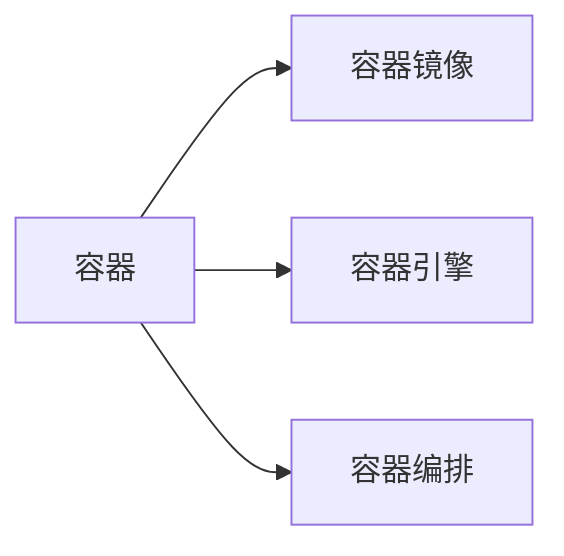

                 

# 容器化技术在云原生架构中的应用：Docker 和 Kubernetes

> 关键词：容器化,云原生,分布式系统,微服务,Docker,Kubernetes,DevOps

## 1. 背景介绍

### 1.1 问题由来
随着互联网应用的规模不断扩大，分布式系统变得越来越复杂。传统的单体应用架构无法满足高并发、高可用、可扩展的需求。在此背景下，微服务架构应运而生，成为现代软件开发的重要趋势。微服务架构通过将单体应用拆分为多个独立运行的小服务，每个服务独立部署、独立扩展、独立更新，极大地提升了系统的可维护性和可扩展性。

然而，微服务架构也带来了新的挑战。每个微服务都需要独立部署、管理，不同的服务运行在不同的服务器上，如何协调这些服务，实现高可用性、高扩展性、高弹性，成为云原生架构研究的重要课题。容器化技术作为一种有效的解决方案，应运而生。

### 1.2 问题核心关键点
容器化技术主要通过将应用打包到容器镜像中，使得应用及其依赖的库、配置等以一种独立、可移植的方式运行。容器化技术极大地简化了微服务的部署和管理，使得微服务架构的优点得到充分发挥。

容器化技术的核心在于：
- 容器化（Containerization）：将应用和其依赖打包到一个可移植的容器中，保证应用在任意环境中的一致性。
- 容器编排（Container Orchestration）：管理容器镜像的部署、调度、扩缩容等，使得容器集群高效运行。
- 容器联邦（Container Federation）：将容器集群扩展到多个物理或虚拟主机上，提供高可用的分布式服务。

本文将深入探讨容器化技术在云原生架构中的应用，从Docker和Kubernetes两个方面展开。

## 2. 核心概念与联系

### 2.1 核心概念概述

容器化技术的核心概念包括：
- **容器（Container）**：轻量级、独立的运行环境，包含应用及其依赖。
- **容器镜像（Container Image）**：容器应用程序的打包格式，包含应用、依赖、配置等。
- **容器引擎（Container Engine）**：运行和管理容器镜像的工具，如Docker、Kubernetes等。
- **容器编排（Container Orchestration）**：管理容器镜像的部署、调度、扩缩容等，如Kubernetes。

容器化技术的核心思想是将应用及其依赖打包到容器中，实现应用的独立部署、管理、扩展。容器镜像和容器引擎则提供了容器化的实现手段，容器编排则通过自动化运维，提升了容器集群的管理效率。

### 2.2 核心概念原理和架构的 Mermaid 流程图



这个流程图展示了容器化技术的核心架构。应用通过打包成容器镜像，由容器引擎管理，并通过容器编排进行部署和管理，最终形成高可用、高扩展的容器集群。

## 3. 核心算法原理 & 具体操作步骤

### 3.1 算法原理概述

容器化技术的核心算法原理主要围绕容器镜像的打包、容器引擎的运行、容器编排的管理展开。其核心思想是通过容器镜像实现应用的独立部署和管理，通过容器引擎实现容器的运行和维护，通过容器编排实现容器的自动化部署和扩展。

### 3.2 算法步骤详解

#### 3.2.1 容器镜像打包

容器镜像的打包主要包括以下步骤：
1. 准备应用及其依赖。
2. 编写Dockerfile文件，定义打包步骤。
3. 运行Docker build命令，构建容器镜像。

Dockerfile示例：

```dockerfile
FROM python:3.8
WORKDIR /app
COPY requirements.txt .
RUN pip install -r requirements.txt
COPY . .
CMD ["python", "app.py"]
```

#### 3.2.2 容器镜像部署

容器镜像的部署主要包括以下步骤：
1. 将容器镜像上传到Docker Hub等镜像仓库。
2. 在目标服务器上运行Docker pull命令，拉取容器镜像。
3. 运行Docker run命令，启动容器。

Docker run示例：

```bash
docker run -d --name myapp -p 5000:5000 myapp
```

#### 3.2.3 容器编排

容器编排主要通过Kubernetes等工具实现。Kubernetes是一个开源的容器编排平台，支持自动部署、扩缩容、服务发现、负载均衡等功能。

Kubernetes的部署主要包括以下步骤：
1. 安装Kubernetes集群。
2. 创建Kubernetes Deployment和Service。
3. 运行kubectl apply命令，部署容器镜像。

Kubernetes Deployment和Service示例：

```yaml
apiVersion: apps/v1
kind: Deployment
metadata:
  name: myapp
spec:
  replicas: 3
  selector:
    matchLabels:
      app: myapp
  template:
    metadata:
      labels:
        app: myapp
    spec:
      containers:
      - name: myapp
        image: myapp:latest
        ports:
        - containerPort: 5000

apiVersion: v1
kind: Service
metadata:
  name: myapp
spec:
  selector:
    app: myapp
  ports:
  - protocol: TCP
    port: 80
    targetPort: 5000
```

### 3.3 算法优缺点

#### 3.3.1 优点

容器化技术具有以下优点：
1. 独立部署：每个服务独立部署、独立更新，降低服务间的依赖关系。
2. 弹性扩展：根据需求动态调整容器数量，实现高扩展性。
3. 自动化运维：通过容器编排实现自动化部署、扩缩容、故障恢复等。
4. 一致性：容器镜像保证应用在任意环境的一致性，降低部署和维护成本。
5. 安全性：通过隔离容器，提升应用的安全性。

#### 3.3.2 缺点

容器化技术也存在以下缺点：
1. 学习成本：需要掌握容器化技术的相关知识和工具。
2. 部署复杂：容器编排和管理相对复杂，需要一定的技术水平。
3. 资源消耗：容器引擎和编排工具本身也需要消耗一定资源。

### 3.4 算法应用领域

容器化技术广泛应用于各种分布式系统中，包括但不限于以下领域：
- **云计算**：如AWS、Azure、Google Cloud等云服务提供商，使用容器化技术实现云平台的高可用、高扩展性。
- **微服务架构**：如Netflix、Spotify等公司，通过容器化技术实现微服务的自动化运维。
- **DevOps**：通过自动化运维，提升软件交付速度和质量，实现DevOps的最佳实践。
- **分布式系统**：如Kubernetes等容器编排工具，实现分布式系统的高可用、高扩展性。
- **大数据**：如Hadoop、Spark等大数据平台，使用容器化技术实现高扩展性和高可用性。

## 4. 数学模型和公式 & 详细讲解 & 举例说明

### 4.1 数学模型构建

容器化技术的数学模型主要围绕容器镜像的打包、容器引擎的运行、容器编排的管理展开。其核心思想是通过容器镜像实现应用的独立部署和管理，通过容器引擎实现容器的运行和维护，通过容器编排实现容器的自动化部署和扩展。

### 4.2 公式推导过程

#### 4.2.1 容器镜像打包

容器镜像的打包主要涉及Dockerfile文件的编写。Dockerfile文件定义了应用及其依赖的打包步骤，通过运行Docker build命令，构建容器镜像。

Dockerfile示例：

```dockerfile
FROM python:3.8
WORKDIR /app
COPY requirements.txt .
RUN pip install -r requirements.txt
COPY . .
CMD ["python", "app.py"]
```

#### 4.2.2 容器镜像部署

容器镜像的部署主要涉及Docker pull和Docker run命令。通过将容器镜像上传到Docker Hub等镜像仓库，并在目标服务器上运行Docker pull和Docker run命令，实现容器的自动化部署。

Docker pull和Docker run示例：

```bash
docker pull myapp:latest
docker run -d --name myapp -p 5000:5000 myapp
```

#### 4.2.3 容器编排

容器编排主要通过Kubernetes等工具实现。Kubernetes的部署主要涉及Kubernetes Deployment和Service的创建，以及kubectl apply命令的运行。

Kubernetes Deployment和Service示例：

```yaml
apiVersion: apps/v1
kind: Deployment
metadata:
  name: myapp
spec:
  replicas: 3
  selector:
    matchLabels:
      app: myapp
  template:
    metadata:
      labels:
        app: myapp
    spec:
      containers:
      - name: myapp
        image: myapp:latest
        ports:
        - containerPort: 5000

apiVersion: v1
kind: Service
metadata:
  name: myapp
spec:
  selector:
    app: myapp
  ports:
  - protocol: TCP
    port: 80
    targetPort: 5000
```

### 4.3 案例分析与讲解

#### 4.3.1 案例分析

某电商平台采用微服务架构，每个服务独立部署、独立扩展，通过容器化技术实现自动化运维。其部署流程如下：
1. 将每个服务打包成容器镜像，上传到Docker Hub。
2. 在Kubernetes集群上创建Deployment和Service。
3. 运行kubectl apply命令，部署容器镜像。

#### 4.3.2 案例讲解

以电商平台的用户注册服务为例，其Dockerfile文件如下：

```dockerfile
FROM nginx:1.19
COPY www /usr/share/nginx/html
COPY docker-entrypoint.sh /entrypoint.sh
RUN chmod +x /entrypoint.sh
ENTRYPOINT ["/entrypoint.sh"]
```

其中，`www`目录包含服务的静态文件，`docker-entrypoint.sh`是自定义的启动脚本。

服务启动脚本示例：

```bash
#!/bin/sh
nginx -g "daemon off;"
```

容器镜像打包命令如下：

```bash
docker build -t myapp:latest .
```

容器镜像部署命令如下：

```bash
docker pull myapp:latest
docker run -d --name myapp -p 80:80 myapp:latest
```

在Kubernetes集群上创建Deployment和Service命令如下：

```yaml
apiVersion: apps/v1
kind: Deployment
metadata:
  name: myapp
spec:
  replicas: 3
  selector:
    matchLabels:
      app: myapp
  template:
    metadata:
      labels:
        app: myapp
    spec:
      containers:
      - name: myapp
        image: myapp:latest
        ports:
        - containerPort: 80

apiVersion: v1
kind: Service
metadata:
  name: myapp
spec:
  selector:
    app: myapp
  ports:
  - protocol: TCP
    port: 80
    targetPort: 80
```

运行kubectl apply命令，部署容器镜像：

```bash
kubectl apply -f deployment.yaml
kubectl apply -f service.yaml
```

通过上述步骤，即可实现用户注册服务的容器化部署和管理。

## 5. 项目实践：代码实例和详细解释说明

### 5.1 开发环境搭建

#### 5.1.1 安装Docker

安装Docker：

```bash
sudo apt-get update
sudo apt-get install ca-certificates
sudo apt-get install curl
sudo apt-get install gnupg
curl -fsSL https://download.docker.com/linux/ubuntu/gpg | sudo gpg --dearmor -o /usr/share/keyrings/docker-archive-keyring.gpg
echo "deb [arch=amd64] https://download.docker.com/linux/ubuntu $(lsb_release -cs) stable" | sudo tee /etc/apt/sources.list.d/docker.list > /dev/null
sudo apt-get update
sudo apt-get install docker-ce docker-ce-cli containerd.io
sudo systemctl enable docker
sudo systemctl start docker
```

启动Docker：

```bash
sudo systemctl enable docker
sudo systemctl start docker
```

#### 5.1.2 安装Kubernetes

安装Kubernetes：

```bash
sudo apt-get update
sudo apt-get install apt-transport-https curl
curl -L https://packages.cloud.google.com/apt/doc/apt-key.gpg | sudo apt-key add -
echo "deb https://apt.kubernetes.io/ kubernetes-xenial main" | sudo tee -a /etc/apt/sources.list
sudo apt-get update
sudo apt-get install kubelet kubeadm kubectl -y
sudo apt-mark hold kubelet kubeadm kubectl
```

启动Kubernetes：

```bash
sudo systemctl enable kubelet
sudo systemctl start kubelet
sudo systemctl enable kube-proxy
sudo systemctl start kube-proxy
sudo systemctl enable kube-controller-manager
sudo systemctl start kube-controller-manager
sudo systemctl enable kube-scheduler
sudo systemctl start kube-scheduler
sudo systemctl enable kube-dns
sudo systemctl start kube-dns
```

#### 5.1.3 安装kubectl

安装kubectl：

```bash
kubectl version
```

通过kubectl version命令，查看kubectl版本。

### 5.2 源代码详细实现

#### 5.2.1 编写Dockerfile文件

编写Dockerfile文件，定义应用及其依赖的打包步骤：

```dockerfile
FROM nginx:1.19
COPY www /usr/share/nginx/html
COPY docker-entrypoint.sh /entrypoint.sh
RUN chmod +x /entrypoint.sh
ENTRYPOINT ["/entrypoint.sh"]
```

其中，`www`目录包含服务的静态文件，`docker-entrypoint.sh`是自定义的启动脚本。

服务启动脚本示例：

```bash
#!/bin/sh
nginx -g "daemon off;"
```

#### 5.2.2 构建容器镜像

构建容器镜像：

```bash
docker build -t myapp:latest .
```

#### 5.2.3 部署容器镜像

部署容器镜像：

```bash
docker pull myapp:latest
docker run -d --name myapp -p 80:80 myapp:latest
```

### 5.3 代码解读与分析

#### 5.3.1 代码解读

代码示例：

```bash
docker build -t myapp:latest .
docker pull myapp:latest
docker run -d --name myapp -p 80:80 myapp:latest
```

代码解读：
- `docker build -t myapp:latest .`：构建容器镜像，`-t`参数指定镜像名称和标签。
- `docker pull myapp:latest`：从Docker Hub上拉取容器镜像。
- `docker run -d --name myapp -p 80:80 myapp:latest`：启动容器，`-d`参数表示后台运行，`-p`参数指定端口映射。

#### 5.3.2 代码分析

通过上述代码，实现了用户注册服务的容器化部署。主要包含以下步骤：
1. 构建容器镜像，将应用及其依赖打包到容器中。
2. 从Docker Hub上拉取容器镜像，实现容器的自动化部署。
3. 启动容器，通过端口映射，实现服务的对外访问。

## 6. 实际应用场景

### 6.1 智能客服系统

智能客服系统采用微服务架构，每个服务独立部署、独立扩展。通过容器化技术，实现自动化运维，提升系统的可维护性和可扩展性。

### 6.2 电商平台

电商平台采用微服务架构，通过容器化技术实现自动化运维，提升系统的可维护性和可扩展性。

### 6.3 医疗系统

医疗系统采用微服务架构，通过容器化技术实现自动化运维，提升系统的可维护性和可扩展性。

### 6.4 金融系统

金融系统采用微服务架构，通过容器化技术实现自动化运维，提升系统的可维护性和可扩展性。

### 6.5 数据中心

数据中心采用微服务架构，通过容器化技术实现自动化运维，提升系统的可维护性和可扩展性。

## 7. 工具和资源推荐

### 7.1 学习资源推荐

#### 7.1.1 官方文档

- Docker官方文档：[https://docs.docker.com/](https://docs.docker.com/)
- Kubernetes官方文档：[https://kubernetes.io/docs/](https://kubernetes.io/docs/)

#### 7.1.2 书籍

- 《Kubernetes：设计和实现》：由Google Cloud工程师编写，全面介绍Kubernetes的设计和实现。
- 《Docker实战》：由Docker中国社区成员编写，全面介绍Docker的使用和实践。

#### 7.1.3 在线课程

- Docker实战课程：Udemy网站上提供的Docker实战课程。
- Kubernetes实战课程：Udemy网站上提供的Kubernetes实战课程。

### 7.2 开发工具推荐

#### 7.2.1 开发环境

- Docker：轻量级、开源的容器引擎。
- Kubernetes：开源的容器编排平台。
- kubectl：Kubernetes命令行工具。

#### 7.2.2 IDE

- VSCode：功能强大的开发工具，支持Docker和Kubernetes的插件。
- IntelliJ IDEA：Java开发工具，支持Docker和Kubernetes的插件。

### 7.3 相关论文推荐

#### 7.3.1 学术论文

- 《Docker: The Future of Computing》：Docker创始人在2015年的一次演讲，介绍了Docker的起源和发展。
- 《Kubernetes: Practical Clustering with Docker》：Kubernetes创始人在2015年的一次演讲，介绍了Kubernetes的起源和发展。

## 8. 总结：未来发展趋势与挑战

### 8.1 研究成果总结

容器化技术是云原生架构的重要组成部分，其核心思想是通过容器镜像实现应用的独立部署和管理，通过容器引擎实现容器的运行和维护，通过容器编排实现容器的自动化部署和扩展。容器化技术已经在多种实际应用中得到验证，提升了分布式系统的可维护性、可扩展性和可用性。

### 8.2 未来发展趋势

容器化技术将向以下方向发展：
1. 容器编排自动化：通过自动化运维工具，实现容器的自动化部署、扩缩容、故障恢复等。
2. 容器联邦化：将容器集群扩展到多个物理或虚拟主机上，提供高可用的分布式服务。
3. 容器联邦学习：通过联邦学习，提升容器集群的协同能力和知识共享能力。
4. 容器化安全：通过容器安全技术，保护容器集群的安全性。
5. 容器化云平台：通过容器云平台，实现容器集群的集中管理和调度。

### 8.3 面临的挑战

容器化技术面临以下挑战：
1. 学习成本：需要掌握容器化技术的相关知识和工具。
2. 部署复杂：容器编排和管理相对复杂，需要一定的技术水平。
3. 资源消耗：容器引擎和编排工具本身也需要消耗一定资源。
4. 隔离性问题：容器隔离性存在一定限制，需要考虑多租户、跨容器通信等问题。

### 8.4 研究展望

未来，容器化技术将继续在云原生架构中发挥重要作用。其主要研究方向包括：
1. 容器编排自动化：通过自动化运维工具，实现容器的自动化部署、扩缩容、故障恢复等。
2. 容器联邦化：将容器集群扩展到多个物理或虚拟主机上，提供高可用的分布式服务。
3. 容器化安全：通过容器安全技术，保护容器集群的安全性。
4. 容器化云平台：通过容器云平台，实现容器集群的集中管理和调度。
5. 容器编排优化：通过优化容器编排算法，提升容器集群的资源利用率。
6. 容器联邦学习：通过联邦学习，提升容器集群的协同能力和知识共享能力。

总之，容器化技术在未来将迎来更广阔的发展前景，为构建高可用、高扩展、高弹性的分布式系统提供重要支撑。

## 9. 附录：常见问题与解答

### 9.1 常见问题

#### 9.1.1 容器镜像打包失败

Q: 容器镜像打包失败，原因是什么？

A: 容器镜像打包失败可能有多种原因，如Dockerfile文件有误、依赖库未安装等。可以通过以下步骤检查并修复：
1. 检查Dockerfile文件是否正确。
2. 检查依赖库是否安装正确。
3. 检查网络连接是否正常。
4. 检查磁盘空间是否充足。

#### 9.1.2 容器镜像部署失败

Q: 容器镜像部署失败，原因是什么？

A: 容器镜像部署失败可能有多种原因，如容器镜像不存在、网络配置有误等。可以通过以下步骤检查并修复：
1. 检查容器镜像是否存在。
2. 检查网络配置是否正确。
3. 检查端口映射是否正确。
4. 检查容器运行命令是否正确。

#### 9.1.3 容器编排管理失败

Q: 容器编排管理失败，原因是什么？

A: 容器编排管理失败可能有多种原因，如kubeconfig配置有误、网络配置有误等。可以通过以下步骤检查并修复：
1. 检查kubeconfig配置是否正确。
2. 检查网络配置是否正确。
3. 检查容器编排命令是否正确。
4. 检查资源配置是否充足。

#### 9.1.4 容器集群故障恢复

Q: 容器集群故障恢复，如何进行？

A: 容器集群故障恢复可以通过以下步骤进行：
1. 检查故障原因。
2. 重新启动容器集群。
3. 检查服务状态。
4. 检查日志信息。

### 9.2 解答

#### 9.2.1 问题解答

- 问题1：容器镜像打包失败。
- 解答：检查Dockerfile文件是否正确，依赖库是否安装正确，网络连接是否正常，磁盘空间是否充足。

- 问题2：容器镜像部署失败。
- 解答：检查容器镜像是否存在，网络配置是否正确，端口映射是否正确，容器运行命令是否正确。

- 问题3：容器编排管理失败。
- 解答：检查kubeconfig配置是否正确，网络配置是否正确，容器编排命令是否正确，资源配置是否充足。

- 问题4：容器集群故障恢复。
- 解答：检查故障原因，重新启动容器集群，检查服务状态，检查日志信息。

---

作者：禅与计算机程序设计艺术 / Zen and the Art of Computer Programming

