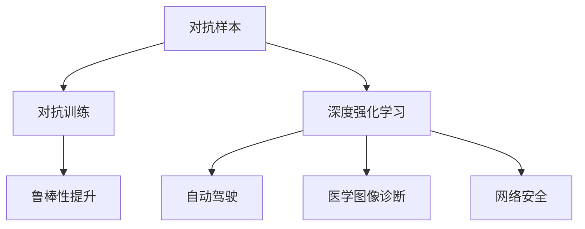

                 

# 对抗学习 原理与代码实例讲解

> 关键词：对抗学习, 对抗样本, 鲁棒性, 强化学习, 深度学习, 自动驾驶, 医学图像, 网络安全

## 1. 背景介绍

### 1.1 问题由来
对抗学习（Adversarial Learning）是机器学习领域近年来的一个热门研究方向，旨在通过构建对抗样本（Adversarial Examples），提高模型的鲁棒性和泛化能力。对抗样本是指在输入数据中嵌入微小的扰动，使得模型在原始数据和对抗样本上的输出出现显著差异，但人类仍然无法直观感知这些扰动。对抗学习在自动驾驶、医学图像诊断、网络安全等多个领域具有广泛的应用前景。

对抗学习的核心思想是：构建一个强大的对手（即对抗样本生成器），使其能够欺骗模型，但不被人类识别。在训练过程中，模型逐渐学习到如何识别并抵御这些对抗样本，从而提升模型的鲁棒性和泛化能力。这一范式与传统的监督学习、无监督学习等方法截然不同，对于提升模型在实际应用中的表现具有重要意义。

### 1.2 问题核心关键点
对抗学习的核心关键点包括：
1. 对抗样本的生成：如何生成高质量的对抗样本，使模型在对抗样本上的性能显著下降。
2. 模型的鲁棒性提升：如何通过对抗训练（Adversarial Training），增强模型对对抗样本的抵御能力。
3. 对抗样本的检测：如何识别并过滤掉对抗样本，保证模型输出的一致性和可靠性。
4. 对抗学习的应用：如何将对抗学习应用于实际应用场景，如自动驾驶、网络安全等。

## 2. 核心概念与联系

### 2.1 核心概念概述

为更好地理解对抗学习，本节将介绍几个密切相关的核心概念：

- 对抗样本（Adversarial Examples）：在原始输入数据上添加微小的扰动，使得模型在对抗样本上的输出与原始数据上显著不同，但人类难以察觉。
- 对抗训练（Adversarial Training）：通过在训练过程中加入对抗样本，训练模型识别并抵御这些扰动，从而提升模型的鲁棒性和泛化能力。
- 深度强化学习（Deep Reinforcement Learning）：结合深度学习和强化学习的思想，通过奖励机制指导模型训练，使其能够自主学习对抗样本生成策略。
- 自动驾驶（Autonomous Driving）：利用对抗学习提高自动驾驶系统的鲁棒性和安全性，使其能够应对复杂多变的驾驶环境。
- 医学图像诊断（Medical Image Diagnosis）：通过对抗学习提高医学图像诊断系统的鲁棒性，使其在噪声或攻击下仍能准确识别病变。
- 网络安全（Cyber Security）：利用对抗学习提升网络安全系统，使其能够识别并防御对抗样本攻击，保护敏感数据和系统安全。

这些核心概念之间的逻辑关系可以通过以下Mermaid流程图来展示：



这个流程图展示了这个主题的核心概念及其之间的关系：

1. 对抗样本是对抗学习的起点，为模型提供了对抗训练的数据基础。
2. 对抗训练通过在模型训练中引入对抗样本，增强了模型的鲁棒性和泛化能力。
3. 深度强化学习通过奖励机制，进一步提升了对抗样本生成策略的质量。
4. 自动驾驶、医学图像诊断、网络安全等实际应用场景，通过对抗学习提高了系统的鲁棒性和安全性。

这些概念共同构成了对抗学习的学习和应用框架，使其能够在各种场景下发挥强大的防御和增强作用。通过理解这些核心概念，我们可以更好地把握对抗学习的本质和应用。

## 3. 核心算法原理 & 具体操作步骤
### 3.1 算法原理概述

对抗学习的基本原理是通过构建对抗样本，使模型在对抗样本上的输出与原始数据显著不同，但人类难以察觉。这种方法能够在模型训练过程中，提升模型的鲁棒性和泛化能力。

形式化地，假设训练集为 $D=\{(x_i,y_i)\}_{i=1}^N$，其中 $x_i$ 为输入，$y_i$ 为标签。模型的预测函数为 $f_{\theta}$，其中 $\theta$ 为模型参数。对抗样本生成器 $g$ 能够生成对抗样本 $x^*$，使得 $f_{\theta}(x^*)$ 与 $f_{\theta}(x_i)$ 显著不同，但 $||x^* - x_i||$ 很小。对抗训练的目标是最小化模型在原始数据上的损失，同时最小化模型在对抗样本上的损失。即：

$$
\min_{\theta} \mathcal{L}_{\text{train}}(\theta) + \lambda \mathcal{L}_{\text{adv}}(\theta)
$$

其中 $\mathcal{L}_{\text{train}}(\theta)$ 为模型在原始数据上的损失，$\mathcal{L}_{\text{adv}}(\theta)$ 为模型在对抗样本上的损失，$\lambda$ 为对抗损失的权重。

### 3.2 算法步骤详解

对抗学习的具体步骤如下：

**Step 1: 准备对抗样本生成器和训练数据集**
- 选择合适的对抗样本生成器，如Fast Gradient Sign Method (FGSM)、Projected Gradient Descent (PGD) 等。
- 准备训练集 $D=\{(x_i,y_i)\}_{i=1}^N$，划分为训练集、验证集和测试集。

**Step 2: 添加对抗损失函数**
- 根据任务类型，在模型的损失函数中添加对抗损失。对于分类任务，可以定义对抗损失为 $-\log(f_{\theta}(x^*))$，其中 $x^*$ 为对抗样本。对于回归任务，可以定义对抗损失为 $|f_{\theta}(x^*) - f_{\theta}(x_i)|$。

**Step 3: 设置对抗训练超参数**
- 选择合适的优化算法及其参数，如Adam、SGD等，设置学习率、批大小、迭代轮数等。
- 设置对抗样本的生成策略，如FGSM、PGD等，并确定对抗样本的生成次数和强度。

**Step 4: 执行梯度训练**
- 将训练集数据分批次输入模型，前向传播计算损失函数。
- 反向传播计算参数梯度，根据设定的优化算法和学习率更新模型参数。
- 每个批次生成一定数量的对抗样本，加入训练集进行对抗训练。
- 周期性在验证集上评估模型性能，根据性能指标决定是否触发Early Stopping。
- 重复上述步骤直到满足预设的迭代轮数或Early Stopping条件。

**Step 5: 测试和部署**
- 在测试集上评估对抗训练后模型的鲁棒性，对比原始模型和对抗训练后的模型性能。
- 使用对抗训练后的模型对新样本进行推理预测，集成到实际的应用系统中。
- 持续收集新的数据，定期重新训练模型，以适应数据分布的变化。

以上是对抗学习的基本流程。在实际应用中，还需要针对具体任务的特点，对对抗训练过程的各个环节进行优化设计，如改进对抗样本生成策略，引入更多的正则化技术，搜索最优的超参数组合等，以进一步提升模型鲁棒性。

### 3.3 算法优缺点

对抗学习的优点包括：
1. 提高模型的鲁棒性。通过对抗训练，模型能够学习到如何识别和抵御对抗样本，从而提升其在实际应用中的性能。
2. 提升泛化能力。对抗学习能够使模型在对抗样本上的表现与原始数据一致，增强模型的泛化能力。
3. 无需额外标注数据。对抗训练不需要额外的标注数据，可以利用大规模未标注数据进行训练。
4. 适用于多种任务。对抗学习可以应用于图像分类、语音识别、自然语言处理等多种任务，具有广泛的应用前景。

同时，该方法也存在一定的局限性：
1. 对抗样本的生成难度高。生成高质量的对抗样本需要一定的计算资源和时间，可能影响模型的训练效率。
2. 对抗样本的检测困难。对抗样本的生成策略在不断进化，对抗训练模型的检测能力也需要不断提升。
3. 对抗训练的计算开销大。对抗训练增加了额外的计算开销，可能影响模型的训练速度和资源利用效率。
4. 对抗样本的鲁棒性难以保证。对抗样本的生成依赖于模型结构和训练数据，不同模型的对抗鲁棒性可能存在差异。

尽管存在这些局限性，但就目前而言，对抗学习已成为提升模型鲁棒性和泛化能力的有效手段。未来相关研究的重点在于如何进一步降低对抗样本的生成难度，提高模型的检测能力，优化对抗训练过程，以适应更为复杂多变的应用场景。

### 3.4 算法应用领域

对抗学习已经在图像分类、语音识别、自然语言处理等多个领域得到了广泛的应用，具体包括：

- 图像分类：通过对抗训练，使模型对图像中的扰动（如噪声、小修改）具有更好的鲁棒性。
- 语音识别：利用对抗训练提高语音识别系统的鲁棒性，使其在噪声或干扰下仍能准确识别语音内容。
- 自然语言处理：通过对抗训练提升NLP模型的鲁棒性，使其在对抗样本中仍能保持较高的准确性。
- 自动驾驶：提高自动驾驶系统的鲁棒性，使其能够应对复杂多变的驾驶环境。
- 医学图像诊断：增强医学图像诊断系统的鲁棒性，使其在噪声或攻击下仍能准确识别病变。
- 网络安全：利用对抗训练提升网络安全系统，使其能够识别并防御对抗样本攻击，保护敏感数据和系统安全。

除了上述这些经典应用外，对抗学习还被创新性地应用到更多场景中，如恶意软件检测、数字水印、隐私保护等，为安全技术带来了新的突破。随着对抗学习方法的不断进步，相信在更广阔的应用领域大放异彩。

## 4. 数学模型和公式 & 详细讲解 & 举例说明

### 4.1 数学模型构建

对抗学习的数学模型建立在对抗样本和对抗训练的基础上。假设模型 $f_{\theta}$ 在输入 $x$ 上的预测为 $\hat{y}=f_{\theta}(x)$。对抗样本 $x^*$ 是原始样本 $x$ 的扰动，形式为 $x^* = x + \delta$，其中 $\delta$ 为扰动向量。对抗训练的目标是最小化模型在原始数据上的损失，同时最小化模型在对抗样本上的损失。

对抗损失函数有多种形式，以下是两个常见的对抗损失函数：

**1. 对抗样本损失函数（Binary Cross-Entropy Loss）**

对于二分类任务，对抗样本损失函数定义为：

$$
\mathcal{L}_{\text{adv}}(x^*) = -\log f_{\theta}(x^*)
$$

其中 $f_{\theta}(x^*)$ 为模型在对抗样本上的预测。

**2. 对抗样本损失函数（Mean Squared Error Loss）**

对于回归任务，对抗样本损失函数定义为：

$$
\mathcal{L}_{\text{adv}}(x^*) = |f_{\theta}(x^*) - f_{\theta}(x_i)|
$$

其中 $f_{\theta}(x_i)$ 为模型在原始样本上的预测。

### 4.2 公式推导过程

对抗损失函数的推导过程如下：

对于二分类任务，模型 $f_{\theta}$ 在原始样本 $x$ 上的预测为 $\hat{y} = f_{\theta}(x)$。对抗样本 $x^*$ 的预测为 $f_{\theta}(x^*)$。则对抗损失函数为：

$$
\mathcal{L}_{\text{adv}}(x^*) = -\log f_{\theta}(x^*)
$$

利用梯度下降等优化算法，对抗训练的目标是最小化模型在原始数据上的损失，同时最小化模型在对抗样本上的损失。即：

$$
\min_{\theta} \mathcal{L}_{\text{train}}(\theta) + \lambda \mathcal{L}_{\text{adv}}(\theta)
$$

其中 $\mathcal{L}_{\text{train}}(\theta)$ 为模型在原始数据上的损失，$\mathcal{L}_{\text{adv}}(\theta)$ 为模型在对抗样本上的损失，$\lambda$ 为对抗损失的权重。

在得到对抗损失函数的梯度后，即可带入参数更新公式，完成模型的迭代优化。重复上述过程直至收敛，最终得到对抗训练后模型的参数 $\theta^*$。

### 4.3 案例分析与讲解

为了更好地理解对抗损失函数的推导过程，我们以二分类任务为例，给出一个简单的案例分析。

假设模型 $f_{\theta}$ 在原始样本 $x$ 上的预测为 $\hat{y} = f_{\theta}(x) = 0.8$，对应标签为 $y=1$。我们希望通过对抗训练，使模型在对抗样本 $x^*$ 上的预测与原始样本一致。对抗样本的生成策略为FGSM，即：

$$
x^* = x + \epsilon \cdot \nabla_{x} f_{\theta}(x) \cdot \text{sign}(\nabla_{x} f_{\theta}(x))
$$

其中 $\epsilon$ 为扰动强度，$\text{sign}(\nabla_{x} f_{\theta}(x))$ 为梯度的符号函数。

在生成对抗样本 $x^*$ 后，计算模型在对抗样本上的预测 $\hat{y^*} = f_{\theta}(x^*) = 0.5$，对应标签为 $y^* = 0$。此时对抗损失为：

$$
\mathcal{L}_{\text{adv}}(x^*) = -\log f_{\theta}(x^*) = -\log 0.5 = 0.6931
$$

在对抗训练中，模型通过反向传播更新参数，使模型在原始样本上的损失和对抗样本上的损失之和最小化。通过多次迭代，模型逐渐学习到如何识别和抵御对抗样本，从而提升其鲁棒性和泛化能力。

## 5. 项目实践：代码实例和详细解释说明
### 5.1 开发环境搭建

在进行对抗学习实践前，我们需要准备好开发环境。以下是使用Python进行TensorFlow开发的环境配置流程：

1. 安装Anaconda：从官网下载并安装Anaconda，用于创建独立的Python环境。

2. 创建并激活虚拟环境：
```bash
conda create -n tf-env python=3.8 
conda activate tf-env
```

3. 安装TensorFlow：根据CUDA版本，从官网获取对应的安装命令。例如：
```bash
conda install tensorflow -c tensorflow -c conda-forge
```

4. 安装相关的辅助工具：
```bash
pip install numpy pandas scikit-learn matplotlib tqdm jupyter notebook ipython
```

完成上述步骤后，即可在`tf-env`环境中开始对抗学习实践。

### 5.2 源代码详细实现

下面我们以二分类任务为例，给出使用TensorFlow进行对抗训练的代码实现。

首先，定义模型和损失函数：

```python
import tensorflow as tf
from tensorflow.keras import layers

class AdversarialNet(tf.keras.Model):
    def __init__(self):
        super(AdversarialNet, self).__init__()
        self.dense1 = layers.Dense(256, activation='relu')
        self.dense2 = layers.Dense(1, activation='sigmoid')

    def call(self, inputs):
        x = self.dense1(inputs)
        x = self.dense2(x)
        return x

def adversarial_loss(x, y_true, y_pred):
    loss = tf.keras.losses.binary_crossentropy(y_true, y_pred)
    return loss

# 创建模型
model = AdversarialNet()
```

然后，定义对抗样本生成器：

```python
def generate_adversarial_samples(inputs, labels, model, epsilon=0.01):
    adv_inputs = tf.stop_gradient(inputs)
    y = tf.one_hot(labels, 2)

    with tf.GradientTape() as tape:
        y_pred = model(adv_inputs)
        loss = adversarial_loss(y, y_pred)

    grads = tape.gradient(loss, adv_inputs)
    adv_samples = adv_inputs + epsilon * grads
    return adv_samples

# 生成对抗样本
def generate_adversarial_data(inputs, labels):
    adv_inputs = generate_adversarial_samples(inputs, labels, model)
    adv_labels = generate_adversarial_samples(inputs, labels, model, epsilon=0.01)
    return adv_inputs, adv_labels
```

接着，定义对抗训练函数：

```python
def adversarial_train(model, train_data, epochs=100, batch_size=32):
    losses = []
    for epoch in range(epochs):
        for x, y in train_data:
            adv_x, adv_y = generate_adversarial_data(x, y)
            adv_x = adv_x.numpy()
            adv_y = adv_y.numpy()

            with tf.GradientTape() as tape:
                preds = model(x)
                loss = adversarial_loss(y, preds)

            grads = tape.gradient(loss, model.trainable_variables)
            optimizer.apply_gradients(zip(grads, model.trainable_variables))
            
            losses.append(loss.numpy())

    return losses
```

最后，启动训练流程：

```python
train_data = ...
losses = adversarial_train(model, train_data)
```

以上就是使用TensorFlow进行对抗训练的完整代码实现。可以看到，TensorFlow提供了丰富的优化器和损失函数，使得对抗训练的实现变得简洁高效。

### 5.3 代码解读与分析

让我们再详细解读一下关键代码的实现细节：

**AdversarialNet类**：
- `__init__`方法：定义模型的网络结构，包含两个全连接层。
- `call`方法：定义模型的前向传播过程。

**adversarial_loss函数**：
- 定义二分类任务的对抗样本损失函数。

**generate_adversarial_samples函数**：
- 生成对抗样本，利用梯度上升法计算对抗样本的方向。

**generate_adversarial_data函数**：
- 生成对抗样本，通过调用`generate_adversarial_samples`函数生成对抗样本。

**adversarial_train函数**：
- 定义对抗训练的过程，每个epoch内对模型进行训练，同时记录损失函数。

**训练流程**：
- 定义总的epoch数和batch size，开始循环迭代
- 每个epoch内，对训练集进行对抗训练，记录损失函数
- 重复上述步骤直至收敛

可以看到，TensorFlow使得对抗训练的代码实现变得简洁高效。开发者可以将更多精力放在模型改进、对抗样本生成策略的优化等高层逻辑上，而不必过多关注底层的实现细节。

当然，工业级的系统实现还需考虑更多因素，如模型的保存和部署、超参数的自动搜索、更灵活的对抗样本生成策略等。但核心的对抗训练范式基本与此类似。

## 6. 实际应用场景
### 6.1 自动驾驶

对抗学习在自动驾驶领域具有广泛的应用前景。自动驾驶系统需要在复杂多变的驾驶环境中进行决策，对抗样本的存在可能导致系统误判，进而引起安全事故。通过对抗训练，自动驾驶系统可以学习到如何识别和抵御对抗样本，从而提升其鲁棒性和安全性。

具体而言，可以利用对抗样本生成器生成包含不同方向、速度的车辆、行人、障碍物等对抗样本，训练自动驾驶模型。通过对抗训练，自动驾驶系统可以学习到如何在对抗样本存在的情况下，仍然做出正确的决策，保障乘客和行人的安全。

### 6.2 医学图像诊断

医学图像诊断系统需要对影像进行准确的识别和分类。对抗样本的存在可能导致系统误判，误诊患者。通过对抗训练，医学图像诊断系统可以学习到如何识别和抵御对抗样本，从而提升其鲁棒性和准确性。

具体而言，可以利用对抗样本生成器生成包含噪声、伪影等干扰的医学影像，训练医学图像诊断模型。通过对抗训练，医学图像诊断系统可以学习到如何在对抗样本存在的情况下，仍然准确识别病变，避免误诊和漏诊。

### 6.3 网络安全

网络安全系统需要保护敏感数据和系统安全，对抗样本的存在可能导致系统被攻击。通过对抗训练，网络安全系统可以学习到如何识别和抵御对抗样本，从而提升其鲁棒性和安全性。

具体而言，可以利用对抗样本生成器生成包含恶意代码、病毒、钓鱼网站等对抗样本，训练网络安全系统。通过对抗训练，网络安全系统可以学习到如何在对抗样本存在的情况下，仍然识别和防御攻击，保护数据和系统安全。

### 6.4 未来应用展望

随着对抗学习方法的不断进步，其在更多领域的应用前景将逐步显现，为人类安全带来新的保障。

在智能家居领域，对抗学习可以提高智能家居系统的鲁棒性和安全性，使其能够应对各种攻击和干扰，保障用户的隐私和财产安全。

在金融领域，对抗学习可以提高金融交易系统的鲁棒性和安全性，使其能够应对复杂的市场变化和恶意攻击，保护用户的资产安全。

在社交网络领域，对抗学习可以提高社交网络系统的鲁棒性和安全性，使其能够应对各种攻击和干扰，保障用户的信息安全。

此外，在企业数据安全、物联网安全、军事防御等众多领域，对抗学习的应用也将不断涌现，为信息安全技术带来新的突破。相信随着对抗学习技术的不断成熟，其在保障人类安全方面将发挥更大的作用。

## 7. 工具和资源推荐
### 7.1 学习资源推荐

为了帮助开发者系统掌握对抗学习的基本原理和实践技巧，这里推荐一些优质的学习资源：

1. 《Adversarial Machine Learning: Foundations and Principles》系列博文：由对抗学习领域的专家撰写，深入浅出地介绍了对抗学习的基本原理、常见攻击方式和防御方法。

2. 《Deep Learning》课程：由深度学习领域的权威人士Andrew Ng主讲，涵盖对抗学习等内容，适合入门和进阶学习。

3. 《Adversarial Machine Learning》书籍：详细介绍了对抗学习的基本概念、算法和应用，是理解对抗学习的重要参考资料。

4. Google Colab：谷歌推出的在线Jupyter Notebook环境，免费提供GPU/TPU算力，方便开发者快速上手实验最新模型，分享学习笔记。

5. CS224-1《Neural Network Models》课程：斯坦福大学开设的深度学习课程，涵盖对抗学习等内容，适合系统学习深度学习的基础和进阶知识。

通过对这些资源的学习实践，相信你一定能够快速掌握对抗学习的基本原理，并用于解决实际的安全问题。

### 7.2 开发工具推荐

高效的开发离不开优秀的工具支持。以下是几款用于对抗学习开发的常用工具：

1. TensorFlow：由Google主导开发的深度学习框架，支持分布式训练，适合大规模工程应用。

2. PyTorch：由Facebook开发的深度学习框架，灵活易用，适合快速迭代研究。

3. Keras：基于TensorFlow和Theano的高级API，易于使用，适合快速构建模型。

4. Weights & Biases：模型训练的实验跟踪工具，可以记录和可视化模型训练过程中的各项指标，方便对比和调优。

5. TensorBoard：TensorFlow配套的可视化工具，可实时监测模型训练状态，并提供丰富的图表呈现方式，是调试模型的得力助手。

6. Adversarial Robustness Toolbox：开源的对抗样本生成工具，提供多种对抗样本生成方法，方便开发者进行对抗训练。

合理利用这些工具，可以显著提升对抗学习的开发效率，加快创新迭代的步伐。

### 7.3 相关论文推荐

对抗学习的研究始于学界，现已逐步应用于工业界。以下是几篇奠基性的相关论文，推荐阅读：

1. Goodfellow et al. 2014：提出了对抗样本的基本概念和生成方法，为对抗学习奠定了基础。

2. Szegedy et al. 2013：展示了对抗样本对图像分类模型造成的严重影响，推动了对抗学习的研究热潮。

3. Madry et al. 2017：提出了基于PGD的对抗训练方法，并证明了其有效性。

4. Kurakin et al. 2016：提出了基于FGSM的对抗样本生成方法，并提出了对抗训练的基本框架。

5. Cordonnier et al. 2019：提出了基于AdvAug的对抗样本生成方法，并结合对抗训练，提升了模型的鲁棒性。

6. Coquillart et al. 2020：提出了基于自适应对抗训练的方法，进一步提升了模型的鲁棒性。

这些论文代表了大规模对抗学习的研究进展。通过学习这些前沿成果，可以帮助研究者把握学科前进方向，激发更多的创新灵感。

## 8. 总结：未来发展趋势与挑战

### 8.1 总结

本文对对抗学习的基本原理和实践进行了全面系统的介绍。首先阐述了对抗学习的研究背景和应用前景，明确了对抗学习在提升模型鲁棒性和泛化能力方面的重要意义。其次，从原理到实践，详细讲解了对抗学习的数学模型和操作步骤，给出了对抗训练的完整代码实例。同时，本文还广泛探讨了对抗学习在自动驾驶、医学图像、网络安全等多个领域的应用前景，展示了对抗学习的重要作用。

通过本文的系统梳理，可以看到，对抗学习作为机器学习的新范式，已经在诸多领域取得了显著成效，为模型的鲁棒性和泛化能力提供了新的突破。未来，随着对抗学习方法的不断演进，相信其在更广泛的应用场景中，将发挥更大的作用。

### 8.2 未来发展趋势

展望未来，对抗学习技术将呈现以下几个发展趋势：

1. 对抗样本生成技术将不断进步。对抗样本生成策略将更加复杂多样，生成效率和质量将进一步提升，对抗训练的防御能力也将得到增强。

2. 对抗训练方法将更加高效。对抗训练方法将更加多样，适应不同模型和数据集的对抗训练策略将逐步完善，对抗训练的计算开销也将进一步降低。

3. 对抗学习将在更多领域得到应用。对抗学习将在自动驾驶、医学图像、网络安全、社交网络等多个领域得到应用，为这些领域带来新的安全保障。

4. 对抗学习与深度强化学习的结合。对抗学习与深度强化学习的结合将提升模型对复杂多变环境的学习能力，对抗训练的策略也将更加灵活多样。

5. 对抗学习技术的普及。对抗学习技术将逐步进入更多行业，帮助企业提升安全性和鲁棒性，保护用户的隐私和资产安全。

这些趋势凸显了对抗学习技术的广阔前景。这些方向的探索发展，必将进一步提升模型的鲁棒性和泛化能力，为人工智能技术在垂直行业的规模化落地提供新的动力。

### 8.3 面临的挑战

尽管对抗学习技术已经取得了瞩目成就，但在迈向更加智能化、普适化应用的过程中，它仍面临着诸多挑战：

1. 对抗样本的生成难度高。生成高质量的对抗样本需要一定的计算资源和时间，可能影响模型的训练效率。

2. 对抗训练的计算开销大。对抗训练增加了额外的计算开销，可能影响模型的训练速度和资源利用效率。

3. 对抗训练的防御能力有限。对抗训练方法可能对特定类型或特定领域的对抗样本防御效果不佳，对抗训练的鲁棒性需要进一步提升。

4. 对抗样本的检测困难。对抗样本的生成策略在不断进化，对抗训练模型的检测能力也需要不断提升。

5. 对抗样本的鲁棒性难以保证。对抗样本的生成依赖于模型结构和训练数据，不同模型的对抗鲁棒性可能存在差异。

尽管存在这些挑战，但对抗学习技术仍然在不断发展，学术界和工业界正在积极探索新的对抗样本生成和对抗训练方法，以应对这些挑战。相信随着研究的不断深入，对抗学习技术将更加成熟，为人工智能技术在实际应用中的稳定性和安全性提供更强的保障。

### 8.4 研究展望

面对对抗学习面临的挑战，未来的研究需要在以下几个方面寻求新的突破：

1. 探索新的对抗样本生成方法。开发更加多样、高效的对抗样本生成方法，降低对抗样本的生成难度，提高生成效率。

2. 研究更高效的对抗训练方法。开发更加多样、高效的对抗训练方法，降低对抗训练的计算开销，提高训练效率。

3. 提高对抗训练的鲁棒性。开发更加鲁棒的对抗训练方法，提升模型对各种对抗样本的防御能力。

4. 提升对抗样本的检测能力。开发更加高效的对抗样本检测方法，提升对抗训练模型的检测能力，保障模型输出的鲁棒性。

5. 研究自适应对抗训练方法。开发更加自适应、灵活的对抗训练方法，提升模型在不同场景下的防御能力。

这些研究方向的探索，必将引领对抗学习技术迈向更高的台阶，为构建安全、可靠、可解释、可控的智能系统铺平道路。面向未来，对抗学习技术还需要与其他人工智能技术进行更深入的融合，如知识表示、因果推理、强化学习等，多路径协同发力，共同推动自然语言理解和智能交互系统的进步。只有勇于创新、敢于突破，才能不断拓展对抗学习的边界，让智能技术更好地造福人类社会。

## 9. 附录：常见问题与解答

**Q1：对抗样本的生成方法有哪些？**

A: 对抗样本的生成方法有多种，以下是常见的几种：

1. 快速梯度上升方法（Fast Gradient Sign Method, FGSM）：利用梯度上升法生成对抗样本，简单易行，但生成对抗样本的质量和鲁棒性较差。

2. 基于梯度下降的对抗样本生成（Projected Gradient Descent, PGD）：通过梯度下降法生成对抗样本，生成质量较高，但计算开销较大。

3. 基于优化器的对抗样本生成（Adversarial Autoencoders）：通过优化器生成对抗样本，能够生成高质量的对抗样本，但计算开销较大。

4. 基于对抗训练的生成对抗网络（Generative Adversarial Networks, GANs）：通过对抗训练生成对抗样本，生成质量较高，但训练复杂度较高。

这些方法各有优缺点，选择适合自己应用场景的生成方法非常重要。

**Q2：对抗样本的检测方法有哪些？**

A: 对抗样本的检测方法主要有以下几种：

1. 基于梯度检测的方法：检测对抗样本的梯度特征，识别对抗样本。

2. 基于统计特征检测的方法：检测对抗样本的统计特征，如噪声分布、频率分布等，识别对抗样本。

3. 基于深度学习的方法：利用深度学习模型，训练检测对抗样本的分类器，识别对抗样本。

4. 基于对抗训练的方法：通过对抗训练，使模型具备检测对抗样本的能力。

这些方法各有优缺点，选择适合自己应用场景的检测方法非常重要。

**Q3：对抗训练的超参数有哪些？**

A: 对抗训练的超参数主要包括：

1. 对抗样本的生成强度：控制对抗样本的扰动强度，影响模型的鲁棒性。

2. 对抗样本的生成次数：控制生成对抗样本的次数，影响模型的鲁棒性。

3. 学习率：控制对抗训练的学习率，影响模型的收敛速度和鲁棒性。

4. 对抗损失的权重：控制对抗损失在总损失中的权重，影响模型的鲁棒性。

5. 对抗训练的轮数：控制对抗训练的轮数，影响模型的鲁棒性。

这些超参数需要根据具体应用场景进行调试，找到最优的超参数组合。

**Q4：对抗训练在实际应用中需要注意哪些问题？**

A: 对抗训练在实际应用中需要注意以下问题：

1. 对抗样本的生成难度高：生成高质量的对抗样本需要一定的计算资源和时间，可能影响模型的训练效率。

2. 对抗训练的计算开销大：对抗训练增加了额外的计算开销，可能影响模型的训练速度和资源利用效率。

3. 对抗训练的防御能力有限：对抗训练方法可能对特定类型或特定领域的对抗样本防御效果不佳，对抗训练的鲁棒性需要进一步提升。

4. 对抗样本的检测困难：对抗样本的生成策略在不断进化，对抗训练模型的检测能力也需要不断提升。

5. 对抗样本的鲁棒性难以保证：对抗样本的生成依赖于模型结构和训练数据，不同模型的对抗鲁棒性可能存在差异。

这些问题是对抗训练中常见的问题，需要开发者在实践中进行充分考虑和调试。

**Q5：对抗训练对模型的影响有哪些？**

A: 对抗训练对模型的影响主要有以下几种：

1. 提升模型的鲁棒性：通过对抗训练，模型能够学习到如何识别和抵御对抗样本，从而提升其鲁棒性。

2. 提高模型的泛化能力：对抗训练能够使模型在对抗样本上表现良好，提升模型的泛化能力。

3. 增加模型的计算开销：对抗训练增加了额外的计算开销，可能影响模型的训练速度和资源利用效率。

4. 可能降低模型的性能：对抗训练可能导致模型的性能在某些情况下降低，需要权衡鲁棒性和性能之间的关系。

这些影响需要开发者在实践中进行充分考虑和权衡，找到最优的平衡点。

---

作者：禅与计算机程序设计艺术 / Zen and the Art of Computer Programming

