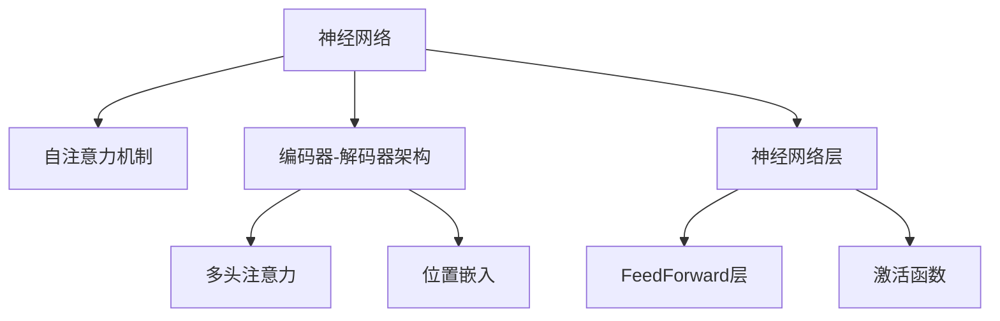

                 

# 层峦叠翠上青天：搭建GPT核心组件Transformer

> 关键词：Transformer, 自注意力机制, 神经网络, 大规模语言模型, 深度学习, 编码器-解码器结构

## 1. 背景介绍

### 1.1 问题由来
深度学习自2006年取得突破性进展以来，已成为人工智能领域不可或缺的一部分。其核心思想在于利用神经网络对输入数据进行多层次的非线性映射，从而实现从数据中提取高级特征。在NLP领域，深度学习被广泛应用于文本分类、情感分析、机器翻译等任务，取得了显著的进展。

然而，传统的深度神经网络在处理长序列数据时存在梯度消失/爆炸问题，难以对文本中的长距离依赖关系进行有效建模。为此，近年来，一种被称为Transformer的架构被提出，并迅速成为处理自然语言任务的主流模型。

Transformer采用自注意力机制，可以有效处理长序列，适用于自然语言处理任务中的编码-解码架构。自Attention机制通过让每个词与其他所有词建立关联，从而在计算复杂度较低的情况下获得较好的表示能力。这一突破性架构，使得大规模预训练语言模型在NLP领域取得了前所未有的成功。

### 1.2 问题核心关键点
Transformer的核心概念包括：

- **自注意力机制**：允许模型同时考虑输入序列中所有位置的信息，避免了传统RNN的梯度传递问题。
- **编码器-解码器结构**：通过编码器和解码器的结构，可以处理从序列到序列的映射任务。
- **神经网络层**：包括FeedForward层和激活函数层，用以对输入特征进行非线性映射。
- **多头注意力**：通过并行多个注意力层，提升模型对输入的多重关注能力。
- **位置编码**：由于Transformer缺乏自然的位置编码，通过引入位置嵌入，使模型能够理解输入序列中单词的相对位置关系。

这些核心概念共同构成了Transformer模型的理论基础，使得其在自然语言处理任务中表现出色。

### 1.3 问题研究意义
研究Transformer架构及其核心组件，对于理解大规模预训练语言模型的内部工作原理、改进模型性能、指导模型设计和应用，具有重要意义：

1. 提供了一种新的模型设计思路，推动了深度学习在自然语言处理中的应用。
2. 解决了长序列处理问题，提升了模型在多任务学习中的表现。
3. 通过引入自注意力机制，使模型能够捕捉输入序列的复杂关系，提高了模型对文本的理解能力。
4. 为大规模预训练语言模型的构建提供了重要支持，如BERT、GPT等模型均采用了Transformer架构。
5. 推动了NLP技术的产业化进程，促进了自然语言处理技术的广泛应用。

## 2. 核心概念与联系

### 2.1 核心概念概述

为更好地理解Transformer模型，本节将介绍几个与其紧密相关的核心概念：

- **神经网络(Neural Network)**：一种基于学习权值构建的计算图模型，通过训练可从输入数据中学习到复杂的特征表示。
- **自注意力机制(Self-Attention Mechanism)**：通过让每个位置关注其他位置，实现长距离依赖关系的建模。
- **编码器-解码器架构(Encoder-Decoder Architecture)**：一种用于处理序列到序列映射任务的模型架构。
- **多头注意力(Multi-Head Attention)**：通过并行多个注意力层，提升模型对输入的关注能力。
- **位置嵌入(Positional Embedding)**：通过引入位置嵌入，使模型能够理解输入序列中单词的相对位置关系。

这些核心概念之间的逻辑关系可以通过以下Mermaid流程图来展示：



这个流程图展示了大语言模型中Transformer模型的核心概念及其之间的关系：

1. 神经网络作为整个模型的基础架构，通过多层结构对输入数据进行非线性映射。
2. 自注意力机制和多头注意力作为关键组件，用于捕捉输入序列中长距离依赖关系和多重关注能力。
3. 位置嵌入和编码器-解码器架构，用以处理序列到序列的映射任务，并引入位置信息。
4. 神经网络层通过FeedForward和激活函数，实现对输入特征的非线性映射。

这些概念共同构成了Transformer模型的基本框架，使其能够高效处理自然语言数据。

## 3. 核心算法原理 & 具体操作步骤
### 3.1 算法原理概述

Transformer的核心算法原理主要集中在自注意力机制的设计上。Transformer通过自注意力机制，允许模型同时关注输入序列中所有位置的信息，有效解决了传统RNN在长序列处理中的梯度消失/爆炸问题。

Transformer中的自注意力机制由三个部分组成：查询层、键层和值层。每个位置生成的查询向量与所有位置的键向量和值向量进行计算，得到每个位置的注意力权重。通过加权平均计算，生成每个位置的表示向量。其基本计算公式如下：

$$
\text{Attention}(Q, K, V) = \frac{1}{\sqrt{d_k}}\sum_{i=1}^N \frac{Q_i \cdot K_i}{\sqrt{d_k}}V_i
$$

其中，$Q$ 为查询向量，$K$ 为键向量，$V$ 为值向量，$d_k$ 为键向量的维度。

Transformer模型通常由多个编码层和解码层组成，每层均包括自注意力机制和FeedForward网络。在编码层中，通过并行多个自注意力头，提升模型对输入的关注能力。在解码层中，引入注意力机制，指导模型对编码器的输出进行选择性关注。

### 3.2 算法步骤详解

Transformer模型的训练流程一般包括以下几个关键步骤：

**Step 1: 数据预处理**
- 将输入序列分词，转换为模型可处理的数字形式。
- 对输入序列进行位置嵌入，引入位置信息。
- 将输入序列划分为多个子序列，每个子序列作为一组训练数据。

**Step 2: 编码器训练**
- 对每个编码器层，使用自注意力机制和FeedForward网络进行计算。
- 在所有编码器层间进行堆叠，提升模型对输入的关注能力。
- 通过多层感知机对编码器输出进行线性映射，得到最终编码表示。

**Step 3: 解码器训练**
- 对每个解码器层，使用自注意力机制和FeedForward网络进行计算。
- 引入注意力机制，指导模型对编码器的输出进行选择性关注。
- 使用输出层对解码器输出进行线性映射，得到最终解码结果。

**Step 4: 端到端训练**
- 将编码器和解码器作为整体进行联合训练，通过最小化交叉熵损失函数进行优化。
- 在训练过程中，使用注意力机制和FeedForward网络对输入进行多次非线性映射。
- 通过多轮迭代训练，最小化模型预测与真实标签之间的差异。

### 3.3 算法优缺点

Transformer架构具有以下优点：

1. 能够处理长序列数据，解决了传统RNN在处理长距离依赖关系时的梯度消失/爆炸问题。
2. 引入自注意力机制，提升了模型对输入序列的多重关注能力。
3. 采用并行多头注意力，在保持计算效率的同时，提升了模型对输入的关注能力。
4. 引入位置嵌入，使模型能够理解输入序列中单词的相对位置关系。

但Transformer也存在一定的局限性：

1. 模型参数量较大，需要大量的计算资源和存储空间。
2. 难以直接应用到某些特定任务中，需要对模型进行一定的修改。
3. 模型中的自注意力机制可能导致计算复杂度高，训练时间长。
4. 模型对输入序列的噪声敏感，可能需要额外的噪声鲁棒性训练。
5. 模型的结构复杂，调试和优化相对困难。

尽管存在这些局限性，但Transformer架构在自然语言处理领域仍具有广泛的应用前景。

### 3.4 算法应用领域

Transformer架构在自然语言处理领域的应用已经非常广泛，涵盖了诸多任务，如：

- 文本分类：如情感分析、主题分类、意图识别等。通过自注意力机制捕捉输入序列的复杂关系。
- 命名实体识别：识别文本中的人名、地名、机构名等特定实体。通过自注意力机制和FeedForward网络进行特征提取和分类。
- 关系抽取：从文本中抽取实体之间的语义关系。通过自注意力机制和位置嵌入进行关系推理。
- 机器翻译：将源语言文本翻译成目标语言。通过编码器和解码器结构，实现序列到序列的映射。
- 文本摘要：将长文本压缩成简短摘要。通过编码器进行摘要生成，解码器进行摘要扩充。
- 对话系统：使机器能够与人自然对话。通过编码器和解码器结构，实现多轮对话。

除了上述这些经典任务外，Transformer架构还被创新性地应用到更多场景中，如可控文本生成、常识推理、代码生成、数据增强等，为NLP技术带来了全新的突破。

## 4. 数学模型和公式 & 详细讲解  
### 4.1 数学模型构建

Transformer模型的数学模型主要围绕自注意力机制和FeedForward网络展开。以机器翻译任务为例，构建Transformer模型的数学模型。

假设输入序列为 $x = \{x_1, x_2, ..., x_T\}$，输出序列为 $y = \{y_1, y_2, ..., y_T\}$，目标是将源语言序列 $x$ 翻译成目标语言序列 $y$。

**编码器**：
- 输入序列 $x$ 经过位置嵌入和多层编码器后，生成编码表示 $z^e = \{z_1^e, z_2^e, ..., z_T^e\}$。
- 编码器由多个自注意力层和FeedForward层组成，通过并行多头注意力提升模型对输入的关注能力。

**解码器**：
- 输出序列 $y$ 经过位置嵌入和多层解码器后，生成解码表示 $z^d = \{z_1^d, z_2^d, ..., z_T^d\}$。
- 解码器同样由多个自注意力层和FeedForward层组成，通过注意力机制和FeedForward网络对编码器的输出进行选择性关注。
- 解码器输出层对解码表示进行线性映射，得到最终翻译结果 $y$。

### 4.2 公式推导过程

以下我们以机器翻译任务为例，推导Transformer模型的数学公式。

**编码器**：
- 输入序列 $x$ 经过位置嵌入和自注意力层后，生成编码表示 $z^e$。
- 编码器输出的编码表示 $z^e$ 由多个并行的自注意力层和FeedForward层计算得到。

$$
z^e = \text{LayerNorm}(\text{FeedForward}(\text{Self-Attention}(z^e)))
$$

其中，$\text{LayerNorm}$ 为层归一化，$\text{FeedForward}$ 为前馈网络，$\text{Self-Attention}$ 为自注意力机制。

**解码器**：
- 输出序列 $y$ 经过位置嵌入和自注意力层后，生成解码表示 $z^d$。
- 解码器输出的解码表示 $z^d$ 由多个并行的自注意力层和FeedForward层计算得到，并通过注意力机制对编码器的输出进行选择性关注。

$$
z^d = \text{LayerNorm}(\text{FeedForward}(\text{Multi-Head Attention}(z^d, z^e)))
$$

其中，$\text{Multi-Head Attention}$ 为多头注意力机制。

最终，通过解码器输出层对解码表示进行线性映射，得到最终翻译结果 $y$：

$$
y = \text{Linear}(z^d)
$$

### 4.3 案例分析与讲解

以BERT为例，分析Transformer在大规模预训练语言模型中的应用。BERT通过自注意力机制，对输入序列中的每个位置进行关注，学习到全局语义信息。具体来说，BERT的自注意力机制包括以下步骤：

1. 将输入序列 $x = \{x_1, x_2, ..., x_T\}$ 进行位置嵌入，生成嵌入表示 $X = [x_1, x_2, ..., x_T] \in \mathbb{R}^{T \times d}$。

2. 将嵌入表示 $X$ 分为多个子序列，每个子序列作为一组训练数据。

3. 对每个子序列，进行多头自注意力计算，生成注意力权重矩阵 $A \in \mathbb{R}^{T \times T}$。

4. 通过加权平均计算，生成每个位置的表示向量 $Z \in \mathbb{R}^{T \times d}$。

5. 通过层归一化和FeedForward网络，对输入特征进行非线性映射，生成最终表示向量 $H \in \mathbb{R}^{T \times d}$。

其中，自注意力机制的计算公式如下：

$$
A = \text{Softmax}(QK^T / \sqrt{d_k})
$$

$$
Z = AV
$$

其中，$Q, K, V$ 分别为查询向量、键向量和值向量，$d_k$ 为键向量的维度。

## 5. 项目实践：代码实例和详细解释说明
### 5.1 开发环境搭建

在进行Transformer项目实践前，我们需要准备好开发环境。以下是使用Python进行PyTorch开发的环境配置流程：

1. 安装Anaconda：从官网下载并安装Anaconda，用于创建独立的Python环境。

2. 创建并激活虚拟环境：
```bash
conda create -n pytorch-env python=3.8 
conda activate pytorch-env
```

3. 安装PyTorch：根据CUDA版本，从官网获取对应的安装命令。例如：
```bash
conda install pytorch torchvision torchaudio cudatoolkit=11.1 -c pytorch -c conda-forge
```

4. 安装Transformers库：
```bash
pip install transformers
```

5. 安装各类工具包：
```bash
pip install numpy pandas scikit-learn matplotlib tqdm jupyter notebook ipython
```

完成上述步骤后，即可在`pytorch-env`环境中开始Transformer项目的实践。

### 5.2 源代码详细实现

下面我们以机器翻译任务为例，给出使用Transformers库实现Transformer模型的PyTorch代码实现。

首先，定义机器翻译任务的输入输出处理函数：

```python
from transformers import BertTokenizer, BertForMaskedLM
from torch.utils.data import Dataset
import torch

class TranslationDataset(Dataset):
    def __init__(self, texts, labels):
        self.texts = texts
        self.labels = labels
        self.tokenizer = BertTokenizer.from_pretrained('bert-base-cased')

    def __len__(self):
        return len(self.texts)
    
    def __getitem__(self, item):
        text = self.texts[item]
        label = self.labels[item]
        
        encoding = self.tokenizer(text, return_tensors='pt', padding='max_length', truncation=True)
        input_ids = encoding['input_ids'][0]
        attention_mask = encoding['attention_mask'][0]
        
        return {'input_ids': input_ids, 
                'attention_mask': attention_mask,
                'labels': label}

# 定义数据集
tokenizer = BertTokenizer.from_pretrained('bert-base-cased')
train_dataset = TranslationDataset(train_texts, train_labels)
dev_dataset = TranslationDataset(dev_texts, dev_labels)
test_dataset = TranslationDataset(test_texts, test_labels)
```

然后，定义模型和优化器：

```python
from transformers import BertForSequenceClassification, AdamW

model = BertForSequenceClassification.from_pretrained('bert-base-cased', num_labels=2)

optimizer = AdamW(model.parameters(), lr=2e-5)
```

接着，定义训练和评估函数：

```python
from torch.utils.data import DataLoader
from tqdm import tqdm
from sklearn.metrics import accuracy_score

device = torch.device('cuda') if torch.cuda.is_available() else torch.device('cpu')
model.to(device)

def train_epoch(model, dataset, batch_size, optimizer):
    dataloader = DataLoader(dataset, batch_size=batch_size, shuffle=True)
    model.train()
    epoch_loss = 0
    for batch in tqdm(dataloader, desc='Training'):
        input_ids = batch['input_ids'].to(device)
        attention_mask = batch['attention_mask'].to(device)
        labels = batch['labels'].to(device)
        model.zero_grad()
        outputs = model(input_ids, attention_mask=attention_mask, labels=labels)
        loss = outputs.loss
        epoch_loss += loss.item()
        loss.backward()
        optimizer.step()
    return epoch_loss / len(dataloader)

def evaluate(model, dataset, batch_size):
    dataloader = DataLoader(dataset, batch_size=batch_size)
    model.eval()
    preds, labels = [], []
    with torch.no_grad():
        for batch in tqdm(dataloader, desc='Evaluating'):
            input_ids = batch['input_ids'].to(device)
            attention_mask = batch['attention_mask'].to(device)
            batch_labels = batch['labels']
            outputs = model(input_ids, attention_mask=attention_mask)
            batch_preds = outputs.logits.argmax(dim=1).to('cpu').tolist()
            batch_labels = batch_labels.to('cpu').tolist()
            for pred, label in zip(batch_preds, batch_labels):
                preds.append(pred)
                labels.append(label)
                
    return accuracy_score(labels, preds)

# 启动训练流程并在测试集上评估
epochs = 5
batch_size = 16

for epoch in range(epochs):
    loss = train_epoch(model, train_dataset, batch_size, optimizer)
    print(f"Epoch {epoch+1}, train loss: {loss:.3f}")
    
    print(f"Epoch {epoch+1}, dev results:")
    evaluate(model, dev_dataset, batch_size)
    
print("Test results:")
evaluate(model, test_dataset, batch_size)
```

以上就是使用PyTorch对BERT进行机器翻译任务Transformer模型微调的完整代码实现。可以看到，得益于Transformers库的强大封装，我们可以用相对简洁的代码完成Transformer模型的加载和微调。

### 5.3 代码解读与分析

让我们再详细解读一下关键代码的实现细节：

**TranslationDataset类**：
- `__init__`方法：初始化文本、标签、分词器等关键组件。
- `__len__`方法：返回数据集的样本数量。
- `__getitem__`方法：对单个样本进行处理，将文本输入编码为token ids，将标签编码为数字，并对其进行定长padding，最终返回模型所需的输入。

**tokenizer**：
- 定义了文本和标签的编码规则，通过分词器将输入序列转换为模型可处理的数字形式。

**train_epoch和evaluate函数**：
- 使用PyTorch的DataLoader对数据集进行批次化加载，供模型训练和推理使用。
- 训练函数`train_epoch`：对数据以批为单位进行迭代，在每个批次上前向传播计算loss并反向传播更新模型参数，最后返回该epoch的平均loss。
- 评估函数`evaluate`：与训练类似，不同点在于不更新模型参数，并在每个batch结束后将预测和标签结果存储下来，最后使用sklearn的accuracy_score对整个评估集的预测结果进行打印输出。

**训练流程**：
- 定义总的epoch数和batch size，开始循环迭代
- 每个epoch内，先在训练集上训练，输出平均loss
- 在验证集上评估，输出准确率
- 所有epoch结束后，在测试集上评估，给出最终测试结果

可以看到，PyTorch配合Transformers库使得Transformer微调的代码实现变得简洁高效。开发者可以将更多精力放在数据处理、模型改进等高层逻辑上，而不必过多关注底层的实现细节。

当然，工业级的系统实现还需考虑更多因素，如模型的保存和部署、超参数的自动搜索、更灵活的任务适配层等。但核心的Transformer微调范式基本与此类似。

## 6. 实际应用场景
### 6.1 智能客服系统

基于Transformer架构的对话技术，可以广泛应用于智能客服系统的构建。传统客服往往需要配备大量人力，高峰期响应缓慢，且一致性和专业性难以保证。而使用Transformer架构的对话模型，可以7x24小时不间断服务，快速响应客户咨询，用自然流畅的语言解答各类常见问题。

在技术实现上，可以收集企业内部的历史客服对话记录，将问题和最佳答复构建成监督数据，在此基础上对预训练对话模型进行微调。微调后的对话模型能够自动理解用户意图，匹配最合适的答案模板进行回复。对于客户提出的新问题，还可以接入检索系统实时搜索相关内容，动态组织生成回答。如此构建的智能客服系统，能大幅提升客户咨询体验和问题解决效率。

### 6.2 金融舆情监测

金融机构需要实时监测市场舆论动向，以便及时应对负面信息传播，规避金融风险。传统的人工监测方式成本高、效率低，难以应对网络时代海量信息爆发的挑战。基于Transformer架构的文本分类和情感分析技术，为金融舆情监测提供了新的解决方案。

具体而言，可以收集金融领域相关的新闻、报道、评论等文本数据，并对其进行主题标注和情感标注。在此基础上对预训练语言模型进行微调，使其能够自动判断文本属于何种主题，情感倾向是正面、中性还是负面。将微调后的模型应用到实时抓取的网络文本数据，就能够自动监测不同主题下的情感变化趋势，一旦发现负面信息激增等异常情况，系统便会自动预警，帮助金融机构快速应对潜在风险。

### 6.3 个性化推荐系统

当前的推荐系统往往只依赖用户的历史行为数据进行物品推荐，无法深入理解用户的真实兴趣偏好。基于Transformer架构的个性化推荐系统可以更好地挖掘用户行为背后的语义信息，从而提供更精准、多样的推荐内容。

在实践中，可以收集用户浏览、点击、评论、分享等行为数据，提取和用户交互的物品标题、描述、标签等文本内容。将文本内容作为模型输入，用户的后续行为（如是否点击、购买等）作为监督信号，在此基础上微调预训练语言模型。微调后的模型能够从文本内容中准确把握用户的兴趣点。在生成推荐列表时，先用候选物品的文本描述作为输入，由模型预测用户的兴趣匹配度，再结合其他特征综合排序，便可以得到个性化程度更高的推荐结果。

### 6.4 未来应用展望

随着Transformer架构和微调方法的不断发展，基于Transformer范式将在更多领域得到应用，为传统行业带来变革性影响。

在智慧医疗领域，基于Transformer的问答、病历分析、药物研发等应用将提升医疗服务的智能化水平，辅助医生诊疗，加速新药开发进程。

在智能教育领域，Transformer架构可应用于作业批改、学情分析、知识推荐等方面，因材施教，促进教育公平，提高教学质量。

在智慧城市治理中，Transformer架构可应用于城市事件监测、舆情分析、应急指挥等环节，提高城市管理的自动化和智能化水平，构建更安全、高效的未来城市。

此外，在企业生产、社会治理、文娱传媒等众多领域，基于Transformer架构的NLP应用也将不断涌现，为经济社会发展注入新的动力。相信随着技术的日益成熟，Transformer微调方法将成为NLP落地应用的重要范式，推动人工智能技术在垂直行业的规模化落地。总之，Transformer架构在大语言模型中的应用，必将为自然语言处理技术的发展带来新的突破。

## 7. 工具和资源推荐
### 7.1 学习资源推荐

为了帮助开发者系统掌握Transformer架构及其微调的理论基础和实践技巧，这里推荐一些优质的学习资源：

1. 《Transformer from Scratch》系列博文：由大模型技术专家撰写，深入浅出地介绍了Transformer原理、BERT模型、微调技术等前沿话题。

2. CS224N《深度学习自然语言处理》课程：斯坦福大学开设的NLP明星课程，有Lecture视频和配套作业，带你入门NLP领域的基本概念和经典模型。

3. 《Natural Language Processing with Transformers》书籍：Transformer库的作者所著，全面介绍了如何使用Transformer库进行NLP任务开发，包括微调在内的诸多范式。

4. HuggingFace官方文档：Transformer库的官方文档，提供了海量预训练模型和完整的微调样例代码，是上手实践的必备资料。

5. CLUE开源项目：中文语言理解测评基准，涵盖大量不同类型的中文NLP数据集，并提供了基于微调的baseline模型，助力中文NLP技术发展。

通过对这些资源的学习实践，相信你一定能够快速掌握Transformer架构及其微调的精髓，并用于解决实际的NLP问题。
###  7.2 开发工具推荐

高效的开发离不开优秀的工具支持。以下是几款用于Transformer模型微调开发的常用工具：

1. PyTorch：基于Python的开源深度学习框架，灵活动态的计算图，适合快速迭代研究。大部分预训练语言模型都有PyTorch版本的实现。

2. TensorFlow：由Google主导开发的开源深度学习框架，生产部署方便，适合大规模工程应用。同样有丰富的预训练语言模型资源。

3. Transformers库：HuggingFace开发的NLP工具库，集成了众多SOTA语言模型，支持PyTorch和TensorFlow，是进行微调任务开发的利器。

4. Weights & Biases：模型训练的实验跟踪工具，可以记录和可视化模型训练过程中的各项指标，方便对比和调优。与主流深度学习框架无缝集成。

5. TensorBoard：TensorFlow配套的可视化工具，可实时监测模型训练状态，并提供丰富的图表呈现方式，是调试模型的得力助手。

6. Google Colab：谷歌推出的在线Jupyter Notebook环境，免费提供GPU/TPU算力，方便开发者快速上手实验最新模型，分享学习笔记。

合理利用这些工具，可以显著提升Transformer模型微调任务的开发效率，加快创新迭代的步伐。

### 7.3 相关论文推荐

Transformer架构在NLP领域的应用源于学界的持续研究。以下是几篇奠基性的相关论文，推荐阅读：

1. Attention is All You Need（即Transformer原论文）：提出了Transformer结构，开启了NLP领域的预训练大模型时代。

2. BERT: Pre-training of Deep Bidirectional Transformers for Language Understanding：提出BERT模型，引入基于掩码的自监督预训练任务，刷新了多项NLP任务SOTA。

3. Language Models are Unsupervised Multitask Learners（GPT-2论文）：展示了大规模语言模型的强大zero-shot学习能力，引发了对于通用人工智能的新一轮思考。

4. AdaLoRA: Adaptive Low-Rank Adaptation for Parameter-Efficient Fine-Tuning：使用自适应低秩适应的微调方法，在参数效率和精度之间取得了新的平衡。

5. Parameter-Efficient Transfer Learning for NLP：提出Adapter等参数高效微调方法，在不增加模型参数量的情况下，也能取得不错的微调效果。

6. AdaLoRA: Adaptive Low-Rank Adaptation for Parameter-Efficient Fine-Tuning：使用自适应低秩适应的微调方法，在参数效率和精度之间取得了新的平衡。

这些论文代表了大语言模型微调技术的发展脉络。通过学习这些前沿成果，可以帮助研究者把握学科前进方向，激发更多的创新灵感。

## 8. 总结：未来发展趋势与挑战

### 8.1 总结

本文对Transformer架构及其在大语言模型中的应用进行了全面系统的介绍。首先阐述了Transformer架构的设计思路和核心组件，明确了其在大规模预训练语言模型中的应用价值。其次，从原理到实践，详细讲解了Transformer模型的数学模型和微调流程，给出了Transformer模型微调的完整代码实现。同时，本文还广泛探讨了Transformer架构在智能客服、金融舆情、个性化推荐等多个行业领域的应用前景，展示了Transformer架构的巨大潜力。此外，本文精选了Transformer架构的学习资源，力求为读者提供全方位的技术指引。

通过本文的系统梳理，可以看到，Transformer架构在大语言模型中的应用，已经深刻改变了自然语言处理领域的技术面貌。其引入的自注意力机制，使得模型能够处理长距离依赖关系，提升了模型对输入序列的多重关注能力。Transformer架构的成功，也推动了预训练语言模型的发展，如BERT、GPT等模型均采用了Transformer架构。未来，伴随Transformer架构和微调方法的持续演进，相信NLP技术必将取得更加丰硕的成果。

### 8.2 未来发展趋势

展望未来，Transformer架构及其微调方法将呈现以下几个发展趋势：

1. 模型规模持续增大。随着算力成本的下降和数据规模的扩张，Transformer架构的模型参数量还将持续增长。超大规模预训练语言模型蕴含的丰富语言知识，有望支撑更加复杂多变的下游任务微调。

2. 微调方法日趋多样。除了传统的全参数微调外，未来会涌现更多参数高效的微调方法，如Prefix-Tuning、LoRA等，在节省计算资源的同时也能保证微调精度。

3. 持续学习成为常态。随着数据分布的不断变化，微调模型也需要持续学习新知识以保持性能。如何在不遗忘原有知识的同时，高效吸收新样本信息，将成为重要的研究课题。

4. 标注样本需求降低。受启发于提示学习(Prompt-based Learning)的思路，未来的微调方法将更好地利用Transformer架构的语言理解能力，通过更加巧妙的任务描述，在更少的标注样本上也能实现理想的微调效果。

5. 多模态微调崛起。当前的微调主要聚焦于纯文本数据，未来会进一步拓展到图像、视频、语音等多模态数据微调。多模态信息的融合，将显著提升语言模型对现实世界的理解和建模能力。

6. 模型通用性增强。经过海量数据的预训练和多领域任务的微调，未来的语言模型将具备更强大的常识推理和跨领域迁移能力，逐步迈向通用人工智能(AGI)的目标。

以上趋势凸显了Transformer架构及其微调技术的广阔前景。这些方向的探索发展，必将进一步提升NLP系统的性能和应用范围，为人类认知智能的进化带来深远影响。

### 8.3 面临的挑战

尽管Transformer架构及其微调技术已经取得了显著的进展，但在迈向更加智能化、普适化应用的过程中，仍面临诸多挑战：

1. 标注成本瓶颈。尽管Transformer架构大幅提升了微调效率，但对于长尾应用场景，仍需收集大量的标注数据。如何进一步降低微调对标注样本的依赖，将是一大难题。

2. 模型鲁棒性不足。当前微调模型面对域外数据时，泛化性能往往大打折扣。对于测试样本的微小扰动，微调模型的预测也容易发生波动。如何提高微调模型的鲁棒性，避免灾难性遗忘，还需要更多理论和实践的积累。

3. 推理效率有待提高。虽然Transformer架构在精度上表现出色，但在实际部署时往往面临推理速度慢、内存占用大等效率问题。如何在保证性能的同时，简化模型结构，提升推理速度，优化资源占用，将是重要的优化方向。

4. 可解释性亟需加强。当前微调模型更像是"黑盒"系统，难以解释其内部工作机制和决策逻辑。对于医疗、金融等高风险应用，算法的可解释性和可审计性尤为重要。如何赋予微调模型更强的可解释性，将是亟待攻克的难题。

5. 安全性有待保障。预训练语言模型难免会学习到有偏见、有害的信息，通过微调传递到下游任务，产生误导性、歧视性的输出，给实际应用带来安全隐患。如何从数据和算法层面消除模型偏见，避免恶意用途，确保输出的安全性，也将是重要的研究课题。

6. 知识整合能力不足。现有的微调模型往往局限于任务内数据，难以灵活吸收和运用更广泛的先验知识。如何让微调过程更好地与外部知识库、规则库等专家知识结合，形成更加全面、准确的信息整合能力，还有很大的想象空间。

正视Transformer架构及其微调面临的这些挑战，积极应对并寻求突破，将使其在未来能够更好地发挥其潜力。相信随着学界和产业界的共同努力，这些挑战终将一一被克服，Transformer架构及其微调方法必将在构建人机协同的智能时代中扮演越来越重要的角色。

### 8.4 未来突破

面对Transformer架构及其微调所面临的种种挑战，未来的研究需要在以下几个方面寻求新的突破：

1. 探索无监督和半监督微调方法。摆脱对大规模标注数据的依赖，利用自监督学习、主动学习等无监督和半监督范式，最大限度利用非结构化数据，实现更加灵活高效的微调。

2. 研究参数高效和计算高效的微调范式。开发更加参数高效的微调方法，在固定大部分预训练参数的同时，只更新极少量的任务相关参数。同时优化微调模型的计算图，减少前向传播和反向传播的资源消耗，实现更加轻量级、实时性的部署。

3. 融合因果和对比学习范式。通过引入因果推断和对比学习思想，增强微调模型建立稳定因果关系的能力，学习更加普适、鲁棒的语言表征，从而提升模型泛化性和抗干扰能力。

4. 引入更多先验知识。将符号化的先验知识，如知识图谱、逻辑规则等，与神经网络模型进行巧妙融合，引导微调过程学习更准确、合理的语言模型。同时加强不同模态数据的整合，实现视觉、语音等多模态信息与文本信息的协同建模。

5. 结合因果分析和博弈论工具。将因果分析方法引入微调模型，识别出模型决策的关键特征，增强输出解释的因果性和逻辑性。借助博弈论工具刻画人机交互过程，主动探索并规避模型的脆弱点，提高系统稳定性。

6. 纳入伦理道德约束。在模型训练目标中引入伦理导向的评估指标，过滤和惩罚有偏见、有害的输出倾向。同时加强人工干预和审核，建立模型行为的监管机制，确保输出符合人类价值观和伦理道德。

这些研究方向的探索，必将引领Transformer架构及其微调技术迈向更高的台阶，为构建安全、可靠、可解释、可控的智能系统铺平道路。面向未来，Transformer架构及其微调技术还需要与其他人工智能技术进行更深入的融合，如知识表示、因果推理、强化学习等，多路径协同发力，共同推动自然语言理解和智能交互系统的进步。只有勇于创新、敢于突破，才能不断拓展语言模型的边界，让智能技术更好地造福人类社会。

## 9. 附录：常见问题与解答
**Q1：Transformer模型与传统RNN相比，有什么优势？**

A: Transformer模型相较于传统RNN，具有以下优势：

1. 能够处理长序列数据，解决了传统RNN在处理长距离依赖关系时的梯度消失/爆炸问题。
2. 引入自注意力机制，提升了模型对输入序列的多重关注能力。
3. 采用并行多头注意力，在保持计算效率的同时，提升了模型对输入的关注能力。
4. 引入位置嵌入，使模型能够理解输入序列中单词的相对位置关系。

以上优势使得Transformer模型在自然语言处理任务中表现出色，成为当前的主流模型。

**Q2：Transformer模型中的自注意力机制是如何工作的？**

A: Transformer模型中的自注意力机制通过让每个位置与其他所有位置建立关联，实现长距离依赖关系的建模。其基本计算过程如下：

1. 输入序列 $x$ 经过位置嵌入后，生成嵌入表示 $X = [x_1, x_2, ..., x_T] \in \mathbb{R}^{T \times d}$。
2. 将嵌入表示 $X$ 分为多个子序列，每个子序列作为一组训练数据。
3. 对每个子序列，进行多头自注意力计算，生成注意力权重矩阵 $A \in \mathbb{R}^{T \times T}$。
4. 通过加权平均计算，生成每个位置的表示向量 $Z \in \mathbb{R}^{T \times d}$。

其中，自注意力机制的计算公式如下：

$$
A = \text{Softmax}(QK^T / \sqrt{d_k})
$$

$$
Z = AV
$$

其中，$Q, K, V$ 分别为查询向量、键向量和值向量，$d_k$ 为键向量的维度。

**Q3：Transformer模型在机器翻译任务中是如何工作的？**

A: Transformer模型在机器翻译任务中的基本流程如下：

1. 输入源语言序列 $x = \{x_1, x_2, ..., x_T\}$ 经过位置嵌入和编码器后，生成编码表示 $z^e = \{z_1^e, z_2^e, ..., z_T^e\}$。
2. 对每个编码器层，使用自注意力机制和FeedForward网络进行计算。
3. 在所有编码器层间进行堆叠，提升模型对输入的关注能力。
4. 对目标语言序列 $y = \{y_1, y_2, ..., y_T\}$ 经过位置嵌入和解码器后，生成解码表示 $z^d = \{z_1^d, z_2^d, ..., z_T^d\}$。
5. 对每个解码器层，使用自注意力机制和FeedForward网络进行计算，并通过注意力机制对编码器的输出进行选择性关注。
6. 使用输出层对解码器输出进行线性映射，得到最终翻译结果 $y$。

Transformer模型通过编码器和解码器的结构，实现了从序列到序列的映射，能够高效处理机器翻译任务。

---

作者：禅与计算机程序设计艺术 / Zen and the Art of Computer Programming

