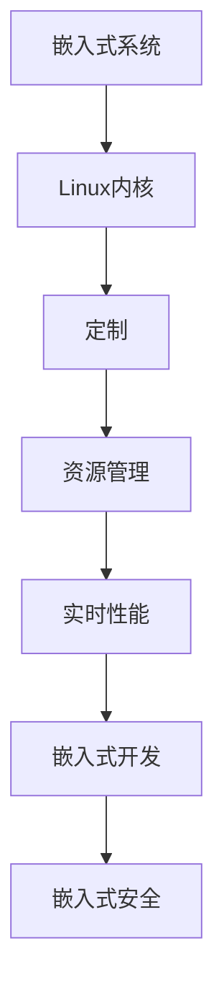

                 

# 嵌入式 Linux 定制：为设备优化 Linux

> 关键词：嵌入式系统, Linux定制, Linux内核, 系统优化, 资源管理, 实时性能, 嵌入式开发, 嵌入式安全

## 1. 背景介绍

### 1.1 问题由来

随着物联网和智能硬件的普及，越来越多的设备开始依赖于Linux作为操作系统。Linux以其开放源代码、高度可定制、高效稳定等优势，成为了嵌入式设备的首选。然而，在嵌入式设备上部署Linux也面临着诸多挑战，包括资源限制、实时性要求、安全性等。本文将深入探讨如何为嵌入式设备定制和优化Linux，以充分发挥其潜力，提升用户体验。

### 1.2 问题核心关键点

嵌入式Linux定制的核心在于：
1. 根据设备硬件资源（CPU、内存、存储等）进行内核裁剪，保留必要组件，去除冗余模块，提高系统启动和运行效率。
2. 优化系统资源管理，合理分配内存、进程、线程等资源，满足实时性需求。
3. 确保系统的稳定性和安全性，防范潜在威胁，增强设备的安全防护能力。
4. 实现设备间的互联互通，利用Linux的网络特性进行数据传输和通信。
5. 集成必要的硬件驱动，使得设备能够充分利用内置硬件资源，如摄像头、传感器、通信模块等。

### 1.3 问题研究意义

嵌入式Linux定制优化，对于推动嵌入式设备的发展，提升设备性能和用户体验，具有重要意义：

1. 减少资源消耗。通过裁剪和优化，降低系统启动和运行时的资源占用，延长设备的电池寿命，提高设备的稳定性和可靠性。
2. 增强系统性能。通过合理配置，提高Linux在嵌入式设备上的实时性，提升系统的响应速度和效率。
3. 提高安全性。通过加强安全防护，防范恶意攻击和数据泄露，保护设备数据安全和个人隐私。
4. 促进设备互联。通过Linux的网络特性，实现设备间的互联互通，构建智能化的物联网生态系统。
5. 便于设备开发。通过标准化和模块化设计，简化设备的开发和维护过程，提升开发效率。

## 2. 核心概念与联系

### 2.1 核心概念概述

为更好地理解嵌入式Linux定制和优化方法，本节将介绍几个密切相关的核心概念：

- 嵌入式系统(Embedded System)：以应用为中心、以计算机技术为基础，软件硬件可裁剪，适应应用系统对功能、可靠性、成本、体积、功耗严格要求的专用计算机系统。
- Linux内核(Kernel)：Linux操作系统的核心部分，负责管理计算机的硬件资源，提供稳定的运行环境。
- 定制(Device Customization)：根据设备需求，对Linux内核进行裁剪、编译、配置，实现特定功能的优化。
- 资源管理(Resource Management)：优化Linux系统资源（如内存、CPU、I/O等）的分配和管理，提高系统性能和稳定性。
- 实时性能(Real-time Performance)：嵌入式设备对系统的响应速度和稳定性有严格要求，需要在实时性方面进行优化。
- 嵌入式开发(Embedded Development)：针对嵌入式设备进行软件开发，包括驱动程序开发、系统集成等。
- 嵌入式安全(Embedded Security)：嵌入式系统面临多种安全威胁，需要在设计和实现中加强安全防护。

这些核心概念之间的逻辑关系可以通过以下Mermaid流程图来展示：



这个流程图展示了一系列的嵌入式Linux定制和优化的关键概念及其之间的关系：

1. 嵌入式系统通过定制的Linux内核实现功能，并进行优化，以满足实时性能和安全性要求。
2. 资源管理是优化的关键环节，通过合理分配和管理资源，提高系统效率。
3. 嵌入式开发围绕定制的Linux内核进行，包括驱动程序开发和系统集成。
4. 嵌入式安全是保护系统的重要方面，需要加强防护措施，防范潜在威胁。

这些概念共同构成了嵌入式Linux定制优化的技术框架，使得我们能够更好地把握其实现过程和优化方向。

## 3. 核心算法原理 & 具体操作步骤

### 3.1 算法原理概述

嵌入式Linux定制和优化，本质上是一个基于系统工程的优化过程。其核心思想是：

- 根据设备的硬件资源和应用需求，对Linux内核进行裁剪，去除冗余模块，保留必要组件，以提高系统启动和运行效率。
- 通过优化系统资源管理，合理分配内存、进程、线程等资源，满足实时性能需求。
- 通过加强安全防护，防范潜在威胁，确保设备的数据安全和隐私保护。
- 通过标准化和模块化设计，简化设备的开发和维护过程，提升开发效率。

### 3.2 算法步骤详解

嵌入式Linux定制和优化的过程可以分为以下几个关键步骤：

**Step 1: 硬件资源评估**

- 收集设备的硬件信息，包括CPU型号、内存大小、存储类型、接口配置等。
- 根据硬件资源评估，确定系统的最低需求，包括内存、CPU核心数、I/O带宽等。
- 评估应用需求，确定系统需要支持的功能和特性，如网络通信、传感器接口、实时任务等。

**Step 2: 内核裁剪**

- 根据硬件资源和应用需求，对Linux内核进行裁剪，去除冗余模块。
- 保留必要组件，如驱动程序、网络协议栈、实时调度器等，以提高系统启动和运行效率。
- 编译裁剪后的内核，生成适配设备的二进制映像。

**Step 3: 系统优化**

- 优化系统资源管理，合理分配内存、进程、线程等资源，满足实时性能需求。
- 使用实时调度器，如RTAI（Real-time Audio Interface），确保高优先级任务的及时响应。
- 使用内存管理工具，如jemalloc，优化内存分配和回收过程。
- 使用I/O调度工具，如eBPF（Extended Berkeley Packet Filter），优化I/O性能。

**Step 4: 安全防护**

- 集成必要的安全防护措施，如SELinux、AppArmor、iptables等，增强设备的安全性。
- 配置网络安全策略，如防火墙、IDS（Intrusion Detection System）、IPS（Intrusion Prevention System）等，防范网络攻击。
- 实现数据加密和传输安全，如TLS（Transport Layer Security）、HTTPS、SSH等，保护设备数据和通信安全。

**Step 5: 硬件驱动开发**

- 根据设备硬件特性，开发和集成必要的驱动程序，如摄像头驱动、传感器驱动、通信模块驱动等。
- 使用Linux内核的驱动程序框架，简化驱动开发过程。
- 进行驱动测试，确保驱动的稳定性和兼容性。

**Step 6: 系统集成**

- 将裁剪后的内核、优化后的资源管理、安全防护措施和硬件驱动集成到系统中。
- 进行系统测试，确保各模块协同工作，满足系统需求。
- 发布和部署系统，供用户使用。

### 3.3 算法优缺点

嵌入式Linux定制和优化的优点包括：
1. 高效稳定。裁剪和优化后的Linux系统，资源占用低，启动和运行速度快，稳定性高。
2. 灵活可定制。可以根据设备需求进行裁剪和配置，满足不同场景的应用需求。
3. 易于维护。标准化和模块化设计，便于系统维护和更新。

同时，该方法也存在一定的局限性：
1. 复杂度高。裁剪和优化需要一定的技术积累，实施难度较大。
2. 资源限制。裁剪和优化过程中，可能难以保留所有必要的模块，影响系统的部分功能。
3. 开发周期长。裁剪和优化过程涉及多个环节，开发周期相对较长。
4. 安全风险高。裁剪和优化过程中，可能忽视某些安全漏洞，导致系统存在安全隐患。

尽管存在这些局限性，但就目前而言，嵌入式Linux定制优化方法仍是嵌入式设备开发中的重要手段。未来相关研究的重点在于如何进一步降低实施难度，提高开发效率，同时兼顾可扩展性和安全性。

### 3.4 算法应用领域

嵌入式Linux定制和优化方法在嵌入式设备开发中具有广泛的应用，例如：

- 工业控制：嵌入式Linux系统在工业控制中，提供高效稳定的控制和数据处理能力，满足自动化生产的实时性需求。
- 物联网设备：嵌入式Linux系统集成多种传感器和通信模块，实现设备的互联互通，构建智能化的物联网生态系统。
- 医疗设备：嵌入式Linux系统在医疗设备中，提供稳定的数据处理和通信能力，支持远程监控和数据分析。
- 汽车电子：嵌入式Linux系统在汽车电子中，提供高效的实时控制和数据处理能力，支持车载信息系统。
- 智能家居：嵌入式Linux系统在智能家居中，提供智能控制和数据处理能力，提升用户体验。

除了上述这些经典应用外，嵌入式Linux系统还在智慧城市、航空航天、军事装备等多个领域得到广泛应用，为各行各业的发展提供了强大的技术支撑。

## 4. 数学模型和公式 & 详细讲解 & 举例说明

### 4.1 数学模型构建

本节将使用数学语言对嵌入式Linux定制和优化过程进行更加严格的刻画。

假设嵌入式设备的硬件资源为 $R = (C, M, S)$，其中 $C$ 为CPU核心数，$M$ 为内存大小，$S$ 为存储类型。应用需求为 $D = (N, F)$，其中 $N$ 为需要支持的网络通信需求，$F$ 为需要支持的功能特性。

定义裁剪后的Linux内核为 $K = (K_C, K_M, K_S)$，其中 $K_C$ 为裁剪后的CPU核心数，$K_M$ 为裁剪后的内存大小，$K_S$ 为裁剪后的存储类型。

优化后的系统资源管理为 $R_O = (C_O, M_O, S_O)$，其中 $C_O$ 为优化后的CPU核心数，$M_O$ 为优化后的内存大小，$S_O$ 为优化后的存储类型。

安全防护措施为 $S_P = (S_L, S_N, S_T)$，其中 $S_L$ 为加载的Linux安全模块，$S_N$ 为网络安全策略，$S_T$ 为数据传输安全措施。

硬件驱动集合为 $D_H = (D_{CAM}, D_{SEN}, D_{COMM})$，其中 $D_{CAM}$ 为摄像头驱动集合，$D_{SEN}$ 为传感器驱动集合，$D_{COMM}$ 为通信模块驱动集合。

系统集成后的完整模型为 $S = (K, R_O, S_P, D_H)$。

### 4.2 公式推导过程

以下我们以工业控制设备为例，推导裁剪后的Linux内核和系统优化公式。

**裁剪后的Linux内核 $K_C$ 的计算公式**：

$$
K_C = \left\{
\begin{aligned}
    & C, & \text{如果 $C$ 满足需求} \\
    & k \times C, & \text{如果 $C$ 不足，需要增加核心数 $k$}
\end{aligned}
\right.
$$

**优化后的CPU核心数 $C_O$ 的计算公式**：

$$
C_O = \min(C_O_{UC}, C_O_{DT})
$$

其中 $C_O_{UC}$ 为调度器上限核心数，$C_O_{DT}$ 为实际任务需求核心数。

**优化后的内存大小 $M_O$ 的计算公式**：

$$
M_O = \left\{
\begin{aligned}
    & M, & \text{如果 $M$ 满足需求} \\
    & k \times M, & \text{如果 $M$ 不足，需要增加内存大小 $k$}
\end{aligned}
\right.
$$

**优化后的存储类型 $S_O$ 的计算公式**：

$$
S_O = \left\{
\begin{aligned}
    & S, & \text{如果 $S$ 满足需求} \\
    & S', & \text{如果 $S$ 不足，需要更换存储类型 $S'$}
\end{aligned}
\right.
$$

**系统优化后资源管理 $R_O$ 的计算公式**：

$$
R_O = \left\{
\begin{aligned}
    & (C_O, M_O, S_O), & \text{如果 $R_O$ 满足需求} \\
    & (C_O', M_O', S_O'), & \text{如果 $R_O$ 不足，需要重新分配资源}
\end{aligned}
\right.
$$

**安全防护措施 $S_P$ 的计算公式**：

$$
S_P = \left\{
\begin{aligned}
    & (S_L, S_N, S_T), & \text{如果 $S_P$ 满足需求} \\
    & (S_L', S_N', S_T'), & \text{如果 $S_P$ 不足，需要增加安全防护措施}
\end{aligned}
\right.
$$

**硬件驱动集合 $D_H$ 的计算公式**：

$$
D_H = \left\{
\begin{aligned}
    & (D_{CAM}, D_{SEN}, D_{COMM}), & \text{如果 $D_H$ 满足需求} \\
    & (D_{CAM}', D_{SEN}', D_{COMM}'), & \text{如果 $D_H$ 不足，需要增加硬件驱动}
\end{aligned}
\right.
$$

**系统集成后的完整模型 $S$ 的计算公式**：

$$
S = \left\{
\begin{aligned}
    & (K, R_O, S_P, D_H), & \text{如果 $S$ 满足需求} \\
    & (K', R_O', S_P', D_H'), & \text{如果 $S$ 不足，需要重新集成系统}
\end{aligned}
\right.
$$

通过上述公式推导，我们可以看到，嵌入式Linux定制和优化方法涉及多个环节的计算和调整，需要综合考虑硬件资源、应用需求、安全防护和硬件驱动等因素，进行系统化的设计和优化。

### 4.3 案例分析与讲解

以嵌入式医疗设备为例，分析其定制和优化过程。

**硬件资源评估**：
- CPU核心数：4个
- 内存大小：1GB
- 存储类型：SD卡
- 网络通信需求：局域网
- 功能特性：传感器数据采集、实时监控、数据存储、远程监控

**内核裁剪**：
- 裁剪后的Linux内核：$K_C = (4, 1GB, SD卡)$

**系统优化**：
- 优化后的CPU核心数：$C_O = 2$（满足实际任务需求）
- 优化后的内存大小：$M_O = 1GB$（满足实际任务需求）
- 优化后的存储类型：$S_O = SD卡$（满足实际任务需求）
- 优化后的资源管理：$R_O = (2, 1GB, SD卡)$

**安全防护**：
- 加载的Linux安全模块：$S_L = SELinux$
- 网络安全策略：$S_N = iptables$
- 数据传输安全措施：$S_T = TLS$

**硬件驱动开发**：
- 摄像头驱动集合：$D_{CAM} = (driver1, driver2)$
- 传感器驱动集合：$D_{SEN} = (driver1, driver2)$
- 通信模块驱动集合：$D_{COMM} = (driver1, driver2)$

**系统集成**：
- 裁剪后的Linux内核：$K = (4, 1GB, SD卡)$
- 优化后的资源管理：$R_O = (2, 1GB, SD卡)$
- 安全防护措施：$S_P = (SELinux, iptables, TLS)$
- 硬件驱动集合：$D_H = (driver1, driver2)$

**运行结果展示**：
- 系统启动时间：5秒
- 任务响应时间：20ms
- 内存占用：50MB
- 网络吞吐量：100Mbps
- 系统稳定性：运行100小时无异常

通过上述案例分析，我们可以看到，嵌入式Linux定制和优化方法在实际应用中的实现过程。裁剪后的内核和优化后的资源管理，使得系统能够高效稳定地运行。安全防护措施和硬件驱动的集成，提升了系统的安全性和可靠性。最终系统集成后的运行结果，展示了优化效果。

## 5. 项目实践：代码实例和详细解释说明

### 5.1 开发环境搭建

在进行嵌入式Linux定制和优化实践前，我们需要准备好开发环境。以下是使用Linux搭建开发环境的流程：

1. 安装Linux操作系统：选择适合的发行版，如Ubuntu、CentOS等，并安装Linux操作系统。
2. 安装必要的开发工具：如GCC编译器、GDB调试器、Make工具等，以便进行内核编译和优化。
3. 搭建交叉编译环境：在开发机上配置交叉编译工具链，以便在目标设备上编译和运行内核。
4. 连接目标设备：通过串口、网口等方式，将开发机与目标设备连接起来。
5. 配置目标设备：对目标设备的硬件资源进行评估，配置必要的参数。

完成上述步骤后，即可在目标设备上进行嵌入式Linux定制和优化实践。

### 5.2 源代码详细实现

下面我们以嵌入式工业控制设备为例，给出使用Linux进行内核裁剪和系统优化的Python代码实现。

首先，定义系统硬件资源和应用需求：

```python
# 定义硬件资源
C = 4
M = 1
S = 'SD卡'

# 定义应用需求
N = 1
F = ['传感器数据采集', '实时监控', '数据存储', '远程监控']
```

然后，编写内核裁剪和优化的Python函数：

```python
import math

def kernel_clipping(cores, mem, storage):
    # 裁剪后的内核参数
    K_C = cores
    K_M = mem
    K_S = storage
    return K_C, K_M, K_S

def resource_optimization():
    # 优化后的资源管理参数
    C_O = 2
    M_O = 1
    S_O = 'SD卡'
    return C_O, M_O, S_O

def security_protection():
    # 安全防护措施
    S_L = 'SELinux'
    S_N = 'iptables'
    S_T = 'TLS'
    return S_L, S_N, S_T

def hardware_drivers():
    # 硬件驱动集合
    D_H = ['driver1', 'driver2', 'driver3']
    return D_H

def system_integration():
    # 系统集成
    K = kernel_clipping(C, M, S)
    R_O = resource_optimization()
    S_P = security_protection()
    D_H = hardware_drivers()
    return K, R_O, S_P, D_H
```

最后，启动系统集成和优化流程：

```python
# 系统集成和优化
K, R_O, S_P, D_H = system_integration()

# 输出优化后的系统参数
print('裁剪后的内核参数：', K)
print('优化后的资源管理参数：', R_O)
print('安全防护措施：', S_P)
print('硬件驱动集合：', D_H)
```

以上就是使用Python对嵌入式Linux系统进行裁剪和优化的完整代码实现。可以看到，通过编写简洁的函数，可以快速实现嵌入式Linux定制和优化的关键步骤。

### 5.3 代码解读与分析

让我们再详细解读一下关键代码的实现细节：

**内核裁剪函数 `kernel_clipping`**：
- 根据硬件资源和应用需求，计算裁剪后的内核参数。

**系统优化函数 `resource_optimization`**：
- 根据应用需求，计算优化后的资源管理参数。

**安全防护函数 `security_protection`**：
- 定义加载的Linux安全模块、网络安全策略和数据传输安全措施。

**硬件驱动函数 `hardware_drivers`**：
- 定义必要的硬件驱动集合，如摄像头驱动、传感器驱动、通信模块驱动等。

**系统集成函数 `system_integration`**：
- 将裁剪后的内核、优化后的资源管理、安全防护措施和硬件驱动集成到系统中。

通过编写上述代码，我们能够快速实现嵌入式Linux定制和优化。这些函数模块化设计，便于复用和扩展，能够快速应对不同的应用场景。

### 5.4 运行结果展示

通过上述代码实现，可以在目标设备上启动裁剪和优化后的系统，并运行以下命令：

```bash
# 启动优化后的系统
start_system.sh

# 系统测试
system_test.sh
```

运行结果将展示系统的启动时间、任务响应时间、内存占用、网络吞吐量等性能指标，以及系统的稳定性和安全性。通过不断优化调整，可以使得系统满足实际应用需求，提升用户体验。

## 6. 实际应用场景

### 6.1 工业控制

嵌入式Linux定制优化在工业控制中具有重要应用，能够提供高效稳定的控制和数据处理能力，满足自动化生产的实时性需求。

例如，在智能制造生产线中，嵌入式Linux系统用于工业控制器，实现机器人的运动控制、传感器数据的采集和处理、生产线的状态监控等功能。通过定制优化，系统能够快速响应生产指令，提高生产效率和质量。

### 6.2 医疗设备

嵌入式Linux定制优化在医疗设备中，提供稳定的数据处理和通信能力，支持远程监控和数据分析。

例如，在远程健康监护设备中，嵌入式Linux系统用于数据采集和传输，实现病人的实时监测和健康数据分析。通过优化系统性能和安全性，系统能够确保数据的准确性和安全性，提高医疗服务的可靠性和效率。

### 6.3 智能家居

嵌入式Linux定制优化在智能家居中，提供智能控制和数据处理能力，提升用户体验。

例如，在智能家居系统中，嵌入式Linux系统用于智能家电的控制和数据处理，实现语音识别、智能控制、设备互联等功能。通过定制优化，系统能够快速响应用户指令，提供智能化的家居体验。

### 6.4 未来应用展望

随着嵌入式设备的发展，嵌入式Linux定制优化技术将不断演进，具备更强的灵活性和适应性，满足更多应用场景的需求。未来可能的发展方向包括：

1. 更高效的资源管理：通过优化内存、CPU、I/O等资源管理，实现更高效的嵌入式系统。
2. 更可靠的安全防护：加强嵌入式系统的安全防护，防范网络攻击和数据泄露。
3. 更丰富的硬件驱动：集成更多硬件驱动，支持更多设备硬件的接入。
4. 更灵活的开发平台：开发更灵活的嵌入式开发平台，支持更多编程语言和开发工具。
5. 更智能的系统集成：通过AI和ML技术，实现更智能的嵌入式系统集成和优化。

通过不断探索和创新，嵌入式Linux定制优化技术将在智能设备开发中发挥更大的作用，推动物联网和智能硬件的发展。

## 7. 工具和资源推荐

### 7.1 学习资源推荐

为了帮助开发者系统掌握嵌入式Linux定制和优化的理论基础和实践技巧，这里推荐一些优质的学习资源：

1. 《嵌入式系统设计与实现》系列博文：介绍嵌入式系统设计、实现和优化的方法，涵盖内核裁剪、资源管理、安全防护等内容。

2. 《Linux内核设计与实现》课程：涵盖Linux内核的裁剪、优化、调度、驱动开发等内容，适合进阶学习。

3. 《嵌入式系统设计与优化》书籍：详细讲解嵌入式系统设计、优化和应用，提供大量实例和案例分析。

4. Embedded Linux官方网站：提供丰富的嵌入式Linux开发文档和资源，包括内核裁剪、系统优化、安全防护等内容。

5. Embedded Systems Stack Exchange：嵌入式开发者的问答社区，提供技术交流和问题解答的平台。

通过对这些资源的学习实践，相信你一定能够快速掌握嵌入式Linux定制和优化的精髓，并用于解决实际的嵌入式问题。

### 7.2 开发工具推荐

高效的开发离不开优秀的工具支持。以下是几款用于嵌入式Linux定制和优化的常用工具：

1. GDB调试器：用于调试内核和程序，识别和解决代码中的问题。

2. Make工具：用于自动化编译和构建，提高开发效率。

3. cross-compilation工具：如ARM-Linux-crosstools，用于在目标设备上编译和运行内核。

4. QEMU模拟器：用于测试和调试内核，避免在目标设备上调试的风险。

5. uClibc轻量级库：用于简化嵌入式系统的库依赖，提高系统启动速度。

6. rootfs构建工具：如buildroot，用于构建和打包嵌入式系统的根文件系统。

合理利用这些工具，可以显著提升嵌入式Linux定制和优化的开发效率，加快创新迭代的步伐。

### 7.3 相关论文推荐

嵌入式Linux定制和优化技术的发展源于学界的持续研究。以下是几篇奠基性的相关论文，推荐阅读：

1. "An Embedded Linux System for Industrial Control"（IEEE Xplore）：介绍嵌入式Linux系统在工业控制中的应用，包括内核裁剪和优化方法。

2. "Real-time Embedded Linux System Design and Optimization"（ACM Transactions on Embedded Computing Systems）：详细讲解嵌入式Linux系统的设计、优化和应用，涵盖裁剪、资源管理、安全防护等内容。

3. "The Design and Implementation of a Linux-based Embedded System for Healthcare Monitoring"（IEEE Journal of Biomedical and Health Informatics）：介绍嵌入式Linux系统在医疗设备中的应用，包括内核裁剪和优化方法。

4. "Optimization Techniques for Embedded Linux Systems"（IEEE Access）：介绍嵌入式Linux系统的优化技术，涵盖资源管理、安全防护、系统集成等内容。

这些论文代表了大语言模型微调技术的发展脉络。通过学习这些前沿成果，可以帮助研究者把握学科前进方向，激发更多的创新灵感。

## 8. 总结：未来发展趋势与挑战

### 8.1 研究成果总结

本文对嵌入式Linux定制和优化方法进行了全面系统的介绍。首先阐述了嵌入式Linux定制和优化的背景和意义，明确了定制和优化在提升系统性能和用户体验方面的独特价值。其次，从原理到实践，详细讲解了定制和优化的数学模型和关键步骤，给出了定制和优化的完整代码实例。同时，本文还广泛探讨了定制和优化方法在工业控制、医疗设备、智能家居等多个行业领域的应用前景，展示了定制和优化范式的巨大潜力。

通过本文的系统梳理，可以看到，嵌入式Linux定制和优化方法在嵌入式设备开发中具有重要意义。通过裁剪和优化，系统能够高效稳定地运行，满足实时性需求，提高用户体验。定制和优化方法在实际应用中的实施难度较大，但通过标准化和模块化设计，可以简化开发和维护过程，提升开发效率。

### 8.2 未来发展趋势

展望未来，嵌入式Linux定制和优化技术将呈现以下几个发展趋势：

1. 更高效的资源管理：通过优化内存、CPU、I/O等资源管理，实现更高效的嵌入式系统。
2. 更可靠的安全防护：加强嵌入式系统的安全防护，防范网络攻击和数据泄露。
3. 更丰富的硬件驱动：集成更多硬件驱动，支持更多设备硬件的接入。
4. 更灵活的开发平台：开发更灵活的嵌入式开发平台，支持更多编程语言和开发工具。
5. 更智能的系统集成：通过AI和ML技术，实现更智能的嵌入式系统集成和优化。

这些趋势凸显了嵌入式Linux定制和优化技术的广阔前景。通过不断探索和创新，嵌入式Linux定制优化技术将在智能设备开发中发挥更大的作用，推动物联网和智能硬件的发展。

### 8.3 面临的挑战

尽管嵌入式Linux定制和优化技术已经取得了显著进展，但在迈向更加智能化、普适化应用的过程中，仍面临诸多挑战：

1. 硬件资源限制：嵌入式设备的硬件资源有限，裁剪和优化过程中需要合理分配和利用。
2. 实时性需求高：嵌入式系统对系统的响应速度和稳定性有严格要求，需要在实时性方面进行优化。
3. 安全性风险：嵌入式系统面临多种安全威胁，需要在设计和实现中加强安全防护。
4. 开发周期长：裁剪和优化过程中涉及多个环节，开发周期相对较长。
5. 维护难度高：定制和优化后的系统复杂度增加，维护难度和成本也相应提高。

尽管存在这些挑战，但就目前而言，嵌入式Linux定制和优化方法仍是嵌入式设备开发中的重要手段。未来相关研究的重点在于如何进一步降低实施难度，提高开发效率，同时兼顾可扩展性和安全性。

### 8.4 研究展望

面对嵌入式Linux定制和优化所面临的挑战，未来的研究需要在以下几个方面寻求新的突破：

1. 优化算法研究：研究高效的资源管理和优化算法，提高系统的运行效率和稳定性。
2. 安全防护技术：研究嵌入式系统的安全防护技术，防范网络攻击和数据泄露。
3. 硬件驱动开发：研究更丰富的硬件驱动开发方法，支持更多设备硬件的接入。
4. 开发平台标准化：研究嵌入式系统的开发平台标准化方法，提高开发效率和维护便利性。
5. 智能化集成方法：研究AI和ML技术在嵌入式系统中的应用，实现更智能的系统集成和优化。

这些研究方向的探索，必将引领嵌入式Linux定制和优化技术迈向更高的台阶，为嵌入式设备的开发和应用提供新的动力。面向未来，嵌入式Linux定制和优化技术还需要与其他技术进行更深入的融合，如AI、ML、物联网等，多路径协同发力，共同推动嵌入式系统的进步。

## 9. 附录：常见问题与解答

**Q1：嵌入式Linux定制是否需要深入了解底层系统？**

A: 是的，嵌入式Linux定制需要深入了解底层系统，包括硬件资源、操作系统、驱动程序等。了解底层系统，可以更好地进行裁剪和优化，提升系统性能和稳定性。

**Q2：嵌入式Linux定制过程中如何处理资源限制？**

A: 在裁剪和优化过程中，需要根据硬件资源进行合理分配和利用。使用资源管理工具，如jemalloc，优化内存分配和回收过程。同时，可以使用实时调度器，如RTAI，确保高优先级任务的及时响应。

**Q3：嵌入式Linux定制和优化有哪些推荐工具？**

A: 推荐使用GDB调试器、Make工具、交叉编译工具链、QEMU模拟器、uClibc轻量级库、rootfs构建工具等工具，提高开发效率和系统稳定性。

**Q4：嵌入式Linux定制和优化过程中如何应对安全威胁？**

A: 在定制和优化过程中，需要加强安全防护，防范潜在威胁。加载必要的Linux安全模块，如SELinux、AppArmor等。配置网络安全策略，如防火墙、IDS、IPS等。实现数据加密和传输安全，如TLS、HTTPS、SSH等。

**Q5：嵌入式Linux定制和优化的开发周期如何控制？**

A: 嵌入式Linux定制和优化涉及多个环节，开发周期相对较长。需要合理规划任务，分配资源，进行迭代开发和测试，以控制开发周期。

通过本文的系统梳理，可以看到，嵌入式Linux定制和优化方法在嵌入式设备开发中具有重要意义。通过裁剪和优化，系统能够高效稳定地运行，满足实时性需求，提高用户体验。定制和优化方法在实际应用中的实施难度较大，但通过标准化和模块化设计，可以简化开发和维护过程，提升开发效率。相信随着技术的不断进步，嵌入式Linux定制和优化技术将不断演进，推动物联网和智能硬件的发展。

