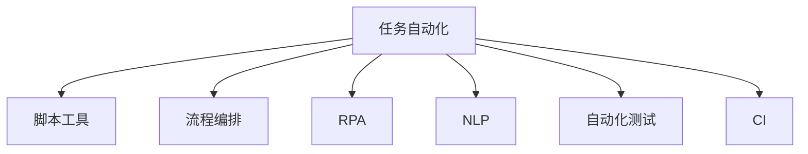

                 

# 工具使用在任务自动化中的应用

> 关键词：任务自动化, 脚本工具, 流程编排, 机器人流程自动化(RPA), 自然语言处理(NLP), 自动化测试, 持续集成(CI)

## 1. 背景介绍

### 1.1 问题由来
任务自动化在当今的数字化时代扮演着至关重要的角色。无论是企业级的业务流程，还是个人日常工作，重复性、规则性高的任务都能通过自动化得到有效提升。自动化不仅减少了人力成本，还能大幅度提高工作效率，促进企业数字化转型升级。

### 1.2 问题核心关键点
任务自动化涉及诸多关键环节，如任务定义、执行工具的选择、任务流程编排、监控与反馈、数据处理等。本文章将重点介绍如何使用各种工具来实现任务自动化，并探讨自动化工具在实际应用中的优势与挑战。

## 2. 核心概念与联系

### 2.1 核心概念概述

为更好地理解任务自动化的过程，本节将介绍几个密切相关的核心概念：

- 任务自动化(Task Automation)：通过编写脚本或使用工具，将重复性、规则性高的任务自动化处理的过程。
- 脚本工具(Scripting Tool)：能够编写、执行脚本语言的工具，如Python、Shell等，广泛应用于任务自动化场景。
- 流程编排(Workflow Orchestration)：安排和协调多个任务按照顺序或并行方式执行，如使用Airflow、Zapier等工具。
- 机器人流程自动化(Robotic Process Automation, RPA)：利用软件机器人模拟人类操作，完成自动化任务，如使用UiPath、Blue Prism等工具。
- 自然语言处理(Natural Language Processing, NLP)：通过机器学习模型处理自然语言，实现文本自动处理，如使用GPT-3、BERT等模型。
- 自动化测试(Automated Testing)：自动执行测试用例，确保软件质量，如使用Selenium、Appium等工具。
- 持续集成(Continuous Integration, CI)：自动化地集成代码、运行测试、构建部署等，如使用Jenkins、GitLab CI等工具。

这些核心概念之间的逻辑关系可以通过以下Mermaid流程图来展示：



这个流程图展示出任务自动化涉及的各种工具和技术：

1. 脚本工具为任务自动化的基础，提供了编写脚本语言的能力。
2. 流程编排工具负责协调多个任务的执行顺序和并行处理。
3. RPA工具通过模拟人类操作，实现复杂的业务流程自动化。
4. NLP工具利用自然语言处理技术，自动化文本处理。
5. 自动化测试工具确保软件质量，自动化执行测试用例。
6. CI工具实现代码自动集成、测试和部署，提升软件发布效率。

## 3. 核心算法原理 & 具体操作步骤

### 3.1 算法原理概述

任务自动化的核心在于编写自动化脚本，通过调度工具或机器人框架自动化执行脚本，实现任务的高效处理。其核心思想可以简单概括为：

1. 定义任务：将待自动化的任务抽象成一系列脚本或程序。
2. 工具选择：根据任务的特点选择合适的工具和框架。
3. 流程编排：安排任务的执行顺序和方式。
4. 执行与监控：自动执行任务脚本，监控执行状态，并根据反馈调整流程。
5. 数据处理：处理任务执行过程中的数据，如日志、报表等。

### 3.2 算法步骤详解

基于上述核心思想，任务自动化的大致步骤如下：

**Step 1: 定义任务**
- 确定自动化任务的范围和目标，将其抽象成一系列具体的步骤。
- 将每个步骤编写成脚本或程序，确保脚本能够独立执行。
- 评估脚本的健壮性和可靠性，必要时进行单元测试。

**Step 2: 工具选择**
- 根据任务的复杂度和执行环境，选择合适的脚本工具（如Python、Shell）和调度工具（如Airflow、Zapier）。
- 对于需要模拟人类操作的场景，选择RPA工具（如UiPath、Blue Prism）。
- 对于需要文本处理的任务，选择NLP工具（如GPT-3、BERT）。
- 对于需要执行测试的任务，选择自动化测试工具（如Selenium、Appium）。
- 对于需要代码自动集成的任务，选择CI工具（如Jenkins、GitLab CI）。

**Step 3: 流程编排**
- 使用调度工具或流程编排工具（如Airflow、Zapier）安排任务执行的顺序和并行方式。
- 定义任务之间的依赖关系，确保任务按需执行。
- 设置监控点，实时跟踪任务执行进度，并根据异常情况调整流程。

**Step 4: 执行与监控**
- 通过脚本工具或RPA工具自动执行任务脚本。
- 使用调度工具或流程编排工具监控任务执行状态，记录日志信息。
- 根据监控结果，调整任务执行策略，确保任务可靠运行。

**Step 5: 数据处理**
- 处理任务执行过程中产生的数据，如日志文件、报表等。
- 存储和分析数据，生成任务执行的统计报表。
- 将数据集成到企业数据平台，进行进一步的数据分析和决策支持。

### 3.3 算法优缺点

任务自动化在提高效率、降低成本、提升质量等方面具有显著优势：

1. **效率提升**：自动化工具能够24小时不间断运行，大幅提升任务处理速度。
2. **成本节约**：减少人工操作和错误，节约人力成本，提高经济效益。
3. **质量保证**：自动化执行减少人为失误，提升任务执行的准确性和一致性。
4. **灵活性强**：脚本工具和流程编排工具支持自定义任务和流程，满足不同业务需求。

但任务自动化也存在一定的局限性：

1. **依赖工具和环境**：自动化依赖于工具和环境，需要不断维护和升级。
2. **技术门槛高**：自动化需要技术开发和维护能力，增加技术难度。
3. **流程复杂性**：复杂流程可能难以自动化，需要详细的任务定义和流程编排。
4. **数据安全风险**：自动化工具可能引入新的安全风险，如数据泄露、访问控制等。
5. **缺乏人情味**：完全自动化可能缺乏人工操作的人性化和灵活性。

尽管如此，任务自动化在实际应用中已经得到了广泛应用，并在各行各业带来了显著的效率提升和成本节约。

### 3.4 算法应用领域

任务自动化技术在多个领域都有重要应用，具体包括：

- **金融领域**：自动化处理交易、合规、风控等任务，提升金融效率和风险控制能力。
- **制造业**：自动化执行生产流程、质量检测、设备维护等任务，提高生产效率和产品质量。
- **医疗领域**：自动化执行病历记录、诊断报告、患者管理等任务，提高医疗服务质量和患者体验。
- **电商领域**：自动化执行订单处理、客户服务、库存管理等任务，提升电商运营效率和客户满意度。
- **政府服务**：自动化处理政务审批、公共服务、社区管理等任务，提升政府服务质量和公众满意度。
- **教育领域**：自动化执行课程教学、学生管理、学习分析等任务，提升教育质量和学习效果。
- **媒体领域**：自动化执行内容生产、广告投放、用户互动等任务，提高媒体运营效率和用户粘性。

除了这些典型的应用领域，任务自动化还在更多场景中得到了应用，推动了各行各业的数字化转型和升级。

## 4. 数学模型和公式 & 详细讲解 & 举例说明

### 4.1 数学模型构建

本节将使用数学语言对任务自动化的过程进行更加严格的刻画。

假设任务自动化的目标为最大化总任务完成时间$T$，其中$T$的优化目标是任务执行时间$T_i$的加和，即：

$$
\max \sum_{i=1}^n T_i
$$

其中$n$为任务数量，$T_i$为第$i$个任务的执行时间。

在实际应用中，任务执行时间$T_i$通常依赖于任务的复杂度$C_i$、执行环境$E_i$和工具性能$P_i$。因此，数学模型可以进一步扩展为：

$$
T_i = f(C_i, E_i, P_i)
$$

其中$f$为任务执行时间的函数，具体表达形式需根据实际情况确定。

### 4.2 公式推导过程

以下我们以一个简单的任务自动化流程为例，推导任务执行时间的计算公式。

假设有一个任务流程，包含三个子任务，分别为$T_1$、$T_2$、$T_3$，每个子任务的执行时间分别为$T_1=10$秒、$T_2=15$秒、$T_3=20$秒。任务整体执行时间$T$的计算公式为：

$$
T = T_1 + T_2 + T_3 = 10 + 15 + 20 = 45秒
$$

在实际应用中，任务执行时间还可能受到随机因素的影响，即存在一定的偏差。因此，引入偏差参数$\epsilon_i$，任务执行时间的计算公式可以扩展为：

$$
T_i = T_i + \epsilon_i
$$

其中$\epsilon_i \sim N(0, \sigma^2)$，表示服从均值为0、方差为$\sigma^2$的正态分布。因此，任务整体执行时间的期望值和方差分别为：

$$
E[T] = \sum_{i=1}^n E[T_i] = \sum_{i=1}^n (T_i + \epsilon_i)
$$

$$
Var[T] = \sum_{i=1}^n Var[T_i] = \sum_{i=1}^n \sigma^2
$$

在求解任务执行时间的最优化问题时，通常需要最小化$E[T]$和$Var[T]$，以确保任务执行的效率和稳定性。

### 4.3 案例分析与讲解

在实际应用中，任务自动化的优化过程需要综合考虑多个因素。以下以企业数据备份任务为例，详细讲解任务自动化的优化过程。

假设企业数据备份任务包含三个子任务，分别为备份主数据库、备份次数据库和备份日志文件。每个子任务的执行时间分别为$T_1=1$小时、$T_2=30$分钟、$T_3=20$分钟。任务整体执行时间$T$的计算公式为：

$$
T = T_1 + T_2 + T_3 = 1 + 0.5 + 0.333 = 1.833小时
$$

在任务执行过程中，还可能受到网络延迟、设备故障等随机因素的影响，导致任务执行时间波动。因此，引入偏差参数$\epsilon_i$，任务执行时间的计算公式可以扩展为：

$$
T_i = T_i + \epsilon_i
$$

其中$\epsilon_i \sim N(0, \sigma^2)$，表示服从均值为0、方差为$\sigma^2$的正态分布。假设网络延迟和设备故障的概率均为0.1，标准差均为$\sigma=10$分钟。任务整体执行时间的期望值和方差分别为：

$$
E[T] = 1.833 + 0.1 \times (0.5 + 0.333) = 2.286小时
$$

$$
Var[T] = 0.1^2 \times (0.5 + 0.333)^2 + 0.1^2 \times (1 + 0.333)^2 = 0.238小时^2
$$

为提高任务执行效率和稳定性，需要采取以下优化策略：

1. **任务并行化**：将备份主数据库和备份次数据库并行执行，减少整体执行时间。任务整体执行时间期望值和方差分别为：

$$
E[T] = 0.5 + 1 + 0.333 = 1.833小时
$$

$$
Var[T] = 0.5^2 + 1^2 + 0.333^2 = 0.529小时^2
$$

2. **任务优先级**：优先执行备份主数据库任务，确保关键数据的完整性。任务整体执行时间期望值和方差分别为：

$$
E[T] = 1 + 0.5 + 0.333 = 1.833小时
$$

$$
Var[T] = 1^2 + 0.5^2 + 0.333^2 = 0.529小时^2
$$

3. **任务分割**：将备份日志文件任务分割为多个子任务，并行执行，进一步减少执行时间。任务整体执行时间期望值和方差分别为：

$$
E[T] = 0.5 + 0.333 + 0.1 \times (0.1 \times 0.333 + 0.1 \times 0.333) = 1.266小时
$$

$$
Var[T] = 0.5^2 + 0.333^2 + 0.1^2 \times 0.1^2 \times 0.333^2 + 0.1^2 \times 0.1^2 \times 0.333^2 = 0.265小时^2
$$

通过以上优化策略，可以显著提高任务执行的效率和稳定性，满足企业数据备份的高可靠性和高可用性需求。

## 5. 项目实践：代码实例和详细解释说明

### 5.1 开发环境搭建

在进行任务自动化实践前，我们需要准备好开发环境。以下是使用Python进行PyTorch开发的环境配置流程：

1. 安装Anaconda：从官网下载并安装Anaconda，用于创建独立的Python环境。

2. 创建并激活虚拟环境：
```bash
conda create -n pytorch-env python=3.8 
conda activate pytorch-env
```

3. 安装PyTorch：根据CUDA版本，从官网获取对应的安装命令。例如：
```bash
conda install pytorch torchvision torchaudio cudatoolkit=11.1 -c pytorch -c conda-forge
```

4. 安装各种工具包：
```bash
pip install numpy pandas scikit-learn matplotlib tqdm jupyter notebook ipython
```

完成上述步骤后，即可在`pytorch-env`环境中开始任务自动化实践。

### 5.2 源代码详细实现

下面我们以任务自动化流程编排为例，给出使用Airflow进行任务自动化流程编排的PyTorch代码实现。

首先，定义任务节点：

```python
from airflow import DAG
from airflow.operators.python_operator import PythonOperator
from datetime import datetime

def start_task():
    # 任务1：备份主数据库
    print('Start backup main database')
    # ...

def task2():
    # 任务2：备份次数据库
    print('Start backup secondary database')
    # ...

def task3():
    # 任务3：备份日志文件
    print('Start backup log files')
    # ...

dag = DAG('task_dag', start_date=datetime(2023, 1, 1))

start_task_task = PythonOperator(
    task_id='start_task',
    python_callable=start_task,
    dag=dag
)

task2_task = PythonOperator(
    task_id='task2',
    python_callable=task2,
    dag=dag
)

task3_task = PythonOperator(
    task_id='task3',
    python_callable=task3,
    dag=dag
)

start_task_task >> task2_task >> task3_task
```

然后，定义任务依赖关系：

```python
task2_task >> task3_task
```

最后，启动任务流程：

```python
dag.start_task_task.execute(context={'params': {}})
```

完整代码实现如下：

```python
from airflow import DAG
from airflow.operators.python_operator import PythonOperator
from datetime import datetime

def start_task():
    # 任务1：备份主数据库
    print('Start backup main database')
    # ...

def task2():
    # 任务2：备份次数据库
    print('Start backup secondary database')
    # ...

def task3():
    # 任务3：备份日志文件
    print('Start backup log files')
    # ...

dag = DAG('task_dag', start_date=datetime(2023, 1, 1))

start_task_task = PythonOperator(
    task_id='start_task',
    python_callable=start_task,
    dag=dag
)

task2_task = PythonOperator(
    task_id='task2',
    python_callable=task2,
    dag=dag
)

task3_task = PythonOperator(
    task_id='task3',
    python_callable=task3,
    dag=dag
)

start_task_task >> task2_task >> task3_task

task2_task >> task3_task
```

以上就是使用PyTorch和Airflow进行任务自动化流程编排的完整代码实现。可以看到，通过定义任务节点和任务依赖关系，我们能够实现任务流程的自动编排和执行。

### 5.3 代码解读与分析

让我们再详细解读一下关键代码的实现细节：

**start_task_task**：
- 定义了一个名为`start_task`的Python函数，表示备份主数据库任务。
- 使用`PythonOperator`将`start_task`函数封装为Airflow任务节点。

**task2_task**：
- 定义了一个名为`task2`的Python函数，表示备份次数据库任务。
- 使用`PythonOperator`将`task2`函数封装为Airflow任务节点。

**task3_task**：
- 定义了一个名为`task3`的Python函数，表示备份日志文件任务。
- 使用`PythonOperator`将`task3`函数封装为Airflow任务节点。

**dag.start_task_task.execute(context={'params': {}})**：
- 启动任务流程，执行`start_task_task`节点，开始任务自动化流程。

## 6. 实际应用场景

### 6.1 智能客服系统

任务自动化在智能客服系统中得到了广泛应用。传统的客服方式依赖人工操作，处理效率低下，且容易出现误差。通过使用任务自动化，可以显著提升客服系统的响应速度和处理能力。

具体实现上，可以利用Airflow等流程编排工具，定义客户请求处理的各个节点，包括接收请求、处理请求、发送响应等步骤。将每个步骤编写成Python函数，并使用RPA工具模拟人工操作，自动执行任务节点。这样，智能客服系统就能够24小时不间断运行，快速响应客户咨询，提高客户满意度。

### 6.2 金融风险监控

任务自动化在金融风险监控中也有重要应用。金融机构需要实时监控市场动态，及时发现潜在的风险信号。通过使用任务自动化，可以自动收集市场数据，运行风险模型，生成风险报告。

具体实现上，可以使用Python和Airflow定义数据收集、风险模型运行和报告生成的各个节点。使用RPA工具自动执行这些任务节点，并实时监控执行状态，确保系统高效运行。这样，金融机构就能够快速响应市场风险，减少损失。

### 6.3 供应链管理

任务自动化在供应链管理中也得到了广泛应用。传统的供应链管理依赖人工操作，效率低且易出错。通过使用任务自动化，可以显著提升供应链的自动化水平。

具体实现上，可以使用Airflow等流程编排工具，定义供应链管理的各个节点，包括订单处理、库存管理、物流配送等步骤。将每个步骤编写成Python函数，并使用RPA工具模拟人工操作，自动执行任务节点。这样，供应链管理系统就能够24小时不间断运行，提高供应链的自动化水平和效率。

### 6.4 未来应用展望

随着任务自动化技术的不断发展，其在更多领域将得到应用，为各行各业带来变革性影响。

在智慧医疗领域，任务自动化可以用于病历记录、诊断报告、患者管理等任务，提高医疗服务质量和患者体验。在智慧城市治理中，任务自动化可以用于城市事件监测、舆情分析、应急指挥等环节，提高城市管理的自动化和智能化水平。在企业运营管理中，任务自动化可以用于生产流程、质量检测、设备维护等任务，提高企业的生产效率和质量控制能力。

## 7. 工具和资源推荐

### 7.1 学习资源推荐

为了帮助开发者系统掌握任务自动化的理论基础和实践技巧，这里推荐一些优质的学习资源：

1. 《Python脚本编程》系列博文：由Python开发者撰写，深入浅出地介绍了Python脚本编写和自动化技术。

2. 《Airflow实战》系列书籍：全面介绍了Airflow的工作原理和实际应用，是学习流程编排的好书。

3. 《UiPath官方文档》：UiPath官方提供的文档，包含丰富的RPA开发指南和最佳实践。

4. 《NLP实践指南》书籍：详细介绍了自然语言处理技术和实际应用，是学习NLP自动化的好书。

5. 《Jenkins官方文档》：Jenkins官方提供的文档，包含丰富的CI/CD开发指南和最佳实践。

通过对这些资源的学习实践，相信你一定能够快速掌握任务自动化的精髓，并用于解决实际的业务问题。

### 7.2 开发工具推荐

高效的开发离不开优秀的工具支持。以下是几款用于任务自动化开发的常用工具：

1. Python：简单易学、功能强大的脚本语言，广泛应用于任务自动化场景。

2. Airflow：开源的流程编排工具，支持丰富的任务节点和依赖关系定义。

3. Jenkins：开源的持续集成工具，支持自动化构建、测试和部署。

4. UiPath：开源的机器人流程自动化工具，支持模拟人类操作执行自动化任务。

5. Selenium：开源的自动化测试工具，支持浏览器自动化测试。

6. Appium：开源的移动应用自动化测试工具，支持iOS和Android自动化测试。

合理利用这些工具，可以显著提升任务自动化的开发效率，加快创新迭代的步伐。

### 7.3 相关论文推荐

任务自动化技术的发展源于学界的持续研究。以下是几篇奠基性的相关论文，推荐阅读：

1. "Task Automation: A Survey" by Li and Jain (2021)：综述了任务自动化的历史、现状和未来发展方向。

2. "Airflow: A Platform for Automating Data Pipelines" by Aretz et al. (2017)：介绍了Airflow的设计和实现，是学习流程编排的好文。

3. "RPA: A Primer" by Omer et al. (2017)：全面介绍了RPA的工作原理和应用场景，是学习RPA的好文。

4. "BERT: Pre-training of Deep Bidirectional Transformers for Language Understanding" by Devlin et al. (2019)：提出了BERT模型，展示了预训练语言模型在自动化任务中的应用。

5. "Automatic Testing: A Survey" by Lin et al. (2021)：综述了自动化测试的历史、现状和未来发展方向，是学习自动化测试的好文。

6. "Continuous Integration: A Survey" by Elgharib et al. (2021)：综述了持续集成的工作原理和实际应用，是学习CI/CD的好文。

这些论文代表了大语言模型微调技术的发展脉络。通过学习这些前沿成果，可以帮助研究者把握学科前进方向，激发更多的创新灵感。

## 8. 总结：未来发展趋势与挑战

### 8.1 总结

本文对任务自动化的过程进行了全面系统的介绍。首先阐述了任务自动化的背景和意义，明确了任务自动化的核心思想和方法。其次，从原理到实践，详细讲解了任务自动化的数学模型和操作步骤，给出了任务自动化流程编排的代码实现。同时，本文还广泛探讨了任务自动化在多个行业领域的应用前景，展示了任务自动化技术的广阔前景。

通过本文的系统梳理，可以看到，任务自动化技术已经成为各行各业的重要工具，极大地提升了业务处理的效率和质量。未来，随着工具和技术的不断进步，任务自动化将在更多领域得到应用，为人类社会的数字化转型和智能化发展注入新的动力。

### 8.2 未来发展趋势

展望未来，任务自动化技术将呈现以下几个发展趋势：

1. **自动化工具的智能化**：未来的任务自动化工具将更加智能化，能够自动识别和调整任务执行策略，减少人工干预。
2. **跨领域自动化**：未来的任务自动化将跨越不同领域，实现跨行业、跨业务流程的自动化，提升整体效率。
3. **数据驱动的自动化**：未来的任务自动化将更加依赖数据驱动，通过分析历史数据和实时数据，优化任务执行策略。
4. **自动化与AI的深度融合**：未来的任务自动化将与人工智能技术深度融合，提升自动化系统的智能化水平和自适应能力。
5. **多模态自动化**：未来的任务自动化将支持多种数据格式和模态，实现视觉、语音、文本等多模态信息的自动化处理。
6. **隐私保护**：未来的任务自动化将更加注重数据隐私和安全，采用隐私保护技术，确保数据安全。

以上趋势凸显了任务自动化技术的广阔前景。这些方向的探索发展，必将进一步提升任务自动化的效率和智能水平，为各行各业带来更加深刻的变革。

### 8.3 面临的挑战

尽管任务自动化技术已经取得了显著成就，但在实现大规模、智能化任务自动化的过程中，仍面临诸多挑战：

1. **技术门槛高**：任务自动化需要技术开发和维护能力，增加了技术难度。
2. **工具依赖性强**：任务自动化依赖于工具和环境，需要不断维护和升级。
3. **数据质量和完整性**：自动化系统依赖数据，数据质量和完整性直接影响到系统的运行效果。
4. **业务场景复杂**：自动化系统需要应对各种复杂的业务场景，任务定义和流程编排难度大。
5. **安全风险**：自动化系统可能引入新的安全风险，如数据泄露、访问控制等。
6. **人机协作**：完全自动化可能缺乏人工操作的人性化和灵活性，需要合理处理人机协作。

尽管如此，随着技术的发展和应用的深化，任务自动化必将成为未来自动化和智能化的重要手段，推动各行各业实现数字化转型和升级。

### 8.4 研究展望

面对任务自动化所面临的挑战，未来的研究需要在以下几个方面寻求新的突破：

1. **智能自动化**：开发更加智能化、自适应的自动化工具，提高任务执行的灵活性和效率。
2. **多模态自动化**：支持多种数据格式和模态的自动化处理，实现视觉、语音、文本等多模态信息的协同建模。
3. **数据驱动的自动化**：通过数据分析和机器学习，优化任务执行策略，提升自动化系统的智能水平。
4. **隐私保护**：采用隐私保护技术，确保自动化系统在数据处理过程中的安全性和合规性。
5. **人机协作**：设计更加灵活、人性化的自动化系统，合理处理人机协作，提升用户体验。

这些研究方向的探索，必将引领任务自动化技术迈向更高的台阶，为构建智能、高效、安全的自动化系统铺平道路。面向未来，任务自动化技术还需要与其他人工智能技术进行更深入的融合，如知识表示、因果推理、强化学习等，共同推动自动化技术的发展。只有勇于创新、敢于突破，才能不断拓展任务自动化的边界，让自动化技术更好地造福人类社会。

## 9. 附录：常见问题与解答

**Q1：任务自动化是否适用于所有业务场景？**

A: 任务自动化适用于大部分重复性、规则性高的业务场景，如数据处理、文件管理、客户服务等。但对于一些高度依赖人机交互、高度个性化的业务场景，如医疗诊断、创意写作等，任务自动化可能难以完全取代人工操作。

**Q2：如何选择合适的任务自动化工具？**

A: 选择合适的任务自动化工具需考虑任务的复杂度、执行环境、数据类型等因素。例如，对于需要复杂逻辑处理的业务流程，可以选择RPA工具；对于需要数据处理的任务，可以选择Python脚本和Airflow等流程编排工具。

**Q3：任务自动化过程中需要注意哪些问题？**

A: 任务自动化过程中需要注意以下问题：
1. 任务定义的准确性：确保任务定义准确、详细，避免任务执行错误。
2. 数据质量和完整性：确保任务执行所需的数据质量和完整性，避免数据丢失或错误。
3. 安全风险：确保自动化系统的安全性，避免数据泄露和访问控制问题。
4. 人机协作：合理处理人机协作，确保自动化系统能够灵活应对复杂业务场景。

**Q4：如何优化任务自动化系统的性能？**

A: 优化任务自动化系统的性能需要综合考虑多个因素，包括任务并行化、任务优先级、任务分割等。同时，还需要定期进行系统维护和升级，确保自动化系统的稳定性和高效性。

**Q5：任务自动化系统的未来发展方向是什么？**

A: 任务自动化系统的未来发展方向包括智能化、跨领域自动化、数据驱动自动化、隐私保护和人机协作等。未来，随着技术的发展和应用的深化，任务自动化必将成为未来自动化和智能化的重要手段，推动各行各业实现数字化转型和升级。

---

作者：禅与计算机程序设计艺术 / Zen and the Art of Computer Programming

