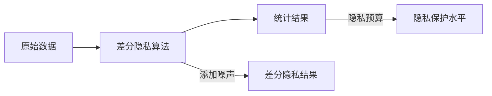
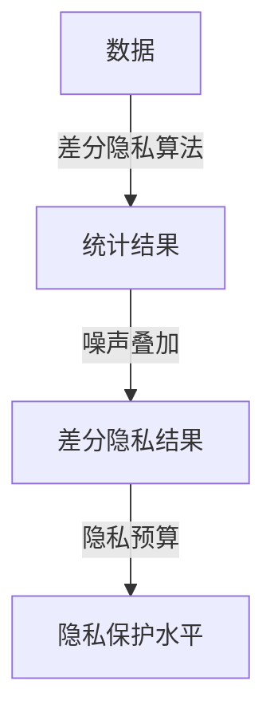

                 

# 差分隐私：软件2.0数据大合并时代的隐私卫士

## 1. 背景介绍

### 1.1 问题由来
在互联网和数字技术的迅猛发展下，大数据成为当今社会的一大趋势。随着数据量的不断积累和集中，如何安全地管理和使用数据，保护用户隐私，成为社会关注的热点问题。差分隐私（Differential Privacy, DP）作为近年来兴起的一种数据隐私保护技术，在应对这一挑战中发挥了重要作用。

差分隐私最早由计算机科学家Dwork于2006年提出，并在2017年获得图灵奖，成为人工智能领域的重要研究方向之一。随着数据科学和大数据技术的普及，差分隐私技术逐渐被业界广泛应用，尤其在数据聚合、隐私计算和联邦学习等场景中，差分隐私的应用越来越广泛。

### 1.2 问题核心关键点
差分隐私的核心思想是：在数据处理和分析过程中，通过向噪声中添加一定的扰动，使得任何个体数据对统计结果的影响不可观测，从而保护用户隐私。差分隐私具有以下优点：
- 可量化隐私：差分隐私通过数学公式计算隐私保证，使得隐私保护具有明确的量化标准。
- 鲁棒性强：差分隐私对隐私保护要求不同应用场景的隐私保护程度，具有较好的适应性。
- 可扩展性：差分隐私可以与大数据分析、机器学习等技术结合，实现隐私保护和数据利用的平衡。

### 1.3 问题研究意义
差分隐私技术的研究和应用具有重要的理论和实际意义：
- 保护用户隐私：在数据聚合和共享的过程中，差分隐私可以确保用户数据不会泄露，保护用户隐私。
- 提升数据可信度：差分隐私技术可以增加统计结果的可信度，使得用户对数据处理和分析的信任度更高。
- 促进数据共享：差分隐私技术可以降低数据共享的风险，促进数据跨部门、跨领域的安全共享，提高数据利用率。
- 促进隐私计算发展：差分隐私是隐私计算的核心技术之一，隐私计算通过技术手段，在不共享原始数据的情况下，确保数据分析结果的准确性和可用性。

差分隐私在数据聚合、数据共享、联邦学习等场景中得到了广泛应用，例如Google AdWords广告竞价、微软Cortana语音助手、Facebook人脸识别等应用中，差分隐私都被成功应用，显著提高了数据隐私保护水平。

## 2. 核心概念与联系

### 2.1 核心概念概述

差分隐私（Differential Privacy, DP）通过向数据中添加噪声，使得任意个体数据对统计结果的影响不可观测，从而保护用户隐私。差分隐私的基本框架包括三部分：
1. **隐私预算（ε参数）**：隐私预算用于衡量差分隐私的隐私保护水平。ε值越大，隐私保护水平越高，但统计结果的误差也会增加。
2. **噪声机制（Additive Noise）**：差分隐私通过向原始数据中添加噪声，保证个体数据对统计结果的影响不可观测。
3. **差分隐私算法**：差分隐私算法是差分隐私的核心，通过计算统计结果并添加噪声，实现隐私保护。

差分隐私的目标是在保护隐私的同时，确保数据分析结果的准确性和可用性。差分隐私模型通常通过以下几个步骤实现隐私保护：
1. 对原始数据进行差分隐私计算，生成统计结果。
2. 将统计结果和噪声叠加，得到差分隐私结果。
3. 计算隐私保护水平，确保个体数据对统计结果的影响不可观测。

差分隐私技术包括多种具体的差分隐私算法，如Laplace噪声、Gaussian噪声、指数机制等。这些算法根据具体的场景需求，选择合适的噪声机制和参数，以达到隐私保护的最佳效果。

### 2.2 核心概念原理和架构的 Mermaid 流程图



上述流程图展示了差分隐私的基本工作原理：
- 原始数据经过差分隐私算法处理，生成统计结果。
- 统计结果与噪声叠加，得到差分隐私结果。
- 隐私保护水平确保个体数据对统计结果的影响不可观测。

差分隐私技术的基本架构可以总结如下：



### 2.3 差分隐私与其他隐私保护技术的联系

差分隐私技术是隐私计算领域的核心技术之一，与同源隐私保护技术（如数据加密、访问控制等）有着密切的联系。这些技术共同构建了隐私计算的安全保障体系，保护数据隐私。

具体而言，差分隐私与其他隐私保护技术的联系如下：
1. **数据加密**：数据加密通过将数据转换为不可识别的密文，保护数据隐私。差分隐私通过在数据分析过程中添加噪声，保护数据隐私。数据加密和差分隐私可以结合使用，共同保护数据隐私。
2. **访问控制**：访问控制通过控制数据访问权限，保护数据隐私。差分隐私通过在数据处理和分析过程中保护数据隐私，避免数据泄露。访问控制和差分隐私可以结合使用，共同构建全面的数据隐私保护体系。
3. **同源隐私保护技术**：同源隐私保护技术还包括匿名化、伪装化等技术，通过改变数据表现形式，保护数据隐私。差分隐私通过在数据分析过程中保护数据隐私，避免个体数据泄露。同源隐私保护技术和差分隐私可以结合使用，共同保护数据隐私。

差分隐私与其他隐私保护技术的联系，展示了其在隐私计算中的重要地位。差分隐私可以与其他隐私保护技术结合使用，构建更加全面、可靠的数据隐私保护体系。

## 3. 核心算法原理 & 具体操作步骤
### 3.1 算法原理概述

差分隐私算法的基本原理是通过向数据中添加噪声，使得任意个体数据对统计结果的影响不可观测。差分隐私的隐私保护水平由隐私预算（ε参数）决定，ε值越大，隐私保护水平越高，但统计结果的误差也会增加。差分隐私的噪声机制通常包括Laplace噪声、Gaussian噪声、指数机制等，具体选择取决于具体的应用场景。

差分隐私的核心算法流程如下：
1. 对原始数据进行差分隐私计算，生成统计结果。
2. 将统计结果与噪声叠加，得到差分隐私结果。
3. 计算隐私保护水平，确保个体数据对统计结果的影响不可观测。

差分隐私算法的具体实现包括：
- 计算统计结果，如均值、方差、最大值、最小值等。
- 将统计结果与噪声叠加，得到差分隐私结果。
- 计算隐私保护水平，如隐私预算ε、隐私保护参数δ等。

差分隐私算法的主要参数包括：
- ε参数：隐私预算，用于衡量差分隐私的隐私保护水平。
- δ参数：隐私保护参数，用于衡量差分隐私的隐私保护效果。

差分隐私算法的一般步骤包括：
1. 选择噪声机制。
2. 计算统计结果。
3. 将统计结果与噪声叠加，得到差分隐私结果。
4. 计算隐私保护水平，确保个体数据对统计结果的影响不可观测。

### 3.2 算法步骤详解

差分隐私算法的主要步骤如下：

**Step 1: 数据预处理**

对原始数据进行预处理，去除无关字段，对数值型数据进行标准化处理，减少噪声的波动。

**Step 2: 选择噪声机制**

根据具体的应用场景，选择合适的噪声机制。Laplace噪声通常用于连续型数据，Gaussian噪声通常用于连续型数据和离散型数据，指数机制适用于分布已知的情况。

**Step 3: 计算统计结果**

对预处理后的数据进行统计计算，如均值、方差、最大值、最小值等。

**Step 4: 添加噪声**

将统计结果与噪声叠加，得到差分隐私结果。

**Step 5: 计算隐私保护水平**

计算隐私保护水平，确保个体数据对统计结果的影响不可观测。隐私保护水平包括ε参数和δ参数，用于衡量差分隐私的隐私保护水平和效果。

### 3.3 算法优缺点

差分隐私技术的优点包括：
1. 可量化隐私：差分隐私通过数学公式计算隐私保护水平，使得隐私保护具有明确的量化标准。
2. 鲁棒性强：差分隐私对隐私保护要求不同应用场景的隐私保护程度，具有较好的适应性。
3. 可扩展性：差分隐私可以与大数据分析、机器学习等技术结合，实现隐私保护和数据利用的平衡。

差分隐私技术的缺点包括：
1. 统计结果误差较大：差分隐私通过向数据中添加噪声，增加了统计结果的误差。
2. 隐私保护水平受ε参数影响：ε参数越大，隐私保护水平越高，但统计结果的误差也会增加。
3. 隐私保护效果难以评估：差分隐私的隐私保护效果难以直接评估，需要通过隐私预算和隐私保护参数进行计算。

### 3.4 算法应用领域

差分隐私技术广泛应用于大数据分析、数据聚合、隐私计算和联邦学习等场景中。以下是几个具体的应用领域：

1. **数据聚合**：在数据聚合过程中，差分隐私技术可以确保聚合结果的准确性和隐私保护。
2. **隐私计算**：差分隐私技术是隐私计算的核心技术之一，通过在不共享原始数据的情况下，确保数据分析结果的准确性和可用性。
3. **联邦学习**：差分隐私技术可以在联邦学习过程中，保护用户数据的隐私，同时保证模型训练结果的准确性。
4. **数据共享**：差分隐私技术可以在数据共享过程中，确保数据隐私，促进数据跨部门、跨领域的安全共享。
5. **广告竞价**：在广告竞价过程中，差分隐私技术可以确保用户数据隐私，同时保证广告投放的公平性和准确性。
6. **语音助手**：在语音助手（如Cortana、Siri等）中，差分隐私技术可以确保用户语音数据的隐私，保护用户隐私。

差分隐私技术的广泛应用，展示了其在数据隐私保护中的重要地位。差分隐私技术通过在数据处理和分析过程中保护用户隐私，实现数据利用和隐私保护的平衡。

## 4. 数学模型和公式 & 详细讲解

### 4.1 数学模型构建

差分隐私的数学模型主要涉及统计计算和隐私保护两个方面。假设原始数据集为 $D = \{(x_1, y_1), \ldots, (x_n, y_n)\}$，其中 $x_i$ 为数据特征， $y_i$ 为标签。差分隐私模型的目标是计算统计结果 $\hat{y}$，同时保护隐私。

差分隐私的数学模型包括：
1. 原始数据集 $D$。
2. 统计结果 $\hat{y}$。
3. 隐私保护水平 $\epsilon$ 和 $\delta$。

差分隐私模型的基本公式如下：

$$
\hat{y} = \sum_{i=1}^n f(x_i) + \epsilon
$$

其中，$f(x_i)$ 表示对数据 $x_i$ 进行统计计算的结果，$\epsilon$ 表示隐私预算，用于衡量差分隐私的隐私保护水平。

### 4.2 公式推导过程

差分隐私的隐私预算 $\epsilon$ 和隐私保护参数 $\delta$ 用于衡量差分隐私的隐私保护水平。隐私预算 $\epsilon$ 的计算公式如下：

$$
\epsilon = f(\delta)
$$

其中，$f(\delta)$ 表示隐私保护参数 $\delta$ 的函数。隐私保护参数 $\delta$ 的计算公式如下：

$$
\delta = \sum_{i=1}^n P(\hat{y} \neq y_i | D)
$$

其中，$P(\hat{y} \neq y_i | D)$ 表示在数据集 $D$ 中，统计结果 $\hat{y}$ 与真实标签 $y_i$ 不匹配的概率。

差分隐私的噪声机制通常包括Laplace噪声、Gaussian噪声、指数机制等。以Laplace噪声为例，Laplace噪声的计算公式如下：

$$
Laplace(y_i; \epsilon) = y_i + \epsilon \cdot \mathcal{L}
$$

其中，$\mathcal{L}$ 表示Laplace噪声的尺度因子。

### 4.3 案例分析与讲解

以下以一个简单的数据聚合场景为例，介绍差分隐私技术的应用。

假设有一份数据集，包含用户的年龄、性别、收入等数据。现在需要对用户的平均收入进行计算，同时保护用户隐私。

1. 数据预处理：对数据进行标准化处理，去除无关字段，减少噪声的波动。

2. 选择噪声机制：选择Laplace噪声，计算隐私保护水平。

3. 计算统计结果：对标准化后的数据进行平均收入计算，得到统计结果。

4. 添加噪声：将统计结果与Laplace噪声叠加，得到差分隐私结果。

5. 计算隐私保护水平：计算隐私保护参数 $\delta$，确保个体数据对统计结果的影响不可观测。

通过差分隐私技术，可以在保护用户隐私的前提下，进行数据聚合和分析，保护用户隐私的同时，保证统计结果的准确性。

## 5. 项目实践：代码实例和详细解释说明
### 5.1 开发环境搭建

在进行差分隐私实践前，我们需要准备好开发环境。以下是使用Python进行差分隐私开发的环境配置流程：

1. 安装Anaconda：从官网下载并安装Anaconda，用于创建独立的Python环境。

2. 创建并激活虚拟环境：
```bash
conda create -n dp-env python=3.8 
conda activate dp-env
```

3. 安装PyTorch：根据CUDA版本，从官网获取对应的安装命令。例如：
```bash
conda install pytorch torchvision torchaudio cudatoolkit=11.1 -c pytorch -c conda-forge
```

4. 安装差分隐私库：
```bash
pip install torch-differential-privacy
```

5. 安装各类工具包：
```bash
pip install numpy pandas scikit-learn matplotlib tqdm jupyter notebook ipython
```

完成上述步骤后，即可在`dp-env`环境中开始差分隐私实践。

### 5.2 源代码详细实现

这里我们以Laplace噪声为例，展示如何使用Python进行差分隐私计算。

首先，定义数据和统计函数：

```python
import torch
from torch.nn import functional as F
from torch.differential_privacy import Laplace

# 定义数据集
x = torch.tensor([10, 20, 30, 40, 50])

# 定义统计函数
def mean(x):
    return torch.mean(x)

# 计算均值
y = mean(x)
print(f"原始均值：{y.item()}")
```

然后，定义差分隐私计算函数：

```python
# 定义Laplace噪声
laplace = Laplace(n, delta=0.1)

# 计算差分隐私结果
y_dp = laplace.add_noise(mean(x), y)
print(f"差分隐私均值：{y_dp.item()}")
```

最后，计算隐私保护水平：

```python
# 计算隐私保护参数
delta = laplace.delta
print(f"隐私保护参数：{delta}")
```

运行上述代码，即可得到差分隐私计算结果和隐私保护参数。

### 5.3 代码解读与分析

让我们再详细解读一下关键代码的实现细节：

**Laplace噪声定义**：
- 定义Laplace噪声对象 `laplace`，其中 `n` 表示Laplace噪声的尺度因子，`delta` 表示隐私保护参数。

**差分隐私计算**：
- 使用 `laplace.add_noise` 方法，将统计结果 `mean(x)` 与Laplace噪声叠加，得到差分隐私结果 `y_dp`。

**隐私保护参数计算**：
- 使用 `laplace.delta` 方法，计算隐私保护参数 `delta`，用于衡量差分隐私的隐私保护水平。

差分隐私技术的应用需要考虑多个因素，如隐私预算、噪声机制、隐私保护参数等。在实际应用中，需要根据具体场景进行优化，以达到最佳的隐私保护和统计准确性。

## 6. 实际应用场景
### 6.1 智能推荐系统

智能推荐系统是差分隐私技术的重要应用场景之一。在推荐系统中，差分隐私技术可以保护用户隐私，同时确保推荐结果的准确性。

在推荐系统中，差分隐私技术通常通过以下几个步骤实现：
1. 收集用户的历史行为数据，并进行标准化处理。
2. 选择噪声机制，计算隐私保护参数。
3. 对数据进行统计计算，如用户行为频次、兴趣点等。
4. 将统计结果与噪声叠加，得到差分隐私结果。
5. 计算隐私保护参数，确保个体用户对统计结果的影响不可观测。

通过差分隐私技术，可以在保护用户隐私的前提下，进行用户行为分析和推荐模型训练，保护用户隐私的同时，保证推荐结果的准确性。

### 6.2 医疗数据分析

在医疗数据分析中，差分隐私技术可以确保患者数据隐私，同时进行数据聚合和分析，提高医疗决策的准确性。

在医疗数据分析中，差分隐私技术通常通过以下几个步骤实现：
1. 收集患者的医疗数据，并进行标准化处理。
2. 选择噪声机制，计算隐私保护参数。
3. 对数据进行统计计算，如疾病发病率、病历数据等。
4. 将统计结果与噪声叠加，得到差分隐私结果。
5. 计算隐私保护参数，确保个体患者对统计结果的影响不可观测。

通过差分隐私技术，可以在保护患者隐私的前提下，进行疾病发病率分析、病历数据聚合等，保护患者隐私的同时，提高医疗决策的准确性。

### 6.3 金融数据分析

在金融数据分析中，差分隐私技术可以保护用户交易数据隐私，同时进行数据聚合和分析，提高金融决策的准确性。

在金融数据分析中，差分隐私技术通常通过以下几个步骤实现：
1. 收集用户的交易数据，并进行标准化处理。
2. 选择噪声机制，计算隐私保护参数。
3. 对数据进行统计计算，如用户消费习惯、交易趋势等。
4. 将统计结果与噪声叠加，得到差分隐私结果。
5. 计算隐私保护参数，确保个体用户对统计结果的影响不可观测。

通过差分隐私技术，可以在保护用户交易数据隐私的前提下，进行用户消费习惯分析、交易趋势预测等，保护用户隐私的同时，提高金融决策的准确性。

### 6.4 未来应用展望

随着差分隐私技术的不断发展和应用，未来的差分隐私技术将呈现以下几个发展趋势：

1. **分布式差分隐私**：在大数据时代，数据往往分散在不同的机构中。分布式差分隐私技术可以在多机构数据聚合过程中，确保数据隐私，提高数据利用率。
2. **差分隐私与区块链结合**：差分隐私技术可以与区块链结合，确保数据的去中心化和隐私保护。区块链的去中心化特性，可以保证数据的安全性和隐私保护。
3. **差分隐私与机器学习结合**：差分隐私技术可以与机器学习结合，进行隐私保护下的机器学习训练，提高模型的准确性和隐私保护水平。
4. **差分隐私与联邦学习结合**：差分隐私技术可以与联邦学习结合，进行隐私保护下的模型训练，提高模型的准确性和隐私保护水平。
5. **差分隐私与区块链结合**：差分隐私技术可以与区块链结合，确保数据的去中心化和隐私保护。区块链的去中心化特性，可以保证数据的安全性和隐私保护。
6. **差分隐私与联邦学习结合**：差分隐私技术可以与联邦学习结合，进行隐私保护下的模型训练，提高模型的准确性和隐私保护水平。

这些发展趋势展示了差分隐私技术的广阔前景。随着差分隐私技术的不断演进，未来的差分隐私技术将更加全面、可靠、高效，进一步推动数据隐私保护和数据利用的大发展。

## 7. 工具和资源推荐
### 7.1 学习资源推荐

为了帮助开发者系统掌握差分隐私的理论基础和实践技巧，这里推荐一些优质的学习资源：

1. **《Differential Privacy: The Complete Guide》**：这是一本系统介绍差分隐私技术的书籍，涵盖差分隐私的原理、算法、应用等方面的内容，适合深入学习。

2. **CS229《Machine Learning with Privacy》课程**：斯坦福大学开设的机器学习课程，包含差分隐私的内容，适合学习差分隐私的基本概念和应用场景。

3. **《Differential Privacy for Dummies》**：这是一本介绍差分隐私技术的入门书籍，适合初学者阅读。

4. **差分隐私官方文档**：差分隐私技术的官方文档，包含差分隐私算法的详细介绍和应用案例，适合学习差分隐私的具体实现方法。

5. **Kaggle差分隐私比赛**：Kaggle上的差分隐私比赛，包含实际应用中的差分隐私挑战，适合实践学习。

### 7.2 开发工具推荐

差分隐私技术的开发和应用需要强大的工具支持。以下是几款常用的差分隐私开发工具：

1. **TensorFlow Privacy**：Google开发的差分隐私工具库，支持多种差分隐私算法，如Laplace噪声、Gaussian噪声等。

2. **PySyft**：Facebook开发的差分隐私工具库，支持联邦学习和分布式差分隐私，适合大规模数据处理和分析。

3. **Apache Spark Privacy**：Apache Spark的差分隐私扩展，支持差分隐私计算和分布式差分隐私，适合大数据场景。

4. **Librarium**：一个开源的差分隐私工具库，支持多种差分隐私算法，适合快速开发差分隐私应用。

5. **OpenDP**：一个开源的差分隐私工具库，支持多种差分隐私算法，适合多种应用场景。

这些工具库可以帮助开发者快速实现差分隐私算法，提高开发效率。

### 7.3 相关论文推荐

差分隐私技术的发展离不开学术界的不断探索。以下是几篇奠基性的差分隐私论文，推荐阅读：

1. **《Differential Privacy》**：Dwork等人在2006年发表的差分隐私原始论文，奠定了差分隐私的理论基础。

2. **《The Privacy Surgeon》**：Dwork在2021年发表的差分隐私综述文章，详细介绍了差分隐私的发展历程和未来趋势。

3. **《Differential Privacy in Machine Learning》**：Dwork等人在2018年发表的差分隐私与机器学习结合的论文，介绍了差分隐私在机器学习中的应用。

4. **《Differential Privacy and the Privacy-Utility Tradeoff》**：Dwork等人在2006年发表的差分隐私与隐私-利用率平衡的论文，详细介绍了差分隐私与隐私-利用率平衡的关系。

这些论文展示了差分隐私技术的理论基础和应用前景，对学习差分隐私技术具有重要参考价值。

## 8. 总结：未来发展趋势与挑战

### 8.1 总结

差分隐私技术作为数据隐私保护的核心技术之一，在数据聚合、数据共享、联邦学习等场景中得到了广泛应用。差分隐私技术通过在数据处理和分析过程中保护用户隐私，实现数据利用和隐私保护的平衡。差分隐私技术的发展离不开学术界的不断探索和工业界的不断实践，其未来的发展前景广阔。

### 8.2 未来发展趋势

差分隐私技术在未来将呈现以下几个发展趋势：

1. **分布式差分隐私**：在大数据时代，数据往往分散在不同的机构中。分布式差分隐私技术可以在多机构数据聚合过程中，确保数据隐私，提高数据利用率。
2. **差分隐私与区块链结合**：差分隐私技术可以与区块链结合，确保数据的去中心化和隐私保护。区块链的去中心化特性，可以保证数据的安全性和隐私保护。
3. **差分隐私与机器学习结合**：差分隐私技术可以与机器学习结合，进行隐私保护下的机器学习训练，提高模型的准确性和隐私保护水平。
4. **差分隐私与联邦学习结合**：差分隐私技术可以与联邦学习结合，进行隐私保护下的模型训练，提高模型的准确性和隐私保护水平。
5. **差分隐私与联邦学习结合**：差分隐私技术可以与联邦学习结合，进行隐私保护下的模型训练，提高模型的准确性和隐私保护水平。

### 8.3 面临的挑战

尽管差分隐私技术已经取得了一定的发展，但在实际应用中也面临着诸多挑战：

1. **隐私预算设定**：隐私预算的设定需要根据具体场景进行优化，过高的隐私预算会增加噪声，降低统计结果的准确性。如何设定最优的隐私预算，是一个重要的研究方向。
2. **噪声机制选择**：不同的噪声机制适用于不同的应用场景，如何选择合适的噪声机制，是一个重要的研究方向。
3. **隐私保护效果评估**：差分隐私的隐私保护效果难以直接评估，需要通过隐私预算和隐私保护参数进行计算。如何评估差分隐私的隐私保护效果，是一个重要的研究方向。
4. **分布式差分隐私**：在大数据时代，数据往往分散在不同的机构中。如何实现分布式差分隐私，确保数据隐私，是一个重要的研究方向。
5. **差分隐私与机器学习结合**：差分隐私技术可以与机器学习结合，进行隐私保护下的机器学习训练，提高模型的准确性和隐私保护水平。如何实现差分隐私与机器学习的结合，是一个重要的研究方向。

### 8.4 研究展望

面对差分隐私技术所面临的挑战，未来的研究需要在以下几个方面寻求新的突破：

1. **隐私预算自适应**：如何根据数据分布和隐私需求，动态调整隐私预算，实现隐私保护与统计结果的平衡。
2. **噪声机制优化**：如何选择合适的噪声机制，确保差分隐私的保护效果和统计结果的准确性。
3. **隐私保护效果评估**：如何通过有效的隐私保护效果评估方法，确保差分隐私的保护效果。
4. **分布式差分隐私**：如何实现分布式差分隐私，确保数据隐私，同时提高数据利用率。
5. **差分隐私与机器学习结合**：如何实现差分隐私与机器学习的结合，提高模型的准确性和隐私保护水平。

这些研究方向的探索，必将引领差分隐私技术迈向更高的台阶，为数据隐私保护和数据利用带来新的突破。面向未来，差分隐私技术还需要与其他隐私计算技术进行更深入的融合，共同推动数据隐私保护和数据利用的大发展。

## 9. 附录：常见问题与解答

**Q1：什么是差分隐私？**

A: 差分隐私是一种数据隐私保护技术，通过向数据中添加噪声，使得任意个体数据对统计结果的影响不可观测，从而保护用户隐私。差分隐私通过数学公式计算隐私保护水平，使得隐私保护具有明确的量化标准。

**Q2：差分隐私的隐私预算和隐私保护参数是什么？**

A: 差分隐私的隐私预算（ε参数）用于衡量隐私保护水平，隐私保护参数（δ参数）用于衡量隐私保护效果。隐私预算越大，隐私保护水平越高，但统计结果的误差也会增加。隐私保护参数越大，隐私保护效果越好，但隐私保护水平也会降低。

**Q3：差分隐私技术的优点和缺点是什么？**

A: 差分隐私技术的优点包括：可量化隐私、鲁棒性强、可扩展性。缺点包括：统计结果误差较大、隐私保护水平受ε参数影响、隐私保护效果难以评估。

**Q4：差分隐私技术的应用场景有哪些？**

A: 差分隐私技术广泛应用于大数据分析、数据聚合、隐私计算和联邦学习等场景中。具体应用场景包括智能推荐系统、医疗数据分析、金融数据分析等。

**Q5：如何实现差分隐私与机器学习结合？**

A: 差分隐私技术可以与机器学习结合，进行隐私保护下的机器学习训练。具体步骤包括：
1. 收集用户数据，并进行标准化处理。
2. 选择噪声机制，计算隐私保护参数。
3. 对数据进行统计计算，如用户行为频次、兴趣点等。
4. 将统计结果与噪声叠加，得到差分隐私结果。
5. 计算隐私保护参数，确保个体用户对统计结果的影响不可观测。

通过差分隐私技术，可以在保护用户隐私的前提下，进行用户行为分析和推荐模型训练，保护用户隐私的同时，保证推荐结果的准确性。

---

作者：禅与计算机程序设计艺术 / Zen and the Art of Computer Programming

