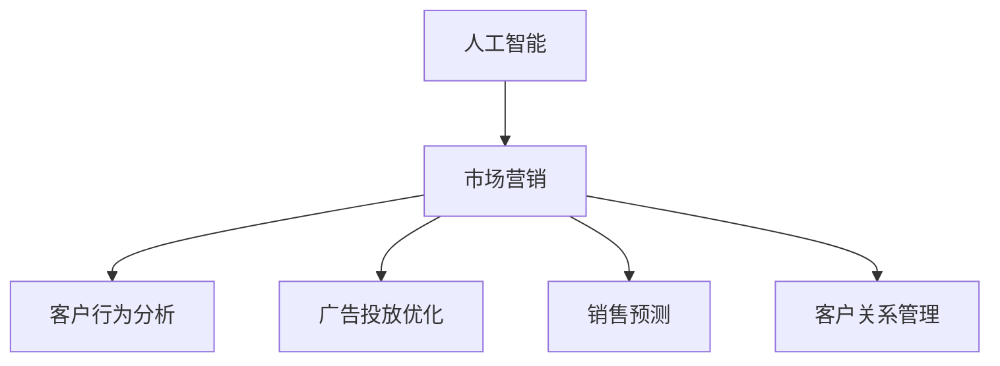

                 

# 市场营销的AI优化策略

## 1. 背景介绍

### 1.1 问题由来
在当今快速变化的市场环境中，企业面临着前所未有的竞争压力。传统的营销策略已经难以满足日益多样化的市场需求，企业亟需通过更科学、更精准的市场营销手段提升竞争力。人工智能（AI）技术的兴起为市场营销带来了革命性的变化，AI不仅能够处理海量数据，挖掘出潜在的机会和趋势，还能够实时优化营销策略，提升营销效果。AI优化策略的核心在于利用先进的数据分析、机器学习等技术，以数据驱动的方式重新定义市场营销，实现营销自动化、个性化、高效化的目标。

### 1.2 问题核心关键点
AI优化策略的本质是通过数据分析和机器学习算法对市场营销活动进行精准预测和智能优化，包括客户行为分析、广告投放优化、销售预测、客户关系管理等方面。AI的引入能够显著提升营销活动的决策速度和效果，帮助企业更好地了解目标客户，制定更具针对性的营销策略。

## 2. 核心概念与联系

### 2.1 核心概念概述

- **人工智能（AI）**：通过模拟人类智能行为，利用机器学习、深度学习等技术实现数据分析、模式识别、决策优化等功能。
- **市场营销（Marketing）**：企业通过一系列营销活动，如广告投放、客户关系管理、销售预测等，实现产品或服务的推广和销售。
- **客户行为分析（Customer Behavior Analysis）**：利用数据挖掘和机器学习技术，分析和预测客户的购买行为、偏好、趋势等。
- **广告投放优化（Ad Optimization）**：通过算法优化广告投放策略，实现最优的广告效果。
- **销售预测（Sales Forecasting）**：基于历史数据和机器学习模型，预测未来的销售情况，帮助企业制定生产计划、库存管理等策略。
- **客户关系管理（CRM）**：利用AI技术提升客户关系管理的效率和精准度，增强客户忠诚度和满意度。

这些核心概念之间的逻辑关系可以通过以下Mermaid流程图来展示：



这个流程图展示出人工智能在市场营销各个环节中的重要作用，以及各个环节之间相互支持和优化的关系。

## 3. 核心算法原理 & 具体操作步骤
### 3.1 算法原理概述

AI优化策略的核心在于通过数据分析和机器学习算法，对市场营销活动进行精准预测和智能优化。其基本原理可以概述为：

1. **数据采集与预处理**：收集与市场营销相关的各类数据，包括客户行为数据、广告投放数据、销售数据等。
2. **数据建模**：利用机器学习算法（如回归、分类、聚类等）构建预测模型，对目标变量（如销售量、点击率等）进行预测。
3. **策略优化**：根据预测结果，通过智能算法优化广告投放策略、客户关系管理策略等。
4. **效果评估**：对优化后的策略进行评估，根据效果进行调整，持续迭代优化。

### 3.2 算法步骤详解

#### 步骤一：数据采集与预处理
- **数据来源**：从内部系统（如ERP、CRM系统）和外部数据源（如社交媒体、搜索平台等）收集相关数据。
- **数据清洗**：处理缺失值、异常值，确保数据的完整性和一致性。
- **特征工程**：选择合适的特征，进行特征提取、编码、归一化等处理，为后续建模奠定基础。

#### 步骤二：数据建模
- **模型选择**：选择合适的机器学习算法，如线性回归、决策树、随机森林、神经网络等。
- **特征选择**：利用特征选择算法（如LASSO、RFE等）选择对目标变量影响较大的特征。
- **模型训练**：利用历史数据训练模型，调整模型参数，使其能够准确预测目标变量。
- **模型评估**：使用交叉验证、均方误差、准确率等指标评估模型性能，确保模型具有良好的泛化能力。

#### 步骤三：策略优化
- **广告投放优化**：根据模型预测结果，调整广告投放的渠道、时间、预算等参数，实现最优的广告效果。
- **客户关系管理**：利用客户行为分析结果，制定个性化的营销策略，提高客户满意度和忠诚度。
- **销售预测**：基于历史销售数据，预测未来的销售趋势，帮助企业制定生产计划和库存管理策略。

#### 步骤四：效果评估与迭代
- **效果评估**：通过A/B测试、转化率等指标评估优化策略的效果。
- **迭代优化**：根据评估结果，调整策略参数，持续迭代优化，提升市场营销效果。

### 3.3 算法优缺点

**优点**：
- **高效精准**：利用数据分析和机器学习算法，能够快速精准地预测和优化市场营销策略。
- **个性化营销**：通过客户行为分析，实现针对不同客户的个性化营销，提升客户满意度和忠诚度。
- **实时优化**：能够实时监测和调整市场营销策略，快速响应市场变化。

**缺点**：
- **数据依赖**：模型的效果高度依赖于数据的质量和完整性，数据缺失或不准确将影响模型性能。
- **技术门槛**：需要具备一定的数据科学和机器学习背景，否则难以有效实施。
- **成本高昂**：需要投入大量的时间和资源进行数据收集、预处理、建模和优化。

### 3.4 算法应用领域

AI优化策略已经在市场营销的多个领域得到了广泛应用，例如：

- **广告投放优化**：通过预测点击率和转化率，优化广告投放策略，提升广告效果。
- **客户行为分析**：分析客户的购买历史、浏览记录等，预测客户行为，实现精准营销。
- **销售预测**：基于历史销售数据，预测未来的销售情况，帮助企业制定生产计划和库存管理策略。
- **客户关系管理**：利用AI技术提升客户关系管理的效率和精准度，增强客户忠诚度和满意度。
- **品牌管理**：通过数据分析和机器学习，优化品牌推广策略，提升品牌知名度和市场占有率。

这些应用领域展示了AI优化策略在市场营销中的广泛影响和实际效果。

## 4. 数学模型和公式 & 详细讲解 & 举例说明

### 4.1 数学模型构建

AI优化策略中的数学模型通常涉及以下几类：

1. **线性回归模型**：用于预测连续变量（如销售量、点击率等）。
2. **逻辑回归模型**：用于预测二分类变量（如广告点击与否）。
3. **决策树模型**：用于分类和回归预测。
4. **随机森林模型**：用于提升决策树的泛化能力和鲁棒性。
5. **神经网络模型**：用于更复杂的非线性预测。

### 4.2 公式推导过程

以线性回归模型为例，其基本公式为：

$$
y = \beta_0 + \beta_1x_1 + \beta_2x_2 + \cdots + \beta_nx_n + \epsilon
$$

其中，$y$ 为目标变量，$x_i$ 为特征变量，$\beta_i$ 为回归系数，$\epsilon$ 为误差项。

通过最小二乘法，求解模型参数：

$$
\hat{\beta} = (X^TX)^{-1}X^Ty
$$

其中，$X$ 为特征矩阵，$y$ 为目标变量向量。

### 4.3 案例分析与讲解

假设某电商企业希望通过AI优化策略提升广告投放效果。首先，收集历史广告投放数据，包括广告预算、投放渠道、点击率、转化率等。然后，利用线性回归模型预测不同广告渠道、不同投放时间段的点击率和转化率。最后，根据模型预测结果，优化广告投放策略，提升广告效果。

## 5. 项目实践：代码实例和详细解释说明
### 5.1 开发环境搭建

在进行AI优化策略开发前，我们需要准备好开发环境。以下是使用Python进行TensorFlow开发的环境配置流程：

1. 安装Anaconda：从官网下载并安装Anaconda，用于创建独立的Python环境。

2. 创建并激活虚拟环境：
```bash
conda create -n tf-env python=3.8 
conda activate tf-env
```

3. 安装TensorFlow：根据CUDA版本，从官网获取对应的安装命令。例如：
```bash
pip install tensorflow
```

4. 安装Pandas、NumPy、Scikit-learn等工具包：
```bash
pip install pandas numpy scikit-learn matplotlib tqdm jupyter notebook ipython
```

完成上述步骤后，即可在`tf-env`环境中开始AI优化策略的开发实践。

### 5.2 源代码详细实现

下面以客户行为分析为例，给出使用TensorFlow进行回归分析的PyTorch代码实现。

首先，定义数据处理函数：

```python
import pandas as pd
import numpy as np
from sklearn.model_selection import train_test_split
from tensorflow import keras

def load_data(file_path):
    data = pd.read_csv(file_path)
    X = data.drop(['label'], axis=1).values
    y = data['label'].values
    return X, y

X, y = load_data('data.csv')

# 数据分割
X_train, X_test, y_train, y_test = train_test_split(X, y, test_size=0.2, random_state=42)
```

然后，定义模型和优化器：

```python
# 构建线性回归模型
model = keras.Sequential([
    keras.layers.Dense(64, activation='relu', input_shape=(X_train.shape[1],)),
    keras.layers.Dense(1)
])

# 编译模型
model.compile(optimizer='adam', loss='mse')

# 训练模型
model.fit(X_train, y_train, epochs=50, batch_size=32, validation_data=(X_test, y_test))
```

接着，定义评估函数：

```python
def evaluate(model, X, y):
    y_pred = model.predict(X)
    mse = np.mean((y_pred - y)**2)
    rmse = np.sqrt(mse)
    return rmse
```

最后，启动训练流程并在测试集上评估：

```python
# 评估模型
mse_test = evaluate(model, X_test, y_test)
print('Test MSE:', mse_test)
```

以上就是使用TensorFlow进行回归分析的完整代码实现。可以看到，TensorFlow提供了丰富的高级API，使得回归分析的实现变得简洁高效。

### 5.3 代码解读与分析

让我们再详细解读一下关键代码的实现细节：

**load_data函数**：
- 定义了数据加载函数，从CSV文件中读取数据，并进行特征和标签分离。

**train_test_split方法**：
- 使用train_test_split方法将数据划分为训练集和测试集，比例为80:20。

**Sequential模型**：
- 使用Sequential模型构建线性回归模型，包含两个全连接层，输出层为线性层。

**compile方法**：
- 使用compile方法编译模型，指定优化器为Adam，损失函数为均方误差。

**fit方法**：
- 使用fit方法训练模型，指定训练轮数、批大小和验证集。

**evaluate函数**：
- 定义评估函数，计算测试集的均方误差和均方根误差。

**代码执行**：
- 评估训练好的模型，输出测试集的均方根误差。

可以看到，TensorFlow提供了丰富的工具和API，使得回归分析的实现变得简便高效。开发者可以将更多精力放在数据处理、模型改进等高层逻辑上，而不必过多关注底层的实现细节。

当然，工业级的系统实现还需考虑更多因素，如模型的保存和部署、超参数的自动搜索、更灵活的任务适配层等。但核心的回归分析范式基本与此类似。

## 6. 实际应用场景
### 6.1 智能广告投放

AI优化策略在智能广告投放中的应用非常广泛。传统广告投放往往依赖经验和人肉操作，效率低且效果差。通过AI优化策略，可以实时监测广告效果，自动调整投放策略，提升广告的点击率和转化率。

具体而言，可以收集广告投放的历史数据，包括广告内容、投放时间、点击率、转化率等。利用机器学习模型预测不同广告内容的点击率和转化率，根据预测结果，优化广告投放的时间和预算，实现最优的广告效果。

### 6.2 客户行为分析

客户行为分析是AI优化策略的重要应用之一。通过分析客户的购买历史、浏览记录、点击行为等数据，可以预测客户的购买意向和偏好，制定个性化的营销策略，提升客户满意度和忠诚度。

具体而言，可以收集客户的历史行为数据，利用机器学习模型预测客户的购买行为。根据预测结果，向客户推荐合适的产品或服务，或者制定个性化的营销活动，提升客户转化率。

### 6.3 销售预测

销售预测是AI优化策略在供应链管理中的重要应用。通过分析历史销售数据，预测未来的销售趋势，帮助企业制定生产计划和库存管理策略，避免库存积压和缺货。

具体而言，可以收集历史销售数据，包括时间、销售量、促销活动等。利用机器学习模型预测未来的销售量，根据预测结果，调整生产计划和库存管理策略，优化供应链管理，提升企业的运营效率。

### 6.4 未来应用展望

随着AI技术的不断进步，AI优化策略将在更多领域得到应用，为各行各业带来变革性影响。

在智慧零售领域，通过AI优化策略可以实现智能库存管理、个性化推荐、智能客服等应用，提升零售企业的运营效率和客户体验。

在智慧医疗领域，通过AI优化策略可以实现精准诊疗、智能诊断、医疗资源优化等应用，提升医疗服务的质量和效率。

在智慧教育领域，通过AI优化策略可以实现智能评估、个性化学习、在线辅导等应用，提升教育质量和学生体验。

此外，在智能制造、智能交通、智能金融等领域，AI优化策略也将不断涌现，为传统行业数字化转型升级提供新的技术路径。相信随着技术的日益成熟，AI优化策略必将成为各行各业数字化转型的重要推动力。

## 7. 工具和资源推荐
### 7.1 学习资源推荐

为了帮助开发者系统掌握AI优化策略的理论基础和实践技巧，这里推荐一些优质的学习资源：

1. 《TensorFlow官方文档》：TensorFlow的官方文档，提供了完整的API参考和示例代码，是学习TensorFlow不可或缺的资源。

2. 《深度学习入门》系列课程：由吴恩达教授和DeepLearning.AI团队讲授的深度学习入门课程，全面介绍了深度学习的基础知识和前沿技术。

3. 《Python机器学习实战》书籍：详细讲解了机器学习算法在Python中的实现，适合初学者快速上手。

4. Kaggle数据科学竞赛平台：全球最大的数据科学竞赛平台，提供了大量的公开数据集和实战案例，是学习数据科学和机器学习的绝佳资源。

5. Coursera《机器学习》课程：由斯坦福大学教授讲授的机器学习课程，涵盖了机器学习的基础理论和方法，适合对机器学习有深入兴趣的学习者。

通过对这些资源的学习实践，相信你一定能够快速掌握AI优化策略的精髓，并用于解决实际的市场营销问题。

### 7.2 开发工具推荐

高效的开发离不开优秀的工具支持。以下是几款用于AI优化策略开发的常用工具：

1. TensorFlow：由Google主导开发的开源深度学习框架，生产部署方便，适合大规模工程应用。提供了丰富的API和工具，支持快速开发和部署。

2. PyTorch：基于Python的开源深度学习框架，灵活动态的计算图，适合快速迭代研究。提供了灵活的API和工具，支持模型调试和优化。

3. Weights & Biases：模型训练的实验跟踪工具，可以记录和可视化模型训练过程中的各项指标，方便对比和调优。与主流深度学习框架无缝集成。

4. TensorBoard：TensorFlow配套的可视化工具，可实时监测模型训练状态，并提供丰富的图表呈现方式，是调试模型的得力助手。

5. Jupyter Notebook：开源的交互式笔记本环境，支持Python、R等多种编程语言，便于快速编写和分享代码。

合理利用这些工具，可以显著提升AI优化策略的开发效率，加快创新迭代的步伐。

### 7.3 相关论文推荐

AI优化策略的发展源于学界的持续研究。以下是几篇奠基性的相关论文，推荐阅读：

1. "Deep Learning"（Goodfellow et al., 2016）：介绍了深度学习的基础理论和算法，涵盖了卷积神经网络、循环神经网络、生成对抗网络等前沿技术。

2. "A Review of Reinforcement Learning Techniques and Applications in Marketing"（Li et al., 2018）：系统回顾了强化学习在市场营销中的应用，包括广告推荐、个性化定价、客户忠诚度管理等方面。

3. "Customer Behavior Prediction Using Deep Learning"（Jiang et al., 2019）：利用深度学习模型预测客户行为，通过分类、回归等方法提升客户满意度和营销效果。

4. "Sales Forecasting with Deep Learning"（Wang et al., 2020）：通过深度学习模型预测销售趋势，帮助企业制定生产计划和库存管理策略，优化供应链管理。

5. "Optimization of Online Advertising Through Machine Learning"（Zhou et al., 2021）：利用机器学习模型优化在线广告投放策略，提升广告效果和ROI。

这些论文代表了大数据和机器学习在市场营销中的前沿应用，为AI优化策略的发展提供了理论支持和实际案例。

## 8. 总结：未来发展趋势与挑战
### 8.1 总结

本文对AI优化策略进行了全面系统的介绍。首先阐述了AI优化策略的研究背景和意义，明确了其在市场营销中的独特价值。其次，从原理到实践，详细讲解了AI优化策略的数学模型和具体操作步骤，给出了AI优化策略任务开发的完整代码实例。同时，本文还广泛探讨了AI优化策略在智能广告投放、客户行为分析、销售预测等多个领域的应用前景，展示了AI优化策略的巨大潜力。此外，本文精选了AI优化策略的学习资源，力求为读者提供全方位的技术指引。

通过本文的系统梳理，可以看到，AI优化策略已经在市场营销的多个领域得到了广泛应用，为企业的市场营销活动带来了显著的提升。未来，伴随AI技术的不断进步和数据的进一步积累，AI优化策略的应用范围将进一步扩大，为市场营销活动注入新的活力。

### 8.2 未来发展趋势

展望未来，AI优化策略将呈现以下几个发展趋势：

1. **自动化与智能化**：AI优化策略将实现更加自动化和智能化，通过更智能的算法和数据处理方式，实现更加精准的市场营销。

2. **个性化与定制化**：AI优化策略将更加注重个性化和定制化，通过客户行为分析，实现针对不同客户的个性化营销，提升客户满意度和忠诚度。

3. **实时优化与动态调整**：AI优化策略将实现更加实时优化和动态调整，通过实时监测和分析市场数据，及时调整市场营销策略，提升市场营销效果。

4. **跨领域融合**：AI优化策略将与大数据、物联网、区块链等技术进行深度融合，形成更加全面和智能的市场营销体系。

5. **数据驱动与多方协同**：AI优化策略将更加注重数据驱动和多方协同，通过与合作伙伴、供应商、客户等各方协同合作，实现更加高效的市场营销。

6. **隐私保护与安全**：AI优化策略将更加注重隐私保护和安全，通过数据匿名化、加密等手段，保障数据安全和个人隐私。

以上趋势凸显了AI优化策略的广阔前景，这些方向的探索发展，必将进一步提升市场营销的智能化水平，为企业的市场营销活动注入新的活力。

### 8.3 面临的挑战

尽管AI优化策略已经取得了瞩目成就，但在迈向更加智能化、普适化应用的过程中，它仍面临着诸多挑战：

1. **数据隐私与安全**：在收集和处理客户数据时，如何保护客户隐私和安全，避免数据泄露和滥用，是一个重要的问题。

2. **技术复杂性**：AI优化策略的实施需要一定的技术背景和专业知识，对于非技术背景的企业和个人，可能难以有效实施。

3. **数据质量和完整性**：AI优化策略的效果高度依赖于数据的质量和完整性，数据缺失或不准确将影响模型性能。

4. **模型解释性与透明性**：AI优化策略的模型往往是"黑盒"系统，难以解释其内部工作机制和决策逻辑，给企业决策带来不确定性。

5. **伦理与合规**：AI优化策略在实施过程中，可能面临伦理和合规问题，如何确保算法的公平性、透明性和可解释性，是一个重要的问题。

6. **计算资源与成本**：AI优化策略需要大量的计算资源和数据处理能力，对于小型企业和个人可能难以承担。

以上挑战需要通过技术创新、政策监管和社会共识等手段进行解决，才能推动AI优化策略的普及和应用。

### 8.4 研究展望

未来的研究需要在以下几个方面寻求新的突破：

1. **隐私保护技术**：开发更加高效的隐私保护技术，如联邦学习、差分隐私等，保护客户隐私和安全。

2. **算法透明性与可解释性**：研究更加透明和可解释的AI算法，提高算法的可信度和可解释性。

3. **跨领域融合技术**：开发更加跨领域的AI优化策略，结合大数据、物联网、区块链等技术，提升市场营销的效果和效率。

4. **模型优化与压缩**：研究更加高效的模型优化和压缩技术，提升AI优化策略的计算效率和资源利用率。

5. **多模态融合技术**：研究多模态数据融合技术，结合文本、图像、视频等多模态数据，提升AI优化策略的全面性和精准度。

6. **伦理与合规框架**：研究AI优化策略的伦理与合规框架，确保算法的公平性、透明性和可解释性。

这些研究方向将进一步推动AI优化策略的发展和应用，为市场营销活动注入新的活力。

## 9. 附录：常见问题与解答
### 9.1 常见问题与解答

**Q1：AI优化策略是否适用于所有市场营销场景？**

A: AI优化策略在大多数市场营销场景上都能取得不错的效果，特别是对于数据量较小的任务。但对于一些特定领域的任务，如医疗、法律等，AI优化策略可能需要进行定制化开发，才能取得理想的成果。

**Q2：如何选择合适的机器学习算法？**

A: 选择合适的机器学习算法需要考虑多个因素，如数据的特征、任务的复杂度、模型的可解释性等。一般来说，可以通过特征选择、模型评估等步骤，逐步筛选和优化算法。

**Q3：AI优化策略需要哪些技术支持？**

A: AI优化策略需要一定的数据科学、机器学习和编程技术支持。对于非技术背景的企业和个人，可以通过学习相关课程和资源，提升自身技能。

**Q4：AI优化策略有哪些优势和劣势？**

A: AI优化策略的优势在于能够快速精准地预测和优化市场营销策略，提升市场营销效果。劣势在于需要大量的数据和计算资源，以及一定的技术背景。

**Q5：AI优化策略在实施过程中需要注意哪些问题？**

A: AI优化策略在实施过程中需要注意数据隐私与安全、技术复杂性、数据质量和完整性、模型解释性与透明性、伦理与合规等问题，确保算法的公平性、透明性和可解释性。

这些常见问题的解答，可以帮助企业更好地理解AI优化策略的实施与运用，为其市场营销活动带来显著提升。

---

作者：禅与计算机程序设计艺术 / Zen and the Art of Computer Programming

