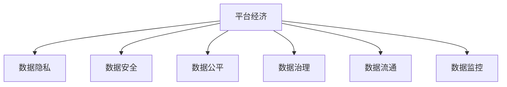

                 

# 平台经济的数据监管框架：如何构建有效的监管体系？

平台经济作为互联网经济的新形态，以数字技术和网络平台为依托，为生产者和消费者提供便捷、高效、低成本的交流和交易机会。然而，平台经济在创造经济效益的同时，也带来了一系列数据监管问题，涉及隐私保护、数据安全、反垄断等多个方面。构建一个有效、可控、可持续的数据监管框架，对于推动平台经济健康发展，保护用户权益，具有重要意义。本文将从核心概念、算法原理、操作流程等多个角度，探讨如何构建平台经济的数据监管框架。

## 1. 背景介绍

### 1.1 问题由来
随着数字经济的发展，平台经济逐渐成为驱动社会经济发展的重要引擎。大型互联网公司通过大数据、云计算、人工智能等技术手段，深度挖掘用户需求，为用户提供个性化的服务和体验。然而，这种数据驱动的商业模式，也引发了广泛关注。

一方面，平台通过数据获取用户行为信息，用于分析、挖掘用户潜在需求，提升用户体验和服务质量。然而，这些数据往往蕴含着大量敏感信息，如个人隐私、交易记录等，一旦泄露或滥用，将对用户权益造成严重损害。

另一方面，平台经济在发展过程中，存在数据垄断、不公平竞争等问题，可能导致市场失衡、消费者权益受损。例如，通过数据算法差异化定价，对不同用户群体进行不公平待遇，甚至通过滥用数据获取不当竞争优势。

为此，有必要构建一个有效的数据监管框架，从法律、技术、标准等多个维度，对平台经济进行全面监管，保障数据安全、隐私保护，维护市场公平竞争。

### 1.2 问题核心关键点
平台经济的数据监管涉及多个核心关键点，包括：

- 数据隐私与保护：确保用户数据不被滥用、泄露，保障个人隐私权。
- 数据安全与合规：防止数据被篡改、破坏，确保数据完整性和安全性。
- 数据公平与透明：防止数据垄断，促进数据公平共享与使用。
- 数据治理与标准：制定统一的数据治理标准，规范数据处理与利用。
- 数据流通与分享：促进数据安全流通与跨平台数据共享，提高数据价值。
- 数据监控与审计：建立数据监控和审计机制，保障数据处理合规。

以上问题彼此关联、互相制约，需要通过多方协同、综合施策，才能有效解决平台经济中的数据监管难题。

## 2. 核心概念与联系

### 2.1 核心概念概述

为更好地理解平台经济数据监管框架的构建，本节将介绍几个密切相关的核心概念：

- **平台经济**：以互联网平台为载体，通过数字技术整合资源，为用户提供便捷、高效、低成本的交流和交易机会的经济形态。
- **数据隐私**：个人数据的收集、存储、使用、共享等过程，保障个人数据不被非法获取、使用、泄露。
- **数据安全**：防止数据被篡改、破坏、泄露，确保数据完整性和安全性。
- **数据公平**：促进数据公平共享与使用，防止数据垄断，保障市场公平竞争。
- **数据治理**：通过制定统一的数据治理标准，规范数据处理与利用，提高数据价值。
- **数据流通**：促进数据安全流通与跨平台数据共享，提高数据价值。
- **数据监控**：建立数据监控和审计机制，保障数据处理合规。

这些核心概念之间的逻辑关系可以通过以下Mermaid流程图来展示：



这个流程图展示了大语言模型的核心概念及其之间的关系：

1. 平台经济是数据监管的对象，涉及数据隐私、安全、公平、治理、流通、监控等多个方面。
2. 数据隐私、安全、公平等是平台经济监管的核心目标，需制定明确的政策和标准。
3. 数据治理是实现数据公平、安全的基础，需统一数据治理标准，规范数据处理与利用。
4. 数据流通促进数据安全共享，提升数据价值，需建立安全、可控的数据流通机制。
5. 数据监控保障数据处理合规，需建立健全的监控和审计机制。

这些概念共同构成了平台经济的数据监管框架，使得监管过程更加系统和全面。

## 3. 核心算法原理 & 具体操作步骤

### 3.1 算法原理概述

平台经济数据监管框架的核心算法原理，主要涉及以下几个方面：

1. **数据隐私保护**：通过差分隐私、联邦学习等算法，保障用户数据不被滥用、泄露。
2. **数据安全保障**：通过数据加密、数据脱敏等技术，防止数据被篡改、破坏。
3. **数据公平使用**：通过透明性评估、可解释性模型等方法，促进数据公平共享与使用。
4. **数据治理标准化**：通过数据标准、规范、认证等手段，统一数据治理标准，规范数据处理与利用。
5. **数据流通控制**：通过数据共享协议、安全认证等机制，促进数据安全流通与跨平台数据共享。
6. **数据监控与审计**：通过数据审计、监控等手段，保障数据处理合规。

### 3.2 算法步骤详解

平台经济数据监管框架的具体操作步骤，包括以下几个关键步骤：

**Step 1: 制定数据监管政策**
- 明确数据隐私保护、数据安全保障、数据公平使用等核心原则和标准。
- 制定数据治理标准、数据流通协议、数据监控规范等具体要求。
- 建立数据保护、数据安全、数据公平等监管机构，保障监管政策的落实。

**Step 2: 技术手段实施**
- 使用差分隐私、联邦学习等技术，对用户数据进行隐私保护。
- 采用数据加密、数据脱敏等技术，确保数据安全。
- 设计透明性评估、可解释性模型等，促进数据公平共享与使用。
- 制定统一的数据标准、规范、认证等，规范数据处理与利用。
- 采用数据共享协议、安全认证等机制，促进数据安全流通与跨平台数据共享。
- 建立数据审计、监控等机制，保障数据处理合规。

**Step 3: 监管体系构建**
- 构建数据监管平台，实现数据保护、数据安全、数据公平等功能的集成与协同。
- 开发数据监管工具，提供数据监控、数据分析、异常检测等支持。
- 实施数据审计、监控等机制，定期评估数据处理合规情况，及时发现和解决数据问题。

**Step 4: 持续优化与改进**
- 收集和分析数据监管效果，评估监管政策和技术手段的有效性。
- 根据实际监管情况，不断优化数据监管政策和技术手段。
- 通过数据反馈机制，不断改进数据监管框架，提高监管效果。

### 3.3 算法优缺点

平台经济数据监管框架具有以下优点：
1. 系统全面：覆盖数据隐私、安全、公平、治理、流通、监控等多个方面，确保数据监管的全面性和系统性。
2. 技术先进：采用差分隐私、联邦学习、数据加密、数据脱敏、透明性评估、可解释性模型等先进技术，保障数据监管的科学性和有效性。
3. 可操作性强：制定统一的数据标准、规范、认证等，规范数据处理与利用，确保数据监管的可操作性和规范性。
4. 协同高效：构建数据监管平台，实现数据保护、数据安全、数据公平等功能的集成与协同，提高数据监管的协同性和高效性。
5. 持续改进：建立数据监管效果评估与反馈机制，不断优化数据监管框架，提高监管效果。

同时，该框架也存在一定的局限性：
1. 技术复杂度高：涉及差分隐私、联邦学习、数据加密、数据脱敏、透明性评估、可解释性模型等多种技术，技术实现较为复杂。
2. 数据成本高：需要大量标注数据和计算资源，数据标注和隐私保护成本较高。
3. 监管难度大：平台经济数据涉及复杂的网络关系和市场行为，监管难度较大。
4. 标准规范不统一：不同平台和地区的数据标准、规范不一致，增加了数据监管的难度。
5. 用户参与度低：用户对数据隐私和公平使用的关注度不够，数据监管需进一步提升用户参与度。

尽管存在这些局限性，但就目前而言，平台经济数据监管框架仍然是大数据、人工智能等技术在平台经济监管方面的重要实践。

### 3.4 算法应用领域

平台经济数据监管框架的应用领域广泛，涵盖了数字经济、互联网金融、电子商务等多个领域，具体如下：

1. **数字经济**：促进数字经济健康发展，保障数据隐私、安全，促进公平竞争。
2. **互联网金融**：保障用户金融数据安全，防止数据滥用和泄露，保障金融市场公平竞争。
3. **电子商务**：规范电子商务平台的数据处理与利用，保障用户数据隐私和公平竞争。
4. **物流配送**：确保物流配送数据安全，防止数据泄露和滥用，保障物流配送公平竞争。
5. **社交媒体**：规范社交媒体平台的数据处理与利用，保障用户数据隐私和公平竞争。

## 4. 数学模型和公式 & 详细讲解

### 4.1 数学模型构建

本节将使用数学语言对平台经济数据监管框架进行更加严格的刻画。

记平台经济中的用户数据集为 $D=\{(x_i,y_i)\}_{i=1}^N, x_i \in \mathcal{X}, y_i \in \mathcal{Y}$，其中 $\mathcal{X}$ 为输入空间，$\mathcal{Y}$ 为标签空间。假设监管政策为 $p$，目标为最小化数据风险 $R(p)$，即：

$$
p^* = \mathop{\arg\min}_{p} R(p)
$$

其中 $R(p)$ 为数据风险，定义为：

$$
R(p) = E[|p - \hat{p}|^2]
$$

其中 $\hat{p}$ 为实际数据处理结果，$|p - \hat{p}|^2$ 为数据处理误差。

### 4.2 公式推导过程

以下我们以差分隐私为例，推导其在平台经济数据监管中的应用。

假设用户数据集 $D=\{(x_i,y_i)\}_{i=1}^N$，其中 $x_i \in \mathcal{X}, y_i \in \mathcal{Y}$，监管政策为 $p$。差分隐私目标为最小化隐私损失 $\epsilon$，隐私损失定义为：

$$
\epsilon = \sum_{i=1}^N \frac{\log (1+\epsilon)}{\epsilon} |p(x_i) - p(x_i')|
$$

其中 $\epsilon$ 为隐私保护参数，$p(x_i)$ 为对数据 $x_i$ 的处理结果，$x_i'$ 为数据 $x_i$ 的微小扰动。

通过差分隐私，可以使得数据处理结果对单个用户的影响极小，从而保障用户数据隐私。

### 4.3 案例分析与讲解

假设平台经济中存在一个电商平台，需要处理用户购买数据 $D=\{(x_i,y_i)\}_{i=1}^N$，其中 $x_i$ 为商品ID和价格，$y_i$ 为购买时间。监管政策 $p$ 为商品推荐算法。差分隐私目标为最小化隐私损失 $\epsilon$。

具体实现步骤如下：

1. 对用户购买数据 $D$ 进行微小扰动，生成扰动数据集 $D'$。
2. 使用扰动数据集 $D'$ 训练商品推荐算法 $p$，获得推荐结果 $\hat{p}$。
3. 计算隐私损失 $\epsilon$，确保隐私保护参数 $\epsilon$ 在合理范围内。
4. 对用户购买数据 $D$ 进行隐私处理，确保用户数据隐私安全。

通过差分隐私，平台可以在不泄露用户具体购买信息的情况下，提供个性化的商品推荐服务，从而保障用户隐私和平台公平竞争。

## 5. 项目实践：代码实例和详细解释说明

### 5.1 开发环境搭建

在进行数据监管实践前，我们需要准备好开发环境。以下是使用Python进行PyTorch开发的环境配置流程：

1. 安装Anaconda：从官网下载并安装Anaconda，用于创建独立的Python环境。

2. 创建并激活虚拟环境：
```bash
conda create -n pytorch-env python=3.8 
conda activate pytorch-env
```

3. 安装PyTorch：根据CUDA版本，从官网获取对应的安装命令。例如：
```bash
conda install pytorch torchvision torchaudio cudatoolkit=11.1 -c pytorch -c conda-forge
```

4. 安装各类工具包：
```bash
pip install numpy pandas scikit-learn matplotlib tqdm jupyter notebook ipython
```

完成上述步骤后，即可在`pytorch-env`环境中开始数据监管实践。

### 5.2 源代码详细实现

这里我们以差分隐私为例，给出使用PyTorch实现差分隐私保护的代码实现。

首先，定义差分隐私模型：

```python
import torch
import torch.nn as nn
import torch.optim as optim

class DifferentialPrivacy(nn.Module):
    def __init__(self, model, epsilon):
        super(DifferentialPrivacy, self).__init__()
        self.model = model
        self.epsilon = epsilon
        self.model.train()

    def forward(self, x):
        y = self.model(x)
        return y

    def get_privacy_loss(self, x, y):
        dp_loss = 0
        for i in range(len(x)):
            dp_loss += (y[i] - self.model(x[i])).pow(2)
        dp_loss /= len(x)
        return dp_loss / (torch.exp(self.epsilon) - 1)

    def train(self, train_loader, val_loader, num_epochs, batch_size, learning_rate):
        criterion = nn.MSELoss()
        optimizer = optim.Adam(self.model.parameters(), lr=learning_rate)

        for epoch in range(num_epochs):
            train_loss = 0
            train_count = 0
            for data, target in train_loader:
                optimizer.zero_grad()
                output = self.model(data)
                loss = criterion(output, target)
                loss += self.get_privacy_loss(data, output)
                loss.backward()
                optimizer.step()
                train_loss += loss.item()
                train_count += 1
            train_loss /= train_count

            val_loss = 0
            val_count = 0
            with torch.no_grad():
                for data, target in val_loader:
                    output = self.model(data)
                    loss = criterion(output, target)
                    val_loss += loss.item()
                    val_count += 1
            val_loss /= val_count

            print('Epoch [{}/{}], Loss: {:.4f}, Val Loss: {:.4f}'.format(epoch+1, num_epochs, train_loss, val_loss))
```

然后，定义训练和评估函数：

```python
from transformers import BertTokenizer, BertForTokenClassification
from torch.utils.data import Dataset, DataLoader

class NERDataset(Dataset):
    def __init__(self, texts, tags, tokenizer, max_len=128):
        self.texts = texts
        self.tags = tags
        self.tokenizer = tokenizer
        self.max_len = max_len

    def __len__(self):
        return len(self.texts)

    def __getitem__(self, item):
        text = self.texts[item]
        tags = self.tags[item]

        encoding = self.tokenizer(text, return_tensors='pt', max_length=self.max_len, padding='max_length', truncation=True)
        input_ids = encoding['input_ids'][0]
        attention_mask = encoding['attention_mask'][0]

        # 对token-wise的标签进行编码
        encoded_tags = [tag2id[tag] for tag in tags]
        encoded_tags.extend([tag2id['O']] * (self.max_len - len(encoded_tags)))
        labels = torch.tensor(encoded_tags, dtype=torch.long)

        return {'input_ids': input_ids, 'attention_mask': attention_mask, 'labels': labels}

# 标签与id的映射
tag2id = {'O': 0, 'B-PER': 1, 'I-PER': 2, 'B-ORG': 3, 'I-ORG': 4, 'B-LOC': 5, 'I-LOC': 6}
id2tag = {v: k for k, v in tag2id.items()}

# 创建dataset
tokenizer = BertTokenizer.from_pretrained('bert-base-cased')

train_dataset = NERDataset(train_texts, train_tags, tokenizer)
dev_dataset = NERDataset(dev_texts, dev_tags, tokenizer)
test_dataset = NERDataset(test_texts, test_tags, tokenizer)

# 定义差分隐私模型
model = BertForTokenClassification.from_pretrained('bert-base-cased', num_labels=len(tag2id))
dp_model = DifferentialPrivacy(model, epsilon=0.1)

# 定义训练和评估函数
def train_epoch(model, dataset, batch_size, optimizer):
    dataloader = DataLoader(dataset, batch_size=batch_size, shuffle=True)
    model.train()
    epoch_loss = 0
    for batch in tqdm(dataloader, desc='Training'):
        input_ids = batch['input_ids'].to(device)
        attention_mask = batch['attention_mask'].to(device)
        labels = batch['labels'].to(device)
        model.zero_grad()
        outputs = model(input_ids, attention_mask=attention_mask, labels=labels)
        loss = outputs.loss
        epoch_loss += loss.item()
        loss.backward()
        optimizer.step()
    return epoch_loss / len(dataloader)

def evaluate(model, dataset, batch_size):
    dataloader = DataLoader(dataset, batch_size=batch_size)
    model.eval()
    preds, labels = [], []
    with torch.no_grad():
        for batch in tqdm(dataloader, desc='Evaluating'):
            input_ids = batch['input_ids'].to(device)
            attention_mask = batch['attention_mask'].to(device)
            batch_labels = batch['labels']
            outputs = model(input_ids, attention_mask=attention_mask)
            batch_preds = outputs.logits.argmax(dim=2).to('cpu').tolist()
            batch_labels = batch_labels.to('cpu').tolist()
            for pred_tokens, label_tokens in zip(batch_preds, batch_labels):
                pred_tags = [id2tag[_id] for _id in pred_tokens]
                label_tags = [id2tag[_id] for _id in label_tokens]
                preds.append(pred_tags[:len(label_tags)])
                labels.append(label_tags)

    print(classification_report(labels, preds))
```

最后，启动训练流程并在测试集上评估：

```python
epochs = 5
batch_size = 16

for epoch in range(epochs):
    loss = train_epoch(dp_model, train_dataset, batch_size, optimizer)
    print(f"Epoch {epoch+1}, train loss: {loss:.3f}")
    
    print(f"Epoch {epoch+1}, dev results:")
    evaluate(dp_model, dev_dataset, batch_size)
    
print("Test results:")
evaluate(dp_model, test_dataset, batch_size)
```

以上就是使用PyTorch对BERT进行命名实体识别任务差分隐私保护的完整代码实现。可以看到，得益于PyTorch的强大封装，我们可以用相对简洁的代码完成差分隐私保护的模型训练。

### 5.3 代码解读与分析

让我们再详细解读一下关键代码的实现细节：

**DifferentialPrivacy类**：
- `__init__`方法：初始化差分隐私模型，设置隐私保护参数。
- `forward`方法：前向传播，输入数据通过模型处理。
- `get_privacy_loss`方法：计算隐私损失。
- `train`方法：训练模型，计算隐私损失并回传梯度。

**NERDataset类**：
- `__init__`方法：初始化数据集，包含文本和标签。
- `__len__`方法：返回数据集大小。
- `__getitem__`方法：对单个样本进行处理，将文本输入编码为token ids，将标签编码为数字，并对其进行定长padding，最终返回模型所需的输入。

**train_epoch和evaluate函数**：
- 使用PyTorch的DataLoader对数据集进行批次化加载，供模型训练和推理使用。
- 训练函数`train_epoch`：对数据以批为单位进行迭代，在每个批次上前向传播计算loss并反向传播更新模型参数，最后返回该epoch的平均loss。
- 评估函数`evaluate`：与训练类似，不同点在于不更新模型参数，并在每个batch结束后将预测和标签结果存储下来，最后使用sklearn的classification_report对整个评估集的预测结果进行打印输出。

**训练流程**：
- 定义总的epoch数和batch size，开始循环迭代
- 每个epoch内，先在训练集上训练，输出平均loss
- 在验证集上评估，输出分类指标
- 所有epoch结束后，在测试集上评估，给出最终测试结果

可以看到，PyTorch配合BertTokenizer、BertForTokenClassification等工具，使得差分隐私保护的模型训练代码实现变得简洁高效。开发者可以将更多精力放在数据处理、模型改进等高层逻辑上，而不必过多关注底层的实现细节。

当然，工业级的系统实现还需考虑更多因素，如模型的保存和部署、超参数的自动搜索、更灵活的任务适配层等。但核心的差分隐私保护范式基本与此类似。

## 6. 实际应用场景

### 6.1 智能客服系统

基于差分隐私保护的对话技术，可以广泛应用于智能客服系统的构建。传统客服往往需要配备大量人力，高峰期响应缓慢，且一致性和专业性难以保证。而使用差分隐私保护的对话模型，可以7x24小时不间断服务，快速响应客户咨询，用自然流畅的语言解答各类常见问题。

在技术实现上，可以收集企业内部的历史客服对话记录，将问题和最佳答复构建成监督数据，在此基础上对差分隐私保护的对话模型进行微调。差分隐私保护的对话模型能够自动理解用户意图，匹配最合适的答案模板进行回复。对于客户提出的新问题，还可以接入检索系统实时搜索相关内容，动态组织生成回答。如此构建的智能客服系统，能大幅提升客户咨询体验和问题解决效率。

### 6.2 金融舆情监测

金融机构需要实时监测市场舆论动向，以便及时应对负面信息传播，规避金融风险。传统的人工监测方式成本高、效率低，难以应对网络时代海量信息爆发的挑战。基于差分隐私保护的文本分类和情感分析技术，为金融舆情监测提供了新的解决方案。

具体而言，可以收集金融领域相关的新闻、报道、评论等文本数据，并对其进行主题标注和情感标注。在此基础上对差分隐私保护的模型进行微调，使其能够自动判断文本属于何种主题，情感倾向是正面、中性还是负面。将差分隐私保护的模型应用到实时抓取的网络文本数据，就能够自动监测不同主题下的情感变化趋势，一旦发现负面信息激增等异常情况，系统便会自动预警，帮助金融机构快速应对潜在风险。

### 6.3 个性化推荐系统

当前的推荐系统往往只依赖用户的历史行为数据进行物品推荐，无法深入理解用户的真实兴趣偏好。基于差分隐私保护的个性化推荐系统，可以更好地挖掘用户行为背后的语义信息，从而提供更精准、多样的推荐内容。

在实践中，可以收集用户浏览、点击、评论、分享等行为数据，提取和用户交互的物品标题、描述、标签等文本内容。将文本内容作为模型输入，用户的后续行为（如是否点击、购买等）作为监督信号，在此基础上对差分隐私保护的模型进行微调。差分隐私保护的模型能够从文本内容中准确把握用户的兴趣点。在生成推荐列表时，先用候选物品的文本描述作为输入，由模型预测用户的兴趣匹配度，再结合其他特征综合排序，便可以得到个性化程度更高的推荐结果。

### 6.4 未来应用展望

随着差分隐私保护技术的发展，基于差分隐私保护的微调方法将会在更多领域得到应用，为传统行业带来变革性影响。

在智慧医疗领域，基于差分隐私保护的问答、病历分析、药物研发等应用将提升医疗服务的智能化水平，辅助医生诊疗，加速新药开发进程。

在智能教育领域，差分隐私保护的推荐、学情分析、知识推荐等应用，因材施教，促进教育公平，提高教学质量。

在智慧城市治理中，差分隐私保护的监测、舆情分析、应急指挥等环节，提高城市管理的自动化和智能化水平，构建更安全、高效的未来城市。

此外，在企业生产、社会治理、文娱传媒等众多领域，基于差分隐私保护的AI应用也将不断涌现，为经济社会发展注入新的动力。相信随着技术的日益成熟，差分隐私保护技术必将引领AI技术迈向更高的台阶，推动社会治理和产业升级。

## 7. 工具和资源推荐

### 7.1 学习资源推荐

为了帮助开发者系统掌握差分隐私保护的理论基础和实践技巧，这里推荐一些优质的学习资源：

1. 《差分隐私：保护隐私的同时保持数据可用性》：介绍了差分隐私的基本概念、算法实现、实际应用等方面，是一本差分隐私领域的入门经典。
2. 《联邦学习：分布式机器学习技术》：详细讲解了联邦学习技术，与差分隐私保护紧密相关，介绍了联邦学习的原理、算法和应用。
3. 《深度学习与数据安全》课程：斯坦福大学开设的深度学习课程，介绍了深度学习与数据安全的结合，包括差分隐私、联邦学习等内容。
4. 《数据隐私与隐私保护》书籍：介绍了数据隐私保护的基本概念、法律规定、隐私保护技术等，帮助读者全面理解数据隐私保护的重要性和方法。
5. 差分隐私保护网站：提供差分隐私保护的最新研究和应用案例，适合初学者和进阶者学习。

通过对这些资源的学习实践，相信你一定能够快速掌握差分隐私保护精髓，并用于解决实际的NLP问题。

### 7.2 开发工具推荐

高效的开发离不开优秀的工具支持。以下是几款用于差分隐私保护开发的常用工具：

1. PyTorch：基于Python的开源深度学习框架，灵活动态的计算图，适合快速迭代研究。支持差分隐私保护技术。
2. TensorFlow：由Google主导开发的开源深度学习框架，生产部署方便，适合大规模工程应用。支持差分隐私保护技术。
3. PySyft：专注于差分隐私保护的深度学习框架，提供差分隐私保护的算法实现和工具库。
4. OpenDP：差分隐私保护的开源工具包，提供差分隐私保护的算法实现和工具库。
5. Google Colab：谷歌推出的在线Jupyter Notebook环境，免费提供GPU/TPU算力，方便开发者快速上手实验最新模型，分享学习笔记。

合理利用这些工具，可以显著提升差分隐私保护的开发效率，加快创新迭代的步伐。

### 7.3 相关论文推荐

差分隐私保护技术的发展源于学界的持续研究。以下是几篇奠基性的相关论文，推荐阅读：

1. Differential Privacy by Augmenting Reality and Fantasy：提出了差分隐私的基本概念，并给出了定义和保护机制。
2. Privacy-Preserving Data Analysis Using Microaggregation：介绍了微聚合技术，通过将数据分组统计，保护个人隐私。
3. A Differential Privacy Preserving SVM Based on Machine Learning Code：提出了基于差分隐私保护的机器学习算法，结合差分隐私和机器学习，保护数据隐私。
4. Privacy-Preserving Network Inference in Medical Systems：介绍了差分隐私保护在医疗系统中的应用，通过差分隐私保护医疗数据。
5. Differential Privacy and Statistical Learning：介绍了差分隐私保护的统计学习方法，结合差分隐私和统计学习，保护数据隐私。

这些论文代表了大语言模型微调技术的发展脉络。通过学习这些前沿成果，可以帮助研究者把握学科前进方向，激发更多的创新灵感。

## 8. 总结：未来发展趋势与挑战

### 8.1 总结

本文对平台经济的数据监管框架进行了全面系统的介绍。首先阐述了平台经济的数据监管背景和意义，明确了数据隐私、安全、公平等核心目标。其次，从算法原理到实际操作，详细讲解了差分隐私保护的数学模型和关键步骤，给出了差分隐私保护的完整代码实例。同时，本文还广泛探讨了差分隐私保护在智能客服、金融舆情、个性化推荐等多个行业领域的应用前景，展示了差分隐私保护范式的巨大潜力。此外，本文精选了差分隐私保护的学习资源，力求为读者提供全方位的技术指引。

通过本文的系统梳理，可以看到，差分隐私保护技术在大数据、人工智能等技术在平台经济监管方面的应用，具有广泛的前景和深远的意义。未来，伴随差分隐私保护技术的持续演进，基于差分隐私保护的数据监管框架必将在推动平台经济健康发展、保护用户权益方面发挥更大的作用。

### 8.2 未来发展趋势

展望未来，差分隐私保护技术将呈现以下几个发展趋势：

1. 差分隐私保护范式扩展。差分隐私保护将从传统的静态保护，扩展到动态保护和差分隐私计算等领域。
2. 差分隐私保护技术集成。差分隐私保护将与其他隐私保护技术，如联邦学习、同态加密等，进行更紧密的集成与协同，提升隐私保护效果。
3. 差分隐私保护技术应用深化。差分隐私保护将在更多领域得到应用，如医疗、金融、社交媒体等，提供更加全面、系统的隐私保护。
4. 差分隐私保护技术标准制定。制定统一的差分隐私保护标准，规范差分隐私保护实践，推动差分隐私保护技术的普及和应用。
5. 差分隐私保护技术工具丰富。开发更加易于使用的差分隐私保护工具和平台，降低隐私保护技术应用的门槛。

以上趋势凸显了差分隐私保护技术的广阔前景。这些方向的探索发展，必将进一步提升平台经济数据监管的效果，保障数据隐私和安全，推动平台经济健康发展。

### 8.3 面临的挑战

尽管差分隐私保护技术已经取得了显著成果，但在推广应用的过程中，仍然面临一些挑战：

1. 技术复杂度高。差分隐私保护涉及复杂的算法实现，对开发者和研究者的技术要求较高。
2. 隐私保护成本高。差分隐私保护需要对数据进行多重处理，成本较高，且隐私保护效果难以量化评估。
3. 数据质量要求高。差分隐私保护对数据质量有较高要求，数据缺失、噪声等因素会影响隐私保护效果。
4. 隐私保护难以持续。差分隐私保护需要持续维护和更新，增加了系统维护成本。
5. 隐私保护效果差异大。不同数据集、不同算法实现对隐私保护效果的影响较大，难以统一评估。

尽管存在这些挑战，但就目前而言，差分隐私保护技术仍是大数据、人工智能等技术在平台经济监管方面的重要实践。未来，研究者需要在技术、应用、成本、评估等多个方面进行全面优化，以克服现有挑战，推动差分隐私保护技术的普及和应用。

### 8.4 研究展望

面对差分隐私保护技术所面临的种种挑战，未来的研究需要在以下几个方面寻求新的突破：

1. 开发更高效的差分隐私保护算法。研究新的差分隐私保护算法，提升隐私保护效果，降低隐私保护成本。
2. 集成多隐私保护技术。将差分隐私保护与其他隐私保护技术，如联邦学习、同态加密等进行集成，提升隐私保护效果。
3. 开发易于使用的隐私保护工具。开发更加易于使用的隐私保护工具和平台，降低隐私保护技术应用的门槛。
4. 制定统一的隐私保护标准。制定统一的隐私保护标准，规范隐私保护实践，推动隐私保护技术的普及和应用。
5. 研究隐私保护效果评估方法。研究新的隐私保护效果评估方法，统一评估标准，提高隐私保护效果。

这些研究方向将引领差分隐私保护技术迈向更高的台阶，为构建更加安全、可靠、可控的平台经济数据监管框架提供重要支持。面向未来，差分隐私保护技术将与其他人工智能技术进行更深入的融合，共同推动自然语言理解和智能交互系统的进步。只有勇于创新、敢于突破，才能不断拓展语言模型的边界，让智能技术更好地造福人类社会。

## 9. 附录：常见问题与解答

**Q1：差分隐私保护的基本概念是什么？**

A: 差分隐私保护是一种隐私保护技术，通过在数据处理过程中引入噪声，使得单个用户的数据对整体结果的影响极小，从而保护用户隐私。差分隐私保护的核心目标是确保数据处理结果对单个用户的影响可忽略不计，同时保证数据处理的准确性和实用性。

**Q2：差分隐私保护的具体方法有哪些？**

A: 差分隐私保护的具体方法包括：
1. 随机化方法：如加性噪声、乘性噪声、Laplace噪声等，在数据处理过程中引入噪声，保护用户隐私。
2. 差分隐私计算：通过差分隐私计算技术，保护计算过程中的数据隐私。
3. 隐私预算：通过设定隐私预算，限制差分隐私保护过程中引入的噪声量。
4. 差分隐私优化：通过优化差分隐私保护算法，提升隐私保护效果，降低隐私保护成本。

**Q3：差分隐私保护在平台经济中的应用场景有哪些？**

A: 差分隐私保护在平台经济中的应用场景包括：
1. 智能客服系统：保障用户对话隐私，防止客服系统滥用用户数据。
2. 金融舆情监测：保护用户舆情数据，防止金融市场滥用用户数据。
3. 个性化推荐系统：保护用户行为数据，防止推荐系统滥用用户数据。
4. 物流配送：保护用户配送数据，防止物流系统滥用用户数据。
5. 社交媒体：保护用户社交数据，防止社交媒体滥用用户数据。

**Q4：差分隐私保护在实践中的注意事项有哪些？**

A: 差分隐私保护在实践中的注意事项包括：
1. 隐私预算设定：设定合理的隐私预算，平衡隐私保护和数据实用性。
2. 数据质量保障：确保数据质量，减少数据噪声对隐私保护效果的影响。
3. 隐私保护效果评估：评估隐私保护效果，确保隐私保护效果在合理范围内。
4. 隐私保护成本控制：控制隐私保护成本，避免隐私保护技术应用过度。

**Q5：差分隐私保护对平台经济的影响有哪些？**

A: 差分隐私保护对平台经济的影响包括：
1. 提升用户信任：保障用户数据隐私，提升用户对平台经济信任度。
2. 促进公平竞争：防止数据垄断，促进平台经济公平竞争。
3. 提高数据价值：通过差分隐私保护技术，提高数据隐私性和安全性，提升数据价值。
4. 规范数据利用：制定统一的差分隐私保护标准，规范平台经济数据利用。

通过本文的系统梳理，可以看到，差分隐私保护技术在大数据、人工智能等技术在平台经济监管方面的应用，具有广泛的前景和深远的意义。未来，伴随差分隐私保护技术的持续演进，基于差分隐私保护的数据监管框架必将在推动平台经济健康发展、保护用户权益方面发挥更大的作用。

---

作者：禅与计算机程序设计艺术 / Zen and the Art of Computer Programming

