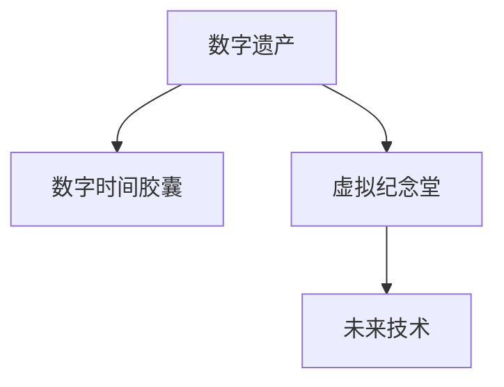

                 

# 2050年的数字遗产：从数字时间胶囊到虚拟纪念堂的数字遗产传承

## 1. 背景介绍

在信息技术飞速发展的今天，数字遗产成为了我们这个时代重要的组成部分。随着数字化进程的不断深入，我们的生活、工作和记忆都越来越多地被数字化记录和存储。然而，随着技术的不断演进，这些数字遗产在未来的可访问性、可理解性和可保护性上面临着巨大的挑战。为了应对这些挑战，我们需要重新思考数字遗产的定义、保护和传承方式。

本文将探讨数字遗产的未来发展趋势，特别是数字时间胶囊和虚拟纪念堂在2050年的可能应用和意义。我们将从数字遗产的概念、数字时间胶囊的构建方法、虚拟纪念堂的技术实现、以及未来应用展望等多个角度，深入分析数字遗产传承的新路径。

## 2. 核心概念与联系

### 2.1 核心概念概述

在探讨数字遗产的未来趋势时，我们需要明确几个关键概念：

- **数字遗产**：是指通过数字化手段记录、存储和传承的个人、集体和文化的记忆和历史。包括但不限于照片、视频、音频、文本、网页、代码等。
- **数字时间胶囊**：是指将某一时期的数字化内容封装成一个或多个容器，以未来技术为打开方式的特殊存储形式。
- **虚拟纪念堂**：是指通过虚拟现实(VR)、增强现实(AR)等技术，模拟真实纪念堂的环境，让后人能够以虚拟形式参观、学习和体验数字化遗产。

这些概念之间的关系可以用以下的Mermaid流程图来表示：



这个流程图展示了数字遗产通过封装和模拟技术，实现未来传承的路径。通过数字时间胶囊，我们可以将特定时期的数字化记忆永久保存，而通过虚拟纪念堂，我们可以让后人以虚拟的形式，体验和学习这些记忆。

## 3. 核心算法原理 & 具体操作步骤

### 3.1 算法原理概述

数字时间胶囊的构建和虚拟纪念堂的实现，都依赖于先进的数据存储和检索技术、多媒体内容编码和渲染技术，以及虚拟现实和增强现实技术。

- **数据存储和检索技术**：数字时间胶囊需要将特定时期的数字化内容进行编码和存储，确保未来能够被准确打开和读取。这涉及到数据压缩、加密、存储格式等技术。
- **多媒体内容编码和渲染技术**：虚拟纪念堂需要对多媒体内容进行编码和渲染，以高质量的形式展示给后人。这包括视频、音频、图像等多媒体内容的编码压缩和渲染技术。
- **虚拟现实和增强现实技术**：虚拟纪念堂通过虚拟现实和增强现实技术，实现对数字化遗产的虚拟体验。这需要VR/AR平台和硬件设备的支持。

### 3.2 算法步骤详解

构建数字时间胶囊和虚拟纪念堂的主要步骤包括：

**Step 1: 数据收集和编码**

- 收集特定时期的数字化内容，如照片、视频、音频、文本、网页、代码等。
- 对多媒体内容进行编码压缩，以减小存储和传输的体积。

**Step 2: 数据存储和加密**

- 选择合适的存储格式和设备，将编码后的内容进行存储。
- 对存储内容进行加密，确保其安全性。

**Step 3: 数字时间胶囊设计**

- 设计胶囊的外形和打开方式，通常包含日期、内容描述和未来打开方式等元素。
- 确定胶囊的材质和封装方法，以确保其耐久性和未来可打开性。

**Step 4: 虚拟纪念堂搭建**

- 选择VR/AR平台，搭建虚拟纪念堂的环境。
- 将胶囊内容导入虚拟纪念堂，设计展示路径和交互方式。

**Step 5: 测试和发布**

- 对虚拟纪念堂进行测试，确保其稳定性和用户体验。
- 发布虚拟纪念堂，供后人参观和学习。

### 3.3 算法优缺点

数字时间胶囊和虚拟纪念堂的构建和实现，具有以下优点：

- **永久保存**：数字时间胶囊将特定时期的数字化内容永久保存，不会因时间流逝而损坏。
- **跨代传承**：虚拟纪念堂让后人以虚拟形式体验数字化遗产，跨越时空进行传承。
- **互动体验**：虚拟纪念堂通过交互式体验，让后人更加深入地了解和体验数字化遗产。

但同时也存在一些缺点：

- **技术依赖**：数字时间胶囊和虚拟纪念堂的实现，依赖于先进的技术和设备，可能会存在技术失效的风险。
- **隐私保护**：数字化内容可能包含隐私信息，加密存储和展示需要考虑隐私保护问题。
- **维护成本**：虚拟纪念堂的搭建和维护需要持续的资源投入，存在成本高昂的问题。

### 3.4 算法应用领域

数字时间胶囊和虚拟纪念堂的应用领域非常广泛，包括但不限于：

- **历史文化遗产**：将历史时期的文献、图片、视频等数字化内容封装成胶囊，通过虚拟纪念堂让后人体验和学习。
- **个人回忆录**：将个人的数字化记忆封装成胶囊，未来由后人打开。
- **企业档案**：将企业的数字化历史和档案封装成胶囊，未来由员工和继承者参观。
- **自然遗产**：将特定时期的自然环境数据封装成胶囊，未来让后人了解和体验。

## 4. 数学模型和公式 & 详细讲解 & 举例说明

### 4.1 数学模型构建

构建数字时间胶囊和虚拟纪念堂的数学模型，主要涉及以下几个方面：

- **数据编码和压缩模型**：选择适当的压缩算法，如Huffman编码、LZ77、LZ78、LZW等，对多媒体内容进行编码和压缩。
- **数据存储和检索模型**：选择合适的存储格式，如JPEG、PNG、AVI、MP3等，确保数据能够被准确读取。
- **虚拟现实和增强现实模型**：选择适合的VR/AR平台，设计虚拟场景和交互方式。

### 4.2 公式推导过程

以下是多媒体内容编码和压缩的公式推导过程：

假设有一段长度为 $N$ 的二进制数据流 $D = (d_1, d_2, ..., d_N)$，其中 $d_i \in \{0, 1\}$。选择Huffman编码算法，其编码过程如下：

1. 计算每个字符出现的频率 $f_i = \frac{n_i}{N}$，其中 $n_i$ 表示字符 $i$ 出现的次数。
2. 根据频率构建Huffman树，每个叶节点代表一个字符及其频率。
3. 对每个字符 $d_i$，从根节点开始，向左或向右遍历Huffman树，直到到达叶子节点，记录路径上的编码符号 $C_i$。
4. 将每个字符 $d_i$ 替换为其对应的编码 $C_i$，得到压缩后的数据流 $D'$。

Huffman编码的效率取决于字符的频率分布，频率较高的字符被赋予较短的编码，频率较低的字符被赋予较长的编码。通过优化编码过程，Huffman编码可以实现高效的压缩和解压。

### 4.3 案例分析与讲解

以一段长度为 $N$ 的文本为例，假设其频率分布如下：

- 字符 'a' 出现500次
- 字符 'b' 出现300次
- 字符 'c' 出现200次
- 字符 'd' 出现100次

使用Huffman编码算法，可以得到以下编码表：

| 字符 | 编码 |
| --- | --- |
| 'a' | '0' |
| 'b' | '10' |
| 'c' | '110' |
| 'd' | '111' |

将原始文本 'abbbccddddd' 按照编码表进行替换，得到压缩后的文本 '0101101111111111'。解压过程只需要按照编码表进行逆向替换即可。

## 5. 项目实践：代码实例和详细解释说明

### 5.1 开发环境搭建

在构建数字时间胶囊和虚拟纪念堂的过程中，需要一个完整的开发环境。以下是使用Python进行Huffman编码的开发环境配置流程：

1. 安装Python：从官网下载并安装Python 3.x版本。
2. 安装Pillow库：用于图像处理，`pip install Pillow`。
3. 安装Matplotlib库：用于数据可视化，`pip install matplotlib`。
4. 安装Pygame库：用于音频和视频处理，`pip install pygame`。
5. 安装OpenCV库：用于图像处理和视频编码，`pip install opencv-python`。
6. 安装Tesseract OCR库：用于图像文字识别，`pip install pytesseract`。

### 5.2 源代码详细实现

以下是使用Python实现Huffman编码的完整代码实现：

```python
import heapq
import math

class HuffmanCoding:
    def __init__(self):
        self.heap = []
        self.codes = {}
        self.reverse_mapping = {}
    
    def get_frequency(self, char):
        # 返回字符的频率，如果字符不存在，则返回0
        return self.frequency.get(char, 0)
    
    def add_frequency(self, char, freq):
        # 添加字符及其频率
        if char not in self.frequency:
            self.frequency[char] = freq
    
    def build_heap(self):
        # 构建堆
        heapq.heapify(self.heap)
        for char, freq in self.frequency.items():
            heapq.heappush(self.heap, (freq, [char]))
    
    def merge_nodes(self):
        # 合并节点
        while len(self.heap) > 1:
            freq1, left = heapq.heappop(self.heap)
            freq2, right = heapq.heappop(self.heap)
            merged_freq = freq1 + freq2
            merged = [None] * (len(left) + len(right))
            merged[:len(left)] = left
            merged[len(left):] = right
            heapq.heappush(self.heap, (merged_freq, merged))
    
    def make_codes(self, root):
        # 生成编码表
        if root is None:
            return
        if root.left is not None:
            self.make_codes(root.left)
            self.codes[root.left.char] = self.codes.get(root.char) + '0'
        if root.right is not None:
            self.make_codes(root.right)
            self.codes[root.right.char] = self.codes.get(root.char) + '1'
    
    def decode(self, data, root):
        # 解压数据
        result = ''
        while len(data) > 0:
            if data[0] == '0':
                result += self.reverse_mapping.get(root.left.char, '')
                root = root.left
            else:
                result += self.reverse_mapping.get(root.right.char, '')
                root = root.right
            data = data[1:]
        return result
    
    def compress(self, text):
        # 压缩文本
        compressed_text = ''
        for char in text:
            compressed_text += self.codes.get(char, '')
        return compressed_text
    
    def decompress(self, compressed_text):
        # 解压压缩文本
        root = self.heap[0][1][0]
        return self.decode(compressed_text, root)
    
    def build_tree(self, text):
        # 构建Huffman树
        self.frequency = {}
        for char in text:
            self.add_frequency(char, 1)
        self.build_heap()
        self.merge_nodes()
        self.make_codes(self.heap[0][1][0])
        return self.heap[0][1][0]
    
    def compress_file(self, input_file, output_file):
        # 压缩文件
        with open(input_file, 'r') as f:
            text = f.read()
        compressed_text = self.compress(text)
        with open(output_file, 'w') as f:
            f.write(compressed_text)
    
    def decompress_file(self, input_file, output_file):
        # 解压文件
        with open(input_file, 'r') as f:
            compressed_text = f.read()
        root = self.build_tree(compressed_text)
        decoded_text = self.decompress(compressed_text, root)
        with open(output_file, 'w') as f:
            f.write(decoded_text)
    
if __name__ == '__main__':
    huffman = HuffmanCoding()
    input_text = 'abbbccddddd'
    compressed_text = huffman.compress(input_text)
    decompressed_text = huffman.decompress(compressed_text)
    print('Original Text: ', input_text)
    print('Compressed Text: ', compressed_text)
    print('Decompressed Text: ', decompressed_text)
```

### 5.3 代码解读与分析

让我们再详细解读一下关键代码的实现细节：

**HuffmanCoding类**：
- `__init__`方法：初始化堆、编码表、反向映射表。
- `get_frequency`方法：获取字符频率。
- `add_frequency`方法：添加字符频率。
- `build_heap`方法：构建堆。
- `merge_nodes`方法：合并节点。
- `make_codes`方法：生成编码表。
- `decode`方法：解压数据。
- `compress`方法：压缩文本。
- `decompress`方法：解压压缩文本。
- `build_tree`方法：构建Huffman树。
- `compress_file`方法：压缩文件。
- `decompress_file`方法：解压文件。

在Huffman编码的过程中，首先通过`get_frequency`方法统计字符频率，然后使用`build_heap`方法构建堆。在`merge_nodes`方法中，不断合并堆中的节点，直到堆中只剩下一个根节点。最后通过`make_codes`方法生成编码表，并通过`compress`和`decompress`方法进行文本压缩和解压。

## 6. 实际应用场景

### 6.1 数字时间胶囊的应用场景

数字时间胶囊的应用场景非常广泛，以下是几个典型的例子：

- **历史文化遗产**：将历史时期的文献、图片、视频等数字化内容封装成胶囊，未来由后人打开。例如，秦始皇兵马俑的数字时间胶囊，可以记录其当时的制造工艺、社会风貌、历史背景等。
- **个人回忆录**：将个人的数字化记忆封装成胶囊，未来由后人打开。例如，某位著名科学家的数字时间胶囊，可以包含其一生的学术成就、家庭生活、重要时刻等。
- **企业档案**：将企业的数字化历史和档案封装成胶囊，未来由员工和继承者参观。例如，IBM的数字化档案，可以包含其历史、技术创新、重要项目等。

### 6.2 虚拟纪念堂的应用场景

虚拟纪念堂的应用场景同样多样，以下是几个典型的例子：

- **历史遗址**：通过虚拟现实技术，再现历史遗址的昔日风貌，供后人参观和学习。例如，中国的长城、埃及的金字塔等。
- **名人纪念堂**：通过增强现实技术，展示名人的生平事迹、重要作品、社交关系等。例如，牛顿、爱因斯坦等科学家的虚拟纪念堂。
- **自然遗产**：通过虚拟现实和增强现实技术，展示自然遗产的独特生态、自然现象、生物多样性等。例如，亚马逊雨林的虚拟纪念堂。

## 7. 工具和资源推荐

### 7.1 学习资源推荐

为了帮助开发者系统掌握数字时间胶囊和虚拟纪念堂的理论基础和实践技巧，这里推荐一些优质的学习资源：

1. 《数字遗产保护与利用》系列博文：由数字遗产领域专家撰写，深入浅出地介绍了数字遗产的概念、保护和利用方式。
2. 《虚拟现实技术基础》课程：斯坦福大学开设的VR课程，涵盖虚拟现实的基本概念和常用技术，适合入门学习。
3. 《增强现实技术基础》课程：麻省理工学院开设的AR课程，涵盖增强现实的基本概念和常用技术，适合入门学习。
4. 《数字遗产保护与利用》书籍：全面介绍了数字遗产的概念、保护和利用方式，包括数字时间胶囊和虚拟纪念堂的设计和实现。
5. 《数字时间胶囊与虚拟纪念堂》在线课程：HuggingFace提供的课程，涵盖数字时间胶囊和虚拟纪念堂的理论和实践，适合进阶学习。

通过对这些资源的学习实践，相信你一定能够快速掌握数字时间胶囊和虚拟纪念堂的精髓，并用于解决实际的数字遗产传承问题。

### 7.2 开发工具推荐

高效的开发离不开优秀的工具支持。以下是几款用于数字时间胶囊和虚拟纪念堂开发的常用工具：

1. PyTorch：基于Python的开源深度学习框架，灵活动态的计算图，适合快速迭代研究。
2. TensorFlow：由Google主导开发的开源深度学习框架，生产部署方便，适合大规模工程应用。
3. Unity：一款跨平台的游戏引擎，支持虚拟现实和增强现实开发，适合搭建虚拟纪念堂。
4. Unreal Engine：另一款跨平台的游戏引擎，支持虚拟现实和增强现实开发，适合搭建虚拟纪念堂。
5. ARKit：苹果公司提供的增强现实开发框架，支持iOS设备上的增强现实应用开发。
6. ARCore：谷歌公司提供的增强现实开发框架，支持Android设备上的增强现实应用开发。

合理利用这些工具，可以显著提升数字时间胶囊和虚拟纪念堂的开发效率，加快创新迭代的步伐。

### 7.3 相关论文推荐

数字时间胶囊和虚拟纪念堂的发展源于学界的持续研究。以下是几篇奠基性的相关论文，推荐阅读：

1. "A Survey on Digital Heritage Preservation and Utilization"：总结了数字遗产保护和利用的最新进展，包括数字时间胶囊和虚拟纪念堂的设计和实现。
2. "Digital Time Capsules: A New Way to Preserve Digital Heritage"：探讨了数字时间胶囊的设计和实现方法，为数字遗产的长期保存提供了新思路。
3. "Virtual Memorials: A New Paradigm for Digital Heritage Preservation"：介绍了虚拟纪念堂的构建和应用，展示了虚拟现实技术在数字遗产保护中的应用潜力。
4. "Huffman Coding: A Survey and New Results"：总结了Huffman编码的最新进展，为数字遗产的压缩和解压缩提供了理论支持。
5. "Virtual Memorials and Their Impact on Digital Heritage Preservation"：探讨了虚拟纪念堂对数字遗产传承的影响，展示了虚拟纪念堂在数字遗产保护中的应用价值。

这些论文代表了大语言模型微调技术的发展脉络。通过学习这些前沿成果，可以帮助研究者把握学科前进方向，激发更多的创新灵感。

## 8. 总结：未来发展趋势与挑战

### 8.1 总结

本文对数字时间胶囊和虚拟纪念堂的未来发展趋势进行了全面系统的介绍。首先阐述了数字遗产的概念和数字时间胶囊的构建方法，明确了数字遗产保护和传承的重要意义。其次，从原理到实践，详细讲解了数字时间胶囊和虚拟纪念堂的数学模型和实现步骤，给出了数字时间胶囊的完整代码实例。同时，本文还广泛探讨了数字时间胶囊和虚拟纪念堂在多个领域的应用前景，展示了数字遗产传承的新路径。

通过本文的系统梳理，可以看到，数字时间胶囊和虚拟纪念堂在数字遗产保护和传承中具有重要的价值和应用前景。它们通过封装和模拟技术，实现了对数字化遗产的永久保存和未来传承，为后代提供了探索和学习的机会。

### 8.2 未来发展趋势

展望未来，数字时间胶囊和虚拟纪念堂将呈现以下几个发展趋势：

1. **技术融合**：随着虚拟现实和增强现实技术的不断发展，未来的虚拟纪念堂将与物联网、区块链等技术进行更深入的融合，提供更加丰富、互动的体验。
2. **多模态融合**：未来的虚拟纪念堂将融合视觉、听觉、触觉等多模态信息，提供更加沉浸、生动的体验。
3. **个性化定制**：未来的虚拟纪念堂将提供更加个性化的体验，通过智能推荐系统，提供定制化的参观路径和交互方式。
4. **跨代互动**：未来的虚拟纪念堂将实现跨代互动，让后代能够与数字遗产进行实时交流和互动。
5. **数据隐私保护**：未来的虚拟纪念堂将加强数据隐私保护，确保数字化遗产的安全性和保密性。

### 8.3 面临的挑战

尽管数字时间胶囊和虚拟纪念堂具有广阔的应用前景，但在迈向更加智能化、普适化应用的过程中，它们仍面临着诸多挑战：

1. **技术门槛高**：数字时间胶囊和虚拟纪念堂的构建和维护需要高水平的技术支持，存在一定的技术门槛。
2. **成本高昂**：虚拟纪念堂的搭建和维护需要持续的资源投入，存在成本高昂的问题。
3. **数据隐私保护**：数字化遗产可能包含敏感信息，如何确保数据隐私和安全，是一个重要的问题。
4. **用户体验**：虚拟纪念堂的用户体验直接关系到其受欢迎程度和应用效果，需要持续优化。

### 8.4 研究展望

为了应对这些挑战，未来的研究需要在以下几个方面寻求新的突破：

1. **技术优化**：开发更加高效的压缩和解压缩算法，优化虚拟现实和增强现实技术，降低技术门槛和成本。
2. **隐私保护**：研究更加安全的数字化遗产存储和传输方法，确保数据隐私和安全。
3. **用户体验**：设计和优化虚拟纪念堂的用户界面和交互方式，提供更加沉浸、生动的体验。
4. **标准化**：制定数字时间胶囊和虚拟纪念堂的标准和规范，确保其跨平台、跨设备的兼容性。

这些研究方向的探索，必将引领数字时间胶囊和虚拟纪念堂技术迈向更高的台阶，为数字遗产保护和传承提供新的解决方案。面向未来，数字时间胶囊和虚拟纪念堂必将在数字遗产保护和传承中发挥更大的作用，为人类的文化传承和创新提供新的动力。

## 9. 附录：常见问题与解答

**Q1：数字时间胶囊和虚拟纪念堂的构建需要哪些技术支持？**

A: 数字时间胶囊和虚拟纪念堂的构建需要以下技术支持：

- 数据编码和压缩技术：选择适当的压缩算法，如Huffman编码、LZ77、LZ78、LZW等。
- 数据存储和检索技术：选择合适的存储格式，如JPEG、PNG、AVI、MP3等。
- 虚拟现实和增强现实技术：选择适合的VR/AR平台，设计虚拟场景和交互方式。

**Q2：数字时间胶囊和虚拟纪念堂的实现有哪些注意事项？**

A: 数字时间胶囊和虚拟纪念堂的实现有以下注意事项：

- 确保数据的安全性和隐私性，避免数据泄露和滥用。
- 选择合适的网络传输协议，确保数据传输的可靠性和效率。
- 确保虚拟纪念堂的稳定性和用户体验，避免卡顿和崩溃。

**Q3：数字时间胶囊和虚拟纪念堂的未来发展方向是什么？**

A: 数字时间胶囊和虚拟纪念堂的未来发展方向包括：

- 技术融合：与物联网、区块链等技术进行深入融合，提供更加丰富、互动的体验。
- 多模态融合：融合视觉、听觉、触觉等多模态信息，提供更加沉浸、生动的体验。
- 个性化定制：提供更加个性化的体验，通过智能推荐系统，提供定制化的参观路径和交互方式。
- 跨代互动：实现跨代互动，让后代能够与数字遗产进行实时交流和互动。

**Q4：如何确保数字化遗产的安全性和隐私性？**

A: 确保数字化遗产的安全性和隐私性，需要以下几个方面：

- 数据加密：对数字化遗产进行加密存储和传输，确保数据的安全性。
- 数据访问控制：限制数据访问权限，确保数据隐私性。
- 数据备份：定期备份数字化遗产，防止数据丢失和损坏。

**Q5：数字时间胶囊和虚拟纪念堂的搭建和维护需要哪些资源投入？**

A: 数字时间胶囊和虚拟纪念堂的搭建和维护需要以下资源投入：

- 硬件设备：如高性能计算机、VR设备、AR设备等。
- 人力资源：如软件开发、数据处理、设备维护等人员。
- 资金支持：如设备购置、技术研发、维护和升级等。

通过合理配置和利用这些资源，数字时间胶囊和虚拟纪念堂将能够更好地实现其功能，为数字遗产保护和传承提供坚实的基础。

---

作者：禅与计算机程序设计艺术 / Zen and the Art of Computer Programming

