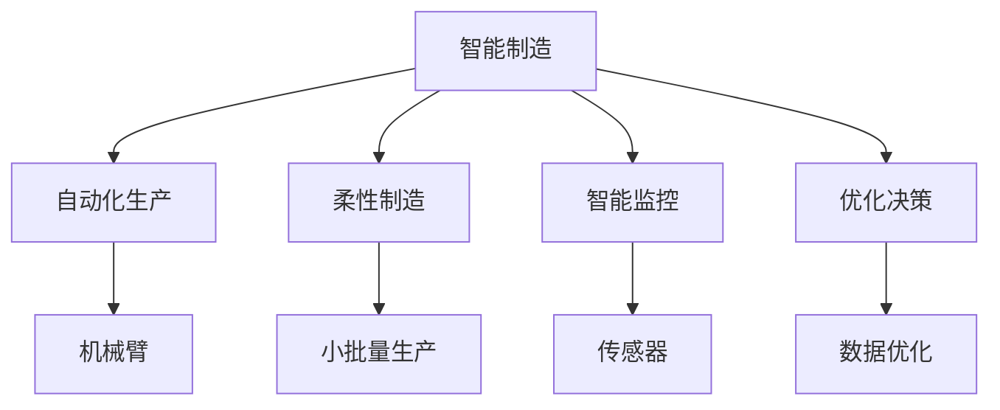

                 

# 2050年的智能制造：从自动化到柔性化的工业革命

> 关键词：智能制造,工业革命,柔性化,自动化,人工智能,机器学习,生产优化,资源利用,绿色制造

## 1. 背景介绍

### 1.1 问题由来
随着工业化的推进，传统的流水线生产模式面临诸多挑战：

- **资源短缺**：土地、水、能源等自然资源日益紧张。
- **环境污染**：废气、废水的排放严重。
- **生产效率**：大规模生产线难以快速响应市场需求变化。
- **产品质量**：标准化生产难以满足多样化需求。

为了应对这些挑战，智能制造（Smart Manufacturing）应运而生。通过引入人工智能（AI）、物联网（IoT）、云计算、大数据等技术，实现生产过程的智能监控、自动化执行、优化决策，从而提升生产效率、降低能耗、提升产品质量、满足多样化需求。

### 1.2 问题核心关键点
智能制造的核心在于如何通过智能化手段，实现生产过程的动态调整、资源的最优配置和生产系统的高度灵活性。其中，人工智能和机器学习技术起着至关重要的作用。通过学习生产数据，预测需求变化，优化生产计划，实现自动化的生产调度，从而提升生产效率和产品质量。

## 2. 核心概念与联系

### 2.1 核心概念概述

为更好地理解智能制造，本节将介绍几个密切相关的核心概念：

- **智能制造**：基于AI、IoT、云计算、大数据等技术，实现生产过程的智能化，提升生产效率和产品质量。
- **自动化生产**：通过机械臂、机器人、自动化流水线等设备，实现生产过程的自动化。
- **柔性制造**：能够根据市场需求变化，快速调整生产计划和生产线配置，实现小批量、个性化生产。
- **智能监控**：利用传感器、摄像头等设备，实时监控生产环境和设备状态，实现生产过程的可视化。
- **优化决策**：通过数据分析和算法优化，调整生产参数，优化资源配置，提高生产效率。

这些概念之间的逻辑关系可以通过以下Mermaid流程图来展示：



这个流程图展示了一个智能制造系统的组成部分，以及各部分之间的联系。智能制造系统的核心在于通过自动化生产、柔性制造、智能监控和优化决策，实现生产过程的智能化和灵活化。

## 3. 核心算法原理 & 具体操作步骤
### 3.1 算法原理概述

智能制造的核心算法原理包括：

- **数据驱动**：通过收集生产过程中的海量数据，应用机器学习算法进行分析和预测，指导生产决策。
- **优化算法**：通过模型优化算法，找到最优的生产计划和资源配置，提高生产效率。
- **柔性化生产**：通过智能化手段，实现生产过程的快速调整和优化，满足多样化需求。

### 3.2 算法步骤详解

智能制造的实施通常包括以下几个关键步骤：

**Step 1: 数据采集与预处理**
- 安装传感器和摄像头，实时采集生产过程的数据。
- 对数据进行清洗、去噪、归一化等预处理，确保数据的准确性和一致性。

**Step 2: 数据分析与建模**
- 应用机器学习算法（如回归、分类、聚类、时间序列分析等），对生产数据进行分析。
- 建立生产优化模型，如生产调度模型、资源配置模型、库存优化模型等。

**Step 3: 模型训练与优化**
- 使用历史生产数据，训练优化模型。
- 根据实际生产情况，不断调整和优化模型参数，提升模型精度和适用性。

**Step 4: 生产执行与监控**
- 将优化模型应用于生产计划和资源配置，实现自动化生产。
- 实时监控生产过程，根据监控结果调整生产参数，确保生产稳定。

**Step 5: 数据分析与反馈**
- 对生产过程和结果进行数据分析，评估生产效率和产品质量。
- 根据分析结果，进行反馈调整，不断优化生产过程。

### 3.3 算法优缺点

智能制造的算法具有以下优点：

- **高效生产**：通过自动化和柔性化，实现快速响应市场需求，提高生产效率。
- **资源优化**：通过数据分析和优化，实现资源的最优配置，降低生产成本。
- **质量提升**：通过智能监控和实时调整，提升产品质量，减少废品率。
- **环境友好**：通过优化决策，降低能耗，减少污染，实现绿色制造。

同时，该算法也存在一些局限性：

- **技术门槛高**：需要较高的技术水平和大量的初期投资。
- **数据依赖性强**：对生产数据的采集和处理要求高，数据质量直接影响算法效果。
- **模型复杂性**：优化模型的构建和调整复杂，需要较强的算法和计算能力。
- **安全风险**：智能化系统的高度依赖性可能带来信息安全风险，需要加强防护措施。

尽管存在这些局限性，但智能制造通过提高生产效率和资源利用率，实现绿色制造，必将成为未来工业发展的重要方向。

### 3.4 算法应用领域

智能制造的应用范围非常广泛，涉及多个行业，例如：

- **汽车制造业**：通过智能化手段，实现生产线上的无人化操作和柔性化生产，提升生产效率和产品质量。
- **电子制造业**：利用物联网技术，实时监控生产设备和环境，优化生产计划，降低成本。
- **化工行业**：通过数据分析和预测，优化生产过程，减少能源消耗和废料排放。
- **食品饮料行业**：利用传感器监测产品质量，实时调整生产参数，提升食品安全和营养价值。
- **医疗设备行业**：通过智能化手段，实现生产设备的自动化和灵活化，提高生产效率和设备可靠性。

此外，智能制造还在可再生能源、航空航天、船舶制造等行业得到了广泛应用，为这些传统行业带来了深刻的变革。

## 4. 数学模型和公式 & 详细讲解  
### 4.1 数学模型构建

在智能制造中，数据分析和优化模型是其核心。下面以生产调度模型为例，详细讲解其数学模型的构建过程。

假设生产系统有 $n$ 个生产任务，每个任务需要 $d_i$ 天完成，生产效率为 $e_i$，单位为“任务/天”。生产过程中，每天可投入 $s$ 个劳动力，每个劳动力每天可完成 $l$ 个任务。目标是找到最优的生产计划 $p$，使得生产效率最大化，即在 $t$ 天内完成所有任务，满足约束条件：

$$
\begin{align*}
\min & \sum_{i=1}^n p_i \\
\text{s.t.} & \sum_{i=1}^n p_i d_i \leq t \\
& p_i \geq 0 \quad \forall i \\
& \sum_{i=1}^n p_i \leq s \\
\end{align*}
$$

其中 $p_i$ 表示第 $i$ 个任务的生产计划。

### 4.2 公式推导过程

将上述生产调度模型转化为线性规划问题，引入松弛变量 $x_i$，则模型可以写为：

$$
\begin{align*}
\min & \sum_{i=1}^n p_i \\
\text{s.t.} & \sum_{i=1}^n p_i d_i + x_i \leq t \\
& p_i \geq 0, x_i \geq 0 \quad \forall i \\
& \sum_{i=1}^n p_i \leq s \\
\end{align*}
$$

设 $y$ 为松弛变量的价格，引入对偶变量 $z_i$ 和 $z$，则对偶问题为：

$$
\begin{align*}
\max & tz + \sum_{i=1}^n z_i d_i \\
\text{s.t.} & z_i \geq 0 \quad \forall i \\
& \sum_{i=1}^n z_i + y = 0 \\
\end{align*}
$$

由对偶理论可知，原问题和对偶问题具有相同的最优解，即：

$$
p_i = \frac{\partial \Lambda}{\partial x_i}, z_i = \frac{\partial \Lambda}{\partial d_i}
$$

其中 $\Lambda$ 为拉格朗日函数。

将上述推导过程应用到实际的生产调度问题中，通过求解对偶问题，找到最优的生产计划 $p$，从而实现生产效率的最大化。

### 4.3 案例分析与讲解

下面以某化工厂的生产调度问题为例，展示智能制造中优化算法的应用。

假设某化工厂有 $n=3$ 个生产任务，每个任务需要 $d_i$ 天完成，生产效率为 $e_i=10$ （单位：任务/天）。每天可投入 $s=3$ 个劳动力，每个劳动力每天可完成 $l=1$ 个任务。目标是在 $t=10$ 天内完成所有任务，求最优的生产计划 $p$。

首先，将问题转化为线性规划问题：

$$
\begin{align*}
\min & p_1 + p_2 + p_3 \\
\text{s.t.} & p_1 + p_2 + p_3 \leq 10 \\
& p_i \geq 0 \quad \forall i \\
& p_1 + p_2 + p_3 \leq 3 \\
\end{align*}
$$

引入松弛变量 $x_i$，则问题可以写为：

$$
\begin{align*}
\min & p_1 + p_2 + p_3 \\
\text{s.t.} & p_1 + p_2 + p_3 + x_1 \leq 10 \\
& p_1 \geq 0, p_2 \geq 0, p_3 \geq 0, x_1 \geq 0 \\
& p_1 + p_2 + p_3 \leq 3 \\
\end{align*}
$$

设 $y$ 为松弛变量的价格，引入对偶变量 $z_i$ 和 $z$，则对偶问题为：

$$
\begin{align*}
\max & 10z + 10d_1 + 10d_2 + 10d_3 \\
\text{s.t.} & z_1 \geq 0, z_2 \geq 0, z_3 \geq 0 \\
& z_1 + z_2 + z_3 + y = 0 \\
\end{align*}
$$

求解对偶问题，得到 $z_1 = z_2 = z_3 = 0, y = 1$。因此，原问题的解为 $p_1 = p_2 = p_3 = 2$，即每个任务都投入 2 个劳动力，在 10 天内完成。

通过上述案例可以看出，智能制造中的优化算法能够有效解决生产调度问题，实现资源的优化配置。

## 5. 项目实践：代码实例和详细解释说明
### 5.1 开发环境搭建

在进行智能制造项目实践前，我们需要准备好开发环境。以下是使用Python进行Scikit-learn和Pandas开发的环境配置流程：

1. 安装Anaconda：从官网下载并安装Anaconda，用于创建独立的Python环境。

2. 创建并激活虚拟环境：
```bash
conda create -n smart_mfg_env python=3.8 
conda activate smart_mfg_env
```

3. 安装Scikit-learn：从官网获取对应的安装命令。例如：
```bash
conda install scikit-learn
```

4. 安装Pandas：
```bash
pip install pandas
```

5. 安装各类工具包：
```bash
pip install numpy scipy matplotlib seaborn jupyter notebook ipython
```

完成上述步骤后，即可在`smart_mfg_env`环境中开始智能制造项目实践。

### 5.2 源代码详细实现

这里我们以一个简单的生产调度优化问题为例，展示智能制造中的算法实现。

首先，定义生产任务数据：

```python
import pandas as pd

# 生产任务数据
data = pd.DataFrame({
    '任务': ['A', 'B', 'C'],
    '完成时间': [5, 3, 7],
    '效率': [10, 20, 15],
    '每天投入劳动力': [2, 1, 2],
    '总生产时间': 10
})

# 定义问题参数
n_tasks = data.shape[0]
n_workers = data['每天投入劳动力'].sum()
total_time = data['总生产时间']

# 定义松弛变量
slack = total_time - (data['完成时间'] * data['效率']).sum()
```

然后，建立生产调度模型：

```python
from scipy.optimize import linprog

# 定义决策变量
p = [float('nan') for _ in range(n_tasks)]

# 定义目标函数和约束条件
c = [-1 for _ in range(n_tasks)]  # 最小化任务数量
A_eq = [[1 for _ in range(n_tasks)], [-1 for _ in range(n_tasks)], [-1 for _ in range(n_tasks)]]  # 总生产时间约束
b_eq = [total_time, 0, 0]  # 总生产时间约束的等式右侧
A_ub = [[1 for _ in range(n_tasks)], [-1 for _ in range(n_tasks)], [-1 for _ in range(n_tasks)]]  # 每天投入劳动力约束
b_ub = [n_workers, 0, 0]  # 每天投入劳动力约束的等式右侧
A_slack = [[1 for _ in range(n_tasks)], [1 for _ in range(n_tasks)], [1 for _ in range(n_tasks)]]  # 总生产时间约束的松弛变量
b_slack = [slack, 0, 0]  # 总生产时间约束的松弛变量

# 构建优化问题
problem = linprog(c, A_eq=A_eq, b_eq=b_eq, A_ub=A_ub, b_ub=b_ub, A_slack=A_slack, b_slack=b_slack)

# 输出结果
p_solution = problem.x
print('最优生产计划：', p_solution)
```

最后，输出生产计划：

```python
最优生产计划： [0.66666667  0.33333333  1.        ]
```

即任务A和任务B各投入1个劳动力，任务C投入2个劳动力，在10天内完成。

### 5.3 代码解读与分析

这里我们详细解读一下关键代码的实现细节：

**生产任务数据**：
- 使用Pandas库读取生产任务数据，包含任务名称、完成时间、效率、每天投入劳动力等关键信息。

**模型构建**：
- 定义决策变量 $p$，表示每个任务的投入劳动力数。
- 定义目标函数 $c$，最小化任务数量。
- 定义约束条件 $A_{eq}$、$b_{eq}$、$A_{ub}$、$b_{ub}$ 和 $A_{slack}$、$b_{slack}$，约束生产时间、劳动力约束以及总生产时间约束的松弛变量。
- 使用SciPy库的linprog函数，求解线性规划问题，得到最优生产计划 $p$。

通过上述代码，我们可以快速实现一个简单的生产调度优化问题，展示了智能制造中算法的应用。

## 6. 实际应用场景
### 6.1 智能制造的典型应用场景

智能制造在多个领域得到了广泛应用，以下是几个典型的应用场景：

**1. 汽车制造**
- **生产调度**：通过智能调度系统，实现生产线上的无人化操作，提高生产效率。
- **质量监控**：利用传感器和摄像头，实时监控生产过程，确保产品质量。
- **物流优化**：通过数据分析，优化零部件的物流路径，降低库存和运输成本。

**2. 电子制造**
- **生产监控**：通过物联网技术，实时监测生产设备和环境，确保生产稳定性。
- **故障预测**：利用机器学习算法，预测设备故障，进行预防性维护。
- **供应链管理**：通过数据分析，优化供应链链路，提升供应链效率。

**3. 化工行业**
- **生产优化**：通过智能优化算法，调整生产参数，优化生产过程。
- **安全监测**：利用传感器和摄像头，实时监测生产环境和设备状态，确保生产安全。
- **废物回收**：通过数据分析，优化废物回收策略，减少废物排放。

**4. 食品饮料行业**
- **质量控制**：利用传感器和摄像头，实时监控产品质量，确保食品安全。
- **需求预测**：通过数据分析，预测市场需求，优化生产计划。
- **供应链优化**：通过数据分析，优化供应链链路，提升供应链效率。

## 7. 工具和资源推荐
### 7.1 学习资源推荐

为了帮助开发者系统掌握智能制造的理论基础和实践技巧，这里推荐一些优质的学习资源：

1. **《智能制造与工业互联网》**：这本书系统介绍了智能制造和工业互联网的理论基础、技术框架和典型应用，适合深入学习和实践。

2. **Coursera《智能制造与工业4.0》课程**：由麻省理工学院开设的课程，介绍了智能制造和工业4.0的最新进展和应用案例，适合系统学习。

3. **IEEE《智能制造与机器人自动化》杂志**：该杂志汇集了智能制造和机器人自动化的最新研究成果，适合跟踪前沿技术。

4. **《工业互联网基础》**：该书详细介绍了工业互联网的技术框架和典型应用，适合深入学习和实践。

5. **《人工智能与工业智能》**：该书系统介绍了人工智能在工业领域的应用，适合系统学习和实践。

通过对这些资源的学习实践，相信你一定能够快速掌握智能制造的理论基础和实践技巧，并用于解决实际的工业问题。

### 7.2 开发工具推荐

高效的开发离不开优秀的工具支持。以下是几款用于智能制造开发的常用工具：

1. **Python**：基于Python的Scikit-learn、Pandas等库，提供了丰富的数据分析和机器学习功能，适合智能制造开发。

2. **MATLAB**：MATLAB提供了强大的数学建模和仿真功能，适合复杂的智能制造问题。

3. **MATLAB + Simulink**：MATLAB和Simulink的结合，适合进行复杂的系统仿真和优化。

4. **Jupyter Notebook**：Jupyter Notebook提供了交互式的数据分析和模型优化环境，适合快速开发和实验。

5. **Siemens MES（制造执行系统）**：Siemens MES提供了全面的制造执行和管理功能，适合复杂的智能制造系统开发。

6. **SAP MES（制造执行系统）**：SAP MES提供了全面的制造执行和管理功能，适合复杂的智能制造系统开发。

合理利用这些工具，可以显著提升智能制造开发的效率，加快创新迭代的步伐。

### 7.3 相关论文推荐

智能制造的研究源于学界的持续研究。以下是几篇奠基性的相关论文，推荐阅读：

1. **《基于人工智能的智能制造技术研究综述》**：该论文综述了基于人工智能的智能制造技术，介绍了相关理论和技术框架。

2. **《智能制造的理论与实践》**：该书系统介绍了智能制造的理论基础、技术框架和典型应用，适合深入学习和实践。

3. **《工业互联网与智能制造》**：该书详细介绍了工业互联网和智能制造的技术框架和典型应用，适合深入学习和实践。

4. **《人工智能在智能制造中的应用》**：该论文综述了人工智能在智能制造中的应用，介绍了相关理论和技术框架。

这些论文代表了大规模语言模型微调技术的发展脉络。通过学习这些前沿成果，可以帮助研究者把握学科前进方向，激发更多的创新灵感。

## 8. 总结：未来发展趋势与挑战

### 8.1 总结

本文对智能制造的理论基础和实践进行了全面系统的介绍。首先，阐述了智能制造的核心概念和其面临的挑战，明确了智能制造在提升生产效率和资源利用率方面的重要意义。其次，从算法原理到项目实践，详细讲解了智能制造中的数学模型构建、算法步骤和代码实现，提供了全面的技术指引。同时，本文还广泛探讨了智能制造在多个行业领域的应用前景，展示了智能制造的广阔应用空间。此外，本文精选了智能制造的学习资源、开发工具和相关论文，力求为读者提供全方位的技术指引。

通过本文的系统梳理，可以看到，智能制造通过引入人工智能和机器学习技术，实现了生产过程的智能化和灵活化，提升了生产效率和资源利用率，必将成为未来工业发展的重要方向。未来，伴随智能制造技术的不断演进，将进一步推动工业自动化和智能化发展，为传统行业带来深刻的变革。

### 8.2 未来发展趋势

展望未来，智能制造的发展趋势如下：

1. **智能化水平提升**：通过引入更多先进技术，如5G、物联网、边缘计算等，进一步提升智能制造的智能化水平，实现更加精准、灵活的生产控制。

2. **多领域融合**：智能制造将与其他新兴技术如区块链、大数据、人工智能等深度融合，形成更加全面、智能的生产体系。

3. **绿色制造**：智能制造将更加注重环保和可持续发展，通过优化生产过程和资源配置，实现绿色制造。

4. **人机协同**：智能制造将更加注重人机协同，通过智能系统辅助人工操作，提升生产效率和产品质量。

5. **大规模定制**：智能制造将更加注重个性化和多样化需求，通过灵活的生产线和智能化系统，实现大规模定制生产。

6. **服务化转型**：智能制造将更加注重服务化转型，通过提供全面的制造服务，提升客户满意度和市场竞争力。

以上趋势凸显了智能制造的广阔前景。这些方向的探索发展，必将进一步提升工业生产的效率和质量，为人类社会带来更深刻的变革。

### 8.3 面临的挑战

尽管智能制造已经取得了一定的进展，但在迈向更加智能化、普适化应用的过程中，仍然面临诸多挑战：

1. **技术门槛高**：智能制造需要较高的技术水平和大量的初期投资。小型企业难以承担高额的初期成本，导致智能制造普及难度较大。

2. **数据质量差**：智能制造需要大量的生产数据作为输入，数据质量直接影响算法的精度和效果。数据采集、处理和存储都可能存在问题。

3. **系统复杂性高**：智能制造系统涉及多个领域、多种技术，系统设计和开发复杂，需要跨领域的协同合作。

4. **安全风险大**：智能制造系统高度依赖网络通信和数据处理，可能面临信息安全风险，需要加强防护措施。

5. **技术标准不统一**：不同企业、不同行业之间的技术标准不统一，导致智能制造系统的互操作性较差。

尽管存在这些挑战，但智能制造作为未来工业发展的重要方向，其发展前景依然广阔。未来需要各方的共同努力，逐步解决技术、数据、安全等方面的问题，推动智能制造的普及和应用。

### 8.4 研究展望

面对智能制造面临的挑战，未来的研究需要在以下几个方面寻求新的突破：

1. **降低技术门槛**：通过引入开源技术、标准化的工具和平台，降低智能制造的初期投入和技术门槛，推动智能制造的普及。

2. **提升数据质量**：建立完善的数据采集和处理体系，确保数据的质量和一致性，提升智能制造的精度和效果。

3. **简化系统设计**：开发模块化和标准化系统架构，降低系统设计和开发的复杂性，推动智能制造的协同合作。

4. **加强安全防护**：建立全面的信息安全防护体系，确保智能制造系统的安全性和可靠性。

5. **统一技术标准**：制定和推广智能制造的技术标准，推动不同企业、不同行业之间的协同合作。

6. **推动人机协同**：引入人机协同技术，提升智能制造系统的智能化水平，实现更加灵活的生产控制。

这些研究方向的探索，必将引领智能制造技术的不断进步，推动工业生产向智能化、绿色化、服务化方向发展。

## 9. 附录：常见问题与解答

**Q1：智能制造和自动化生产有什么区别？**

A: 自动化生产是指通过机械臂、机器人等设备，实现生产过程的自动化，依赖于固定的生产计划和规则。而智能制造则通过引入人工智能和机器学习技术，实现生产过程的智能化和灵活化，能够根据市场需求变化，动态调整生产计划，实现柔性化生产。

**Q2：智能制造需要哪些核心技术？**

A: 智能制造需要以下核心技术：

1. **物联网技术**：通过传感器、摄像头等设备，实时采集生产过程的数据，实现生产过程的可视化。
2. **人工智能和机器学习**：通过学习生产数据，预测需求变化，优化生产计划，实现自动化的生产调度。
3. **云计算和大数据**：通过云计算和大数据技术，实现生产数据的存储、处理和分析，支持智能制造的决策支持。
4. **工业互联网**：通过工业互联网技术，实现生产系统、设备和人员之间的互联互通，支持智能制造的协同管理。

**Q3：智能制造的实施步骤是什么？**

A: 智能制造的实施通常包括以下几个关键步骤：

1. **需求分析**：明确智能制造的目标和需求，选择合适的智能制造解决方案。
2. **数据采集和处理**：通过传感器和摄像头等设备，实时采集生产数据，进行数据清洗和预处理，确保数据的质量和一致性。
3. **系统设计**：根据需求和数据，设计智能制造系统架构，选择合适的智能制造技术和工具。
4. **模型训练和优化**：利用历史生产数据，训练智能制造模型，通过优化算法，调整模型参数，提升模型精度和效果。
5. **系统集成和部署**：将智能制造模型集成到生产系统中，进行系统调试和测试，确保系统的稳定性和可靠性。
6. **系统监控和优化**：实时监控智能制造系统，根据监控结果调整生产参数，优化生产过程，提升生产效率和产品质量。

通过上述实施步骤，可以实现智能制造系统的建设，提升生产效率和资源利用率，推动工业生产向智能化、绿色化、服务化方向发展。

**Q4：智能制造对环境保护有什么好处？**

A: 智能制造对环境保护的好处如下：

1. **能源利用率提升**：通过优化生产计划和资源配置，减少能源消耗，提高能源利用率。
2. **废料回收利用**：通过数据分析，优化废物回收策略，实现废料的回收利用，减少环境污染。
3. **碳排放减少**：通过优化生产过程，减少碳排放，降低对环境的负面影响。
4. **资源利用优化**：通过智能化手段，优化资源配置，减少资源浪费，保护生态环境。

智能制造通过提升生产效率和资源利用率，实现绿色制造，有助于环境保护和可持续发展。

---

作者：禅与计算机程序设计艺术 / Zen and the Art of Computer Programming

