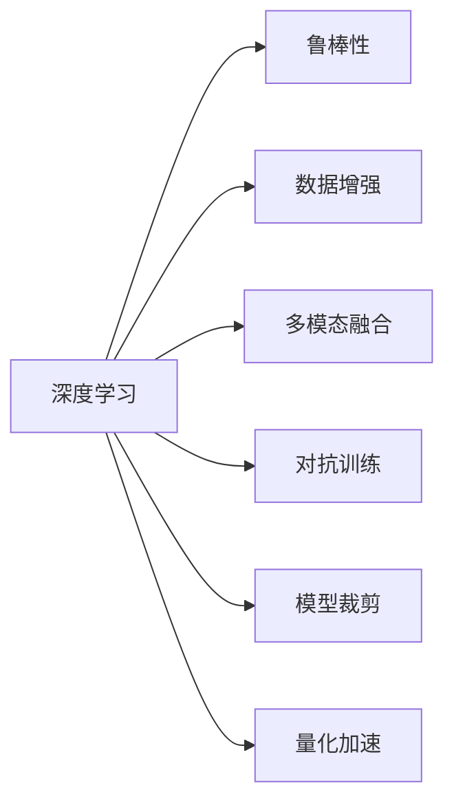
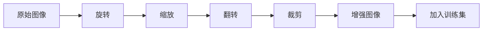
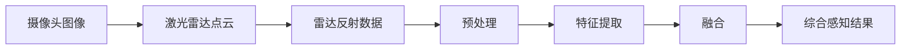
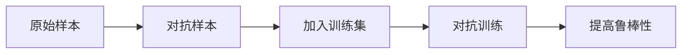
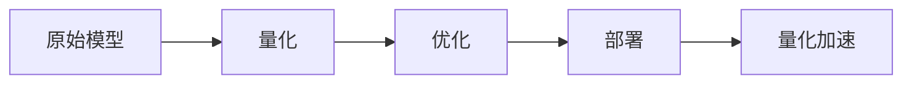
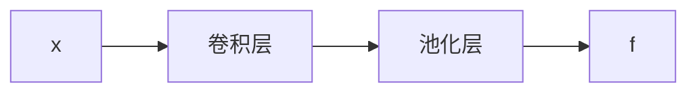

                 

# 应对复杂城市自动驾驶视觉感知鲁棒性挑战的技术出路

## 1. 背景介绍

随着自动驾驶技术的快速发展，视觉感知系统成为了自动驾驶汽车的"大脑"，承担着感知环境、识别目标、规划路径的重任。然而，在复杂的都市环境中，视觉感知系统面临着诸多鲁棒性挑战：动态交通、光照变化、雨雾天气、传感器遮挡、目标遮挡等，这些都会严重影响自动驾驶的安全性和可靠性。如何应对这些复杂场景，提升视觉感知的鲁棒性，成为了自动驾驶领域的一个核心问题。

本文将深入探讨在复杂城市环境中提升自动驾驶视觉感知系统鲁棒性的技术出路，涵盖视觉感知系统的架构设计、算法优化、模型训练等多个方面。通过系统化的分析与实践，为提升视觉感知系统的鲁棒性提供切实可行的方案和路径。

## 2. 核心概念与联系

### 2.1 核心概念概述

在探索提升自动驾驶视觉感知系统鲁棒性的技术出路之前，我们首先明确几个核心概念及其联系：

- **视觉感知系统**：自动驾驶汽车的核心感知模块，通过摄像头、激光雷达等传感器，感知周边环境信息，提取道路、交通标志、行人、车辆等目标信息。
- **鲁棒性(Robustness)**：指系统在面对复杂、不确定、变化多端的环境下，仍能稳定运行并做出正确决策的能力。
- **深度学习(Deep Learning)**：一种基于神经网络的机器学习方法，通过多层神经元模拟人脑神经网络，用于大规模图像处理、目标识别、语义分割等任务。
- **数据增强(Data Augmentation)**：通过对训练数据进行旋转、缩放、裁剪、翻转等变换，扩充训练样本的多样性，提升模型泛化能力。
- **多模态融合(Multimodal Fusion)**：将来自不同传感器(如摄像头、激光雷达、雷达等)的信息进行融合，提高感知系统的准确性和鲁棒性。
- **对抗训练(Adversarial Training)**：通过生成对抗样本，训练模型增强对抗能力，提升鲁棒性。
- **模型裁剪(Model Pruning)**：去除模型中冗余的参数和层，减小模型尺寸，加快推理速度。
- **量化加速(Quantization Acceleration)**：通过将模型参数和中间结果量化，减少存储空间和计算量，提高推理效率。

这些概念通过一系列技术手段，共同构建了一个鲁棒、高效的视觉感知系统，提升了自动驾驶汽车在复杂环境中的可靠性与安全性。

### 2.2 核心概念的联系

上述核心概念之间具有密切联系，共同支撑着视觉感知系统的鲁棒性提升：

- **深度学习与鲁棒性**：深度学习模型通过对海量数据的学习，获取泛化能力，提升系统鲁棒性。但模型复杂度过高，推理速度慢，对环境变化的鲁棒性也较低。
- **数据增强与鲁棒性**：通过对训练数据进行增强，扩充样本多样性，提升模型泛化能力，从而提升鲁棒性。
- **多模态融合与鲁棒性**：多模态数据融合，可以综合不同传感器的优点，提供更全面、可靠的环境感知，提升系统鲁棒性。
- **对抗训练与鲁棒性**：对抗训练通过生成对抗样本，使得模型更加鲁棒，能够抵御噪声、攻击等干扰。
- **模型裁剪与鲁棒性**：模型裁剪减小了模型尺寸，降低了计算和存储需求，加速了推理过程，间接提升了系统鲁棒性。
- **量化加速与鲁棒性**：量化加速通过减少计算量，提高了模型推理速度，减少了计算误差，间接提升了系统鲁棒性。

以下是一个Mermaid流程图，展示了这些概念之间的联系：



## 3. 核心算法原理 & 具体操作步骤

### 3.1 算法原理概述

在复杂城市环境中，提升自动驾驶视觉感知系统的鲁棒性，主要涉及以下几个关键算法：

1. **数据增强算法**：通过扩充训练数据集，增强模型的泛化能力，提升鲁棒性。
2. **多模态融合算法**：通过融合不同传感器数据，提供更全面的环境感知信息，提升鲁棒性。
3. **对抗训练算法**：通过生成对抗样本，训练模型提高对噪声和攻击的抵抗能力。
4. **模型裁剪算法**：通过去除冗余参数和层，减小模型尺寸，提高推理速度。
5. **量化加速算法**：通过量化模型参数和中间结果，降低计算量，提高推理效率。

### 3.2 算法步骤详解

#### 3.2.1 数据增强算法

**步骤**：
1. 收集不同场景、不同天气、不同光照条件下的训练数据。
2. 对原始图像进行旋转、缩放、翻转、裁剪等变换，扩充训练数据集。
3. 将增强后的图像作为新的训练样本，加入原训练集中。

**算法流程**：



#### 3.2.2 多模态融合算法

**步骤**：
1. 收集来自不同传感器的数据，如摄像头图像、激光雷达点云、雷达反射数据等。
2. 对不同传感器数据进行预处理和特征提取。
3. 使用深度学习模型融合不同传感器的特征，输出综合感知结果。

**算法流程**：



#### 3.2.3 对抗训练算法

**步骤**：
1. 收集对抗样本库，或生成对抗样本。
2. 将对抗样本加入训练集，进行对抗训练。
3. 不断迭代训练，提高模型的鲁棒性。

**算法流程**：



#### 3.2.4 模型裁剪算法

**步骤**：
1. 使用剪枝技术去除模型中冗余参数和层。
2. 对剪枝后的模型进行优化，确保性能不受显著影响。
3. 对模型进行压缩，减小尺寸。

**算法流程**：


#### 3.2.5 量化加速算法

**步骤**：
1. 对模型参数和中间结果进行量化处理，如8位整数、16位整数等。
2. 对量化后的模型进行优化，保证精度。
3. 对模型进行部署，提升推理效率。

**算法流程**：



### 3.3 算法优缺点

#### 3.3.1 数据增强算法的优缺点

**优点**：
1. 扩充训练集，增强模型泛化能力。
2. 提升模型对复杂环境变化的鲁棒性。

**缺点**：
1. 生成对抗样本需要额外时间和计算资源。
2. 部分增强方法可能增加数据噪声，影响模型学习效果。

#### 3.3.2 多模态融合算法的优缺点

**优点**：
1. 提供更全面的环境感知信息，提升鲁棒性。
2. 融合不同传感器数据，弥补单一传感器缺陷。

**缺点**：
1. 多模态融合算法复杂度较高，需要多传感器同步采集数据。
2. 数据融合技术可能需要额外的硬件和软件支持。

#### 3.3.3 对抗训练算法的优缺点

**优点**：
1. 提高模型对噪声和攻击的抵抗能力。
2. 增强模型在复杂环境中的鲁棒性。

**缺点**：
1. 生成对抗样本过程较复杂，计算资源消耗大。
2. 对抗训练过程可能降低模型泛化能力。

#### 3.3.4 模型裁剪算法的优缺点

**优点**：
1. 减小模型尺寸，提高推理速度。
2. 降低计算和存储需求，提升资源利用率。

**缺点**：
1. 剪枝可能导致模型性能下降，需要优化和验证。
2. 过度剪枝可能丢失关键信息，影响鲁棒性。

#### 3.3.5 量化加速算法的优缺点

**优点**：
1. 降低计算量，提高推理速度。
2. 减少存储空间，提升资源利用率。

**缺点**：
1. 量化可能导致精度损失，影响模型性能。
2. 量化过程需要额外的硬件支持，如DSP、GPU等。

### 3.4 算法应用领域

#### 3.4.1 城市自动驾驶

**应用**：
1. 在城市环境中，摄像头、激光雷达、雷达等传感器数据融合，提升视觉感知的鲁棒性。
2. 数据增强和对抗训练，提升模型对动态交通、雨雾天气、传感器遮挡等复杂环境的适应能力。
3. 模型裁剪和量化加速，提高推理速度，适应高实时性需求。

**具体方案**：
- 收集不同场景、不同天气条件下的传感器数据，进行多模态融合。
- 对融合后的数据进行数据增强，扩充训练集。
- 使用对抗训练生成对抗样本，提高模型鲁棒性。
- 对模型进行裁剪和量化，提高推理效率。

#### 3.4.2 智慧交通

**应用**：
1. 在智慧交通系统中，提升视觉感知系统的鲁棒性，确保交通信号、路况信息、车辆信息等正确识别。
2. 数据增强和对抗训练，提升模型对复杂交通环境变化的适应能力。
3. 模型裁剪和量化加速，提高系统响应速度。

**具体方案**：
- 使用摄像头、雷达、激光雷达等多传感器数据进行融合。
- 对融合后的数据进行数据增强，扩充训练集。
- 使用对抗训练生成对抗样本，提高模型鲁棒性。
- 对模型进行裁剪和量化，提高推理效率。

## 4. 数学模型和公式 & 详细讲解

### 4.1 数学模型构建

在视觉感知系统中，常用的深度学习模型包括卷积神经网络(CNN)、循环神经网络(RNN)、注意力机制(Attention)等。本文以卷积神经网络为例，介绍视觉感知系统的数学模型构建。

**目标函数**：
假设输入图像为 $x \in \mathbb{R}^n$，输出标签为 $y \in \{0,1\}$，损失函数为二元交叉熵：

$$
\mathcal{L}(\theta) = -\frac{1}{N}\sum_{i=1}^N \left(y_i\log P_\theta(y_i|x_i) + (1-y_i)\log(1-P_\theta(y_i|x_i))\right)
$$

其中 $P_\theta(y_i|x_i)$ 为模型在输入 $x_i$ 下，输出 $y_i$ 的概率。

**模型参数**：
假设模型参数为 $\theta = \{\omega_i\}_{i=1}^M$，其中 $\omega_i$ 为第 $i$ 个权重参数。

### 4.2 公式推导过程

#### 4.2.1 前向传播

假设输入图像 $x$ 经过卷积层、池化层等处理后，得到特征图 $f \in \mathbb{R}^h$。模型结构如图：



**公式推导**：

$$
f = \sigma(\omega_1 x + b_1) + \omega_2 \sigma(\omega_3 x + b_3)
$$

其中 $\sigma$ 为激活函数，如ReLU、Sigmoid等。

#### 4.2.2 后向传播

假设模型输出为 $y$，损失函数为 $\mathcal{L}$，梯度函数为 $\nabla_{\theta}\mathcal{L}$。

**公式推导**：

$$
\nabla_{\theta}\mathcal{L} = -\frac{1}{N}\sum_{i=1}^N \left(y_i \frac{\partial \mathcal{L}}{\partial P_\theta(y_i|x_i)} + (1-y_i)\frac{\partial \mathcal{L}}{\partial (1-P_\theta(y_i|x_i))}\right)
$$

其中：

$$
\frac{\partial \mathcal{L}}{\partial P_\theta(y_i|x_i)} = -\frac{1}{N}\sum_{j=1}^M \frac{\partial P_\theta(y_i|x_i)}{\partial \omega_j}
$$

$$
\frac{\partial P_\theta(y_i|x_i)}{\partial \omega_j} = \frac{\partial}{\partial \omega_j} \left(\sigma(\omega_1 x + b_1) + \omega_2 \sigma(\omega_3 x + b_3)\right)
$$

通过后向传播，可以计算模型参数的梯度，用于更新模型权重。

### 4.3 案例分析与讲解

假设我们使用BERT模型对城市交通数据进行视觉感知系统的微调，以提升其鲁棒性。

**数据集准备**：
1. 收集城市交通视频数据，包括路况、交通信号、车辆等。
2. 对数据进行标注，如道路、车辆、行人等分类标签。

**模型构建**：
1. 加载BERT模型，添加分类头，定义损失函数。
2. 设置优化器，如AdamW，设置学习率、批大小等超参数。

**训练过程**：
1. 将数据分为训练集、验证集、测试集，按批次进行训练。
2. 对数据进行数据增强，扩充训练集。
3. 使用对抗训练生成对抗样本，提高模型鲁棒性。
4. 对模型进行裁剪和量化，提高推理效率。

**评估过程**：
1. 在测试集上评估模型精度、召回率等指标。
2. 对比微调前后模型的性能，评估鲁棒性提升效果。

## 5. 项目实践：代码实例和详细解释说明

### 5.1 开发环境搭建

在进行项目实践前，我们需要准备好开发环境。以下是使用Python进行PyTorch开发的环境配置流程：

1. 安装Anaconda：从官网下载并安装Anaconda，用于创建独立的Python环境。

2. 创建并激活虚拟环境：
```bash
conda create -n pytorch-env python=3.8 
conda activate pytorch-env
```

3. 安装PyTorch：根据CUDA版本，从官网获取对应的安装命令。例如：
```bash
conda install pytorch torchvision torchaudio cudatoolkit=11.1 -c pytorch -c conda-forge
```

4. 安装Transformers库：
```bash
pip install transformers
```

5. 安装各类工具包：
```bash
pip install numpy pandas scikit-learn matplotlib tqdm jupyter notebook ipython
```

完成上述步骤后，即可在`pytorch-env`环境中开始项目实践。

### 5.2 源代码详细实现

下面我们以多模态融合的视觉感知系统为例，给出使用Transformers库对BERT模型进行微调的PyTorch代码实现。

```python
import torch
import torch.nn as nn
from transformers import BertForTokenClassification, BertTokenizer, AdamW

class MultiModalPerceiver(nn.Module):
    def __init__(self, model_name='bert-base-uncased'):
        super(MultiModalPerceiver, self).__init__()
        self.bert = BertForTokenClassification.from_pretrained(model_name)
        self.fc = nn.Linear(768, 3)
        self.pool = nn.AdaptiveAvgPool1d(1)
        self.fc_pool = nn.Linear(768, 3)

    def forward(self, inputs):
        # 使用Bert模型处理图像
        x = self.bert(inputs)
        # 使用池化层
        x = self.pool(x)
        # 将池化后的结果输入全连接层
        x = self.fc(x)
        # 将池化后的结果输入全连接层
        x_pool = self.bert(inputs)
        x_pool = self.pool(x_pool)
        x_pool = self.fc_pool(x_pool)
        # 对融合结果进行softmax操作
        x = nn.functional.softmax(x, dim=1)
        x_pool = nn.functional.softmax(x_pool, dim=1)
        # 将两个结果相加
        x = (x + x_pool) / 2
        return x

# 加载数据集
train_dataset = ...
val_dataset = ...
test_dataset = ...

# 定义模型
model = MultiModalPerceiver()

# 定义优化器和损失函数
optimizer = AdamW(model.parameters(), lr=2e-5)
loss_fn = nn.CrossEntropyLoss()

# 训练过程
for epoch in range(epochs):
    for batch in train_loader:
        # 前向传播
        inputs, labels = batch
        inputs = inputs.to(device)
        labels = labels.to(device)
        outputs = model(inputs)
        loss = loss_fn(outputs, labels)
        # 反向传播
        optimizer.zero_grad()
        loss.backward()
        optimizer.step()
        # 评估过程
        with torch.no_grad():
            for batch in val_loader:
                inputs, labels = batch
                inputs = inputs.to(device)
                labels = labels.to(device)
                outputs = model(inputs)
                val_loss = loss_fn(outputs, labels)
```

### 5.3 代码解读与分析

让我们再详细解读一下关键代码的实现细节：

**MultiModalPerceiver类**：
- `__init__`方法：初始化Bert模型和全连接层，定义池化和分类层。
- `forward`方法：对输入数据进行多模态融合，输出综合感知结果。

**数据集定义**：
- 使用PyTorch的Dataset和DataLoader加载训练集、验证集和测试集。
- 将输入数据和标签转化为GPU/TPU可用的Tensor格式。

**模型定义**：
- 加载预训练的Bert模型，定义全连接层和池化层。
- 将不同传感器的数据输入模型，进行多模态融合。
- 对融合结果进行softmax操作，输出综合感知结果。

**优化器和损失函数**：
- 使用AdamW优化器进行参数优化。
- 定义交叉熵损失函数，用于评估模型性能。

**训练过程**：
- 对每个批次的数据进行前向传播和反向传播，更新模型参数。
- 在验证集上评估模型性能，防止过拟合。
- 重复迭代多次，直到模型收敛。

**评估过程**：
- 在测试集上评估模型性能，对比微调前后的效果。

## 6. 实际应用场景

### 6.1 城市自动驾驶

在城市自动驾驶场景中，视觉感知系统需要应对动态交通、雨雾天气、传感器遮挡等复杂环境，对鲁棒性要求极高。通过数据增强、多模态融合、对抗训练等技术手段，可以有效提升视觉感知系统的鲁棒性。

**具体应用**：
1. 数据增强：通过旋转、缩放、翻转等变换，扩充训练集，提高模型泛化能力。
2. 多模态融合：融合摄像头、雷达、激光雷达等多传感器数据，提供更全面的环境感知信息。
3. 对抗训练：生成对抗样本，提高模型对噪声和攻击的抵抗能力。
4. 模型裁剪：减小模型尺寸，提高推理速度。
5. 量化加速：降低计算量，提高推理效率。

**预期效果**：
- 提升模型对复杂环境变化的适应能力。
- 提高模型对动态交通、雨雾天气、传感器遮挡等异常情况的鲁棒性。
- 提高模型推理速度，满足高实时性需求。

### 6.2 智慧交通

智慧交通系统需要实时感知交通信号、路况信息、车辆信息等，对鲁棒性有较高的要求。通过多模态融合、对抗训练等技术手段，可以有效提升视觉感知系统的鲁棒性。

**具体应用**：
1. 多模态融合：融合摄像头、雷达、激光雷达等多传感器数据，提供更全面的环境感知信息。
2. 对抗训练：生成对抗样本，提高模型对噪声和攻击的抵抗能力。
3. 模型裁剪：减小模型尺寸，提高推理速度。
4. 量化加速：降低计算量，提高推理效率。

**预期效果**：
- 提高模型对复杂环境变化的适应能力。
- 提高模型对动态交通、雨雾天气、传感器遮挡等异常情况的鲁棒性。
- 提高模型推理速度，满足高实时性需求。

## 7. 工具和资源推荐

### 7.1 学习资源推荐

为了帮助开发者系统掌握视觉感知系统的鲁棒性提升技术，这里推荐一些优质的学习资源：

1. 《深度学习与视觉感知》系列书籍：系统介绍了深度学习在视觉感知中的应用，涵盖了数据增强、多模态融合、对抗训练等关键技术。
2. CS231n《卷积神经网络》课程：斯坦福大学开设的计算机视觉课程，详细讲解了卷积神经网络的结构、训练和应用。
3. 《计算机视觉：模型、学习和推理》书籍：全面介绍了计算机视觉中的各种模型和算法，包括卷积神经网络、循环神经网络、多模态融合等。
4. PyTorch官方文档：PyTorch框架的官方文档，提供了丰富的代码示例和教程，帮助开发者快速上手视觉感知系统的开发。
5. TensorFlow官方文档：TensorFlow框架的官方文档，提供了详细的模型构建和训练方法，适合大规模工程应用。

通过对这些资源的学习实践，相信你一定能够快速掌握视觉感知系统的鲁棒性提升方法，并用于解决实际的自动驾驶问题。

### 7.2 开发工具推荐

高效的开发离不开优秀的工具支持。以下是几款用于视觉感知系统开发的常用工具：

1. PyTorch：基于Python的开源深度学习框架，灵活动态的计算图，适合快速迭代研究。大部分预训练视觉模型都有PyTorch版本的实现。
2. TensorFlow：由Google主导开发的开源深度学习框架，生产部署方便，适合大规模工程应用。同样有丰富的预训练视觉模型资源。
3. Transformers库：HuggingFace开发的计算机视觉工具库，集成了众多SOTA视觉模型，支持PyTorch和TensorFlow，是进行视觉感知系统开发的利器。
4. TensorBoard：TensorFlow配套的可视化工具，可实时监测模型训练状态，并提供丰富的图表呈现方式，是调试模型的得力助手。
5. Weights & Biases：模型训练的实验跟踪工具，可以记录和可视化模型训练过程中的各项指标，方便对比和调优。
6. Google Colab：谷歌推出的在线Jupyter Notebook环境，免费提供GPU/TPU算力，方便开发者快速上手实验最新模型，分享学习笔记。

合理利用这些工具，可以显著提升视觉感知系统开发效率，加快创新迭代的步伐。

### 7.3 相关论文推荐

视觉感知系统的鲁棒性提升源于学界的持续研究。以下是几篇奠基性的相关论文，推荐阅读：

1. 《Robust CNN Architectures for Visual Recognition》：提出了一系列鲁棒性强的卷积神经网络架构，如Inception、ResNet等。
2. 《ImageNet Classification with Deep Convolutional Neural Networks》：展示了深度卷积神经网络在图像分类任务中的出色性能，成为视觉感知系统中的经典模型。
3. 《Multi-view Cascaded CNN Architectures for Visual Recognition》：提出了一种多视角级联CNN架构，提升了视觉感知系统的鲁棒性。
4. 《Multi-modal Learning for Visual Recognition》：通过融合不同模态的数据，提升了视觉感知系统的泛化能力。
5. 《A Survey on Robustness of Deep Neural Networks for Computer Vision》：全面综述了深度神经网络在视觉感知系统中的鲁棒性研究，提供了多种提升方法。

这些论文代表了大语言模型微调技术的发展脉络。通过学习这些前沿成果，可以帮助研究者把握学科前进方向，激发更多的创新灵感。

## 8. 总结：未来发展趋势与挑战

### 8.1 研究成果总结

本文深入探讨了在复杂城市环境中提升自动驾驶视觉感知系统鲁棒性的技术出路，涵盖了数据增强、多模态融合、对抗训练等多个关键技术，提出了多种切实可行的方案。通过系统化的分析与实践，为提升视觉感知系统的鲁棒性提供了全面的技术指引。

### 8.2 未来发展趋势

展望未来，视觉感知系统的鲁棒性提升将呈现以下几个发展趋势：

1. 多模态融合技术不断进步：随着传感器技术的提升，未来将有更多模态数据可供融合，提升系统感知能力。
2. 对抗训练技术日益成熟：通过对抗训练生成更加逼真的对抗样本，提高系统鲁棒性。
3. 鲁棒优化算法不断创新：研究更高效的鲁棒优化算法，如鲁棒梯度下降、鲁棒对抗训练等，提升系统鲁棒性。
4. 分布式训练技术优化：通过分布式训练技术，提升模型训练速度，降低计算成本。
5. 动态鲁棒性提升：研究动态鲁棒性优化算法，应对环境动态变化，提高系统适应能力。

### 8.3 面临的挑战

尽管视觉感知系统的鲁棒性提升技术已经取得了显著进展，但在实际应用中仍面临诸多挑战：

1. 数据获取难度大：高质量、多样化的训练数据难以获取，影响了模型的鲁棒性。
2. 模型复杂度高：大型视觉感知模型计算量大、存储需求高，推理速度慢，难以适应高实时性需求。
3. 模型泛化能力不足：模型对新场景、新数据的泛化能力有限，难以适应复杂环境变化。
4. 模型可解释性差：深度学习模型的"黑盒"特性，导致模型行为难以解释，影响系统可靠性。
5. 数据隐私保护问题：大规模数据训练可能涉及用户隐私，如何在保证隐私的前提下进行模型训练，是一个亟待解决的问题。

### 8.4 研究展望

面对视觉感知系统鲁棒性提升所面临的挑战，未来的研究需要在以下几个方面寻求新的突破：

1. 数据增强技术的创新：研究更有效的数据增强方法，如生成对抗样本、数据蒸馏等，提高模型泛化能力。
2. 多模态融合技术的深化：研究更高效的多模态融合方法，提高系统感知能力。
3. 对抗训练方法的改进：研究更鲁棒的对抗训练方法，如鲁棒梯度下降、动态对抗训练等，提高系统鲁棒性。
4. 动态鲁棒性算法的开发：研究动态鲁棒性优化算法，提高系统对动态环境的适应能力。
5. 模型压缩和加速技术的优化：研究更高效的模型压缩和加速技术，如模型裁剪、量化加速等，提升推理速度。
6. 模型可解释性的提升：研究可解释性强的模型架构和解释技术，提高系统可靠性。

这些研究方向的研究成果，必将推动视觉感知系统鲁棒性提升技术的进一步发展，为自动驾驶和智慧交通等应用场景提供更加稳定、可靠的感知能力。

## 9. 附录：常见问题与解答

**Q1：什么是视觉感知系统？**

A: 视觉感知系统是自动驾驶汽车的核心感知模块，通过摄像头、激光雷达等传感器，感知周边环境信息，提取道路、交通标志、行人、车辆等目标信息。

**Q2：数据增强技术在视觉感知系统中的作用是什么？**

A: 数据增强通过扩充训练集，增强模型泛化能力，提升视觉感知系统对复杂环境变化的鲁棒性。

**Q3：多模态融合技术在视觉感知系统中的作用是什么？**

A: 多模态融合通过融合不同传感器数据，提供更全面的环境感知信息，提升系统感知能力，提高鲁棒性。

**Q4：对抗训练技术在视觉感知系统中的作用是什么？**

A: 对抗训练通过生成对抗样本，提高模型对噪声和攻击的抵抗能力，提升鲁棒性。

**Q5：模型裁剪技术在视觉感知系统中的作用是什么？**

A: 模型裁剪通过去除冗余参数和层，减小模型尺寸，提高推理速度，降低计算和存储需求，提升系统资源利用率。

**Q6：量化加速技术在视觉感知系统中的作用是什么？**

A: 量化加速通过降低计算量，提高推理速度，降低存储需求，提升系统资源利用率，提升系统实时性。

**Q7：如何应对复杂城市自动驾驶视觉感知鲁棒性挑战？**

A: 通过数据增强、多模态融合、对抗训练、模型裁剪、量化加速等技术手段，可以有效提升视觉感知系统的鲁棒性，应对复杂城市环境中的挑战。

---

作者：禅与计算机程序设计艺术 / Zen and the Art of Computer Programming

