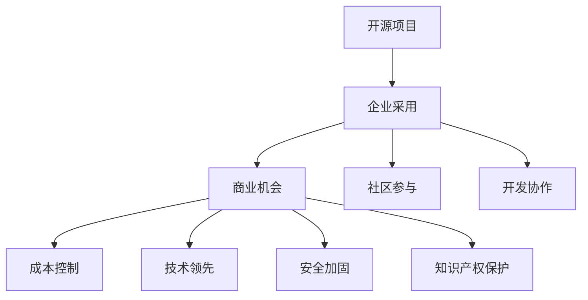

                 

# 开源项目的企业采用：创造商业机会

> 关键词：开源项目,企业采用,商业机会,社区参与,开发协作,知识产权

## 1. 背景介绍

### 1.1 问题由来

在当前的软件生态环境中，开源项目扮演着越来越重要的角色。它们的广泛使用，不仅推动了技术的快速迭代和普及，还为企业提供了强大的技术支持和灵活的解决方案。然而，尽管开源项目能够提供高质量的软件解决方案，但许多企业仍面临采用开源项目的困难，尤其是中小企业和初创公司。本文旨在探讨企业如何更好地采用开源项目，并从中创造商业机会。

### 1.2 问题核心关键点

企业采用开源项目面临的核心问题包括：

- **成本问题**：开源项目的商业化成本较高，需要投入人力、时间和资金。
- **维护问题**：开源项目通常需要大量社区维护，缺乏内部技术支持。
- **安全问题**：开源项目的安全性和合规性难以保证，存在安全隐患。
- **学习问题**：企业内部团队需要时间来掌握开源项目的使用和维护。
- **知识产权问题**：开源项目的许可证复杂，可能与企业的使用场景不符。

## 2. 核心概念与联系

### 2.1 核心概念概述

为更好地理解开源项目的企业采用，本节将介绍几个密切相关的核心概念：

- **开源项目**：指源代码公开，任何人都可以访问、修改、分发、使用的软件项目。典型代表包括Apache、MIT等许可协议下的项目。
- **企业采用**：指企业将开源项目引入其业务流程，使用其功能、服务和文档，进行二次开发和集成。
- **商业机会**：指通过采用开源项目，企业能够在产品开发、运营、市场等方面获得额外的价值和收益。
- **社区参与**：指企业积极参与开源社区的开发和治理，通过贡献代码、提供资金支持、参与讨论等方式，推动项目的发展。
- **开发协作**：指企业与开源社区的深度合作，共同进行软件的开发和迭代，实现共赢。
- **知识产权**：指开源项目的许可协议规定了使用、修改、分发软件的限制条件，影响企业的商业决策。

这些核心概念之间的逻辑关系可以通过以下Mermaid流程图来展示：



这个流程图展示了大规模开源项目与企业采用的关系：

1. 开源项目通过社区参与和开发协作，不断迭代升级，满足企业需求。
2. 企业采用开源项目，能够获取商业机会，包括成本控制、技术领先、安全加固和知识产权保护。
3. 企业通过积极参与开源社区，影响开源项目的方向，推动自身技术的演进。

## 3. 核心算法原理 & 具体操作步骤
### 3.1 算法原理概述

企业采用开源项目的过程，本质上是一个面向开源项目的优化过程。其核心思想是：通过选择合适的开源项目，并对其进行定制化开发和集成，最大化企业自身的商业价值。

形式化地，假设目标企业为 $E$，其市场需求为 $D$，开源项目为 $P$，企业的技术能力为 $C$。企业采用开源项目的优化目标为最大化企业价值 $V$，即：

$$
V = f(E, D, P, C)
$$

其中 $f$ 表示企业的价值函数，需要根据具体的场景进行设计。

在实践中，企业通常通过以下步骤完成开源项目的采用：

1. 分析市场需求：确定企业所面临的具体问题和需求。
2. 筛选开源项目：从开源仓库或社区中找到合适的项目。
3. 评估项目质量：对候选开源项目进行技术和社区活跃度的评估。
4. 定制化开发：根据企业需求对开源项目进行定制化修改和扩展。
5. 集成部署：将开源项目集成到企业系统中，并进行测试和部署。
6. 持续维护：对开源项目进行定期维护和升级，确保其稳定性。

### 3.2 算法步骤详解

基于开源项目的企业采用过程通常包括以下几个关键步骤：

**Step 1: 需求分析**

- 明确企业所面临的市场需求和问题。通过调研、问卷、用户反馈等方式获取详细信息。
- 分析需求的功能、性能、安全性、易用性等方面，确定项目的技术指标。

**Step 2: 项目筛选**

- 从GitHub、GitLab、Apache等开源仓库中，筛选出符合企业需求的候选开源项目。
- 对候选项目进行初步的代码审查和社区活跃度分析，评估其质量和成熟度。

**Step 3: 项目评估**

- 使用自动化工具和代码审查技术，对候选项目的代码质量、功能实现、依赖关系、测试覆盖率等进行评估。
- 调查项目的技术社区，了解其活跃度、贡献者数量、更新频率等信息，评估其社区支持情况。

**Step 4: 定制化开发**

- 基于企业的具体需求，对开源项目进行定制化开发。包括添加新功能、修改已有功能、优化性能等。
- 使用版本控制工具，对修改进行记录和管理，方便后续的维护和更新。

**Step 5: 集成部署**

- 将定制化后的开源项目集成到企业系统中，并进行测试和验证。
- 根据企业的IT架构和环境，选择合适的部署方式，如直接部署、容器化部署、云服务等。

**Step 6: 持续维护**

- 定期对开源项目进行功能迭代和性能优化，确保其与企业需求保持一致。
- 关注开源社区的最新更新和讨论，及时调整项目策略，提升项目成熟度。

### 3.3 算法优缺点

采用开源项目的企业采用方法具有以下优点：

- **成本低**：开源项目通常免费使用，可以降低企业的开发和维护成本。
- **灵活性高**：开源项目可自由修改和扩展，满足企业的特殊需求。
- **技术先进**：开源项目通常由社区驱动，能够快速集成最新的技术进展。
- **社区支持**：开源项目通常有活跃的社区，可以提供技术支持和发展建议。

同时，该方法也存在一定的局限性：

- **学习曲线陡峭**：开源项目的复杂性较高，企业需要投入大量时间和资源进行学习和适应。
- **安全和合规问题**：开源项目的代码可能存在安全漏洞和合规风险，需要企业进行严格的审计和管理。
- **维护复杂**：开源项目的维护需要持续投入，可能存在“bug-for-bug”的维护困境。

尽管存在这些局限性，但就目前而言，开源项目的采用仍然是企业获取技术优势和商业价值的重要手段。未来相关研究的重点在于如何进一步优化企业采用开源项目的方法，提升其可行性和有效性。

### 3.4 算法应用领域

基于开源项目的企业采用方法，在软件开发、数据分析、人工智能、云服务等诸多领域都有广泛的应用。例如：

- **软件开发**：通过采用开源开发框架和工具，如Spring、Apache Hadoop、OpenStack等，企业可以快速搭建和部署软件系统。
- **数据分析**：采用开源大数据处理工具，如Apache Hive、Spark、Kafka等，帮助企业处理海量数据，提升分析效率。
- **人工智能**：采用开源机器学习框架，如TensorFlow、PyTorch、Scikit-learn等，企业可以构建智能应用，提升自动化和智能化水平。
- **云服务**：采用开源云平台，如OpenStack、Kubernetes、OpenShift等，帮助企业构建云原生架构，提高资源利用率和运维效率。

除了上述这些经典应用外，开源项目还被创新性地应用到更多场景中，如DevOps、容器化部署、微服务等，为企业提供灵活、高效的解决方案。

## 4. 数学模型和公式 & 详细讲解 & 举例说明

### 4.1 数学模型构建

本节将使用数学语言对企业采用开源项目的过程进行更加严格的刻画。

记企业需求为 $D$，候选开源项目为 $P$，企业的技术能力为 $C$。企业采用开源项目的优化目标为最大化企业价值 $V$，即：

$$
V = f(D, P, C)
$$

其中 $f$ 表示企业的价值函数，需要根据具体的场景进行设计。

### 4.2 公式推导过程

以下我们以软件开发项目为例，推导企业采用开源项目的价值函数。

假设企业需求 $D$ 为实现一个支付系统，候选开源项目 $P$ 为OpenSSL和Apache Kafka，企业的技术能力 $C$ 包括：

- 开发团队人数：$N_{dev}$
- 软件开发经验：$E_{dev}$
- 数据处理能力：$D_{data}$
- 云计算能力：$C_{cloud}$

我们将企业价值 $V$ 分解为三个部分：技术价值 $V_{tech}$、业务价值 $V_{business}$ 和成本价值 $V_{cost}$。

$$
V = V_{tech} + V_{business} - V_{cost}
$$

其中：

- 技术价值 $V_{tech}$：衡量开源项目的技术质量和企业的技术能力，包括开源项目的代码质量、社区活跃度、性能指标等。
- 业务价值 $V_{business}$：衡量开源项目对企业业务的支持程度，包括开源项目的功能、扩展性、兼容性等。
- 成本价值 $V_{cost}$：衡量企业采用开源项目的总成本，包括开发成本、维护成本、运营成本等。

根据以上定义，我们可以构建如下价值函数：

$$
V_{tech} = \alpha_{tech} \times \sum_{i=1}^m (p_i \times q_i) + \beta_{tech} \times C_{dev}
$$

$$
V_{business} = \alpha_{business} \times \sum_{j=1}^n (p_j \times q_j) + \beta_{business} \times C_{data} + \gamma_{business} \times C_{cloud}
$$

$$
V_{cost} = \alpha_{cost} \times \sum_{k=1}^o (p_k \times q_k) + \beta_{cost} \times N_{dev} + \gamma_{cost} \times E_{dev} + \delta_{cost} \times D_{data} + \epsilon_{cost} \times C_{cloud}
$$

其中 $p_i$ 和 $q_i$ 分别表示OpenSSL和Apache Kafka的各项技术指标，$C_{dev}$、$C_{data}$ 和 $C_{cloud}$ 分别表示开发、数据处理和云计算成本，$\alpha$ 和 $\beta$ 表示各项指标的权重系数。

通过求解上述价值函数的最大值，可以得出企业采用开源项目的最佳策略。

### 4.3 案例分析与讲解

以下以一个小型企业采用开源项目进行软件开发为例，详细讲解其具体过程：

**背景**

某中小型企业希望搭建一个支付系统，以提升客户支付体验。现有开源项目OpenSSL和Apache Kafka符合其需求，但企业缺乏相关开发经验，且云计算资源有限。

**需求分析**

- 用户支付速度：快速处理大量支付请求。
- 支付安全：保障交易数据的安全性。
- 数据处理能力：支持海量支付数据的处理和分析。
- 云计算能力：提升资源的弹性扩展和自动化管理。

**项目筛选**

- OpenSSL：提供强大的加密功能，支持SSL/TLS协议，符合支付安全需求。
- Apache Kafka：提供高效的分布式消息队列，支持实时数据处理，适合海量支付数据的处理和分析。

**项目评估**

- OpenSSL：开源社区活跃，代码质量高，安全性有保障，但性能优化空间较大。
- Apache Kafka：社区活跃，性能卓越，数据处理能力强，但需要较多的配置和管理。

**定制化开发**

- OpenSSL：增加对新的加密算法的支持，优化性能，提升系统的并发处理能力。
- Apache Kafka：增加集群管理功能，优化数据分区和负载均衡策略，提升数据处理效率。

**集成部署**

- OpenSSL：通过Docker容器化部署，使用Kubernetes管理，确保系统的稳定性和高可用性。
- Apache Kafka：搭建多节点集群，使用Zookeeper协调，实现数据的可靠存储和高效传输。

**持续维护**

- 定期更新OpenSSL的加密算法库，修复安全漏洞。
- 监控Apache Kafka的集群状态，优化数据处理策略，提升系统性能。

通过以上步骤，企业成功采用开源项目，构建了高可靠、高性能的支付系统。同时，通过社区参与和开发协作，进一步提升了系统的稳定性和可扩展性，实现了商业价值最大化。

## 5. 项目实践：代码实例和详细解释说明
### 5.1 开发环境搭建

在进行开源项目的企业采用实践前，我们需要准备好开发环境。以下是使用Python进行Kubernetes开发的环境配置流程：

1. 安装Anaconda：从官网下载并安装Anaconda，用于创建独立的Python环境。

2. 创建并激活虚拟环境：
```bash
conda create -n kubernetes-env python=3.8 
conda activate kubernetes-env
```

3. 安装Kubernetes：根据操作系统和版本，从官网获取对应的安装命令。例如：
```bash
kubectl version
```

4. 安装必要的工具：
```bash
pip install kubernetes pyyaml
```

5. 搭建Kubernetes集群：在本地或云上搭建Kubernetes集群，使用Minikube或Kops等工具。

完成上述步骤后，即可在`kubernetes-env`环境中开始微调实践。

### 5.2 源代码详细实现

这里我们以Kubernetes的企业采用为例，给出使用Kubernetes SDK对Apache Kafka进行配置和部署的PyTorch代码实现。

首先，定义Kubernetes集群：

```python
from kubernetes import client, config

config.load_incluster_config()

v1 = client.CoreV1Api()
```

然后，定义Apache Kafka的配置信息：

```python
kafka_config = {
    'apiVersion': 'v1',
    'apiVersionRequestPolicy': 'Always',
    'autoLeadershipAcquisition': False,
    'drainGracePeriodSeconds': 300,
    'enableLeadershipElection': False,
    'enableLeadershipElectionAsPrimary': False,
    'ephemeralStorageAutoReserveCapacity': 10,
    'ephemeralStorageCapacity': 2,
    'ephemeralStorageLocalPath': '/cvarray',
    'ephemeralStoragePerPodCapacity': 2,
    'imagePullPolicy': 'Always',
    'labels': {
        'hello': 'world'
    },
    'name': 'kafka',
    'nodeSelector': None,
    'podManagementPolicy': 'Orphan',
    'replicas': 1,
    'requests': {
        'memory': '1Gi',
        'cpu': '1'
    },
    'resources': {
        'limits': {
            'cpu': '1',
            'memory': '1Gi'
        }
    },
    'terminationGracePeriodSeconds': 300
}
```

接着，定义Apache Kafka的部署脚本：

```python
def create_kafka_deployment(kafka_config):
    api_version = 'apps/v1'
    kind = 'Deployment'

    metadata = {
        'name': kafka_config['name'],
        'labels': kafka_config['labels'],
        'nodeSelector': kafka_config['nodeSelector']
    }

    spec = {
        'replicas': kafka_config['replicas'],
        'selector': {
            'matchLabels': kafka_config['labels']
        },
        'template': {
            'metaData': {
                'labels': kafka_config['labels']
            },
            'spec': {
                'containers': [{
                    'name': 'kafka',
                    'image': 'docker.io/your-kafka-image:latest',
                    'ports': [{
                        'containerPort': 9092
                    }],
                    'resources': kafka_config['resources'],
                    'readinessProbe': {
                        'type': 'http-get',
                        'port': 9092,
                        'scheme': 'HTTP',
                        'httpGet': {
                            'path': '/topic/list',
                            'port': 9092,
                            'scheme': 'HTTP'
                        },
                        'periodSeconds': 10,
                        'failureThreshold': 3,
                        'timeoutSeconds': 5,
                        'initialDelaySeconds': 10
                    },
                    'terminationGracePeriodSeconds': kafka_config['terminationGracePeriodSeconds']
                }]
            }
        }
    }

    return create_deployment(kubernetes_api, metadata, spec)

def create_deployment(kubernetes_api, metadata, spec):
    return kubernetes_api.create_namespaced_deployment(name=metadata['name'], namespace=namespace, body=spec)

def create_kafka_service(kafka_config):
    api_version = 'v1'
    kind = 'Service'

    metadata = {
        'name': kafka_config['name'] + '-service',
        'labels': kafka_config['labels'],
        'nodeSelector': kafka_config['nodeSelector']
    }

    spec = {
        'selector': {
            'matchLabels': kafka_config['labels']
        },
        'serve': [{
            'port': {
                'number': 9092
            },
            'targetPort': 9092
        }]
    }

    return create_service(kubernetes_api, metadata, spec)

def create_service(kubernetes_api, metadata, spec):
    return kubernetes_api.create_namespaced_service(name=metadata['name'], namespace=namespace, body=spec)
```

最后，启动Kubernetes集群的部署和监控：

```python
create_kafka_deployment(kafka_config)
create_kafka_service(kafka_config)

# 监控Kubernetes集群的运行状态
while True:
    try:
        for pod in v1.list_pods():
            print('Pod status:', pod.metadata.name, pod.status.phase)
    except:
        pass
    time.sleep(60)
```

以上就是使用PyTorch对Apache Kafka进行Kubernetes集群的配置和部署的完整代码实现。可以看到，得益于Kubernetes SDK的强大封装，我们可以用相对简洁的代码完成Apache Kafka的部署和监控。

### 5.3 代码解读与分析

让我们再详细解读一下关键代码的实现细节：

**Kubernetes集群定义**：
- `config.load_incluster_config()`：加载集群配置，使我们能够在集群内进行操作。
- `create_kubernetes_api()`：创建Kubernetes客户端API。

**Apache Kafka配置**：
- `kafka_config`：定义了Apache Kafka的配置项，如版本、API策略、资源限制等。

**部署脚本定义**：
- `create_kafka_deployment()`：定义了Apache Kafka的Deployment配置，包括Pod数量、选择器、模板等。
- `create_deployment()`：创建Deployment资源。
- `create_kafka_service()`：定义Apache Kafka的服务配置，包括端口、选择器等。
- `create_service()`：创建Service资源。

**部署与监控**：
- 定义`create_kafka_deployment()`和`create_kafka_service()`函数，分别创建Deployment和Service资源。
- 启动监控循环，实时查看Pod的状态和集群运行情况。

可以看到，Kubernetes SDK使得Kubernetes集群的配置和部署变得简洁高效。开发者可以将更多精力放在业务逻辑和系统优化上，而不必过多关注底层API的细节。

当然，工业级的系统实现还需考虑更多因素，如Kubernetes集群的安全性、性能优化、故障恢复等。但核心的企业采用方法基本与此类似。

## 6. 实际应用场景
### 6.1 企业架构优化

通过采用开源项目，企业可以更好地优化其架构，提升系统的效率和可维护性。

在传统架构中，企业通常采用单体应用和集中式架构，难以应对高并发和高可用性要求。而通过采用Apache Kafka、Apache Mesos等开源项目，企业可以构建分布式、微服务化的架构，提升系统的弹性扩展能力和高可用性。例如，企业可以采用Kubernetes管理微服务集群，使用Docker容器化应用，实现自动化部署和运维。

### 6.2 技术创新驱动

开源项目能够提供最新的技术进展和创新方向，帮助企业保持技术领先地位。

通过采用Apache Spark、TensorFlow等开源项目，企业可以构建高性能的大数据和AI系统，提升数据处理和机器学习能力。例如，企业可以采用Spark进行海量数据的分布式处理，采用TensorFlow进行图像识别、自然语言处理等任务。

### 6.3 社区参与与贡献

通过积极参与开源社区，企业可以提高自身的品牌影响力和技术能力。

例如，通过参与Apache基金会、Linux基金会等社区项目，企业可以展示自身的技术实力，与全球开发者建立联系，获取最新的技术资讯和社区支持。同时，企业也可以通过贡献代码、提供资金支持等方式，推动社区项目的进展。

### 6.4 未来应用展望

随着开源项目和企业采用的不断发展，未来将会有更多创新性应用场景出现。

例如，在智能制造领域，企业可以通过采用Apache Flink、Apache Kafka等项目，构建实时数据流和计算平台，实现设备状态监控、生产过程优化等。在智能交通领域，企业可以通过采用Apache Cassandra、Apache Kafka等项目，构建实时数据管理和分析平台，优化交通流量、提升出行效率。

此外，在智能医疗、智能金融、智能物流等众多领域，开源项目和企业采用的创新应用也将不断涌现，为各行各业带来新的变革。相信随着技术的日益成熟，开源项目和企业采用的技术范式将更深入地融入各个垂直行业，推动产业的数字化和智能化升级。

## 7. 工具和资源推荐
### 7.1 学习资源推荐

为了帮助开发者系统掌握企业采用开源项目的技术基础和实践技巧，这里推荐一些优质的学习资源：

1. Kubernetes官方文档：详细介绍了Kubernetes的概念、安装、配置和应用，是学习开源项目采用的必备资料。
2. Apache Kafka官方文档：深入介绍了Apache Kafka的功能、架构、使用和优化，是学习大数据处理和流计算的重要参考。
3. TensorFlow官方文档：详细介绍了TensorFlow的核心概念、模型构建、训练和部署，是学习AI技术的重要资料。
4. GitHub开源社区：提供海量的开源项目和代码资源，方便开发者学习借鉴。
5. Kubernetes Playbook：提供了Kubernetes的部署和运维最佳实践，帮助开发者快速上手实际应用。

通过对这些资源的学习实践，相信你一定能够快速掌握企业采用开源项目的技术细节，并应用于实际项目中。

### 7.2 开发工具推荐

高效的开发离不开优秀的工具支持。以下是几款用于企业采用开源项目的常用工具：

1. Kubernetes：Google主导的开源容器编排平台，支持分布式、微服务化的架构。
2. Apache Kafka：Apache基金会下的分布式流处理平台，支持海量数据的高效处理和传输。
3. TensorFlow：Google开源的深度学习框架，支持模型训练、推理和部署。
4. Ansible：开源自动化运维工具，支持快速部署、配置和扩展。
5. Jupyter Notebook：开源的交互式笔记本工具，方便开发者进行数据分析和模型实验。

合理利用这些工具，可以显著提升企业采用开源项目的开发效率，加快创新迭代的步伐。

### 7.3 相关论文推荐

企业采用开源项目的研究方向不断发展，以下是几篇奠基性的相关论文，推荐阅读：

1. "Kubernetes: Inside-Out Look at Continuous Deployment"（Kubernetes核心论文）：介绍Kubernetes的架构和设计理念，为Kubernetes的开发和应用提供重要参考。
2. "Apache Kafka: The Definitive Guide"（Apache Kafka官方手册）：详细介绍Apache Kafka的使用和优化策略，是学习大数据处理和流计算的重要资源。
3. "TensorFlow: A Systematic Machine Learning Workflow"（TensorFlow官方教程）：深入介绍TensorFlow的模型构建和训练过程，为机器学习和深度学习的研究提供重要参考。

这些论文代表了大规模企业采用开源项目的理论和实践进展，通过学习这些前沿成果，可以帮助开发者更好地理解开源项目的采用方法和最佳实践。

## 8. 总结：未来发展趋势与挑战

### 8.1 总结

本文对企业采用开源项目的方法进行了全面系统的介绍。首先阐述了企业采用开源项目的原因和面临的挑战，明确了开源项目和商业机会之间的逻辑关系。其次，从原理到实践，详细讲解了企业采用开源项目的技术流程和关键步骤，给出了具体的代码实例和解释。同时，本文还探讨了企业采用开源项目在实际应用中的各种场景，展示了其广泛的应用前景。此外，本文精选了企业采用开源项目的各类学习资源，力求为读者提供全方位的技术指引。

通过本文的系统梳理，可以看到，企业采用开源项目已经成为企业获取技术优势和商业价值的重要手段。通过采用开源项目，企业可以降低开发和维护成本，提升系统的弹性和可维护性，获取最新的技术进展，同时也能够提高自身的品牌影响力和技术能力。

### 8.2 未来发展趋势

展望未来，企业采用开源项目的技术将呈现以下几个发展趋势：

1. **微服务化**：越来越多的企业采用微服务架构，提升系统的灵活性和可扩展性。例如，通过采用Kubernetes、Apache Mesos等开源项目，企业可以构建高性能、高可用的微服务集群。
2. **数据驱动**：开源项目在数据处理和分析方面的能力不断增强，企业将更加依赖数据驱动的决策和运营。例如，通过采用Apache Spark、Apache Flink等项目，企业可以构建实时数据流和计算平台，优化业务运营。
3. **AI赋能**：开源AI项目的发展将推动企业AI技术的应用和创新。例如，通过采用TensorFlow、PyTorch等项目，企业可以构建智能应用，提升自动化和智能化水平。
4. **社区参与**：企业将更加积极参与开源社区的开发和治理，通过贡献代码、提供资金支持等方式，推动开源项目的发展。这不仅能提升企业的技术能力，还能增强品牌影响力。
5. **自动化**：企业将采用更多的自动化工具和平台，提高开发和运维效率。例如，通过采用Ansible、Jenkins等项目，企业可以实现自动化部署、配置和监控。

这些趋势凸显了企业采用开源项目的广阔前景，企业将从技术领先、业务创新、运营优化等多个维度受益于开源项目。未来，企业采用开源项目将更加成熟和深入，成为构建技术生态和业务竞争力的重要手段。

### 8.3 面临的挑战

尽管企业采用开源项目的前景广阔，但在实施过程中仍面临诸多挑战：

1. **学习成本高**：开源项目通常复杂度较高，企业需要投入大量时间和资源进行学习和适配。如何降低学习成本，提高开发效率，仍是重要问题。
2. **安全风险高**：开源项目的代码可能存在安全漏洞，企业需要投入大量资源进行安全审计和管理。如何确保开源项目的安全性，将是未来研究的重点。
3. **协作复杂**：开源项目的协作通常涉及多方开发者，需要解决代码冲突、版本管理等问题。如何优化协作流程，提升开发效率，仍是重要问题。
4. **资源消耗大**：开源项目的资源消耗较高，企业需要投入大量计算和存储资源。如何优化资源使用，降低成本，仍是重要问题。
5. **维护困难**：开源项目的维护需要持续投入，企业需要投入大量资源进行维护和更新。如何降低维护成本，提高系统稳定性，仍是重要问题。

尽管存在这些挑战，但通过不断的技术创新和实践积累，企业采用开源项目的技术范式将更加成熟和稳定。未来相关研究的重点在于如何进一步优化企业采用开源项目的方法，提升其可行性和有效性。

### 8.4 研究展望

面对企业采用开源项目所面临的挑战，未来的研究需要在以下几个方面寻求新的突破：

1. **简化学习流程**：开发更加用户友好的学习工具和平台，帮助企业快速上手和适配开源项目。例如，通过引入可视化工具、示例代码等方式，降低学习曲线。
2. **提升安全性**：引入更强大的安全工具和策略，确保开源项目的安全性和合规性。例如，通过引入自动化安全审计工具、代码静动态分析等方式，提高系统的安全性。
3. **优化协作流程**：引入更高效的协作工具和平台，促进开源项目的开发和迭代。例如，通过引入CI/CD工具、版本管理工具等方式，提升协作效率。
4. **降低资源消耗**：引入更高效的工具和策略，降低开源项目的资源消耗。例如，通过引入容器化部署、分布式计算等方式，提升资源的利用率。
5. **增强系统稳定性**：引入更稳定和可靠的开源项目和工具，提升系统的稳定性和可维护性。例如，通过引入自动化监控、告警工具等方式，确保系统的稳定运行。

这些研究方向的探索，必将引领企业采用开源项目的技术范式迈向更高的台阶，为构建安全、可靠、高效的企业技术架构提供重要支撑。

## 9. 附录：常见问题与解答

**Q1：企业采用开源项目是否会增加企业的运营成本？**

A: 企业采用开源项目通常能够降低开发和维护成本，但在初期可能需要进行一定的投资和适配。然而，开源项目的成本通常低于商业软件，且其灵活性和可扩展性也能降低未来的运营成本。总体而言，企业采用开源项目通常能够实现成本效益。

**Q2：企业如何应对开源项目的安全问题？**

A: 企业可以采用以下方法应对开源项目的安全问题：
1. 对开源项目进行代码审查，识别和修复潜在漏洞。
2. 引入自动化安全审计工具，对代码进行静动态分析，确保系统的安全性。
3. 定期更新开源项目，修复已知的安全漏洞。
4. 引入安全认证和合规工具，确保系统的合规性。
5. 引入安全防护策略，如入侵检测、异常检测等，确保系统的安全性。

**Q3：企业如何优化开源项目的协作流程？**

A: 企业可以采用以下方法优化开源项目的协作流程：
1. 引入CI/CD工具，实现自动化构建、测试和部署，提高开发效率。
2. 引入版本管理工具，如Git，实现代码的集中管理和版本控制，解决代码冲突和版本管理问题。
3. 引入协作平台，如JIRA、Confluence等，实现任务分配、进度跟踪和信息共享，促进团队协作。
4. 引入自动化测试工具，如Selenium、Junit等，提高测试覆盖率和自动化程度。

**Q4：企业如何提高开源项目的可维护性？**

A: 企业可以采用以下方法提高开源项目的可维护性：
1. 引入代码审查机制，确保代码质量。
2. 引入自动化测试机制，提高测试覆盖率和自动化程度。
3. 引入监控和告警机制，实时监测系统运行状态，及时发现和解决问题。
4. 引入持续集成和持续部署(CICD)机制，实现快速迭代和升级。

**Q5：企业如何优化开源项目的资源使用？**

A: 企业可以采用以下方法优化开源项目的资源使用：
1. 引入容器化部署工具，如Docker、Kubernetes等，实现资源的弹性扩展和自动化管理。
2. 引入分布式计算平台，如Hadoop、Spark等，提升数据处理能力。
3. 引入资源监控和调优工具，如Prometheus、Grafana等，实时监测资源使用情况，优化资源配置。

这些方法可以帮助企业降低资源消耗，提高开源项目的可维护性和运行效率。通过不断优化开源项目的采用方法，企业将能够更好地发挥开源项目的价值，推动技术进步和业务创新。

---

作者：禅与计算机程序设计艺术 / Zen and the Art of Computer Programming

