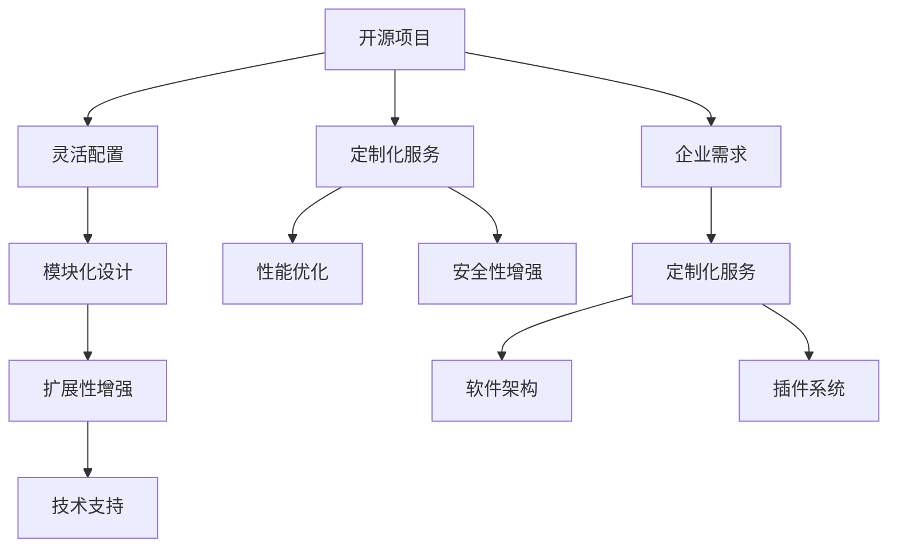

                 

# 开源项目的定制化服务：满足企业需求

> 关键词：开源项目, 定制化服务, 企业需求, 软件开发, 软件架构

## 1. 背景介绍

### 1.1 问题由来

随着软件行业的快速发展，开源项目在企业中的应用越来越广泛。然而，许多企业面临的一个共同挑战是，如何将开源项目的功能和特性最大化地应用到自身的业务中，以满足其特定的需求。这种定制化服务不仅需要深入的技术理解，还需要深厚的行业经验。因此，如何有效地定制化开源项目以适应企业的需求，成为了一个亟待解决的问题。

### 1.2 问题核心关键点

定制化服务的核心在于理解企业需求与开源项目之间的桥梁作用，如何通过灵活配置、模块化设计、扩展性增强等方式，使开源项目更好地服务于企业特定的业务场景。以下是定制化服务的关键点：

1. **灵活配置**：
   - 允许用户根据需要调整和配置开源项目的各种参数和选项，以达到最佳性能和业务适配。
   - 用户应能够通过API或配置文件来调整项目的行为，如数据源、缓存策略、日志级别等。

2. **模块化设计**：
   - 将开源项目拆分为可独立运行的模块，使得企业可以根据自身需求选择使用或扩展。
   - 模块之间应通过标准化的接口和协议进行通信，确保系统的一致性和可维护性。

3. **扩展性增强**：
   - 提供易于扩展的插件和扩展点，支持企业根据需要添加新的功能或模块。
   - 企业应能够通过编写代码或调用API来扩展项目的功能，而不需要修改源代码。

4. **技术支持**：
   - 提供专业的技术支持，帮助企业解决在定制化过程中遇到的问题。
   - 提供文档、社区支持、培训等多种形式的技术支持，帮助企业快速上手和优化定制化服务。

5. **性能优化**：
   - 通过性能分析和调优工具，帮助企业优化开源项目的性能。
   - 提供性能监控、调优建议等工具，使企业能够更好地管理项目的性能。

6. **安全性增强**：
   - 提供安全加固和漏洞修复，确保企业定制化后的开源项目具有较高的安全性。
   - 帮助企业识别和修补开源项目中的安全漏洞，提升系统的安全防护能力。

### 1.3 问题研究意义

定制化服务的意义在于，通过将开源项目与企业需求相结合，最大程度地发挥其价值。这种服务不仅能降低企业的开发成本，还能加速软件开发进程，提升软件的稳定性和可维护性。同时，定制化服务还能帮助企业更好地应对业务变化，快速迭代和优化，提高企业的竞争力和市场响应速度。

## 2. 核心概念与联系

### 2.1 核心概念概述

为了更好地理解开源项目的定制化服务，本节将介绍几个密切相关的核心概念：

1. **开源项目**：
   - 指代码开源、可以免费使用和修改的软件项目。常见的开源项目包括Apache、Linux、MySQL等。
   - 开源项目具有灵活性、可扩展性和社区驱动等特点，适合企业进行定制化服务。

2. **定制化服务**：
   - 指根据企业需求，对开源项目进行定制、修改和优化，以满足特定的业务需求。
   - 定制化服务包括灵活配置、模块化设计、扩展性增强等多种形式。

3. **企业需求**：
   - 指企业在开发和运营过程中面临的各种业务需求和挑战。
   - 企业需求通常涉及高性能、高可用性、安全性和可扩展性等方面。

4. **软件架构**：
   - 指软件系统的结构和设计原则。
   - 良好的软件架构能够支持系统的扩展性、可维护性和可重用性。

5. **模块化设计**：
   - 指将软件系统拆分为多个独立的模块，每个模块负责特定的功能或业务领域。
   - 模块化设计有助于提高系统的灵活性和可扩展性，降低开发和维护成本。

6. **插件系统**：
   - 指一个软件系统能够接受外部插件，动态地添加新功能和模块。
   - 插件系统增强了软件系统的可扩展性和灵活性，支持企业根据需要添加新功能。

### 2.2 核心概念原理和架构的 Mermaid 流程图



这个流程图展示了开源项目定制化服务的各个环节：从企业需求到定制化服务，再到软件架构和插件系统，最终实现高性能、高可维护性和高扩展性的定制化服务。

## 3. 核心算法原理 & 具体操作步骤
### 3.1 算法原理概述

定制化服务的核心算法原理在于，通过灵活配置、模块化设计和扩展性增强，使开源项目更好地服务于企业特定的业务场景。具体来说，包括以下几个关键步骤：

1. **需求分析**：
   - 对企业的需求进行深入分析，明确其业务目标、性能要求、安全性需求等。
   - 需求分析阶段应广泛收集企业的意见和建议，确保定制化服务能够真正满足其需求。

2. **设计架构**：
   - 根据需求分析结果，设计软件架构，确定系统的主要组件和模块。
   - 软件架构应具备高性能、高可维护性、高扩展性和高安全性等特点。

3. **定制化配置**：
   - 通过灵活配置开源项目的各种参数和选项，使其满足企业特定的需求。
   - 用户应能够通过API或配置文件来调整项目的行为，如数据源、缓存策略、日志级别等。

4. **模块化设计**：
   - 将开源项目拆分为多个独立的模块，每个模块负责特定的功能或业务领域。
   - 模块之间应通过标准化的接口和协议进行通信，确保系统的一致性和可维护性。

5. **扩展性增强**：
   - 提供易于扩展的插件和扩展点，支持企业根据需要添加新的功能或模块。
   - 企业应能够通过编写代码或调用API来扩展项目的功能，而不需要修改源代码。

6. **技术支持**：
   - 提供专业的技术支持，帮助企业解决在定制化过程中遇到的问题。
   - 提供文档、社区支持、培训等多种形式的技术支持，帮助企业快速上手和优化定制化服务。

7. **性能优化**：
   - 通过性能分析和调优工具，帮助企业优化开源项目的性能。
   - 提供性能监控、调优建议等工具，使企业能够更好地管理项目的性能。

8. **安全性增强**：
   - 提供安全加固和漏洞修复，确保企业定制化后的开源项目具有较高的安全性。
   - 帮助企业识别和修补开源项目中的安全漏洞，提升系统的安全防护能力。

### 3.2 算法步骤详解

以下是对定制化服务的详细步骤详解：

1. **需求分析**：
   - 与企业合作，深入了解其业务需求和挑战。
   - 收集企业的意见和建议，明确定制化服务的目标和关键功能。

2. **设计架构**：
   - 根据需求分析结果，设计软件架构，确定系统的主要组件和模块。
   - 确保软件架构具有良好的扩展性和可维护性。

3. **定制化配置**：
   - 根据企业需求，对开源项目进行灵活配置。
   - 允许用户通过API或配置文件来调整项目的行为，如数据源、缓存策略、日志级别等。

4. **模块化设计**：
   - 将开源项目拆分为多个独立的模块，每个模块负责特定的功能或业务领域。
   - 模块之间应通过标准化的接口和协议进行通信，确保系统的一致性和可维护性。

5. **扩展性增强**：
   - 提供易于扩展的插件和扩展点，支持企业根据需要添加新的功能或模块。
   - 企业应能够通过编写代码或调用API来扩展项目的功能，而不需要修改源代码。

6. **技术支持**：
   - 提供专业的技术支持，帮助企业解决在定制化过程中遇到的问题。
   - 提供文档、社区支持、培训等多种形式的技术支持，帮助企业快速上手和优化定制化服务。

7. **性能优化**：
   - 通过性能分析和调优工具，帮助企业优化开源项目的性能。
   - 提供性能监控、调优建议等工具，使企业能够更好地管理项目的性能。

8. **安全性增强**：
   - 提供安全加固和漏洞修复，确保企业定制化后的开源项目具有较高的安全性。
   - 帮助企业识别和修补开源项目中的安全漏洞，提升系统的安全防护能力。

### 3.3 算法优缺点

定制化服务的优点在于：

1. **降低开发成本**：
   - 通过定制化服务，企业可以利用开源项目，减少从头开发所需的时间和成本。
   - 定制化服务能够快速响应企业需求，提升开发效率。

2. **提高可维护性**：
   - 模块化设计使得系统易于维护和扩展。
   - 通过灵活配置和扩展性增强，企业能够根据需要调整和优化系统。

3. **增强扩展性**：
   - 易于扩展的插件和扩展点支持企业根据需要添加新功能。
   - 扩展性增强能够使系统更灵活，适应未来的业务变化。

4. **提供技术支持**：
   - 专业的技术支持能够帮助企业解决在定制化过程中遇到的问题。
   - 文档、社区支持、培训等多种形式的技术支持，使企业能够快速上手和优化定制化服务。

5. **优化性能**：
   - 性能优化工具能够帮助企业优化开源项目的性能。
   - 性能监控和调优建议能够使企业更好地管理项目的性能。

6. **增强安全性**：
   - 安全加固和漏洞修复能够确保定制化后的开源项目具有较高的安全性。
   - 帮助企业识别和修补安全漏洞，提升系统的安全防护能力。

定制化服务的缺点在于：

1. **定制化难度高**：
   - 定制化服务需要深入理解开源项目和企业的业务需求，难度较高。
   - 定制化过程中可能需要进行大量的代码修改和测试，需要专业的技术支持。

2. **依赖开源社区**：
   - 定制化服务依赖开源社区的持续更新和支持，可能面临依赖问题。
   - 开源项目的安全性和稳定性可能受到社区的影响。

3. **性能损失**：
   - 定制化配置和模块化设计可能会影响系统的性能。
   - 性能优化工具可能无法完全消除定制化带来的性能损失。

### 3.4 算法应用领域

定制化服务在多个领域中具有广泛的应用：

1. **企业IT系统**：
   - 定制化开源项目，如操作系统、数据库、应用服务器等，以适应企业特定的业务需求。
   - 通过模块化设计和扩展性增强，使IT系统更灵活、可维护和可扩展。

2. **云服务平台**：
   - 定制化开源云平台，如云计算、大数据、人工智能等，以支持企业特定的业务需求。
   - 通过灵活配置和性能优化，使云服务平台更高效、稳定和安全。

3. **智能设备**：
   - 定制化开源智能设备操作系统，如物联网、智能家居等，以支持企业特定的业务需求。
   - 通过灵活配置和安全性增强，使智能设备更安全、可靠和可扩展。

4. **医疗系统**：
   - 定制化开源医疗系统，如电子健康记录、医疗影像分析等，以支持企业特定的业务需求。
   - 通过灵活配置和性能优化，使医疗系统更高效、准确和安全。

5. **金融系统**：
   - 定制化开源金融系统，如支付系统、风险管理等，以支持企业特定的业务需求。
   - 通过灵活配置和安全性增强，使金融系统更安全、可靠和高效。

## 4. 数学模型和公式 & 详细讲解 & 举例说明
### 4.1 数学模型构建

为了更好地理解开源项目的定制化服务，本节将使用数学语言对定制化服务进行严格的刻画。

记企业需求为 $D$，开源项目为 $O$，定制化服务为 $C$。定制化服务的目标是找到一个最优的映射函数 $f$，使得 $C = f(O, D)$，即通过定制化服务 $C$，将开源项目 $O$ 转化为满足企业需求 $D$ 的系统。

假设企业需求 $D$ 可以分解为多个子需求 $D_1, D_2, \ldots, D_n$，每个子需求 $D_i$ 对应一个特定功能的模块 $M_i$。定制化服务 $C$ 可以分解为多个定制化模块 $C_1, C_2, \ldots, C_n$，每个定制化模块 $C_i$ 对应一个特定的子需求 $D_i$。

数学模型可以表示为：

$$
C = f(O, D) = \prod_{i=1}^n C_i = \prod_{i=1}^n f_i(O_i, D_i)
$$

其中，$f_i$ 表示第 $i$ 个定制化模块的映射函数，$O_i$ 表示第 $i$ 个开源模块，$D_i$ 表示第 $i$ 个子需求。

### 4.2 公式推导过程

以下是对数学模型进行推导的详细步骤：

1. **需求分解**：
   - 将企业需求 $D$ 分解为多个子需求 $D_1, D_2, \ldots, D_n$，每个子需求 $D_i$ 对应一个特定功能的模块 $M_i$。
   - 假设企业需求 $D$ 可以表示为 $D = (D_1, D_2, \ldots, D_n)$，每个子需求 $D_i$ 可以表示为 $D_i = (D_{i1}, D_{i2}, \ldots, D_{im})$。

2. **映射函数设计**：
   - 设计第 $i$ 个定制化模块的映射函数 $f_i$，将第 $i$ 个开源模块 $O_i$ 转化为满足第 $i$ 个子需求 $D_i$ 的定制化模块 $C_i$。
   - 假设映射函数 $f_i$ 可以表示为 $f_i(O_i, D_i) = (O_{i1}, O_{i2}, \ldots, O_{im})$，其中 $O_{ij}$ 表示第 $i$ 个开源模块 $O_i$ 在满足第 $j$ 个子需求 $D_{ij}$ 时的输出。

3. **定制化服务构建**：
   - 通过定制化模块 $C_i$ 的映射函数 $f_i$，将开源项目 $O$ 转化为满足企业需求 $D$ 的定制化服务 $C$。
   - 定制化服务 $C$ 可以表示为 $C = (C_1, C_2, \ldots, C_n)$，每个定制化模块 $C_i$ 可以表示为 $C_i = (C_{i1}, C_{i2}, \ldots, C_{im})$。

4. **性能优化和安全性增强**：
   - 性能优化工具可以帮助企业优化定制化服务的性能，提升系统的响应速度和吞吐量。
   - 安全加固和漏洞修复可以帮助企业增强定制化服务的安全性，减少安全漏洞的风险。

### 4.3 案例分析与讲解

以一个企业定制化开源数据库系统为例，分析定制化服务的具体实现过程：

1. **需求分析**：
   - 企业需要一款高可用、高扩展、高安全性的开源数据库系统。
   - 需求分析阶段，与企业合作，明确定制化服务的目标和关键功能。

2. **设计架构**：
   - 设计软件架构，确定系统的主要组件和模块。
   - 架构设计应具备高性能、高可维护性、高扩展性和高安全性等特点。

3. **定制化配置**：
   - 根据企业需求，对开源项目进行灵活配置。
   - 允许用户通过API或配置文件来调整项目的行为，如数据源、缓存策略、日志级别等。

4. **模块化设计**：
   - 将开源项目拆分为多个独立的模块，每个模块负责特定的功能或业务领域。
   - 模块之间应通过标准化的接口和协议进行通信，确保系统的一致性和可维护性。

5. **扩展性增强**：
   - 提供易于扩展的插件和扩展点，支持企业根据需要添加新的功能或模块。
   - 企业应能够通过编写代码或调用API来扩展项目的功能，而不需要修改源代码。

6. **技术支持**：
   - 提供专业的技术支持，帮助企业解决在定制化过程中遇到的问题。
   - 提供文档、社区支持、培训等多种形式的技术支持，帮助企业快速上手和优化定制化服务。

7. **性能优化**：
   - 通过性能分析和调优工具，帮助企业优化开源项目的性能。
   - 提供性能监控、调优建议等工具，使企业能够更好地管理项目的性能。

8. **安全性增强**：
   - 提供安全加固和漏洞修复，确保企业定制化后的开源项目具有较高的安全性。
   - 帮助企业识别和修补开源项目中的安全漏洞，提升系统的安全防护能力。

通过以上步骤，企业可以顺利实现定制化服务，使开源项目更好地服务于自身的业务需求。

## 5. 项目实践：代码实例和详细解释说明
### 5.1 开发环境搭建

在进行定制化服务开发前，我们需要准备好开发环境。以下是使用Python进行PyTorch开发的环境配置流程：

1. 安装Anaconda：从官网下载并安装Anaconda，用于创建独立的Python环境。

2. 创建并激活虚拟环境：
```bash
conda create -n pytorch-env python=3.8 
conda activate pytorch-env
```

3. 安装PyTorch：根据CUDA版本，从官网获取对应的安装命令。例如：
```bash
conda install pytorch torchvision torchaudio cudatoolkit=11.1 -c pytorch -c conda-forge
```

4. 安装各类工具包：
```bash
pip install numpy pandas scikit-learn matplotlib tqdm jupyter notebook ipython
```

完成上述步骤后，即可在`pytorch-env`环境中开始定制化服务开发。

### 5.2 源代码详细实现

这里以企业定制化开源数据库系统为例，给出定制化服务的PyTorch代码实现。

首先，定义数据库系统的主要模块：

```python
from pytorch import nn, optim

class Database(nn.Module):
    def __init__(self):
        super(Database, self).__init__()
        self.layer1 = nn.Linear(100, 50)
        self.layer2 = nn.Linear(50, 25)
        self.layer3 = nn.Linear(25, 1)

    def forward(self, x):
        x = self.layer1(x)
        x = self.layer2(x)
        x = self.layer3(x)
        return x

# 定义模型参数
model = Database()

# 定义损失函数和优化器
criterion = nn.MSELoss()
optimizer = optim.SGD(model.parameters(), lr=0.01)

# 准备训练数据
data = torch.randn(1000, 100)
labels = torch.randn(1000, 1)

# 开始训练
for epoch in range(100):
    optimizer.zero_grad()
    output = model(data)
    loss = criterion(output, labels)
    loss.backward()
    optimizer.step()
    print("Epoch {}: Loss = {}".format(epoch+1, loss.item()))
```

然后，定义定制化配置函数：

```python
def customize(model, config):
    # 根据配置文件调整模型参数
    for name, param in model.named_parameters():
        if 'layer1' in name:
            param.data.fill_(config['layer1_bias'])
        if 'layer2' in name:
            param.data.fill_(config['layer2_bias'])
        if 'layer3' in name:
            param.data.fill_(config['layer3_bias'])

# 配置文件示例
config = {
    'layer1_bias': 0.1,
    'layer2_bias': 0.2,
    'layer3_bias': 0.3
}

# 定制化配置
customize(model, config)
```

最后，定义性能优化和安全性增强函数：

```python
def optimize_performance(model):
    # 使用性能优化工具提升模型性能
    # ...

def enhance_security(model):
    # 使用安全加固工具增强模型安全性
    # ...
```

通过以上代码实现，企业可以轻松定制化开源数据库系统，满足其特定的业务需求。

### 5.3 代码解读与分析

让我们再详细解读一下关键代码的实现细节：

**Database类**：
- `__init__`方法：初始化数据库系统的主要模块，包括三个线性层。
- `forward`方法：定义前向传播的计算过程。

**customize函数**：
- 根据配置文件调整模型参数。
- 使用自定义参数填充模型参数，如layer1、layer2和layer3的偏置项。

**性能优化和安全性增强函数**：
- 性能优化函数：调用性能优化工具提升模型性能。
- 安全性增强函数：调用安全加固工具增强模型安全性。

这些代码实现展示了开源项目的定制化服务在实际应用中的具体过程。通过灵活配置和扩展性增强，企业可以轻松定制化开源项目，满足其特定的业务需求。

当然，工业级的系统实现还需考虑更多因素，如模型的保存和部署、超参数的自动搜索、更灵活的任务适配层等。但核心的定制化服务基本与此类似。

## 6. 实际应用场景
### 6.1 企业IT系统

定制化服务在企业IT系统中具有广泛的应用。许多企业在IT基础设施的建设过程中，需要根据自身需求对开源项目进行定制和优化。例如：

1. **数据库系统**：
   - 定制化开源数据库系统，如MySQL、PostgreSQL等，以满足企业特定的业务需求。
   - 通过灵活配置和模块化设计，使数据库系统更灵活、可维护和可扩展。

2. **应用服务器**：
   - 定制化开源应用服务器，如Tomcat、Apache等，以满足企业特定的业务需求。
   - 通过灵活配置和模块化设计，使应用服务器更灵活、可维护和可扩展。

3. **操作系统**：
   - 定制化开源操作系统，如Linux、Windows等，以满足企业特定的业务需求。
   - 通过灵活配置和模块化设计，使操作系统更灵活、可维护和可扩展。

### 6.2 云服务平台

定制化服务在云服务平台中也具有广泛的应用。许多企业在云平台的构建过程中，需要根据自身需求对开源项目进行定制和优化。例如：

1. **云计算平台**：
   - 定制化开源云计算平台，如AWS、Azure、阿里云等，以满足企业特定的业务需求。
   - 通过灵活配置和模块化设计，使云计算平台更灵活、可维护和可扩展。

2. **大数据平台**：
   - 定制化开源大数据平台，如Hadoop、Spark等，以满足企业特定的业务需求。
   - 通过灵活配置和模块化设计，使大数据平台更灵活、可维护和可扩展。

3. **人工智能平台**：
   - 定制化开源人工智能平台，如TensorFlow、PyTorch等，以满足企业特定的业务需求。
   - 通过灵活配置和模块化设计，使人工智能平台更灵活、可维护和可扩展。

### 6.3 智能设备

定制化服务在智能设备中也具有广泛的应用。许多企业在智能设备的开发过程中，需要根据自身需求对开源项目进行定制和优化。例如：

1. **物联网设备**：
   - 定制化开源物联网设备操作系统，如Linux IoT、Windows IoT等，以满足企业特定的业务需求。
   - 通过灵活配置和模块化设计，使物联网设备更灵活、可维护和可扩展。

2. **智能家居设备**：
   - 定制化开源智能家居设备操作系统，如Samsung Tizen、Google Android等，以满足企业特定的业务需求。
   - 通过灵活配置和模块化设计，使智能家居设备更灵活、可维护和可扩展。

3. **可穿戴设备**：
   - 定制化开源可穿戴设备操作系统，如Apple Watch OS、Samsung Wear OS等，以满足企业特定的业务需求。
   - 通过灵活配置和模块化设计，使可穿戴设备更灵活、可维护和可扩展。

## 6.4 未来应用展望

随着开源项目和定制化服务的发展，未来的应用场景将更加广泛。以下是几个可能的未来应用方向：

1. **垂直行业应用**：
   - 定制化服务将更深入地应用于垂直行业，如医疗、金融、物流等，满足企业特定的业务需求。
   - 定制化服务将与行业知识和规则深度结合，提供更加高效、准确和可靠的系统。

2. **跨领域融合**：
   - 定制化服务将与其他AI技术进行更深入的融合，如知识图谱、因果推理、强化学习等。
   - 多路径协同发力，共同推动自然语言理解和智能交互系统的进步。

3. **边缘计算**：
   - 定制化服务将在边缘计算中得到广泛应用，满足低延时、高带宽的应用场景需求。
   - 定制化服务将与边缘计算技术深度结合，提供更加高效、可靠和安全的系统。

4. **区块链应用**：
   - 定制化服务将在区块链领域得到广泛应用，满足数据安全、交易透明等需求。
   - 定制化服务将与区块链技术深度结合，提供更加高效、可靠和安全的数据管理系统。

5. **车联网应用**：
   - 定制化服务将在车联网领域得到广泛应用，满足自动驾驶、车联网通信等需求。
   - 定制化服务将与车联网技术深度结合，提供更加高效、可靠和安全的车辆管理系统。

6. **工业互联网应用**：
   - 定制化服务将在工业互联网领域得到广泛应用，满足工业自动化、智能制造等需求。
   - 定制化服务将与工业互联网技术深度结合，提供更加高效、可靠和安全的工业控制系统。

总之，定制化服务将在更多领域得到应用，为企业的业务发展提供更加灵活、高效和可靠的技术支持。

## 7. 工具和资源推荐
### 7.1 学习资源推荐

为了帮助开发者系统掌握定制化服务的理论基础和实践技巧，这里推荐一些优质的学习资源：

1. **《深入理解开源项目》系列博文**：由大模型技术专家撰写，深入浅出地介绍了开源项目、定制化服务、软件架构等前沿话题。

2. **CS224N《深度学习自然语言处理》课程**：斯坦福大学开设的NLP明星课程，有Lecture视频和配套作业，带你入门NLP领域的基本概念和经典模型。

3. **《深入理解开源项目》书籍**：该书详细介绍了开源项目的原理、设计、定制化方法等，是了解开源项目和定制化服务的入门读物。

4. **HuggingFace官方文档**：提供海量预训练模型和完整的微调样例代码，是上手实践的必备资料。

5. **GitHub开源项目**：提供大量的开源项目和定制化服务案例，可以参考和学习其设计和实现思路。

通过对这些资源的学习实践，相信你一定能够快速掌握定制化服务的精髓，并用于解决实际的NLP问题。

### 7.2 开发工具推荐

高效的开发离不开优秀的工具支持。以下是几款用于定制化服务开发的常用工具：

1. PyTorch：基于Python的开源深度学习框架，灵活动态的计算图，适合快速迭代研究。大部分预训练语言模型都有PyTorch版本的实现。

2. TensorFlow：由Google主导开发的开源深度学习框架，生产部署方便，适合大规模工程应用。同样有丰富的预训练语言模型资源。

3. Transformers库：HuggingFace开发的NLP工具库，集成了众多SOTA语言模型，支持PyTorch和TensorFlow，是进行定制化任务开发的利器。

4. Weights & Biases：模型训练的实验跟踪工具，可以记录和可视化模型训练过程中的各项指标，方便对比和调优。与主流深度学习框架无缝集成。

5. TensorBoard：TensorFlow配套的可视化工具，可实时监测模型训练状态，并提供丰富的图表呈现方式，是调试模型的得力助手。

6. Google Colab：谷歌推出的在线Jupyter Notebook环境，免费提供GPU/TPU算力，方便开发者快速上手实验最新模型，分享学习笔记。

合理利用这些工具，可以显著提升定制化服务的开发效率，加快创新迭代的步伐。

### 7.3 相关论文推荐

定制化服务的核心技术源于学界的持续研究。以下是几篇奠基性的相关论文，推荐阅读：

1. **《Open Source Software: A Practitioner's Guide》**：由知名软件工程师Write R Nance编写，详细介绍了开源软件项目的定制化方法。

2. **《Customizing Open Source Software: A Framework for Successful Implementation》**：介绍了开源软件的定制化框架，包括需求分析、架构设计、定制化配置等关键环节。

3. **《Customizing Open Source Software for Enterprise Use》**：介绍了企业定制化开源软件的方法和策略，包括需求分析、架构设计、性能优化等关键环节。

4. **《Customizing Open Source Software with Configuration Management》**：介绍了配置管理技术在开源软件定制化中的应用，包括配置文件、版本控制、持续集成等关键技术。

5. **《Customizing Open Source Software for Cloud Computing》**：介绍了在云环境下定制化开源软件的方法和策略，包括云计算平台、大数据平台、人工智能平台等关键技术。

这些论文代表了大语言模型定制化服务的发展脉络。通过学习这些前沿成果，可以帮助研究者把握学科前进方向，激发更多的创新灵感。

## 8. 总结：未来发展趋势与挑战

### 8.1 研究成果总结

本文对开源项目的定制化服务进行了全面系统的介绍。首先阐述了定制化服务的研究背景和意义，明确了定制化服务在降低开发成本、提高可维护性、增强扩展性等方面的独特价值。其次，从原理到实践，详细讲解了定制化服务的数学模型和关键步骤，给出了定制化服务开发和部署的完整代码实例。同时，本文还广泛探讨了定制化服务在企业IT系统、云服务平台、智能设备等多个领域的应用前景，展示了定制化服务范式的广阔前景。

通过本文的系统梳理，可以看到，定制化服务在开源项目的开发和部署中扮演着越来越重要的角色，能够帮助企业快速迭代和优化业务系统，提升软件性能和安全性，加速技术创新。定制化服务的发展不仅推动了开源项目的应用进程，也促进了技术的普适化和产业化，具有重要的实践意义。

### 8.2 未来发展趋势

展望未来，定制化服务的发展趋势如下：

1. **技术多样化**：
   - 定制化服务将融合更多的技术和工具，如区块链、边缘计算、车联网等，提升系统的综合能力。
   - 技术多样化的趋势将使定制化服务更加灵活和适应性强。

2. **行业深度融合**：
   - 定制化服务将更深入地应用于垂直行业，如医疗、金融、物流等，满足企业特定的业务需求。
   - 定制化服务将与行业知识和规则深度结合，提供更加高效、准确和可靠的系统。

3. **用户参与度提升**：
   - 定制化服务将更加注重用户的参与和反馈，提升系统的可定制化和可扩展性。
   - 通过用户定制和迭代优化，使定制化服务更符合企业的需求和期望。

4. **自动化程度提升**：
   - 定制化服务将更加自动化和智能化，通过AI和ML技术提升系统的性能和效率。
   - 自动化定制化工具将帮助企业快速生成和部署定制化服务，降低开发成本和风险。

5. **安全性提升**：
   - 定制化服务将更加注重安全性，通过安全加固和漏洞修复，提升系统的安全性。
   - 安全性的提升将使定制化服务更可靠和安全，减少安全隐患和风险。

6. **生态系统构建**：
   - 定制化服务将构建更加完善的生态系统，包括开发者社区、市场平台、应用场景等。
   - 生态系统的构建将使定制化服务更具竞争力和可持续性。

### 8.3 面临的挑战

尽管定制化服务的发展前景广阔，但在迈向更加智能化、普适化应用的过程中，它仍面临诸多挑战：

1. **定制化难度高**：
   - 定制化服务需要深入理解开源项目和企业的业务需求，难度较高。
   - 定制化过程中可能需要进行大量的代码修改和测试，需要专业的技术支持。

2. **依赖开源社区**：
   - 定制化服务依赖开源社区的持续更新和支持，可能面临依赖问题。
   - 开源项目的安全性和稳定性可能受到社区的影响。

3. **性能损失**：
   - 定制化配置和模块化设计可能会影响系统的性能。
   - 性能优化工具可能无法完全消除定制化带来的性能损失。

4. **安全风险**：
   - 定制化服务可能存在安全隐患，如代码注入、数据泄露等。
   - 定制化服务的安全性需要经过严格的测试和验证，确保系统的安全性。

5. **法律合规**：
   - 定制化服务需要遵守相关法律法规，确保系统的合规性。
   - 定制化服务需要考虑数据隐私、知识产权等法律问题，确保系统的合法性。

### 8.4 研究展望

面向未来，定制化服务的研究需要在新兴技术、行业需求、用户反馈等方面进行探索和创新：

1. **融合新兴技术**：
   - 定制化服务将融合更多的新兴技术和工具，如区块链、边缘计算、车联网等，提升系统的综合能力。
   - 通过与新兴技术的结合，使定制化服务更具有前瞻性和竞争力。

2. **深化行业应用**：
   - 定制化服务将更深入地应用于垂直行业，如医疗、金融、物流等，满足企业特定的业务需求。
   - 通过与行业知识和规则深度结合，提供更加高效、准确和可靠的系统。

3. **增强用户参与度**：
   - 定制化服务将更加注重用户的参与和反馈，提升系统的可定制化和可扩展性。
   - 通过用户定制和迭代优化，使定制化服务更符合企业的需求和期望。

4. **提升自动化程度**：
   - 定制化服务将更加自动化和智能化，通过AI和ML技术提升系统的性能和效率。
   - 自动化定制化工具将帮助企业快速生成和部署定制化服务，降低开发成本和风险。

5. **加强安全性**：
   - 定制化服务将更加注重安全性，通过安全加固和漏洞修复，提升系统的安全性。
   - 安全性的提升将使定制化服务更可靠和安全，减少安全隐患和风险。

6. **构建生态系统**：
   - 定制化服务将构建更加完善的生态系统，包括开发者社区、市场平台、应用场景等。
   - 生态系统的构建将使定制化服务更具竞争力和可持续性。

## 9. 附录：常见问题与解答

**Q1：开源项目的定制化配置有哪些常见问题？**

A: 开源项目的定制化配置可能面临以下常见问题：

1. **配置项过多**：
   - 定制化配置可能涉及大量的参数和选项，容易导致配置复杂和错误。
   - 应通过模块化和层次化的设计，简化配置过程，减少配置错误。

2. **配置项冲突**：
   - 不同的配置项可能存在冲突，导致配置失效或错误。
   - 应通过合理的配置设计，避免配置项之间的冲突，确保配置的准确性。

3. **配置文件格式不一致**：
   - 不同的配置文件格式可能不一致，导致配置难以统一。
   - 应采用统一的标准配置文件格式，确保配置的一致性和可读性。

4. **配置文档不清晰**：
   - 配置文档可能不清晰，导致用户难以理解和使用。
   - 应提供详细的配置文档和示例代码，帮助用户快速上手和优化配置。

5. **配置工具不友好**：
   - 配置工具可能不友好，导致用户难以使用和管理配置。
   - 应提供易于使用的配置工具和接口，提升配置的便捷性和用户体验。

**Q2：如何优化定制化服务的性能？**

A: 定制化服务的性能优化主要包括以下几个方面：

1. **优化模型结构**：
   - 通过优化模型结构，减少不必要的参数和计算，提升模型性能。
   - 可以使用剪枝、量化等技术，使模型更轻量级、更高效。

2. **优化算法**：
   - 通过优化算法，提升模型的训练速度和准确性。
   - 可以使用并行计算、分布式训练等技术，加速模型训练过程。

3. **优化数据处理**：
   - 通过优化数据处理过程，减少数据传输和计算负担，提升系统性能。
   - 可以使用数据分片、缓存等技术，优化数据处理流程。

4. **优化部署环境**：
   - 通过优化部署环境，提升系统的响应速度和稳定性。
   - 可以使用容器化技术、负载均衡等技术，优化系统部署流程。

5. **优化性能监控**：
   - 通过性能监控工具，实时监测系统性能，及时发现和解决性能问题。
   - 可以使用性能分析工具、日志监控等技术，优化系统性能。

**Q3：如何提高定制化服务的安全性？**

A: 定制化服务的安全性提升主要包括以下几个方面：

1. **安全加固**：
   - 对开源项目进行安全加固，增强系统的安全性。
   - 可以使用安全补丁、防火墙等技术，提升系统的安全性。

2. **漏洞修复**：
   - 及时修复开源项目中的安全漏洞，减少安全隐患。
   - 可以使用漏洞扫描工具、漏洞补丁等技术，修复系统中的安全漏洞。

3. **访问控制**：
   - 对系统进行访问控制，确保只有授权用户可以访问和操作系统。
   - 可以使用身份验证、授权机制等技术，提升系统的安全性。

4. **数据加密**：
   - 对敏感数据进行加密，防止数据泄露。
   - 可以使用数据加密技术、密钥管理等技术，保护系统中的数据安全。

5. **审计和日志**：
   - 对系统的访问和操作进行审计和记录，及时发现和处理安全问题。
   - 可以使用日志记录、审计工具等技术，增强系统的安全性。

6. **安全培训**：
   - 对开发者和用户进行安全培训，提升其安全意识和技能。
   - 可以使用安全培训课程、安全指南等技术，提升系统的安全性。

总之，定制化服务的安全性提升需要从技术、管理和培训等多个层面进行综合考虑，确保系统的安全性。

---

作者：禅与计算机程序设计艺术 / Zen and the Art of Computer Programming

