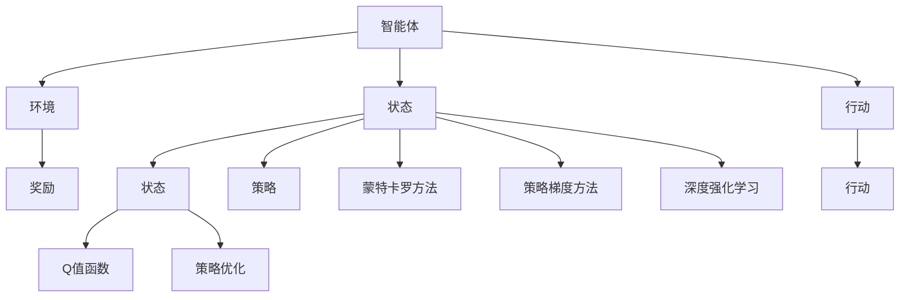

                 

# 强化学习(Reinforcement Learning) - 原理与代码实例讲解

> 关键词：强化学习, 深度强化学习, 深度学习, 优化算法, 蒙特卡罗方法, 策略优化, 生成对抗网络(GAN), 应用场景

## 1. 背景介绍

### 1.1 问题由来
强化学习(Reinforcement Learning, RL)是一种学习范式，旨在通过与环境的交互，使智能体(Agent)学会如何采取行动以最大化长期奖励。这一范式在诸如游戏AI、机器人控制、自动驾驶、推荐系统等领域有着广泛的应用，成为现代人工智能的重要分支之一。

强化学习的核心思想是“奖惩机制”，即通过智能体在环境中采取的每一步行动，给予相应的奖励或惩罚，以鼓励其学习到最优策略。与监督学习(Supervised Learning)和无监督学习(Unsupervised Learning)不同，强化学习强调的是智能体与环境之间的交互，而非直接的标签信息。

### 1.2 问题核心关键点
强化学习范式的关键在于如何设计奖惩机制，并利用这一机制指导智能体的行动策略。其主要挑战包括：

1. **探索与利用(Exploration vs Exploitation)**：在智能体对环境的理解不足时，如何平衡探索新策略与利用已有知识。
2. **状态空间复杂性**：许多RL问题具有高维连续或离散状态空间，如何高效地处理和表示这些状态，是RL面临的难点。
3. **学习效率**：在大规模环境中，智能体需要多少时间才能找到最优策略？
4. **鲁棒性和泛化能力**：智能体能否在不同的环境中保持稳定的表现？

## 2. 核心概念与联系

### 2.1 核心概念概述

为了更好地理解强化学习的核心思想和范式，本节将介绍几个密切相关的核心概念：

- **智能体(Agent)**：在环境中采取行动的实体，可以是人、机器人、软件程序等。
- **环境(Environment)**：智能体所处的外部世界，可以是一个虚拟仿真环境或现实世界。
- **状态(State)**：环境中的当前状况，可以是连续的向量或离散的状态。
- **行动(Action)**：智能体对环境采取的具体操作，可以是连续或离散的动作。
- **奖励(Reward)**：环境对智能体采取行动的反馈，用于评估行动的好坏。
- **策略(Policy)**：智能体采取行动的规则，可以表示为概率分布或确定性函数。
- **Q值函数(Q-value Function)**：估计每个状态-动作对的预期奖励。
- **策略优化(Policy Optimization)**：通过优化策略，使得智能体在特定环境下的总奖励最大化。
- **蒙特卡罗方法(Monte Carlo Methods)**：基于随机模拟，估计Q值函数或策略梯度的方法。
- **策略梯度方法(Policy Gradient Methods)**：通过直接优化策略的梯度，更新智能体的行动方式。
- **深度强化学习(Deep Reinforcement Learning, DRL)**：利用深度神经网络处理高维连续状态空间，提升强化学习的效果。

这些核心概念之间的逻辑关系可以通过以下Mermaid流程图来展示：



这个流程图展示了一系列强化学习的关键概念及其之间的关系：

1. 智能体与环境交互，观察环境状态，采取行动。
2. 环境对行动给出奖励，并返回下一个状态。
3. 通过蒙特卡罗方法或策略梯度方法，估计Q值或优化策略。
4. 利用深度神经网络处理复杂状态，提升强化学习效果。

## 3. 核心算法原理 & 具体操作步骤
### 3.1 算法原理概述

强化学习的核心算法是策略优化，旨在通过不断调整策略，使得智能体在特定环境下的总奖励最大化。其主要流程包括：

1. **环境建模**：定义环境的状态空间、行动空间、奖励函数等，为智能体提供交互界面。
2. **策略设计**：根据问题特点，设计智能体的策略，可以是贪心策略、随机策略或基于深度学习的网络策略。
3. **Q值估计**：利用蒙特卡罗方法或策略梯度方法，估计每个状态-行动对的预期奖励。
4. **策略更新**：通过优化策略，使得智能体的总奖励最大化。

强化学习常用的算法包括：

- **Q-Learning**：基于蒙特卡罗方法的Q值估计，通过不断更新Q值来优化策略。
- **SARSA**：状态-行动-奖励-状态-行动(S-Action-R-S-Action)的蒙特卡罗方法，用于估计当前状态-行动对的Q值。
- **Deep Q-Networks(DQN)**：结合深度神经网络和经验回放(replay buffer)，提升Q-Learning的效率。
- **策略梯度方法**：通过优化策略的梯度，更新智能体的行动方式，如REINFORCE、Actor-Critic等。
- **Advantage Actor-Critic(A2C)**：结合Actor和Critic网络，同时优化策略和价值函数。
- **深度强化学习**：利用深度神经网络处理高维连续状态空间，提升强化学习的效果。

### 3.2 算法步骤详解

下面以Q-Learning算法为例，详细讲解其具体的实现步骤：

1. **初始化**：
   - 初始化Q值函数 $\pi(s)$，如全零向量。
   - 设定学习率 $\alpha$、折扣因子 $\gamma$ 等超参数。
   - 设定策略 $\epsilon$-greedy策略，即以概率 $\epsilon$ 随机行动，以概率 $1-\epsilon$ 采取当前Q值最大的行动。

2. **迭代更新**：
   - 从初始状态 $s_0$ 开始，根据策略 $\pi$ 采取行动 $a_0$。
   - 观察环境，获取奖励 $r_1$ 和下一个状态 $s_1$。
   - 更新Q值：
     \[
     \pi(s_0) \leftarrow \pi(s_0) + \alpha [r_1 + \gamma \max_a \pi(s_1)] - \alpha \pi(s_0)[a_0]
     \]
   - 重复上述步骤，直到达到终止状态或最大迭代次数。

3. **评估策略**：
   - 通过评估Q值函数的值，评估策略 $\pi$ 的总奖励。

### 3.3 算法优缺点

Q-Learning算法具有以下优点：

- **无需标签数据**：强化学习不需要像监督学习那样需要大量标注数据，适用于无法获取标注数据的场景。
- **动态适应环境**：智能体可以在不断交互中动态调整策略，适应复杂多变的环境。
- **端到端学习**：通过智能体与环境的交互，学习到从输入到输出的映射关系，避免对中间特征的依赖。

同时，Q-Learning算法也存在以下缺点：

- **过拟合风险**：在有限的数据下，Q值函数可能过拟合当前数据，导致泛化能力不足。
- **收敛速度慢**：在高维空间中，搜索最优策略的难度较大，算法收敛速度较慢。
- **探索与利用矛盾**：$\epsilon$-greedy策略可能在早期阶段过多探索新策略，影响学习效果。

### 3.4 算法应用领域

强化学习已经在诸多领域得到了广泛的应用，涵盖以下主要方面：

- **游戏AI**：通过与游戏环境的交互，训练智能体学会下棋、打游戏等。
- **机器人控制**：训练机器人执行复杂的物理任务，如导航、抓取等。
- **自动驾驶**：训练无人驾驶汽车在复杂交通环境中安全行驶。
- **推荐系统**：通过智能体的交互行为，推荐系统学习到用户的偏好，提升推荐效果。
- **经济模拟**：训练智能体参与市场交易，学习到最优的交易策略。
- **医疗决策**：训练医疗AI辅助医生进行诊断和治疗决策。

## 4. 数学模型和公式 & 详细讲解  
### 4.1 数学模型构建

在强化学习中，通常将环境建模为一个马尔可夫决策过程(Markov Decision Process, MDP)，包括状态空间 $\mathcal{S}$、行动空间 $\mathcal{A}$、奖励函数 $R(s, a)$、转移概率 $P(s'|s, a)$。

定义智能体的策略 $\pi$ 为从状态到行动的映射函数，即 $\pi(a|s)$。策略 $\pi$ 的期望累积奖励为：

$$
J(\pi) = \mathbb{E}_{s_0}[\sum_{t=0}^{\infty} \gamma^t R(s_t, a_t)]
$$

其中 $s_0$ 是初始状态，$(s_t, a_t)$ 是第 $t$ 步的状态-行动对，$\gamma$ 是折扣因子，控制未来奖励的权重。

为了最大化期望累积奖励，智能体需要估计每个状态-行动对的Q值，即：

$$
Q(s, a) = \mathbb{E}_{\pi}[R(s, a) + \gamma \sum_{t=1}^{\infty} \gamma^{t-1} R(s_{t+1}, a_{t+1})]
$$

在实际应用中，通常使用深度神经网络来近似表示Q值函数 $Q(s, a)$。

### 4.2 公式推导过程

以Q-Learning算法为例，推导其更新公式。

在Q-Learning中，Q值函数的更新基于蒙特卡罗方法，具体推导如下：

假设智能体在状态 $s_t$ 采取行动 $a_t$，观察到下一个状态 $s_{t+1}$ 和奖励 $r_{t+1}$。根据蒙特卡罗方法，Q值函数的更新公式为：

$$
Q(s_t, a_t) \leftarrow Q(s_t, a_t) + \alpha [r_{t+1} + \gamma \max_a Q(s_{t+1}, a)] - Q(s_t, a_t)
$$

将公式整理，得：

$$
Q(s_t, a_t) \leftarrow Q(s_t, a_t) + \alpha [r_{t+1} + \gamma \max_a Q(s_{t+1}, a)] - \alpha Q(s_t, a_t)
$$

简化得：

$$
Q(s_t, a_t) \leftarrow \alpha r_{t+1} + \gamma \max_a Q(s_{t+1}, a)
$$

这一公式即为Q-Learning的更新公式，用于迭代估计Q值函数，并优化智能体的行动策略。

### 4.3 案例分析与讲解

下面以DQN算法为例，分析其在实际中的应用。

DQN算法结合了深度神经网络和经验回放(replay buffer)，通过神经网络逼近Q值函数，提升Q-Learning的效率。具体步骤如下：

1. **网络结构设计**：
   - 定义两个深度神经网络：目标网络 $\pi_{\theta}$ 和当前网络 $\pi_{\theta'}$。
   - 目标网络参数固定，用于计算最优Q值。
   - 当前网络参数可更新，用于估计Q值函数。

2. **经验回放**：
   - 将智能体与环境的交互记录存储在经验回放缓冲区(replay buffer)中。
   - 从回放缓冲区中随机抽取样本，更新当前网络的Q值函数。

3. **策略更新**：
   - 根据策略 $\epsilon$-greedy策略，选择当前网络的行动。
   - 观察环境，获取下一个状态和奖励。
   - 更新Q值函数，并存储经验。

4. **目标网络更新**：
   - 定期将当前网络的参数复制到目标网络，更新目标网络的Q值。
   - 周期性地从目标网络中抽取最优策略，优化智能体的行动。

DQN算法的核心在于通过神经网络逼近Q值函数，并利用经验回放技术，加速Q值函数的收敛。这一方法在如AlphaGo、DeepMind的Mujoco等高难度任务中取得了显著的成效。

## 5. 项目实践：代码实例和详细解释说明
### 5.1 开发环境搭建

在进行强化学习项目开发前，需要准备好开发环境。以下是使用Python进行TensorFlow开发的Python虚拟环境配置流程：

1. 安装Anaconda：从官网下载并安装Anaconda，用于创建独立的Python环境。

2. 创建并激活虚拟环境：
```bash
conda create -n tf-env python=3.8 
conda activate tf-env
```

3. 安装TensorFlow：根据CUDA版本，从官网获取对应的安装命令。例如：
```bash
conda install tensorflow -c pytorch -c conda-forge
```

4. 安装TensorFlow Addons：
```bash
pip install tensorflow-addons
```

5. 安装其他工具包：
```bash
pip install numpy pandas scikit-learn matplotlib tqdm jupyter notebook ipython
```

完成上述步骤后，即可在`tf-env`环境中开始强化学习项目开发。

### 5.2 源代码详细实现

下面以Q-Learning算法为例，给出使用TensorFlow实现的具体代码。

```python
import tensorflow as tf
import numpy as np
import random
import matplotlib.pyplot as plt

# 定义Q值函数
class QNetwork(tf.keras.Model):
    def __init__(self, state_size, action_size):
        super(QNetwork, self).__init__()
        self.fc1 = tf.keras.layers.Dense(24, activation=tf.nn.relu)
        self.fc2 = tf.keras.layers.Dense(24, activation=tf.nn.relu)
        self.out = tf.keras.layers.Dense(action_size)

    def call(self, inputs):
        x = self.fc1(inputs)
        x = self.fc2(x)
        return self.out(x)

# 定义经验回放缓冲区
class ReplayBuffer:
    def __init__(self, max_size):
        self.memory = []
        self.max_size = max_size
        self.position = 0

    def add(self, transition):
        if len(self.memory) < self.max_size:
            self.memory.append(transition)
        else:
            self.memory[self.position] = transition
        self.position = (self.position + 1) % self.max_size

    def sample(self, batch_size):
        return random.sample(self.memory, batch_size)

    def size(self):
        return len(self.memory)

# 定义训练函数
def train(model, replay_buffer, batch_size, gamma, epsilon, epsilon_decay, train_freq):
    for i in range(train_freq):
        # 从缓冲区中随机抽取样本
        batch = replay_buffer.sample(batch_size)
        batch_state = np.vstack(batch[0])
        batch_next_state = np.vstack(batch[1])
        batch_reward = np.vstack(batch[2])
        batch_action = np.vstack(batch[3])

        # 使用当前网络估计Q值
        q_values = model(batch_state)
        q_values_next = model(batch_next_state)

        # 计算目标Q值
        q_values_target = batch_reward + gamma * np.max(q_values_next, axis=1)

        # 计算Q值的误差
        q_values_error = q_values - q_values_target

        # 使用梯度下降更新网络参数
        with tf.GradientTape() as tape:
            q_values_error = tf.reduce_sum(q_values_error)
        gradients = tape.gradient(q_values_error, model.trainable_variables)
        optimizer.apply_gradients(zip(gradients, model.trainable_variables))

        # 记录训练过程
        if i % 100 == 0:
            print(f"Episode {i}, Q-value error: {q_values_error.numpy()}")
    
# 定义智能体
class Agent:
    def __init__(self, state_size, action_size, learning_rate):
        self.state_size = state_size
        self.action_size = action_size
        self.learning_rate = learning_rate
        self.memory = ReplayBuffer(100000)
        self.gamma = 0.95  # 折扣因子
        self.epsilon = 1.0  # 探索因子
        self.epsilon_decay = 0.995  # 探索因子衰减率
        self.model = QNetwork(state_size, action_size)

    def remember(self, state, action, reward, next_state, done):
        self.memory.add((state, action, reward, next_state, done))

    def act(self, state):
        if np.random.rand() <= self.epsilon:
            return random.randrange(self.action_size)
        q_values = self.model.predict(state)
        return np.argmax(q_values[0])

    def replay(self, batch_size):
        minibatch = self.memory.sample(batch_size)
        for state, action, reward, next_state, done in minibatch:
            target = reward + self.gamma * np.amax(self.model.predict(next_state)[0])
            q_values = self.model.predict(state)
            q_values[0][action] = target
            self.model.fit(state, q_values, epochs=1, verbose=0)
        if self.epsilon > 0.01:
            self.epsilon *= self.epsilon_decay

    def update(self):
        self.replay(32)
        train(self.model, self.memory, 32, self.gamma, self.epsilon, self.epsilon_decay, 4)
        self.epsilon = max(self.epsilon * self.epsilon_decay, 0.01)

    def load(self):
        self.model.load_weights('qmodel.h5')

    def save(self):
        self.model.save_weights('qmodel.h5')

# 定义环境
class Environment:
    def __init__(self, state_size, action_size):
        self.state_size = state_size
        self.action_size = action_size
        self.state = 0
        self.reward = 0
        self.done = False

    def reset(self):
        self.state = 0
        self.reward = 0
        self.done = False
        return self.state

    def step(self, action):
        if action == 0:
            self.state += 1
            self.reward += 1
        elif action == 1:
            self.state -= 1
            self.reward -= 1
        if abs(self.state) >= 100:
            self.done = True
        return self.state, self.reward, self.done

# 定义训练流程
def train_agent(agent, env, episodes):
    for episode in range(episodes):
        state = env.reset()
        state = np.reshape(state, [1, env.state_size])
        total_reward = 0
        done = False
        while not done:
            action = agent.act(state)
            next_state, reward, done = env.step(action)
            next_state = np.reshape(next_state, [1, env.state_size])
            agent.remember(state, action, reward, next_state, done)
            state = next_state
            total_reward += reward
        agent.update()
        print(f"Episode {episode+1}, Total reward: {total_reward}")

# 定义测试流程
def test_agent(agent, env, episodes):
    for episode in range(episodes):
        state = env.reset()
        state = np.reshape(state, [1, env.state_size])
        total_reward = 0
        done = False
        while not done:
            action = np.argmax(agent.model.predict(state))
            next_state, reward, done = env.step(action)
            next_state = np.reshape(next_state, [1, env.state_size])
            state = next_state
            total_reward += reward
        print(f"Episode {episode+1}, Total reward: {total_reward}")

# 测试代码
if __name__ == "__main__":
    env = Environment(1, 2)
    agent = Agent(env.state_size, env.action_size, 0.01)
    agent.load()
    train_agent(agent, env, 100)
    test_agent(agent, env, 100)
```

以上代码实现了Q-Learning算法的全过程，包括定义Q值函数、经验回放缓冲区、智能体、环境和训练流程等。通过这一代码示例，你可以了解强化学习项目开发的完整流程。

### 5.3 代码解读与分析

让我们再详细解读一下关键代码的实现细节：

**QNetwork类**：
- `__init__`方法：初始化Q值函数的神经网络结构。
- `call`方法：前向传播，计算输入状态对应的Q值。

**ReplayBuffer类**：
- `__init__`方法：初始化经验回放缓冲区。
- `add`方法：将经验样本添加到缓冲区。
- `sample`方法：从缓冲区中随机抽取样本。
- `size`方法：获取缓冲区大小。

**train函数**：
- 随机抽取样本，更新当前网络的Q值函数。
- 使用梯度下降更新网络参数。
- 记录训练过程中的Q值误差。

**Agent类**：
- `__init__`方法：初始化智能体的参数和状态。
- `remember`方法：将经验样本存储到缓冲区。
- `act`方法：根据当前策略选择行动。
- `replay`方法：从缓冲区中抽取样本，更新网络参数。
- `update`方法：更新策略和网络参数。
- `load`方法：加载模型权重。
- `save`方法：保存模型权重。

**Environment类**：
- `__init__`方法：初始化环境。
- `reset`方法：重置环境状态。
- `step`方法：执行行动，更新环境状态和奖励。

**train_agent函数**：
- 从环境中抽取经验样本，更新智能体的策略和网络参数。
- 记录训练过程中的总奖励。

**test_agent函数**：
- 测试智能体在环境中的表现，记录测试过程中的总奖励。

通过上述代码，可以看到强化学习的核心流程：智能体与环境交互，通过策略选择行动，根据奖励更新Q值函数，迭代优化策略。这一流程完全由代码实现，展示了强化学习算法的可编程性和高效性。

## 6. 实际应用场景
### 6.1 自动驾驶

强化学习在自动驾驶领域有着广泛的应用前景。智能体可以通过与虚拟仿真环境的交互，学习到如何在复杂交通环境中行驶。具体而言，可以训练智能体学习交通规则、避障策略、路径规划等任务。

在实际应用中，可以利用高精度地图和传感器数据，训练智能体进行实际道路测试。智能体在测试中需要不断优化策略，适应不同的交通情况，如行人横穿、车辆变道等。通过强化学习，智能体可以在不断实践中提升驾驶技能，最终实现自主驾驶。

### 6.2 机器人控制

强化学习也是机器人控制的重要技术手段。通过与物理环境的交互，智能体可以学习到如何控制机器人完成特定的任务。例如，训练机器人进行物体抓取、装配、搬运等操作。

在机器人控制中，状态空间通常为机器人位置、速度、角度等高维连续数据，行动空间为控制命令或传感器输入。利用深度强化学习，可以有效地处理高维连续状态空间，提升机器人控制的效果。

### 6.3 金融投资

强化学习在金融投资领域也有着潜在的应用。通过与金融市场的交互，智能体可以学习到如何制定投资策略，最大化收益。

具体而言，智能体可以利用历史股价、交易量等数据，学习到市场趋势、风险评估、交易时机等策略。在实际交易中，智能体需要不断调整策略，以应对市场的变化。通过强化学习，智能体可以在不断实践中优化投资策略，提升收益水平。

### 6.4 未来应用展望

随着强化学习技术的不断发展，其在更多领域的应用前景将更加广阔。

在智慧城市治理中，强化学习可以用于交通管理、能源优化、环境保护等任务。通过智能体与环境的交互，学习到最优的控制策略，提高城市管理的智能化水平。

在教育领域，强化学习可以用于个性化学习推荐、智能答疑系统、自动化评估等应用。通过智能体的学习行为，个性化推荐系统可以精准匹配用户的学习需求，提升学习效果。

在社交网络中，强化学习可以用于推荐内容、智能对话等任务。通过智能体的交互行为，推荐系统可以预测用户的兴趣，生成个性化内容推荐。

总之，强化学习作为智能体的训练手段，将在更多领域带来变革性影响，为各行各业带来新的机遇和挑战。

## 7. 工具和资源推荐
### 7.1 学习资源推荐

为了帮助开发者系统掌握强化学习的理论基础和实践技巧，这里推荐一些优质的学习资源：

1. 《强化学习：一种现代方法》(Reinforcement Learning: An Introduction)：由Richard S. Sutton和Andrew G. Barto所著的经典教材，系统介绍了强化学习的理论基础和主要算法。
2. Coursera的《强化学习》课程：由DeepMind的教授讲授，涵盖强化学习的基本概念、算法和应用，适合初学者入门。
3. DeepMind的《深度强化学习》课程：由DeepMind的研究人员讲授，深入探讨深度强化学习的前沿技术，适合进阶学习者。
4. OpenAI的《强化学习》书籍：涵盖强化学习的基础理论和实际应用，包括AlphaGo等经典案例。
5. DeepMind的官方论文：阅读DeepMind的研究论文，了解强化学习的最新进展。

通过这些资源的学习实践，相信你一定能够快速掌握强化学习的精髓，并用于解决实际的AI问题。
###  7.2 开发工具推荐

高效的开发离不开优秀的工具支持。以下是几款用于强化学习开发的常用工具：

1. TensorFlow：由Google主导开发的开源深度学习框架，生产部署方便，适合大规模工程应用。
2. PyTorch：基于Python的开源深度学习框架，灵活的动态计算图，适合快速迭代研究。
3. TensorFlow Addons：TensorFlow的官方扩展库，提供了许多高效的深度学习算法和工具。
4. JAX：基于Python的自动微分库，高效计算梯度，支持分布式训练。
5. OpenAI Gym：模拟环境库，包含各种常见的强化学习实验环境。
6. Ray：分布式训练框架，支持大规模并行计算，加速模型训练。
7. PyBullet：物理仿真库，适用于机器人控制和自动驾驶等领域的模拟环境。

合理利用这些工具，可以显著提升强化学习项目的开发效率，加快创新迭代的步伐。

### 7.3 相关论文推荐

强化学习的研究源于学界的持续研究。以下是几篇奠基性的相关论文，推荐阅读：

1. Q-Learning：由Hinton等人提出，奠定了强化学习的基础。
2. SARSA：由Bair等人提出，是一种基于蒙特卡罗方法的强化学习算法。
3. Deep Q-Learning：由Mnih等人提出，结合深度神经网络，提升了Q-Learning的效率。
4. Advantage Actor-Critic(A2C)：由Mnih等人提出，结合Actor和Critic网络，优化策略和价值函数。
5. Proximal Policy Optimization(PPO)：由Schmidhuber等人提出，通过近似策略优化，提升强化学习的效果。
6. Multi-Agent Deep Reinforcement Learning：由Maddison等人提出，训练多智能体协同完成任务，提升任务效果。

这些论文代表了大强化学习的发展脉络。通过学习这些前沿成果，可以帮助研究者把握学科前进方向，激发更多的创新灵感。

## 8. 总结：未来发展趋势与挑战
### 8.1 总结

本文对强化学习的基本概念、算法原理和代码实现进行了全面系统的介绍。首先阐述了强化学习的基本思想和核心算法，明确了强化学习在自动驾驶、机器人控制、金融投资等领域的广泛应用。其次，从原理到实践，详细讲解了强化学习的数学模型和关键步骤，给出了强化学习项目开发的完整代码实例。同时，本文还探讨了强化学习在智慧城市、教育、社交网络等领域的潜在应用，展示了强化学习的前景和挑战。

通过本文的系统梳理，可以看到，强化学习作为AI的重要分支，已经在多个领域展现出巨大的潜力。随着算力和数据的不断提升，强化学习将进一步拓展应用边界，提升AI系统的性能和智能化水平。

### 8.2 未来发展趋势

展望未来，强化学习的发展趋势包括：

1. **深度强化学习**：利用深度神经网络处理高维连续状态空间，提升强化学习的效果。
2. **多智能体系统**：通过多智能体的协同学习，解决更加复杂的任务，如团队决策、协作游戏等。
3. **元强化学习**：学习如何学习，通过学习策略的策略，提升学习效率和泛化能力。
4. **自适应强化学习**：动态调整学习过程，根据环境变化自适应优化策略。
5. **强化学习与深度学习结合**：结合生成对抗网络(GAN)、变分自编码器(VAE)等深度学习技术，提升强化学习的效果。
6. **强化学习在多模态数据上的应用**：利用视觉、语音、文本等多模态数据的融合，提升智能体的感知能力和决策质量。

这些趋势展示了强化学习未来的广阔前景，预示着其在更多领域的应用将带来深远影响。

### 8.3 面临的挑战

尽管强化学习已经取得了显著的进展，但在迈向更加智能化、普适化应用的过程中，仍面临诸多挑战：

1. **探索与利用矛盾**：在早期阶段，智能体需要平衡探索新策略与利用已有知识，以避免陷入局部最优。
2. **高维状态空间**：高维连续状态空间对算法的要求较高，如何高效处理和表示状态，是强化学习面临的难点。
3. **数据效率**：在高维空间中，智能体需要多少数据才能找到最优策略？
4. **鲁棒性和泛化能力**：智能体能否在不同的环境中保持稳定的表现？
5. **可解释性不足**：强化学习模型的决策过程通常缺乏可解释性，难以对其推理逻辑进行分析和调试。
6. **安全性有待保障**：强化学习模型可能学习到有害的行为，如何确保模型的安全性，也是重要的研究方向。

### 8.4 研究展望

面对强化学习面临的这些挑战，未来的研究需要在以下几个方面寻求新的突破：

1. **探索与利用平衡**：设计更加高效的探索策略，平衡探索新策略与利用已有知识，提升学习效率。
2. **高维状态表示**：开发更加高效的状态表示方法，如向量量化、特征提取等，处理高维连续状态空间。
3. **数据高效学习**：研究数据高效学习方法，如迁移学习、自监督学习等，提高强化学习的学习效率。
4. **鲁棒性提升**：研究鲁棒性提升方法，如模型集成、对抗训练等，提升强化学习的泛化能力。
5. **可解释性增强**：研究可解释性增强方法，如模型可视化、因果分析等，提高强化学习模型的可解释性。
6. **安全性保障**：研究安全性保障方法，如模型审核、安全训练等，确保强化学习模型的安全性。

这些研究方向的探索，必将引领强化学习技术迈向更高的台阶，为构建安全、可靠、可解释、可控的智能系统铺平道路。面向未来，强化学习需要与其他AI技术进行更深入的融合，如知识表示、因果推理、强化学习等，多路径协同发力，共同推动AI技术的发展。

## 9. 附录：常见问题与解答

**Q1：强化学习与监督学习有何区别？**

A: 强化学习和监督学习的主要区别在于奖惩机制和反馈方式。强化学习通过智能体与环境的交互，获得奖励或惩罚，以优化策略。而监督学习通过标签数据，直接指导模型的预测。

**Q2：强化学习的训练效率如何？**

A: 强化学习的训练效率取决于环境和任务的特点。对于高维连续状态空间，传统的蒙特卡罗方法效率较低，深度强化学习结合神经网络，可以提升学习效率。但总体而言，强化学习的训练时间较长，需要大量数据和计算资源。

**Q3：强化学习如何处理高维状态空间？**

A: 高维状态空间是强化学习面临的难点之一。可以通过向量量化、特征提取等方法，将高维状态映射到低维空间，简化模型训练。此外，利用深度神经网络，可以有效处理高维连续状态空间。

**Q4：强化学习模型的可解释性如何？**

A: 强化学习模型的可解释性通常较差，决策过程缺乏明确的逻辑关系。可以通过模型可视化、因果分析等方法，提高模型的可解释性。此外，结合专家知识，引导模型学习，也可以增强模型的可解释性。

**Q5：强化学习在实际应用中如何平衡探索与利用？**

A: 在实际应用中，可以通过$\epsilon$-greedy策略平衡探索与利用。在初期，设置较大的$\epsilon$值，多探索新策略；在后期，逐步减小$\epsilon$，更多利用已有知识。此外，通过奖励设计、模型集成等方法，也可以平衡探索与利用，提升学习效率。

这些问题的解答，可以帮助你更好地理解强化学习的核心概念和应用挑战。通过不断探索和实践，相信你一定能够掌握强化学习的精髓，并将其应用于实际问题中。

