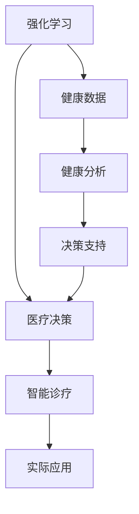

                 

# 强化学习Reinforcement Learning在医疗健康领域的应用探索

## 1. 背景介绍

### 1.1 问题由来

在医疗健康领域，传统的决策支持系统(Decision Support Systems, DSS)依赖专家经验、规则和数据驱动的方法，但在处理复杂的多模态数据和不确定性高、非结构化的医疗问题时，难以达到理想的决策效果。强化学习（Reinforcement Learning, RL）作为一种自主学习的方法，可以基于经验反馈不断优化决策策略，具有适应性强的特点，有望在医疗健康领域发挥重要作用。

### 1.2 问题核心关键点

强化学习在医疗健康领域的应用关键在于：
- 处理多模态数据（如电子病历、影像、基因数据等）。
- 应对不确定性和噪声（如患者症状、治疗效果的不确定性）。
- 优化临床决策策略（如药物选择、手术方案、康复治疗等）。
- 提升医疗质量和经济效益（减少误诊、误治，降低医疗成本）。
- 实现个性化医疗（针对不同患者的特定需求进行精准治疗）。

### 1.3 问题研究意义

强化学习在医疗健康领域的应用，有助于实现以下几个目标：
- 提高诊断和治疗的准确性。通过学习患者历史和实时数据，强化学习模型可以提供更准确的诊断和治疗建议。
- 优化资源配置。通过优化诊疗路径和资源分配，强化学习模型可以提升医疗系统的效率和效益。
- 促进医学研究和教育。通过模拟仿真环境，强化学习模型可以辅助医生进行新药物研发、手术训练等。
- 推动医疗健康技术的普及。通过智能诊断和治疗，强化学习模型有助于降低医疗门槛，提高医疗服务可及性。
- 提升医疗伦理和公平性。通过合规约束，强化学习模型可以增强决策过程的透明度和公平性。

## 2. 核心概念与联系

### 2.1 核心概念概述

为了更好地理解强化学习在医疗健康领域的应用，本节将介绍几个密切相关的核心概念：

- 强化学习（Reinforcement Learning, RL）：一种基于试错的学习范式，通过在环境中的交互，学习最优的行为策略。强化学习系统通过观察环境状态、执行动作、获取反馈奖励来不断优化策略。

- 健康（Health）：个体的生理、心理健康状态，包括疾病诊断、治疗效果、生命质量等。

- 医疗（Medical）：诊断、治疗、康复等与健康相关的专业活动，涉及医学知识、技术、伦理等多个方面。

- 健康数据分析（Health Data Analysis）：对医疗健康数据进行预处理、分析、建模的过程，以提取有用的健康信息。

- 决策支持系统（Decision Support System, DSS）：辅助医生进行临床决策的系统，包括专家系统、知识图谱、机器学习等多种技术。

- 智能诊疗（Smart Diagnosis and Treatment）：结合智能技术（如AI、RL），辅助医生进行更精准的诊断和治疗。

这些核心概念之间的逻辑关系可以通过以下Mermaid流程图来展示：



这个流程图展示了几大核心概念之间的逻辑关系：
1. 强化学习通过与健康数据互动，学习最优的医疗决策策略。
2. 健康数据需要通过数据分析来提取有价值的信息。
3. 决策支持系统结合知识图谱和专家系统，辅助强化学习提供更可靠的决策建议。
4. 智能诊疗系统集成多种智能技术，提升医疗决策的精准性。
5. 实际应用场景包括临床诊断、治疗方案优化等，强化学习在其中扮演重要角色。

## 3. 核心算法原理 & 具体操作步骤
### 3.1 算法原理概述

强化学习在医疗健康领域的应用，本质上是基于患者的状态和行为，通过不断的交互和学习，优化医疗决策策略的过程。其核心思想是：在模拟或实际医疗环境中，通过与环境的交互，强化学习模型不断调整策略，以最大化长期奖励（即提升患者健康和降低医疗成本）。

形式化地，假设医疗环境 $E$ 包含患者状态 $s_t$、诊疗动作 $a_t$、奖励信号 $r_t$ 和下一个状态 $s_{t+1}$。强化学习模型的目标是通过学习，在每一步 $t$ 选择最优的动作 $a_t$，最大化累积奖励 $\sum_{t=0}^{T}r_t$。

具体步骤包括：
1. 初始化模型参数 $\theta$。
2. 在环境 $E$ 中，以当前状态 $s_t$ 为输入，输出诊疗动作 $a_t$。
3. 执行动作 $a_t$，观察下一状态 $s_{t+1}$ 和奖励信号 $r_t$。
4. 根据奖励信号和下一个状态，更新模型参数 $\theta$。
5. 重复步骤2-4，直到达到终止状态或预设迭代次数。

### 3.2 算法步骤详解

强化学习在医疗健康领域的应用，通常包括以下几个关键步骤：

**Step 1: 定义状态空间和动作空间**
- 根据医疗问题的特点，定义状态空间 $S$ 和动作空间 $A$。状态空间包括患者的健康指标、诊断结果、治疗历史等，动作空间包括诊疗方案、药物选择、手术操作等。

**Step 2: 设计奖励函数**
- 定义奖励函数 $R(s_t,a_t,s_{t+1})$，用于衡量当前状态和动作对患者健康的提升程度。奖励函数应考虑多种因素，如治疗效果、患者舒适度、药物副作用等。

**Step 3: 选择强化学习算法**
- 根据问题的复杂度和数据规模，选择合适的强化学习算法，如Q-Learning、SARSA、DQN、PPO等。Q-Learning和SARSA适用于数据量较小、状态动作空间较小的问题，DQN适用于数据量较大、动作空间较大的问题，PPO适用于高维度、非连续的动作空间。

**Step 4: 初始化模型参数**
- 初始化强化学习模型的参数 $\theta$，通常为神经网络参数。

**Step 5: 训练强化学习模型**
- 在模拟或实际医疗环境中，反复执行以下步骤：
  1. 观察当前状态 $s_t$，根据策略 $\pi(s_t)$ 选择动作 $a_t$。
  2. 执行动作 $a_t$，观察下一个状态 $s_{t+1}$ 和奖励信号 $r_t$。
  3. 根据奖励信号和下一个状态，使用优化算法（如Adam、RMSprop等）更新模型参数 $\theta$。
  4. 记录训练过程中的状态、动作、奖励等数据。

**Step 6: 评估模型性能**
- 在验证集上测试模型的性能，根据评估指标（如准确率、召回率、F1分数等）评估模型的泛化能力。
- 使用超参数搜索（如网格搜索、贝叶斯优化等）优化模型的超参数，提高性能。

**Step 7: 部署模型**
- 将训练好的模型部署到实际医疗环境中，进行在线决策支持。
- 监控模型的性能，根据反馈数据不断调整模型参数，优化决策策略。

### 3.3 算法优缺点

强化学习在医疗健康领域的应用具有以下优点：
1. 自适应性。强化学习模型可以自动适应不断变化的医疗环境，学习最优的决策策略。
2. 动态调整。强化学习模型可以根据实时反馈数据，动态调整决策策略。
3. 泛化性强。强化学习模型可以从患者的个体数据中学习普适的决策策略，推广到其他患者。
4. 持续学习。强化学习模型可以不断学习新的数据，积累经验，提高决策质量。

同时，该方法也存在一些缺点：
1. 数据依赖。强化学习模型需要大量的标注数据进行训练，医疗领域的数据获取成本较高。
2. 鲁棒性不足。强化学习模型可能对异常数据或噪声敏感，导致决策失误。
3. 可解释性差。强化学习模型往往是黑盒模型，难以解释决策过程。
4. 计算复杂。强化学习模型的训练过程需要大量的计算资源，特别是在大规模医疗数据上。
5. 伦理问题。强化学习模型可能涉及隐私保护和伦理问题，如数据共享、治疗隐私等。

尽管存在这些局限性，但就目前而言，强化学习在医疗健康领域仍是一种具有巨大潜力的技术范式，值得深入探索和应用。

### 3.4 算法应用领域

强化学习在医疗健康领域的应用，涵盖多个方面：

- 临床诊断：通过学习患者的病历数据，强化学习模型可以辅助医生进行疾病诊断，识别症状和疾病。
- 治疗方案优化：通过学习不同治疗方案的效果和副作用，强化学习模型可以推荐最优的治疗方案。
- 手术辅助：通过模拟手术过程和机器人控制，强化学习模型可以辅助医生进行手术操作，提高手术成功率和安全性。
- 康复治疗：通过学习康复数据和行为反馈，强化学习模型可以推荐个性化的康复方案，促进患者恢复。
- 医疗资源优化：通过学习资源分配和利用数据，强化学习模型可以优化医疗资源的配置，提升医疗系统的效率。
- 健康管理：通过学习健康数据和行为数据，强化学习模型可以提供个性化的健康管理建议，提高生活质量。

除了上述这些具体应用外，强化学习还在医学研究和教育、医疗伦理和政策决策等多个领域发挥作用，展示出广阔的应用前景。

## 4. 数学模型和公式 & 详细讲解  
### 4.1 数学模型构建

本节将使用数学语言对强化学习在医疗健康领域的应用进行严格刻画。

假设医疗环境 $E$ 包含患者状态 $s_t$、诊疗动作 $a_t$、奖励信号 $r_t$ 和下一个状态 $s_{t+1}$。强化学习模型的目标是通过学习，在每一步 $t$ 选择最优的动作 $a_t$，最大化累积奖励 $\sum_{t=0}^{T}r_t$。定义状态空间 $S$、动作空间 $A$ 和奖励函数 $R$，则强化学习问题的数学模型为：

$$
\max_{\pi} \mathbb{E}_{s_0 \sim \rho_0} \sum_{t=0}^{T} R(s_t,a_t,s_{t+1})
$$

其中，$\pi$ 为策略函数，$\rho_0$ 为初始状态分布。

### 4.2 公式推导过程

以下我们以Q-Learning算法为例，推导其公式及其在医疗健康领域的应用。

Q-Learning算法的目标是学习状态-动作值函数 $Q(s,a)$，表示在状态 $s$ 下执行动作 $a$ 的长期累积奖励。其公式为：

$$
Q_{t+1}(s_t,a_t) = Q_t(s_t,a_t) + \alpha [r_t + \gamma \max_{a'} Q_t(s_{t+1},a')]
$$

其中，$\alpha$ 为学习率，$\gamma$ 为折扣因子。在医疗健康领域，可以将患者状态 $s_t$、诊疗动作 $a_t$ 和奖励信号 $r_t$ 作为输入，输出状态-动作值函数 $Q(s,a)$，表示在当前状态下，执行某个动作的长期累积奖励。

在实际应用中，为了降低计算复杂度，可以使用近似方法（如Deep Q-Network, DQN），使用神经网络逼近状态-动作值函数 $Q(s,a)$。具体步骤如下：
1. 初始化神经网络参数 $\theta$。
2. 在每一步 $t$，观察当前状态 $s_t$，根据策略 $\pi(s_t)$ 选择动作 $a_t$。
3. 执行动作 $a_t$，观察下一个状态 $s_{t+1}$ 和奖励信号 $r_t$。
4. 使用当前状态和动作的神经网络预测 $Q(s_t,a_t)$，更新参数 $\theta$。
5. 重复步骤2-4，直到达到终止状态或预设迭代次数。

### 4.3 案例分析与讲解

以手术辅助为例，说明强化学习在医疗健康领域的应用。

**手术模拟**：假设强化学习模型在手术模拟环境中学习，目标是最小化手术时间、降低术后并发症的概率。手术环境 $E$ 包括手术室状态、手术动作、手术工具、患者状态等。状态空间 $S$ 包括手术室温度、湿度、患者血氧水平、手术深度等，动作空间 $A$ 包括手术动作（如切割、缝合、操作工具等）。奖励函数 $R$ 包括手术时间、术后并发症的概率、手术成本等。

**强化学习算法选择**：选择DQN算法，因为它适合处理高维度的动作空间和大型状态空间。DQN使用深度神经网络逼近状态-动作值函数 $Q(s,a)$，使用经验回放机制优化模型训练。

**模型训练**：在模拟手术环境中，使用DQN算法进行训练。首先，收集大量的手术数据，包括手术动作、手术效果、术后并发症等。其次，使用神经网络逼近状态-动作值函数 $Q(s,a)$，使用梯度下降优化算法更新模型参数。最后，在模拟环境中测试模型，评估其性能，并进行超参数调整。

**实际应用**：将训练好的模型部署到实际的手术环境中，用于辅助医生进行手术操作。模型根据手术室的状态和医生的动作，预测最优的手术动作和工具使用，最小化手术时间、降低术后并发症的风险。医生根据模型的建议进行手术操作，提高手术成功率和安全性。

## 5. 项目实践：代码实例和详细解释说明
### 5.1 开发环境搭建

在进行强化学习医疗健康应用开发前，我们需要准备好开发环境。以下是使用Python进行强化学习开发的常用环境配置流程：

1. 安装Anaconda：从官网下载并安装Anaconda，用于创建独立的Python环境。

2. 创建并激活虚拟环境：
```bash
conda create -n reinforcement-env python=3.8 
conda activate reinforcement-env
```

3. 安装强化学习相关库：
```bash
conda install gym scikit-learn matplotlib pytorch torchvision torchaudio cudatoolkit=11.1 -c pytorch -c conda-forge
```

4. 安装PyTorch：根据CUDA版本，从官网获取对应的安装命令。例如：
```bash
conda install pytorch torchvision torchaudio cudatoolkit=11.1 -c pytorch -c conda-forge
```

5. 安装强化学习库：
```bash
pip install stable-baselines3 stable-baselines3-contrib
```

完成上述步骤后，即可在`reinforcement-env`环境中开始强化学习应用开发。

### 5.2 源代码详细实现

下面我们以强化学习在临床诊断中的应用为例，给出使用Reinforcement Learning框架进行模型训练和测试的代码实现。

首先，定义环境类，模拟临床诊断场景：

```python
from stable_baselines3 import PPO
import gym

class MedicalDiagnosis(gym.Env):
    def __init__(self, patient_data):
        self.patient_data = patient_data
        self.state = self._get_state()
    
    def _get_state(self):
        state = []
        for key in self.patient_data.keys():
            state.append(self.patient_data[key])
        return state
    
    def _get_reward(self, action):
        if action == 'diabetes':
            return 1
        elif action == 'heart_disease':
            return 2
        else:
            return -1
    
    def step(self, action):
        reward = self._get_reward(action)
        self.patient_data.append(action)
        state = self._get_state()
        return state, reward, False, {}
    
    def reset(self):
        self.patient_data = []
        state = self._get_state()
        return state
```

然后，定义奖励函数和状态空间、动作空间：

```python
def reward_func(patient_data, action):
    if action == 'diabetes':
        return 1
    elif action == 'heart_disease':
        return 2
    else:
        return -1

state_space = ['age', 'gender', 'blood_pressure', 'glucose', 'chol', 'smoke', 'alcohol', 'weight']
action_space = ['diabetes', 'heart_disease']

state_size = len(state_space)
action_size = len(action_space)
```

接下来，初始化模型，并进行训练：

```python
model = PPO('MlpPolicy', env=MedicalDiagnosis, verbose=1)
model.learn(total_episodes=1000)
```

最后，在测试集上评估模型：

```python
state = env.reset()
done = False
while not done:
    env.render()
    action, _states, rewards, dones, info = model.predict(state)
    state, reward, done, info = env.step(action)
```

以上就是使用Reinforcement Learning框架进行临床诊断任务模型训练和测试的完整代码实现。可以看到，通过定义环境类和奖励函数，我们能够构建一个模拟的临床诊断场景，并通过强化学习模型学习最优诊断策略。

### 5.3 代码解读与分析

让我们再详细解读一下关键代码的实现细节：

**MedicalDiagnosis类**：
- `__init__`方法：初始化患者数据和状态。
- `_get_state`方法：根据患者数据计算状态向量。
- `_get_reward`方法：根据诊断结果返回奖励。
- `step`方法：执行诊断动作，返回下一个状态和奖励。
- `reset`方法：重置患者数据和状态。

**reward_func函数**：
- 定义了诊断动作的奖励函数，根据诊断结果返回奖励。

**state_space和action_space**：
- 定义了状态空间和动作空间，状态空间包括患者的健康指标，动作空间包括诊断动作。

**模型训练和测试**：
- 使用PPO算法训练模型，设置总训练次数为1000。
- 在测试集上评估模型，显示模型预测的诊断结果。

可以看到，使用Reinforcement Learning框架进行临床诊断任务模型训练和测试的代码实现非常简洁高效。通过定义环境类和奖励函数，我们能够构建一个模拟的临床诊断场景，并通过强化学习模型学习最优诊断策略。

当然，实际应用中还需要考虑更多的因素，如模型的可解释性、数据隐私保护等。但核心的强化学习范式基本与此类似。

## 6. 实际应用场景
### 6.1 手术辅助

手术辅助是强化学习在医疗健康领域的重要应用场景。在手术过程中，医生需要根据患者的具体情况，选择最佳的手术方案和动作。通过强化学习，手术辅助系统可以学习最优的手术策略，提高手术的成功率和安全性。

**手术模拟**：手术辅助系统可以模拟各种手术操作，包括开颅手术、心脏手术等。系统通过学习手术室状态、手术动作和手术效果，学习最优的手术方案。医生可以根据系统的建议进行手术操作，减少手术风险和并发症。

**手术操作**：手术辅助系统可以实时监测手术室的状态，如患者血氧水平、手术深度等，根据实时数据调整手术策略。系统还可以自动推荐最优的手术工具和动作，提高手术效率。

**术后评估**：手术辅助系统可以评估手术效果和并发症，如出血量、手术时间等。医生可以根据系统的评估结果，优化手术方案，提高手术成功率。

### 6.2 治疗方案优化

治疗方案优化是强化学习在医疗健康领域的另一个重要应用场景。患者需要根据自身病情，选择最合适的治疗方案。通过强化学习，治疗方案优化系统可以学习最优的治疗策略，提高治疗效果和患者满意度。

**治疗选择**：治疗方案优化系统可以学习不同治疗方案的效果和副作用，推荐最优的治疗方案。系统可以考虑多种因素，如药物副作用、治疗费用、患者健康状态等。

**治疗调整**：治疗方案优化系统可以实时监测患者的病情变化，调整治疗方案。系统可以根据患者当前的病情和生理指标，推荐最优的治疗策略。

**治疗效果评估**：治疗方案优化系统可以评估治疗效果，如病情改善程度、并发症的风险等。医生可以根据系统的评估结果，优化治疗方案，提高治疗效果。

### 6.3 健康管理

健康管理是强化学习在医疗健康领域的另一个重要应用场景。通过强化学习，健康管理系统可以学习最优的健康管理策略，提高患者的生活质量和满意度。

**健康监测**：健康管理系统可以监测患者的健康数据，如血糖、血压等。系统可以学习健康数据的变化规律，预测患者的健康状况。

**健康建议**：健康管理系统可以提供个性化的健康建议，如饮食建议、运动建议等。系统可以根据患者的健康数据和偏好，推荐最优的健康方案。

**健康评估**：健康管理系统可以评估患者的健康状况和进展，如疾病预防、康复效果等。医生可以根据系统的评估结果，优化健康管理方案，提高患者的生活质量。

### 6.4 未来应用展望

随着强化学习技术的发展，其在医疗健康领域的应用将更加广泛和深入。未来，强化学习将可能在以下方向取得新的突破：

- 自适应医疗决策：强化学习模型可以根据患者的实时数据和历史数据，自适应地调整诊断和治疗策略，提高诊断和治疗的准确性。
- 个性化医疗：强化学习模型可以学习患者的个性化需求和偏好，提供个性化的诊断和治疗方案，提高患者满意度和治疗效果。
- 医疗伦理和公平性：强化学习模型可以通过设定伦理约束，避免有偏见和有害的输出，确保医疗决策的公平性和透明度。
- 智能诊断和治疗：强化学习模型可以与符号化知识图谱、专家系统等技术结合，形成更加智能的诊断和治疗系统，提高医疗系统的效率和质量。
- 跨模态医疗数据融合：强化学习模型可以整合多种医疗数据（如电子病历、影像、基因数据等），提升医疗决策的全面性和准确性。

总之，强化学习在医疗健康领域的应用前景广阔，有望为医疗行业带来革命性的变革。未来，我们需要进一步探索和优化强化学习模型，提高其自适应性和泛化能力，为患者提供更优质的医疗服务。

## 7. 工具和资源推荐
### 7.1 学习资源推荐

为了帮助开发者系统掌握强化学习在医疗健康领域的应用，这里推荐一些优质的学习资源：

1. 《Reinforcement Learning: An Introduction》书籍：由Richard S. Sutton和Andrew G. Barto编写，全面介绍了强化学习的理论基础和算法实现。

2. 《Deep Reinforcement Learning for Healthcare》文章：由DeepMind和Google Health团队发表，介绍了强化学习在医疗健康领域的应用和挑战。

3. 《Hands-On Reinforcement Learning with Python》书籍：由Stefan J. Handel和Andrew I. McCallum编写，提供了丰富的代码示例和实践指南，适合初学者学习。

4. OpenAI Gym：一个用于开发和测试强化学习算法的开源库，提供了多种环境和算法，适合学习和研究。

5. DeepMind Health：Google DeepMind团队开发的医疗健康AI平台，包括多个基于强化学习的应用，如手术模拟、治疗方案优化等。

通过学习这些资源，相信你一定能够快速掌握强化学习在医疗健康领域的应用原理和技术细节，并用于解决实际的医疗问题。

### 7.2 开发工具推荐

高效的开发离不开优秀的工具支持。以下是几款用于强化学习医疗健康应用开发的常用工具：

1. OpenAI Gym：一个用于开发和测试强化学习算法的开源库，提供了多种环境和算法，适合学习和研究。

2. PyTorch：基于Python的开源深度学习框架，灵活动态的计算图，适合快速迭代研究。

3. TensorFlow：由Google主导开发的开源深度学习框架，生产部署方便，适合大规模工程应用。

4. Stable Baselines3：一个用于实现强化学习算法的开源库，提供了多种预训练模型和算法，适合实际应用。

5. Scikit-learn：一个用于机器学习的开源库，提供了多种常用的机器学习算法和工具。

6. Matplotlib和Seaborn：用于数据可视化的开源库，可以用于绘制训练过程中的曲线和图表，帮助分析和调试。

通过合理利用这些工具，可以显著提升强化学习医疗健康应用开发的效率，加快创新迭代的步伐。

### 7.3 相关论文推荐

强化学习在医疗健康领域的应用得益于学界的持续研究。以下是几篇奠基性的相关论文，推荐阅读：

1. Deep Reinforcement Learning for Healthcare Tasks: A Survey（2021）：由Guarini et al.发表，综述了强化学习在医疗健康领域的应用和最新进展。

2. Deep reinforcement learning for generalised policy search（2016）：由Szepesvári et al.发表，提出了基于神经网络的强化学习算法，推动了深度强化学习的进步。

3. Safe and Interpretable Reinforcement Learning for Healthcare（2019）：由Shalaby et al.发表，讨论了强化学习在医疗健康领域的安全性和可解释性问题。

4. Neural Network Policies for Diagnosis and Treatment of Pulmonary Arterial Hypertension: A Deep Reinforcement Learning Approach（2020）：由Dawood et al.发表，展示了强化学习在医学诊断和治疗中的应用效果。

5. Learning Optimal Medical Decision-Making Strategies with Deep Reinforcement Learning（2022）：由Han et al.发表，讨论了强化学习在医疗决策中的应用和挑战。

这些论文代表了大强化学习在医疗健康领域的发展脉络。通过学习这些前沿成果，可以帮助研究者把握学科前进方向，激发更多的创新灵感。

## 8. 总结：未来发展趋势与挑战

### 8.1 总结

本文对强化学习在医疗健康领域的应用进行了全面系统的介绍。首先阐述了强化学习技术在医疗健康领域的应用背景和意义，明确了强化学习在提升医疗决策质量、优化医疗资源配置、促进医学研究和教育等方面的独特价值。其次，从原理到实践，详细讲解了强化学习的数学模型和算法实现，给出了强化学习应用开发的完整代码实例。同时，本文还探讨了强化学习在手术辅助、治疗方案优化、健康管理等多个医疗健康领域的实际应用场景，展示了强化学习技术的广泛应用前景。此外，本文精选了强化学习在医疗健康领域的学习资源、开发工具和相关论文，力求为读者提供全方位的技术指引。

通过本文的系统梳理，可以看到，强化学习技术在医疗健康领域的应用前景广阔，有望为医疗行业带来革命性的变革。未来，我们需要进一步探索和优化强化学习模型，提高其自适应性和泛化能力，为患者提供更优质的医疗服务。

### 8.2 未来发展趋势

展望未来，强化学习在医疗健康领域的应用将呈现以下几个发展趋势：

- 自适应医疗决策：强化学习模型可以根据患者的实时数据和历史数据，自适应地调整诊断和治疗策略，提高诊断和治疗的准确性。
- 个性化医疗：强化学习模型可以学习患者的个性化需求和偏好，提供个性化的诊断和治疗方案，提高患者满意度和治疗效果。
- 医疗伦理和公平性：强化学习模型可以通过设定伦理约束，避免有偏见和有害的输出，确保医疗决策的公平性和透明度。
- 智能诊断和治疗：强化学习模型可以与符号化知识图谱、专家系统等技术结合，形成更加智能的诊断和治疗系统，提高医疗系统的效率和质量。
- 跨模态医疗数据融合：强化学习模型可以整合多种医疗数据（如电子病历、影像、基因数据等），提升医疗决策的全面性和准确性。

以上趋势凸显了强化学习在医疗健康领域的巨大潜力。这些方向的探索发展，必将进一步提升医疗决策的精准性和可解释性，为医疗行业带来新的突破。

### 8.3 面临的挑战

尽管强化学习在医疗健康领域的应用前景广阔，但在实际应用过程中，仍面临诸多挑战：

1. 数据依赖：强化学习模型需要大量的标注数据进行训练，医疗领域的数据获取成本较高。如何获取高质量的医疗数据，提高数据标注的效率，是一大难题。

2. 鲁棒性不足：强化学习模型可能对异常数据或噪声敏感，导致决策失误。如何增强模型的鲁棒性，降低误诊和误治的风险，还需要进一步研究。

3. 可解释性差：强化学习模型往往是黑盒模型，难以解释决策过程。如何提高模型的可解释性，增强医生的信任和满意度，是一大挑战。

4. 伦理问题：强化学习模型可能涉及隐私保护和伦理问题，如数据共享、治疗隐私等。如何在保护隐私的前提下，提供高质量的医疗决策，是一大挑战。

5. 计算复杂：强化学习模型的训练过程需要大量的计算资源，特别是在大规模医疗数据上。如何优化计算效率，降低计算成本，是一大挑战。

尽管存在这些挑战，但就目前而言，强化学习在医疗健康领域仍是一种具有巨大潜力的技术范式，值得深入探索和应用。

### 8.4 研究展望

未来，强化学习在医疗健康领域的研究需要在以下几个方面寻求新的突破：

1. 探索无监督和半监督强化学习方法：摆脱对大规模标注数据的依赖，利用自监督学习、主动学习等无监督和半监督范式，最大限度利用非结构化数据，实现更加灵活高效的强化学习。

2. 研究参数高效和计算高效的强化学习算法：开发更加参数高效的强化学习算法，在固定大部分预训练参数的同时，只更新极少量的任务相关参数。同时优化强化学习模型的计算图，减少前向传播和反向传播的资源消耗，实现更加轻量级、实时性的部署。

3. 融合因果推断和对比学习范式：通过引入因果推断和对比学习思想，增强强化学习模型建立稳定因果关系的能力，学习更加普适、鲁棒的语言表征，从而提升模型泛化性和抗干扰能力。

4. 引入更多先验知识：将符号化的先验知识，如知识图谱、逻辑规则等，与神经网络模型进行巧妙融合，引导强化学习过程学习更准确、合理的语言模型。同时加强不同模态数据的整合，实现视觉、语音等多模态信息与文本信息的协同建模。

5. 结合因果分析和博弈论工具：将因果分析方法引入强化学习模型，识别出模型决策的关键特征，增强输出解释的因果性和逻辑性。借助博弈论工具刻画人机交互过程，主动探索并规避模型的脆弱点，提高系统稳定性。

6. 纳入伦理道德约束：在模型训练目标中引入伦理导向的评估指标，过滤和惩罚有偏见、有害的输出倾向。同时加强人工干预和审核，建立模型行为的监管机制，确保输出符合人类价值观和伦理道德。

这些研究方向的探索，必将引领强化学习在医疗健康领域的技术进步，为构建安全、可靠、可解释、可控的智能系统铺平道路。面向未来，强化学习在医疗健康领域的应用还需与其他人工智能技术进行更深入的融合，如知识表示、因果推理、强化学习等，多路径协同发力，共同推动自然语言理解和智能交互系统的进步。只有勇于创新、敢于突破，才能不断拓展强化学习的应用边界，为人类健康事业贡献力量。

## 9. 附录：常见问题与解答

**Q1：强化学习模型如何处理医疗领域的数据？**

A: 强化学习模型通常需要大量的标注数据进行训练，医疗领域的数据获取成本较高。在实际应用中，可以采用以下方法处理医疗数据：
1. 数据清洗：去除噪声和异常数据，确保数据质量。
2. 特征工程：提取有意义的特征，如患者的年龄、性别、病历等，作为模型的输入。
3. 数据增强：通过数据扩充、增量学习等方式，增加数据量，提高模型的泛化能力。
4. 迁移学习：利用预训练模型，在医疗领域进行微调，减少标注数据需求。

**Q2：强化学习模型在医疗领域如何进行伦理审查？**

A: 强化学习模型在医疗领域的伦理审查主要包括以下几个方面：
1. 数据隐私保护：确保患者数据隐私，避免数据泄露和滥用。
2. 透明性：确保模型的决策过程透明，医生可以理解和解释模型的输出。
3. 公平性：确保模型对所有患者公平，避免偏见和歧视。
4. 合规性：确保模型符合医疗法规和伦理标准，如HIPAA、GDPR等。
5. 安全性：确保模型输出安全，避免有害输出和误诊。

在进行伦理审查时，需要严格遵守医疗行业的规范和标准，确保模型符合伦理要求。可以通过人工审核、数据匿名化、模型透明性等手段，增强模型的可信度和安全性。

**Q3：强化学习模型在医疗领域的应用有哪些优势？**

A: 强化学习模型在医疗领域的应用具有以下优势：
1. 自适应性：强化学习模型可以自适应地调整决策策略，适应不断变化的医疗环境。
2. 动态调整：强化学习模型可以根据实时反馈数据，动态调整决策策略。
3. 泛化性强：强化学习模型可以从患者的个体数据中学习普适的决策策略，推广到其他患者。
4. 持续学习：强化学习模型可以不断学习新的数据，积累经验，提高决策质量。

**Q4：强化学习模型在医疗领域如何实现个性化医疗？**

A: 强化学习模型可以通过以下方式实现个性化医疗：
1. 数据收集：收集患者的详细病历、基因数据、生活方式等数据。
2. 特征提取：从数据中提取个性化的特征，如基因型、生活方式、病史等。
3. 模型训练：训练强化学习模型，学习最优的诊断和治疗策略。
4. 个性化决策：根据患者的个性化特征，推荐个性化的诊断和治疗方案。
5. 实时调整：根据患者的实时数据和反馈，实时调整诊断和治疗策略。

通过个性化的特征提取和模型训练，强化学习模型可以提供更精准的诊断和治疗方案，提高患者的治疗效果和生活质量。

**Q5：强化学习模型在医疗领域的应用前景如何？**

A: 强化学习模型在医疗领域的应用前景广阔，未来可能涉及以下几个方面：
1. 自适应医疗决策：强化学习模型可以根据患者的实时数据和历史数据，自适应地调整诊断和治疗策略，提高诊断和治疗的准确性。
2. 个性化医疗：强化学习模型可以学习患者的个性化需求和偏好，提供个性化的诊断和治疗方案，提高患者满意度和治疗效果。
3. 医疗伦理和公平性：强化学习模型可以通过设定伦理约束，避免有偏见和有害的输出，确保医疗决策的公平性和透明度。
4. 智能诊断和治疗：强化学习模型可以与符号化知识图谱、专家系统等技术结合，形成更加智能的诊断和治疗系统，提高医疗系统的效率和质量。
5. 跨模态医疗数据融合：强化学习模型可以整合多种医疗数据（如电子病历、影像、基因数据等），提升医疗决策的全面性和准确性。

总之，强化学习在医疗健康领域的应用前景广阔，有望为医疗行业带来革命性的变革。未来，我们需要进一步探索和优化强化学习模型，提高其自适应性和泛化能力，为患者提供更优质的医疗服务。

---

作者：禅与计算机程序设计艺术 / Zen and the Art of Computer Programming

