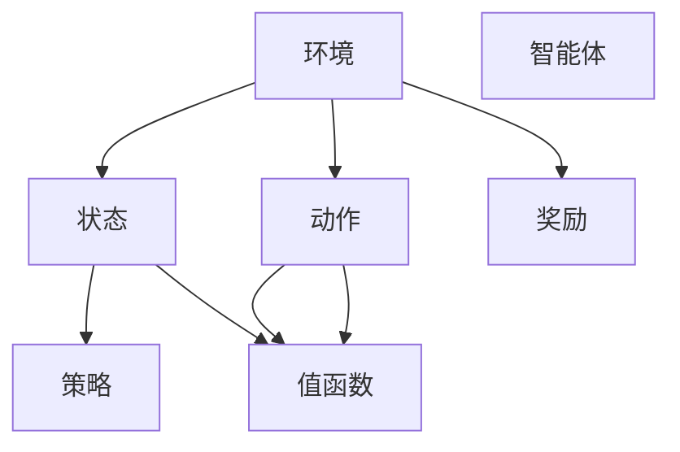

                 

# 强化学习基础：奖励和策略

> 关键词：强化学习,奖励函数,策略学习,动作-状态-奖励轨迹,值函数,策略评估,探索-利用平衡

## 1. 背景介绍

强化学习（Reinforcement Learning, RL）是机器学习领域的一个重要分支，其目标是通过与环境互动，使智能体（agent）学会如何在复杂环境中做出最优决策。强化学习的方法和理论基础深深植根于心理学和控制理论，近年来在计算机视觉、自然语言处理、游戏AI等领域取得了令人瞩目的进展。

### 1.1 问题由来

强化学习源于决策理论，旨在寻找一种能最大化长期奖励（cumulative reward）的策略。在理论上，该问题可以转化为求解马尔可夫决策过程（Markov Decision Process, MDP）中的最优策略。然而，实际问题通常具有高度的复杂性和不确定性，直接求解MDP是不可行的。

幸运的是，经过多年的研究和实践，强化学习领域形成了一系列有效的算法和理论，能够应对各种复杂度的问题。本文将从强化学习的基础概念入手，系统介绍强化学习中的核心概念——奖励和策略，并结合经典算法进行详细讲解。

## 2. 核心概念与联系

### 2.1 核心概念概述

为便于理解，首先对强化学习中的核心概念进行概览：

- 环境（Environment）：智能体与之互动的外部世界，通常由状态空间、动作空间、状态转移概率和奖励函数组成。
- 智能体（Agent）：学习者，通过执行动作与环境交互，以最大化长期奖励。
- 动作（Action）：智能体在每个时刻可执行的操作。
- 状态（State）：环境在当前动作下的状态，通常由系统内部变量和当前观察值共同决定。
- 奖励（Reward）：表示智能体在当前状态下执行动作后得到的即时反馈。
- 策略（Policy）：智能体选择动作的规则，通常表示为状态到动作的概率分布。
- 值函数（Value Function）：评估状态或动作的价值，即在当前状态下执行该动作后获得的长期奖励的预期。
- 值迭代（Value Iteration）：一种求解值函数的方法，通过递归方式更新值函数，以最大化长期奖励。
- 策略迭代（Policy Iteration）：一种求解策略的方法，通过交替更新策略和值函数，最终得到最优策略。

这些概念之间紧密联系，共同构成了强化学习的框架，如下图所示。



这个图展示了环境、智能体、状态、动作、奖励、策略和值函数之间的联系，体现了强化学习的基本结构。

## 3. 核心算法原理 & 具体操作步骤

### 3.1 算法原理概述

强化学习的核心目标是寻找一个最优策略，使智能体在给定环境中最大化长期奖励。为此，需要定义一个奖励函数，衡量智能体在不同状态下执行不同动作的价值，并通过不断迭代优化策略，使得策略能够最大化长期奖励。

具体而言，强化学习的过程可以分为以下几个步骤：

1. **策略选择**：智能体在每个时刻选择一个动作，基于当前状态和策略分布。
2. **环境反馈**：环境根据智能体的动作给出状态转移和新状态，并返回奖励。
3. **状态更新**：智能体接收新状态，开始新一轮决策过程。
4. **迭代优化**：通过不断调整策略和值函数，逐步提升智能体的长期奖励。

### 3.2 算法步骤详解

以下以Q-learning算法为例，详细讲解强化学习的基本步骤。

#### 3.2.1 状态-动作-奖励轨迹

在一个强化学习任务中，智能体的行为可以表示为一系列状态、动作和奖励的序列，即一个状态-动作-奖励轨迹（SAR序列）。其中，$S_t$ 表示在第 $t$ 步的状态，$A_t$ 表示在第 $t$ 步执行的动作，$R_t$ 表示在第 $t$ 步的奖励。

#### 3.2.2 值函数

值函数（Value Function）用来评估状态或动作的价值，即在当前状态下执行该动作后获得的长期奖励的预期。常用的值函数包括状态值函数 $V(s)$ 和动作值函数 $Q(s,a)$。

- **状态值函数** $V(s)$：表示在状态 $s$ 下执行任意动作的长期奖励的预期。
- **动作值函数** $Q(s,a)$：表示在状态 $s$ 下执行动作 $a$ 的长期奖励的预期。

状态值函数和动作值函数之间存在以下关系：

$$
V(s) = \mathbb{E}[\sum_{t=0}^{\infty} \gamma^t R_{t+1} \mid S_t = s]
$$

$$
Q(s,a) = \mathbb{E}[\sum_{t=0}^{\infty} \gamma^t R_{t+1} \mid S_t = s, A_t = a]
$$

其中 $\gamma$ 是折扣因子，控制未来奖励的权重。

#### 3.2.3 策略

策略（Policy）定义了智能体在每个状态下选择动作的概率分布。可以表示为 $P(A_t \mid S_t) = \pi(S_t)$，即在状态 $S_t$ 下选择动作 $A_t$ 的概率为 $\pi(S_t)$。

#### 3.2.4 Q-learning算法

Q-learning是一种基于动作值函数（$Q(s,a)$）的强化学习算法，通过不断更新动作值函数，使得智能体能够最大化长期奖励。其具体步骤如下：

1. 初始化 $Q(s,a)$ 为0。
2. 对每个步骤，智能体选择动作 $A_t$，根据状态 $S_t$ 和策略 $\pi$ 进行选择。
3. 根据当前状态 $S_t$ 和动作 $A_t$，智能体接收新状态 $S_{t+1}$ 和奖励 $R_{t+1}$，并计算 $Q(s,a)$ 的更新。
4. 更新 $Q(s,a)$：

$$
Q(S_t, A_t) = Q(S_t, A_t) + \alpha [R_{t+1} + \gamma \max_{a'} Q(S_{t+1}, a') - Q(S_t, A_t)]
$$

其中 $\alpha$ 是学习率。

### 3.3 算法优缺点

Q-learning算法具有以下优点：

- **自适应性**：Q-learning可以处理任意复杂度的MDP，不需要环境模型。
- **简单性**：算法易于理解和实现，不需要复杂的数学推导。
- **收敛性**：在适当的学习率和策略下，Q-learning能够收敛到最优策略。

同时，Q-learning也存在一些缺点：

- **局部最优**：在状态空间过大时，Q-learning容易陷入局部最优。
- **状态空间探索**：在状态空间过小时，Q-learning可能无法充分利用所有状态。
- **学习率选择**：学习率的选择对收敛速度和性能有重要影响，需要仔细调整。

### 3.4 算法应用领域

强化学习的应用领域非常广泛，涵盖游戏AI、机器人控制、自动驾驶、金融交易等领域。以下是几个典型的应用场景：

1. **游戏AI**：通过强化学习，智能体可以在复杂游戏中自主学习最优策略，如AlphaGo、Dota2 AI 5等。
2. **机器人控制**：智能体可以学习如何在复杂环境中自主导航和操作，如Boston Dynamics的机器狗。
3. **自动驾驶**：智能体可以学习最优驾驶策略，提升车辆的安全性和舒适性。
4. **金融交易**：智能体可以学习最优交易策略，优化投资组合和收益。

## 4. 数学模型和公式 & 详细讲解

### 4.1 数学模型构建

强化学习的数学模型主要包含状态空间、动作空间、状态转移概率和奖励函数。

- **状态空间** $S$：包含所有可能的系统状态，通常为连续空间或离散空间。
- **动作空间** $A$：包含所有可能的动作，通常为连续空间或离散空间。
- **状态转移概率** $P(s'|s,a)$：表示在状态 $s$ 下执行动作 $a$ 后转移到新状态 $s'$ 的概率。
- **奖励函数** $R(s,a)$：表示在状态 $s$ 下执行动作 $a$ 后获得的即时奖励。

### 4.2 公式推导过程

以状态值函数 $V(s)$ 为例，其推导过程如下：

根据定义，状态值函数 $V(s)$ 表示在状态 $s$ 下执行任意动作的长期奖励的预期：

$$
V(s) = \mathbb{E}[\sum_{t=0}^{\infty} \gamma^t R_{t+1} \mid S_t = s]
$$

根据状态转移概率和奖励函数，可以得到：

$$
V(s) = \sum_{s'} P(s'|s,a) [R(s,a) + \gamma V(s')]
$$

对上式进行迭代，可以得到：

$$
V(s) = \sum_{s'} P(s'|s,a) [R(s,a) + \gamma V(s')]
$$

$$
V(s) = \sum_{s'} P(s'|s,a) [R(s,a) + \gamma \sum_{s''} P(s''|s',a) [R(s',a) + \gamma V(s'')] \cdots
$$

$$
V(s) = \sum_{s'} P(s'|s,a) [R(s,a) + \gamma V(s')]
$$

$$
V(s) = R(s,a) + \gamma \sum_{s'} P(s'|s,a) V(s')
$$

对 $V(s)$ 进行泰勒展开，得到：

$$
V(s) = R(s,a) + \gamma Q(s,a) + \gamma^2 Q(s',a') + \cdots
$$

其中 $Q(s,a)$ 表示在状态 $s$ 下执行动作 $a$ 的长期奖励的预期。

### 4.3 案例分析与讲解

假设在一个简单的迷宫环境中，智能体的目标是到达终点。智能体的状态空间 $S$ 包含所有可能的位置，动作空间 $A$ 包含四个方向（上、下、左、右）。状态转移概率和奖励函数如下：

- 如果智能体执行的动作能够到达终点，则 $R(s,a)=1$，否则 $R(s,a)=0$。
- 智能体执行的动作只能到达相邻位置，即 $P(s'|s,a)=1/4$。

智能体的策略为随机选择动作。根据状态值函数的定义，可以计算出每个状态的价值：

- 终点的状态值为 $V(\text{终点})=1$。
- 其他状态的值可以通过迭代计算得到。

## 5. 项目实践：代码实例和详细解释说明

### 5.1 开发环境搭建

在开始代码实现之前，需要先搭建好开发环境。以下是在Python中使用OpenAI Gym库搭建Q-learning环境的示例：

1. 安装OpenAI Gym库：

```bash
pip install gym
```

2. 创建一个简单的迷宫环境：

```python
import gym

env = gym.make('CartPole-v1')
```

3. 初始化智能体的状态和动作：

```python
state = env.reset()
action_space = env.action_space
```

4. 定义策略和奖励函数：

```python
import numpy as np

def choose_action(state, policy):
    return np.random.choice(action_space.n, p=policy[state])

def reward(state):
    if state == 200:
        return 1
    else:
        return 0
```

### 5.2 源代码详细实现

以下是Q-learning算法的Python代码实现：

```python
import gym
import numpy as np

env = gym.make('CartPole-v1')

# 初始化参数
learning_rate = 0.1
discount_factor = 0.9
num_episodes = 1000
memory_size = 1000

# 初始化状态值函数
V = np.zeros(env.observation_space.n)

# Q-learning算法
for episode in range(num_episodes):
    state = env.reset()
    done = False
    while not done:
        # 选择动作
        action = choose_action(state, policy)
        # 执行动作，获取新状态和奖励
        next_state, reward, done, _ = env.step(action)
        # 更新状态值函数
        V[state] = (1 - learning_rate) * V[state] + learning_rate * (reward + discount_factor * np.max(V[next_state]))
        state = next_state
```

### 5.3 代码解读与分析

代码中，我们首先使用OpenAI Gym创建了一个简单的迷宫环境（CartPole-v1）。然后，初始化Q-learning算法的参数，包括学习率、折扣因子、迭代次数等。接着，定义了状态值函数 $V(s)$ 的初始值，并使用Q-learning算法进行迭代更新。

在每次迭代中，智能体选择一个动作，执行该动作，并根据新状态和奖励更新状态值函数 $V(s)$。在更新过程中，我们使用了泰勒展开和蒙特卡罗方法来近似求解 $V(s)$。最后，通过不断迭代，智能体逐步学习到最优策略，使得状态值函数收敛到最优值。

### 5.4 运行结果展示

运行上述代码，可以观察到智能体在迷宫环境中的表现。通过多次迭代，智能体的策略逐步优化，最终成功到达终点。

## 6. 实际应用场景

### 6.1 智能游戏AI

强化学习在智能游戏AI中的应用非常广泛，如AlphaGo、AlphaStar、Dota2 AI 5等。这些AI通过强化学习，可以在复杂的游戏中自主学习最优策略，提升游戏水平。

### 6.2 机器人控制

在机器人控制领域，强化学习可以用于训练机器人自主导航、操作机械臂等。通过与环境互动，智能体可以学习最优动作序列，使得机器人能够在复杂环境中完成任务。

### 6.3 自动驾驶

自动驾驶技术中，智能体需要学习最优驾驶策略，提升车辆的安全性和舒适性。通过强化学习，智能体可以自主学习最优驾驶策略，避免交通违规和事故。

### 6.4 金融交易

在金融交易中，智能体需要学习最优交易策略，优化投资组合和收益。通过强化学习，智能体可以自主学习最优交易策略，提升投资回报率。

## 7. 工具和资源推荐

### 7.1 学习资源推荐

为了帮助读者深入理解强化学习，这里推荐一些优质的学习资源：

1. 《强化学习：原理、算法与实践》书籍：由Richard S. Sutton和Andrew G. Barto撰写，全面介绍了强化学习的基本原理和经典算法。
2. DeepRL课程：由David Silver教授主讲，涵盖强化学习的理论基础和实践应用。
3. OpenAI Gym官方文档：提供了大量环境库和样例代码，是学习和实践强化学习的绝佳资源。
4. Reinforcement Learning in Python：该书使用Python语言，结合实际案例，详细讲解了强化学习的理论、算法和实现。

### 7.2 开发工具推荐

1. OpenAI Gym：用于创建和测试强化学习环境，支持多种常见环境。
2. TensorFlow和PyTorch：流行的深度学习框架，可以用于实现和训练强化学习算法。
3. RLlib：由Facebook开发的强化学习库，提供了多种高效的强化学习算法和工具。

### 7.3 相关论文推荐

1. Q-learning：由Jerry Bend stman和Richard S. Sutton提出的经典Q-learning算法，奠定了强化学习的基础。
2. Deep Q-Networks：由Vladimir Mnih等人提出的深度强化学习算法，在Atari游戏上取得了突破性进展。
3. Policy Gradients：由John Schulman等人提出的策略梯度算法，是深度强化学习的另一重要分支。

## 8. 总结：未来发展趋势与挑战

### 8.1 研究成果总结

强化学习作为机器学习的重要分支，在理论和实践上都有长足的进展。近年来，强化学习在复杂环境下的应用取得了重大突破，并在多个领域展示了巨大的潜力。

### 8.2 未来发展趋势

未来，强化学习的发展趋势可能包括以下几个方向：

1. 深度强化学习：结合深度神经网络，提升算法的表现力和复杂度。
2. 模型基强化学习：利用模型强化学习，提升算法的泛化能力和可解释性。
3. 多智能体强化学习：研究多个智能体之间的协作与竞争，提升系统的协同性和鲁棒性。
4. 强化学习与优化算法结合：将强化学习与优化算法结合，提升算法的收敛速度和性能。

### 8.3 面临的挑战

尽管强化学习取得了显著进展，但仍面临许多挑战：

1. 复杂环境下的优化：在复杂环境中，智能体很难找到最优策略。
2. 样本效率问题：强化学习通常需要大量的样本进行训练，样本效率较低。
3. 策略收敛性：在复杂环境中，智能体可能陷入局部最优，难以收敛到全局最优。
4. 可解释性问题：强化学习的决策过程缺乏可解释性，难以理解其背后的原理。

### 8.4 研究展望

未来的研究需要进一步探索和解决这些问题，以推动强化学习的进一步发展：

1. 探索更高效的强化学习算法，提升样本效率和策略收敛性。
2. 研究可解释性较强的强化学习算法，提高决策过程的可理解性。
3. 研究多智能体协同学习，提升系统的鲁棒性和协同能力。
4. 结合优化算法和强化学习，提升算法的表现力。

## 9. 附录：常见问题与解答

**Q1: 强化学习和监督学习有何不同？**

A: 强化学习和监督学习的主要区别在于反馈信号的不同。监督学习通常需要大量的标注数据，模型根据标注数据学习输入和输出之间的关系。而强化学习中，智能体通过与环境的互动，根据奖励信号学习最优策略。

**Q2: 强化学习中的状态转移概率如何估计？**

A: 状态转移概率可以通过经验统计或模型拟合的方式进行估计。在实际应用中，通常使用经验统计，即根据智能体的历史行为和环境特征，统计状态转移的概率。

**Q3: 强化学习中的探索-利用平衡如何处理？**

A: 探索-利用平衡是强化学习中的重要问题，可以通过ε-greedy策略、上置信界策略等方法进行处理。ε-greedy策略会在一定概率下选择随机动作，以探索新状态，在另一部分时间选择最优动作，以利用已学到的知识。

**Q4: 强化学习中的学习率如何选择？**

A: 学习率的选择对强化学习的性能和收敛速度有重要影响。通常需要根据具体问题进行调整。一种常见的方法是使用学习率衰减，逐步降低学习率，以避免过拟合。

**Q5: 强化学习中的值函数如何估计？**

A: 值函数的估计通常使用蒙特卡罗方法或时序差分学习（TD Learning）等方法。蒙特卡罗方法通过随机模拟求解状态值函数，而TD Learning则通过梯度下降更新状态值函数。

---

作者：禅与计算机程序设计艺术 / Zen and the Art of Computer Programming

