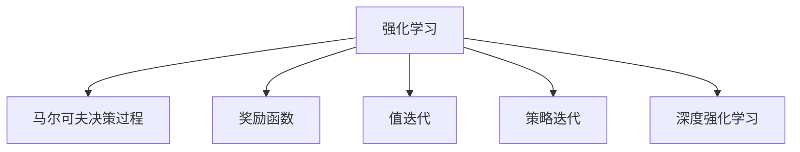

                 

# 强化学习：优化算法的使用

> 关键词：强化学习,优化算法,马尔可夫决策过程,奖励函数,值迭代,策略迭代,深度强化学习

## 1. 背景介绍

### 1.1 问题由来
强化学习（Reinforcement Learning, RL）是机器学习领域的一个重要分支，它通过智能体与环境交互，学习最优的决策策略，以达到某个长期目标。与传统的监督学习和无监督学习不同，强化学习强调智能体在动态环境中通过试错逐步改进决策策略，从而最大化累计回报。强化学习广泛应用于游戏、机器人控制、推荐系统、自然语言处理等领域，成为解决复杂智能决策问题的重要工具。

### 1.2 问题核心关键点
强化学习的应用核心在于其基于试错的学习机制，通过智能体与环境的交互，智能体逐步调整其决策策略，以最大化长期回报。其核心问题在于如何有效地学习最优策略，同时保证学习的效率和稳定性。

### 1.3 问题研究意义
强化学习的应用范式，对于探索智能决策问题，实现自主系统的高效决策，具有重要意义：

1. 提升决策效率。通过智能体的自学习机制，强化学习可以快速迭代优化决策策略，提升决策效率。
2. 提高决策效果。智能体在动态环境中通过不断试错，可以逐步改进决策质量，实现最佳效果。
3. 增强决策鲁棒性。强化学习强调长期回报最大化，能够在面对复杂、不确定的环境时，保证决策的鲁棒性和稳定性。
4. 促进技术创新。强化学习的方法论创新，可以启发新的机器学习算法和技术，推动人工智能技术的发展。
5. 实现广泛应用。强化学习算法在各个领域具有普适性，可以加速技术落地，产生商业价值。

## 2. 核心概念与联系

### 2.1 核心概念概述

为更好地理解强化学习的优化算法，本节将介绍几个密切相关的核心概念：

- 强化学习（Reinforcement Learning, RL）：一种通过智能体与环境交互，学习最优决策策略的学习范式。智能体通过执行动作，观察环境反馈，调整决策策略，以达到某个长期目标。
- 马尔可夫决策过程（Markov Decision Process, MDP）：强化学习的数学模型，描述智能体与环境的动态交互过程。包括状态、动作、状态转移概率、奖励函数等核心组件。
- 奖励函数（Reward Function）：衡量智能体行为的好坏，指导智能体如何调整决策策略。奖励函数应满足即时性、可分解性、稀疏性等原则。
- 值迭代（Value Iteration, VI）：一种基于动态规划的优化算法，通过递归求解状态-价值函数，得到最优决策策略。
- 策略迭代（Policy Iteration, PI）：一种基于策略更新的优化算法，通过交替更新值函数和策略函数，逐步逼近最优策略。
- 深度强化学习（Deep Reinforcement Learning, DRL）：将神经网络应用于强化学习算法，通过深度学习技术提升智能体的决策能力和泛化能力。

这些核心概念之间的逻辑关系可以通过以下Mermaid流程图来展示：



这个流程图展示了几类强化学习方法的逻辑关系：

1. 强化学习模型A通过马尔可夫决策过程B和奖励函数C进行决策策略的优化。
2. 值迭代D和策略迭代E都是强化学习常用的优化算法。
3. 深度强化学习F在神经网络的辅助下，提升了强化学习算法的决策能力和泛化能力。

这些概念共同构成了强化学习的核心框架，使其能够在各种场景下发挥智能决策的能力。通过理解这些核心概念，我们可以更好地把握强化学习的学习原理和优化策略。

## 3. 核心算法原理 & 具体操作步骤

### 3.1 算法原理概述

强化学习的优化算法，通过迭代更新状态-价值函数和决策策略函数，逐步逼近最优策略。其核心思想是：智能体在每个状态下，通过执行动作，观察环境反馈，调整决策策略，以最大化长期累计回报。

形式化地，假设智能体在环境中的状态集合为 $S$，动作集合为 $A$，状态转移概率为 $P$，奖励函数为 $R$。设智能体在状态 $s_t$ 执行动作 $a_t$，观察到状态 $s_{t+1}$ 和奖励 $r_t$，则强化学习的优化目标可以表示为：

$$
\max_{\pi} \mathbb{E}\left[\sum_{t=0}^{\infty} \gamma^t R(s_t,a_t)\right]
$$

其中 $\pi$ 为决策策略，$\gamma$ 为折现率，$\mathbb{E}[\cdot]$ 表示对所有可能状态的期望。

### 3.2 算法步骤详解

强化学习的优化算法主要包括以下几个关键步骤：

**Step 1: 构建MDP模型**

- 确定环境的状态空间 $S$ 和动作空间 $A$。
- 定义状态转移概率 $P(s_{t+1}|s_t,a_t)$。
- 设计奖励函数 $R(s_t,a_t)$，衡量智能体在状态 $s_t$ 执行动作 $a_t$ 的即时回报。

**Step 2: 选择优化算法**

- 值迭代（Value Iteration, VI）：通过递归求解状态-价值函数 $V(s)$，得到最优策略 $\pi^*(s)$。
- 策略迭代（Policy Iteration, PI）：交替更新状态-价值函数 $V(s)$ 和决策策略 $\pi(s)$，逐步逼近最优策略 $\pi^*$。
- 深度强化学习（Deep Reinforcement Learning, DRL）：将神经网络应用于状态-价值函数 $V(s)$ 和决策策略 $\pi(s)$ 的优化，提升智能体的决策能力。

**Step 3: 实现算法步骤**

- 对于值迭代算法，需要构建状态-价值函数 $V(s)$，使用贝尔曼方程 $V(s) = \max_{a} \left[ R(s,a) + \gamma \sum_{s'} P(s'|s,a)V(s') \right]$ 递归求解。
- 对于策略迭代算法，需要交替更新状态-价值函数 $V(s)$ 和决策策略 $\pi(s)$，具体步骤为：$\pi(s) \leftarrow \arg\max_{\pi} \mathbb{E}_{a \sim \pi} \left[ R(s,a) + \gamma \mathbb{E}_{s'} \left[ V(s') \right] \right]$，$V(s) \leftarrow \mathbb{E}_{a \sim \pi} \left[ R(s,a) + \gamma \mathbb{E}_{s'} \left[ V(s') \right] \right]$。
- 对于深度强化学习算法，需要构建神经网络，优化状态-价值函数和决策策略，具体实现方法包括Q-learning、SARSA、Deep Q-Networks等。

**Step 4: 执行迭代优化**

- 对于值迭代算法，重复进行贝尔曼方程的求解，直至收敛。
- 对于策略迭代算法，交替进行状态-价值函数和决策策略的更新，直至收敛。
- 对于深度强化学习算法，使用神经网络进行优化，直至收敛。

**Step 5: 评估模型性能**

- 在验证集上评估模型性能，对比与基准模型的差距。
- 使用模型在实际应用场景中进行预测，评估模型的鲁棒性和泛化能力。

以上是强化学习优化的基本步骤。在实际应用中，还需要针对具体任务的特点，对算法进行优化设计，如改进奖励函数设计，引入更多的正则化技术，搜索最优的超参数组合等，以进一步提升模型性能。

### 3.3 算法优缺点

强化学习的优化算法具有以下优点：
1. 动态适应性强。智能体可以在动态环境中通过试错逐步优化决策策略，适应复杂、不确定的环境。
2. 自主学习能力强。智能体在无监督的情况下，通过与环境的交互，自主学习最优决策策略。
3. 泛化能力强。强化学习算法具有泛化能力，可以应用于各种任务，提升任务性能。
4. 应用广泛。强化学习在控制、游戏、机器人、推荐系统等领域得到了广泛应用。

同时，该算法也存在一定的局限性：
1. 计算复杂度高。强化学习算法的计算复杂度往往较高，需要大量的计算资源和时间。
2. 学习速度慢。智能体在试错过程中，学习速度较慢，收敛速度较慢。
3. 奖励函数设计困难。奖励函数的设计对智能体的学习效果有重要影响，设计不当可能导致学习失败。
4. 模型不稳定。强化学习算法在探索和利用的平衡问题上存在困难，模型容易过拟合或欠拟合。

尽管存在这些局限性，但强化学习在许多场景下依然展示了其强大的潜力。未来相关研究的重点在于如何进一步降低计算复杂度，提高学习速度，优化奖励函数设计，以及增强模型的鲁棒性和稳定性。

### 3.4 算法应用领域

强化学习的应用领域广泛，涵盖以下几个主要方面：

- 游戏AI：通过强化学习算法训练游戏AI，使其能够自主学习最优游戏策略。如AlphaGo、Dota 2 AI等。
- 机器人控制：通过强化学习算法训练机器人，使其能够在动态环境中自主完成任务。如ROS中的多机器人协作、无人机避障等。
- 自然语言处理：通过强化学习算法训练机器翻译、对话系统等NLP应用。如GPT-3、Chatbot等。
- 推荐系统：通过强化学习算法训练推荐系统，优化推荐策略，提升用户满意度。如协同过滤、深度推荐系统等。
- 金融市场：通过强化学习算法训练交易策略，优化投资决策，降低风险。如高频交易、量化投资等。
- 智能制造：通过强化学习算法训练制造系统，优化生产过程，提升生产效率。如智能调度和质量控制等。

除了上述这些经典应用外，强化学习也被创新性地应用到更多场景中，如医疗、能源管理、供应链优化等，为各行各业带来了新的突破。随着强化学习方法的不断进步，相信其在更多领域的应用前景将更加广阔。

## 4. 数学模型和公式 & 详细讲解  
### 4.1 数学模型构建

本节将使用数学语言对强化学习的优化算法进行更加严格的刻画。

假设智能体在环境中的状态集合为 $S$，动作集合为 $A$，状态转移概率为 $P$，奖励函数为 $R$。设智能体在状态 $s_t$ 执行动作 $a_t$，观察到状态 $s_{t+1}$ 和奖励 $r_t$，则强化学习的优化目标可以表示为：

$$
\max_{\pi} \mathbb{E}\left[\sum_{t=0}^{\infty} \gamma^t R(s_t,a_t)\right]
$$

其中 $\pi$ 为决策策略，$\gamma$ 为折现率，$\mathbb{E}[\cdot]$ 表示对所有可能状态的期望。

### 4.2 公式推导过程

以下我们以值迭代算法为例，推导其具体步骤和计算公式。

设状态 $s$ 对应的状态-价值函数为 $V(s)$，则值迭代算法的核心步骤是使用贝尔曼方程 $V(s) = \max_{a} \left[ R(s,a) + \gamma \sum_{s'} P(s'|s,a)V(s') \right]$ 递归求解 $V(s)$。具体步骤如下：

1. 初始化状态-价值函数 $V(s) = 0$ 对于所有状态 $s$。
2. 对于每个状态 $s$，计算其对应的最优动作 $a$。
3. 更新状态-价值函数 $V(s) = \max_{a} \left[ R(s,a) + \gamma \sum_{s'} P(s'|s,a)V(s') \right]$。
4. 重复步骤2和3，直至 $V(s)$ 收敛。

其中 $V(s)$ 的计算公式为：

$$
V(s) = \max_{a} \left[ R(s,a) + \gamma \sum_{s'} P(s'|s,a)V(s') \right]
$$

这个公式表示，智能体在状态 $s$ 执行动作 $a$ 的即时回报为 $R(s,a)$，期望的长期回报为 $\gamma \sum_{s'} P(s'|s,a)V(s')$，因此状态-价值函数 $V(s)$ 为两者之和的最大值。

通过值迭代算法，智能体可以在动态环境中逐步学习最优决策策略，实现长期目标的优化。

## 5. 项目实践：代码实例和详细解释说明
### 5.1 开发环境搭建

在进行强化学习实践前，我们需要准备好开发环境。以下是使用Python进行OpenAI Gym进行环境搭建和实验的环境配置流程：

1. 安装Anaconda：从官网下载并安装Anaconda，用于创建独立的Python环境。

2. 创建并激活虚拟环境：
```bash
conda create -n reinforcement-env python=3.8 
conda activate reinforcement-env
```

3. 安装OpenAI Gym和相关库：
```bash
pip install gym gym-springbox
```

4. 安装TensorFlow或PyTorch：
```bash
pip install tensorflow==2.3
# 或
pip install torch==1.7
```

5. 安装其他相关库：
```bash
pip install numpy scipy matplotlib tensorboard
```

完成上述步骤后，即可在`reinforcement-env`环境中开始强化学习实践。

### 5.2 源代码详细实现

这里我们以DQN（Deep Q-Network）算法在CartPole环境中进行强化学习训练为例，给出完整的PyTorch代码实现。

首先，导入必要的库和模块：

```python
import numpy as np
import torch
import torch.nn as nn
import torch.optim as optim
import gym
import torch.nn.functional as F
```

然后，定义DQN模型的神经网络：

```python
class DQN(nn.Module):
    def __init__(self, state_dim, action_dim, hidden_dim=64):
        super(DQN, self).__init__()
        self.fc1 = nn.Linear(state_dim, hidden_dim)
        self.fc2 = nn.Linear(hidden_dim, hidden_dim)
        self.fc3 = nn.Linear(hidden_dim, action_dim)
    
    def forward(self, x):
        x = F.relu(self.fc1(x))
        x = F.relu(self.fc2(x))
        x = self.fc3(x)
        return x
```

接着，定义DQN算法的基本参数和初始化函数：

```python
state_dim = 4
action_dim = 2
buffer_size = 1000
batch_size = 32
learn_rate = 0.001
gamma = 0.99
target_update_freq = 100
device = torch.device("cuda" if torch.cuda.is_available() else "cpu")
```

然后，定义DQN算法的核心训练函数：

```python
class DQN:
    def __init__(self, state_dim, action_dim, buffer_size, batch_size, learn_rate, gamma, target_update_freq, device):
        self.state_dim = state_dim
        self.action_dim = action_dim
        self.buffer_size = buffer_size
        self.batch_size = batch_size
        self.learn_rate = learn_rate
        self.gamma = gamma
        self.target_update_freq = target_update_freq
        self.device = device
        
        self.memory = []
        self.network = DQN(self.state_dim, self.action_dim).to(device)
        self.target_network = DQN(self.state_dim, self.action_dim).to(device)
        self.target_network.load_state_dict(self.network.state_dict())
        self.optimizer = optim.Adam(self.network.parameters(), lr=learn_rate)
    
    def choose_action(self, state):
        if self.eval_mode:
            return np.random.randint(self.action_dim)
        action_values = self.network(torch.tensor(state).float()).detach().cpu().numpy()
        return np.argmax(action_values)
    
    def update_network(self, state, action, reward, next_state, done):
        self.memory.append((state, action, reward, next_state, done))
        
        if len(self.memory) > self.buffer_size:
            np.random.shuffle(self.memory)
            mini_batch = torch.tensor(self.memory[:self.batch_size])
            
        state_batch, action_batch, reward_batch, next_state_batch, done_batch = mini_batch.t()
        
        state_batch = torch.tensor(state_batch).float().to(device)
        next_state_batch = torch.tensor(next_state_batch).float().to(device)
        action_batch = torch.tensor(action_batch).long().to(device)
        target = torch.zeros(self.batch_size, self.action_dim).float().to(device)
        target[:, action_batch] = reward_batch + self.gamma * self.target_network(next_state_batch).detach().max(1)[0].unsqueeze(1)
        
        self.optimizer.zero_grad()
        output = self.network(state_batch)
        loss = F.mse_loss(output, target)
        loss.backward()
        self.optimizer.step()
        
        if len(self.memory) % self.target_update_freq == 0:
            self.target_network.load_state_dict(self.network.state_dict())
    
    def train(self, env, episode_num=100):
        for episode in range(episode_num):
            state = env.reset()
            state = np.reshape(state, [1, -1])
            done = False
            total_reward = 0
            
            while not done:
                action = self.choose_action(state)
                next_state, reward, done, _ = env.step(action)
                next_state = np.reshape(next_state, [1, -1])
                self.update_network(state, action, reward, next_state, done)
                total_reward += reward
                state = next_state
            
            print(f"Episode {episode+1}, Total reward: {total_reward:.2f}")
```

最后，定义CartPole环境的渲染函数和保存模型参数的函数：

```python
env = gym.make('CartPole-v0')
env.render()
    
checkpoint = torch.save(self.network.state_dict(), 'model.pth')
```

完成上述步骤后，即可在`reinforcement-env`环境中开始DQN算法的训练和测试。

### 5.3 代码解读与分析

让我们再详细解读一下关键代码的实现细节：

**DQN类**：
- `__init__`方法：初始化DQN算法的基本参数和神经网络。
- `choose_action`方法：在训练模式时，使用神经网络预测动作值，选择最大化动作值对应的动作；在评估模式时，随机选择动作。
- `update_network`方法：更新神经网络的参数，使用Mini-Batch随机样本进行训练，并更新目标网络。
- `train`方法：训练DQN算法，遍历每个 episode，随机选择动作，并根据奖励和下一状态更新神经网络。

**CartPole环境的渲染函数**：
- 定义OpenAI Gym环境，并渲染环境。

**保存模型参数的函数**：
- 使用`torch.save`函数保存神经网络的参数，方便后续加载和测试。

可以看到，PyTorch配合OpenAI Gym使得DQN算法的代码实现变得简洁高效。开发者可以将更多精力放在环境设计和算法改进上，而不必过多关注底层的实现细节。

当然，工业级的系统实现还需考虑更多因素，如模型的保存和部署、超参数的自动搜索、更灵活的奖励函数设计等。但核心的强化学习算法基本与此类似。

## 6. 实际应用场景

### 6.1 智能制造系统

基于强化学习的优化算法，可以广泛应用于智能制造系统的调度优化。传统制造系统往往依赖于人工经验，无法快速响应市场需求变化，导致生产效率低下，成本高企。使用强化学习算法，可以训练制造系统的智能调度器，实现实时生产计划的优化。

在技术实现上，可以收集生产设备的历史数据和实时状态，设计制造环境的MDP模型，通过强化学习算法训练智能调度器。智能调度器可以实时监测设备状态，预测市场需求，自主调整生产计划，达到最优的生产效率和成本控制。

### 6.2 自然语言生成

自然语言生成是强化学习的重要应用领域之一。通过训练生成模型，可以使其能够根据输入的种子文本，生成流畅、连贯的自然语言文本。

在实践中，可以设计一个奖励函数，衡量生成文本的质量，如流畅性、连贯性、语义相关性等。在生成文本过程中，智能体逐步调整模型参数，最大化即时回报和长期回报。通过不断迭代优化，生成模型可以生成高质量的自然语言文本，应用于对话系统、文章生成、摘要生成等任务。

### 6.3 机器人控制

强化学习在机器人控制中的应用广泛，特别是对于复杂动态环境的自主导航和动作规划。机器人控制的问题可以抽象为MDP模型，设计合适的奖励函数，通过强化学习算法训练机器人，使其能够在动态环境中自主完成任务。

在技术实现上，可以设计一个环境，模拟机器人在动态环境中的导航和动作规划。通过强化学习算法训练机器人，使其能够自动选择最优动作，避开障碍物，到达目标位置。机器人控制技术在无人机、自动化仓库、工业机器人等领域得到了广泛应用。

### 6.4 未来应用展望

随着强化学习方法的不断进步，其应用前景将更加广阔。未来强化学习可能将在以下领域得到更多应用：

- 自动驾驶：通过强化学习训练自动驾驶系统，实现最优的路径规划和决策策略。
- 金融交易：通过强化学习训练交易策略，优化投资决策，降低风险。
- 医疗诊断：通过强化学习训练诊断系统，实现自动化的疾病诊断和治疗方案推荐。
- 能源管理：通过强化学习训练能源管理系统，优化资源分配，降低能耗。
- 游戏AI：通过强化学习训练游戏AI，实现自主学习最优游戏策略。

总之，强化学习作为机器学习的重要分支，在各个领域具有广泛的应用前景。未来随着算力、数据量的提升，强化学习将展现出更加强大的能力，推动智能决策系统的进一步发展。

## 7. 工具和资源推荐
### 7.1 学习资源推荐

为了帮助开发者系统掌握强化学习的理论基础和实践技巧，这里推荐一些优质的学习资源：

1. 《Reinforcement Learning: An Introduction》：Sutton和Barto的经典著作，系统介绍了强化学习的基本概念和算法，是强化学习的入门必读。
2. 《Deep Reinforcement Learning with TensorFlow 2 and Keras》：利用TensorFlow和Keras实现强化学习的实战指南，适合深入学习强化学习的读者。
3. 《Reinforcement Learning Specialization》：由David Silver开设的强化学习在线课程，涵盖强化学习的基本概念和经典算法，适合系统学习。
4. OpenAI Gym：开源的强化学习环境，提供了多种经典环境和算法实现，方便进行实验和调试。
5. TensorFlow Agents：Google开发的强化学习库，提供了多种强化学习算法和环境接口，方便进行实验和研究。
6. PyTorch RL：PyTorch库中的强化学习模块，提供了多种经典算法和环境接口，适合深度学习方向的读者。

通过对这些资源的学习实践，相信你一定能够快速掌握强化学习的精髓，并用于解决实际的智能决策问题。

### 7.2 开发工具推荐

高效的开发离不开优秀的工具支持。以下是几款用于强化学习开发的常用工具：

1. OpenAI Gym：开源的强化学习环境，提供了多种经典环境和算法实现，方便进行实验和调试。
2. TensorFlow Agents：Google开发的强化学习库，提供了多种强化学习算法和环境接口，方便进行实验和研究。
3. PyTorch RL：PyTorch库中的强化学习模块，提供了多种经典算法和环境接口，适合深度学习方向的读者。
4. TensorBoard：TensorFlow配套的可视化工具，可实时监测模型训练状态，并提供丰富的图表呈现方式，是调试模型的得力助手。
5. Weights & Biases：模型训练的实验跟踪工具，可以记录和可视化模型训练过程中的各项指标，方便对比和调优。

合理利用这些工具，可以显著提升强化学习任务的开发效率，加快创新迭代的步伐。

### 7.3 相关论文推荐

强化学习的发展得益于学界的持续研究。以下是几篇奠基性的相关论文，推荐阅读：

1. Learning to Play Go with Deep Neural Networks：吴恩达等人提出的深度学习与强化学习的结合，训练了AlphaGo系统，开创了深度强化学习的新纪元。
2. Human-level Control Through Deep Reinforcement Learning：David Silver等人提出的深度强化学习算法，训练了具有人类水平控制的Atari游戏玩家，展示了深度强化学习的强大能力。
3. Curiosity-driven Exploration by Self-supervised Prediction：Christopher Burda等人提出的自监督学习与强化学习的结合，训练了具有好奇心机制的智能体，增强了学习的探索性。
4. Distributed Deep Reinforcement Learning with Synthetic Environments：Stanley等人提出的分布式强化学习算法，训练了具有多智能体协同的Mapf系统，展示了分布式强化学习的优越性。
5. Hierarchical Task Aggregation for Text Generation：Marras等人提出的分层任务聚合算法，训练了具有多样性生成的文本生成模型，展示了强化学习在NLP任务中的潜力。

这些论文代表了大强化学习的发展脉络。通过学习这些前沿成果，可以帮助研究者把握学科前进方向，激发更多的创新灵感。

## 8. 总结：未来发展趋势与挑战

### 8.1 总结

本文对强化学习的优化算法进行了全面系统的介绍。首先阐述了强化学习的学习背景和优化目标，明确了强化学习算法的基本步骤和数学模型。其次，从原理到实践，详细讲解了强化学习的算法步骤和具体实现，给出了强化学习任务开发的完整代码实例。同时，本文还广泛探讨了强化学习在智能制造、自然语言生成、机器人控制等各个领域的应用前景，展示了强化学习算法的广泛应用。

通过本文的系统梳理，可以看到，强化学习算法在智能决策问题中的应用前景广阔，具有动态适应强、自主学习能力强的显著优势。未来，随着算力、数据量的提升，强化学习将展现出更加强大的能力，推动智能决策系统的进一步发展。

### 8.2 未来发展趋势

展望未来，强化学习的发展趋势主要体现在以下几个方面：

1. 算力提升：随着硬件设备的不断进步，算力的提升将使得强化学习算法能够处理更加复杂、动态的环境，实现更加精细的优化。
2. 数据获取：随着大数据技术的不断进步，数据的获取将变得更加容易，数据规模的增加将使得强化学习算法能够更好地学习和优化。
3. 模型复杂化：随着深度学习技术的不断发展，模型的复杂度将进一步提升，强化学习算法将具备更加丰富的表达能力。
4. 多智能体协同：随着分布式计算技术的不断发展，多智能体的协同优化将成为强化学习的新趋势，提升系统的整体效率和稳定性。
5. 自监督学习：自监督学习与强化学习的结合，将使得强化学习算法具备更强的探索性和学习能力，提升系统的泛化能力和鲁棒性。
6. 模型压缩和加速：随着计算资源和硬件设备的不断进步，模型的压缩和加速将成为强化学习的重要研究方向，提升系统的运行效率和响应速度。

这些趋势凸显了强化学习算法的广阔前景。这些方向的探索发展，必将进一步提升强化学习算法的优化能力和应用范围，为智能决策系统的进一步发展奠定坚实基础。

### 8.3 面临的挑战

尽管强化学习算法在许多场景下展示了其强大的潜力，但在迈向更加智能化、普适化应用的过程中，它仍面临着诸多挑战：

1. 计算资源瓶颈：强化学习算法往往需要大量的计算资源和时间，大规模训练任务面临计算资源瓶颈。如何高效利用计算资源，提高算法训练效率，仍然是一个重要问题。
2. 奖励函数设计困难：奖励函数的设计对强化学习的学习效果有重要影响，设计不当可能导致学习失败。如何设计有效的奖励函数，仍然是强化学习的一个难点。
3. 模型过拟合问题：强化学习算法在探索和利用的平衡问题上存在困难，模型容易过拟合或欠拟合。如何平衡探索和利用，提高模型的泛化能力，仍然是一个重要问题。
4. 模型可解释性不足：强化学习模型通常缺乏可解释性，难以对其决策逻辑进行分析和调试。如何增强模型的可解释性，仍然是一个重要问题。
5. 数据获取成本高：高质量的数据是强化学习算法的重要基础，数据获取成本高，特别是在数据隐私和安全方面存在挑战。

尽管存在这些挑战，但强化学习在许多场景下依然展示了其强大的潜力。未来相关研究的重点在于如何进一步降低计算复杂度，提高学习速度，优化奖励函数设计，以及增强模型的鲁棒性和可解释性。

### 8.4 研究展望

面对强化学习所面临的种种挑战，未来的研究需要在以下几个方面寻求新的突破：

1. 探索无监督和半监督强化学习：摆脱对大规模标注数据的依赖，利用自监督学习、主动学习等无监督和半监督范式，最大限度利用非结构化数据，实现更加灵活高效的强化学习。
2. 研究参数高效和计算高效的强化学习算法：开发更加参数高效的强化学习算法，在固定大部分模型参数的情况下，只更新极少量的任务相关参数。同时优化算法的计算图，减少前向传播和反向传播的资源消耗，实现更加轻量级、实时性的部署。
3. 引入因果和对比学习范式：通过引入因果推断和对比学习思想，增强强化学习模型建立稳定因果关系的能力，学习更加普适、鲁棒的语言表征，从而提升模型泛化性和抗干扰能力。
4. 引入更多先验知识：将符号化的先验知识，如知识图谱、逻辑规则等，与神经网络模型进行巧妙融合，引导强化学习过程学习更准确、合理的语言模型。同时加强不同模态数据的整合，实现视觉、语音等多模态信息与文本信息的协同建模。
5. 结合因果分析和博弈论工具：将因果分析方法引入强化学习模型，识别出模型决策的关键特征，增强输出解释的因果性和逻辑性。借助博弈论工具刻画人机交互过程，主动探索并规避模型的脆弱点，提高系统稳定性。
6. 纳入伦理道德约束：在模型训练目标中引入伦理导向的评估指标，过滤和惩罚有偏见、有害的输出倾向。同时加强人工干预和审核，建立模型行为的监管机制，确保输出符合人类价值观和伦理道德。

这些研究方向将引领强化学习技术迈向更高的台阶，为构建安全、可靠、可解释、可控的智能系统铺平道路。面向未来，强化学习技术还需要与其他人工智能技术进行更深入的融合，如知识表示、因果推理、强化学习等，多路径协同发力，共同推动人工智能技术的发展。只有勇于创新、敢于突破，才能不断拓展强化学习算法的边界，让智能技术更好地造福人类社会。

## 9. 附录：常见问题与解答

**Q1：强化学习算法是否适用于所有任务？**

A: 强化学习算法在许多任务上具有普适性，可以应用于动态环境下的优化决策问题。但对于一些特定任务，如知识推理、规划问题等，可能需要结合其他算法和技术进行综合优化。

**Q2：强化学习算法的计算复杂度是否较高？**

A: 强化学习算法的计算复杂度通常较高，特别是在大规模环境中。通过算法优化、模型压缩等技术，可以显著降低计算复杂度，提高训练效率。

**Q3：强化学习算法是否需要大量的标注数据？**

A: 强化学习算法一般不需要标注数据，通过智能体与环境的交互进行自学习。但一些任务需要初始化的奖励函数和状态转移模型，需要一定的领域知识。

**Q4：强化学习算法的奖励函数设计是否容易？**

A: 奖励函数的设计是强化学习算法的一个难点。设计合理的奖励函数需要领域知识和经验，可以通过多轮试错逐步优化。

**Q5：强化学习算法的稳定性是否受探索和利用的平衡问题影响？**

A: 是的，探索和利用的平衡是强化学习算法的一个关键问题。模型需要在探索和利用之间找到一个平衡点，避免过拟合或欠拟合。

**Q6：强化学习算法是否容易过拟合？**

A: 是的，强化学习算法在探索和利用的平衡问题上存在困难，模型容易过拟合或欠拟合。需要采用一些正则化技术和算法优化方法，提高模型的泛化能力。

**Q7：强化学习算法是否需要大量的计算资源？**

A: 是的，强化学习算法往往需要大量的计算资源和时间，特别是在大规模环境中。可以通过分布式计算、模型压缩等技术，提高算法的训练效率。

**Q8：强化学习算法是否需要领域知识和经验？**

A: 是的，强化学习算法需要领域知识和经验，特别是对于复杂环境和任务，需要更多的领域知识来设计合适的奖励函数和状态转移模型。

**Q9：强化学习算法是否需要大量的实验数据？**

A: 是的，强化学习算法需要大量的实验数据来训练模型，特别是对于复杂环境和任务，需要更多的数据来优化模型的决策策略。

**Q10：强化学习算法是否容易实现？**

A: 是的，强化学习算法可以通过OpenAI Gym、TensorFlow Agents等开源工具实现，方便进行实验和研究。但需要一定的领域知识和经验，才能设计合适的奖励函数和状态转移模型。

这些常见问题的回答，可以帮助读者更好地理解强化学习算法的特点和应用场景，为实际应用提供参考。

---

作者：禅与计算机程序设计艺术 / Zen and the Art of Computer Programming

