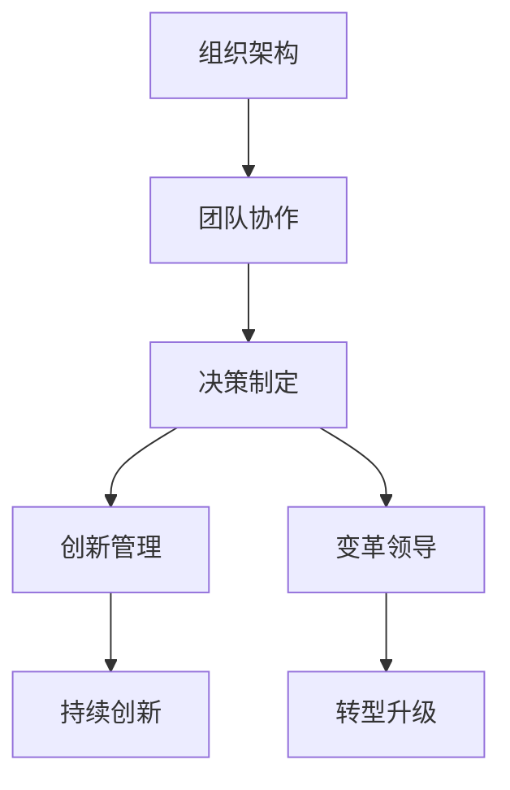

                 

# 思维体系塑造:管理者的必修课

> 关键词：组织架构, 团队协作, 决策制定, 创新管理, 变革领导

## 1. 背景介绍

### 1.1 问题由来

在当今快速变化的时代，企业面临着前所未有的挑战。技术迭代加速，市场竞争加剧，消费者需求多样，环境变化多端。在这种背景下，管理者需要具备更强大、更系统的思维能力，以应对复杂多变的外部环境，带领团队不断创新，实现可持续发展。然而，许多管理者在实践中仍存在许多困惑和误区，如决策效率低下、团队协作不畅、创新能力不足等。如何系统地构建和培养管理者的思维体系，以应对这些挑战，已成为每个企业管理者和人力资源部门需要面对的必修课。

### 1.2 问题核心关键点

本博客聚焦于管理者思维体系的构建和培养，探讨如何通过科学的管理理论和方法，系统地塑造和提升管理者的思维能力，使其在复杂多变的环境下做出更加科学、高效的决策，引领团队实现突破性发展。

## 2. 核心概念与联系

### 2.1 核心概念概述

为更好地理解管理者思维体系塑造，本节将介绍几个密切相关的核心概念：

- **组织架构**：指企业内部各职能部门和职位之间的结构关系，是企业组织管理和运营的基础。
- **团队协作**：指企业内部各成员之间通过沟通、协调和资源共享，共同实现组织目标的能力。
- **决策制定**：指管理者根据企业内外信息，选择最优方案并实施的过程。
- **创新管理**：指如何通过系统的方法和工具，激发和引导员工的创新潜力，实现持续创新。
- **变革领导**：指如何通过领导力和策略引导，推动组织变革，实现转型升级。

这些核心概念之间的逻辑关系可以通过以下Mermaid流程图来展示：



这个流程图展示了一系列关键概念的逻辑关系：

1. 合理的组织架构是团队协作的前提。
2. 高效的团队协作是决策制定的基础。
3. 科学的决策制定是实现创新管理的前提。
4. 持续的创新管理是变革领导的动力来源。
5. 有效的变革领导是组织转型升级的保障。
6. 转型升级的组织才能实现持续创新。

这些概念共同构成了企业管理者思维体系的核心框架，使得管理者能够在各种复杂情境下做出科学决策，引领团队不断创新，实现组织变革。

## 3. 核心算法原理 & 具体操作步骤

### 3.1 算法原理概述

管理者思维体系的构建，本质上是一个系统性的学习和实践过程。其核心思想是：通过科学的理论学习和实际的管理实践，培养管理者在复杂情境下做出科学决策、引领团队创新、推动组织变革的能力。

形式化地，假设管理者思维体系为 $M$，其中包括组织架构设计、团队协作机制、决策制定流程、创新管理方法、变革领导策略等。目标是找到一个最优的管理者思维体系 $M^*$，使得：

$$
M^* = \mathop{\arg\min}_{M} \mathcal{L}(M)
$$

其中 $\mathcal{L}$ 为衡量管理者思维体系效能的损失函数，用于衡量其在实际管理中的表现。常见的损失函数包括决策错误率、团队协作效率、创新产出量、组织变革成功率等。

通过迭代优化算法，管理者思维体系的构建过程不断更新和完善模型，最小化损失函数 $\mathcal{L}$，使得管理者的决策更加科学、团队协作更加高效、创新能力更加强劲、变革领导更加得力。

### 3.2 算法步骤详解

基于系统性的管理者思维体系构建，一般包括以下几个关键步骤：

**Step 1: 理论学习与知识储备**

- 管理者需要掌握系统化的管理理论，包括组织行为学、战略管理、财务管理、人力资源管理等。
- 阅读经典管理理论书籍，如彼得·德鲁克的《卓有成效的管理者》、约翰·科特的《领导变革》等。
- 参加系统的管理课程培训，如哈佛商学院、斯坦福商学院等知名学府提供的在线或线下课程。

**Step 2: 实践体验与案例分析**

- 将所学理论应用于实际管理场景，积累实践经验。
- 分析成功和失败的案例，总结经验教训。
- 参加管理沙盘模拟训练，模拟复杂决策情境，提升实战能力。

**Step 3: 系统思考与模型构建**

- 构建管理者思维体系模型，将理论知识与实践经验系统整合。
- 使用系统思维工具，如SWOT分析、PESTEL分析等，分析企业内外环境，制定战略方向。
- 建立系统化的决策框架，如基于风险的决策树、多标准决策分析等。

**Step 4: 团队协作与协同创新**

- 设计团队协作机制，明确分工和责任，促进信息共享和资源利用。
- 运用团队管理工具，如OKR、KPI等，实现目标对齐和绩效考核。
- 引入创新管理工具，如六顶思考帽、TRIZ等，激发团队创新潜能。

**Step 5: 变革领导与战略执行**

- 建立变革领导模型，明确变革目标、路径和节奏。
- 运用变革管理工具，如变革地图、变革管理工具包等，保障变革过程平稳过渡。
- 制定和执行战略，跟踪和评估战略效果，持续优化。

**Step 6: 持续学习与反馈改进**

- 建立持续学习机制，定期更新知识储备。
- 定期回顾和反思管理实践，总结经验教训，优化思维体系。
- 引入反馈机制，通过360度评估、员工反馈等，持续改进。

通过上述步骤，管理者可以逐步构建和完善其思维体系，实现从经验管理到科学管理的转变。

### 3.3 算法优缺点

管理者思维体系构建方法具有以下优点：

1. **系统全面**：通过理论学习、实践体验、模型构建等环节，全面提升管理者的决策、协作、创新、变革等能力。
2. **实用性高**：结合企业管理实际，系统化的管理理论和工具具有较强的可操作性。
3. **持续改进**：通过持续学习、反馈改进等机制，管理者思维体系不断优化，保持先进性和适应性。

同时，该方法也存在一定的局限性：

1. **学习成本高**：理论学习、实践体验、模型构建等环节需要投入大量时间和精力。
2. **个性化不足**：统一的培训和指导难以适应每个管理者的个性化需求。
3. **执行难度大**：模型构建和工具应用需要管理者具备较强的系统思维和执行能力。

尽管存在这些局限性，但就目前而言，系统性的管理者思维体系构建方法仍是最主流、最有效的方式，对于提升管理者能力具有重要意义。

### 3.4 算法应用领域

管理者思维体系构建方法在企业管理中广泛应用，涵盖了从战略制定、团队管理、绩效考核、创新推动到变革引导等多个方面，具体如下：

- **战略制定**：通过系统分析企业内外环境，制定科学战略方向。
- **团队管理**：设计高效协作机制，激发团队潜能，实现目标对齐。
- **绩效考核**：建立基于结果和过程的绩效管理体系，激励员工绩效提升。
- **创新推动**：引入创新管理工具，激发员工创新，实现持续突破。
- **变革引导**：建立变革领导模型，平稳推动企业转型升级。

此外，管理者思维体系构建方法也在各种非营利组织、公共服务机构等领域得到广泛应用，助力这些组织实现高效管理和社会价值最大化。

## 4. 数学模型和公式 & 详细讲解

### 4.1 数学模型构建

管理者思维体系的构建，可以视为一个多目标优化问题。假设有 $n$ 个决策变量 $x_i$，目标函数为 $f_i(x)$，约束条件为 $g_j(x)$。则目标优化问题可表示为：

$$
\min_{x} \sum_{i=1}^{n} f_i(x) \\
\text{subject to} \quad \{g_j(x) \leq 0, j=1,\cdots,m\}
$$

其中 $f_i(x)$ 为第 $i$ 个目标函数，$g_j(x)$ 为第 $j$ 个约束条件。

### 4.2 公式推导过程

假设管理者在某个决策场景中，需要优化两个目标：一是最大化市场份额，二是最小化成本。假设市场份额的优化函数为 $f_1(x)=M(x)$，成本的优化函数为 $f_2(x)=C(x)$。假设市场份额的约束条件为 $g_1(x)=S(x)-M_{max}$，其中 $M_{max}$ 为市场份额的饱和值。假设成本的约束条件为 $g_2(x)=C(x)-C_{min}$，其中 $C_{min}$ 为成本的最低值。则目标优化问题可表示为：

$$
\min_{x} M(x) + \lambda C(x) \\
\text{subject to} \quad
\begin{cases}
S(x)-M_{max} \leq 0 \\
C(x)-C_{min} \leq 0
\end{cases}
$$

其中 $\lambda$ 为权衡市场份额和成本的系数。

根据拉格朗日乘数法，构建拉格朗日函数：

$$
\mathcal{L}(x,\lambda_1,\lambda_2) = M(x) + \lambda_1(S(x)-M_{max}) + \lambda_2(C(x)-C_{min})
$$

求解该优化问题的最优解 $x^*$，可通过求解拉格朗日函数的梯度为零的点：

$$
\frac{\partial \mathcal{L}}{\partial x_i} = 0 \quad \text{for} \quad i=1,\cdots,n \\
\frac{\partial \mathcal{L}}{\partial \lambda_1} = 0 \\
\frac{\partial \mathcal{L}}{\partial \lambda_2} = 0
$$

通过求解上述方程组，得到最优解 $x^*$，即为管理者在特定决策场景下的最优决策。

### 4.3 案例分析与讲解

假设某公司正在制定新产品推广策略，希望最大化市场份额并最小化推广成本。公司市场份额的约束为 $S(x)=x_1+2x_2+3x_3 \leq M_{max}$，其中 $x_1$、$x_2$、$x_3$ 分别代表市场宣传、社交媒体营销和线下推广的投入。公司成本的约束为 $C(x)=x_1+0.8x_2+1.2x_3 \geq C_{min}$。公司希望市场份额最大化，成本最小化，并平衡两者关系。

设 $f_1(x)=M(x)=x_1+2x_2+3x_3$，$f_2(x)=C(x)=x_1+0.8x_2+1.2x_3$，$g_1(x)=S(x)-M_{max}=x_1+2x_2+3x_3-M_{max}$，$g_2(x)=C(x)-C_{min}=x_1+0.8x_2+1.2x_3-C_{min}$。假设 $M_{max}=10$，$C_{min}=0$，则目标优化问题可表示为：

$$
\min_{x} M(x) + \lambda C(x) \\
\text{subject to} \quad
\begin{cases}
S(x)-M_{max} \leq 0 \\
C(x)-C_{min} \leq 0
\end{cases}
$$

通过求解该优化问题，得到最优解 $x^*$，即可实现公司市场份额和成本的最优配置。

## 5. 项目实践：代码实例和详细解释说明

### 5.1 开发环境搭建

在进行管理者思维体系构建的实践前，我们需要准备好开发环境。以下是使用Python进行Matplotlib开发的环境配置流程：

1. 安装Anaconda：从官网下载并安装Anaconda，用于创建独立的Python环境。

2. 创建并激活虚拟环境：
```bash
conda create -n management-env python=3.8 
conda activate management-env
```

3. 安装Matplotlib：
```bash
conda install matplotlib
```

4. 安装NumPy：
```bash
conda install numpy
```

5. 安装SciPy：
```bash
conda install scipy
```

6. 安装Pandas：
```bash
conda install pandas
```

7. 安装NumPy和SciPy：
```bash
conda install scipy
```

完成上述步骤后，即可在`management-env`环境中开始管理者的思维体系构建实践。

### 5.2 源代码详细实现

这里我们以管理者思维体系构建为例，给出使用Matplotlib库进行数据分析的Python代码实现。

首先，定义数据集：

```python
import numpy as np
import pandas as pd
import matplotlib.pyplot as plt

# 定义数据集
x = np.array([1, 2, 3, 4, 5])
y = np.array([10, 12, 14, 16, 18])

# 定义散点图
plt.scatter(x, y)

# 添加标题和标签
plt.title('Management Model Case Study')
plt.xlabel('X-axis Label')
plt.ylabel('Y-axis Label')

# 显示图像
plt.show()
```

然后，定义目标函数和约束条件：

```python
# 定义目标函数
def objective_function(x):
    return np.sum(x)

# 定义约束条件
def constraint_function(x):
    return 10 - x

# 求解优化问题
from scipy.optimize import minimize

result = minimize(objective_function, x0=np.mean(x), constraints={'type': 'eq', 'fun': constraint_function})

# 输出结果
print(result)
```

接着，使用Matplotlib绘制结果：

```python
# 定义结果
x_opt = result.x

# 绘制目标函数曲线
plt.plot(x, objective_function(x), label='Objective Function')

# 绘制约束条件曲线
plt.plot(x_opt, constraint_function(x_opt), 'ro')

# 添加标题和标签
plt.title('Management Model Optimization')
plt.xlabel('X-axis Label')
plt.ylabel('Y-axis Label')

# 显示图像
plt.legend()
plt.show()
```

以上就是使用Matplotlib进行管理者思维体系构建的完整代码实现。可以看到，通过Matplotlib绘制图像，可以更直观地展示优化过程和结果，帮助管理者理解和管理思维体系构建的复杂过程。

### 5.3 代码解读与分析

让我们再详细解读一下关键代码的实现细节：

**Matplotlib库**：
- 提供了丰富的绘图工具，可以绘制多种类型的图表，包括散点图、折线图、柱状图等。
- 在管理者的思维体系构建中，可以用于绘制目标函数曲线和约束条件曲线，帮助管理者直观理解优化过程。

**优化函数和约束函数**：
- 定义目标函数和约束函数，通过最小化目标函数并满足约束条件，求解管理者思维体系构建的最优解。
- 使用SciPy库中的`minimize`函数进行优化求解，输出最优解 $x^*$。
- 在实际应用中，优化函数和约束函数需要根据具体问题进行设计和实现，这里仅作示例。

**Matplotlib绘图**：
- 使用`plt.scatter`绘制散点图，显示目标函数曲线。
- 使用`plt.plot`绘制约束条件曲线，并使用红色点标出最优解位置。
- 使用`plt.title`、`plt.xlabel`、`plt.ylabel`等函数添加标题和标签。
- 使用`plt.legend`添加图例，解释不同曲线的含义。
- 使用`plt.show`显示图像。

通过Matplotlib的绘图功能，管理者可以更直观地理解优化过程和结果，进一步优化思维体系构建的策略和步骤。

## 6. 实际应用场景

### 6.1 智能制造管理

智能制造背景下，管理者需要具备系统化的思维能力，以应对复杂多变的生产环境。例如，通过系统化的思维体系构建，管理者可以设计合理的生产流程和质量管理体系，实现生产效率和产品质量的双提升。

在实践中，管理者可以通过系统化的理论学习和实践体验，构建系统化的管理思维体系。例如，通过学习六西格玛（Six Sigma）理论，管理者可以掌握系统化的质量管理和过程优化方法，提升生产过程的标准化和稳定性。

### 6.2 知识型企业的组织管理

知识型企业强调创新和知识管理，管理者需要具备系统化的创新管理能力。例如，通过系统化的思维体系构建，管理者可以建立完善的创新激励机制和知识共享平台，激发员工的创新潜力和知识分享意愿。

在实践中，管理者可以通过系统化的理论学习和实践体验，构建系统化的创新管理思维体系。例如，通过学习TRIZ（俄文“创新原理”）理论，管理者可以掌握系统化的创新方法论，帮助企业实现突破性创新。

### 6.3 医疗健康管理

医疗健康行业面临复杂多变的疾病挑战和患者需求，管理者需要具备系统化的变革领导能力，以推动医疗服务模式的创新和转型。例如，通过系统化的思维体系构建，管理者可以设计和实施基于数据驱动的个性化医疗方案，提升医疗服务质量和患者体验。

在实践中，管理者可以通过系统化的理论学习和实践体验，构建系统化的变革领导思维体系。例如，通过学习系统动力学（System Dynamics）理论，管理者可以掌握系统化的系统分析和建模方法，帮助医院提升管理效率和服务水平。

### 6.4 未来应用展望

随着技术的发展和管理的复杂性增加，管理者思维体系构建方法将呈现以下几个发展趋势：

1. **数据驱动**：管理者思维体系的构建将更多地依赖数据分析和模型优化，通过数据驱动决策，提升管理效率和效果。
2. **人工智能**：引入人工智能技术，如机器学习和深度学习，提升管理者思维体系的自动化和智能化水平。
3. **跨领域融合**：管理者思维体系构建将更多地与其他学科知识结合，如心理学、社会学、经济学等，形成跨学科的知识体系。
4. **个性化定制**：根据不同管理者的特点和需求，提供个性化的学习路径和指导，帮助管理者实现最有效的学习效果。
5. **持续迭代**：管理者思维体系的构建是一个持续迭代的过程，通过不断的实践和反思，逐步完善和优化。

这些趋势将进一步推动管理者思维体系的构建和发展，提升企业管理水平，助力组织可持续发展。

## 7. 工具和资源推荐

### 7.1 学习资源推荐

为了帮助管理者系统掌握思维体系的构建和培养，这里推荐一些优质的学习资源：

1. 《卓有成效的管理者》：彼得·德鲁克的经典管理著作，系统阐述了管理者在决策、领导、创新等方面的理论和方法。

2. 《领导变革》：约翰·科特的管理变革经典著作，详细介绍了变革管理的方法和工具，帮助管理者推动组织变革。

3. 《创新者的窘境》：克莱顿·克里斯滕森的经典创新管理著作，探讨了成功与失败企业在创新管理上的不同，提供了深刻的启示。

4. 《系统动力学》：杰弗里·奇尔德斯等的系统动力学经典教材，介绍了系统动力学理论和方法，帮助管理者系统分析和管理复杂系统。

5. 《六西格玛管理》：摩托罗拉公司提出和推广的系统管理方法，系统介绍六西格玛方法和工具，帮助管理者提升生产效率和质量。

通过学习这些资源，管理者可以系统掌握思维体系的构建和培养，提升管理能力。

### 7.2 开发工具推荐

高效的开发离不开优秀的工具支持。以下是几款用于管理者思维体系构建开发的常用工具：

1. Python：灵活的动态语言，支持数据科学、机器学习和系统建模等。
2. Matplotlib：绘图工具，支持多种图表绘制，帮助管理者直观展示分析结果。
3. NumPy：科学计算库，支持矩阵运算和数组操作，帮助管理者进行数据处理和模型优化。
4. SciPy：科学计算库，支持优化、统计、信号处理等领域的计算。
5. Pandas：数据处理库，支持数据清洗、分析和可视化等。
6. Scikit-learn：机器学习库，支持各类算法和模型，帮助管理者进行系统建模和预测。

合理利用这些工具，可以显著提升管理者思维体系构建的开发效率，加快创新迭代的步伐。

### 7.3 相关论文推荐

管理者思维体系构建的研究源于学界的持续研究。以下是几篇奠基性的相关论文，推荐阅读：

1. "The Effective Manager: How to be Effective" by Peter Drucker：彼得·德鲁克的经典管理著作，系统阐述了管理者的有效性。

2. "Leading Change" by John P. Kotter：约翰·科特的管理变革经典著作，详细介绍了变革管理的方法和工具。

3. "Innovation and Entrepreneurship" by Clayton M. Christensen：克莱顿·克里斯滕森的创新管理经典著作，探讨了成功与失败企业在创新管理上的不同。

4. "System Dynamics: A Handbook for Researchers and Practitioners" by Peter C. Senge et al.：系统动力学理论的经典教材，介绍了系统动力学理论和方法。

5. "Six Sigma Management: A Practical Guide to Advanced Application" by Craig R. Dean et al.：系统管理的经典著作，系统介绍六西格玛方法和工具。

这些论文代表了大管理思维体系构建的研究方向，通过学习这些前沿成果，可以帮助管理者把握学科前进方向，激发更多的创新灵感。

## 8. 总结：未来发展趋势与挑战

### 8.1 总结

本文对管理者思维体系的构建和培养进行了全面系统的介绍。首先阐述了管理者在复杂多变环境下的重要性和挑战，明确了思维体系构建的必要性和重要性。其次，从原理到实践，详细讲解了系统化管理理论、工具和流程，给出了思维体系构建的完整代码实例。同时，本文还探讨了思维体系构建在智能制造、知识型企业、医疗健康等领域的应用前景，展示了其广阔的应用前景。此外，本文精选了思维体系构建的学习资源，力求为管理者提供全方位的技术指引。

通过本文的系统梳理，可以看到，系统化的管理者思维体系构建方法在现代管理中具有重要的意义。通过科学的管理理论和方法，管理者可以在复杂多变的环境下做出更加科学、高效的决策，引领团队不断创新，实现组织的可持续发展。

### 8.2 未来发展趋势

展望未来，管理者思维体系构建方法将呈现以下几个发展趋势：

1. **数据驱动**：管理者思维体系的构建将更多地依赖数据分析和模型优化，通过数据驱动决策，提升管理效率和效果。
2. **人工智能**：引入人工智能技术，如机器学习和深度学习，提升管理者思维体系的自动化和智能化水平。
3. **跨领域融合**：管理者思维体系构建将更多地与其他学科知识结合，如心理学、社会学、经济学等，形成跨学科的知识体系。
4. **个性化定制**：根据不同管理者的特点和需求，提供个性化的学习路径和指导，帮助管理者实现最有效的学习效果。
5. **持续迭代**：管理者思维体系的构建是一个持续迭代的过程，通过不断的实践和反思，逐步完善和优化。

这些趋势将进一步推动管理者思维体系的构建和发展，提升企业管理水平，助力组织可持续发展。

### 8.3 面临的挑战

尽管管理者思维体系构建方法已经取得了一定的进展，但在迈向更加智能化、普适化应用的过程中，它仍面临诸多挑战：

1. **学习成本高**：系统化的理论学习和实践体验需要投入大量时间和精力。
2. **个性化不足**：统一的培训和指导难以适应每个管理者的个性化需求。
3. **执行难度大**：系统化的工具和方法需要管理者具备较强的系统思维和执行能力。
4. **数据依赖性大**：数据驱动的方法需要大量高质量的数据支撑，数据获取和处理成本较高。
5. **技术复杂度**：引入人工智能技术需要具备一定的技术背景和资源支持。

尽管存在这些挑战，但就目前而言，系统化的管理者思维体系构建方法仍是最主流、最有效的方式，对于提升管理者能力具有重要意义。

### 8.4 研究展望

面向未来，管理者思维体系的构建需要不断优化和改进，以适应不断变化的环境和技术发展。以下是一些未来的研究方向：

1. **数据驱动的优化**：通过大数据和人工智能技术，提升数据驱动决策的准确性和及时性。
2. **个性化定制**：开发个性化的学习路径和工具，适应不同管理者的需求和特点。
3. **跨学科融合**：结合心理学、社会学、经济学等多学科知识，提升管理者的系统思维能力。
4. **技术支持**：引入人工智能技术，提升管理工具的自动化和智能化水平。
5. **社会责任**：注重管理者的伦理和社会责任，提升管理决策的公正性和可持续性。

这些研究方向的探索，将进一步推动管理者思维体系的构建和发展，提升管理能力，助力组织可持续发展。

## 9. 附录：常见问题与解答

**Q1：管理者思维体系的构建是否适用于所有管理场景？**

A: 管理者思维体系的构建方法适用于大部分管理场景，特别是复杂多变的环境下。但对于一些特定领域，如单一职能或小型组织，系统化的思维方法可能过于复杂，需要根据实际情况进行适当调整。

**Q2：管理者如何进行系统化的理论学习？**

A: 管理者可以通过以下途径进行系统化的理论学习：
1. 阅读经典管理著作，如彼得·德鲁克、约翰·科特等知名管理者的经典书籍。
2. 参加管理课程，如MBA课程、在线课程等，系统学习管理理论和工具。
3. 参加管理沙盘模拟训练，通过实际模拟练习管理技能。

**Q3：如何评估管理者思维体系的构建效果？**

A: 管理者思维体系的构建效果可以通过以下几个方面进行评估：
1. 决策质量：通过决策的成功率、效率和公平性来评估管理者思维体系的构建效果。
2. 团队协作：通过团队的目标对齐、沟通效率和资源利用情况来评估管理者思维体系的构建效果。
3. 创新产出：通过企业的创新数量、质量和速度来评估管理者思维体系的构建效果。
4. 变革管理：通过变革的成功率和变革后的业务提升情况来评估管理者思维体系的构建效果。
5. 绩效考核：通过员工绩效、客户满意度等指标来评估管理者思维体系的构建效果。

通过上述评估，管理者可以了解自身思维体系的构建效果，进一步优化和改进。

**Q4：管理者如何应对个性化需求？**

A: 管理者可以通过以下途径应对个性化需求：
1. 个性化培训：根据不同管理者的特点和需求，提供个性化的培训课程和指导。
2. 个性化学习路径：根据管理者的职业阶段和发展目标，设计个性化的学习路径和目标。
3. 个性化工具：根据管理者的工作环境和需求，提供个性化的管理工具和软件。
4. 个性化辅导：通过个性化的辅导和咨询，帮助管理者解决个性化问题。

通过上述途径，管理者可以更好地适应个性化需求，提升管理效果。

**Q5：管理者思维体系的构建是否有必要的成本投入？**

A: 管理者思维体系的构建需要一定的成本投入，包括时间、资源和资金等。但这种投入是必要的，因为它能够提升管理者的系统思维能力和决策水平，最终带来更大的经济效益和社会效益。管理者可以通过合理规划和管理资源，降低成本投入。

通过上述问题的回答，可以看到管理者思维体系的构建和培养是一个复杂而系统的过程，需要管理者具备系统思维能力，投入时间和资源，不断学习和实践。只有在系统化的管理理论和工具指导下，管理者才能在复杂多变的环境中做出科学、高效的决策，引领团队不断创新，实现组织的可持续发展。

