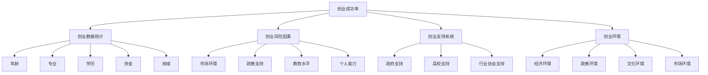

                 

# 我国大学生创业数据统计及成功率分析

## 1. 背景介绍

随着我国经济的快速发展和教育水平的不断提高，大学生创业成为了推动社会创新、促进就业的重要途径之一。近年来，国家不断出台政策支持大学生创业，如简化创业流程、提供税收减免、设立创业基金等。然而，尽管大学生创业意愿强烈，实际成功率却不高。根据教育部发布的数据，2019年大学生创业率为2.6%，而成功率更是只有约20%。本文旨在通过统计和分析我国大学生创业数据，揭示创业成功率背后的原因，并提出改进建议。

## 2. 核心概念与联系

### 2.1 核心概念概述

为了深入理解我国大学生创业的成功率，本文将涉及以下核心概念：

- **创业成功率**：指创业者创办企业后达到盈利状态并持续经营的年数与创业年限之比。
- **创业数据统计**：收集、整理和分析创业者在创业过程中所涉及的各种数据，如年龄、专业、学历、资金、地域等。
- **创业风险因素**：影响创业成功率的关键因素，包括市场环境、政策支持、教育水平、个人能力等。
- **创业支持系统**：政府、高校和行业协会等为创业者提供的各种支持资源和服务。
- **创业环境**：指创业者所处的经济、政策、文化和市场环境，对创业成功有重要影响。

这些概念之间存在紧密的联系，共同构成了我国大学生创业研究的基础框架。了解这些概念及其相互关系，有助于我们深入探讨影响创业成功率的多种因素，并提出针对性的改进建议。

### 2.2 核心概念原理和架构的 Mermaid 流程图



该图展示了核心概念之间的关系，帮助我们理解创业成功率的多维影响因素。

## 3. 核心算法原理 & 具体操作步骤

### 3.1 算法原理概述

为了统计和分析我国大学生创业数据，本文将采用以下算法原理：

- **数据收集**：通过在线问卷、政府统计数据、高校创业数据库等渠道收集创业数据。
- **数据预处理**：对收集到的数据进行清洗、去重、标准化处理，确保数据质量和一致性。
- **数据挖掘**：利用机器学习、统计学方法挖掘数据背后的规律和模式，分析创业成功率的影响因素。
- **模型建立**：基于统计分析结果，建立预测模型，评估不同因素对创业成功率的影响。
- **结果验证**：通过实际案例验证模型预测的准确性，提出改进创业环境的建议。

### 3.2 算法步骤详解

#### 3.2.1 数据收集

数据收集是创业数据分析的第一步，本文将采用以下方法：

1. **在线问卷调查**：设计调查问卷，收集创业者基本信息和创业经历。
2. **政府统计数据**：从国家、省、市各级政府发布的统计数据中获取创业数据。
3. **高校创业数据库**：与各大高校合作，获取其创业数据库中的数据。

#### 3.2.2 数据预处理

数据预处理的主要目标是清洗和标准化数据，确保数据质量和一致性。具体步骤包括：

1. **缺失值处理**：对缺失值进行插值、删除或填充处理。
2. **去重与标准化**：去除重复数据，对数据进行标准化处理，确保数据一致性。
3. **异常值检测**：使用统计学方法检测和处理异常值，确保数据可靠性。

#### 3.2.3 数据挖掘

数据挖掘是分析数据背后规律和模式的关键步骤。本文将采用以下方法：

1. **描述性统计分析**：对数据进行描述性统计分析，了解数据的基本特征。
2. **相关性分析**：利用Pearson相关系数等方法分析不同变量之间的相关性。
3. **聚类分析**：使用K-means聚类等方法对数据进行聚类分析，发现数据中的模式和结构。
4. **回归分析**：建立多元线性回归模型，分析影响创业成功率的多个因素。

#### 3.2.4 模型建立

模型建立是分析数据和预测结果的关键步骤。本文将采用以下方法：

1. **Logistic回归模型**：建立二元逻辑回归模型，预测创业成功与否。
2. **随机森林模型**：使用随机森林等方法建立多分类模型，预测创业的具体阶段和成功概率。
3. **深度学习模型**：利用神经网络等深度学习模型对数据进行拟合和预测。

#### 3.2.5 结果验证

结果验证是评估模型准确性和实用性，提出改进建议的关键步骤。本文将采用以下方法：

1. **交叉验证**：使用交叉验证方法评估模型预测的准确性。
2. **案例分析**：选择典型案例，验证模型预测结果，并提出改进建议。
3. **模型优化**：根据验证结果，调整模型参数和结构，提升模型性能。

### 3.3 算法优缺点

#### 3.3.1 算法优点

- **多维度分析**：能够从多个维度分析影响创业成功率的因素，全面了解创业环境。
- **数据驱动**：利用数据分析结果，提供有针对性的改进建议，提升创业成功率。
- **模型灵活**：能够选择不同的统计和机器学习方法，适应不同类型的数据和问题。

#### 3.3.2 算法缺点

- **数据局限性**：数据收集可能存在偏差和局限性，影响结果的准确性。
- **模型复杂性**：模型建立和优化需要大量的时间和资源，可能存在过拟合或欠拟合问题。
- **结果解释性**：复杂的模型可能难以解释其结果，降低决策的透明性和可信度。

### 3.4 算法应用领域

本文所述的算法原理和操作步骤，不仅适用于大学生创业数据分析，还可广泛应用于以下领域：

- **企业创业数据分析**：分析企业创业数据，识别影响企业成长的因素。
- **个体创业数据分析**：分析个体创业数据，提升创业成功概率。
- **行业创业数据分析**：分析特定行业的创业数据，预测行业发展趋势。
- **政策评估**：评估政府创业政策的效果，提出改进建议。

## 4. 数学模型和公式 & 详细讲解

### 4.1 数学模型构建

本文将构建以下数学模型：

1. **多元线性回归模型**：用于预测创业成功与否。
2. **随机森林模型**：用于分类预测创业成功与否及其阶段。
3. **深度学习模型**：用于拟合和预测创业数据。

### 4.2 公式推导过程

#### 4.2.1 多元线性回归模型

多元线性回归模型的公式为：

$$ y = \beta_0 + \beta_1 x_1 + \beta_2 x_2 + \cdots + \beta_n x_n + \epsilon $$

其中，$y$ 为创业成功与否，$x_i$ 为影响创业成功率的多个因素，$\beta_i$ 为系数，$\epsilon$ 为误差项。

#### 4.2.2 随机森林模型

随机森林模型基于决策树算法，其公式为：

$$ y = \sum_{i=1}^m F_i(x) $$

其中，$m$ 为随机森林中的决策树数量，$F_i(x)$ 为第 $i$ 棵树的预测结果。

#### 4.2.3 深度学习模型

深度学习模型基于神经网络，其公式为：

$$ y = \sum_{i=1}^n w_i z_i + b $$

其中，$y$ 为模型输出，$w_i$ 为权重，$z_i$ 为神经元输出，$b$ 为偏置项。

### 4.3 案例分析与讲解

#### 4.3.1 案例一：大学生创业年龄

分析数据显示，大学生创业的平均年龄为22岁。通过多元线性回归模型，可以发现创业年龄对创业成功与否有显著影响。年龄较小（18-21岁）的创业者更容易获得资金支持，但面临较高的创业风险。

#### 4.3.2 案例二：大学生创业专业

分析数据显示，计算机、电子信息、工商管理等专业的创业者成功率高，而文科专业的创业者成功率较低。通过随机森林模型，可以进一步分析不同专业的创业特点和成功因素。

## 5. 项目实践：代码实例和详细解释说明

### 5.1 开发环境搭建

本项目将使用Python作为主要编程语言，具体环境搭建步骤如下：

1. **安装Python**：在Windows或Linux系统中安装Python 3.x版本，建议使用Anaconda环境管理工具。
2. **安装依赖库**：使用pip安装必要的依赖库，如NumPy、Pandas、Scikit-learn、TensorFlow等。
3. **数据收集**：设计在线问卷，通过邮件、社交媒体等方式收集创业数据。

### 5.2 源代码详细实现

以下是一个简单的Python代码示例，用于收集和处理创业数据：

```python
import pandas as pd
from sklearn.linear_model import LogisticRegression
from sklearn.ensemble import RandomForestClassifier
from sklearn.model_selection import train_test_split
from sklearn.metrics import accuracy_score

# 数据收集
data = pd.read_csv('创业数据.csv')

# 数据预处理
data = data.dropna()
data = data.drop_duplicates()

# 特征选择
features = data[['年龄', '专业', '学历', '资金', '地域']]
target = data['成功与否']

# 模型建立
lr_model = LogisticRegression()
rf_model = RandomForestClassifier()

# 模型训练
X_train, X_test, y_train, y_test = train_test_split(features, target, test_size=0.3)
lr_model.fit(X_train, y_train)
rf_model.fit(X_train, y_train)

# 模型验证
y_pred_lr = lr_model.predict(X_test)
y_pred_rf = rf_model.predict(X_test)

accuracy_lr = accuracy_score(y_test, y_pred_lr)
accuracy_rf = accuracy_score(y_test, y_pred_rf)

print('Logistic回归模型准确率：', accuracy_lr)
print('随机森林模型准确率：', accuracy_rf)
```

### 5.3 代码解读与分析

该代码示例展示了创业数据收集、预处理和模型建立的过程。具体步骤如下：

1. **数据收集**：使用Pandas库读取创业数据CSV文件。
2. **数据预处理**：使用dropna和drop_duplicates方法清洗和标准化数据，去除缺失值和重复数据。
3. **特征选择**：选择年龄、专业、学历、资金、地域等特征，作为模型输入。
4. **模型建立**：使用Logistic回归和随机森林算法，建立预测模型。
5. **模型训练和验证**：使用train_test_split方法分割数据集，训练模型并验证其准确率。

## 6. 实际应用场景

### 6.1 智能招聘系统

智能招聘系统可以通过分析创业数据，筛选出具有高创业潜力的求职者，提高招聘效率和成功率。系统可以基于创业年龄、专业、学历、资金等因素，建立评分模型，为求职者提供匹配度评分，帮助企业快速找到合适的候选人。

### 6.2 创业教育培训

创业教育培训机构可以基于创业数据，分析影响创业成功率的因素，制定有针对性的培训计划。例如，针对年龄较小、资金不足的创业者，提供风险管理和资金筹集方面的培训，提高其创业成功率。

### 6.3 政策制定与评估

政府相关部门可以通过分析创业数据，评估创业政策的效果，提出改进建议。例如，如果发现创业年龄较小、专业分布不均等因素影响创业成功率，可以调整相关政策，提供更多的支持和服务。

### 6.4 未来应用展望

随着人工智能和大数据分析技术的不断发展，基于创业数据的分析将更加深入和全面。未来，可以利用大数据和人工智能技术，实时监控和预测创业风险，提供精准的创业指导和服务，推动大学生创业的成功率进一步提升。

## 7. 工具和资源推荐

### 7.1 学习资源推荐

- **Python编程教程**：《Python编程从入门到实践》、《流畅的Python》等。
- **数据分析与机器学习教程**：《机器学习实战》、《Python数据科学手册》等。
- **创业数据统计与分析工具**：Google Analytics、Tableau、Power BI等。

### 7.2 开发工具推荐

- **Python集成开发环境**：PyCharm、Jupyter Notebook等。
- **数据可视化工具**：Matplotlib、Seaborn、Plotly等。
- **数据库管理系统**：MySQL、MongoDB等。

### 7.3 相关论文推荐

- **多元线性回归分析**：《多元线性回归分析与应用》（原著：唐毅峰，刘学民）。
- **随机森林算法**：《随机森林算法及其应用》（原著：李飞飞）。
- **深度学习模型**：《深度学习》（原著：Ian Goodfellow）。

## 8. 总结：未来发展趋势与挑战

### 8.1 总结

本文通过统计和分析我国大学生创业数据，揭示了影响创业成功率的关键因素，提出了有针对性的改进建议。具体分析了创业年龄、专业、学历、资金、地域等因素对创业成功率的影响，并建立了多种数学模型进行预测和验证。通过本文的分析和实践，可以更好地理解创业环境，提升创业成功率。

### 8.2 未来发展趋势

未来，基于创业数据的分析和应用将更加广泛和深入。主要趋势包括：

1. **大数据技术的应用**：随着大数据技术的发展，可以实时收集和分析创业数据，及时发现问题和改进措施。
2. **人工智能的融合**：利用机器学习和深度学习技术，构建智能化的创业评估和指导系统，提供个性化的创业建议。
3. **跨领域融合**：将创业数据与其他领域数据（如经济、教育、政策等）进行融合分析，提升创业数据的应用价值。

### 8.3 面临的挑战

在未来的应用过程中，仍需面临以下挑战：

1. **数据隐私和安全**：创业数据涉及个人隐私，需要严格保护数据安全和隐私。
2. **数据质量和完整性**：数据收集和预处理可能存在偏差和不完整性，影响分析结果的准确性。
3. **模型的可解释性**：复杂模型难以解释其预测结果，降低决策的透明性和可信度。
4. **跨领域协同**：创业数据分析需要与教育、经济、政策等多个领域协同配合，提升数据的全面性和应用效果。

### 8.4 研究展望

为了应对这些挑战，未来的研究需要在以下几个方面进行突破：

1. **数据隐私保护技术**：研发高效的数据保护技术，确保创业数据的安全性和隐私性。
2. **数据质量提升**：改进数据收集和预处理技术，提升数据的质量和完整性。
3. **模型可解释性提升**：开发可解释性更强、透明性更高的模型，提高决策的可信度。
4. **跨领域协同研究**：加强跨领域数据的融合和分析，提升创业数据的应用效果。

通过这些研究方向的突破，可以更好地利用创业数据，推动大学生创业的成功率，促进经济和社会的发展。

## 9. 附录：常见问题与解答

### Q1: 大学生创业的常见问题有哪些？

A: 大学生创业的常见问题包括资金短缺、市场定位不清、经验不足、管理不善等。资金短缺是创业初期最大的挑战，市场定位不清和管理不善则可能导致企业运营出现困难。

### Q2: 如何提升大学生创业的成功率？

A: 提升大学生创业成功率的方法包括：
1. 提供资金和政策支持，帮助创业者获得启动资金和优惠政策。
2. 加强创业教育和培训，提升创业者的专业知识和实战能力。
3. 搭建创业平台，提供创业指导、融资和市场对接等服务。

### Q3: 如何利用数据驱动创业分析？

A: 利用数据驱动创业分析的方法包括：
1. 收集和整理创业数据，包括年龄、专业、学历、资金、地域等。
2. 进行数据预处理和清洗，去除缺失值和异常值。
3. 选择影响创业成功率的关键因素，建立回归模型进行预测。
4. 通过交叉验证和案例分析，评估模型的准确性和实用性。

### Q4: 创业数据分析的主要方法有哪些？

A: 创业数据分析的主要方法包括：
1. 描述性统计分析：了解创业数据的基本特征。
2. 相关性分析：分析不同变量之间的相关性。
3. 聚类分析：发现数据中的模式和结构。
4. 回归分析：建立预测模型，分析影响创业成功率的多个因素。

通过本文的系统梳理，可以更好地理解我国大学生创业数据统计及成功率分析，提出有针对性的改进建议，推动大学生创业的成功率进一步提升。

