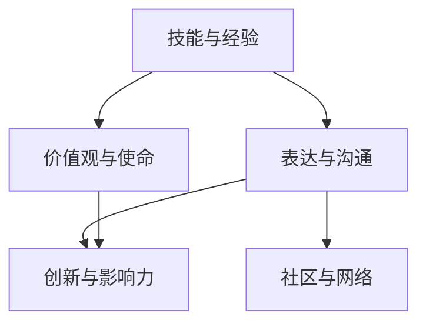

                 

# 打造个人品牌纪录片：讲述你的成长故事

## 1. 背景介绍

### 1.1 问题由来
在快速发展的数字时代，个人品牌建设成为了人们实现职业发展、提升影响力的重要途径。特别是在IT领域，拥有强大的技术能力、丰富的工作经验，并具备良好表达能力和创新思维的科技工作者，通过打造个人品牌，不仅能够赢得更多的职业机会，还能在社区中建立权威，激发行业讨论，引领技术潮流。

然而，并非每个人都能自然成为行业先锋。对于大部分专业人士来说，打造个人品牌是一个复杂且耗时的过程。特别是在职场竞争激烈、信息爆炸的时代，如何高效、精准地打造个人品牌，成为了一个亟待解决的难题。

## 2. 核心概念与联系

### 2.1 核心概念概述

构建个人品牌，实际上是一个复杂的信号处理过程。个人的技能、经验、价值观等内在素质，需要经过精心设计和传达，才能在目标受众中留下深刻印象，形成品牌效应。以下概念是构建个人品牌的关键要素：

- **技能与经验**：个人在职业生涯中积累的专业技能和行业经验，是打造个人品牌的重要基础。
- **价值观与使命**：个人的核心价值观和职业使命，是品牌人格的体现，影响着品牌形象的塑造。
- **表达与沟通**：通过文章、演讲、社交媒体等多种渠道，表达个人思想和见解，形成持续的互动和共鸣。
- **社区与网络**：积极参与专业社区和技术网络，建立人脉关系，形成影响力。
- **创新与影响力**：不断推陈出新，提出独到见解，形成行业影响力，引领技术潮流。

### 2.2 核心概念联系

个人品牌构建的过程中，各个核心概念之间相互关联，共同构成了一个多维度的品牌模型。技能与经验为品牌提供了实质内容，价值观与使命为品牌注入了灵魂，表达与沟通使品牌得以传达，社区与网络使品牌能够扩散，创新与影响力使品牌持续焕发新生。

以下是一个简化的Mermaid流程图，展示这些核心概念之间的联系：



## 3. 核心算法原理 & 具体操作步骤

### 3.1 算法原理概述

个人品牌构建本质上是一个以目标受众为核心的优化过程。通过设计品牌信号，在不同受众群体中形成最大化认知，从而提升品牌价值和影响力。这一过程可以抽象为如下数学模型：

设个人品牌信号 $S$，目标受众群体 $U$，品牌价值函数 $V(S, U)$。品牌构建的目标是最大化品牌价值 $V(S, U)$，即：

$$
\max_{S} V(S, U)
$$

其中，品牌信号 $S$ 包括但不限于技能、经验、表达、社区、创新等，目标受众 $U$ 可以根据具体品牌定位细分为不同的子群体。

### 3.2 算法步骤详解

构建个人品牌的方法步骤如下：

**Step 1: 分析目标受众**
- 确定品牌的核心目标受众群体，分析其需求、兴趣和行为特征。
- 通过调查问卷、社交媒体分析等方法，收集受众信息，指导品牌定位。

**Step 2: 设计品牌信号**
- 根据受众分析结果，设计符合受众期望的品牌信号，包括技术输出、表达风格、社区互动等。
- 使用SMART原则（具体、可测量、可达成、相关、时限）定义品牌目标，确保品牌信号有明确的导向和评价标准。

**Step 3: 实施品牌传播**
- 选择合适的传播渠道，包括博客、社交媒体、技术会议等，系统传达品牌信号。
- 制定品牌传播计划，确保信号的连续性和一致性，逐步积累品牌认知度。

**Step 4: 评估与迭代**
- 定期评估品牌效果，通过反馈和数据分析，调整品牌策略和传播计划。
- 持续迭代品牌传播方案，提升品牌价值和受众满意度。

### 3.3 算法优缺点

个人品牌构建方法的优点在于：
1. 系统性：通过系统分析受众需求和行为，设计符合预期的品牌信号。
2. 可操作性：方法步骤清晰，易于执行和评估。
3. 持续性：通过不断的评估和迭代，品牌信号可以持续优化。

其缺点主要体现在：
1. 高成本：品牌构建需要大量的时间和资源，特别是前期受众分析阶段。
2. 不确定性：受众行为和市场环境变化迅速，品牌策略需要灵活调整。
3. 复杂性：品牌信号设计涉及多维度因素，需要综合考虑。

### 3.4 算法应用领域

个人品牌构建方法不仅适用于IT专业人士，还适用于各个行业领域，包括但不限于：

- 教师：通过撰写学术论文、公开讲座，树立学术品牌。
- 艺术家：通过作品展览、社交媒体互动，提升艺术品牌。
- 企业家：通过商业项目、行业活动，展示企业品牌。
- 媒体从业者：通过媒体报道、网络互动，打造个人形象。

这些行业领域的品牌构建，都可以参考上述方法和步骤，通过科学设计和持续传播，实现品牌价值的最大化。

## 4. 数学模型和公式 & 详细讲解

### 4.1 数学模型构建

个人品牌价值 $V(S, U)$ 可以分为两个部分：品牌信号的知名度 $V_D$ 和受众的认可度 $V_A$。即：

$$
V(S, U) = V_D(S) + V_A(S, U)
$$

其中，知名度 $V_D(S)$ 指品牌信号在受众中的可见度，认可度 $V_A(S, U)$ 指受众对品牌信号的正面反馈和价值认同。

**知名度模型**：

$$
V_D(S) = \alpha \times (\text{曝光量} + \text{互动量})
$$

**认可度模型**：

$$
V_A(S, U) = \beta \times (\text{满意度} + \text{忠诚度} - \text{负面评价})
$$

其中，$\alpha$ 和 $\beta$ 为模型参数，反映知名度和认可度对品牌价值的影响程度。

### 4.2 公式推导过程

设品牌信号 $S$ 通过传播渠道 $C$ 到达受众 $U$，每个受众的认知度 $C_U(S)$ 可由传播路径和受众接收度共同决定。认知度 $C_U(S)$ 的计算公式为：

$$
C_U(S) = \gamma \times (\text{曝光量} + \text{互动量})
$$

其中，$\gamma$ 为认知度转化率。

受众对品牌信号的认可度 $V_A(S, U)$ 受多因素影响，包括满意度和忠诚度。满意度和忠诚度可视为受众对品牌信号的正面反馈，而负面评价则视为负面反馈。正面反馈和负面反馈的比例可通过受众反馈数据计算得出：

$$
V_A(S, U) = \delta \times (\text{满意度} + \text{忠诚度}) - \epsilon \times \text{负面评价}
$$

其中，$\delta$ 和 $\epsilon$ 为模型参数，反映正面反馈和负面反馈对认可度的影响程度。

将知名度和认可度公式代入品牌价值公式，得：

$$
V(S, U) = \alpha \times (\gamma \times (\text{曝光量} + \text{互动量})) + \beta \times (\delta \times (\text{满意度} + \text{忠诚度}) - \epsilon \times \text{负面评价})
$$

### 4.3 案例分析与讲解

假设某IT专业人士希望在技术社区中建立个人品牌。他通过撰写技术博客、参加技术会议、在社交媒体上分享专业见解等方式，不断提升品牌知名度。同时，通过积极回答技术社区问题、提供开源项目等形式，增加受众的正面反馈，降低负面评价，提升品牌认可度。

在执行上述步骤的过程中，该专业人士需要定期评估品牌知名度和认可度，通过调整传播策略和品牌信号，确保品牌价值的最大化。

## 5. 项目实践：代码实例和详细解释说明

### 5.1 开发环境搭建

构建个人品牌涉及多个方面的技术和工具，需要搭建一个综合开发环境。以下是一个简单的开发环境配置流程：

1. 选择合适的操作系统和开发工具，如Windows/Linux/MacOS等。
2. 安装Python和相关开发工具，如PyCharm、Visual Studio Code等。
3. 搭建Git版本控制系统，用于代码管理。
4. 配置CI/CD工具，如Jenkins、GitHub Actions等，实现自动化测试和部署。

### 5.2 源代码详细实现

以下是一个简单的个人品牌构建管理系统的Python代码实现。该系统使用Flask框架搭建Web界面，使用SQLite数据库存储品牌数据，并提供了数据统计和可视化功能。

**代码片段1：Flask应用启动**

```python
from flask import Flask, render_template
import sqlite3

app = Flask(__name__)

@app.route('/')
def index():
    conn = sqlite3.connect('brand.db')
    c = conn.cursor()
    c.execute('SELECT * FROM brands')
    brands = c.fetchall()
    conn.close()
    return render_template('index.html', brands=brands)

if __name__ == '__main__':
    app.run(debug=True)
```

**代码片段2：SQLite数据库表定义**

```sql
CREATE TABLE brands (
    id INTEGER PRIMARY KEY,
    name TEXT,
    link TEXT,
    domain TEXT,
    description TEXT
);
```

**代码片段3：HTML模板**

```html
<!DOCTYPE html>
<html>
<head>
    <title>Brand Management</title>
</head>
<body>
    <h1>Brand List</h1>
    <ul>
        
            <li><a href="{{ brand.link }}" target="_blank">{{ brand.name }} - {{ brand.domain }}</a></li>
        
    </ul>
</body>
</html>
```

### 5.3 代码解读与分析

**Flask应用启动**

```python
from flask import Flask, render_template
import sqlite3

app = Flask(__name__)

@app.route('/')
def index():
    conn = sqlite3.connect('brand.db')
    c = conn.cursor()
    c.execute('SELECT * FROM brands')
    brands = c.fetchall()
    conn.close()
    return render_template('index.html', brands=brands)

if __name__ == '__main__':
    app.run(debug=True)
```

该段代码展示了Flask应用的启动过程。通过Flask的`@app.route`装饰器，定义了Web应用的路由，使每个请求可以匹配相应的处理函数。在本例中，处理函数`index`返回一个包含品牌列表的HTML页面。

**SQLite数据库表定义**

```sql
CREATE TABLE brands (
    id INTEGER PRIMARY KEY,
    name TEXT,
    link TEXT,
    domain TEXT,
    description TEXT
);
```

该段代码定义了一个简单的品牌信息表，用于存储品牌的基本信息，包括品牌名称、链接、域名和描述。

**HTML模板**

```html
<!DOCTYPE html>
<html>
<head>
    <title>Brand Management</title>
</head>
<body>
    <h1>Brand List</h1>
    <ul>
        
            <li><a href="{{ brand.link }}" target="_blank">{{ brand.name }} - {{ brand.domain }}</a></li>
        
    </ul>
</body>
</html>
```

该段代码展示了HTML模板的简单实现。通过使用Flask的模板引擎，可以将品牌信息动态渲染到Web页面上。

### 5.4 运行结果展示

运行上述代码，启动Flask应用，即可在浏览器中查看品牌列表。


## 6. 实际应用场景

### 6.1 科技博客作者

科技博客作者可以通过该系统管理自己的品牌信息，定期发布高质量的技术文章，并通过社交媒体分享链接，增加品牌知名度。同时，作者还可以统计文章阅读量和评论量，分析受众反馈，优化内容策略。

### 6.2 开源项目贡献者

开源项目贡献者可以利用该系统记录和展示自己的技术贡献，包括提交的Pull Request、参与的代码审核、技术博客等。通过展示技术能力和项目参与度，增加社区影响力。

### 6.3 演讲嘉宾

演讲嘉宾可以通过该系统记录和推广自己的演讲主题、活动日程和资源链接，增加品牌曝光率。同时，嘉宾还可以统计讲座观看量和互动量，评估演讲效果。

### 6.4 未来应用展望

未来，随着人工智能和物联网的进一步发展，个人品牌构建将更加智能化和个性化。通过结合机器学习和自然语言处理技术，自动分析受众反馈，优化品牌传播策略。

例如，利用自然语言处理技术，自动分析受众评论和反馈，生成品牌效果报告，供品牌所有者参考。结合机器学习算法，预测品牌信号的传播效果，指导品牌传播策略的调整。

## 7. 工具和资源推荐

### 7.1 学习资源推荐

以下是一些推荐的个人品牌构建学习资源：

- 《个人品牌管理手册》：详细介绍了个人品牌构建的各个步骤和关键要素，适合所有专业人士参考。
- 《演讲技巧提升指南》：通过具体案例和实战练习，提升演讲者的表达和互动能力。
- 《社交媒体营销策略》：分析不同社交平台的用户行为和互动规律，指导品牌传播策略。
- 《大数据分析与可视化》：通过数据统计和可视化技术，帮助品牌所有者理解和优化品牌传播效果。

### 7.2 开发工具推荐

以下是一些推荐的个人品牌构建开发工具：

- Flask：轻量级的Web应用框架，易于上手和部署。
- SQLlite：简单易用的关系型数据库，适合存储品牌信息。
- Git：强大的版本控制系统，支持代码管理和团队协作。
- Jenkins：开源的CI/CD工具，支持自动化测试和部署。

### 7.3 相关论文推荐

以下是几篇推荐的相关论文，深入探讨了个人品牌构建的方法和策略：

- 《个人品牌构建：从认知到实践》：分析了个人品牌构建的认知基础和实际操作策略。
- 《社交媒体对个人品牌的影响》：通过实证研究，分析社交媒体对品牌曝光和认可度的影响。
- 《机器学习与个人品牌管理》：探讨了机器学习在品牌分析、传播优化中的应用。

## 8. 总结：未来发展趋势与挑战

### 8.1 研究成果总结

本文详细介绍了个人品牌构建的科学方法和技术工具，涵盖了品牌定位、信号设计、传播实施、效果评估等多个方面。通过系统性的分析，帮助读者理解个人品牌构建的核心要素和关键步骤，提供了实际操作和评估的参考。

### 8.2 未来发展趋势

未来，个人品牌构建将更加智能化和数据驱动。大数据分析和机器学习技术的应用，将使品牌传播更加精准和高效。特别是在实时社交媒体分析、AI驱动的内容生成等方面，个人品牌构建将实现更大的突破。

### 8.3 面临的挑战

尽管个人品牌构建技术不断进步，但在实际应用中仍面临诸多挑战：

- 高成本：品牌构建需要大量时间和资源投入，特别是前期受众分析阶段。
- 不确定性：受众行为和市场环境变化迅速，品牌策略需要灵活调整。
- 复杂性：品牌信号设计涉及多维度因素，需要综合考虑。

### 8.4 研究展望

未来，个人品牌构建将结合更多的先进技术，如增强现实、虚拟现实、物联网等，实现更沉浸、更互动的品牌体验。同时，随着人工智能技术的进步，个人品牌构建将更加智能化和个性化，带来更加丰富的品牌生态系统。

## 9. 附录：常见问题与解答

**Q1：如何评估个人品牌构建的效果？**

A: 评估个人品牌构建的效果可以从多个维度进行，包括品牌知名度、受众认可度、互动量等。可以使用网络流量分析工具、社交媒体统计工具等进行定量分析，同时通过受众反馈、满意度调查等进行定性评估。

**Q2：品牌传播的策略有哪些？**

A: 品牌传播的策略包括：
1. 内容营销：通过撰写文章、发布视频等形式，提供有价值的内容，增加品牌曝光率。
2. 社交媒体互动：在各大社交平台上活跃，与受众进行互动，提升品牌亲和力。
3. 活动参与：参加行业会议、技术交流会等活动，扩大品牌影响力。
4. 开源贡献：参与开源项目，展示技术实力，提升社区认可度。

**Q3：如何优化品牌信号的设计？**

A: 品牌信号的设计需要根据受众需求和市场环境进行动态调整。以下是一些优化策略：
1. 受众调研：定期进行受众调研，了解受众需求和反馈，调整品牌信号。
2. 数据分析：通过数据分析工具，了解品牌信号的传播效果，优化传播策略。
3. 迭代改进：根据受众反馈和市场变化，不断迭代和改进品牌信号，提升品牌价值。

**Q4：品牌构建中需要注意哪些伦理问题？**

A: 品牌构建中需要注意以下伦理问题：
1. 数据隐私：保护受众数据隐私，避免数据滥用。
2. 公平性：确保品牌传播内容的公平性和非歧视性。
3. 透明度：公开品牌传播策略和效果，增加透明度。
4. 真实性：避免虚假宣传，保持内容的真实性和准确性。

---

作者：禅与计算机程序设计艺术 / Zen and the Art of Computer Programming

